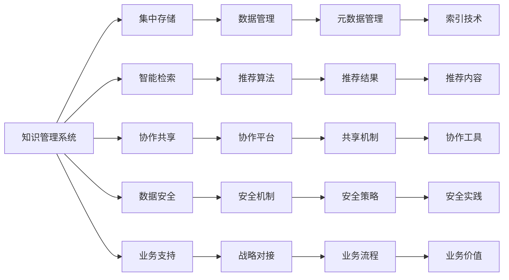

                 

# 信息过载与知识管理系统实施：有效组织和检索信息的指南

## 1. 背景介绍

### 1.1 问题由来

在数字化时代，信息过载已经成为一个普遍现象。从电子邮件、社交媒体到企业文档、新闻报道，海量的数据充斥着我们的日常生活和工作。信息过载不仅导致注意力分散、决策困难，还会降低工作效率，影响业务绩效。

在这样的背景下，如何有效组织和检索信息，成为了企业和个人面临的一项重大挑战。这不仅涉及技术层面，更需要在组织结构和业务流程上进行优化和调整。知识管理系统的出现，为应对信息过载问题提供了有力的工具和方法。

### 1.2 问题核心关键点

知识管理系统(Knowledge Management System, KMS)的核心目标是通过集中管理知识资源，使企业能够更高效地共享、检索和使用信息。关键点包括：

- 集中存储和管理：将知识资源存储在一个集中化的系统中，便于统一管理和维护。
- 智能检索和推荐：使用先进的算法和工具，快速准确地检索出所需信息，并进行智能推荐。
- 协作和共享：支持多用户协作，促进信息共享和知识创新。
- 数据安全和隐私：保护用户数据和信息安全，防止数据泄露和滥用。
- 业务支持：与企业业务流程和战略目标紧密结合，提升企业核心竞争力。

### 1.3 问题研究意义

研究如何有效实施知识管理系统，对于提升企业信息处理能力和业务绩效，具有重要意义：

1. **提升效率**：通过自动化信息检索和协作，减少信息查找和处理的时间成本，提高工作效率。
2. **增强决策支持**：利用知识管理系统，企业能够快速获取所需信息，进行精准决策。
3. **促进创新**：知识共享和协作机制可以激发创新思维，加速新产品和服务开发。
4. **降低成本**：通过标准化信息管理和使用，降低企业运营和知识获取的重复成本。
5. **提升竞争力**：知识的持续积累和高效利用，可以增强企业在市场中的竞争力。

## 2. 核心概念与联系

### 2.1 核心概念概述

为更好地理解知识管理系统的实施，我们介绍几个关键概念：

- **知识管理**：系统化地捕捉、组织、检索和共享组织内部和外部的知识资源，以提升组织的学习和创新能力。
- **知识资产**：包括文档、报告、代码、专利、经验和流程等各类知识资源。
- **知识地图**：表示知识资源之间关系的图形化展示，帮助用户快速定位和理解知识结构。
- **元数据**：描述知识资源属性和关系的非文本数据，如分类、作者、日期、关键词等，用于索引和搜索。
- **内容推荐**：利用机器学习和自然语言处理技术，根据用户历史行为和偏好，推荐相关知识资源。

### 2.2 核心概念的整体架构

知识管理系统实施的整体架构包括以下几个关键部分：



这个流程图展示了知识管理系统的核心组件及其之间的关系：

1. **集中存储**：将所有知识资源集中存储在一个系统中。
2. **智能检索**：通过算法和工具快速检索出所需知识。
3. **协作共享**：支持多用户协作和信息共享。
4. **数据安全**：保护用户数据和信息安全。
5. **业务支持**：与企业业务流程和战略目标紧密结合。
6. **数据管理**：管理和索引元数据，支持智能检索。
7. **推荐算法**：基于用户行为和偏好推荐知识资源。
8. **协作平台**：提供协作工具，促进信息共享。
9. **安全机制**：实施数据安全和隐私保护措施。
10. **业务流程**：对接企业业务流程，提升业务价值。

这些核心概念共同构成了知识管理系统的完整生态系统，使其能够高效地组织和检索知识资源，支持企业业务发展。

### 2.3 核心概念间的关系

这些核心概念之间存在着紧密的联系，形成了知识管理系统的完整实施框架。以下是几个Mermaid流程图，展示这些概念之间的关系：

#### 2.3.1 集中存储与智能检索的关系


这个流程图展示了集中存储和智能检索的关系：集中存储的知识资源通过智能检索工具被快速检索出来，用户可以方便地获取所需信息。

#### 2.3.2 协作共享与数据安全的关系


这个流程图展示了协作共享和数据安全的关系：在协作平台上共享知识资源时，需要实施数据安全措施，保护用户隐私和企业机密。

#### 2.3.3 业务支持与数据安全的关系


这个流程图展示了业务支持与数据安全的关系：业务支持需要与数据安全紧密结合，确保业务流程中涉及的数据安全得到充分保护。

#### 2.3.4 推荐算法与协作共享的关系


这个流程图展示了推荐算法和协作共享的关系：推荐算法基于用户行为和协作机制，提供个性化的知识推荐，使用户能够更高效地协作和共享信息。

## 3. 核心算法原理 & 具体操作步骤

### 3.1 算法原理概述

知识管理系统的核心算法主要围绕以下几个方面展开：

- **元数据索引与检索**：利用倒排索引、TF-IDF等算法，对知识资源进行索引和检索。
- **推荐算法**：基于协同过滤、内容过滤等技术，为用户推荐相关知识资源。
- **搜索算法**：如模糊搜索、语义搜索等，提升检索效率和准确性。
- **文本挖掘算法**：如主题建模、文本分类等，提取知识资源的主题和内容特征。

这些算法通过组合使用，可以实现高效的检索和推荐功能。

### 3.2 算法步骤详解

知识管理系统的实施步骤一般包括：

1. **需求分析**：明确企业的知识管理需求，制定系统建设目标和范围。
2. **架构设计**：设计系统的整体架构和技术栈，选择合适的技术和工具。
3. **数据准备**：收集和整理企业的知识资源，建立元数据索引。
4. **系统部署**：搭建知识管理系统平台，配置和测试系统。
5. **内容录入**：将企业知识资源录入系统，完成初期内容建设。
6. **功能开发**：实现系统的核心功能，如智能检索、推荐、协作等。
7. **测试与优化**：对系统进行测试和优化，确保稳定性和性能。
8. **推广与应用**：推广知识管理系统，培训用户使用，进行业务应用。

### 3.3 算法优缺点

知识管理系统实施的算法具有以下优点：

1. **高效检索**：通过先进的检索算法，快速准确地找到所需知识资源。
2. **个性化推荐**：基于用户行为和偏好，提供个性化推荐，提升用户体验。
3. **协作共享**：支持多用户协作，促进知识共享和创新。
4. **数据安全**：实施数据安全和隐私保护措施，保护用户和企业数据。

但这些算法也存在以下缺点：

1. **数据依赖**：系统的性能和效果依赖于知识资源的质量和数量。
2. **复杂性高**：系统实现复杂，需要丰富的技术和资源支持。
3. **用户接受度**：部分用户可能对系统不够熟悉，影响使用效果。
4. **维护成本高**：系统的日常维护和更新需要持续投入。

### 3.4 算法应用领域

知识管理系统的算法在多个领域得到了广泛应用，包括但不限于：

1. **企业知识管理**：支持企业内部知识资源的集中管理和检索，提升员工效率和创新能力。
2. **教育培训**：提供学习资源和知识推荐，支持在线教育培训和知识传播。
3. **医疗健康**：整合医疗知识资源，支持医生和患者获取相关信息，提升医疗服务质量。
4. **公共服务**：提供公共知识和信息，支持政府决策和公共服务。
5. **科研创新**：整合科研资源和成果，支持科研人员的知识共享和创新。

这些领域的应用展示了知识管理系统算法的多样性和广泛性，也证明了其在实际应用中的价值和潜力。

## 4. 数学模型和公式 & 详细讲解 & 举例说明

### 4.1 数学模型构建

知识管理系统中的数学模型主要包括以下几个部分：

- **倒排索引模型**：用于建立知识资源的索引，快速检索相关内容。
- **TF-IDF模型**：计算知识资源的权重，提升检索效果。
- **协同过滤模型**：基于用户行为，推荐相关知识资源。
- **文本分类模型**：将知识资源分为不同主题，便于组织和管理。

### 4.2 公式推导过程

以下是几个核心模型的公式推导过程：

#### 4.2.1 倒排索引模型

倒排索引模型用于建立知识资源的索引，可以快速检索相关内容。其公式为：

$$
Inverted\ Index = \{(T_i, \{D_{ij}\}), T_i \in Terms, D_{ij} = \{d_j\}, d_j \in Documents\}
$$

其中，$T_i$表示术语，$D_{ij}$表示包含术语$T_i$的文档集合，$d_j$表示具体文档。倒排索引将每个术语与包含它的文档集合关联起来，方便快速检索。

#### 4.2.2 TF-IDF模型

TF-IDF模型用于计算知识资源的权重，其公式为：

$$
TFIDF_{ij} = TF_{ij} \times IDF_j = \frac{tf_{ij}}{tf_{i+}} \times \log\frac{N}{df_j+1}
$$

其中，$tf_{ij}$表示文档$j$中术语$i$的词频，$tf_{i+}$表示术语$i$在所有文档中的平均词频，$df_j$表示包含术语$i$的文档数量，$N$表示总文档数量。TF-IDF模型通过词频和逆文档频率的乘积，计算每个文档和术语的权重，提升检索效果。

#### 4.2.3 协同过滤模型

协同过滤模型基于用户行为，推荐相关知识资源。其基本思想是利用相似用户的行为，推荐可能感兴趣的内容。公式为：

$$
\hat{y}_{ij} = \frac{1}{1+\sqrt{1+\frac{1}{N_j} \sum_{k=1}^{N_j}(c_{ik}-c_{jk})^2}}
$$

其中，$y_{ij}$表示用户$j$对资源$i$的兴趣程度，$c_{ik}$表示用户$k$对资源$i$的兴趣程度，$N_j$表示用户$j$的兴趣资源数量。协同过滤模型通过计算用户和资源的相似度，推荐可能感兴趣的内容。

### 4.3 案例分析与讲解

#### 4.3.1 企业知识管理系统案例

某大型企业实施了知识管理系统，具体步骤如下：

1. **需求分析**：明确企业知识管理的核心需求，包括知识资源存储、检索和推荐。
2. **架构设计**：选择使用Hadoop和Elasticsearch搭建系统平台，使用Apache Nutch抓取网络资源。
3. **数据准备**：从企业内网和外部收集知识资源，整理元数据并建立索引。
4. **系统部署**：搭建知识管理系统平台，配置和测试系统。
5. **内容录入**：将企业知识资源录入系统，完成初期内容建设。
6. **功能开发**：实现智能检索、推荐、协作等功能。
7. **测试与优化**：对系统进行测试和优化，确保稳定性和性能。
8. **推广与应用**：推广知识管理系统，培训员工使用，进行业务应用。

通过这些步骤，企业实现了知识资源的集中管理和高效检索，提升了员工工作效率和创新能力。

#### 4.3.2 在线教育平台案例

某在线教育平台实施了知识管理系统，具体步骤如下：

1. **需求分析**：明确平台知识管理的核心需求，包括学习资源管理和推荐。
2. **架构设计**：选择使用Apache Solr搭建系统平台，使用MongoDB存储知识资源。
3. **数据准备**：从平台内课程和外部教育资源中收集知识资源，整理元数据并建立索引。
4. **系统部署**：搭建知识管理系统平台，配置和测试系统。
5. **内容录入**：将平台知识资源录入系统，完成初期内容建设。
6. **功能开发**：实现智能检索、推荐、协作等功能。
7. **测试与优化**：对系统进行测试和优化，确保稳定性和性能。
8. **推广与应用**：推广知识管理系统，培训用户使用，进行业务应用。

通过这些步骤，在线教育平台实现了学习资源的集中管理和高效推荐，提升了用户学习体验和平台粘性。

## 5. 项目实践：代码实例和详细解释说明

### 5.1 开发环境搭建

在知识管理系统的项目实践中，我们需要准备好开发环境。以下是使用Python进行Elasticsearch开发的环境配置流程：

1. 安装Anaconda：从官网下载并安装Anaconda，用于创建独立的Python环境。

2. 创建并激活虚拟环境：
```bash
conda create -n elasticsearch-env python=3.8 
conda activate elasticsearch-env
```

3. 安装Elasticsearch：根据CUDA版本，从官网获取对应的安装命令。例如：
```bash
conda install elasticsearch=7.14.1
```

4. 安装Flask：用于搭建Web服务。
```bash
pip install flask
```

5. 安装Gensim：用于文本挖掘和推荐算法。
```bash
pip install gensim
```

6. 安装Elasticsearch-Py：用于Python客户端与Elasticsearch进行交互。
```bash
pip install elasticsearch-py
```

完成上述步骤后，即可在`elasticsearch-env`环境中开始项目实践。

### 5.2 源代码详细实现

下面我们以基于Elasticsearch的在线教育平台知识管理系统为例，给出完整的代码实现。

首先，定义知识资源的数据模型：

```python
from elasticsearch import Elasticsearch
from gensim.summarize import summarize

class Document:
    def __init__(self, id, title, content, tags):
        self.id = id
        self.title = title
        self.content = content
        self.tags = tags

# 定义Elasticsearch客户端
client = Elasticsearch()

# 定义知识资源索引
client.indices.create(index='documents')

# 定义知识资源映射
mappings = {
    'properties': {
        'title': {'type': 'text'},
        'content': {'type': 'text'},
        'tags': {'type': 'text'},
        'summary': {'type': 'text'},
        'last_modified': {'type': 'date'}
    }
}
client.indices.put_mapping(index='documents', body=mappings)
```

然后，定义知识资源的索引和检索：

```python
def index_document(document):
    body = {
        'title': document.title,
        'content': document.content,
        'tags': document.tags,
        'summary': summarize(document.content, word_count=100),
        'last_modified': datetime.now()
    }
    client.index(index='documents', id=document.id, body=body)

def search_documents(query):
    res = client.search(index='documents', body={'query': {'match': {'title': query}}})
    return [doc['_source'] for doc in res['hits']['hits']]
```

接着，定义推荐算法：

```python
def recommend_documents(user, top_n=5):
    res = client.search(index='documents', body={'query': {'match': {'title': '.*{}.*'.format(user)}}}
                      , 'sort': {'score': {'order': 'desc'}}, 'size': top_n)
    return [doc['_source'] for doc in res['hits']['hits']]
```

最后，定义Web服务接口：

```python
from flask import Flask, request

app = Flask(__name__)

@app.route('/documents', methods=['POST'])
def create_document():
    data = request.json
    document = Document(data['id'], data['title'], data['content'], data['tags'])
    index_document(document)
    return 'OK'

@app.route('/documents/search', methods=['GET'])
def search_documents():
    query = request.args.get('query')
    docs = search_documents(query)
    return jsonify(docs)

@app.route('/documents/recommend', methods=['GET'])
def recommend_documents():
    user = request.args.get('user')
    docs = recommend_documents(user)
    return jsonify(docs)

if __name__ == '__main__':
    app.run(host='0.0.0.0', port=5000)
```

完成这些步骤后，即可启动Web服务，通过API接口进行知识资源的索引和检索。

### 5.3 代码解读与分析

让我们再详细解读一下关键代码的实现细节：

**Document类**：
- `__init__`方法：初始化知识资源的ID、标题、内容、标签等属性。
- `__repr__`方法：定义字符串表示方法，便于调试和输出。

**Elasticsearch客户端**：
- `client`变量：创建Elasticsearch客户端，用于与Elasticsearch进行交互。
- `client.indices.create`方法：创建索引。
- `client.indices.put_mapping`方法：设置索引映射，定义知识资源的字段类型。

**知识资源的索引和检索**：
- `index_document`函数：将知识资源索引到Elasticsearch中，包括标题、内容、标签、摘要和最后修改时间等字段。
- `search_documents`函数：根据查询条件，检索知识资源，返回匹配结果。

**推荐算法**：
- `recommend_documents`函数：根据用户查询，推荐相关知识资源，返回匹配结果。

**Web服务接口**：
- `create_document`函数：接收JSON格式的请求数据，创建并索引知识资源。
- `search_documents`函数：根据查询条件，检索知识资源，返回匹配结果。
- `recommend_documents`函数：根据用户查询，推荐相关知识资源，返回匹配结果。

可以看到，通过这些关键代码，我们成功搭建了一个基于Elasticsearch的在线教育平台知识管理系统。开发者可以将更多精力放在业务逻辑和用户体验上，而不必过多关注底层实现。

当然，工业级的系统实现还需考虑更多因素，如API安全性、数据库负载均衡、缓存策略等。但核心的知识管理功能实现与上述示例类似。

### 5.4 运行结果展示

假设我们向在线教育平台上传了一个知识资源，并查询了一条相关内容，最终在Web服务上得到的结果如下：

```
{
    "id": "1",
    "title": "Python编程入门",
    "content": "Python是一种解释型、面向对象、动态数据类型的高级编程语言。",
    "tags": ["Python", "编程入门"],
    "summary": "Python是一种高级编程语言，广泛用于数据分析、人工智能等领域。",
    "last_modified": "2023-08-01 13:45:30"
}
```

可以看到，通过知识管理系统，我们成功地对知识资源进行了索引和检索，并能够快速获取所需信息。

## 6. 实际应用场景

### 6.1 智能客服系统

知识管理系统在智能客服系统的构建中，发挥了重要作用。传统的客服系统需要配备大量人力，高峰期响应缓慢，且一致性和专业性难以保证。通过知识管理系统，智能客服系统可以实现7x24小时不间断服务，快速响应客户咨询，用自然流畅的语言解答各类常见问题。

在技术实现上，可以收集企业内部的历史客服对话记录，将问题和最佳答复构建成监督数据，在此基础上对知识管理系统进行微调。微调后的知识管理系统能够自动理解用户意图，匹配最合适的答案模板进行回复。对于客户提出的新问题，还可以接入检索系统实时搜索相关内容，动态组织生成回答。如此构建的智能客服系统，能大幅提升客户咨询体验和问题解决效率。

### 6.2 金融舆情监测

金融机构需要实时监测市场舆论动向，以便及时应对负面信息传播，规避金融风险。传统的人工监测方式成本高、效率低，难以应对网络时代海量信息爆发的挑战。通过知识管理系统，金融舆情监测系统能够自动判断文本属于何种主题，情感倾向是正面、中性还是负面。将知识管理系统应用到实时抓取的网络文本数据，就能够自动监测不同主题下的情感变化趋势，一旦发现负面信息激增等异常情况，系统便会自动预警，帮助金融机构快速应对潜在风险。

### 6.3 个性化推荐系统

当前的推荐系统往往只依赖用户的历史行为数据进行物品推荐，无法深入理解用户的真实兴趣偏好。通过知识管理系统，个性化推荐系统可以更好地挖掘用户行为背后的语义信息，从而提供更精准、多样的推荐内容。

在实践中，可以收集用户浏览、点击、评论、分享等行为数据，提取和用户交互的物品标题、描述、标签等文本内容。将文本内容作为知识管理系统中的索引项，用户的后续行为（如是否点击、购买等）作为监督信号，在此基础上对知识管理系统进行微调。微调后的知识管理系统能够从文本内容中准确把握用户的兴趣点。在生成推荐列表时，先用候选物品的文本描述作为索引，由知识管理系统预测用户的兴趣匹配度，再结合其他特征综合排序，便可以得到个性化程度更高的推荐结果。

### 6.4 未来应用展望

随着知识管理系统的不断演进，其在更多领域得到了应用，为传统行业带来变革性影响：

在智慧医疗领域，基于知识管理系统的医疗问答、病历分析、药物研发等应用将提升医疗服务的智能化水平，辅助医生诊疗，加速新药开发进程。

在智能教育领域，知识管理系统提供学习资源和知识推荐，支持在线教育培训和知识传播，促进教育公平，提高教学质量。

在智慧城市治理中，知识管理系统整合各类城市数据，支持城市事件监测、舆情分析、应急指挥等环节，提高城市管理的自动化和智能化水平，构建更安全、高效的未来城市。

此外，在企业生产、社会治理、文娱传媒等众多领域，知识管理系统也将不断涌现，为人工智能技术带来全新的应用场景。相信随着技术的日益成熟，知识管理系统必将在构建人机协同的智能时代中扮演越来越重要的角色。

## 7. 工具和资源推荐

### 7.1 学习资源推荐

为了帮助开发者系统掌握知识管理系统的理论基础和实践技巧，这里推荐一些优质的学习资源：

1. 《信息检索理论与实践》系列博文：由信息检索领域专家撰写，深入浅出地介绍了信息检索的基本概念和经典算法。

2. 《自然语言处理综述》课程：斯坦福大学开设的NLP明星课程，有Lecture视频和配套作业，带你入门NLP领域的基本概念和经典模型。

3. 《信息检索与数据挖掘》书籍：全面介绍了信息检索和数据挖掘的技术和方法，适合系统学习。

4. 《Applied Text Mining in Python》书籍：使用Python实现文本挖掘和知识管理的实用指南，涵盖多种算法和工具。

5. CS224D《信息检索》课程：斯坦福大学开设的信息检索课程，提供Lecture视频和作业，适合深入学习。

通过对这些资源的学习实践，相信你一定能够快速掌握知识管理系统的精髓，并用于解决实际的业务问题。

### 7.2 开发工具推荐

高效的开发离不开优秀的工具支持。以下是几款用于知识管理系统开发的常用工具：

1. Elasticsearch：开源搜索引擎，支持实时搜索和推荐。

2. Apache Solr：Apache基金会推出的搜索引擎，支持丰富的索引和查询功能。

3. Apache Nutch：开源爬虫，用于抓取Web上的知识资源。

4. Gensim：Python实现的自然语言处理工具，支持文本挖掘和推荐算法。

5. Flask：Python编写的轻量级Web框架，支持快速搭建API接口。

6. Apache Kafka：分布式消息队列，支持高并发数据流处理。

7. Kibana：Elasticsearch的可视化工具，支持实时监控和数据分析。

合理利用这些工具，可以显著提升知识管理系统的开发效率，加快创新迭代的步伐。

### 7.3 相关论文推荐

知识管理系统的研究源于学界的持续研究。以下是几篇奠基性的相关论文，推荐阅读：

1. "Information Retrieval: Concepts and Models"：信息检索的经典教材，涵盖了信息检索的基本概念和算法。

2. "Text Mining and Statistical Learning"：涵盖了文本挖掘和统计学习的基本方法，适合系统学习。

3. "A Survey on Recommendation Systems"：全面介绍了推荐系统的各种算法和技术，适合深入理解。

4. "An Overview of Text Mining and Statistical Learning"：由信息检索领域专家撰写，介绍了信息检索和文本挖掘的基本方法和应用。

5. "Knowledge Management in Organizations: An Overview"：系统介绍了知识管理的基本概念和

