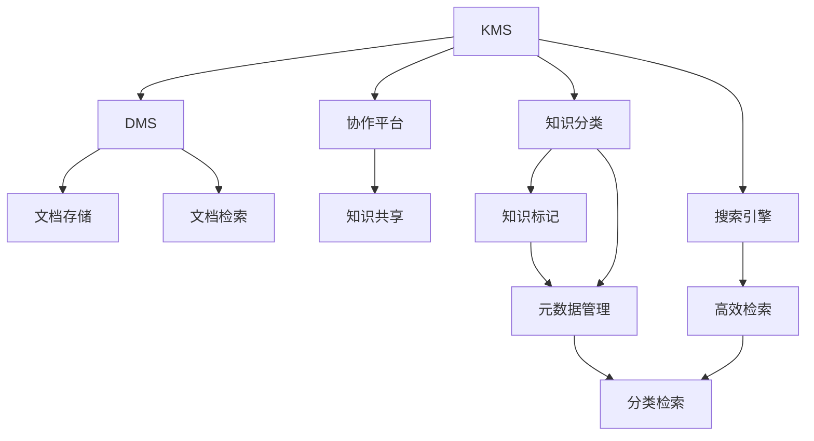

                 

# 信息过载与知识管理系统实施：管理和组织信息以提高生产力

在数字化信息时代，信息过载问题日益严重，而企业面临着海量数据的存储和处理难题。如何有效管理和组织这些信息，以提升生产力，成为当前迫切需要解决的问题。知识管理系统（Knowledge Management System, KMS）正是为了应对这一挑战而发展起来的。本文将系统性地探讨信息过载问题，详细解析知识管理系统的原理和应用，并提供具体的实施步骤，以期帮助企业克服信息过载，提升组织效率。

## 1. 背景介绍

### 1.1 问题由来

在现代企业中，信息已无处不在，无论是客户反馈、市场数据、内部文档还是员工日常通信，都形成了庞大的信息流。这些信息在企业日常运营中扮演着重要角色，但同时也带来了巨大的挑战。信息过载（Information Overload）指的是人们接收到的信息量超过其处理能力，导致无法有效利用这些信息，甚至出现决策偏差、效率低下等问题。

### 1.2 问题核心关键点

信息过载的核心在于如何管理和组织这些信息，使得信息能够被快速获取、整合和利用。信息管理涉及以下几个关键点：

- 信息的采集与存储：如何高效地收集和存储各种信息源。
- 信息的检索与检索：如何快速定位所需信息，避免在海量数据中盲目搜索。
- 信息的整合与展示：如何将不同来源、不同格式的信息整合成统一的视图，便于分析和应用。
- 信息的共享与协作：如何让信息在不同部门、团队之间共享，促进协作和创新。

### 1.3 问题研究意义

在信息过载的背景下，知识管理系统的实施具有重要的战略意义：

- **提高信息利用效率**：通过系统化管理信息，确保信息能够被及时、准确地利用，从而提升工作效率。
- **促进知识共享与创新**：知识管理系统为员工提供了知识交流的平台，促进跨部门、跨团队的协作与创新。
- **提升决策质量**：知识管理系统的应用有助于将知识整合到决策过程中，减少信息偏见，提高决策质量。
- **增强企业竞争力**：知识管理系统能够帮助企业更好地应对市场变化，快速响应客户需求，增强企业竞争力。

## 2. 核心概念与联系

### 2.1 核心概念概述

为了更好地理解知识管理系统（KMS）的实施，我们先要了解一些核心概念：

- **知识管理系统（KMS）**：一个用于收集、存储、检索、共享和管理知识的系统。
- **文档管理系统（DMS）**：用于存储和组织文档的KMS子系统。
- **协作平台（Collaboration Platform）**：促进团队协作、知识共享的工具。
- **搜索引擎（Search Engine）**：提供高效信息检索功能的KMS组件。
- **知识分类与元数据管理**：对知识进行分类、标记和元数据管理，便于检索和应用。

这些概念紧密相关，共同构成了知识管理系统的基本框架。

### 2.2 概念间的关系

这些核心概念之间的关系可以通过以下Mermaid流程图来展示：



这个流程图展示了KMS各组件之间的逻辑关系：

1. **文档管理系统（DMS）**：用于存储和检索文档，是KMS的核心组成部分。
2. **协作平台**：促进团队协作，实现知识共享。
3. **搜索引擎**：提供高效的信息检索功能，支持快速定位信息。
4. **知识分类与元数据管理**：对知识进行分类、标记和元数据管理，便于检索和应用。

这些组件相互协作，共同构成了一个功能完善的KMS系统。

## 3. 核心算法原理 & 具体操作步骤

### 3.1 算法原理概述

知识管理系统实施的核心算法包括信息检索、知识分类、知识地图构建和协作平台优化等。这些算法共同作用，使得知识管理系统能够高效地管理和利用信息。

**信息检索算法**：基于自然语言处理（NLP）和信息检索技术，实现对文档和信息的快速检索。
**知识分类算法**：通过机器学习或规则引擎，对知识进行分类和标记，便于检索和应用。
**知识地图构建算法**：利用图形化工具，构建知识图谱和关联关系，帮助用户快速定位和理解信息。
**协作平台优化算法**：通过社交网络分析和推荐系统，促进团队协作和知识共享。

### 3.2 算法步骤详解

以下将详细介绍知识管理系统实施的关键步骤：

**Step 1: 需求分析与规划**

- 识别企业内外的信息需求和痛点。
- 明确知识管理系统的目标和预期效果。
- 规划系统的架构和功能模块。

**Step 2: 数据集成与清洗**

- 收集和整理企业内外部的信息源，包括文档、邮件、会议记录等。
- 对数据进行清洗和格式化，去除冗余和错误信息。
- 整合不同来源的数据，形成统一的信息库。

**Step 3: 知识分类与元数据管理**

- 对知识进行分类和标记，如按照主题、类型、优先级等标准。
- 管理知识的元数据，包括文档的作者、创建时间、修改时间等。
- 实现知识分类和元数据的管理和检索，支持快速查询和应用。

**Step 4: 信息检索与搜索引擎优化**

- 基于NLP技术，实现文档和信息的智能检索。
- 优化搜索引擎算法，提高检索的准确性和速度。
- 提供高级搜索功能，如全文搜索、高级筛选等。

**Step 5: 知识地图构建与可视化**

- 构建知识图谱和关联关系，形成知识地图。
- 使用图形化工具，将知识地图可视化，便于理解和应用。
- 提供导航和搜索功能，帮助用户快速定位知识。

**Step 6: 协作平台设计与优化**

- 设计协作平台，支持团队协作、讨论和知识共享。
- 集成社交网络分析，推荐系统等工具，优化协作体验。
- 提供知识共享和版本控制功能，确保知识更新和传播。

**Step 7: 知识应用与评估**

- 实现知识的应用功能，如知识库查询、知识推送等。
- 提供知识应用的评估工具，监控和分析知识应用效果。
- 根据评估结果，不断优化知识管理系统，提升信息利用效率。

### 3.3 算法优缺点

**优点**：

- **高效的信息检索**：通过搜索引擎和NLP技术，实现快速、准确的信息检索。
- **知识共享与协作**：协作平台支持团队协作和知识共享，促进创新和效率提升。
- **知识分类与元数据管理**：通过分类和元数据管理，提高信息检索和应用的效率。
- **知识地图可视化**：通过知识地图，帮助用户快速定位和理解知识。

**缺点**：

- **数据质量依赖**：知识管理系统依赖于高质量的数据输入，数据质量差会导致系统效果不佳。
- **技术复杂度高**：系统设计和实施过程技术复杂，需要专业的技术团队支持。
- **成本高**：系统开发和维护成本较高，尤其是大型的知识管理系统。
- **用户习惯改变**：知识管理系统的应用需要用户习惯的改变，可能面临用户接受度低的问题。

### 3.4 算法应用领域

知识管理系统在多个领域中得到了广泛应用，包括但不限于：

- **企业内外部知识管理**：帮助企业内部和外部知识共享和协作，提升创新能力。
- **科研知识管理**：支持科研团队的知识共享和协作，提高科研效率和质量。
- **教育知识管理**：帮助教育机构进行知识共享和教学资源管理，提升教学质量。
- **医疗知识管理**：支持医疗机构的知识共享和协作，提升医疗水平和服务质量。
- **政府知识管理**：帮助政府机构进行知识共享和政策制定，提高治理能力。

## 4. 数学模型和公式 & 详细讲解

### 4.1 数学模型构建

知识管理系统涉及多个模块，每个模块的数学模型构建都有其独特之处。这里以信息检索和知识分类为例，进行详细讲解。

**信息检索模型**：

信息检索的目标是通过用户查询，找到最相关的文档或信息。常见的信息检索模型包括向量空间模型（Vector Space Model, VSM）和基于语义的检索模型（Semantic-based Retrieval Model）。

向量空间模型将文档和查询表示为高维向量，计算它们之间的余弦相似度，从而找到最相关的文档。数学公式如下：

$$
\text{cosine similarity} = \frac{\mathbf{q} \cdot \mathbf{d}}{\|\mathbf{q}\| \cdot \|\mathbf{d}\|}
$$

其中，$\mathbf{q}$ 表示查询向量，$\mathbf{d}$ 表示文档向量。

基于语义的检索模型则通过NLP技术，对查询和文档进行语义分析，匹配它们的语义相似度。这种模型可以处理自然语言查询，更符合用户习惯。

**知识分类模型**：

知识分类的目标是将文档和信息归类到预定义的类别中。常见的分类模型包括决策树、支持向量机（SVM）和深度学习模型。

决策树模型通过树状结构，将数据划分到不同的类别中。支持向量机则通过构建超平面，将数据划分到不同的类别中。深度学习模型如卷积神经网络（CNN）和循环神经网络（RNN），可以处理复杂的数据特征，实现更精准的分类。

### 4.2 公式推导过程

**信息检索模型推导**：

以向量空间模型为例，设查询向量 $\mathbf{q}$ 和文档向量 $\mathbf{d}$ 的维度为 $n$，则余弦相似度计算公式为：

$$
\text{cosine similarity} = \frac{\sum_{i=1}^{n} q_i \cdot d_i}{\sqrt{\sum_{i=1}^{n} q_i^2} \cdot \sqrt{\sum_{i=1}^{n} d_i^2}}
$$

其中，$q_i$ 和 $d_i$ 分别表示查询向量和文档向量的第 $i$ 个维度。

**知识分类模型推导**：

以支持向量机为例，设训练集为 $\{(\mathbf{x}_i, y_i)\}_{i=1}^{m}$，其中 $\mathbf{x}_i$ 表示样本向量，$y_i$ 表示类别标签。假设模型参数为 $\theta$，则分类函数为：

$$
\text{sign}(\mathbf{x} \cdot \theta + b) = \text{sign}(\sum_{i=1}^{n} x_i \theta_i + b)
$$

其中，$n$ 表示向量维度，$b$ 表示偏置项。

### 4.3 案例分析与讲解

**案例1: 信息检索**

假设我们有一个新闻网站，用户希望快速找到关于某公司的新闻。我们可以构建一个信息检索系统，使用向量空间模型进行检索。首先，我们将所有公司的新闻文章表示为向量，用户输入的公司名称作为查询向量。然后，计算查询向量与所有新闻向量的余弦相似度，找到最相关的文章。

**案例2: 知识分类**

假设我们有一个科研机构，希望将科研论文分类到不同的学科领域。我们可以构建一个知识分类系统，使用支持向量机进行分类。首先，我们收集所有论文的标题、摘要等文本信息，并将其转换为向量。然后，构建一个支持向量机模型，将论文向量映射到不同的学科领域标签。

## 5. 项目实践：代码实例和详细解释说明

### 5.1 开发环境搭建

在搭建知识管理系统的开发环境时，我们需要考虑以下几个方面：

1. **开发语言和框架**：选择Python、Java或C#等编程语言，以及相应的开发框架，如Django、Spring等。
2. **数据库**：选择合适的数据库系统，如MySQL、PostgreSQL或MongoDB。
3. **搜索引擎**：选择流行的搜索引擎，如Elasticsearch、Solr等。
4. **协作平台**：选择支持团队协作的工具，如Confluence、Slack等。
5. **可视化工具**：选择可视化工具，如Tableau、Power BI等，用于知识地图的构建。

### 5.2 源代码详细实现

以下是一个基于Python和Django框架的知识管理系统的源代码实现。

首先，我们需要创建一个Django项目：

```bash
django-admin startproject kms_project
cd kms_project
```

然后，创建一个Django应用：

```bash
python manage.py startapp docs
```

接下来，配置数据库和搜索引擎：

```python
# settings.py
DATABASES = {
    'default': {
        'ENGINE': 'django.db.backends.mysql',
        'NAME': 'kms_project',
        'USER': 'root',
        'PASSWORD': 'password',
        'HOST': 'localhost',
        'PORT': '3306',
    }
}

INSTALLED_APPS = [
    'django.contrib.admin',
    'django.contrib.auth',
    'django.contrib.contenttypes',
    'django.contrib.sessions',
    'django.contrib.messages',
    'django.contrib.staticfiles',
    'docs',
]

SEARCH_ENGINE = 'elasticsearch'
```

接着，实现文档管理模块：

```python
# models.py
from django.db import models
from django.contrib.contenttypes.fields import GenericForeignKey
from django.contrib.contenttypes.models import ContentType

class Document(models.Model):
    title = models.CharField(max_length=255)
    content = models.TextField()
    created_at = models.DateTimeField(auto_now_add=True)
    updated_at = models.DateTimeField(auto_now=True)

    class Meta:
        ordering = ('-created_at',)

    def __str__(self):
        return self.title

class DocumentMetadata(models.Model):
    document = models.ForeignKey(Document, on_delete=models.CASCADE)
    content_type = models.ForeignKey(ContentType, on_delete=models.CASCADE)
    object_id = models.PositiveIntegerField()
    content_object = GenericForeignKey('content_type', 'object_id')
```

然后，实现搜索引擎模块：

```python
# views.py
from django.shortcuts import render
from django.http import JsonResponse
from django.contrib.auth.decorators import login_required
from search import ElasticSearch

@login_required
def search(request):
    query = request.GET.get('q')
    search = ElasticSearch()
    results = search.search(query)
    return JsonResponse(results, safe=False)
```

最后，实现协作平台模块：

```python
# views.py
from django.shortcuts import render
from django.contrib.auth.decorators import login_required
from django.http import JsonResponse

@login_required
def discussion(request):
    return render(request, 'discussion.html')
```

### 5.3 代码解读与分析

**文档管理模块**：

- `Document` 模型：表示文档，包括标题、内容和创建/更新时间。
- `DocumentMetadata` 模型：用于存储文档的元数据，如创建者、创建时间等。

**搜索引擎模块**：

- `ElasticSearch` 类：用于连接和操作Elasticsearch搜索引擎，实现高效的信息检索。
- `search` 函数：根据查询字符串，在Elasticsearch中搜索文档，并返回搜索结果。

**协作平台模块**：

- `discussion` 函数：渲染讨论页面，支持团队协作和知识共享。

### 5.4 运行结果展示

假设我们已经搭建好知识管理系统，并上传了几篇文档。用户可以通过搜索框输入关键词，快速找到相关文档。同时，可以在讨论页面上查看和分享文档，进行团队协作。

## 6. 实际应用场景

### 6.1 智能客服系统

智能客服系统利用知识管理系统，实现自动化的客户问题解答。系统将客户咨询的问题自动分类，并从知识库中匹配最相关的答案，提供快速响应。通过不断积累和更新知识库，智能客服系统能够提供越来越精准的解答，提升客户满意度。

### 6.2 医疗知识管理

医疗知识管理系统帮助医疗机构存储和管理各种医疗知识，包括病历、临床指南、药品信息等。医生可以通过搜索功能快速找到所需信息，辅助诊断和治疗。同时，知识管理系统支持多团队协作，促进医疗知识的共享和更新，提升医疗水平和服务质量。

### 6.3 企业知识库

企业知识管理系统帮助企业存储和共享内部知识，包括文档、会议记录、员工培训资料等。通过知识分类和元数据管理，企业可以快速找到所需信息，提升工作效率。同时，知识管理系统支持团队协作和知识共享，促进创新和团队合作。

### 6.4 未来应用展望

未来，知识管理系统的应用将更加广泛和深入。随着技术的进步，系统将具备更强的智能化和自动化能力，能够更好地服务于企业和个人。以下是几个未来应用展望：

- **智能推荐系统**：利用机器学习和深度学习技术，实现个性化推荐，提高信息利用效率。
- **多语言支持**：支持多语言搜索和文档管理，拓展知识管理系统的应用范围。
- **情感分析**：通过情感分析技术，理解用户的情感和需求，提供更贴心的服务。
- **AI辅助协作**：利用AI技术，辅助团队协作和知识共享，提升协作效率。
- **区块链技术**：利用区块链技术，保障知识管理的透明性和安全性，防止信息篡改和滥用。

## 7. 工具和资源推荐

### 7.1 学习资源推荐

为了帮助开发者掌握知识管理系统的实现，这里推荐一些优质的学习资源：

1. **《知识管理理论与实践》**：一本系统介绍知识管理理论和实践的书籍，适合深入学习。
2. **Coursera《信息管理与技术》**：斯坦福大学开设的课程，涵盖信息管理和技术的基础知识。
3. **Udemy《知识管理系统构建》**：提供从零开始的知识管理系统构建教程，适合初学者。
4. **Django官方文档**：Django框架的官方文档，提供详细的开发指南和API文档。
5. **Elasticsearch官方文档**：Elasticsearch搜索引擎的官方文档，提供丰富的使用教程和示例代码。

### 7.2 开发工具推荐

为了提高知识管理系统的开发效率，这里推荐一些常用的开发工具：

1. **PyCharm**：一款强大的Python开发工具，提供智能代码补全、调试和版本控制等功能。
2. **Git**：一款广泛使用的版本控制系统，提供分布式管理和协作功能。
3. **JIRA**：一款流行的项目管理工具，支持任务分配、进度跟踪和报告生成。
4. **Tableau**：一款数据可视化工具，支持创建交互式报表和仪表板。
5. **Slack**：一款流行的团队协作工具，支持即时消息、文件共享和搜索功能。

### 7.3 相关论文推荐

为了深入理解知识管理系统，以下是几篇重要的相关论文：

1. **《知识管理系统的理论与实践》**：全面介绍了知识管理系统的理论和实践，提供了丰富的案例和解决方案。
2. **《信息检索技术的发展与展望》**：介绍了信息检索技术的发展历程和未来趋势，提供了前沿的研究方向和应用实例。
3. **《基于深度学习的知识分类研究》**：探讨了深度学习在知识分类中的应用，提供了新的分类模型和算法。
4. **《协作平台设计与应用》**：介绍了协作平台的设计和应用，提供了丰富的案例和最佳实践。
5. **《知识管理系统的智能化和自动化》**：探讨了知识管理系统的智能化和自动化技术，提供了新的技术方向和应用实例。

## 8. 总结：未来发展趋势与挑战

### 8.1 研究成果总结

本文对信息过载和知识管理系统的实施进行了系统性的探讨，详细解析了知识管理系统的原理和应用，提供了具体的实施步骤。通过对知识管理系统各个模块的详细分析，展示了知识管理系统的应用潜力和前景。

### 8.2 未来发展趋势

未来，知识管理系统将继续向智能化和自动化方向发展，主要趋势包括：

1. **智能化推荐系统**：利用机器学习和深度学习技术，实现个性化推荐，提高信息利用效率。
2. **多语言支持**：支持多语言搜索和文档管理，拓展知识管理系统的应用范围。
3. **情感分析**：通过情感分析技术，理解用户的情感和需求，提供更贴心的服务。
4. **AI辅助协作**：利用AI技术，辅助团队协作和知识共享，提升协作效率。
5. **区块链技术**：利用区块链技术，保障知识管理的透明性和安全性，防止信息篡改和滥用。

### 8.3 面临的挑战

尽管知识管理系统的应用前景广阔，但在实施过程中仍面临一些挑战：

1. **数据质量依赖**：知识管理系统依赖于高质量的数据输入，数据质量差会导致系统效果不佳。
2. **技术复杂度高**：系统设计和实施过程技术复杂，需要专业的技术团队支持。
3. **成本高**：系统开发和维护成本较高，尤其是大型的知识管理系统。
4. **用户习惯改变**：知识管理系统的应用需要用户习惯的改变，可能面临用户接受度低的问题。

### 8.4 研究展望

未来，知识管理系统将继续在多个领域中得到应用和推广。为了更好地应对信息过载问题，知识管理系统需要在以下几个方面进行改进和创新：

1. **数据质量提升**：建立数据质量控制机制，确保知识管理系统的高效运行。
2. **技术平台升级**：引入更先进的技术平台，如AI、区块链等，提升知识管理系统的智能化和安全性。
3. **用户体验优化**：通过用户反馈和行为分析，不断优化知识管理系统的界面和功能，提升用户体验。
4. **知识管理标准化**：制定知识管理系统的标准化流程和规范，促进知识管理的规范化。
5. **行业应用深化**：在更多行业中进行应用推广和优化，探索知识管理系统的应用深度和广度。

总之，知识管理系统的应用前景广阔，未来需要不断创新和优化，才能更好地应对信息过载问题，提升企业和个人的信息利用效率。

## 9. 附录：常见问题与解答

**Q1: 如何选择合适的知识管理系统？**

A: 选择合适的知识管理系统需要考虑以下几个因素：

- **企业需求**：根据企业的业务需求和技术现状，选择适合的知识管理系统。
- **功能模块**：选择具有完善功能模块的知识管理系统，如文档管理、搜索引擎、协作平台等。
- **可扩展性**：选择可扩展的知识管理系统，能够根据企业需求进行二次开发和定制。
- **用户友好性**：选择用户友好的知识管理系统，便于员工快速上手和使用。

**Q2: 知识管理系统的实施需要多长时间？**

A: 知识管理系统的实施时间因企业规模、数据量和需求复杂度等因素而异。一般而言，需要以下步骤：

1. **需求分析**：2-4周。
2. **数据集成与清洗**：4-8周。
3. **系统开发**：8-12周。
4. **测试与部署**：4-6周。
5. **培训与上线**：2-4周。

整体实施周期一般在2-4个月左右，但实际时间可能更长。

**Q3: 知识管理系统的开发难点有哪些？**

A: 知识管理系统的开发难点主要包括以下几个方面：

1. **数据质量**：数据质量差会导致系统效果不佳，需要建立数据质量控制机制。
2. **技术复杂性**：系统设计和实现过程技术复杂，需要专业的技术团队支持。
3. **用户接受度**：知识管理系统的应用需要用户习惯的改变，可能面临用户接受度低的问题。
4. **成本控制**：系统开发和维护成本较高，需要合理控制成本。

**Q4: 知识管理系统应该如何进行维护？**

A: 知识管理系统的维护包括以下几个方面：

1. **数据更新**：定期更新系统中的文档和信息，保持数据的实时性。
2. **系统升级**：根据业务需求和技术发展，对系统进行升级和优化。
3. **用户培训**：定期进行用户培训，提升用户对系统的熟练度。
4. **问题反馈**：建立问题反馈机制，及时解决用户在使用过程中遇到的问题。
5. **安全保障**：加强安全保障，防止信息泄露和滥用。

总之，知识管理系统的维护需要持续的投入和关注，才能确保系统的稳定运行和高效应用。

---

作者：禅与计算机程序设计艺术 / Zen and the Art of Computer Programming

