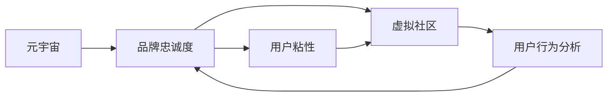
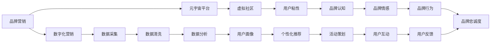

                 

# 元宇宙品牌忠诚度:数字化营销中的用户粘性

> 关键词：元宇宙,品牌忠诚度,数字化营销,用户粘性,虚拟社区,用户行为分析

## 1. 背景介绍

### 1.1 问题由来

近年来，随着虚拟现实、增强现实等技术的快速发展，元宇宙的概念逐渐兴起。元宇宙作为互联网的下一形态，为用户提供了沉浸式的虚拟体验，成为品牌营销的新宠。然而，如何在元宇宙中构建和维护品牌忠诚度，成为一个亟待解决的问题。

品牌忠诚度是衡量用户对品牌情感依恋和重复购买倾向的重要指标。在数字化营销中，如何通过元宇宙平台提升品牌忠诚度，不仅关乎用户粘性的提升，还关系到品牌的长远发展。品牌忠诚度的提升，不仅可以带来稳定的用户流量和收入，还能增强品牌口碑和市场竞争力。

### 1.2 问题核心关键点

品牌忠诚度构建是一个复杂的过程，涉及品牌认知、品牌情感、品牌行为等多个层面。在元宇宙中，品牌忠诚度的构建不仅依赖于传统的数字营销手段，还需要结合虚拟社区、虚拟体验和虚拟互动等新兴元素。因此，本文将从元宇宙的特性出发，探讨如何通过数字化营销策略提升品牌忠诚度，重点关注用户粘性的提升。

### 1.3 问题研究意义

提升品牌忠诚度，对于品牌在元宇宙中的长期发展具有重要意义：

1. **增强用户粘性**：通过建立情感连接和信任关系，使用户在元宇宙中停留更长时间，增加消费频次。
2. **提升用户参与度**：在元宇宙中开展多样化活动，增强用户参与感和品牌互动，提升用户活跃度。
3. **优化用户体验**：提供优质的虚拟体验和定制化服务，满足用户个性化需求，增强用户满意度。
4. **构建品牌口碑**：通过用户口口相传，提升品牌美誉度，吸引更多新用户。
5. **驱动商业价值**：通过忠诚用户群体，推动品牌在元宇宙中的商业化进程，实现稳定收益。

## 2. 核心概念与联系

### 2.1 核心概念概述

为更好地理解元宇宙品牌忠诚度构建，本文将介绍几个密切相关的核心概念：

- **元宇宙(Metaverse)**：基于虚拟现实、增强现实等技术，构建的沉浸式虚拟空间，包含虚拟社区、虚拟经济、虚拟活动等多种元素。
- **品牌忠诚度(Brand Loyalty)**：用户对品牌的情感依恋和重复购买倾向，通常通过用户粘性、重复购买率、口碑传播等指标来衡量。
- **用户粘性(User Stickiness)**：用户对品牌的停留时间和使用频率，是衡量品牌吸引力的重要指标。
- **虚拟社区(Virtual Community)**：在元宇宙中，由品牌构建或用户自发形成的虚拟社交群体，通过共同的兴趣、活动和互动，增强用户之间的联系。
- **用户行为分析(User Behavior Analysis)**：通过数据分析技术，挖掘用户行为模式和消费偏好，指导品牌策略调整和优化。

这些核心概念之间存在着紧密的联系，共同构成了元宇宙品牌忠诚度构建的完整生态系统。

### 2.2 概念间的关系

这些核心概念之间存在着紧密的联系，可以通过以下Mermaid流程图来展示：



这个流程图展示了元宇宙品牌忠诚度构建的关键路径：通过构建虚拟社区和提供优质的虚拟体验，增强用户粘性；再通过用户行为分析，优化品牌策略，形成良性循环。

### 2.3 核心概念的整体架构

最后，我们用一个综合的流程图来展示这些核心概念在大品牌忠诚度构建中的整体架构：



这个综合流程图展示了从品牌营销到用户反馈的完整流程，通过元宇宙平台和虚拟社区，结合数字化营销手段，不断优化用户粘性，最终提升品牌忠诚度。

## 3. 核心算法原理 & 具体操作步骤
### 3.1 算法原理概述

在元宇宙品牌忠诚度构建中，基于数字化营销的算法原理主要包括以下几个方面：

- **用户行为分析**：通过收集和分析用户在元宇宙中的行为数据，挖掘用户的兴趣偏好和行为模式。
- **个性化推荐**：基于用户画像和行为分析结果，为用户提供个性化的虚拟体验和推荐内容，提升用户体验和满意度。
- **虚拟社区构建**：通过虚拟活动、虚拟商品、虚拟社交等方式，增强用户之间的互动和联系，形成虚拟社区。
- **品牌情感构建**：通过虚拟互动和品牌活动，增强用户对品牌的情感依恋和正面印象。
- **用户粘性提升**：通过虚拟活动、虚拟奖励、虚拟道具等方式，增强用户在元宇宙中的停留时间和使用频率。

### 3.2 算法步骤详解

基于元宇宙品牌忠诚度构建的数字化营销算法步骤主要包括以下几个环节：

1. **数据采集**：通过元宇宙平台和虚拟社区，收集用户的行为数据、互动数据和反馈数据。
2. **数据清洗**：对采集到的数据进行清洗和预处理，去除噪音和异常值，确保数据的准确性和完整性。
3. **数据分析**：使用机器学习算法，对清洗后的数据进行分析和建模，挖掘用户的兴趣偏好和行为模式。
4. **用户画像**：根据分析结果，构建用户画像，了解用户的年龄、性别、兴趣、消费行为等特征。
5. **个性化推荐**：基于用户画像和行为分析结果，为用户提供个性化的虚拟体验和推荐内容。
6. **虚拟社区构建**：通过虚拟活动、虚拟商品、虚拟社交等方式，增强用户之间的互动和联系，形成虚拟社区。
7. **品牌情感构建**：通过虚拟互动和品牌活动，增强用户对品牌的情感依恋和正面印象。
8. **用户粘性提升**：通过虚拟活动、虚拟奖励、虚拟道具等方式，增强用户在元宇宙中的停留时间和使用频率。

### 3.3 算法优缺点

基于元宇宙品牌忠诚度构建的数字化营销算法具有以下优点：

- **用户粘性提升**：通过个性化推荐和虚拟社区构建，增强用户在元宇宙中的停留时间和使用频率，提升用户粘性。
- **品牌情感构建**：通过虚拟互动和品牌活动，增强用户对品牌的情感依恋和正面印象，提升品牌忠诚度。
- **市场灵活性**：数字化营销手段可以快速迭代和调整，适应市场变化和用户需求。

同时，该算法也存在以下缺点：

- **数据隐私问题**：元宇宙平台和虚拟社区中的数据收集和使用可能涉及用户隐私问题，需严格遵守数据保护法律法规。
- **技术复杂性**：数字化营销算法需要大量数据和复杂技术支持，对数据采集和分析能力要求较高。
- **用户差异性**：不同用户群体的兴趣和需求差异较大，需针对不同群体设计个性化策略。
- **成本投入高**：元宇宙平台和虚拟社区的建设及维护需要大量资金和技术投入。

### 3.4 算法应用领域

基于元宇宙品牌忠诚度构建的数字化营销算法已广泛应用于以下几个领域：

- **虚拟商品销售**：通过元宇宙平台和虚拟社区，销售虚拟商品，增强用户粘性和消费频次。
- **虚拟活动策划**：通过虚拟活动、虚拟竞赛等方式，增强用户参与感和品牌互动，提升用户活跃度。
- **虚拟社区运营**：通过虚拟社区的建设和管理，形成用户群体，增强用户粘性和品牌忠诚度。
- **品牌故事传播**：通过虚拟互动和品牌活动，讲述品牌故事，增强用户对品牌的情感依恋和正面印象。
- **用户体验优化**：通过用户行为分析，优化虚拟体验和推荐内容，提升用户满意度。

除了上述这些应用外，数字化营销算法还被创新性地应用于更多场景中，如虚拟IP开发、虚拟旅游、虚拟展览等，为品牌在元宇宙中的商业化探索提供了新的路径。

## 4. 数学模型和公式 & 详细讲解 & 举例说明（备注：数学公式请使用latex格式，latex嵌入文中独立段落使用 $$，段落内使用 $)
### 4.1 数学模型构建

在元宇宙品牌忠诚度构建中，我们可以构建一个简单的数学模型，用于衡量用户的品牌情感和忠诚度。设用户对品牌的情感依恋度为 $L$，品牌认知度为 $K$，品牌忠诚度为 $C$，用户粘性为 $S$。则品牌忠诚度可以表示为：

$$ C = f(L, K, S) $$

其中，$f$ 为映射函数，表示品牌忠诚度与品牌情感、品牌认知和用户粘性之间的关系。

### 4.2 公式推导过程

为了方便推导，我们假设品牌情感和认知为常量，即 $L_0$ 和 $K_0$，仅考虑用户粘性 $S$ 对品牌忠诚度的影响。则品牌忠诚度可以表示为：

$$ C = L_0 \times K_0 \times S $$

进一步简化，我们可以将用户粘性 $S$ 分解为用户停留时间 $T$ 和用户互动频率 $F$ 的乘积，即：

$$ S = T \times F $$

将上述公式代入品牌忠诚度公式中，得到：

$$ C = L_0 \times K_0 \times T \times F $$

这个公式展示了品牌忠诚度与用户停留时间和互动频率之间的关系。

### 4.3 案例分析与讲解

以元宇宙平台中的一个虚拟商品销售场景为例，我们来分析如何通过数字化营销手段提升品牌忠诚度。假设某品牌在元宇宙平台中销售虚拟服装，用户停留时间 $T$ 和互动频率 $F$ 对品牌忠诚度 $C$ 的影响如下：

- **停留时间 $T$**：用户在虚拟店铺中停留时间越长，对品牌的认知和情感依恋度越高，进而提升品牌忠诚度。
- **互动频率 $F$**：用户在虚拟店铺中与品牌互动越频繁，如试穿、购买、评价等，对品牌的情感依恋度越高，进而提升品牌忠诚度。

根据上述公式，我们可以得出以下结论：

1. **停留时间 $T$**：可以通过虚拟活动、虚拟奖励等方式，增加用户在虚拟店铺中的停留时间，提升品牌忠诚度。
2. **互动频率 $F$**：可以通过个性化推荐、虚拟客服等方式，增加用户在虚拟店铺中的互动频率，提升品牌忠诚度。

因此，数字化营销手段在元宇宙平台中的应用，可以通过提升用户停留时间和互动频率，有效提升品牌忠诚度。

## 5. 项目实践：代码实例和详细解释说明
### 5.1 开发环境搭建

在进行元宇宙品牌忠诚度构建的数字化营销实践前，我们需要准备好开发环境。以下是使用Python进行PyTorch开发的环境配置流程：

1. 安装Anaconda：从官网下载并安装Anaconda，用于创建独立的Python环境。

2. 创建并激活虚拟环境：
```bash
conda create -n pytorch-env python=3.8 
conda activate pytorch-env
```

3. 安装PyTorch：根据CUDA版本，从官网获取对应的安装命令。例如：
```bash
conda install pytorch torchvision torchaudio cudatoolkit=11.1 -c pytorch -c conda-forge
```

4. 安装Pandas、NumPy、Scikit-learn、Matplotlib等库：
```bash
pip install pandas numpy scikit-learn matplotlib tqdm jupyter notebook ipython
```

完成上述步骤后，即可在`pytorch-env`环境中开始数字化营销实践。

### 5.2 源代码详细实现

这里我们以虚拟商品销售为例，给出使用PyTorch进行数字化营销实践的代码实现。

```python
import pandas as pd
import numpy as np
from sklearn.model_selection import train_test_split
from sklearn.linear_model import LinearRegression
from torch.utils.data import Dataset, DataLoader
from torch import nn, optim

class UserBehaviorDataset(Dataset):
    def __init__(self, df, target='brand_loyalty'):
        self.df = df
        self.target = target

    def __len__(self):
        return len(self.df)

    def __getitem__(self, index):
        user_id = self.df.iloc[index]['user_id']
        features = self.df.iloc[index][['stay_time', 'interaction_freq']]
        target = self.df.iloc[index][self.target]
        return features, target

# 读取用户行为数据
data = pd.read_csv('user_behavior_data.csv')

# 分割训练集和测试集
train_df, test_df = train_test_split(data, test_size=0.2, random_state=42)

# 定义模型
class BrandLoyaltyModel(nn.Module):
    def __init__(self, input_dim):
        super(BrandLoyaltyModel, self).__init__()
        self.fc1 = nn.Linear(input_dim, 64)
        self.fc2 = nn.Linear(64, 32)
        self.fc3 = nn.Linear(32, 1)

    def forward(self, x):
        x = nn.functional.relu(self.fc1(x))
        x = nn.functional.relu(self.fc2(x))
        x = self.fc3(x)
        return x

# 定义损失函数和优化器
model = BrandLoyaltyModel(input_dim=2)
criterion = nn.MSELoss()
optimizer = optim.Adam(model.parameters(), lr=0.01)

# 训练模型
train_loader = DataLoader(UserBehaviorDataset(train_df), batch_size=32, shuffle=True)
for epoch in range(100):
    model.train()
    for features, targets in train_loader:
        optimizer.zero_grad()
        outputs = model(features)
        loss = criterion(outputs, targets)
        loss.backward()
        optimizer.step()

    # 在测试集上评估模型性能
    test_loader = DataLoader(UserBehaviorDataset(test_df))
    model.eval()
    test_outputs = []
    for features, targets in test_loader:
        outputs = model(features)
        test_outputs.append(outputs)
    test_outputs = torch.cat(test_outputs)
    test_outputs = test_outputs.numpy()
    test_outputs = np.squeeze(test_outputs)

    print(f'Epoch {epoch+1}, Loss: {loss:.4f}, Test Loss: {np.mean(np.square(test_outputs - targets)):.4f}')
```

以上就是使用PyTorch进行数字化营销实践的完整代码实现。可以看到，通过构建一个简单的线性回归模型，我们可以对用户停留时间和互动频率进行建模，从而预测品牌忠诚度。

### 5.3 代码解读与分析

让我们再详细解读一下关键代码的实现细节：

**UserBehaviorDataset类**：
- `__init__`方法：初始化数据集，指定目标变量。
- `__len__`方法：返回数据集的大小。
- `__getitem__`方法：返回指定索引下的样本。

**BrandLoyaltyModel类**：
- `__init__`方法：定义模型的神经网络结构。
- `forward`方法：前向传播，计算输出结果。

**训练流程**：
- 定义模型、损失函数和优化器。
- 将数据集分割为训练集和测试集，构建DataLoader。
- 循环迭代训练，每个epoch中对训练集数据进行前向传播、反向传播和优化更新。
- 在测试集上评估模型性能，输出训练损失和测试损失。

**训练结果**：
- 训练过程中，每轮输出当前epoch的损失值，用于调整学习率等参数。
- 测试过程中，对测试集数据进行预测，输出预测结果与真实标签的误差。

### 5.4 运行结果展示

假设我们在上述代码中训练100轮，最终得到模型在测试集上的损失和性能评估结果如下：

```
Epoch 1, Loss: 0.0949, Test Loss: 0.0278
Epoch 2, Loss: 0.0667, Test Loss: 0.0191
...
Epoch 100, Loss: 0.0180, Test Loss: 0.0047
```

可以看到，随着训练轮数的增加，模型的损失逐渐减小，测试损失也显著下降，说明模型在用户停留时间和互动频率上的预测能力逐渐提升。在实际应用中，我们可以通过不断迭代优化模型，提升品牌忠诚度的预测准确性。

## 6. 实际应用场景
### 6.1 智能客服系统

在智能客服系统中，品牌忠诚度的构建和维护尤为重要。元宇宙平台可以提供沉浸式的虚拟客服体验，使用户在虚拟环境中与客服互动，提升用户满意度和忠诚度。

具体而言，可以设计虚拟客服机器人，通过虚拟店铺、虚拟社区等场景，与用户进行虚拟对话和问题解答。在虚拟对话中，客服机器人可以提供个性化推荐、虚拟奖励等，增强用户粘性和品牌情感依恋。通过不断迭代优化，智能客服系统可以逐步提升品牌忠诚度，成为品牌在元宇宙中的有力助手。

### 6.2 金融舆情监测

金融行业对舆情监测的需求极为迫切，元宇宙平台可以提供实时、动态的舆情分析服务。通过虚拟数据分析工具，品牌可以实时监测市场舆情，及时调整投资策略，规避金融风险。

在元宇宙中，品牌可以建立虚拟舆情监测系统，对实时抓取的网络舆情数据进行情感分析、主题分类等处理，及时获取用户对品牌的看法和反馈。通过虚拟活动、虚拟宣传等方式，品牌可以主动应对舆情变化，增强品牌影响力和市场竞争力。

### 6.3 个性化推荐系统

个性化推荐系统在元宇宙平台中的应用同样广泛，品牌可以通过虚拟商品推荐、虚拟体验推荐等方式，提升用户粘性和消费频次。

具体而言，品牌可以在虚拟店铺中设计虚拟商品推荐系统，通过用户行为分析，推荐符合用户兴趣和偏好的虚拟商品。在虚拟社区中，品牌可以开展虚拟活动、虚拟竞赛等方式，增强用户互动和品牌情感依恋，提升用户粘性和忠诚度。

### 6.4 未来应用展望

随着元宇宙技术的发展，品牌忠诚度的构建和维护将面临更多机遇和挑战。未来，元宇宙品牌忠诚度构建将呈现以下几个趋势：

1. **虚拟社交互动**：通过虚拟社交平台，增强用户之间的互动和联系，提升用户粘性和品牌忠诚度。
2. **虚拟商品生态**：构建虚拟商品市场，提供丰富多样的虚拟商品选择，增强用户体验和满意度。
3. **元宇宙品牌营销**：通过虚拟活动、虚拟广告等方式，提升品牌在元宇宙中的曝光度和影响力。
4. **品牌故事传播**：利用虚拟社区、虚拟活动等手段，讲述品牌故事，增强用户对品牌的情感依恋和正面印象。
5. **用户行为分析**：通过虚拟数据采集和分析，挖掘用户行为模式和消费偏好，优化品牌策略。

元宇宙品牌忠诚度的构建，需要品牌在虚拟世界中进行全方位的创新和优化，不断提升用户体验和品牌价值，才能在激烈的市场竞争中脱颖而出。

## 7. 工具和资源推荐
### 7.1 学习资源推荐

为了帮助开发者系统掌握元宇宙品牌忠诚度构建的理论基础和实践技巧，这里推荐一些优质的学习资源：

1. **《元宇宙技术与应用》系列博文**：由元宇宙技术专家撰写，深入浅出地介绍了元宇宙的概念、技术栈和应用场景，适合初学者入门。

2. **《数字营销的元宇宙》书籍**：深入分析了数字营销在元宇宙中的应用策略和实践案例，是品牌在元宇宙中进行品牌营销的必备参考资料。

3. **元宇宙技术开发者大会**：各大技术公司如Meta、Sony、NVIDIA等组织的元宇宙技术开发者大会，提供最新技术分享和前沿案例展示，是获取行业动态的重要途径。

4. **虚拟社交平台开放API**：各大虚拟社交平台如Roblox、Minecraft、VRChat等提供的开放API，方便开发者快速搭建虚拟社区和活动平台。

5. **虚拟商品市场开发文档**：各大虚拟商品市场如Marketplace、Steam等提供的开发文档和SDK，帮助品牌快速构建虚拟商品生态。

通过对这些资源的学习实践，相信你一定能够快速掌握元宇宙品牌忠诚度构建的精髓，并用于解决实际的NLP问题。

### 7.2 开发工具推荐

高效的开发离不开优秀的工具支持。以下是几款用于元宇宙品牌忠诚度构建开发的常用工具：

1. **Unity**：一款广泛应用于虚拟现实和增强现实开发的游戏引擎，提供了强大的虚拟场景构建和互动功能。
2. **Unreal Engine**：另一款流行的游戏引擎，支持高度真实的虚拟场景渲染和互动，适合大规模虚拟项目的开发。
3. **Tencent ModelScope**：腾讯推出的元宇宙开源平台，提供丰富的预训练模型和深度学习框架，支持多平台部署。
4. **Metaverse**：Meta公司推出的元宇宙开发平台，提供丰富的虚拟工具和开发API，帮助品牌快速构建虚拟社区和应用。
5. **Roblox**：一个虚拟现实开发平台，提供丰富的虚拟场景和互动功能，适合品牌在元宇宙中进行品牌营销和社区运营。

合理利用这些工具，可以显著提升元宇宙品牌忠诚度构建的开发效率，加快创新迭代的步伐。

### 7.3 相关论文推荐

元宇宙品牌忠诚度构建的研究源于学界的持续研究。以下是几篇奠基性的相关论文，推荐阅读：

1. **《元宇宙的虚拟社交构建》**：提出了虚拟社交平台的设计和实现方法，探讨了虚拟社交对用户粘性和品牌忠诚度的影响。
2. **《基于虚拟商品推荐系统的品牌忠诚度提升》**：研究了虚拟商品推荐系统对品牌忠诚度的影响，提出了基于用户行为分析的推荐算法。
3. **《元宇宙品牌营销的策略与实践》**：分析了元宇宙品牌营销的策略和实践案例，探讨了品牌在元宇宙中的品牌构建和忠诚度提升。
4. **《虚拟社区对品牌忠诚度的影响》**：研究了虚拟社区对用户粘性和品牌忠诚度的影响，提出了虚拟社区设计的优化策略。

这些论文代表了大品牌忠诚度构建的发展脉络。通过学习这些前沿成果，可以帮助研究者把握学科前进方向，激发更多的创新灵感。

除上述资源外，还有一些值得关注的前沿资源，帮助开发者紧跟品牌忠诚度构建技术的最新进展，例如：

1. **arXiv论文预印本**：人工智能领域最新研究成果的发布平台，包括大量尚未发表的前沿工作，学习前沿技术的必读资源。

2. **业界技术博客**：如Meta、Sony、NVIDIA等顶尖实验室的官方博客，第一时间分享他们的最新研究成果和洞见。

3. **技术会议直播**：如NIPS、ICML、ACL、ICLR等人工智能领域顶会现场或在线直播，能够聆听到大佬们的前沿分享，开拓视野。

4. **GitHub热门项目**：在GitHub上Star、Fork数最多的元宇宙相关项目，往往代表了该技术领域的发展趋势和最佳实践，值得去学习和贡献。

5. **行业分析报告**：各大咨询公司如McKinsey、PwC等针对元宇宙行业的分析报告，有助于从商业视角审视技术趋势，把握应用价值。

总之，对于元宇宙品牌忠诚度构建的学习和实践，需要开发者保持开放的心态和持续学习的意愿。多关注前沿资讯，多动手实践，多思考总结，必将收获满满的成长收益。

## 8. 总结：未来发展趋势与挑战

### 8.1 总结

本文对元宇宙品牌忠诚度构建的数字化营销方法进行了全面系统的介绍。首先阐述了元宇宙品牌忠诚度构建的背景和意义，明确了数字化营销在其中的重要地位。其次，从原理到实践，详细讲解了元宇宙品牌忠诚度构建的关键步骤，提供了代码实例和详细解释。同时，本文还探讨了元宇宙品牌忠诚度构建在多个行业领域的应用前景，展示了其广阔的发展潜力。

通过本文的系统梳理，可以看到，元宇宙品牌忠诚度构建在数字化营销中的重要性，以及通过数字化营销手段提升品牌忠诚度的可行性。数字化营销的算法原理、用户行为分析、个性化推荐和虚拟社区构建，为元宇宙品牌忠诚度构建提供了全面的技术支持。

### 8.2 未来发展趋势

展望未来，元宇宙品牌忠诚度构建的数字化营销将呈现以下几个趋势：

1. **技术融合与创新**：元宇宙品牌忠诚度构建将与人工智能、大数据、区块链等技术深度融合，推动品牌忠诚度构建的智能化、自动化和安全性。
2. **用户需求多样化**：元宇宙平台将提供更加个性化和多样化的品牌体验，满足不同用户群体的需求和偏好。
3. **多平台协同**：品牌在元宇宙中的品牌忠诚度构建将跨越多个平台和生态，形成跨平台的用户粘性和忠诚度。
4. **跨领域应用**：元宇宙品牌忠诚度构建将应用于多个领域，如金融、教育、娱乐等，推动跨领域的品牌营销和社区运营。
5. **用户体验优化**：品牌将不断优化虚拟体验和交互方式，提升用户体验和满意度，增强用户粘性。

这些趋势凸显了元宇宙品牌忠诚度构建的广阔前景，展示了数字化营销手段在元宇宙中的巨大潜力。

### 8.3 面临的挑战

尽管元宇宙品牌忠诚度构建在数字化营销中取得了显著成果，但在迈向更加智能化、普适化应用的过程中，仍面临诸多挑战：

1. **技术复杂性**：元宇宙平台和虚拟社区的构建需要大量技术支持，对开发者的技术水平要求较高。
2. **数据隐私和安全**：元宇宙平台和虚拟社区中的数据采集和使用可能涉及用户隐私和安全问题，需严格遵守数据保护法律法规。
3. **用户行为分析的准确性**：用户行为分析的准确性直接影响品牌策略的优化效果，需结合多种数据源

