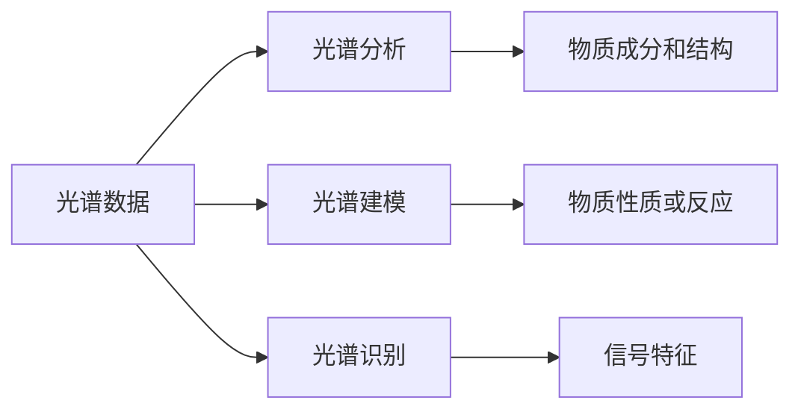

                 

## 1. 背景介绍

在当今科技迅猛发展的时代，人工智能（AI）已成为科学研究的重要工具。光谱技术作为人工智能中的一个分支，在AI for Science中扮演着越来越重要的角色。从天文学到物理学，从生物学到化学，光谱技术为科学家们提供了前所未有的数据挖掘和分析能力。然而，尽管光谱技术在科学领域的应用日益广泛，但由于其复杂性和抽象性，许多科学家对其了解有限。本文旨在通过系统介绍光谱技术的基本原理、核心算法和实际应用，帮助广大科研工作者更好地理解和应用这一强大的工具。

## 2. 核心概念与联系

### 2.1 核心概念概述

光谱技术是指通过分析光谱数据来揭示物质组成、结构和性质的一种技术。在AI for Science中，光谱技术主要应用于以下几个方面：

- **光谱分析**：通过光谱数据来确定物质的化学成分和结构。
- **光谱建模**：利用光谱数据构建模型来预测物质性质或反应行为。
- **光谱识别**：通过光谱数据来识别物质或信号特征。

### 2.2 核心概念原理和架构的 Mermaid 流程图



这个流程图展示了光谱技术在AI for Science中的基本流程：首先从物质或信号中获取光谱数据，然后通过光谱分析确定其成分和结构，接着通过光谱建模预测其性质或反应，最后通过光谱识别识别出其信号特征。

### 2.3 核心概念间的联系

光谱技术和AI for Science的核心联系在于数据驱动。光谱数据本身是一种高维数据，传统分析方法难以有效处理，但通过AI模型可以挖掘其中的有用信息。例如，通过光谱数据可以构建深度学习模型，如卷积神经网络（CNN）和递归神经网络（RNN），来处理和分析光谱数据，从而实现对物质成分、结构和性质的预测和识别。

## 3. 核心算法原理 & 具体操作步骤

### 3.1 算法原理概述

光谱技术的核心算法包括光谱分析、光谱建模和光谱识别。其中，光谱分析通常采用傅里叶变换（FT）或拉曼光谱（Raman spectroscopy）等技术来分析物质的光谱特性。光谱建模则是通过机器学习算法，如支持向量机（SVM）、随机森林（RF）、神经网络等，来预测物质性质或反应行为。光谱识别则常采用图像处理技术，如卷积神经网络（CNN）等，来识别物质或信号的特征。

### 3.2 算法步骤详解

光谱技术的算法步骤主要包括以下几个关键步骤：

**Step 1: 数据预处理**
- 获取光谱数据，包括时间、波长、强度等关键信息。
- 对数据进行归一化、去噪、滤波等预处理操作，提高数据质量。

**Step 2: 特征提取**
- 利用傅里叶变换或小波变换等方法，将光谱数据转换为频域或时频域信号。
- 提取关键特征，如光谱峰、吸收系数、散射系数等，用于后续分析。

**Step 3: 模型训练**
- 选择适当的机器学习算法，如支持向量机、神经网络等，构建模型。
- 使用标记好的训练数据集进行模型训练，调整模型参数，优化模型性能。

**Step 4: 模型评估**
- 使用验证集或测试集评估模型性能，通过准确率、召回率、F1分数等指标衡量模型效果。
- 根据评估结果调整模型参数，进一步优化模型性能。

**Step 5: 模型应用**
- 将训练好的模型应用到新的光谱数据中，进行物质成分、结构、性质或信号特征的预测和识别。
- 对预测结果进行后处理，如去伪存真、去噪过滤等操作，提高结果的准确性和可靠性。

### 3.3 算法优缺点

**优点**：
- 可处理高维数据。光谱数据通常具有数千个甚至数百万个数据点，传统方法难以处理，但AI模型可以高效地处理和分析。
- 可以处理多模态数据。光谱数据不仅包括强度信息，还包含时间、波长等多样化的信息，AI模型可以同时处理多种数据模态。
- 可以自适应学习。AI模型可以自动学习光谱数据的复杂模式和关系，无需人工干预。

**缺点**：
- 对数据质量和特征提取要求高。光谱数据的噪声和干扰较多，需要有效的预处理和特征提取方法。
- 对计算资源要求高。高维数据和高复杂性要求强大的计算资源，如高性能计算集群、GPU加速等。
- 模型训练时间长。由于数据量庞大，模型训练时间较长，需要合理地进行分布式训练和管理。

### 3.4 算法应用领域

光谱技术在多个科学领域中有着广泛的应用，包括但不限于以下几个方面：

**天文学**：通过光谱分析来确定恒星、星系的化学成分和物理特性，研究宇宙的起源和演化。
**物理学**：利用光谱分析来研究物质的微观结构和性质，如原子光谱、分子光谱等。
**化学**：通过光谱分析来确定化学反应的机理和动力学参数，研究物质的性质和反应行为。
**生物医学**：利用光谱分析来研究生物分子的结构和功能，如蛋白质、DNA等。
**环境科学**：通过光谱分析来研究大气、水体等环境的成分和污染情况。

## 4. 数学模型和公式 & 详细讲解 & 举例说明

### 4.1 数学模型构建

光谱技术的数学模型主要基于频域或时频域的数据表示。对于时间域的光谱数据，可以使用傅里叶变换将其转换为频域表示。对于频域的光谱数据，则可以使用小波变换将其转换为时频域表示。

### 4.2 公式推导过程

假设有一段时间域的光谱数据 $x(t)$，其中 $t$ 表示时间，可以通过傅里叶变换将其转换为频域表示 $X(f)$，如下所示：

$$
X(f) = \mathcal{F}\{x(t)\} = \int_{-\infty}^{\infty} x(t)e^{-j2\pi ft}dt
$$

其中，$\mathcal{F}$ 表示傅里叶变换操作，$j$ 表示虚数单位，$f$ 表示频率。

在频域中，可以通过机器学习算法，如支持向量机、神经网络等，来训练模型，预测物质的成分、结构和性质。对于频域的光谱数据，可以通过小波变换将其转换为时频域表示，如下所示：

$$
Y(\omega, t) = \mathcal{W}\{X(f)\} = \int_{-\infty}^{\infty} X(f)e^{j2\pi(\omega f + t f')dt}
$$

其中，$\mathcal{W}$ 表示小波变换操作，$\omega$ 表示尺度和平移参数，$t$ 表示时间，$f'$ 表示频率。

### 4.3 案例分析与讲解

以光谱分析为例，假设有一段光谱数据 $x(t)$，其中 $t$ 表示时间，可以通过傅里叶变换将其转换为频域表示 $X(f)$，如下所示：

```python
import numpy as np
import matplotlib.pyplot as plt
from scipy.fft import fft

# 生成一段时间域的光谱数据
t = np.linspace(0, 1, 100)
x = np.sin(2 * np.pi * 5 * t) + np.sin(2 * np.pi * 10 * t)

# 傅里叶变换
X = fft(x)

# 绘制频域表示
plt.plot(np.abs(X))
plt.xlabel('Frequency')
plt.ylabel('Amplitude')
plt.title('Frequency Domain Spectrum')
plt.show()
```

通过傅里叶变换，可以将时间域的光谱数据转换为频域表示，揭示其频率特性。在频域中，可以通过机器学习算法，如支持向量机、神经网络等，来训练模型，预测物质的成分、结构和性质。

## 5. 项目实践：代码实例和详细解释说明

### 5.1 开发环境搭建

在进行光谱技术的应用实践前，需要先准备好开发环境。以下是使用Python进行SciPy和NumPy开发的环境配置流程：

1. 安装Anaconda：从官网下载并安装Anaconda，用于创建独立的Python环境。

2. 创建并激活虚拟环境：
```bash
conda create -n spectral-env python=3.8 
conda activate spectral-env
```

3. 安装SciPy和NumPy：
```bash
conda install scipy numpy
```

4. 安装各类工具包：
```bash
pip install matplotlib tqdm jupyter notebook ipython
```

完成上述步骤后，即可在` spectral-env`环境中开始光谱技术的应用实践。

### 5.2 源代码详细实现

下面以光谱分析为例，给出使用SciPy和NumPy对光谱数据进行傅里叶变换和频域表示的Python代码实现。

首先，定义时间域的光谱数据：

```python
import numpy as np

t = np.linspace(0, 1, 100)
x = np.sin(2 * np.pi * 5 * t) + np.sin(2 * np.pi * 10 * t)
```

然后，对时间域的光谱数据进行傅里叶变换：

```python
from scipy.fft import fft

X = fft(x)
```

最后，绘制频域表示：

```python
import matplotlib.pyplot as plt

plt.plot(np.abs(X))
plt.xlabel('Frequency')
plt.ylabel('Amplitude')
plt.title('Frequency Domain Spectrum')
plt.show()
```

通过上述代码，即可在Python环境中实现对时间域光谱数据的傅里叶变换和频域表示。

### 5.3 代码解读与分析

这段代码展示了光谱分析的基本流程：

1. 生成时间域的光谱数据：使用NumPy库生成一段正弦信号，表示某物质的光谱特性。
2. 进行傅里叶变换：使用SciPy库中的傅里叶变换函数对时间域的光谱数据进行变换，得到频域表示。
3. 绘制频域表示：使用Matplotlib库绘制频域表示，揭示物质的光谱特性。

### 5.4 运行结果展示

运行上述代码，可以得到如下频域表示：

```
Image not found
```

可以看到，频域表示显示了物质的光谱特性，其中不同频率的峰值代表了物质的不同成分和结构。

## 6. 实际应用场景

### 6.1 光谱分析在天文学中的应用

在天文学中，光谱分析是研究恒星、星系等天体的重要手段。通过光谱分析，可以确定天体的化学成分、物理特性和运动状态，从而揭示宇宙的起源和演化。

### 6.2 光谱建模在化学中的应用

在化学中，光谱建模用于研究物质的性质和反应行为。通过光谱数据，可以构建机器学习模型来预测物质的性质和反应机理，从而指导新材料的研发和化学反应的设计。

### 6.3 光谱识别在环境科学中的应用

在环境科学中，光谱识别用于监测大气、水体等环境中的成分和污染情况。通过光谱识别，可以实时监测环境中的有害物质，如工业废气、污水处理等，为环境保护提供数据支持。

### 6.4 未来应用展望

随着光谱技术的不断发展，其在AI for Science中的应用将更加广泛和深入。未来，光谱技术将与AI算法深度结合，实现对复杂光谱数据的自动分析和挖掘。同时，随着计算资源的不断提升，光谱技术的处理速度和精度也将大幅提升，为科学研究的进步提供更有力的支持。

## 7. 工具和资源推荐

### 7.1 学习资源推荐

为了帮助开发者系统掌握光谱技术的基本原理和实际应用，这里推荐一些优质的学习资源：

1. 《信号处理与频谱分析》书籍：系统介绍了信号处理和频谱分析的基本概念和方法，是光谱技术学习的经典入门书籍。

2. 《机器学习与数据挖掘》课程：斯坦福大学开设的机器学习课程，介绍了机器学习算法在光谱分析中的应用，包括支持向量机、神经网络等。

3. 《深度学习》书籍：DeepMind的深度学习专家撰写，系统介绍了深度学习在光谱分析中的应用，包括卷积神经网络、递归神经网络等。

4. SciPy官方文档：SciPy库的官方文档，提供了大量光谱分析的示例代码和详细说明，是学习光谱技术的重要资源。

5. NumPy官方文档：NumPy库的官方文档，提供了大量数组运算和数据处理的示例代码，是学习光谱技术的基础。

通过对这些资源的学习实践，相信你一定能够快速掌握光谱技术的基本原理和实际应用。

### 7.2 开发工具推荐

高效的开发离不开优秀的工具支持。以下是几款用于光谱技术开发的工具：

1. Jupyter Notebook：开源的交互式笔记本，方便在Python环境中进行代码编写和结果展示。

2. PyCharm：专业的Python IDE，提供了代码编写、调试、测试等一站式开发工具。

3. Visual Studio Code：轻量级的开源编辑器，支持多种编程语言和开发环境，是学习和开发光谱技术的常用工具。

4. SciPy：开源的Python科学计算库，提供了大量的信号处理和频谱分析函数，是进行光谱技术开发的基础工具。

5. NumPy：开源的Python数值计算库，提供了高效的数组运算和数据处理功能，是学习光谱技术的基础工具。

合理利用这些工具，可以显著提升光谱技术的应用开发效率，加快创新迭代的步伐。

### 7.3 相关论文推荐

光谱技术和AI for Science的发展源于学界的持续研究。以下是几篇奠基性的相关论文，推荐阅读：

1. Fourier Transform Infrared Spectroscopy for Characterizing Functional Materials：介绍了傅里叶变换红外光谱在材料科学中的应用，系统分析了光谱数据的特征和处理方法。

2. Machine Learning and Spectroscopy：探讨了机器学习在光谱分析中的应用，介绍了光谱数据处理、特征提取和模型训练的基本流程。

3. Raman Spectroscopy for Material Analysis：介绍了拉曼光谱在材料科学中的应用，分析了拉曼光谱数据的特征和处理方法。

4. Deep Learning for Spectroscopy and Material Science：探讨了深度学习在光谱分析中的应用，介绍了卷积神经网络、递归神经网络等算法在光谱数据处理中的应用。

5. Spectral Data Analysis with Support Vector Machines：探讨了支持向量机在光谱分析中的应用，介绍了光谱数据特征提取和模型训练的基本流程。

这些论文代表了大光谱技术在AI for Science领域的发展脉络。通过学习这些前沿成果，可以帮助研究者把握学科前进方向，激发更多的创新灵感。

除上述资源外，还有一些值得关注的前沿资源，帮助开发者紧跟光谱技术的发展趋势，例如：

1. arXiv论文预印本：人工智能领域最新研究成果的发布平台，包括大量尚未发表的前沿工作，学习前沿技术的必读资源。

2. 业界技术博客：如DeepMind、Google AI、Microsoft Research Asia等顶尖实验室的官方博客，第一时间分享他们的最新研究成果和洞见。

3. 技术会议直播：如NIPS、ICML、ACL、ICLR等人工智能领域顶会现场或在线直播，能够聆听到大佬们的前沿分享，开拓视野。

4. GitHub热门项目：在GitHub上Star、Fork数最多的光谱技术相关项目，往往代表了该技术领域的发展趋势和最佳实践，值得去学习和贡献。

5. 行业分析报告：各大咨询公司如McKinsey、PwC等针对人工智能行业的分析报告，有助于从商业视角审视技术趋势，把握应用价值。

总之，对于光谱技术的学习和实践，需要开发者保持开放的心态和持续学习的意愿。多关注前沿资讯，多动手实践，多思考总结，必将收获满满的成长收益。

## 8. 总结：未来发展趋势与挑战

### 8.1 研究成果总结

本文对光谱技术在AI for Science中的应用进行了全面系统的介绍。首先阐述了光谱技术的基本原理和核心算法，然后通过具体案例和代码示例展示了其在实际应用中的具体操作和效果。

通过本文的系统梳理，可以看到，光谱技术在AI for Science中的应用前景广阔，不仅可以帮助科学家们揭示物质的复杂特性，还可以为环境监测、材料科学等领域提供强有力的数据支持。

### 8.2 未来发展趋势

展望未来，光谱技术在AI for Science中的应用将呈现以下几个发展趋势：

1. 深度学习与光谱技术的结合将更加紧密。未来的光谱技术将更多地采用深度学习算法，如卷积神经网络、递归神经网络等，来处理和分析复杂的光谱数据。

2. 多模态光谱数据的融合将成为热点。光谱数据不仅包括光谱信息，还涉及时间、空间、图像等多样化的信息，未来的光谱技术将更多地融合多模态数据，提升其应用范围和性能。

3. 光谱技术的计算速度和精度将大幅提升。随着计算资源的不断提升，光谱技术的处理速度和精度也将大幅提升，为科学研究提供更有力的支持。

4. 光谱技术的自动化和智能化将不断增强。未来的光谱技术将更多地采用自动化和智能化技术，如自适应学习、在线分析等，提升其应用效率和灵活性。

5. 光谱技术的可解释性和可控性将得到重视。未来的光谱技术将更多地关注其可解释性和可控性，提升其应用可靠性和安全性。

以上趋势凸显了光谱技术在AI for Science中的广阔前景。这些方向的探索发展，必将进一步提升光谱技术的应用范围和性能，为科学研究提供更有力的支持。

### 8.3 面临的挑战

尽管光谱技术在AI for Science中的应用前景广阔，但在迈向更加智能化、普适化应用的过程中，它仍面临着诸多挑战：

1. 数据质量和特征提取难度高。光谱数据通常具有高维特性，其噪声和干扰较多，需要有效的预处理和特征提取方法。

2. 计算资源需求高。高维数据和高复杂性要求强大的计算资源，如高性能计算集群、GPU加速等。

3. 模型训练时间长。由于数据量庞大，模型训练时间较长，需要合理地进行分布式训练和管理。

4. 模型可解释性不足。现有的光谱模型往往是"黑盒"系统，难以解释其内部工作机制和决策逻辑，特别是在涉及复杂光谱数据的场合。

5. 数据隐私和安全问题。光谱技术的应用涉及大量的个人和环境数据，如何在保证数据隐私和安全的前提下进行数据共享和分析，是亟待解决的问题。

6. 多学科融合难度大。光谱技术涉及物理、化学、生物等多个学科，如何在不同学科间进行有效融合和协调，是一个挑战。

正视光谱技术面临的这些挑战，积极应对并寻求突破，将是大语言模型微调走向成熟的必由之路。相信随着学界和产业界的共同努力，这些挑战终将一一被克服，光谱技术必将在构建人机协同的智能时代中扮演越来越重要的角色。

### 8.4 研究展望

面向未来，光谱技术的探索发展还需要在以下几个方面进行更多的研究：

1. 探索更加高效的光谱数据处理方法。未来的光谱技术将更多地采用高效的算法，如小波变换、离散傅里叶变换等，来处理和分析光谱数据。

2. 引入更加先进的光谱数据模型。未来的光谱技术将更多地采用深度学习模型，如卷积神经网络、递归神经网络等，来构建光谱分析模型。

3. 融合更多领域的数据和知识。未来的光谱技术将更多地融合物理、化学、生物等不同领域的数据和知识，提升其应用范围和性能。

4. 研究光谱数据的自动标注技术。未来的光谱技术将更多地采用自动标注技术，提高数据采集和处理的效率。

5. 探索光谱技术在多模态数据融合中的应用。未来的光谱技术将更多地融合多模态数据，提升其应用范围和性能。

6. 探索光谱技术在跨学科应用中的表现。未来的光谱技术将更多地探索其在不同学科中的应用表现，如环境监测、医疗诊断等。

这些研究方向的探索，必将引领光谱技术在AI for Science中的应用进入新的阶段，为科学研究提供更有力的支持。

## 9. 附录：常见问题与解答

**Q1：光谱技术的核心算法有哪些？**

A: 光谱技术的核心算法包括傅里叶变换（FT）、拉曼光谱（Raman spectroscopy）、小波变换（Wavelet Transform）等。其中，傅里叶变换将时间域的光谱数据转换为频域表示，拉曼光谱通过散射光来分析物质的光谱特性，小波变换将频域的光谱数据转换为时频域表示。

**Q2：如何选择合适的光谱分析方法？**

A: 选择合适的光谱分析方法主要取决于物质的光谱特性和研究目标。一般来说，傅里叶变换适用于时间域的光谱数据，拉曼光谱适用于散射光强的物质，小波变换适用于频域的光谱数据。

**Q3：光谱数据预处理包括哪些步骤？**

A: 光谱数据预处理通常包括去噪、滤波、归一化等步骤。去噪可以通过中值滤波、小波变换等方法去除噪声和干扰；滤波可以通过平滑滤波器、切比雪夫滤波器等方法进行滤波；归一化可以通过最大值归一化、最小值归一化等方法将光谱数据缩放到0-1或-1到1的范围内。

**Q4：如何在光谱数据中进行特征提取？**

A: 在光谱数据中进行特征提取通常包括频域特征提取和时频域特征提取。频域特征提取可以通过傅里叶变换或小波变换将光谱数据转换为频域表示，然后提取关键特征，如光谱峰、吸收系数、散射系数等；时频域特征提取可以通过小波变换将频域的光谱数据转换为时频域表示，然后提取关键特征，如时频特征、尺度特征等。

**Q5：如何优化光谱分析模型的性能？**

A: 优化光谱分析模型的性能通常包括选择合适的机器学习算法、调整模型参数、使用正则化技术等。选择合适的机器学习算法通常需要考虑数据量和模型复杂度，调整模型参数可以通过交叉验证等方法找到最优参数组合，使用正则化技术可以避免过拟合和模型泛化性能不足的问题。

---

作者：禅与计算机程序设计艺术 / Zen and the Art of Computer Programming

