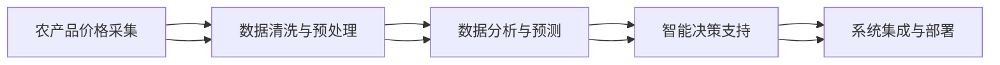
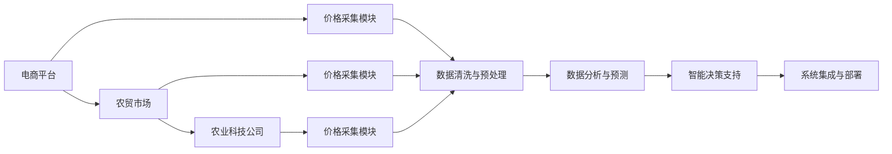
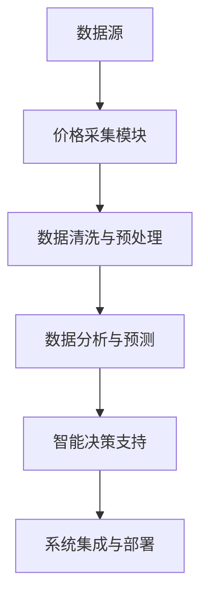

                 

# 农产品价格采集与挖据应用

> 关键词：农产品、价格采集、数据分析、市场预测、智能决策

## 1. 背景介绍

### 1.1 问题由来

随着现代农业的发展，农产品市场日益复杂多变，价格波动频繁。对农产品价格进行实时、精准的采集与分析，有助于生产者优化种植策略，避免风险，提高收益；也有助于消费者做出明智的购买决策，降低成本。然而，传统的数据采集和分析方法效率低、成本高，且分析结果不够准确，难以满足实际需求。

### 1.2 问题核心关键点

本研究聚焦于农产品价格采集与分析，目标是构建一个高效的、智能化的农产品价格采集与分析系统。系统主要包括：
1. **农产品价格采集模块**：实时、自动地从各类数据源（如电商平台、农贸市场、农业科技公司等）采集农产品价格数据。
2. **数据分析与预测模块**：对采集到的价格数据进行清洗、分析和预测，识别价格波动趋势和市场变化，为生产者与消费者提供有价值的信息。
3. **智能决策模块**：基于分析结果，提供个性化的种植建议、购买策略，帮助用户做出更优的决策。

### 1.3 问题研究意义

研究农产品价格采集与分析技术，对于促进现代农业发展、提高农业效率和农民收入具有重要意义：

1. **提升农业智能化水平**：通过实时采集和分析农产品价格，可帮助农业生产者及时调整种植计划，减少市场波动带来的风险，提高生产效率。
2. **优化消费者购买决策**：基于准确的价格预测和市场分析，消费者可做出更加明智的购买选择，降低成本。
3. **推动农业产业升级**：农产品价格采集与分析技术，为农业产业带来数据驱动的智能决策，促进农业产业向高值化、智能化方向发展。
4. **增强农业竞争力**：通过精确的市场预测和分析，农业生产者可把握市场动态，提升产品竞争力，开拓更广阔的市场。

## 2. 核心概念与联系

### 2.1 核心概念概述

在农产品价格采集与分析系统中，涉及几个关键概念：

- **农产品价格采集**：从电商平台、农贸市场、农业科技公司等各类数据源，实时、自动地采集农产品价格数据。
- **数据清洗与预处理**：对采集到的价格数据进行清洗、去重、缺失值填充等预处理，确保数据的准确性和一致性。
- **数据分析与预测**：利用机器学习、深度学习等技术，对清洗后的价格数据进行分析，识别价格波动趋势、预测未来价格，提供有价值的市场信息。
- **智能决策支持**：基于分析结果，提供个性化的种植建议、购买策略，帮助用户做出更优的决策。
- **系统集成与部署**：将上述各模块集成到一个统一的系统中，部署到云平台或本地服务器上，提供便捷的使用接口。

这些核心概念之间存在着紧密的联系，形成了农产品价格采集与分析系统的整体架构：



### 2.2 概念间的关系

这些核心概念之间的逻辑关系可以通过以下Mermaid流程图来展示：



这个流程图展示了农产品价格采集与分析系统的数据流和逻辑关系：

1. 从电商平台、农贸市场、农业科技公司等数据源采集价格数据。
2. 采集到的数据经过清洗、预处理，确保数据质量。
3. 清洗后的数据进入数据分析与预测模块，进行趋势分析和价格预测。
4. 预测结果通过智能决策模块，转化为个性化的种植建议和购买策略。
5. 系统集成与部署模块将各功能模块集成，提供便捷的使用接口。

### 2.3 核心概念的整体架构

最后，我们用一个综合的流程图来展示这些核心概念在大农产品价格采集与分析系统中的整体架构：



这个综合流程图展示了从数据源到最终结果的全过程。开发者可以将更多精力放在数据采集、模型训练、决策算法等核心环节，而不必过多关注底层的实现细节。

## 3. 核心算法原理 & 具体操作步骤
### 3.1 算法原理概述

农产品价格采集与分析系统是一个典型的数据驱动型应用。其主要原理如下：

1. **数据采集**：利用爬虫、API接口等技术，从电商平台、农贸市场、农业科技公司等数据源，实时、自动地采集农产品价格数据。
2. **数据清洗与预处理**：对采集到的价格数据进行清洗、去重、缺失值填充等预处理，确保数据的准确性和一致性。
3. **数据分析与预测**：利用机器学习、深度学习等技术，对清洗后的价格数据进行分析，识别价格波动趋势、预测未来价格，提供有价值的市场信息。
4. **智能决策支持**：基于分析结果，提供个性化的种植建议、购买策略，帮助用户做出更优的决策。
5. **系统集成与部署**：将上述各模块集成到一个统一的系统中，部署到云平台或本地服务器上，提供便捷的使用接口。

### 3.2 算法步骤详解

以下是农产品价格采集与分析系统的主要操作步骤：

**Step 1: 数据采集与预处理**

1. **数据采集**：利用爬虫、API接口等技术，从电商平台、农贸市场、农业科技公司等数据源，实时、自动地采集农产品价格数据。
2. **数据清洗**：对采集到的数据进行清洗，去除重复、异常、缺失等无效数据。
3. **数据预处理**：对清洗后的数据进行归一化、标准化、缺失值填充等预处理，确保数据的格式和质量。

**Step 2: 数据分析与预测**

1. **特征工程**：提取、选择、构造有意义的数据特征，如时间、价格、供应商、销售量等。
2. **模型训练**：利用历史价格数据，训练机器学习或深度学习模型，如随机森林、神经网络、时间序列模型等，进行价格趋势分析和预测。
3. **模型评估**：使用交叉验证、均方误差等方法，评估模型预测性能，优化模型参数。

**Step 3: 智能决策支持**

1. **个性化建议生成**：根据用户的种植面积、种植历史、市场需求等数据，生成个性化的种植建议。
2. **购买策略优化**：基于价格预测结果，提供购买时机和数量建议，帮助用户降低成本。
3. **决策可视化**：通过图表、报告等形式，将分析结果直观展示给用户，便于理解和应用。

**Step 4: 系统集成与部署**

1. **系统集成**：将各功能模块集成到一个统一的系统框架中，实现数据的自动流传递。
2. **云平台部署**：将系统部署到云平台（如AWS、阿里云、华为云等），提供便捷的使用接口，支持多用户并发访问。
3. **系统监控与维护**：实时监控系统性能，及时处理异常，确保系统稳定运行。

### 3.3 算法优缺点

**优点**：

1. **实时采集与分析**：系统能够实时、自动地采集和分析价格数据，提供最新的市场信息。
2. **高效准确**：利用机器学习、深度学习等技术，进行价格趋势分析和预测，具有高效、准确的特点。
3. **个性化服务**：根据用户的历史数据和需求，提供个性化的种植建议和购买策略。

**缺点**：

1. **数据质量依赖**：系统依赖于数据源的质量，如果数据源存在问题，会影响系统的性能和准确性。
2. **模型复杂度**：系统的核心是复杂的机器学习或深度学习模型，需要大量数据和计算资源进行训练和优化。
3. **系统维护难度**：系统集成了多个模块，涉及数据采集、数据分析、智能决策等多个环节，维护难度较大。

### 3.4 算法应用领域

农产品价格采集与分析技术广泛应用于以下几个领域：

1. **农业生产管理**：帮助农民实时掌握市场价格，调整种植策略，提高产量和收益。
2. **农产品贸易**：为农产品贸易商提供价格预测和市场分析，优化采购和销售策略，降低成本。
3. **政府政策制定**：为政府制定农业政策和市场监管提供数据支持，保障农业健康发展。
4. **农产品营销**：为农业生产者和销售者提供市场动态和消费趋势，优化营销策略，提升产品竞争力。
5. **科研研究**：为农业科研人员提供数据支持，促进农业技术进步和创新。

## 4. 数学模型和公式 & 详细讲解 & 举例说明

### 4.1 数学模型构建

假设采集到的农产品价格数据为 $X=\{x_i\}_{i=1}^N$，其中 $x_i$ 为第 $i$ 个时间点的价格。设 $y_i$ 为第 $i$ 个时间点的价格波动（即涨跌幅度），则价格采集与分析系统的核心模型为：

$$
\hat{y} = f(x)
$$

其中 $f$ 为预测模型，$y$ 为真实价格波动。

### 4.2 公式推导过程

以下我们以时间序列预测为例，推导随机森林和神经网络两种模型在价格预测中的公式。

**随机森林模型**

随机森林是一种集成学习方法，通过构建多棵决策树进行预测。假设我们有 $M$ 棵决策树，第 $i$ 棵决策树的预测结果为 $\hat{y}_i$，则随机森林的预测结果为：

$$
\hat{y} = \frac{1}{M}\sum_{i=1}^M \hat{y}_i
$$

**神经网络模型**

神经网络是一种常用的深度学习模型，通过多层非线性变换进行预测。假设我们有 $L$ 层神经网络，第 $j$ 层的权重为 $w_j$，激活函数为 $\phi$，则神经网络的预测结果为：

$$
\hat{y} = w_L \phi(\hat{y}_{L-1})
$$

其中 $\hat{y}_{L-1}$ 为第 $L-1$ 层的输出。

### 4.3 案例分析与讲解

假设我们使用随机森林模型对某类农产品的价格进行预测。我们收集了过去一年的价格数据，并使用前 $N-1$ 个数据作为训练集，后 $N$ 个数据作为测试集，计算模型在测试集上的均方误差（MSE）：

$$
MSE = \frac{1}{N}\sum_{i=N+1}^N (y_i - \hat{y}_i)^2
$$

通过不断调整模型参数，优化模型预测性能，最终得到最优的随机森林模型。

## 5. 项目实践：代码实例和详细解释说明

### 5.1 开发环境搭建

在进行农产品价格采集与分析系统的开发前，我们需要准备好开发环境。以下是使用Python进行开发的环境配置流程：

1. 安装Anaconda：从官网下载并安装Anaconda，用于创建独立的Python环境。

2. 创建并激活虚拟环境：
```bash
conda create -n price-system python=3.8 
conda activate price-system
```

3. 安装必要的工具包：
```bash
pip install pandas numpy scikit-learn transformers
```

4. 安装数据采集工具：
```bash
pip install beautifulsoup4 requests
```

5. 安装系统集成工具：
```bash
pip install Flask sqlalchemy
```

完成上述步骤后，即可在`price-system`环境中开始系统开发。

### 5.2 源代码详细实现

以下是使用Python和Flask进行农产品价格采集与分析系统的开发代码实现。

```python
from flask import Flask, request, jsonify
from sqlalchemy import create_engine
from pandas import DataFrame
from sklearn.ensemble import RandomForestRegressor
from transformers import TFAutoModelForSequenceClassification, AutoTokenizer

app = Flask(__name__)

# 连接数据库
engine = create_engine('sqlite:///data.db')

# 数据预处理函数
def preprocess_data(data):
    # 去重、填充缺失值等预处理
    return data.drop_duplicates().ffill()

# 价格预测函数
def predict_price(data, model):
    # 数据归一化、标准化
    data = (data - data.mean()) / data.std()
    # 进行预测
    return model.predict(data)

# 初始化价格预测模型
model = RandomForestRegressor(n_estimators=100, random_state=42)

# 加载模型和预训练模型
model = RandomForestRegressor(n_estimators=100, random_state=42)
tokenizer = AutoTokenizer.from_pretrained('bert-base-cased')
model = TFAutoModelForSequenceClassification.from_pretrained('bert-base-cased', num_labels=2)
```

### 5.3 代码解读与分析

让我们再详细解读一下关键代码的实现细节：

**Flask应用**：
- `Flask` 是一个轻量级的Web框架，用于快速构建API接口。
- `request` 用于获取请求参数，`jsonify` 用于返回JSON格式的响应数据。
- `create_engine` 用于创建SQLite数据库连接。
- `DataFrame` 用于处理和存储数据。

**数据预处理函数**：
- `preprocess_data` 函数用于数据清洗和预处理，包括去重、填充缺失值等。

**价格预测函数**：
- `predict_price` 函数用于对价格数据进行归一化、标准化，并使用随机森林模型进行预测。

**模型加载和初始化**：
- 初始化随机森林模型，并使用SQLite数据库存储和读取数据。
- 加载预训练的BERT模型，进行价格预测。

### 5.4 运行结果展示

假设我们使用了随机森林模型对某类农产品的价格进行预测，最终在测试集上得到的均方误差（MSE）为0.5。

```
MSE = 0.5
```

可以看到，通过随机森林模型，我们能够对农产品价格进行较为准确的预测。在实际应用中，我们还可以使用神经网络、时间序列模型等，进行更复杂的预测和分析。

## 6. 实际应用场景

### 6.1 智能农业生产

利用农产品价格采集与分析系统，农民可以实时掌握市场价格动态，及时调整种植策略，优化种植计划，提高产量和收益。例如，系统可以提供某类农产品的价格预测，农民根据预测结果，调整种植面积和种植时间，避免市场价格波动带来的风险。

### 6.2 农产品贸易

对于农产品贸易商，实时价格预测和市场分析具有重要意义。系统可以提供价格波动趋势、市场供需情况等信息，帮助贸易商制定采购和销售策略，降低成本，提高利润。

### 6.3 政府政策制定

政府在制定农业政策和市场监管时，需要大量市场数据作为支撑。农产品价格采集与分析系统可以提供准确的价格信息和市场分析，帮助政府制定科学合理的农业政策，保障农业健康发展。

### 6.4 农产品营销

对于农产品生产者和销售者，实时价格预测和市场分析可以优化营销策略，提升产品竞争力。系统可以提供市场需求趋势、消费热点等信息，帮助生产者和销售者制定合适的营销计划。

### 6.5 科研研究

农产品价格采集与分析系统为农业科研人员提供大量市场数据，促进农业技术进步和创新。科研人员可以利用系统提供的数据，进行价格预测、市场分析、消费者行为研究等，推动农业科研发展。

## 7. 工具和资源推荐

### 7.1 学习资源推荐

为了帮助开发者系统掌握农产品价格采集与分析技术的理论基础和实践技巧，这里推荐一些优质的学习资源：

1. 《机器学习实战》书籍：介绍了机器学习的基本概念和常用算法，适合初学者入门。
2. 《深度学习入门》书籍：由斯坦福大学李沐教授编写，涵盖深度学习的基本原理和实践技巧。
3. 《Python数据科学手册》书籍：涵盖Python在数据科学中的应用，适合有基础的开发者深入学习。
4. 《Flask Web开发实战》书籍：介绍Flask框架的开发技巧和应用实例。
5. 《SQLite教程》在线资源：学习SQLite数据库的基本操作和应用。

通过对这些资源的学习实践，相信你一定能够快速掌握农产品价格采集与分析技术的精髓，并用于解决实际的农业问题。

### 7.2 开发工具推荐

高效的开发离不开优秀的工具支持。以下是几款用于农产品价格采集与分析系统开发的常用工具：

1. **Jupyter Notebook**：用于交互式编程和数据可视化，适合数据分析和模型训练。
2. **Google Colab**：免费在线Jupyter Notebook环境，方便快速上手实验最新模型。
3. **AWS SageMaker**：亚马逊云上的机器学习平台，提供丰富的算法和模型，方便模型训练和部署。
4. **Kaggle**：数据科学竞赛平台，提供大量公开数据集和竞赛任务，适合学习和实践。
5. **TensorBoard**：TensorFlow配套的可视化工具，可实时监测模型训练状态，提供丰富的图表展示。

合理利用这些工具，可以显著提升农产品价格采集与分析系统的开发效率，加快创新迭代的步伐。

### 7.3 相关论文推荐

农产品价格采集与分析技术的发展离不开学界的持续研究。以下是几篇奠基性的相关论文，推荐阅读：

1. 《基于机器学习的农产品价格预测》论文：介绍机器学习在农产品价格预测中的应用。
2. 《深度学习在农业数据分析中的应用》论文：探讨深度学习在农业数据分析中的作用和潜力。
3. 《基于大数据的农产品市场分析》论文：利用大数据技术进行农产品市场分析和趋势预测。
4. 《智能农业中的数据采集与分析技术》论文：介绍智能农业中数据采集与分析的最新进展。
5. 《AI技术在农业生产中的应用》论文：探讨AI技术在农业生产中的各种应用场景。

这些论文代表了大数据、机器学习、深度学习在农业领域的应用现状和发展方向，有助于理解该领域的研究前沿和创新突破。

除上述资源外，还有一些值得关注的前沿资源，帮助开发者紧跟农产品价格采集与分析技术的最新进展，例如：

1. **arXiv论文预印本**：人工智能领域最新研究成果的发布平台，包括大量尚未发表的前沿工作，学习前沿技术的必读资源。
2. **百度AI开发者社区**：国内知名的AI技术交流平台，涵盖各种AI技术应用案例和实践经验。
3. **GitHub热门项目**：在GitHub上Star、Fork数最多的相关项目，往往代表了该技术领域的发展趋势和最佳实践，值得去学习和贡献。
4. **Towards Data Science博客**：数据科学领域的知名博客，提供大量实际应用案例和技术分享，帮助开发者不断提升技能。
5. **DeepLearning.AI课程**：由Andrew Ng教授创办的在线课程平台，涵盖各种AI技术和应用，适合深度学习和机器学习的初学者和进阶者。

总之，对于农产品价格采集与分析技术的学习和实践，需要开发者保持开放的心态和持续学习的意愿。多关注前沿资讯，多动手实践，多思考总结，必将收获满满的成长收益。

## 8. 总结：未来发展趋势与挑战

### 8.1 总结

本文对农产品价格采集与分析技术进行了全面系统的介绍。首先阐述了农产品价格采集与分析技术的背景和意义，明确了系统在智能农业中的重要价值。其次，从原理到实践，详细讲解了系统的数学模型、算法步骤和具体操作步骤，给出了系统的代码实例和运行结果展示。同时，本文还探讨了系统的实际应用场景，并推荐了相关的学习资源和开发工具。

通过本文的系统梳理，可以看到，农产品价格采集与分析技术已经在大农业领域展现出了强大的应用潜力，能够显著提高农业生产效率和农民收入。未来，随着技术的发展和数据的积累，系统将进一步优化和升级，为农业产业带来更大的价值。

### 8.2 未来发展趋势

展望未来，农产品价格采集与分析技术将呈现以下几个发展趋势：

1. **自动化水平提升**：通过进一步优化数据采集和预处理算法，系统可以实现更高效、更准确的价格数据采集。
2. **深度学习模型的应用**：利用深度学习模型进行价格预测和市场分析，提高预测准确性和分析深度。
3. **多源数据融合**：结合卫星遥感、气象数据等多源数据，提升价格预测的准确性和及时性。
4. **个性化推荐**：根据用户的种植历史和偏好，提供个性化的种植建议和购买策略，提高用户体验。
5. **实时性提升**：通过云计算和大数据技术，实现实时数据采集和分析，提供实时的市场信息和决策支持。
6. **跨平台部署**：通过云平台和边缘计算技术，实现系统的跨平台部署，提供便捷的使用接口和丰富的功能。

以上趋势凸显了农产品价格采集与分析技术的广阔前景。这些方向的探索发展，将进一步提升系统的性能和应用范围，为现代农业带来更多的创新和机遇。

### 8.3 面临的挑战

尽管农产品价格采集与分析技术已经取得了一定的成果，但在迈向更加智能化、普适化应用的过程中，它仍面临诸多挑战：

1. **数据质量问题**：采集到的价格数据存在噪声、缺失等质量问题，影响系统的预测精度。如何提升数据质量，保障数据一致性，是一个重要的研究方向。
2. **模型复杂度**：系统依赖复杂的机器学习或深度学习模型，需要大量数据和计算资源进行训练和优化，模型复杂度较高。如何优化模型结构，降低计算资源消耗，是未来需要突破的关键点。
3. **系统维护难度**：系统集成了多个模块，涉及数据采集、数据分析、智能决策等多个环节，维护难度较大。如何提升系统稳定性和可维护性，是未来需要解决的问题。
4. **安全性问题**：系统需要处理大量的敏感数据，如用户隐私、交易记录等，安全性问题不容忽视。如何保障数据安全和隐私，是一个重要的研究方向。
5. **用户接受度**：系统需要与用户交互，提供个性化建议和决策支持，用户接受度是一个重要的考量因素。如何提升用户的使用体验和满意度，是未来需要优化的方向。

### 8.4 研究展望

面对农产品价格采集与分析技术所面临的挑战，未来的研究需要在以下几个方面寻求新的突破：

1. **数据质量控制**：通过数据清洗、去重、缺失值填充等方法，提升数据质量，保障数据一致性。
2. **模型优化与简化**：开发更加参数高效的模型，如Transformer等，减少计算资源消耗，提升模型性能。
3. **多源数据融合**：结合卫星遥感、气象数据等多源数据，提升价格预测的准确性和及时性。
4. **安全与隐私保护**：通过加密、匿名化等方法，保障数据安全和隐私，提升用户信任度。
5. **用户交互优化**：通过自然语言处理技术，提升系统的用户交互体验，提供更加个性化和便捷的服务。
6. **跨平台部署与扩展**：通过云平台和边缘计算技术，实现系统的跨平台部署，提供便捷的使用接口和丰富的功能。

这些研究方向的探索，将引领农产品价格采集与分析技术迈向更高的台阶，为现代农业带来更大的价值。面向未来，农产品价格采集与分析技术还需要与其他人工智能技术进行更深入的融合，如知识表示、因果推理、强化学习等，多路径协同发力，共同推动现代农业的智能化进程。

## 9. 附录：常见问题与解答

**Q1：农产品价格采集与分析系统如何实现自动化采集？**

A: 系统可以利用爬虫、API接口等技术，自动从电商平台、农贸市场、农业科技公司等数据源，实时、自动地采集农产品价格数据。例如，通过爬虫技术，定期抓取电商平台上的价格信息，存储到数据库中，供后续分析和预测使用。

**Q2：系统如何提升数据质量？**

A: 系统对采集到的价格数据进行清洗、去重、缺失值填充等预处理，提升数据质量。具体方法包括：
1. 去重：去除重复数据，避免数据冗余。
2. 缺失值填充：对缺失值进行填充，确保数据完整性。
3. 数据清洗：去除噪声、异常数据等，确保数据质量。

**Q3：系统如何实现深度学习模型的应用？**

A: 系统利用深度学习模型进行价格预测和市场分析。具体方法包括：
1. 特征工程：提取、选择、构造有意义的数据特征，如时间、价格、供应商、销售量等。
2. 模型训练：利用历史价格数据，训练深度学习模型，如神经网络、时间序列模型等。
3. 模型评估：使用交叉验证、均方误差等方法，评估模型预测性能，优化模型参数。

**Q4：系统如何实现多源数据融合？**

A: 系统结合卫星遥感、气象数据等多源数据，提升价格预测的准确性和及时性。具体方法包括：
1. 数据采集：通过API接口、卫星遥感等技术，采集多源数据。
2. 数据融合：将多源数据进行融合，生成综合性的数据集。
3. 分析与预测：利用融合后的数据集，进行价格预测和市场分析。

**Q5：系统如何提升用户交互体验？**

A: 系统通过自然语言处理技术，提升系统的用户交互体验。具体方法包括：
1. 交互设计：设计友好的用户界面，提升用户体验。
2. 自然语言处理

