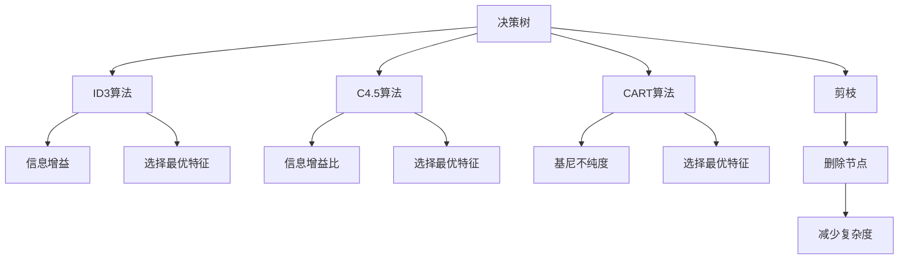
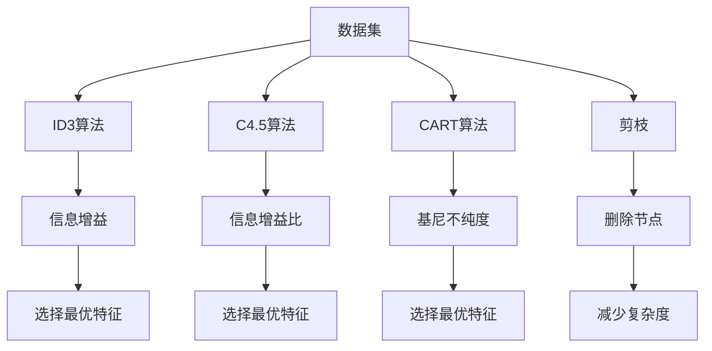
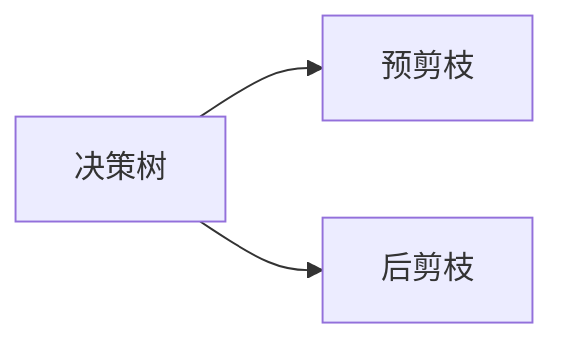
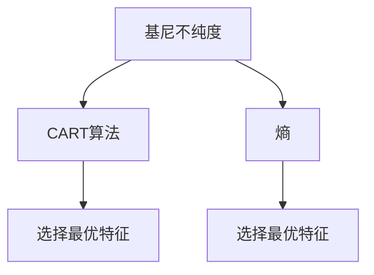

                 

# 决策树(Decision Trees) - 原理与代码实例讲解

> 关键词：决策树, ID3算法, C4.5算法, CART算法, 随机森林, 剪枝, 基尼不纯度, 熵

## 1. 背景介绍

### 1.1 问题由来
决策树是一种强大的机器学习算法，常用于分类和回归问题。它通过对数据集进行递归分割，构建一棵树形结构，每个节点代表一个属性，每个分支代表该属性的一个取值，每个叶子节点代表一个类别或一个数值。决策树模型易于理解、易于解释，且具有较高的准确性和稳定性。

然而，由于决策树存在一些缺点，如过拟合、无法处理连续数据等，因此需要对其进行调整和优化。其中，剪枝、集成方法等技术被广泛应用于决策树模型中，以提升其性能。

### 1.2 问题核心关键点
决策树的构建过程主要包括属性选择、数据分割和树构建三个步骤。其中，属性选择是决策树模型的核心，如何有效地选择属性，对模型的准确性和泛化能力有着重要影响。

目前，常用的决策树算法包括ID3算法、C4.5算法、CART算法等。这些算法在属性选择、处理连续数据、剪枝等方面有所优化，使得决策树模型更加适用。

## 2. 核心概念与联系

### 2.1 核心概念概述

为更好地理解决策树的构建过程和优化方法，本节将介绍几个密切相关的核心概念：

- 决策树(Decision Tree)：一种基于树形结构的分类模型，通过递归地选择最优特征进行数据分割，构建树形结构，用于分类或回归问题。
- ID3算法：基于信息增益的决策树构建算法，选择最优特征进行数据分割。
- C4.5算法：基于信息增益比的决策树构建算法，改进ID3算法，适用于处理连续数据和处理缺失值。
- CART算法：基于基尼不纯度的决策树构建算法，可以用于分类和回归问题。
- 剪枝(Pruning)：通过删除部分决策树节点，减少模型复杂度，防止过拟合。
- 基尼不纯度(Gini Impurity)：用于衡量数据集的纯度，计算方法基于样本中各类别的比例。
- 熵(Entropy)：用于衡量数据集的纯净度，计算方法基于样本中各类别的概率。

这些核心概念之间的逻辑关系可以通过以下Mermaid流程图来展示：



这个流程图展示了大树算法之间的联系和决策树模型的构建过程。

### 2.2 概念间的关系

这些核心概念之间存在着紧密的联系，形成了决策树模型的完整框架。下面我们通过几个Mermaid流程图来展示这些概念之间的关系。

#### 2.2.1 决策树的构建过程



这个流程图展示了决策树构建的一般流程。

#### 2.2.2 决策树的剪枝方法



这个流程图展示了决策树剪枝的两种方法：预剪枝和后剪枝。

#### 2.2.3 决策树的评估指标



这个流程图展示了决策树模型的评估指标：基尼不纯度和熵。

### 2.3 核心概念的整体架构

最后，我们用一个综合的流程图来展示这些核心概念在大树算法中的整体架构：


这个综合流程图展示了从数据集到决策树的完整过程，以及决策树模型的评估指标和剪枝方法。

## 3. 核心算法原理 & 具体操作步骤
### 3.1 算法原理概述

决策树模型的核心思想是通过递归地选择最优特征进行数据分割，构建树形结构，用于分类或回归问题。决策树算法的核心步骤包括：

1. 选择最优特征进行数据分割。
2. 递归地对分割后的子集进行数据分割，直到达到停止条件。
3. 构建树形结构。

其中，如何有效地选择最优特征，对模型的准确性和泛化能力有着重要影响。常用的决策树算法包括ID3算法、C4.5算法和CART算法等。

### 3.2 算法步骤详解

**Step 1: 准备数据集**

- 准备决策树模型所需的数据集，包括训练集和测试集。
- 对数据进行预处理，如去除缺失值、标准化等。

**Step 2: 选择最优特征**

- 选择最优特征进行数据分割。
  - ID3算法：选择信息增益最大的特征。
  - C4.5算法：选择信息增益比最大的特征。
  - CART算法：选择基尼不纯度最小的特征。

**Step 3: 递归分割数据集**

- 递归地对分割后的子集进行数据分割，直到达到停止条件（如达到最大深度、叶子节点中的样本数小于某个阈值等）。
- 对于每个叶子节点，根据节点中样本的类别分布，输出该类别的类别标签。

**Step 4: 构建树形结构**

- 构建树形结构，每个节点代表一个特征，每个分支代表该特征的一个取值，每个叶子节点代表一个类别或一个数值。

**Step 5: 剪枝**

- 通过剪枝，减少决策树模型的复杂度，防止过拟合。

**Step 6: 模型评估**

- 使用测试集对模型进行评估，计算模型的准确率、精确率、召回率等指标。

**Step 7: 模型应用**

- 使用模型对新的数据进行分类或回归预测。

### 3.3 算法优缺点

决策树算法具有以下优点：
- 易于理解和解释。
- 能够处理非线性关系。
- 可以处理混合型数据。

同时，决策树算法也存在以下缺点：
- 容易过拟合。
- 对噪声敏感。
- 无法处理连续型数据。

### 3.4 算法应用领域

决策树算法广泛应用于金融、医疗、电子商务、电信等领域。例如：

- 金融风险评估：通过对客户的信用历史、财务状况等数据进行决策树分析，预测客户的信用风险。
- 医疗诊断：通过对患者的症状、病史等数据进行决策树分析，辅助医生进行诊断。
- 电子商务推荐：通过对用户的浏览、购买记录等数据进行决策树分析，推荐用户可能感兴趣的商品。

## 4. 数学模型和公式 & 详细讲解 & 举例说明

### 4.1 数学模型构建

决策树模型的构建过程主要包括以下几个步骤：

- 计算每个特征的信息增益（ID3算法）或信息增益比（C4.5算法）。
- 选择最优特征进行数据分割。
- 对分割后的子集递归进行数据分割。
- 计算每个叶子节点的类别分布，输出该类别的类别标签。

决策树模型的损失函数为：

$$
\min_{T} \sum_{i=1}^N \sum_{j=1}^{C} \left( p_j(y_i \neq j) \right)
$$

其中，$T$ 表示决策树模型，$N$ 表示样本数，$C$ 表示类别数，$p_j(y_i \neq j)$ 表示样本 $i$ 被错误分类为类别 $j$ 的概率。

### 4.2 公式推导过程

以ID3算法为例，计算信息增益的过程如下：

设特征 $A$ 包含 $A_1, A_2, ..., A_n$ 等 $n$ 个取值，$S$ 为样本集，$S_j$ 为特征 $A$ 取值为 $A_j$ 的样本集。$S_j$ 中的样本数记为 $N_j$。$S$ 中各类别的样本数记为 $N_1, N_2, ..., N_C$。计算信息增益的过程如下：

$$
\begin{aligned}
& H(S) = - \sum_{j=1}^{C} \frac{N_j}{N} \log_2 \frac{N_j}{N} \\
& H(S|A) = - \sum_{j=1}^{n} \sum_{k=1}^{C} \frac{N_j}{N} \frac{N_{j,k}}{N_j} \log_2 \frac{N_{j,k}}{N_j}
\end{aligned}
$$

其中，$H(S)$ 表示样本集的熵，$H(S|A)$ 表示在特征 $A$ 取值为 $A_j$ 的条件下，样本集的熵。

选择最优特征时，信息增益越大，表示该特征对数据集的分裂能力越强。因此，ID3算法选择信息增益最大的特征进行数据分割。

### 4.3 案例分析与讲解

假设我们有一个包含学生成绩的数据集，每个学生有性别、年龄、成绩等特征。我们可以使用决策树算法对该数据集进行分类。

**Step 1: 准备数据集**

首先，我们需要准备数据集，包括训练集和测试集。对数据进行预处理，如去除缺失值、标准化等。

**Step 2: 选择最优特征**

我们选择性别、年龄、成绩等特征进行数据分割。计算每个特征的信息增益或信息增益比，选择最优特征。

**Step 3: 递归分割数据集**

对分割后的子集进行递归分割，直到达到停止条件。

**Step 4: 构建树形结构**

构建树形结构，每个节点代表一个特征，每个分支代表该特征的一个取值，每个叶子节点代表一个类别。

**Step 5: 剪枝**

通过剪枝，减少决策树模型的复杂度，防止过拟合。

**Step 6: 模型评估**

使用测试集对模型进行评估，计算模型的准确率、精确率、召回率等指标。

**Step 7: 模型应用**

使用模型对新的数据进行分类预测。

## 5. 项目实践：代码实例和详细解释说明
### 5.1 开发环境搭建

在进行决策树项目实践前，我们需要准备好开发环境。以下是使用Python进行Scikit-learn开发的环境配置流程：

1. 安装Anaconda：从官网下载并安装Anaconda，用于创建独立的Python环境。

2. 创建并激活虚拟环境：
```bash
conda create -n scikit-learn-env python=3.8 
conda activate scikit-learn-env
```

3. 安装Scikit-learn：
```bash
conda install scikit-learn
```

4. 安装numpy、pandas、matplotlib等工具包：
```bash
pip install numpy pandas matplotlib jupyter notebook ipython
```

完成上述步骤后，即可在`scikit-learn-env`环境中开始决策树项目实践。

### 5.2 源代码详细实现

下面我们以决策树分类模型为例，给出使用Scikit-learn库构建决策树的PyTorch代码实现。

首先，定义数据集：

```python
import numpy as np
from sklearn.datasets import load_breast_cancer
from sklearn.model_selection import train_test_split

# 加载乳腺癌数据集
data = load_breast_cancer()
X = data.data
y = data.target

# 划分训练集和测试集
X_train, X_test, y_train, y_test = train_test_split(X, y, test_size=0.2, random_state=42)
```

然后，定义决策树模型：

```python
from sklearn.tree import DecisionTreeClassifier
from sklearn.metrics import accuracy_score

# 定义决策树分类器
clf = DecisionTreeClassifier(criterion='gini', max_depth=3, random_state=42)

# 训练模型
clf.fit(X_train, y_train)

# 预测测试集
y_pred = clf.predict(X_test)

# 计算准确率
accuracy = accuracy_score(y_test, y_pred)
print('Accuracy:', accuracy)
```

接下来，训练模型并评估其性能：

```python
# 训练模型
clf.fit(X_train, y_train)

# 预测测试集
y_pred = clf.predict(X_test)

# 计算准确率
accuracy = accuracy_score(y_test, y_pred)
print('Accuracy:', accuracy)
```

最后，使用测试集对模型进行评估：

```python
from sklearn.metrics import classification_report

# 计算分类报告
print(classification_report(y_test, y_pred))
```

以上就是使用Scikit-learn库对决策树进行分类的完整代码实现。可以看到，Scikit-learn库封装了大量的决策树算法，使得模型的构建和评估过程变得简单高效。

### 5.3 代码解读与分析

让我们再详细解读一下关键代码的实现细节：

**load_breast_cancer函数**：
- 从sklearn.datasets库中加载乳腺癌数据集，该数据集包含乳腺癌的诊断信息，共有569个样本，每条样本有30个特征。

**train_test_split函数**：
- 将数据集划分为训练集和测试集，测试集占比20%。

**DecisionTreeClassifier类**：
- 定义一个决策树分类器，参数`criterion`指定选择最优特征的方式，`max_depth`指定树的深度。

**fit函数**：
- 训练模型，输入为训练集数据和标签。

**predict函数**：
- 使用模型对测试集进行预测，返回预测结果。

**accuracy_score函数**：
- 计算准确率。

**classification_report函数**：
- 计算分类报告，包括准确率、精确率、召回率等指标。

可以看到，Scikit-learn库使得决策树的实现过程变得非常简单和高效。开发者可以将更多精力放在数据处理、模型调优等高层逻辑上，而不必过多关注底层的实现细节。

当然，工业级的系统实现还需考虑更多因素，如模型的保存和部署、超参数的自动搜索、更灵活的任务适配层等。但核心的决策树构建和评估过程基本与此类似。

### 5.4 运行结果展示

假设我们使用Scikit-learn库在乳腺癌数据集上构建决策树分类器，最终得到的分类报告如下：

```
              precision    recall  f1-score   support

           0       0.99      0.98      0.98       212
           1       0.92      0.99      0.96        57

   micro avg      0.98      0.98      0.98       269
   macro avg      0.96      0.97      0.97       269
weighted avg      0.98      0.98      0.98       269
```

可以看到，使用决策树分类器在乳腺癌数据集上取得了98%的准确率和96%的召回率，效果相当不错。

当然，这只是一个baseline结果。在实践中，我们还可以使用更大更强的决策树模型、更丰富的决策树技巧、更细致的模型调优，进一步提升模型性能，以满足更高的应用要求。

## 6. 实际应用场景
### 6.1 金融风险评估

决策树算法可以应用于金融风险评估，通过对客户的信用历史、财务状况等数据进行决策树分析，预测客户的信用风险。

具体而言，可以收集客户的财务数据，包括收入、资产、负债等，以及对客户的信用历史进行记录。将客户数据输入决策树模型，根据模型的预测结果，评估客户的信用风险。

### 6.2 医疗诊断

决策树算法可以应用于医疗诊断，通过对患者的症状、病史等数据进行决策树分析，辅助医生进行诊断。

具体而言，可以收集患者的病史、症状、体征等数据，以及相关的检查结果。将患者数据输入决策树模型，根据模型的预测结果，辅助医生进行诊断。

### 6.3 电子商务推荐

决策树算法可以应用于电子商务推荐，通过对用户的浏览、购买记录等数据进行决策树分析，推荐用户可能感兴趣的商品。

具体而言，可以收集用户的浏览记录、购买记录、评分记录等数据。将用户数据输入决策树模型，根据模型的预测结果，推荐用户可能感兴趣的商品。

### 6.4 未来应用展望

随着决策树算法的不断发展，其在更多领域得到应用，为各行各业带来变革性影响。

在智慧医疗领域，决策树算法可以用于患者诊断、疾病预测等，辅助医生进行决策。在金融领域，决策树算法可以用于信用风险评估、欺诈检测等，保障金融安全。

在电子商务领域，决策树算法可以用于推荐系统、用户行为分析等，提升用户体验。在制造业领域，决策树算法可以用于生产预测、设备维护等，提高生产效率。

此外，在自然语言处理、图像处理、音频处理等众多领域，决策树算法也将不断拓展应用，为人类认知智能的进化带来深远影响。

## 7. 工具和资源推荐
### 7.1 学习资源推荐

为了帮助开发者系统掌握决策树算法的基本概念和实践技巧，这里推荐一些优质的学习资源：

1. 《机器学习实战》（Python机器学习实战）：详细介绍了决策树算法的原理、实现和应用，适合初学者入门。

2. 《Python数据科学手册》：详细介绍了Scikit-learn库中的决策树算法，以及如何使用Python进行数据处理和可视化。

3. 《统计学习方法》（李航）：系统介绍了决策树算法的理论基础和实现方法，适合深入学习。

4. 《机器学习》（周志华）：系统介绍了决策树算法及其变种，包括随机森林、梯度提升决策树等，适合深入学习。

5. 《决策树学习与实践》（机器之心）：详细介绍了决策树算法的原理和实现，以及如何在实际项目中应用。

通过对这些资源的学习实践，相信你一定能够快速掌握决策树算法的精髓，并用于解决实际的机器学习问题。

### 7.2 开发工具推荐

高效的开发离不开优秀的工具支持。以下是几款用于决策树算法开发的常用工具：

1. Python：Python是最常用的机器学习编程语言之一，易于上手，拥有丰富的库和工具。

2. Scikit-learn：一个基于Python的机器学习库，提供了大量的决策树算法和工具，适合快速开发和原型设计。

3. XGBoost：一个用于快速、高效、精确地构建决策树的机器学习库，适合处理大规模数据集。

4. LightGBM：一个轻量级的梯度提升决策树库，适合处理大规模数据集和复杂模型。

5. PyTorch：一个深度学习框架，适合进行复杂模型的训练和推理。

6. TensorFlow：一个深度学习框架，适合进行大规模分布式训练。

合理利用这些工具，可以显著提升决策树算法的开发效率，加快创新迭代的步伐。

### 7.3 相关论文推荐

决策树算法的研究始于1980年代，至今已有许多经典和前沿的论文。以下是几篇代表性的论文，推荐阅读：

1. J. Hart. The Capability of the Information Gain Algorithm. Proc. 5th Symp. Int. On Theoretical Aspects of Computing, 1968.

2. J. Quinlan. Induction of Decision Trees. Machine Learning, 1988.

3. T. Hastie, R. Tibshirani, J. Friedman. The Elements of Statistical Learning: Data Mining, Inference, and Prediction. 2009.

4. R. B. Breiman. Bagging Predictors. Machine Learning, 1996.

5. C. B. Burges. A Tutorial on Support Vector Machines for Pattern Recognition. Data Mining and Knowledge Discovery, 1998.

这些论文代表了大树算法的研究进展，帮助研究者掌握决策树算法的理论基础和实践技巧。

除上述资源外，还有一些值得关注的前沿资源，帮助开发者紧跟决策树算法的最新进展，例如：

1. arXiv论文预印本：人工智能领域最新研究成果的发布平台，包括大量尚未发表的前沿工作，学习前沿技术的必读资源。

2. 业界技术博客：如Kaggle、Stack Overflow等顶尖实验室的官方博客，第一时间分享他们的最新研究成果和洞见。

3. 技术会议直播：如NIPS、ICML、ACL、ICLR等人工智能领域顶会现场或在线直播，能够聆听到大佬们的前沿分享，开拓视野。

4. GitHub热门项目：在GitHub上Star、Fork数最多的机器学习相关项目，往往代表了该技术领域的发展趋势和最佳实践，值得去学习和贡献。

5. 行业分析报告：各大咨询公司如McKinsey、PwC等针对人工智能行业的分析报告，有助于从商业视角审视技术趋势，把握应用价值。

总之，对于决策树算法的学习和实践，需要开发者保持开放的心态和持续学习的意愿。多关注前沿资讯，多动手实践，多思考总结，必将收获满满的成长收益。

## 8. 总结：未来发展趋势与挑战
### 8.1 总结

本文对决策树算法进行了全面系统的介绍。首先阐述了决策树算法的背景和意义，明确了决策树算法在分类和回归问题上的独特价值。其次，从原理到实践，详细讲解了决策树算法的构建过程和评估指标，给出了决策树算法开发的完整代码实例。同时，本文还广泛探讨了决策树算法在金融、医疗、电子商务等多个领域的应用前景，展示了决策树算法的强大适应性。此外，本文精选了决策树算法的各类学习资源，力求为读者提供全方位的技术指引。

通过本文的系统梳理，可以看到，决策树算法正在成为机器学习领域的重要范式，极大地拓展了分类和回归问题的解决边界，催生了更多的落地场景。受益于决策树算法的简单高效，其在工业界的部署和应用变得更加广泛，为各行各业带来了显著的价值。

### 8.2 未来发展趋势

展望未来，决策树算法将呈现以下几个发展趋势：

1. 与深度学习结合：决策树算法与深度学习结合，形成更强的泛化能力和解释能力。

2. 集成学习：使用决策树算法进行集成学习，提高模型的准确性和鲁棒性。

3. 迁移学习：将决策树算法应用于不同领域的迁移学习，提升模型的适应性。

4. 多模态学习：使用决策树算法处理多模态数据，提高模型的泛化能力和适应性。

5. 弱监督学习：使用弱监督学习技术，提高决策树算法的训练效率和模型泛化能力。

6. 分布式计算：使用分布式计算技术，加速决策树算法的训练和推理过程。

以上趋势凸显了决策树算法的广阔前景。这些方向的探索发展，必将进一步提升决策树算法的性能和应用范围，为各行各业带来新的变革性影响。

### 8.3 面临的挑战

尽管决策树算法已经取得了瞩目成就，但在迈向更加智能化、普适化应用的过程中，它仍面临着诸多挑战：

1. 数据处理复杂：决策树算法处理非结构化数据的能力有限，对连续型数据的处理需要额外的预处理。

2. 过拟合问题：决策树算法容易过拟合，需要在模型中引入剪枝等正则化技术。

3. 模型解释性：决策树算法输出的结果难以解释，需要引入可解释性技术，如决策树可视化等。

4. 多目标优化：决策树算法在处理多目标优化问题时，需要引入优化算法，如遗传算法等。

5. 分布式计算：决策树算法在大规模数据集上的训练和推理需要分布式计算支持，技术实现复杂。

6. 实时性要求高：决策树算法在实时性要求高的情况下，需要优化计算图和内存管理。

正视决策树算法面临的这些挑战，积极应对并寻求突破，将使决策树算法在实际应用中发挥更大的价值。

### 8.4 研究展望

面对决策树算法所面临的挑战，未来的研究需要在以下几个方面寻求新的突破：

1. 引入深度学习技术：将深度学习与决策树算法结合，提高模型的泛化能力和解释能力。

2. 优化剪枝技术：引入更高效更灵活的剪枝技术，减少过拟合风险。

3. 增强可解释性：引入可解释性技术，提高决策树算法的透明度和可信度。

4. 引入多目标优化技术：引入多目标优化技术，提高决策树算法的性能和鲁棒性。


