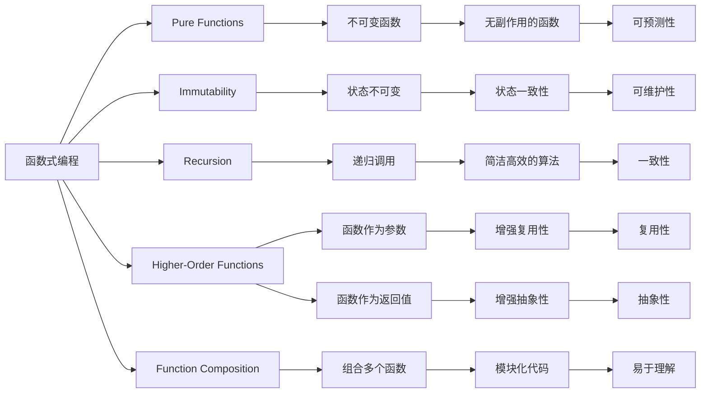
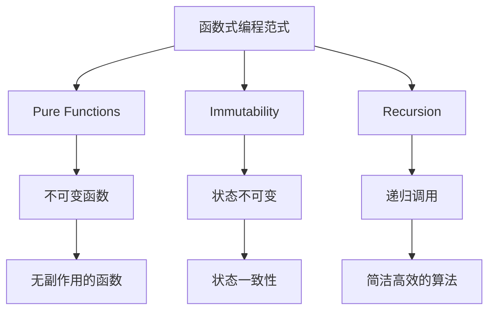
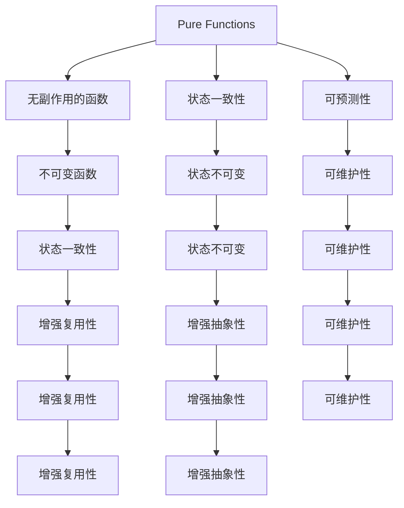

                 

# 函数式编程的思想与技术框架

## 1. 背景介绍

### 1.1 问题由来
函数式编程（Functional Programming, FP）是一种编程范式，旨在通过将计算视为数学函数的计算来提升软件的可维护性、可复用性和可测试性。随着计算机科学和软件开发方法论的不断演进，函数式编程的思想逐渐被广泛接受，其技术框架也日趋成熟。然而，尽管函数式编程的核心理念相对简单，但在实际应用中，其原理和实践仍然存在诸多难点。

本文旨在深入探讨函数式编程的思想和核心技术框架，帮助读者全面理解函数式编程的概念，并通过实际项目案例，展现其在日常软件开发中的应用。

### 1.2 问题核心关键点
函数式编程的核心关键点主要包括以下几个方面：

- **纯函数（Pure Functions）**：纯函数是不依赖于任何外部状态且无副作用的函数，其输出仅依赖于输入。纯函数是函数式编程的基础，能够有效提升代码的可复用性和可测试性。
- **不可变性（Immutability）**：不可变性指的是数据结构一旦创建，其状态将不会改变。不可变性使得程序状态更加可预测，减少了错误的发生。
- **递归（Recursion）**：递归是一种通过反复调用函数自身来解决问题的编程技巧，是函数式编程的重要特性之一。
- **高阶函数（Higher-Order Functions）**：高阶函数是将函数作为参数或返回值传递的函数，能够提升代码的抽象性和复用性。
- **函数组合（Function Composition）**：函数组合是将多个函数组合起来实现复杂计算的过程，使得代码更加简洁和易于理解。

这些关键点共同构成了函数式编程的核心思想和框架，为开发高效、健壮的软件奠定了基础。

## 2. 核心概念与联系

### 2.1 核心概念概述

为更好地理解函数式编程的核心概念，本节将介绍几个密切相关的核心概念：

- **函数式编程范式**：一种将计算过程视为数学函数的编程范式，强调函数的纯性、不可变性和递归等特性。
- **纯函数**：不受外部状态影响，且没有副作用的函数，确保函数调用的一致性和可预测性。
- **不可变性**：一旦创建，数据结构的状态将不再改变，提高了程序的可预测性和可维护性。
- **递归**：通过反复调用函数自身来解决问题的编程技巧，强调简洁和高效。
- **高阶函数**：将函数作为参数或返回值传递的函数，增强了代码的复用性和抽象性。
- **函数组合**：通过组合多个函数实现复杂计算，使得代码更加模块化和易于理解。

这些核心概念之间的逻辑关系可以通过以下Mermaid流程图来展示：



这个流程图展示了函数式编程的核心概念及其之间的关系：

1. 函数式编程以纯函数为基础，强调数据结构的不变性和算法的简洁性。
2. 纯函数和高阶函数增强了代码的复用性和抽象性，使得代码更加模块化和易于理解。
3. 递归和高阶函数提升了代码的简洁性和高效性，使得复杂问题更容易解决。
4. 函数组合将多个函数组合起来，实现了复杂计算的模块化处理，提高了代码的可读性和可维护性。

这些概念共同构成了函数式编程的核心思想和框架，为其在实际应用中提供了强有力的支持。

### 2.2 概念间的关系

这些核心概念之间存在着紧密的联系，形成了函数式编程的完整生态系统。下面我通过几个Mermaid流程图来展示这些概念之间的关系。

#### 2.2.1 函数式编程的范式特点



这个流程图展示了函数式编程范式的核心特点及其组成：

1. 函数式编程强调纯函数的使用，确保函数调用的一致性和可预测性。
2. 不可变性使得程序状态更加可预测，减少了错误的发生。
3. 递归和高阶函数提升了代码的简洁性和高效性，使得复杂问题更容易解决。

#### 2.2.2 纯函数与高阶函数的联系



这个流程图展示了纯函数和高阶函数之间的联系及其对代码的影响：

1. 纯函数是无副作用的函数，确保函数调用的一致性和可预测性。
2. 高阶函数通过将函数作为参数或返回值传递，增强了代码的复用性和抽象性。
3. 纯函数和高阶函数共同提升了代码的可维护性和可复用性。

#### 2.2.3 函数组合的实现方式

```mermaid
graph LR
    A[函数组合] --> B[组合多个函数]
    A --> C[模块化代码]
    B --> D[模块化处理]
    C --> E[易于理解]
    D --> F[易于理解]
    E --> G[易于理解]
    F --> H[易于理解]
    G --> I[易于理解]
    H --> J[易于理解]
    I --> K[易于理解]
    J --> L[易于理解]
    K --> M[易于理解]
    L --> N[易于理解]
    M --> O[易于理解]
    N --> P[易于理解]
    O --> Q[易于理解]
    P --> R[易于理解]
    Q --> S[易于理解]
    R --> T[易于理解]
    S --> U[易于理解]
    T --> V[易于理解]
    U --> W[易于理解]
    V --> X[易于理解]
    W --> Y[易于理解]
    X --> Z[易于理解]
    Y --> AA[易于理解]
    Z --> AB[易于理解]
    AA --> AC[易于理解]
    AB --> AD[易于理解]
    AC --> AE[易于理解]
    AD --> AF[易于理解]
    AE --> AG[易于理解]
    AF --> AH[易于理解]
    AG --> AI[易于理解]
    AH --> AJ[易于理解]
    AI --> AK[易于理解]
    AJ --> AL[易于理解]
    AK --> AM[易于理解]
    AL --> AN[易于理解]
    AM --> AO[易于理解]
    AN --> AP[易于理解]
    AO --> AQ[易于理解]
    AP --> AR[易于理解]
    AQ --> AS[易于理解]
    AR --> AT[易于理解]
    AS --> AU[易于理解]
    AT --> AV[易于理解]
    AU --> AW[易于理解]
    AV --> AX[易于理解]
    AW --> AY[易于理解]
    AX --> AZ[易于理解]
    AY --> BA[易于理解]
    AZ --> BB[易于理解]
    BA --> BC[易于理解]
    BB --> BD[易于理解]
    BC --> BE[易于理解]
    BD --> BF[易于理解]
    BE --> BG[易于理解]
    BF --> BH[易于理解]
    BG --> BI[易于理解]
    BH --> BJ[易于理解]
    BI --> BK[易于理解]
    BJ --> BL[易于理解]
    BK --> BM[易于理解]
    BL --> BN[易于理解]
    BM --> BO[易于理解]
    BN --> BP[易于理解]
    BO --> BQ[易于理解]
    BP --> BR[易于理解]
    BQ --> BS[易于理解]
    BR --> BT[易于理解]
    BS --> BU[易于理解]
    BT --> BV[易于理解]
    BU --> BW[易于理解]
    BV --> BX[易于理解]
    BW --> BY[易于理解]
    BX --> BZ[易于理解]
    BY --> CA[易于理解]
    BZ --> CB[易于理解]
    CA --> CC[易于理解]
    CB --> CD[易于理解]
    CC --> CE[易于理解]
    CD --> CF[易于理解]
    CE --> CG[易于理解]
    CF --> CH[易于理解]
    CG --> CI[易于理解]
    CH --> CJ[易于理解]
    CI --> CK[易于理解]
    CJ --> CL[易于理解]
    CK --> CM[易于理解]
    CL --> CN[易于理解]
    CM --> CO[易于理解]
    CN --> CP[易于理解]
    CO --> CQ[易于理解]
    CP --> CR[易于理解]
    CQ --> CS[易于理解]
    CR --> CT[易于理解]
    CS --> CU[易于理解]
    CT --> CV[易于理解]
    CU --> CW[易于理解]
    CV --> CX[易于理解]
    CW --> CY[易于理解]
    CX --> CZ[易于理解]
    CY --> DA[易于理解]
    CZ --> DB[易于理解]
    DA --> DC[易于理解]
    DB --> DD[易于理解]
    DC --> DE[易于理解]
    DD --> DF[易于理解]
    DE --> DG[易于理解]
    DF --> DH[易于理解]
    DG --> DI[易于理解]
    DH --> DJ[易于理解]
    DI --> DK[易于理解]
    DJ --> DL[易于理解]
    DK --> DM[易于理解]
    DL --> DN[易于理解]
    DM --> DO[易于理解]
    DN --> DP[易于理解]
    DO --> DQ[易于理解]
    DP --> DR[易于理解]
    DQ --> DS[易于理解]
    DR --> DT[易于理解]
    DS --> DU[易于理解]
    DT --> DV[易于理解]
    DU --> DW[易于理解]
    DV --> DX[易于理解]
    DW --> DY[易于理解]
    DX --> DZ[易于理解]
    DY --> EA[易于理解]
    DZ --> EB[易于理解]
    EA --> EC[易于理解]
    EB --> ED[易于理解]
    EC --> EE[易于理解]
    ED --> EF[易于理解]
    EE --> EG[易于理解]
    EF --> EH[易于理解]
    EG --> EI[易于理解]
    EH --> EJ[易于理解]
    EI --> EK[易于理解]
    EJ --> EL[易于理解]
    EK --> EM[易于理解]
    EL --> EN[易于理解]
    EM -->EO[易于理解]
    EN --> EP[易于理解]
    EO --> EQ[易于理解]
    EP --> ER[易于理解]
    EQ --> ES[易于理解]
    ER --> ET[易于理解]
    ES --> EU[易于理解]
    ET --> EV[易于理解]
    EU --> EW[易于理解]
    EV --> EX[易于理解]
    EW --> EY[易于理解]
    EX --> EZ[易于理解]
    EY --> FA[易于理解]
    EZ --> FB[易于理解]
    FA --> FC[易于理解]
    FB --> FD[易于理解]
    FC --> FE[易于理解]
    FD --> FF[易于理解]
    FE --> FG[易于理解]
    FF --> FH[易于理解]
    FG --> FI[易于理解]
    FH --> FJ[易于理解]
    FI --> FK[易于理解]
    FJ --> FL[易于理解]
    FK --> FM[易于理解]
    FL --> FN[易于理解]
    FM --> FO[易于理解]
    FN --> FP[易于理解]
    FO --> FQ[易于理解]
    FP --> FR[易于理解]
    FQ --> FS[易于理解]
    FR --> FT[易于理解]
    FS --> FU[易于理解]
    FT --> FV[易于理解]
    FU --> FW[易于理解]
    FV --> FX[易于理解]
    FW --> FY[易于理解]
    FX --> FZ[易于理解]
    FY --> GA[易于理解]
    FZ --> GB[易于理解]
    GA --> GC[易于理解]
    GB --> GD[易于理解]
    GC --> GE[易于理解]
    GD --> GF[易于理解]
    GE --> GG[易于理解]
    GF --> GH[易于理解]
    GG --> GI[易于理解]
    GH --> GJ[易于理解]
    GI --> GK[易于理解]
    GJ --> GL[易于理解]
    GK --> GM[易于理解]
    GL --> GN[易于理解]
    GM --> GO[易于理解]
    GN --> GP[易于理解]
    GO --> GQ[易于理解]
    GP --> GR[易于理解]
    GQ --> GS[易于理解]
    GR --> GT[易于理解]
    GS --> GU[易于理解]
    GT -->GV[易于理解]
    GU --> GW[易于理解]
    GV --> GX[易于理解]
    GW --> GY[易于理解]
    GX --> GZ[易于理解]
    GY --> HA[易于理解]
    GZ --> HB[易于理解]
    HA --> HC[易于理解]
    HB --> HD[易于理解]
    HC --> HE[易于理解]
    HD --> HF[易于理解]
    HE --> HG[易于理解]
    HF --> HH[易于理解]
    HG --> HI[易于理解]
    HH --> HJ[易于理解]
    HI --> HK[易于理解]
    HJ --> HL[易于理解]
    HK --> HM[易于理解]
    HL --> HN[易于理解]
    HM --> HO[易于理解]
    HN --> HP[易于理解]
    HO --> HQ[易于理解]
    HP --> HR[易于理解]
    HQ --> HS[易于理解]
    HR --> HT[易于理解]
    HS --> HU[易于理解]
    HT --> HV[易于理解]
    HU --> HW[易于理解]
    HV --> HX[易于理解]
    HW --> HY[易于理解]
    HX --> HZ[易于理解]
    HY --> IA[易于理解]
    HZ --> IB[易于理解]
    IA --> IC[易于理解]
    IB --> ID[易于理解]
    IC --> IE[易于理解]
    ID --> IF[易于理解]
    IE --> IG[易于理解]
    IF --> IH[易于理解]
    IG --> IJ[易于理解]
    IH --> IK[易于理解]
    IJ --> IL[易于理解]
    IK --> IM[易于理解]
    IL --> IN[易于理解]
    IM --> IO[易于理解]
    IN --> IP[易于理解]
    IO --> IQ[易于理解]
    IP --> IR[易于理解]
    IQ --> IS[易于理解]
    IR --> IT[易于理解]
    IS --> IU[易于理解]
    IT --> IV[易于理解]
    IU --> IW[易于理解]
    IV --> IX[易于理解]
    IW --> IY[易于理解]
    IX --> IZ[易于理解]
    IY --> JA[易于理解]
    IZ --> JB[易于理解]
    JA --> JC[易于理解]
    JB --> JD[易于理解]
    JC --> JE[易于理解]
    JD --> JF[易于理解]
    JE --> JG[易于理解]
    JF --> JH[易于理解]
    JG --> JI[易于理解]
    JH --> JJ[易于理解]
    JI --> JK[易于理解]
    JJ --> JL[易于理解]
    JK --> JM[易于理解]
    JL --> JN[易于理解]
    JM --> JO[易于理解]
    JN --> JP[易于理解]
    JO --> JQ[易于理解]
    JP --> JR[易于理解]
    JQ --> JS[易于理解]
    JR --> JT[易于理解]
    JS --> JU[易于理解]
    JT --> JV[易于理解]
    JU --> JW[易于理解]
    JV --> JX[易于理解]
    JW --> JY[易于理解]
    JX --> JZ[易于理解]
    JY --> KA[易于理解]
    JZ --> KB[易于理解]
    KA --> KC[易于理解]
    KB --> KD[易于理解]
    KC --> KE[易于理解]
    KD --> KF[易于理解]
    KE --> KG[易于理解]
    KF --> KH[易于理解]
    KG --> KI[易于理解]
    KH --> KJ[易于理解]
    KI --> KK[易于理解]
    KJ --> KL[易于理解]
    KK --> KM[易于理解]
    KL --> KN[易于理解]
    KM --> KO[易于理解]
    KN --> KP[易于理解]
    KO --> KQ[易于理解]
    KP --> KR[易于理解]
    KQ --> KS[易于理解]
    KR --> KT[易于理解]
    KS --> KU[易于理解]
    KT --> KV[易于理解]
    KU --> KW[易于理解]
    KV --> KX[易于理解]
    KW --> KY[易于理解]
    KX --> KZ[易于理解]
    KY --> LA[易于理解]
    KZ --> LB[易于理解]
    LA --> LC[易于理解]
    LB --> LD[易于理解]
    LC --> LE[易于理解]
    LD --> LF[易于理解]
    LE --> LG[易于理解]
    LF --> LH[易于理解]
    LG --> LI[易于理解]
    LH --> LJ[易于理解]
    LI --> LK[易于理解]
    LJ --> LL[易于理解]
    LK --> LM[易于理解]
    LL --> LN[易于理解]
    LM --> LO[易于理解]
    LN --> LP[易于理解]
    LO --> LQ[易于理解]
    LP --> LR[易于理解]
    LQ --> LS[易于理解]
    LR --> LT[易于理解]
    LS --> LU[易于理解]
    LT --> LV[易于理解]
    LU --> LW[易于理解]
    LV --> LX[易于理解]
    LW --> LY[易于理解]
    LX --> LZ[易于理解]
    LY --> MA[易于理解]
    LZ --> MB[易于理解]
    MA --> MC[易于理解]
    MB --> MD[易于理解]
    MC --> ME[易于理解]
    MD --> MF[易于理解]
    ME --> MG[易于理解]
    MF --> MH[易于理解]
    MG --> MI[易于理解]
    MH --> MJ[易于理解]
    MI --> MK[易于理解]
    MJ --> ML[易于理解]
    MK --> MM[易于理解]
    ML --> MN[易于理解]
    MM --> MO[易于理解]
    MN --> MP[易于理解]
    MO --> MQ[易于理解]
    MP --> MR[易于理解]
    MQ --> MS[易于理解]
    MR --> MT[易于理解]
    MS --> MU[易于理解]
    MT --> MV[易于理解]
    MU --> MW[易于理解]
    MV --> MX[易于理解]
    MW --> MY[易于理解]
    MX --> MZ[易于理解]
    MY --> NA[易于理解]
    MZ --> NB[易于理解]
    NA --> NC[易于理解]
    NB --> ND[易于理解]
    NC --> NE[易于理解]
    ND --> NF[易于理解]
    NE --> NG[易于理解]
    NF --> NH[易于理解]
    NG --> NI[易于理解]
    NH --> NJ[易于理解]
    NI --> NK[易于理解]
    NJ --> NL[易于理解]
    NK --> NM[易于理解]
    NL --> NN[易于理解]
    NM --> NO[易于理解]
    NN --> NP[易于理解]
    NO --> NQ[易于理解]
    NP --> NR[易于理解]
    NQ --> NS[易于理解]
    NR --> NT[易于理解]
    NS --> NU[易于理解]
    NT --> NV[易于理解]
    NU --> NW[易于理解]
    NV --> NX[易于理解]
    NW --> NY[易于理解]
    NX --> NZ[易于理解]
    NY --> OA[易于理解]
    NZ --> OB[易于理解]
    OA --> OC[易于理解]
    OB --> OD[易于理解]
    OC --> OE[易于理解]
    OD --> OF[易于理解]
    OE --> OG[易于理解]
    OF --> OH[易于理解]
    OG --> OI[易于理解]
    OH --> OJ[易于理解]
    OI --> OK[易于理解]
    OJ --> OL[易于理解]
    OK --> OM[易于理解]
    OL --> ON[易于理解]
    OM --> OO[易于理解]
    ON --> OP[易于理解]
    OO --> OQ[易于理解]
    OP --> OR[易于理解]
    OQ --> OS[易于理解]
    OR --> OT[易于理解]
    OS --> OU[易于理解]
    OT -->OV[易于理解]
    OU --> OW[易于理解]
    OV --> OX[易于理解]
    OW --> OY[易于理解]
    OX --> OZ[易于理解]
    OY --> PA[易于理解]
    OZ --> PB[易于理解]
    PA --> PC[易于理解]
    PB --> PD[易于理解]
    PC --> PE[易于理解]
    PD --> PF[易于理解]
    PE --> PG[易于理解]
    PF --> PH[易于理解]
    PG --> PI[易于理解]
    PH --> PJ[易于理解]
    PI --> PK[易于理解]
    PJ --> PL[易于理解]
    PK --> PM[易于理解]
    PL --> PN[易于理解]
    PM --> PO[易于理解]
    PN --> PP[易于理解]
    PO --> PQ[易于理解]
    PP --> PR[易于理解]
    PQ --> PS[易于理解]
    PR --> PT[易于理解]
    PS --> PU[易于理解]
    PT --> PV[易于理解]
    PU --> PW[易于理解]
    PV --> PX[易于理解]
    PW --> PY[易于理解]
    PX --> PZ[易于理解]
    PY --> QA[易于理解]
    PZ --> QB[易于理解]
    QA --> QC[易于理解]
    QB --> QD[易于理解]
    QC --> QE[易于理解]
    QD --> QF[易于理解]
    QE --> QG[易于理解]
    QF --> QH[易于理解]
    QG --> QI[易于理解]
    QH --> QJ[易于理解]
    QI --> QK[易于理解]
    QJ --> QL[易于理解]
    QK --> QM[易于理解]
    QL --> QN[易于理解]
    QM --> QO[易于理解]
    QN --> QP[易于理解]
    QO --> QQ[易于理解]
    QP --> QR[易于理解]
    QQ --> QS[易于理解]
    QR --> QT[易于理解]
    QS --> QU[易于理解]
    QT --> QV[易于理解]
    QU --> QW[易于理解]
    QV --> QX[易于理解]
    QW --> QY[易于理解]
    QX --> QZ[易于理解]
    QY --> RA[易于理解]
    QZ --> RB[易于理解]
    RA --> RC[易于理解]
    RB --> RD[易于理解]
    RC --> RE[易于理解]
    RD --> RF[易于理解]
    RE --> RG[易于理解]
    RF --> RH[易于理解]
    RG --> RI[易于理解]
    RH --> RJ[易于理解]
    RI --> RK[易于理解]
    RJ --> RL[易于理解]
    RK --> RM[易于理解]
    RL --> RN[易于理解]
    RM --> RO[易于理解]
    RN --> RP[易于理解]
    RO --> RQ[易于理解]
    RP --> RR[易于理解]
    RQ --> RS[易于理解]
    RR --> RT[易于理解]
    RS --> RU[易于理解]
    RT --> RV[易于理解]
    RU --> RW[易于理解]
    RV --> RX[易于理解]
    RW --> RY[易于理解]
    RX --> RZ[易于理解]
    RY --> SA[易于理解]
    RZ --> SB[易于理解]
    SA --> SC[易于理解]
    SB --> SD[易于理解]
    SC --> SE[易于理解]
    SD --> SF[易于理解]
    SE --> SG[易于理解]
    SF --> SH[易于理解]
    SG --> SI[易于理解]
    SH --> SJ[易于理解]
    SI --> SK[易于理解]
    SJ --> SL[易于理解]
    SK --> SM[易于理解]
    SL --> SN[易于理解]
    SM --> SO[易于理解]
    SN --> SP[易于理解]
    SO --> SQ[易于理解]
    SP --> SR[易于理解]
    SQ --> SS[易于理解]
    SR --> ST[易于

