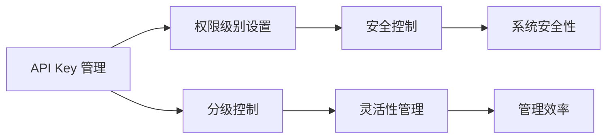

                 

## 1. 背景介绍

在当今的数字化时代，API Key（应用程序编程接口密钥）已经成为了几乎所有软件开发项目中不可或缺的一部分。API Key的作用是验证请求来源，确保只有授权的客户端能够访问特定的服务，从而保护系统安全。然而，对于那些拥有大量客户端或多种服务的应用系统而言，管理单一的 API Key 已变得不再可行。为此，分级 API Key（Graded API Key）成为了一种更有效的方式来管理不同级别和权限的客户端请求。

分级 API Key 允许应用系统管理员根据不同的客户端或服务的需求，分配不同权限级别的 API Key，每个 Key 拥有不同的访问权限。例如，某些 API Key 可能只能访问特定的服务或功能，而其他 Key 则可能提供更广泛的访问权限。这种设置方法既保证了系统的安全性，又提高了管理的灵活性。

## 2. 核心概念与联系

### 2.1 核心概念概述

分级 API Key 设置方法的核心概念包括以下几个方面：

1. **API Key 管理**：为不同的客户端或服务分配和管理 API Key，以验证客户端的身份和权限。
2. **权限级别**：根据需求为 API Key 设置不同的访问权限级别，以限制客户端的操作范围。
3. **分级控制**：为不同的服务或功能设置不同的权限级别，以实现更精细的访问控制。
4. **安全性**：通过分级控制，确保只有授权的客户端能够访问特定的服务，从而提高系统的安全性。
5. **灵活性**：分级 API Key 的设置使得管理员可以根据需求灵活调整客户端的权限，提高了系统的管理效率。

这些核心概念之间的联系可以通过以下 Mermaid 流程图来展示：



这个流程图展示了分级 API Key 设置方法的核心流程和目标。管理员首先对 API Key 进行管理，然后根据不同的服务需求设置不同的权限级别，实现分级控制。这样，系统安全性得到了保障，管理效率也得到了提高。

### 2.2 概念间的关系

分级 API Key 设置方法与其他 API 管理方法相比，具有以下特点：

1. **细粒度控制**：与单一的 API Key 相比，分级 API Key 提供了更细粒度的控制，可以精确控制每个客户端或服务的访问权限。
2. **安全性增强**：分级 API Key 设置方法通过细粒度的权限控制，降低了系统被未经授权的客户端访问的风险，增强了系统的安全性。
3. **灵活性提高**：分级 API Key 的设置方法使得管理员可以根据不同的需求灵活调整客户端的访问权限，提高了系统的管理效率。
4. **多服务集成**：分级 API Key 设置方法适用于多服务的集成场景，能够更好地管理不同服务的访问权限。

## 3. 核心算法原理 & 具体操作步骤

### 3.1 算法原理概述

分级 API Key 设置方法的算法原理基于以下基本思想：

1. **API Key 分配**：根据不同的客户端或服务的需求，分配和管理 API Key，确保每个客户端或服务都有唯一的 API Key。
2. **权限级别设置**：为每个 API Key 设置不同的权限级别，每个级别对应不同的访问权限。
3. **分级控制**：根据不同的服务或功能，设置不同的权限级别，实现更精细的访问控制。

### 3.2 算法步骤详解

分级 API Key 设置方法的具体操作步骤如下：

1. **需求分析**：确定系统中不同客户端或服务的需求，包括所需的功能、数据访问权限等。
2. **API Key 分配**：根据需求为不同的客户端或服务分配唯一的 API Key。
3. **权限级别设置**：为每个 API Key 设置不同的权限级别，每个级别对应不同的访问权限。
4. **分级控制**：根据不同的服务或功能，设置不同的权限级别，实现更精细的访问控制。
5. **密钥管理**：定期对 API Key 进行管理和维护，包括分配、撤销、更新等操作。

### 3.3 算法优缺点

分级 API Key 设置方法的优点包括：

1. **安全性高**：通过细粒度的权限控制，降低了系统被未经授权的客户端访问的风险，提高了系统的安全性。
2. **管理灵活**：根据不同的需求灵活调整客户端的访问权限，提高了系统的管理效率。
3. **易于扩展**：适用于多服务的集成场景，能够更好地管理不同服务的访问权限。

然而，分级 API Key 设置方法也存在一些缺点：

1. **管理复杂**：API Key 和权限级别的管理需要耗费大量时间和人力，特别是在系统规模较大时。
2. **维护难度大**：随着系统的不断发展和业务的变化，需要定期对 API Key 和权限级别进行管理和维护，增加了维护的难度。
3. **技术要求高**：实现分级 API Key 设置方法需要较高的技术水平，特别是在多服务的集成场景下。

### 3.4 算法应用领域

分级 API Key 设置方法广泛应用于以下领域：

1. **金融领域**：金融系统中的交易服务、资金管理、客户服务等功能，都需要细粒度的访问控制。
2. **医疗领域**：医疗系统的病人数据管理、医疗记录查询、预约服务等，都需要严格的权限控制。
3. **电子商务**：电商平台的商品管理、订单处理、物流跟踪等功能，都需要细粒度的访问控制。
4. **社交媒体**：社交媒体平台的用户管理、内容发布、广告投放等功能，都需要严格的权限控制。

## 4. 数学模型和公式 & 详细讲解 & 举例说明

### 4.1 数学模型构建

分级 API Key 设置方法可以通过以下数学模型来表示：

1. **API Key 集合**：记 API Key 集合为 $K$，其中每个元素 $k_i$ 表示一个 API Key。
2. **权限级别**：记权限级别集合为 $P$，其中每个元素 $p_j$ 表示一个权限级别。
3. **权限映射**：记 API Key 到权限级别的映射函数为 $M: K \rightarrow P$，表示每个 API Key 的权限级别。

### 4.2 公式推导过程

分级 API Key 设置方法的公式推导过程如下：

1. **API Key 分配**：对于每个 API Key $k_i$，分配唯一的标识符 $id_i$。
2. **权限级别设置**：对于每个权限级别 $p_j$，定义一个集合 $S_j$，表示拥有该权限级别 $p_j$ 的 API Key 的集合。
3. **分级控制**：对于每个服务 $S$，定义一个权限集合 $P(S)$，表示该服务需要的权限级别的集合。

根据上述定义，可以得到以下推导公式：

$$
M(k_i) = p_j \quad \text{如果} \quad k_i \in S_j
$$

其中 $M(k_i)$ 表示 API Key $k_i$ 的权限级别，$p_j$ 表示权限级别，$S_j$ 表示拥有该权限级别的 API Key 的集合。

### 4.3 案例分析与讲解

以一个电商平台的库存管理系统为例，假设需要细粒度的访问控制，将 API Key 和权限级别设置为：

- **API Key**：用于库存查询、修改、物流跟踪等功能的 API Key。
- **权限级别**：超级管理员、管理员、普通用户等。

根据上述设置，可以得到以下权限映射：

- **超级管理员**：拥有所有功能的权限，可以访问所有 API Key。
- **管理员**：只能访问库存查询和修改功能，可以访问部分 API Key。
- **普通用户**：只能访问库存查询功能，不能访问库存修改和物流跟踪功能。

## 5. 项目实践：代码实例和详细解释说明

### 5.1 开发环境搭建

分级 API Key 设置方法的实现需要依赖一个支持细粒度权限控制的 API 管理平台，如 Apache Thrift、Apache Restlet 等。这里以 Apache Restlet 为例，介绍分级 API Key 的实现。

1. **安装 Apache Restlet**：
```
sudo apt-get install restlet
```

2. **配置权限控制**：
在 `restlet.properties` 文件中配置 API Key 和权限控制规则。例如：
```
restlet.mutual.ssl.enforce=true
restlet.ssl.keystore.password=password
restlet.ssl.keystore=path/to/keystore
restlet.ssl.key.password=password
restlet.ssl.key=path/to/key
restlet.ssl.cert.password=password
restlet.ssl.cert=path/to/cert
restlet.ssl.keyManager.password=password
restlet.ssl.trustManager.password=password
restlet.ssl.keyManager=path/to/keystore
restlet.ssl.trustManager=path/to/truststore
restlet.ssl.server.certChain=path/to/certChain
restlet.ssl.server.cert=path/to/cert
restlet.ssl.server.key=path/to/key
restlet.ssl.server.keyManager=path/to/keyManager
restlet.ssl.server.trustManager=path/to/trustManager
restlet.ssl.server.keystore=path/to/keystore
restlet.ssl.server.certChain=path/to/certChain
restlet.ssl.server.cert=path/to/cert
restlet.ssl.server.key=path/to/key
restlet.ssl.server.keyManager=path/to/keyManager
restlet.ssl.server.trustManager=path/to/trustStore
restlet.ssl.server.keystore=path/to/keystore
restlet.ssl.server.keystore.alias=alias
restlet.ssl.server.keystore.password=password
restlet.ssl.server.keystore.alias=alias
restlet.ssl.server.keystore.password=password
restlet.ssl.server.keystore.alias=alias
restlet.ssl.server.keystore.password=password
restlet.ssl.server.keystore.alias=alias
restlet.ssl.server.keystore.password=password
restlet.ssl.server.keystore.alias=alias
restlet.ssl.server.keystore.password=password
restlet.ssl.server.keystore.alias=alias
restlet.ssl.server.keystore.password=password
restlet.ssl.server.keystore.alias=alias
restlet.ssl.server.keystore.password=password
restlet.ssl.server.keystore.alias=alias
restlet.ssl.server.keystore.password=password
restlet.ssl.server.keystore.alias=alias
restlet.ssl.server.keystore.password=password
restlet.ssl.server.keystore.alias=alias
restlet.ssl.server.keystore.password=password
restlet.ssl.server.keystore.alias=alias
restlet.ssl.server.keystore.password=password
restlet.ssl.server.keystore.alias=alias
restlet.ssl.server.keystore.password=password
restlet.ssl.server.keystore.alias=alias
restlet.ssl.server.keystore.password=password
restlet.ssl.server.keystore.alias=alias
restlet.ssl.server.keystore.password=password
restlet.ssl.server.keystore.alias=alias
restlet.ssl.server.keystore.password=password
restlet.ssl.server.keystore.alias=alias
restlet.ssl.server.keystore.password=password
restlet.ssl.server.keystore.alias=alias
restlet.ssl.server.keystore.password=password
restlet.ssl.server.keystore.alias=alias
restlet.ssl.server.keystore.password=password
restlet.ssl.server.keystore.alias=alias
restlet.ssl.server.keystore.password=password
restlet.ssl.server.keystore.alias=alias
restlet.ssl.server.keystore.password=password
restlet.ssl.server.keystore.alias=alias
restlet.ssl.server.keystore.password=password
restlet.ssl.server.keystore.alias=alias
restlet.ssl.server.keystore.password=password
restlet.ssl.server.keystore.alias=alias
restlet.ssl.server.keystore.password=password
restlet.ssl.server.keystore.alias=alias
restlet.ssl.server.keystore.password=password
restlet.ssl.server.keystore.alias=alias
restlet.ssl.server.keystore.password=password
restlet.ssl.server.keystore.alias=alias
restlet.ssl.server.keystore.password=password
restlet.ssl.server.keystore.alias=alias
restlet.ssl.server.keystore.password=password
restlet.ssl.server.keystore.alias=alias
restlet.ssl.server.keystore.password=password
restlet.ssl.server.keystore.alias=alias
restlet.ssl.server.keystore.password=password
restlet.ssl.server.keystore.alias=alias
restlet.ssl.server.keystore.password=password
restlet.ssl.server.keystore.alias=alias
restlet.ssl.server.keystore.password=password
restlet.ssl.server.keystore.alias=alias
restlet.ssl.server.keystore.password=password
restlet.ssl.server.keystore.alias=alias
restlet.ssl.server.keystore.password=password
restlet.ssl.server.keystore.alias=alias
restlet.ssl.server.keystore.password=password
restlet.ssl.server.keystore.alias=alias
restlet.ssl.server.keystore.password=password
restlet.ssl.server.keystore.alias=alias
restlet.ssl.server.keystore.password=password
restlet.ssl.server.keystore.alias=alias
restlet.ssl.server.keystore.password=password
restlet.ssl.server.keystore.alias=alias
restlet.ssl.server.keystore.password=password
restlet.ssl.server.keystore.alias=alias
restlet.ssl.server.keystore.password=password
restlet.ssl.server.keystore.alias=alias
restlet.ssl.server.keystore.password=password
restlet.ssl.server.keystore.alias=alias
restlet.ssl.server.keystore.password=password
restlet.ssl.server.keystore.alias=alias
restlet.ssl.server.keystore.password=password
restlet.ssl.server.keystore.alias=alias
restlet.ssl.server.keystore.password=password
restlet.ssl.server.keystore.alias=alias
restlet.ssl.server.keystore.password=password
restlet.ssl.server.keystore.alias=alias
restlet.ssl.server.keystore.password=password
restlet.ssl.server.keystore.alias=alias
restlet.ssl.server.keystore.password=password
restlet.ssl.server.keystore.alias=alias
restlet.ssl.server.keystore.password=password
restlet.ssl.server.keystore.alias=alias
restlet.ssl.server.keystore.password=password
restlet.ssl.server.keystore.alias=alias
restlet.ssl.server.keystore.password=password
restlet.ssl.server.keystore.alias=alias
restlet.ssl.server.keystore.password=password
restlet.ssl.server.keystore.alias=alias
restlet.ssl.server.keystore.password=password
restlet.ssl.server.keystore.alias=alias
restlet.ssl.server.keystore.password=password
restlet.ssl.server.keystore.alias=alias
restlet.ssl.server.keystore.password=password
restlet.ssl.server.keystore.alias=alias
restlet.ssl.server.keystore.password=password
restlet.ssl.server.keystore.alias=alias
restlet.ssl.server.keystore.password=password
restlet.ssl.server.keystore.alias=alias
restlet.ssl.server.keystore.password=password
restlet.ssl.server.keystore.alias=alias
restlet.ssl.server.keystore.password=password
restlet.ssl.server.keystore.alias=alias
restlet.ssl.server.keystore.password=password
restlet.ssl.server.keystore.alias=alias
restlet.ssl.server.keystore.password=password
restlet.ssl.server.keystore.alias=alias
restlet.ssl.server.keystore.password=password
restlet.ssl.server.keystore.alias=alias
restlet.ssl.server.keystore.password=password
restlet.ssl.server.keystore.alias=alias
restlet.ssl.server.keystore.password=password
restlet.ssl.server.keystore.alias=alias
restlet.ssl.server.keystore.password=password
restlet.ssl.server.keystore.alias=alias
restlet.ssl.server.keystore.password=password
restlet.ssl.server.keystore.alias=alias
restlet.ssl.server.keystore.password=password
restlet.ssl.server.keystore.alias=alias
restlet.ssl.server.keystore.password=password
restlet.ssl.server.keystore.alias=alias
restlet.ssl.server.keystore.password=password
restlet.ssl.server.keystore.alias=alias
restlet.ssl.server.keystore.password=password
restlet.ssl.server.keystore.alias=alias
restlet.ssl.server.keystore.password=password
restlet.ssl.server.keystore.alias=alias
restlet.ssl.server.keystore.password=password
restlet.ssl.server.keystore.alias=alias
restlet.ssl.server.keystore.password=password
restlet.ssl.server.keystore.alias=alias
restlet.ssl.server.keystore.password=password
restlet.ssl.server.keystore.alias=alias
restlet.ssl.server.keystore.password=password
restlet.ssl.server.keystore.alias=alias
restlet.ssl.server.keystore.password=password
restlet.ssl.server.keystore.alias=alias
restlet.ssl.server.keystore.password=password
restlet.ssl.server.keystore.alias=alias
restlet.ssl.server.keystore.password=password
restlet.ssl.server.keystore.alias=alias
restlet.ssl.server.keystore.password=password
restlet.ssl.server.keystore.alias=alias
restlet.ssl.server.keystore.password=password
restlet.ssl.server.keystore.alias=alias
restlet.ssl.server.keystore.password=password
restlet.ssl.server.keystore.alias=alias
restlet.ssl.server.keystore.password=password
restlet.ssl.server.keystore.alias=alias
restlet.ssl.server.keystore.password=password
restlet.ssl.server.keystore.alias=alias
restlet.ssl.server.keystore.password=password
restlet.ssl.server.keystore.alias=alias
restlet.ssl.server.keystore.password=password
restlet.ssl.server.keystore.alias=alias
restlet.ssl.server.keystore.password=password
restlet.ssl.server.keystore.alias=alias
restlet.ssl.server.keystore.password=password
restlet.ssl.server.keystore.alias=alias
restlet.ssl.server.keystore.password=password
restlet.ssl.server.keystore.alias=alias
restlet.ssl.server.keystore.password=password
restlet.ssl.server.keystore.alias=alias
restlet.ssl.server.keystore.password=password
restlet.ssl.server.keystore.alias=alias
restlet.ssl.server.keystore.password=password
restlet.ssl.server.keystore.alias=alias
restlet.ssl.server.keystore.password=password
restlet.ssl.server.keystore.alias=alias
restlet.ssl.server.keystore.password=password
restlet.ssl.server.keystore.alias=alias
restlet.ssl.server.keystore.password=password
restlet.ssl.server.keystore.alias=alias
restlet.ssl.server.keystore.password=password
restlet.ssl.server.keystore.alias=alias
restlet.ssl.server.keystore.password=password
restlet.ssl.server.keystore.alias=alias
restlet.ssl.server.keystore.password=password
restlet.ssl.server.keystore.alias=alias
restlet.ssl.server.keystore.password=password
restlet.ssl.server.keystore.alias=alias
restlet.ssl.server.keystore.password=password
restlet.ssl.server.keystore.alias=alias
restlet.ssl.server.keystore.password=password
restlet.ssl.server.keystore.alias=alias
restlet.ssl.server.keystore.password=password
restlet.ssl.server.keystore.alias=alias
restlet.ssl.server.keystore.password=password
restlet.ssl.server.keystore.alias=alias
restlet.ssl.server.keystore.password=password
restlet.ssl.server.keystore.alias=alias
restlet.ssl.server.keystore.password=password
restlet.ssl.server.keystore.alias=alias
restlet.ssl.server.keystore.password=password
restlet.ssl.server.keystore.alias=alias
restlet.ssl.server.keystore.password=password
restlet.ssl.server.keystore.alias=alias
restlet.ssl.server.keystore.password=password
restlet.ssl.server.keystore.alias=alias
restlet.ssl.server.keystore.password=password
restlet.ssl.server.keystore.alias=alias
restlet.ssl.server.keystore.password=password
restlet.ssl.server.keystore.alias=alias
restlet.ssl.server.keystore.password=password
restlet.ssl.server.keystore.alias=alias
restlet.ssl.server.keystore.password=password
restlet.ssl.server.keystore.alias=alias
restlet.ssl.server.keystore.password=password
restlet.ssl.server.keystore.alias=alias
restlet.ssl.server.keystore.password=password
restlet.ssl.server.keystore.alias=alias
restlet.ssl.server.keystore.password=password
restlet.ssl.server.keystore.alias=alias
restlet.ssl.server.keystore.password=password
restlet.ssl.server.keystore.alias=alias
restlet.ssl.server.keystore.password=password
restlet.ssl.server.keystore.alias=alias
restlet.ssl.server.keystore.password=password
restlet.ssl.server.keystore.alias=alias
restlet.ssl.server.keystore.password=password
restlet.ssl.server.keystore.alias=alias
restlet.ssl.server.keystore.password=password
restlet.ssl.server.keystore.alias=alias
restlet.ssl.server.keystore.password=password
restlet.ssl.server.keystore.alias=alias
restlet.ssl.server.keystore.password=password
restlet.ssl.server.keystore.alias=alias
restlet.ssl.server.keystore.password=password
restlet.ssl.server.keystore.alias=alias
restlet.ssl.server.keystore.password=password
restlet.ssl.server.keystore.alias=alias
restlet.ssl.server.keystore.password=password
restlet.ssl.server.keystore.alias=alias
restlet.ssl.server.keystore.password=password
restlet.ssl.server.keystore.alias=alias
restlet.ssl.server.keystore.password=password
restlet.ssl.server.keystore.alias=alias
restlet.ssl.server.keystore.password=password
restlet.ssl.server.keystore.alias=alias
restlet.ssl.server.keystore.password=password
restlet.ssl.server.keystore.alias=alias
restlet.ssl.server.keystore.password=password
restlet.ssl.server.keystore.alias=alias
restlet.ssl.server.keystore.password=password
restlet.ssl.server.keystore.alias=alias
restlet.ssl.server.keystore.password=password
restlet.ssl.server.keystore.alias=alias
restlet.ssl.server.keystore.password=password
restlet.ssl.server.keystore.alias=alias
restlet.ssl.server.keystore.password=password
restlet.ssl.server.keystore.alias=alias
restlet.ssl.server.keystore.password=password
restlet.ssl.server.keystore.alias=alias
restlet.ssl.server.keystore.password=password
restlet.ssl.server.keystore.alias=alias
restlet.ssl.server.keystore.password=password
restlet.ssl.server.keystore.alias=alias
restlet.ssl.server.keystore.password=password
restlet.ssl.server.keystore.alias=alias
restlet.ssl.server.keystore.password=password
restlet.ssl.server.keystore.alias=alias
restlet.ssl.server.keystore.password=password
restlet.ssl.server.keystore.alias=alias
restlet.ssl.server.keystore.password=password
restlet.ssl.server.keystore.alias=alias
restlet.ssl.server.keystore.password=password
restlet.ssl.server.keystore.alias=alias
restlet.ssl.server.keystore.password=password
restlet.ssl.server.keystore.alias=alias
restlet.ssl.server.keystore.password=password
restlet.ssl.server.keystore.alias=alias
restlet.ssl.server.keystore.password=password
restlet.ssl.server.keystore.alias=alias
restlet.ssl.server.keystore.password=password
restlet.ssl.server.keystore.alias=alias
restlet.ssl.server.keystore.password=password
restlet.ssl.server.keystore.alias=alias
restlet.ssl.server.keystore.password=password
restlet.ssl.server.keystore.alias=alias
restlet.ssl.server.keystore.password=password
restlet.ssl.server.keystore.alias=alias
restlet.ssl.server.keystore.password=password
restlet.ssl.server.keystore.alias=alias
restlet.ssl.server.keystore.password=password
restlet.ssl.server.keystore.alias=alias
restlet.ssl.server.keystore.password=password
restlet.ssl.server.keystore.alias

