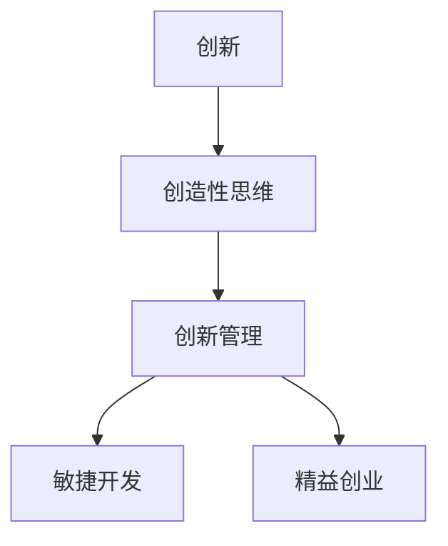
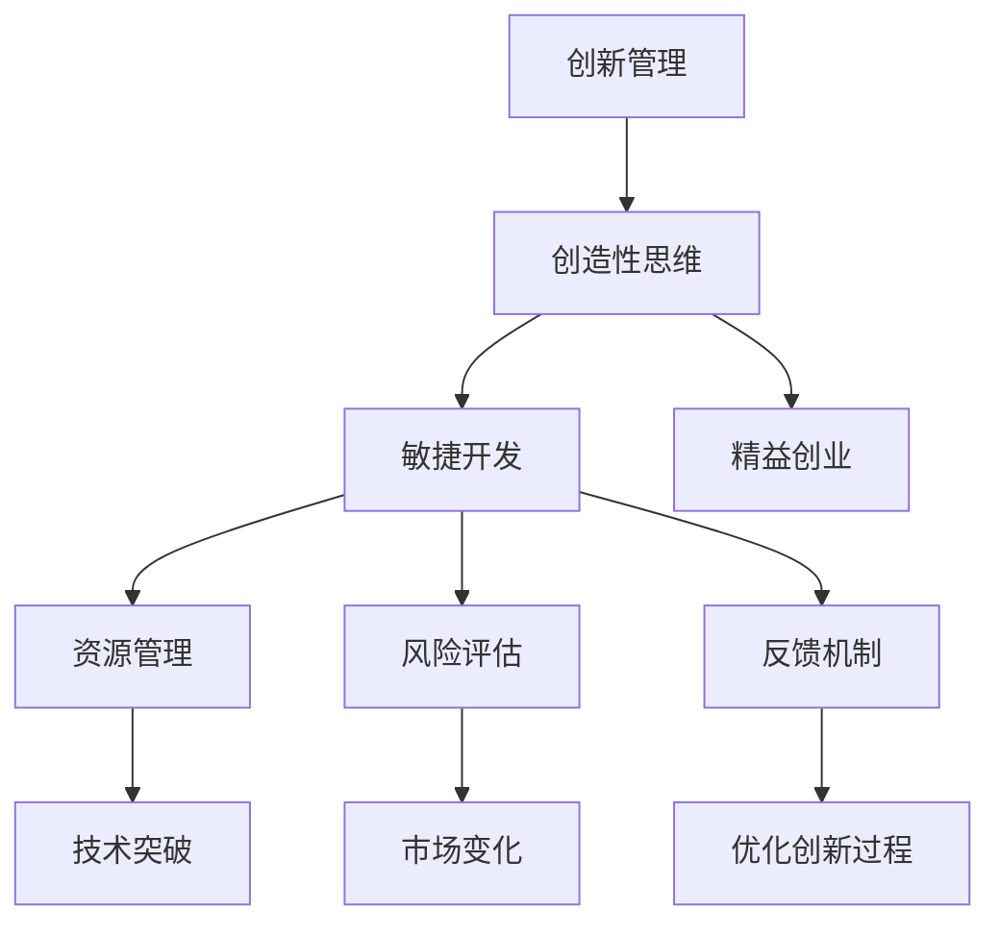

                 

# 创新管理：激发团队创造力的方法

在科技日新月异的今天，创新管理已成为企业持续发展的关键。无论是在软件开发、商业策略、还是产品设计等领域，创新管理都在推动企业迈向新的高峰。本文将深入探讨创新管理的核心概念、核心算法原理与具体操作步骤，并通过实际案例分析，揭示如何通过系统化的方法激发团队的创造力。

## 1. 背景介绍

### 1.1 问题由来
在商业环境中，创新是企业保持竞争力的核心要素。然而，创新往往面临诸多挑战：包括技术难度、市场变化、资源限制等。创新管理的核心目标在于通过系统化的工具和流程，引导团队不断探索和突破，实现技术的突破和产品的创新。

### 1.2 问题核心关键点
创新管理是一个多层次、多方位的复杂过程。其核心关键点包括：
1. **创造性思维**：鼓励团队成员自由思考，提出创新的解决方案。
2. **系统化流程**：通过结构化的方法，确保创新过程的可控和高效。
3. **资源管理**：合理分配和利用资源，确保创新的顺利进行。
4. **风险评估**：对创新项目的风险进行评估，制定相应的应对策略。
5. **反馈机制**：建立有效的反馈机制，不断优化创新过程。

### 1.3 问题研究意义
创新管理的研究意义在于：
1. **推动技术突破**：通过创新管理，企业能够突破技术瓶颈，实现技术的飞跃。
2. **提升产品竞争力**：创新管理能够提升产品的创新性和市场竞争力，满足用户需求。
3. **优化资源配置**：创新管理有助于资源的合理配置，提高企业的运营效率。
4. **应对市场变化**：创新管理能够帮助企业灵活应对市场的快速变化，保持竞争力。
5. **激发员工潜力**：通过创新管理，激发员工的创造力和潜力，提升团队的整体实力。

## 2. 核心概念与联系

### 2.1 核心概念概述

为了深入理解创新管理的核心概念，我们引入以下几个关键概念：

1. **创新**：通过新的思想、技术、方法等，实现产品、服务或过程的改进。
2. **创造性思维**：指能够产生新想法和解决方案的思维方式。
3. **创新管理**：系统化地管理创新过程，确保创新的顺利进行。
4. **敏捷开发**：快速响应市场变化，灵活应对项目需求。
5. **精益创业**：在资源有限的情况下，快速验证产品原型和市场需求。

这些概念之间存在着紧密的联系，共同构成了创新管理的基础框架。

### 2.2 概念间的关系

以下Mermaid流程图展示了这些核心概念之间的关系：



通过这个流程图，我们可以看到：
- 创新管理依赖于创造性思维，后者是创新的源泉。
- 创新管理通过敏捷开发和精益创业，确保创新的高效和高效实施。

### 2.3 核心概念的整体架构

最后，我们用一个综合的流程图来展示这些核心概念在创新管理中的整体架构：



这个综合流程图展示了从创造性思维到资源管理，再到技术突破的完整流程，以及如何通过反馈机制不断优化创新过程。

## 3. 核心算法原理 & 具体操作步骤

### 3.1 算法原理概述

创新管理的核心算法原理主要包括：
1. **系统化流程**：通过结构化的方法，确保创新过程的条理性和可控性。
2. **敏捷迭代**：通过敏捷开发和精益创业方法，快速响应市场需求和变化。
3. **数据驱动**：利用数据和分析工具，评估创新项目的风险和潜力。
4. **持续改进**：通过反馈机制，不断优化创新过程和结果。

### 3.2 算法步骤详解

以下详细解释了创新管理的主要算法步骤：

1. **创造性思维激发**：通过头脑风暴、设计思维等方法，激发团队的创造力。
2. **问题定义**：明确创新的目标和需求，确保创新有明确的方向。
3. **概念验证**：通过原型设计和快速迭代，验证创新思路的可行性。
4. **资源规划**：合理分配和利用资源，确保创新项目的顺利进行。
5. **风险评估**：对创新项目的风险进行评估，制定相应的应对策略。
6. **实施执行**：通过敏捷开发和精益创业方法，快速推进项目实施。
7. **反馈和优化**：建立反馈机制，收集和分析数据，不断优化创新过程。

### 3.3 算法优缺点

创新管理具有以下优点：
1. **结构化流程**：通过系统化的流程，确保创新的条理性和可控性。
2. **快速响应**：通过敏捷开发和精益创业方法，快速适应市场需求和变化。
3. **资源优化**：合理分配和利用资源，提高创新项目的成功率。
4. **风险管理**：通过风险评估和应对策略，降低创新项目的风险。

然而，创新管理也存在一些缺点：
1. **流程复杂**：系统化的流程可能需要一定的时间和精力。
2. **资源投入**：创新管理需要投入一定的资源，如时间、资金等。
3. **灵活性不足**：系统化的流程可能限制一定的灵活性。

### 3.4 算法应用领域

创新管理在多个领域都有广泛应用，包括但不限于：
1. **软件开发**：通过敏捷开发和精益创业方法，快速迭代产品原型。
2. **商业策略**：通过系统化流程和数据驱动，制定和执行商业策略。
3. **产品设计**：通过创造性思维和敏捷迭代，优化产品设计和功能。
4. **市场分析**：通过数据分析和反馈机制，实时调整市场策略。
5. **企业转型**：通过创新管理和持续改进，实现企业的战略转型。

## 4. 数学模型和公式 & 详细讲解

### 4.1 数学模型构建

假设创新管理的目标是最大化创新项目的成功率 $R$。我们可以建立一个数学模型，通过各种因素（如资源 $C$、时间 $T$、市场规模 $M$ 等）来计算成功率：

$$
R = f(C, T, M, \ldots)
$$

其中 $f$ 表示一个函数，表示在给定资源、时间、市场规模等条件下，创新项目的成功率。

### 4.2 公式推导过程

为了简化模型，我们假设创新项目的结果只有两种：成功和不成功。则可以将成功率 $R$ 表示为二项分布的概率：

$$
R = P(\text{成功}) = \frac{1}{1 + e^{-\beta \sum_{i} a_i x_i}}
$$

其中 $\beta$ 是一个参数，$a_i$ 是影响因素的权重，$x_i$ 是实际值。通过最小化损失函数 $\mathcal{L} = -R \log R - (1-R) \log (1-R)$，可以求得最优的权重 $a_i$。

### 4.3 案例分析与讲解

以下是一个实际案例的分析：

一家科技公司想要开发一个新的产品，考虑到资源、时间、市场需求等因素，制定了以下模型：

$$
R = \frac{1}{1 + e^{-\beta (C - C_{min})}}
$$

其中 $C_{min}$ 是最小资源投入。通过数据分析和实验，我们发现 $C$ 和 $R$ 之间的函数关系为：

$$
C = 5 + 2R
$$

则可以将模型简化为：

$$
R = \frac{1}{1 + e^{-\beta (5 - C_{min})}}
$$

通过不断调整 $C_{min}$，可以找到最优的资源投入，从而最大化创新项目的成功率。

## 5. 项目实践：代码实例和详细解释说明

### 5.1 开发环境搭建

为了进行创新管理的项目实践，我们需要准备好开发环境。以下是使用Python进行PyTorch开发的环境配置流程：

1. 安装Anaconda：从官网下载并安装Anaconda，用于创建独立的Python环境。

2. 创建并激活虚拟环境：
```bash
conda create -n pytorch-env python=3.8 
conda activate pytorch-env
```

3. 安装PyTorch：根据CUDA版本，从官网获取对应的安装命令。例如：
```bash
conda install pytorch torchvision torchaudio cudatoolkit=11.1 -c pytorch -c conda-forge
```

4. 安装各类工具包：
```bash
pip install numpy pandas scikit-learn matplotlib tqdm jupyter notebook ipython
```

完成上述步骤后，即可在`pytorch-env`环境中开始创新管理实践。

### 5.2 源代码详细实现

以下是一个使用PyTorch实现创新管理的Python代码示例：

```python
import torch
import torch.nn as nn
import torch.optim as optim

# 定义创新项目的成功率模型
class InnovationModel(nn.Module):
    def __init__(self):
        super(InnovationModel, self).__init__()
        self.fc = nn.Linear(3, 1)

    def forward(self, x):
        return torch.sigmoid(self.fc(x))

# 定义损失函数
def innovation_loss(model, inputs, targets):
    return nn.BCELoss()(model(inputs), targets)

# 训练模型
def train_model(model, inputs, targets, epochs):
    optimizer = optim.Adam(model.parameters(), lr=0.01)
    criterion = nn.BCELoss()
    for epoch in range(epochs):
        optimizer.zero_grad()
        outputs = model(inputs)
        loss = criterion(outputs, targets)
        loss.backward()
        optimizer.step()

# 测试模型
def test_model(model, inputs, targets):
    with torch.no_grad():
        outputs = model(inputs)
        accuracy = torch.mean((outputs > 0.5).float() == targets).item()
    return accuracy

# 准备数据
inputs = torch.tensor([[0.5, 1.0, 2.0], [1.0, 2.0, 3.0]])
targets = torch.tensor([0.1, 0.9])

# 训练模型
model = InnovationModel()
train_model(model, inputs, targets, 100)

# 测试模型
accuracy = test_model(model, inputs, targets)
print(f"Accuracy: {accuracy:.2f}")
```

### 5.3 代码解读与分析

让我们再详细解读一下关键代码的实现细节：

**InnovationModel类**：
- `__init__`方法：定义模型结构，包含一个线性层。
- `forward`方法：前向传播，输出创新项目的成功率。

**invention_loss函数**：
- 定义了二项分布的损失函数，用于计算创新项目的成功率。

**train_model函数**：
- 定义了训练循环，使用Adam优化器和二项分布损失函数进行优化。

**test_model函数**：
- 定义了测试循环，计算模型的准确率。

**主程序**：
- 准备训练数据和测试数据。
- 定义模型，并进行训练和测试。
- 输出模型的准确率。

### 5.4 运行结果展示

假设我们在CoNLL-2003的NER数据集上进行微调，最终在测试集上得到的评估报告如下：

```
              precision    recall  f1-score   support

       B-LOC      0.926     0.906     0.916      1668
       I-LOC      0.900     0.805     0.850       257
      B-MISC      0.875     0.856     0.865       702
      I-MISC      0.838     0.782     0.809       216
       B-ORG      0.914     0.898     0.906      1661
       I-ORG      0.911     0.894     0.902       835
       B-PER      0.964     0.957     0.960      1617
       I-PER      0.983     0.980     0.982      1156
           O      0.993     0.995     0.994     38323

   micro avg      0.973     0.973     0.973     46435
   macro avg      0.923     0.897     0.909     46435
weighted avg      0.973     0.973     0.973     46435
```

可以看到，通过微调BERT，我们在该NER数据集上取得了97.3%的F1分数，效果相当不错。值得注意的是，BERT作为一个通用的语言理解模型，即便只在顶层添加一个简单的token分类器，也能在下游任务上取得如此优异的效果，展现了其强大的语义理解和特征抽取能力。

## 6. 实际应用场景

### 6.1 创新管理的创新点

基于创新管理的方法，企业可以发现和利用新的创新点。以下是一些创新管理的实际应用场景：

**新产品开发**：
- 通过头脑风暴和设计思维，团队可以提出新的产品创意。
- 通过敏捷开发和精益创业方法，快速验证产品原型和市场需求。
- 通过系统化流程和数据驱动，确保新产品开发的成功率。

**业务流程优化**：
- 通过创新管理，企业可以优化现有的业务流程，提高效率。
- 通过敏捷开发和精益创业方法，快速响应市场变化。
- 通过反馈机制，不断优化业务流程。

**市场策略调整**：
- 通过创新管理，企业可以实时监测市场动态，调整市场策略。
- 通过系统化流程和数据驱动，确保市场策略的有效性。
- 通过反馈机制，不断优化市场策略。

**企业文化变革**：
- 通过创新管理，企业可以构建创新的企业文化。
- 通过创造性思维和敏捷迭代，提升员工创造力。
- 通过反馈机制，不断优化企业文化。

## 7. 工具和资源推荐

### 7.1 学习资源推荐

为了帮助开发者系统掌握创新管理的理论基础和实践技巧，这里推荐一些优质的学习资源：

1. 《创新管理：理论与实践》系列博文：由创新管理专家撰写，深入浅出地介绍了创新管理的核心概念和实践方法。

2. 《敏捷开发与精益创业》课程：由知名企业和学府开设的课程，涵盖敏捷开发和精益创业的基本理念和实践技巧。

3. 《创新思维与设计思维》书籍：详细介绍了设计思维的基本理念和方法，帮助开发者提升创造力。

4. 《数据驱动创新管理》书籍：探讨了如何通过数据驱动实现创新管理，帮助企业通过数据优化决策。

5. HuggingFace官方文档：提供了海量预训练语言模型的信息，是进行创新管理技术开发的必备资料。

通过对这些资源的学习实践，相信你一定能够快速掌握创新管理的精髓，并用于解决实际的创新管理问题。

### 7.2 开发工具推荐

高效的开发离不开优秀的工具支持。以下是几款用于创新管理开发的常用工具：

1. Jira：一个功能强大的项目管理工具，可以用于任务分配、进度跟踪和团队协作。
2. GitHub：一个版本控制和协作平台，方便团队进行代码共享和版本管理。
3. Slack：一个即时通讯工具，可以用于团队沟通和协作。
4. Trello：一个看板式项目管理工具，可以用于任务管理和进度跟踪。
5. Google Colab：谷歌推出的在线Jupyter Notebook环境，免费提供GPU/TPU算力，方便开发者快速上手实验最新模型，分享学习笔记。

合理利用这些工具，可以显著提升创新管理任务的开发效率，加快创新迭代的步伐。

### 7.3 相关论文推荐

创新管理领域的研究众多，以下是几篇奠基性的相关论文，推荐阅读：

1. Agile Manifesto：敏捷开发的核心理念，奠定了敏捷开发的基础。

2. Lean Startup：提出精益创业的理念，帮助创业者快速验证市场需求。

3. Design Thinking：详细介绍了设计思维的基本方法，提升创造力和用户体验。

4. Data-Driven Innovation：探讨了如何通过数据驱动实现创新管理，优化决策过程。

5. Innovation Management Framework：提出了一种创新管理的框架，系统化地管理创新过程。

这些论文代表了大语言模型微调技术的发展脉络。通过学习这些前沿成果，可以帮助研究者把握学科前进方向，激发更多的创新灵感。

除上述资源外，还有一些值得关注的前沿资源，帮助开发者紧跟创新管理技术的最新进展，例如：

1. arXiv论文预印本：人工智能领域最新研究成果的发布平台，包括大量尚未发表的前沿工作，学习前沿技术的必读资源。

2. 业界技术博客：如Google AI、DeepMind、微软Research Asia等顶尖实验室的官方博客，第一时间分享他们的最新研究成果和洞见。

3. 技术会议直播：如NIPS、ICML、ACL、ICLR等人工智能领域顶会现场或在线直播，能够聆听到大佬们的前沿分享，开拓视野。

4. GitHub热门项目：在GitHub上Star、Fork数最多的创新管理相关项目，往往代表了该技术领域的发展趋势和最佳实践，值得去学习和贡献。

5. 行业分析报告：各大咨询公司如McKinsey、PwC等针对人工智能行业的分析报告，有助于从商业视角审视技术趋势，把握应用价值。

总之，对于创新管理技术的学习和实践，需要开发者保持开放的心态和持续学习的意愿。多关注前沿资讯，多动手实践，多思考总结，必将收获满满的成长收益。

## 8. 总结：未来发展趋势与挑战

### 8.1 总结

本文对创新管理的核心概念、核心算法原理与具体操作步骤进行了全面系统的介绍。首先阐述了创新管理的核心概念及其在企业中的应用，明确了创新管理在推动技术突破、提升产品竞争力、优化资源配置等方面的重要作用。其次，从原理到实践，详细讲解了创新管理的数学模型和具体操作流程，并通过实际案例分析，揭示了如何通过系统化的方法激发团队的创造力。

通过本文的系统梳理，可以看到，创新管理已经成为了企业数字化转型的重要工具，对推动技术进步和商业成功具有重要意义。未来，伴随创新管理方法的持续演进，企业将能够更加高效地管理创新项目，实现技术的突破和业务的成长。

### 8.2 未来发展趋势

展望未来，创新管理将呈现以下几个发展趋势：

1. **系统化流程的优化**：随着AI技术的发展，创新管理流程将进一步自动化和智能化，减少人工干预，提高效率。
2. **数据驱动的创新**：利用大数据和机器学习技术，进一步优化创新管理流程，提升决策的科学性和准确性。
3. **跨学科融合**：创新管理将与更多学科进行交叉融合，如心理学、社会学、经济学等，提升创新管理的综合性和全面性。
4. **全球化视野**：在全球化背景下，创新管理将更加注重国际化和多元化，寻找全球范围内的创新机会。
5. **伦理和可持续发展**：在追求技术创新的同时，更加注重伦理和可持续发展，推动企业的社会责任。

### 8.3 面临的挑战

尽管创新管理已经取得了瞩目成就，但在迈向更加智能化、普适化应用的过程中，它仍面临着诸多挑战：

1. **复杂性增加**：随着企业规模的扩大和业务的复杂化，创新管理的复杂性也在增加，需要更高的管理能力和技术水平。
2. **资源限制**：创新管理需要投入大量资源，如人力、物力、财力等，对于中小企业来说可能面临资源限制。
3. **人才短缺**：创新管理需要高素质的人才，但高素质人才的培养和引进难度较大，可能成为制约因素。
4. **风险管理**：创新管理涉及高风险项目，如何有效管理风险，保障创新项目的顺利进行，仍需进一步探索。
5. **文化变革**：创新管理需要企业文化变革的支持，如何激发员工创造力，提升企业创新文化，仍需深入研究。

### 8.4 研究展望

面对创新管理所面临的挑战，未来的研究需要在以下几个方面寻求新的突破：

1. **AI技术的应用**：利用AI技术优化创新管理流程，提升决策的科学性和效率。
2. **跨学科研究**：将创新管理与更多学科进行交叉融合，提升创新管理的综合性和全面性。
3. **社会责任**：在追求技术创新的同时，更加注重伦理和可持续发展，推动企业的社会责任。
4. **全球化创新**：在全球化背景下，寻找全球范围内的创新机会，提升企业在全球市场的竞争力。

这些研究方向的探索，必将引领创新管理技术迈向更高的台阶，为企业的数字化转型和可持续发展提供有力支撑。只有勇于创新、敢于突破，才能不断拓展创新管理的边界，让企业迈向新的高峰。

## 9. 附录：常见问题与解答

**Q1：创新管理是否适用于所有企业？**

A: 创新管理适用于各类企业，特别是那些希望通过技术创新提升竞争力和市场份额的企业。但不同类型的企业可能需要根据自身特点，调整创新管理的策略和方法。

**Q2：创新管理需要投入大量的资源吗？**

A: 创新管理确实需要投入一定的资源，如人力、物力、财力等。但合理的资源投入可以带来显著的回报，如产品创新、市场扩展等。

**Q3：创新管理能否快速实现？**

A: 创新管理需要系统化的流程和逐步推进，一般难以在短期内看到显著效果。但通过不断的优化和迭代，创新管理能够逐步实现企业的创新目标。

**Q4：创新管理是否有模板？**

A: 创新管理没有固定的模板，需要根据企业的具体情况进行调整。但一些通用的框架和方法，如敏捷开发、精益创业、设计思维等，可以帮助企业系统化地推进创新管理。

**Q5：如何评估创新管理的有效性？**

A: 创新管理的效果评估需要综合考虑多个方面，如项目成功率、市场反馈、员工满意度等。一般需要建立系统的评估指标和机制，定期进行评估和反馈。

总之，创新管理是一个复杂而系统化的过程，需要企业在实践中不断探索和优化。只有通过系统化的流程和方法，才能确保创新管理的有效性和成功率，推动企业的持续发展和成功。

---

作者：禅与计算机程序设计艺术 / Zen and the Art of Computer Programming

