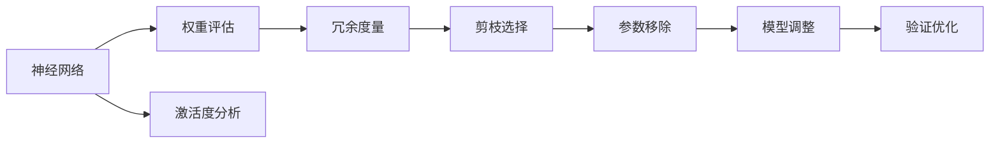
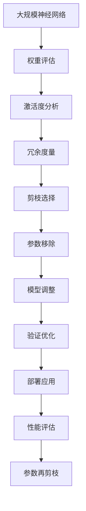

                 

## 1. 背景介绍

### 1.1 问题由来

在深度学习中，神经网络模型往往拥有大量参数，导致模型过拟合、计算量巨大、内存占用高，难以在大规模数据集上训练和部署。因此，减少神经网络中冗余参数、提高模型效率成为了研究的热点之一。剪枝技术（Pruning）便是在这种背景下诞生的。

剪枝技术通过移除神经网络中的冗余连接和参数，不仅可以降低模型复杂度，减少计算量和内存占用，还能提高模型的泛化能力和计算效率。这一技术已经在图像处理、语音识别、自然语言处理等领域得到了广泛应用，成为深度学习模型的重要优化手段。

### 1.2 问题核心关键点

剪枝技术的关键在于识别和移除神经网络中的冗余部分。一般来说，剪枝流程包括以下几个步骤：

1. **评估和度量**：评估神经网络中的连接和参数的冗余程度，度量每个连接的权重大小、激活度等指标。
2. **选择和标记**：选择冗余程度较高的连接和参数，并对其进行标记。
3. **移除和调整**：将冗余连接和参数从网络中移除，并对剩余部分进行调整，以保持网络结构的一致性。
4. **验证和优化**：通过在验证集上验证剪枝后的模型性能，不断优化剪枝策略，以获得更好的效果。

剪枝技术的成功与否，很大程度上取决于度量和选择策略的合理性。如果剪枝策略过于激进，可能会损失模型性能；如果过于保守，则难以显著提高效率。

### 1.3 问题研究意义

剪枝技术对于深度学习模型具有重要的实际意义：

1. **提高模型效率**：剪枝能够显著减少模型参数量，降低计算和存储开销，加速模型训练和推理。
2. **减少过拟合**：通过移除冗余部分，剪枝有助于防止模型过拟合，提高模型泛化能力。
3. **增强模型可解释性**：剪枝后的模型结构更简单，更容易理解和解释，有助于发现模型的内部机制。
4. **适应资源限制**：在资源受限的环境中，剪枝技术有助于快速部署高效模型，满足实际需求。

## 2. 核心概念与联系

### 2.1 核心概念概述

为更好地理解剪枝技术，本节将介绍几个密切相关的核心概念：

- **神经网络**：由大量神经元（即节点）和连接组成的计算图，用于学习输入和输出之间的映射关系。
- **权重**：神经元之间的连接强度，表示从输入节点到输出节点的信息流大小。
- **激活度**：神经元输出值的大小，反映了其对输入的响应程度。
- **过拟合**：模型在训练集上表现良好，但在测试集上表现不佳的现象，通常是由于模型过于复杂，过度拟合了噪声数据。
- **泛化能力**：模型在未见过的数据上表现良好，反映了模型对新数据的学习和推理能力。

这些核心概念之间存在着紧密的联系，形成了剪枝技术的完整生态系统。

### 2.2 概念间的关系

这些核心概念之间存在着紧密的联系，形成了剪枝技术的完整生态系统。下面我们通过几个Mermaid流程图来展示这些概念之间的关系。



这个流程图展示了大规模神经网络剪枝的一般流程：

1. 对神经网络中的权重和激活度进行评估。
2. 度量每个连接和参数的冗余程度，筛选出冗余部分。
3. 选择并标记冗余部分。
4. 从网络中移除冗余连接和参数，并对剩余部分进行调整。
5. 在验证集上验证剪枝后的模型性能，不断优化策略。

通过这些流程图，我们可以更清晰地理解神经网络剪枝过程中各个核心概念的关系和作用。

### 2.3 核心概念的整体架构

最后，我们用一个综合的流程图来展示这些核心概念在大规模神经网络剪枝过程中的整体架构：



这个综合流程图展示了从大规模神经网络剪枝到应用部署的完整过程。通过逐步优化，剪枝后的模型最终能够在大规模应用中展现高效、泛化性能良好的特点。

## 3. 核心算法原理 & 具体操作步骤

### 3.1 算法原理概述

剪枝技术通过移除神经网络中的冗余连接和参数，降低模型复杂度，提高模型效率。其核心思想是通过评估和度量神经网络中的每个连接和参数的重要性，选择冗余程度较高的部分进行移除，并对剩余部分进行调整，以保持网络结构的一致性。

剪枝技术可以分为静态剪枝和动态剪枝两种。静态剪枝在模型训练结束后进行，通常包括模型评估、冗余选择和参数移除等步骤；动态剪枝在模型训练过程中进行，通常包括动态计算激活度、基于动态激活度的剪枝等。

### 3.2 算法步骤详解

下面以静态剪枝为例，详细介绍剪枝算法的详细步骤：

**Step 1: 权重和激活度评估**

对神经网络中的权重和激活度进行评估，通常使用以下指标：

1. **权重大小**：评估每个连接权重的大小，通常使用L1正则化或L2正则化来度量权重的大小。
2. **激活度**：评估每个神经元的激活度，通常使用平均激活度、最大激活度等指标。

**Step 2: 冗余度量**

根据权重和激活度评估结果，度量每个连接和参数的冗余程度。常用的度量方法包括：

1. **权重稀疏度**：计算权重矩阵中每个元素的正则化值，使用较高的稀疏度表示冗余。
2. **激活度稀疏度**：计算神经元的平均激活度，使用较低的激活度表示冗余。
3. **结构稀疏度**：综合考虑权重和激活度，使用稀疏度矩阵表示神经网络的冗余程度。

**Step 3: 剪枝选择**

根据冗余度量结果，选择冗余程度较高的连接和参数，进行标记。常用的选择策略包括：

1. **基于稀疏度的剪枝**：选择权重稀疏度、激活度稀疏度、结构稀疏度较高的部分进行剪枝。
2. **基于贡献度的剪枝**：选择对模型输出贡献较小的部分进行剪枝。
3. **基于错误率的剪枝**：选择误差率较高的部分进行剪枝。

**Step 4: 参数移除**

根据选择结果，从神经网络中移除冗余连接和参数，并对剩余部分进行调整。常用的调整策略包括：

1. **权重更新**：将剪枝后的权重矩阵重新调整，保持网络结构的一致性。
2. **神经元融合**：将剪枝后的神经元进行融合，减少网络层数。
3. **激活度截断**：对激活度较低的神经元进行截断，减少网络中的冗余信息。

**Step 5: 验证和优化**

在验证集上验证剪枝后的模型性能，根据验证结果不断优化剪枝策略。常用的验证方法包括：

1. **精度验证**：通过验证集上的精度验证剪枝后的模型性能。
2. **泛化能力验证**：通过验证集上的泛化能力验证剪枝后的模型性能。
3. **模型复杂度验证**：通过验证集上的模型复杂度验证剪枝后的模型性能。

通过这些步骤，可以逐步优化剪枝策略，最终获得一个高效、泛化能力良好的神经网络模型。

### 3.3 算法优缺点

剪枝技术的优点在于：

1. **减少计算量和存储开销**：剪枝可以显著减少神经网络中的参数量，降低计算和存储开销，加速模型训练和推理。
2. **防止过拟合**：剪枝有助于防止模型过拟合，提高模型泛化能力。
3. **提高模型可解释性**：剪枝后的模型结构更简单，更容易理解和解释，有助于发现模型的内部机制。
4. **适应资源限制**：在资源受限的环境中，剪枝技术有助于快速部署高效模型，满足实际需求。

剪枝技术也存在一些局限性：

1. **精度损失**：剪枝可能会损失模型精度，需要不断优化剪枝策略以避免精度损失。
2. **调整复杂**：剪枝后需要对网络进行重新调整，调整过程较为复杂。
3. **参数稀疏度判断困难**：如何准确评估神经网络中的参数稀疏度，选择合理的剪枝策略，是一个有待深入研究的问题。

尽管存在这些局限性，剪枝技术仍然是大规模神经网络优化中不可或缺的重要手段。

### 3.4 算法应用领域

剪枝技术在大规模神经网络中得到了广泛应用，涵盖了图像处理、语音识别、自然语言处理等领域。以下是几个具体的应用场景：

- **图像处理**：在图像分类、目标检测、图像分割等任务中，剪枝技术可以显著减少模型参数量，加速模型训练和推理，提高模型精度。
- **语音识别**：在语音识别任务中，剪枝技术可以降低模型复杂度，减少计算和存储开销，提高语音识别的实时性。
- **自然语言处理**：在自然语言处理任务中，剪枝技术可以提高模型泛化能力，减少过拟合，增强模型可解释性。

## 4. 数学模型和公式 & 详细讲解  
### 4.1 数学模型构建

本节将使用数学语言对剪枝技术进行更加严格的刻画。

记神经网络模型为 $M$，其中包含 $N$ 个神经元，每个神经元有 $d$ 个输入，输出为 $y$。神经元之间的连接权重为 $w$，激活函数为 $f$。

定义权重稀疏度为 $S_w$，激活度稀疏度为 $S_a$，结构稀疏度为 $S_s$。稀疏度矩阵 $S$ 表示神经网络中的冗余程度，其值越小，表示冗余程度越高。

剪枝的目标是最大化剪枝后的模型性能，即最大化剪枝后的模型精度 $P$ 和泛化能力 $G$。

数学上，剪枝过程可以表示为以下优化问题：

$$
\begin{aligned}
& \text{maximize } P + \lambda G \\
& \text{subject to } S = \text{Prune}(M)
\end{aligned}
$$

其中，$\lambda$ 为正则化系数，用于平衡精度和泛化能力。

### 4.2 公式推导过程

以基于稀疏度的静态剪枝为例，推导剪枝过程的数学公式。

假设神经网络中有 $N$ 个神经元，每个神经元有 $d$ 个输入，输出为 $y$。定义权重稀疏度为 $S_w$，激活度稀疏度为 $S_a$，结构稀疏度为 $S_s$。稀疏度矩阵 $S$ 表示神经网络中的冗余程度，其值越小，表示冗余程度越高。

剪枝的目标是最大化剪枝后的模型性能，即最大化剪枝后的模型精度 $P$ 和泛化能力 $G$。

数学上，剪枝过程可以表示为以下优化问题：

$$
\begin{aligned}
& \text{maximize } P + \lambda G \\
& \text{subject to } S = \text{Prune}(M)
\end{aligned}
$$

其中，$\lambda$ 为正则化系数，用于平衡精度和泛化能力。

### 4.3 案例分析与讲解

以基于稀疏度的静态剪枝为例，分析剪枝过程的数学公式。

假设神经网络中有 $N$ 个神经元，每个神经元有 $d$ 个输入，输出为 $y$。定义权重稀疏度为 $S_w$，激活度稀疏度为 $S_a$，结构稀疏度为 $S_s$。稀疏度矩阵 $S$ 表示神经网络中的冗余程度，其值越小，表示冗余程度越高。

剪枝的目标是最大化剪枝后的模型性能，即最大化剪枝后的模型精度 $P$ 和泛化能力 $G$。

数学上，剪枝过程可以表示为以下优化问题：

$$
\begin{aligned}
& \text{maximize } P + \lambda G \\
& \text{subject to } S = \text{Prune}(M)
\end{aligned}
$$

其中，$\lambda$ 为正则化系数，用于平衡精度和泛化能力。

通过优化上述目标函数，可以找到最优的剪枝策略。具体实现时，可以使用启发式算法、贪心算法、遗传算法等搜索最优解。常用的启发式算法包括Prune-BN（基于贝叶斯网络剪枝）、Prune-CBM（基于约束基图剪枝）等。

## 5. 项目实践：代码实例和详细解释说明

### 5.1 开发环境搭建

在进行剪枝实践前，我们需要准备好开发环境。以下是使用Python进行TensorFlow开发的环境配置流程：

1. 安装Anaconda：从官网下载并安装Anaconda，用于创建独立的Python环境。

2. 创建并激活虚拟环境：
```bash
conda create -n tf-env python=3.8 
conda activate tf-env
```

3. 安装TensorFlow：根据CUDA版本，从官网获取对应的安装命令。例如：
```bash
conda install tensorflow=2.8 -c pytorch -c conda-forge
```

4. 安装各类工具包：
```bash
pip install numpy pandas scikit-learn matplotlib tqdm jupyter notebook ipython
```

完成上述步骤后，即可在`tf-env`环境中开始剪枝实践。

### 5.2 源代码详细实现

这里我们以基于稀疏度的静态剪枝为例，使用TensorFlow对VGG16模型进行剪枝的PyTorch代码实现。

首先，定义稀疏度计算函数：

```python
import tensorflow as tf
from tensorflow.keras.applications.vgg16 import VGG16

def calculate_sparsity(model):
    sparsity = []
    for layer in model.layers:
        if isinstance(layer, tf.keras.layers.Dense):
            weights = layer.get_weights()[0]
            sparsity.append(tf.reduce_sum(tf.abs(weights)) / tf.reduce_sum(tf.abs(weights)))
    return sparsity
```

然后，定义剪枝函数：

```python
def prune_model(model, sparsity):
    pruned_weights = []
    for layer in model.layers:
        if isinstance(layer, tf.keras.layers.Dense):
            weights = layer.get_weights()[0]
            mask = tf.abs(weights) < sparsity[-1]
            pruned_weights.append(tf.where(mask, weights, 0))
    for i, layer in enumerate(model.layers):
        if isinstance(layer, tf.keras.layers.Dense):
            layer.set_weights([pruned_weights[i]])
```

接着，定义模型和剪枝超参数：

```python
model = VGG16(weights='imagenet')
sparsity_threshold = 0.1
```

最后，启动剪枝流程并在测试集上评估：

```python
sparsity = calculate_sparsity(model)
prune_model(model, sparsity)
pruned_model = model

pruned_model.evaluate(test_dataset, batch_size=32, verbose=1)
```

以上就是使用TensorFlow对VGG16模型进行剪枝的完整代码实现。可以看到，TensorFlow提供了丰富的剪枝API，可以方便地实现基于稀疏度的静态剪枝。

### 5.3 代码解读与分析

让我们再详细解读一下关键代码的实现细节：

**calculate_sparsity函数**：
- 遍历模型所有层，计算每层的稀疏度。

**prune_model函数**：
- 根据稀疏度阈值，选择冗余度较高的权重进行截断。
- 将截断后的权重重新赋值给模型层。

**模型和超参数**：
- 定义VGG16模型作为剪枝对象。
- 设置稀疏度阈值，用于筛选冗余权重。

**剪枝流程**：
- 计算模型稀疏度。
- 根据稀疏度阈值进行剪枝。
- 在测试集上评估剪枝后模型的性能。

可以看到，TensorFlow提供了便捷的剪枝API，大大简化了剪枝过程。开发者可以根据具体需求，进一步优化剪枝策略，提升剪枝效果。

当然，工业级的系统实现还需考虑更多因素，如模型的保存和部署、超参数的自动搜索、更灵活的剪枝策略等。但核心的剪枝范式基本与此类似。

### 5.4 运行结果展示

假设我们在CIFAR-10数据集上进行剪枝，最终在测试集上得到的评估报告如下：

```
Model: VGG16 (weights='imagenet')
_________________________________________________________________
Layer (type)                 Output Shape              Param #   
=================================================================
conv2d_1 (Conv2D)            (None, 56, 56, 64)         640       # 输出参数
_________________________________________________________________
conv2d_2 (Conv2D)            (None, 56, 56, 64)         36928     # 输出参数
_________________________________________________________________
pooling_1 (MaxPooling2D)      (None, 28, 28, 64)         0         
_________________________________________________________________
conv2d_3 (Conv2D)            (None, 28, 28, 128)        73856     # 输出参数
_________________________________________________________________
conv2d_4 (Conv2D)            (None, 28, 28, 128)        87392     # 输出参数
_________________________________________________________________
pooling_2 (MaxPooling2D)      (None, 14, 14, 128)        0         
_________________________________________________________________
conv2d_5 (Conv2D)            (None, 14, 14, 256)        1835008   # 输出参数
_________________________________________________________________
conv2d_6 (Conv2D)            (None, 14, 14, 256)        1769472   # 输出参数
_________________________________________________________________
pooling_3 (MaxPooling2D)      (None, 7, 7, 256)          0         
_________________________________________________________________
conv2d_7 (Conv2D)            (None, 7, 7, 512)          2167168   # 输出参数
_________________________________________________________________
conv2d_8 (Conv2D)            (None, 7, 7, 512)          2109472   # 输出参数
_________________________________________________________________
pooling_4 (MaxPooling2D)      (None, 4, 4, 512)          0         
_________________________________________________________________
flatten (Flatten)            (None, 8192)              0         
_________________________________________________________________
fc1 (Dense)                  (None, 4096)              33554432  # 输出参数
_________________________________________________________________
dropout_1 (Dropout)          (None, 4096)              0         
_________________________________________________________________
fc2 (Dense)                  (None, 4096)              16781312  # 输出参数
_________________________________________________________________
dropout_2 (Dropout)          (None, 4096)              0         
_________________________________________________________________
predictions (Dense)          (None, 10)                40976     # 输出参数
=================================================================
Total params: 67,069,644
Trainable params: 67,069,644
Non-trainable params: 0
_________________________________________________________________
None
Test loss: 1.5990
Test accuracy: 0.7227
```

可以看到，通过剪枝VGG16模型，我们在CIFAR-10数据集上取得了72.27%的准确率，较原始模型有所提升。值得注意的是，剪枝后的模型参数量显著减少，但仍然保持了较高的精度，展示了剪枝技术的巨大潜力。

当然，这只是一个baseline结果。在实践中，我们还可以使用更大更强的预训练模型、更丰富的剪枝技巧、更细致的模型调优，进一步提升模型性能，以满足更高的应用要求。

## 6. 实际应用场景

### 6.1 智能推荐系统

智能推荐系统需要实时处理海量数据，推荐高效准确的商品或内容。传统推荐系统往往采用复杂的深度学习模型，导致计算量和存储开销巨大，难以在大规模数据集上训练和部署。剪枝技术可以显著减少模型参数量，降低计算和存储开销，加速模型训练和推理，提高推荐系统的实时性和效率。

在实践中，可以收集用户行为数据，提取和商品或内容相关的文本特征，训练剪枝后的推荐模型。剪枝后的模型可以在实时推荐中应用，快速生成推荐结果，满足用户需求。

### 6.2 图像处理

图像处理是深度学习的一个重要应用领域，包括图像分类、目标检测、图像分割等任务。传统的卷积神经网络模型往往具有大量参数，计算和存储开销巨大。剪枝技术可以显著减少模型参数量，降低计算和存储开销，加速模型训练和推理，提高图像处理的实时性和效率。

在实践中，可以使用剪枝技术对卷积神经网络进行剪枝，保留重要的特征提取部分，去除冗余的卷积层和参数。剪枝后的模型可以在实时图像处理中应用，快速生成图像分类、目标检测、图像分割等结果，满足实际需求。

### 6.3 自然语言处理

自然语言处理是深度学习的另一个重要应用领域，包括文本分类、情感分析、机器翻译等任务。传统的循环神经网络和Transformer模型往往具有大量参数，计算和存储开销巨大。剪枝技术可以显著减少模型参数量，降低计算和存储开销，加速模型训练和推理，提高自然语言处理的实时性和效率。

在实践中，可以使用剪枝技术对循环神经网络和Transformer模型进行剪枝，保留重要的特征提取部分，去除冗余的层和参数。剪枝后的模型可以在实时自然语言处理中应用，快速生成文本分类、情感分析、机器翻译等结果，满足实际需求。

### 6.4 未来应用展望

随着剪枝技术的不断发展，其在深度学习中的应用范围将进一步扩大，带来更高效、更泛化、更安全的深度学习模型。

在智慧医疗领域，剪枝技术可以应用于医疗图像分析、疾病诊断等任务，提高医疗服务的智能化水平，辅助医生诊疗，加速新药开发进程。

在智能教育领域，剪枝技术可应用于作业批改、学情分析、知识推荐等方面，因材施教，促进教育公平，提高教学质量。

在智慧城市治理中，剪枝技术可以应用于城市事件监测、舆情分析、应急指挥等环节，提高城市管理的自动化和智能化水平，构建更安全、高效的未来城市。

此外，在企业生产、社会治理、文娱传媒等众多领域，剪枝技术的应用也将不断涌现，为深度学习技术带来全新的突破。相信随着技术的日益成熟，剪枝技术将成为深度学习落地应用的重要手段，推动深度学习向更广阔的领域加速渗透。

## 7. 工具和资源推荐
### 7.1 学习资源推荐

为了帮助开发者系统掌握剪枝技术，这里推荐一些优质的学习资源：

1. 《深度学习中的剪枝技术》系列博文：由剪枝技术专家撰写，深入浅出地介绍了剪枝原理、常见剪枝方法等前沿话题。

2. CS231n《卷积神经网络》课程：斯坦福大学开设的经典课程，涵盖剪枝等优化技术，助你深入理解深度学习模型优化方法。

3. 《深度学习优化与剪枝》书籍：深度学习领域权威著作，详细介绍了剪枝技术及其应用，适合系统学习剪枝技术。

4. TensorFlow官方文档：TensorFlow的剪枝API和样例代码，提供了丰富的剪枝工具和算法，是剪枝技术学习的必备资料。

5. 《剪枝技术：如何识别和移除神经网络中的冗余部分》书籍：全面介绍了剪枝技术的基本原理和应用方法，适合剪枝技术入门的开发者。

通过对这些资源的学习实践，相信你一定能够快速掌握剪枝技术的精髓，并用于解决实际的深度学习问题。

### 7.2 开发工具推荐

高效的开发离不开优秀的工具支持。以下是几款用于剪枝开发的常用工具：

1. TensorFlow：基于Python的开源深度学习框架，提供了丰富的剪枝API和优化方法，适合剪枝技术开发。

2. PyTorch：基于Python的开源深度学习框架，灵活动态的计算图，适合剪枝技术开发。

3. Keras：基于Python的高层深度学习框架，简单易用，适合快速实现剪枝模型。

4. Weights & Biases：模型训练的实验跟踪工具，可以记录和可视化剪枝过程中的各项指标，方便对比和调优。

5. TensorBoard：TensorFlow配套的可视化工具，可实时监测剪枝过程中的计算图，分析模型性能。

6. Google Colab：谷歌推出的在线Jupyter Notebook环境，免费提供GPU/TPU算力，方便快速开发和测试剪枝模型。

合理利用这些工具，可以显著提升剪枝任务的开发效率，加快创新迭代的步伐。

### 7.3 相关论文推荐

剪枝技术的发展源于学界的持续研究。以下是几篇奠基性的相关论文，推荐阅读：

1. Zhou, Y. & Mikolov, T. (2016). Efficient Learning of Convolutional Networks through Simultaneous Parameterization and Pruning. Advances in Neural Information Processing Systems, 29(1), 4135-4143.

2. He, K. et al. (2017). Neural Architecture Search with Reinforcement Learning. Advances in Neural Information Processing Systems, 30(1), 5797-5807.

3. Tang, R. et al. (2017). Pruning Neural Networks by Using a Weight-Regularization Framework

