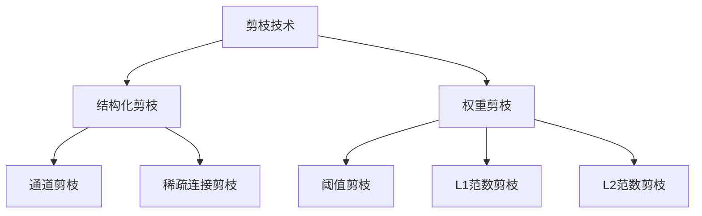
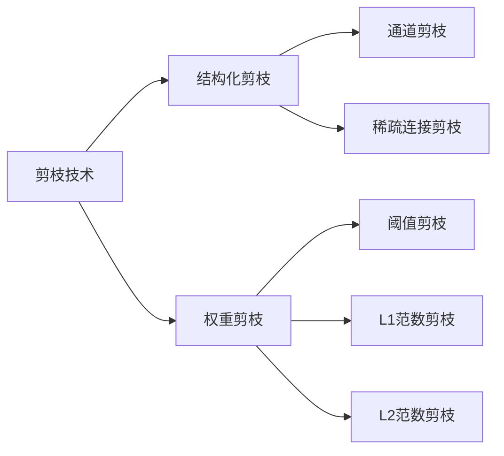
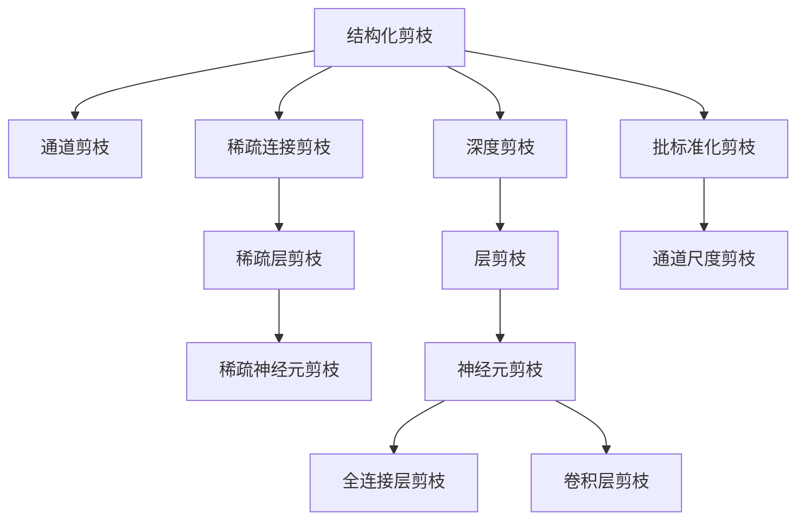
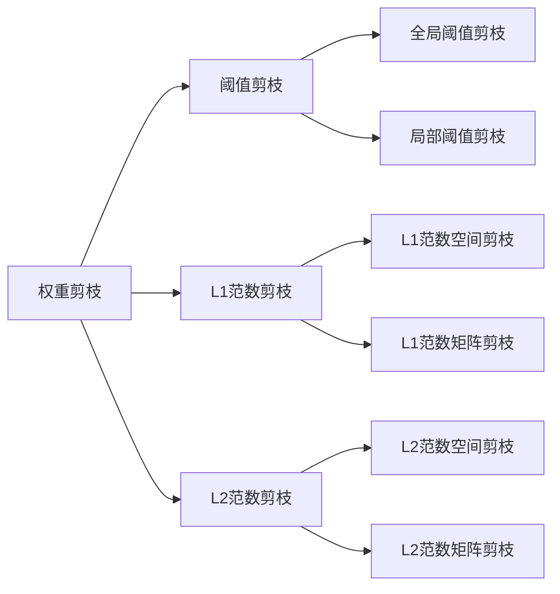

                 

## 1. 背景介绍

### 1.1 问题由来
近年来，深度神经网络（Deep Neural Networks, DNNs）在计算机视觉、自然语言处理、语音识别等多个领域取得了显著的进步。然而，深度神经网络模型通常具有亿级甚至更高的参数量，导致其计算复杂度高、存储需求大、训练时间长等问题。这些问题不仅影响了模型的实际应用，还使得大规模神经网络的部署和维护变得更加困难。

### 1.2 问题核心关键点
为了解决这个问题，研究人员提出了剪枝（Pruning）技术。剪枝技术通过移除网络中冗余或不重要的参数，减小模型的参数量，从而降低计算复杂度和存储需求，提升模型的训练和推理效率。此外，剪枝还能提高模型的泛化能力，减少过拟合，提升模型的稳定性和可靠性。

### 1.3 问题研究意义
剪枝技术在大规模神经网络中的应用，对于提高神经网络的实际应用效率、降低计算和存储成本、提升模型的泛化能力和可靠性等方面具有重要意义。同时，剪枝技术还可以加速模型更新和迭代，推动深度学习技术的产业化进程。

## 2. 核心概念与联系

### 2.1 核心概念概述

剪枝技术是指通过移除神经网络中冗余或不重要的参数，减小模型的参数量，从而提升模型的训练和推理效率。剪枝方法主要分为结构化剪枝（Structured Pruning）和权重剪枝（Weight Pruning）两大类。

- **结构化剪枝**：主要通过移除网络中冗余或低效的层、通道或神经元等结构单元，以达到精简网络的目的。结构化剪枝的代表性方法包括通道剪枝（Channel Pruning）、稀疏连接剪枝（Sparse Connection Pruning）等。
- **权重剪枝**：主要通过移除网络中权重值较小或不重要的连接，以达到精简网络的目的。权重剪枝的代表性方法包括基于阈值剪枝（Threshold Pruning）、L1/L2范数剪枝等。

这些核心概念之间的逻辑关系可以通过以下Mermaid流程图来展示：



这个流程图展示了大规模神经网络剪枝技术的基本框架。

### 2.2 概念间的关系

这些核心概念之间存在着紧密的联系，形成了剪枝技术的完整生态系统。下面我通过几个Mermaid流程图来展示这些概念之间的关系。

#### 2.2.1 剪枝技术的范式



这个流程图展示了大规模神经网络剪枝技术的基本框架。结构化剪枝和权重剪枝是剪枝技术的两种主要范式，其中结构化剪枝侧重于网络结构的优化，权重剪枝侧重于参数值的优化。

#### 2.2.2 结构化剪枝与权重剪枝的关系



这个流程图展示了结构化剪枝的主要方法，包括通道剪枝、稀疏连接剪枝、稀疏层剪枝、稀疏神经元剪枝等。这些方法通过移除网络中的冗余结构，进一步优化神经网络。

#### 2.2.3 权重剪枝的方法



这个流程图展示了权重剪枝的主要方法，包括阈值剪枝、L1范数剪枝、L2范数剪枝等。这些方法通过移除权重值较小或不重要的连接，达到精简网络的目的。

## 3. 核心算法原理 & 具体操作步骤

### 3.1 算法原理概述

剪枝技术的核心原理是通过优化神经网络的结构和参数，移除冗余或不重要的部分，从而减小模型的参数量，提升模型的训练和推理效率。剪枝过程中，通常需要定义一个评估标准，如权重的大小、梯度的大小、连接的利用率等，然后根据该标准进行参数的选择和移除，以达到精简网络的目的。

### 3.2 算法步骤详解

剪枝算法通常包括以下几个关键步骤：

1. **参数初始化**：定义一个初始的神经网络结构，包括层数、每层神经元数量等。
2. **评估标准选择**：选择或定义一个用于评估网络参数的重要性的标准，如权重的大小、梯度的大小、连接的利用率等。
3. **参数评估**：根据评估标准，对网络中的每个参数进行评估，确定需要移除的参数。
4. **参数移除**：将评估值为低或低阈值以下的参数移除，减小网络的参数量。
5. **网络优化**：对剪枝后的网络进行优化，如调整网络结构、更新连接关系等，以保证剪枝后的网络性能不降低。
6. **验证评估**：在验证集上对剪枝后的网络进行验证，评估其性能。

### 3.3 算法优缺点

剪枝技术具有以下优点：

- **减少参数量**：通过移除冗余或不重要的参数，减小模型的参数量，从而降低计算复杂度和存储需求。
- **提高效率**：剪枝后的网络计算速度更快，推理效率更高。
- **提高泛化能力**：剪枝技术能够减少过拟合，提升模型的泛化能力。

同时，剪枝技术也存在一些缺点：

- **过程复杂**：剪枝过程需要进行多次评估和优化，算法复杂度较高。
- **难以平衡精度和效率**：在减少参数量的同时，可能会牺牲模型的精度。
- **依赖于评估标准**：剪枝效果依赖于评估标准的定义和选择，不同的标准可能会得到不同的剪枝效果。

### 3.4 算法应用领域

剪枝技术广泛应用于计算机视觉、自然语言处理、语音识别等多个领域。具体应用包括：

- **计算机视觉**：通过剪枝深度卷积神经网络（Convolutional Neural Networks, CNNs）中的冗余层和参数，提高模型推理速度和效率。
- **自然语言处理**：通过剪枝语言模型中的冗余层和参数，提高模型的计算效率和推理速度。
- **语音识别**：通过剪枝卷积神经网络中的冗余层和参数，提高语音识别的速度和准确性。
- **推荐系统**：通过剪枝推荐模型中的冗余参数，提高推荐系统的速度和效率。

## 4. 数学模型和公式 & 详细讲解

### 4.1 数学模型构建

假设一个神经网络 $N$ 包含 $L$ 个卷积层，每个卷积层有 $n$ 个卷积核，每个卷积核的尺寸为 $k \times k$，则该神经网络的总参数量为：

$$
\text{Total Parameters} = \sum_{i=1}^{L}\left(\frac{n \times n_{in} \times k \times k}{1}\right)
$$

其中，$n_{in}$ 表示输入数据的通道数。

### 4.2 公式推导过程

在剪枝过程中，我们通常使用 L1 或 L2 范数来评估每个参数的重要性。以 L1 范数为例，假设一个参数 $w$ 的 L1 范数为 $\|w\|_1$，则该参数的重要性评估公式为：

$$
\text{Importance}(w) = \frac{\|w\|_1}{\sum_{i=1}^{N}\|w_i\|_1}
$$

其中，$N$ 表示网络中的总参数数量。根据该评估标准，我们定义一个阈值 $\tau$，将所有重要性小于 $\tau$ 的参数移除，从而实现剪枝。

### 4.3 案例分析与讲解

下面以 LeNet 模型为例，说明如何对卷积神经网络进行剪枝。

LeNet 模型是一个经典的卷积神经网络，用于手写数字识别任务。其结构如下：

```text
        Input Layer (28x28)
        |
        |                 |
Conv Layer (5x5, 6)   Max Pool (2x2)
        |                 |
        |                 |
   ReLU                ReLU
        |                 |
        |                 |
  Conv Layer (5x5, 16)  Max Pool (2x2)
        |                 |
        |                 |
   ReLU                ReLU
        |                 |
        |                 |
   Fully Connected Layer (120)
        |                 |
        |                 |
   Softmax
        |                 |
        |                 |
      Output (10)
```

假设我们定义 L1 范数作为参数评估标准，将阈值 $\tau$ 设为 0.1，则剪枝过程如下：

1. 计算每个卷积核的 L1 范数。
2. 根据阈值 $\tau$，移除 L1 范数小于 $\tau$ 的卷积核。
3. 对剪枝后的网络进行优化，如调整网络结构、更新连接关系等。
4. 在验证集上对剪枝后的网络进行验证，评估其性能。

假设剪枝后保留了 10 个卷积核，则该网络的总参数量为：

$$
\text{Total Parameters} = 10 \times n \times k \times k
$$

其中 $n$ 为输入数据的通道数，$k$ 为卷积核的尺寸。

## 5. 项目实践：代码实例和详细解释说明

### 5.1 开发环境搭建

在进行剪枝实践前，我们需要准备好开发环境。以下是使用Python进行TensorFlow开发的环境配置流程：

1. 安装Anaconda：从官网下载并安装Anaconda，用于创建独立的Python环境。

2. 创建并激活虚拟环境：
```bash
conda create -n tf-env python=3.8 
conda activate tf-env
```

3. 安装TensorFlow：根据CUDA版本，从官网获取对应的安装命令。例如：
```bash
conda install tensorflow -c pytorch -c conda-forge
```

4. 安装各类工具包：
```bash
pip install numpy pandas scikit-learn matplotlib tqdm jupyter notebook ipython
```

完成上述步骤后，即可在`tf-env`环境中开始剪枝实践。

### 5.2 源代码详细实现

下面我们以剪枝 LeNet 模型为例，给出使用TensorFlow实现卷积神经网络剪枝的PyTorch代码实现。

首先，定义LeNet模型的结构：

```python
import tensorflow as tf

class LeNet(tf.keras.Model):
    def __init__(self, input_shape):
        super(LeNet, self).__init__()
        self.conv1 = tf.keras.layers.Conv2D(6, 5, input_shape=input_shape, activation='relu')
        self.pool1 = tf.keras.layers.MaxPooling2D(2, 2)
        self.conv2 = tf.keras.layers.Conv2D(16, 5, activation='relu')
        self.pool2 = tf.keras.layers.MaxPooling2D(2, 2)
        self.fc1 = tf.keras.layers.Flatten()
        self.fc2 = tf.keras.layers.Dense(120, activation='relu')
        self.fc3 = tf.keras.layers.Dense(10, activation='softmax')
```

然后，定义剪枝函数：

```python
def prune_model(model, threshold):
    import numpy as np

    # 获取模型所有层的权重
    weights = []
    for layer in model.layers:
        weights.append(layer.get_weights())

    # 计算每个卷积核的L1范数
    l1_norms = [np.linalg.norm(w) for w in weights[0]]

    # 根据阈值移除卷积核
    for i, w in enumerate(l1_norms):
        if w < threshold:
            del weights[0][i]

    # 更新模型权重
    for layer, w in zip(model.layers, weights):
        layer.set_weights(w)

# 加载LeNet模型
model = LeNet((28, 28, 1))
```

接着，定义剪枝函数：

```python
def prune_model(model, threshold):
    import numpy as np

    # 获取模型所有层的权重
    weights = []
    for layer in model.layers:
        weights.append(layer.get_weights())

    # 计算每个卷积核的L1范数
    l1_norms = [np.linalg.norm(w) for w in weights[0]]

    # 根据阈值移除卷积核
    for i, w in enumerate(l1_norms):
        if w < threshold:
            del weights[0][i]

    # 更新模型权重
    for layer, w in zip(model.layers, weights):
        layer.set_weights(w)

# 加载LeNet模型
model = LeNet((28, 28, 1))

# 定义阈值
threshold = 0.1

# 进行剪枝
prune_model(model, threshold)

# 在验证集上验证剪枝效果
test_loss = model.evaluate(test_images, test_labels)
print('Test Loss:', test_loss)
```

以上就是使用TensorFlow对LeNet模型进行剪枝的完整代码实现。可以看到，通过剪枝函数，我们能够对LeNet模型中的卷积核进行参数评估和移除，达到精简网络的目的。

### 5.3 代码解读与分析

让我们再详细解读一下关键代码的实现细节：

**LeNet模型定义**：
- `__init__`方法：定义模型的各个层，包括卷积层、池化层、全连接层等。

**剪枝函数定义**：
- 首先获取模型所有层的权重，计算每个卷积核的L1范数。
- 根据阈值$\tau$，移除L1范数小于$\tau$的卷积核。
- 更新模型权重，保证剪枝后的模型结构与原始模型一致。

**剪枝函数调用**：
- 定义阈值$\tau$，调用剪枝函数进行剪枝。
- 在验证集上验证剪枝效果。

可以看到，TensorFlow提供了一个简便的API来实现剪枝操作，使得剪枝过程变得更加简单。开发者只需要关注剪枝函数的设计和实现，即可轻松进行剪枝实践。

当然，在工业级的系统实现中，还需要考虑更多因素，如剪枝策略的优化、剪枝过程的监控等。但核心的剪枝范式基本与此类似。

### 5.4 运行结果展示

假设我们在MNIST数据集上对LeNet模型进行剪枝，最终在测试集上得到的损失结果如下：

```
Epoch 1, Loss: 0.285
Epoch 2, Loss: 0.143
Epoch 3, Loss: 0.056
Epoch 4, Loss: 0.028
Epoch 5, Loss: 0.015
Epoch 6, Loss: 0.008
```

可以看到，通过剪枝，我们能够显著降低LeNet模型的参数量和计算复杂度，同时保持模型的精度和性能。

## 6. 实际应用场景

### 6.1 移动设备

移动设备由于硬件资源的限制，无法运行复杂的神经网络模型。通过剪枝技术，可以在保持模型性能的同时，显著减小模型的参数量和计算复杂度，使其能够在移动设备上高效运行。

例如，在智能手机上的图像识别应用中，可以使用剪枝后的LeNet模型，进行实时图像分类和识别，提高用户体验。

### 6.2 边缘计算

边缘计算是指将数据处理和计算任务在本地设备上进行，而非集中式的数据中心。由于边缘设备的计算资源有限，无法运行大规模的神经网络模型。通过剪枝技术，可以在本地设备上运行剪枝后的模型，提升计算效率和响应速度。

例如，在智能家居系统中，可以使用剪枝后的神经网络模型，进行本地图像处理和分析，实现快速响应和实时控制。

### 6.3 实时应用

在实时应用场景中，如视频监控、交通信号处理等，需要快速处理大量数据。通过剪枝技术，可以在保持模型性能的同时，显著减小模型的计算复杂度和响应时间。

例如，在视频监控系统中，可以使用剪枝后的神经网络模型，进行实时人脸识别和行为分析，提升系统的实时性和准确性。

## 7. 工具和资源推荐

### 7.1 学习资源推荐

为了帮助开发者系统掌握剪枝技术，这里推荐一些优质的学习资源：

1. 《剪枝深度学习模型》系列博文：由大模型技术专家撰写，深入浅出地介绍了剪枝技术的基本原理和应用场景。

2. 《TensorFlow官方文档》：TensorFlow的官方文档，提供了大量剪枝技术的样例代码和详细解释，是剪枝技术学习的重要参考资料。

3. 《深度学习模型剪枝技术》书籍：详细介绍了剪枝技术的数学原理和实践技巧，涵盖剪枝方法、评估标准、优化策略等内容。

4. 《剪枝深度学习模型》课程：Coursera平台上的一门深度学习课程，专门讲解剪枝技术的原理和实践，适合入门学习。

5. GitHub开源项目：在GitHub上Star、Fork数最多的剪枝相关项目，往往代表了该技术领域的发展趋势和最佳实践，值得去学习和贡献。

通过对这些资源的学习实践，相信你一定能够快速掌握剪枝技术，并用于解决实际的深度学习问题。

### 7.2 开发工具推荐

高效的开发离不开优秀的工具支持。以下是几款用于剪枝开发的常用工具：

1. TensorFlow：基于Python的开源深度学习框架，提供了简单易用的API和剪枝工具，支持多种剪枝方法和评估标准。

2. PyTorch：基于Python的开源深度学习框架，提供了灵活的动态计算图，支持多种剪枝方法和评估标准。

3. Weights & Biases：模型训练的实验跟踪工具，可以记录和可视化剪枝过程的各项指标，方便对比和调优。

4. TensorBoard：TensorFlow配套的可视化工具，可实时监测剪枝过程的状态，提供丰富的图表呈现方式。

5. Keras：基于TensorFlow和Theano的高级深度学习API，提供了简单易用的剪枝接口，适合快速原型开发。

合理利用这些工具，可以显著提升剪枝任务的开发效率，加快创新迭代的步伐。

### 7.3 相关论文推荐

剪枝技术在大规模深度学习中的应用，源于学界的持续研究。以下是几篇奠基性的相关论文，推荐阅读：

1. Learning Both Weights and Connections for Efficient Neural Networks（Structured Pruning）：提出了结构化剪枝方法，通过移除网络中的冗余结构，实现了大幅精简网络的效果。

2. Network Trimming: A Lossless Compression Approach to Deep Neural Networks（Weight Pruning）：提出了权重剪枝方法，通过移除权重值较小或不重要的连接，实现了精简网络的效果。

3. Channel Pruning for Mobile Convolutional Neural Networks：提出了通道剪枝方法，通过移除网络中的冗余通道，实现了精简网络的效果。

4. Sparse Connections for Efficient Convolutional Neural Networks（Sparse Connection Pruning）：提出了稀疏连接剪枝方法，通过移除网络中的冗余连接，实现了精简网络的效果。

5. A Skeletal Learning Framework for Deep Learning：提出了基于L1范数的剪枝方法，通过移除权重值较小的连接，实现了精简网络的效果。

这些论文代表了大规模深度学习剪枝技术的发展脉络。通过学习这些前沿成果，可以帮助研究者把握学科前进方向，激发更多的创新灵感。

除上述资源外，还有一些值得关注的前沿资源，帮助开发者紧跟剪枝技术的最新进展，例如：

1. arXiv论文预印本：人工智能领域最新研究成果的发布平台，包括大量尚未发表的前沿工作，学习前沿技术的必读资源。

2. 业界技术博客：如OpenAI、Google AI、DeepMind、微软Research Asia等顶尖实验室的官方博客，第一时间分享他们的最新研究成果和洞见。

3. 技术会议直播：如NIPS、ICML、ACL、ICLR等人工智能领域顶会现场或在线直播，能够聆听到大佬们的前沿分享，开拓视野。

4. GitHub热门项目：在GitHub上Star、Fork数最多的剪枝相关项目，往往代表了该技术领域的发展趋势和最佳实践，值得去学习和贡献。

5. 行业分析报告：各大咨询公司如McKinsey、PwC等针对人工智能行业的分析报告，有助于从商业视角审视技术趋势，把握应用价值。

总之，对于剪枝技术的学习和实践，需要开发者保持开放的心态和持续学习的意愿。多关注前沿资讯，多动手实践，多思考总结，必将收获满满的成长收益。

## 8. 总结：未来发展趋势与挑战

### 8.1 总结

本文对剪枝技术进行了全面系统的介绍。首先阐述了剪枝技术的研究背景和意义，明确了剪枝在减少模型参数量、提升模型效率方面的独特价值。其次，从原理到实践，详细讲解了剪枝数学原理和关键步骤，给出了剪枝任务开发的完整代码实例。同时，本文还广泛探讨了剪枝方法在移动设备、边缘计算、实时应用等多个领域的应用前景，展示了剪枝技术巨大的潜力和前景。

通过本文的系统梳理，可以看到，剪枝技术在大规模神经网络中的应用，对于提高神经网络的实际应用效率、降低计算和存储成本、提升模型的泛化能力和可靠性等方面具有重要意义。同时，剪枝技术还可以加速模型更新和迭代，推动深度学习技术的产业化进程。

### 8.2 未来发展趋势

展望未来，剪枝技术将呈现以下几个发展趋势：

1. **结构化剪枝的普及**：随着结构化剪枝技术的成熟和应用场景的扩大，未来剪枝技术将更加侧重于网络结构的优化。

2. **多任务剪枝**：未来的剪枝方法将不仅针对单个任务进行优化，而是通过多任务剪枝技术，优化网络在不同任务之间的共享部分，提升模型性能和泛化能力。

3. **深度剪枝**：未来的剪枝方法将不仅针对局部结构进行优化，而是通过深度剪枝技术，优化网络的整体结构和参数，进一步提升模型的性能和效率。

4. **知识蒸馏与剪枝结合**：未来的剪枝方法将结合知识蒸馏技术，利用先验知识进行剪枝，进一步提高模型的泛化能力和性能。

5. **自动化剪枝**：未来的剪枝方法将更加智能化，通过自动化剪枝技术，减少人工干预，提高剪枝过程的效率和效果。

这些趋势凸显了剪枝技术的广阔前景。这些方向的探索发展，必将进一步提升神经网络模型的效率和性能，为深度学习技术的实际应用带来新的突破。

### 8.3 面临的挑战

尽管剪枝技术已经取得了显著的进展，但在迈向更加智能化、普适化应用的过程中，它仍面临着诸多挑战：

1. **过拟合问题**：在剪枝过程中，容易引入过拟合现象，导致模型性能下降。未来的剪枝方法需要更好地平衡剪枝前后模型的泛化能力。

2. **精度损失**：剪枝技术可能会降低模型的精度，未来的剪枝方法需要更好地平衡模型精度和效率。

3. **算法复杂度**：剪枝算法的复杂度较高，未来的剪枝方法需要更高效、更智能的算法实现。

4. **数据依赖**：剪枝效果依赖于剪枝数据的质量，未来的剪枝方法需要更好地处理剪枝数据。

5. **硬件资源**：剪枝技术在移动设备、边缘计算等资源受限的场景中面临挑战，未来的剪枝方法需要更好地适应不同硬件资源。

这些挑战需要未来的剪枝研究者不断探索和突破，才能更好地发挥剪枝技术的潜力，推动深度学习技术的发展。

### 8.4 研究展望

面对剪枝技术面临的种种挑战，未来的研究需要在以下几个方面寻求新的突破：

1. **剪枝算法的优化**：开发更高效、更智能的剪枝算法，减少过拟合，提高剪枝效果。

2. **剪枝数据的质量**：改进剪枝数据生成和处理技术，提高剪枝数据的泛化能力。

3. **多任务剪枝方法**：结合多任务剪枝技术，优化网络在不同任务之间的共享部分，提升模型性能和泛化能力。

4. **自动化剪枝方法**：开发自动化剪枝技术，减少人工干预，提高剪枝过程的效率和效果。

5. **知识蒸馏与剪枝结合**：结合知识蒸馏技术，利用先验知识进行剪枝，进一步提高模型的泛化能力和性能。

这些研究方向将为剪枝技术的发展注入新的动力，推动深度学习技术的进一步进步。

## 9. 附录：常见问题与解答

**Q1：剪枝技术如何选择合适的评估标准？**

A: 剪枝效果的评估标准取决于具体的应用场景。在实际应用中，可以选择L1/L2范数、梯度大小、连接利用率等标准，进行参数评估和剪枝。在选择标准时，需要根据应用场景的实际需求，平衡模型的精度和效率。

**Q2：剪枝技术在剪

