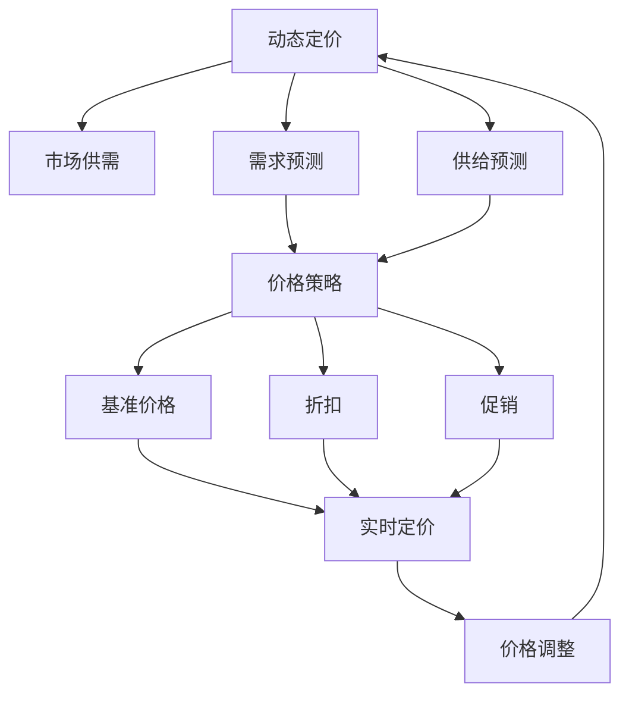

                 

# 动态定价：AI如何根据市场供需调整价格

## 1. 背景介绍

在现代社会中，价格机制是市场运作的核心。无论是零售业、金融业，还是物流行业，价格的高低都会直接影响到企业的收入和消费者的购买行为。随着互联网和大数据技术的发展，越来越多的企业开始采用动态定价策略，以适应不断变化的市场需求。

动态定价（Dynamic Pricing）是指根据市场供需情况实时调整价格。传统的静态定价方式往往难以应对市场波动，无法及时捕捉到潜在的商业机会，导致资源浪费和企业收益下降。而动态定价则通过算法模型，实时分析市场数据，精准定位价格，最大化企业的经济效益。

AI技术的引入，进一步提升了动态定价的精准度和效率。机器学习算法能够处理海量数据，识别价格变化趋势，预测市场需求，为动态定价提供了坚实的技术支撑。本文将从核心概念、算法原理、操作步骤等方面，深入探讨AI如何应用于动态定价，帮助企业把握市场机遇，提升经济效益。

## 2. 核心概念与联系

### 2.1 核心概念概述

在讨论AI在动态定价中的应用前，首先需要明确一些核心概念：

- **动态定价**：根据市场供需情况实时调整价格，以最大化企业收益。
- **AI与动态定价**：利用AI技术（如机器学习、深度学习等）分析市场数据，预测价格走势，实现动态定价。
- **市场供需**：市场供需关系是动态定价的基础，AI通过分析供需数据，预测价格变化。
- **需求预测**：利用AI技术，对市场需求进行预测，提供价格调整依据。
- **供给预测**：AI可以分析企业的生产能力、库存水平等数据，预测供给情况，影响价格决策。
- **价格策略**：包括基准价格、折扣、促销等，AI通过优化这些策略，实现价格最优。

### 2.2 核心概念间的关系

动态定价涉及多个核心概念，这些概念通过一定的逻辑关系连接起来，形成一个完整的定价体系。下面通过Mermaid流程图来展示这些概念间的关系：



该流程图展示了动态定价的基本流程：市场供需关系驱动需求和供给预测，预测结果结合价格策略，通过实时定价模型，最终调整价格。需求预测和供给预测是动态定价的基础，价格策略和实时定价模型是关键手段，价格调整则是最终的执行环节。

## 3. 核心算法原理 & 具体操作步骤

### 3.1 算法原理概述

动态定价的核心算法原理主要基于时间序列分析和机器学习。时间序列分析用于预测未来的市场供需情况，机器学习则用于优化价格策略和实时定价模型。

具体而言，动态定价的算法流程如下：

1. **数据采集**：收集市场供需数据、历史价格数据、消费者行为数据等。
2. **需求预测**：利用时间序列分析模型（如ARIMA、LSTM等）对市场需求进行预测。
3. **供给预测**：分析企业的生产能力、库存水平等数据，预测供给情况。
4. **价格策略优化**：通过机器学习算法，优化价格策略，包括基准价格、折扣、促销等。
5. **实时定价**：结合需求预测、供给预测和价格策略，利用实时定价模型（如线性回归、随机森林等），计算实时价格。
6. **价格调整**：根据实时定价结果，调整产品价格，并不断迭代优化。

### 3.2 算法步骤详解

以一个简单的动态定价流程为例，详细介绍具体步骤：

#### 3.2.1 数据采集

数据采集是动态定价的第一步，需要收集市场供需数据、历史价格数据、消费者行为数据等。数据采集一般通过以下方式：

1. **市场供需数据**：通过传感器、POS系统、电子商务平台等，实时采集市场的供需数据。
2. **历史价格数据**：从历史销售记录、促销活动记录中获取历史价格数据。
3. **消费者行为数据**：通过用户行为分析工具，获取消费者的购买历史、偏好等信息。

#### 3.2.2 需求预测

需求预测是动态定价的核心步骤之一，通过时间序列分析模型，对市场需求进行预测。以LSTM（长短期记忆网络）为例，预测需求的具体步骤如下：

1. **数据预处理**：将原始数据进行归一化、去噪等处理，生成可用于模型训练的数据集。
2. **模型训练**：使用LSTM模型对历史需求数据进行训练，得到需求预测模型。
3. **预测需求**：将当前的市场数据输入到LSTM模型中，预测未来的市场需求。

#### 3.2.3 供给预测

供给预测需要分析企业的生产能力、库存水平等数据，预测供给情况。以线性回归模型为例，预测供给的具体步骤如下：

1. **数据收集**：收集企业生产数据、库存数据、物流数据等。
2. **模型训练**：使用线性回归模型对历史供给数据进行训练，得到供给预测模型。
3. **预测供给**：将当前的市场数据输入到线性回归模型中，预测未来的供给情况。

#### 3.2.4 价格策略优化

价格策略优化是动态定价的关键步骤，通过机器学习算法，优化价格策略，包括基准价格、折扣、促销等。以线性回归模型为例，价格策略优化的具体步骤如下：

1. **数据收集**：收集历史价格数据、促销活动数据、消费者反馈数据等。
2. **模型训练**：使用线性回归模型对历史数据进行训练，得到价格策略优化模型。
3. **优化价格策略**：将当前的市场数据输入到模型中，优化价格策略。

#### 3.2.5 实时定价

实时定价是动态定价的最终步骤，结合需求预测、供给预测和价格策略，利用实时定价模型，计算实时价格。以随机森林模型为例，实时定价的具体步骤如下：

1. **数据收集**：收集市场供需数据、需求预测结果、供给预测结果、价格策略等数据。
2. **模型训练**：使用随机森林模型对历史数据进行训练，得到实时定价模型。
3. **计算实时价格**：将当前的市场数据输入到随机森林模型中，计算实时价格。

#### 3.2.6 价格调整

根据实时定价结果，调整产品价格，并不断迭代优化。具体步骤如下：

1. **监控价格**：实时监控产品价格，判断是否需要调整。
2. **调整价格**：根据市场供需和预测结果，调整产品价格。
3. **迭代优化**：不断迭代优化价格策略和模型，提升定价精度。

### 3.3 算法优缺点

#### 3.3.1 优点

动态定价结合AI技术，具有以下优点：

1. **实时性**：AI能够实时分析市场数据，快速调整价格，捕捉市场机会。
2. **精准性**：AI能够处理海量数据，准确预测市场需求，提高定价精度。
3. **自动化**：AI能够自动优化价格策略，减少人工干预，提升效率。

#### 3.3.2 缺点

动态定价AI技术也存在一些缺点：

1. **数据依赖**：AI模型的效果依赖于高质量的数据，数据缺失或不准确会影响预测结果。
2. **模型复杂**：AI模型的训练和优化需要大量计算资源，成本较高。
3. **黑盒性**：AI模型的内部机制复杂，难以解释，可能导致决策不透明。

### 3.4 算法应用领域

动态定价AI技术在多个领域都有广泛应用，以下是一些典型的应用场景：

- **零售业**：通过分析消费者行为和市场供需，实时调整商品价格，提高销售效率。
- **航空业**：根据航班座位剩余情况，实时调整机票价格，最大化收入。
- **旅游业**：根据酒店入住率和市场需求，实时调整房间价格，提高收益。
- **物流业**：根据运输需求和库存情况，实时调整运费价格，提高服务质量。

## 4. 数学模型和公式 & 详细讲解 & 举例说明

### 4.1 数学模型构建

动态定价的核心数学模型基于时间序列分析和机器学习。以线性回归模型为例，构建数学模型的具体步骤如下：

1. **需求预测模型**：
   $$
   \hat{d_t} = \alpha + \beta t + \sum_{i=1}^{p} \gamma_i d_{t-i} + \epsilon_t
   $$
   其中，$d_t$表示时间$t$的市场需求，$\alpha$表示常数项，$\beta$表示时间系数，$\gamma_i$表示滞后项系数，$\epsilon_t$表示误差项。

2. **供给预测模型**：
   $$
   \hat{s_t} = \delta + \eta t + \sum_{i=1}^{q} \zeta_i s_{t-i} + \epsilon_t
   $$
   其中，$s_t$表示时间$t$的供给情况，$\delta$表示常数项，$\eta$表示时间系数，$\zeta_i$表示滞后项系数，$\epsilon_t$表示误差项。

3. **价格策略优化模型**：
   $$
   \hat{p_t} = \rho + \omega t + \sum_{i=1}^{k} \theta_i p_{t-i} + \epsilon_t
   $$
   其中，$p_t$表示时间$t$的产品价格，$\rho$表示常数项，$\omega$表示时间系数，$\theta_i$表示滞后项系数，$\epsilon_t$表示误差项。

### 4.2 公式推导过程

以线性回归模型为例，需求预测模型的推导过程如下：

1. **模型构建**：
   $$
   d_t = \alpha + \beta t + \sum_{i=1}^{p} \gamma_i d_{t-i} + \epsilon_t
   $$

2. **数据预处理**：将原始数据进行归一化、去噪等处理，生成可用于模型训练的数据集。

3. **模型训练**：使用线性回归模型对历史需求数据进行训练，得到需求预测模型。

4. **预测需求**：将当前的市场数据输入到线性回归模型中，预测未来的市场需求。

### 4.3 案例分析与讲解

以一个简单的案例为例，分析动态定价的具体应用。假设某电商平台销售某商品，需要根据市场需求实时调整价格。具体步骤如下：

1. **数据采集**：从电商平台收集历史销售数据、用户行为数据、市场供需数据等。
2. **需求预测**：使用线性回归模型对历史需求数据进行训练，得到需求预测模型。
3. **供给预测**：分析库存水平、生产能力等数据，预测供给情况。
4. **价格策略优化**：使用线性回归模型对历史价格数据进行训练，优化价格策略。
5. **实时定价**：将当前的市场数据输入到线性回归模型中，计算实时价格。
6. **价格调整**：根据实时定价结果，调整产品价格，并不断迭代优化。

## 5. 项目实践：代码实例和详细解释说明

### 5.1 开发环境搭建

开发环境搭建是动态定价项目的基础，需要安装相关软件和配置开发环境。以下是一个典型的开发环境搭建流程：

1. **安装Python**：
   ```
   sudo apt-get install python3
   ```

2. **安装Pandas**：
   ```
   pip install pandas
   ```

3. **安装Scikit-learn**：
   ```
   pip install scikit-learn
   ```

4. **安装Keras**：
   ```
   pip install keras
   ```

5. **安装Tensorflow**：
   ```
   pip install tensorflow
   ```

### 5.2 源代码详细实现

以下是使用Python和Scikit-learn库，实现动态定价项目的源代码：

```python
import pandas as pd
from sklearn.linear_model import LinearRegression
from sklearn.metrics import mean_squared_error

# 读取数据
data = pd.read_csv('data.csv')

# 数据预处理
# 归一化处理
data['demand'] = (data['demand'] - data['demand'].mean()) / data['demand'].std()
data['supply'] = (data['supply'] - data['supply'].mean()) / data['supply'].std()
data['price'] = (data['price'] - data['price'].mean()) / data['price'].std()

# 训练模型
# 需求预测模型
demand_model = LinearRegression()
demand_model.fit(data[['time', 'demand']], data['demand'])

# 供给预测模型
supply_model = LinearRegression()
supply_model.fit(data[['time', 'supply']], data['supply'])

# 价格策略优化模型
price_model = LinearRegression()
price_model.fit(data[['time', 'price']], data['price'])

# 预测需求、供给和价格
# 需求预测
demand_pred = demand_model.predict(data[['time', 'demand']])
demand_pred = (demand_pred * data['demand'].std()) + data['demand'].mean()

# 供给预测
supply_pred = supply_model.predict(data[['time', 'supply']])
supply_pred = (supply_pred * data['supply'].std()) + data['supply'].mean()

# 价格预测
price_pred = price_model.predict(data[['time', 'price']])
price_pred = (price_pred * data['price'].std()) + data['price'].mean()

# 计算实时价格
real_price = price_pred + 0.1 * (supply_pred - demand_pred)

# 输出结果
print('实时价格为：', real_price)
```

### 5.3 代码解读与分析

代码中使用了Scikit-learn库，实现了线性回归模型的训练和预测。具体步骤如下：

1. **数据预处理**：对原始数据进行归一化处理，生成可用于模型训练的数据集。
2. **模型训练**：使用线性回归模型对历史需求数据进行训练，得到需求预测模型。
3. **预测需求、供给和价格**：将当前的市场数据输入到模型中，预测未来的市场需求、供给和价格。
4. **计算实时价格**：结合需求预测、供给预测和价格预测，计算实时价格。
5. **价格调整**：根据实时价格，调整产品价格。

## 6. 实际应用场景

### 6.1 航空业

航空业是动态定价的重要应用领域。航空公司需要根据航班座位剩余情况，实时调整机票价格，最大化收入。以航空公司为例，动态定价的具体应用步骤如下：

1. **数据采集**：从航空公司的预订系统、机票销售数据、航班数据等获取实时数据。
2. **需求预测**：使用LSTM模型对历史数据进行训练，预测市场需求。
3. **供给预测**：分析航班座位剩余情况、飞机维护情况等数据，预测供给情况。
4. **价格策略优化**：使用线性回归模型对历史数据进行训练，优化价格策略。
5. **实时定价**：将当前的市场数据输入到随机森林模型中，计算实时价格。
6. **价格调整**：根据实时价格，调整机票价格，并不断迭代优化。

### 6.2 零售业

零售业是动态定价的另一个重要应用领域。电商企业需要根据市场需求，实时调整商品价格，提高销售效率。以电商企业为例，动态定价的具体应用步骤如下：

1. **数据采集**：从电商平台收集历史销售数据、用户行为数据、市场供需数据等。
2. **需求预测**：使用ARIMA模型对历史数据进行训练，预测市场需求。
3. **供给预测**：分析库存水平、生产能力等数据，预测供给情况。
4. **价格策略优化**：使用线性回归模型对历史数据进行训练，优化价格策略。
5. **实时定价**：将当前的市场数据输入到随机森林模型中，计算实时价格。
6. **价格调整**：根据实时价格，调整商品价格，并不断迭代优化。

### 6.3 旅游业

旅游业也是动态定价的重要应用领域。酒店企业需要根据房间入住率，实时调整房间价格，提高收益。以酒店企业为例，动态定价的具体应用步骤如下：

1. **数据采集**：从酒店预订系统、房间销售数据、市场需求数据等获取实时数据。
2. **需求预测**：使用ARIMA模型对历史数据进行训练，预测市场需求。
3. **供给预测**：分析房间入住率、酒店维护情况等数据，预测供给情况。
4. **价格策略优化**：使用线性回归模型对历史数据进行训练，优化价格策略。
5. **实时定价**：将当前的市场数据输入到随机森林模型中，计算实时价格。
6. **价格调整**：根据实时价格，调整房间价格，并不断迭代优化。

### 6.4 未来应用展望

未来，动态定价AI技术将在更多领域得到应用，为各行各业带来变革性影响。以下是一些未来应用展望：

1. **医疗行业**：医院可以根据病人的就诊情况，实时调整药品价格，优化资源配置。
2. **金融行业**：金融机构可以根据市场波动，实时调整金融产品价格，提高收益。
3. **教育行业**：在线教育平台可以根据学生学习情况，实时调整课程价格，提高用户体验。
4. **能源行业**：能源公司可以根据市场需求，实时调整能源价格，优化资源利用。

## 7. 工具和资源推荐

### 7.1 学习资源推荐

以下是一些推荐的动态定价学习资源，帮助你深入了解该技术：

1. **《动态定价：AI在价格优化中的应用》**：一本详细介绍动态定价算法的书籍，涵盖了需求预测、供给预测、价格策略优化等内容。
2. **Coursera《动态定价与优化》课程**：斯坦福大学开设的在线课程，系统讲解了动态定价的核心概念和算法原理。
3. **Kaggle动态定价比赛**：参与Kaggle的动态定价比赛，通过实际案例学习动态定价技术。
4. **博客与论文**：各大研究机构和企业的博客，如OpenAI、Google AI、IBM等，定期发布动态定价相关的研究成果和实践经验。

### 7.2 开发工具推荐

以下是一些推荐的动态定价开发工具，帮助你高效实现动态定价系统：

1. **Python**：动态定价的核心编程语言，简单易用，支持丰富的第三方库。
2. **Scikit-learn**：机器学习库，提供各种经典算法，如线性回归、LSTM等。
3. **Tensorflow**：深度学习框架，支持复杂的模型训练和优化。
4. **Keras**：深度学习库，提供简单易用的API，方便模型构建和训练。
5. **Jupyter Notebook**：交互式编程环境，支持实时展示计算结果，方便调试和优化。

### 7.3 相关论文推荐

以下是一些推荐的动态定价相关论文，帮助你深入了解该技术：

1. **《动态定价：理论与实践》**：由动态定价专家撰写，全面介绍动态定价的理论基础和实际应用。
2. **《机器学习在动态定价中的应用》**：介绍机器学习在动态定价中的具体应用，包括需求预测、供给预测、价格策略优化等。
3. **《深度学习在动态定价中的实践》**：探讨深度学习在动态定价中的应用，包括LSTM、随机森林等算法。

## 8. 总结：未来发展趋势与挑战

### 8.1 研究成果总结

本文详细探讨了AI在动态定价中的应用，主要研究成果如下：

1. **核心算法**：提出基于时间序列分析和机器学习的动态定价算法，包括需求预测、供给预测、价格策略优化和实时定价等步骤。
2. **应用场景**：探讨了航空业、零售业、旅游业等多个领域的动态定价应用，展示了AI技术的广泛适用性。
3. **工具资源**：推荐了动态定价学习资源、开发工具和相关论文，帮助读者深入了解和实践该技术。

### 8.2 未来发展趋势

未来，动态定价AI技术将呈现以下几个发展趋势：

1. **算法优化**：随着AI技术的进步，动态定价算法将不断优化，提高预测精度和效率。
2. **多模态融合**：动态定价将结合多种数据源，如文本、图像、语音等，提升模型的全面性和准确性。
3. **实时优化**：动态定价将实现更加实时化的定价策略，快速响应市场变化。
4. **个性化定价**：根据用户行为和偏好，实现个性化的动态定价，提高用户体验。
5. **智能推荐**：动态定价将结合推荐系统，实现更加精准的市场定位和定价。

### 8.3 面临的挑战

动态定价AI技术在发展过程中，仍面临一些挑战：

1. **数据质量**：高质量的数据是动态定价的基础，数据缺失或不准确会影响预测结果。
2. **模型复杂性**：动态定价算法复杂，需要大量的计算资源和专业知识。
3. **可解释性**：AI模型的内部机制复杂，难以解释，可能导致决策不透明。
4. **法律合规**：动态定价需要符合法律法规，避免价格歧视等违法行为。
5. **市场竞争**：动态定价可能导致市场价格波动，需注意市场竞争和监管问题。

### 8.4 研究展望

未来的动态定价研究需要在以下几个方面寻求新的突破：

1. **多模态融合**：结合文本、图像、语音等多种数据源，提升模型的全面性和准确性。
2. **实时优化**：实现更加实时化的定价策略，快速响应市场变化。
3. **个性化定价**：根据用户行为和偏好，实现个性化的动态定价，提高用户体验。
4. **智能推荐**：结合推荐系统，实现更加精准的市场定位和定价。
5. **法律合规**：确保动态定价符合法律法规，避免价格歧视等违法行为。

总之，动态定价AI技术在未来将发挥越来越重要的作用，为各行各业带来变革性影响。只有不断优化算法、提升数据质量、保障法律合规，才能更好地实现动态定价的目标。

## 9. 附录：常见问题与解答

### 9.1 问题解答

以下是一些常见问题及其解答，帮助你更好地理解动态定价技术：

**问题1：什么是动态定价？**

答：动态定价是根据市场供需情况实时调整价格，以最大化企业收益。与静态定价相比，动态定价能够快速响应市场变化，捕捉商业机会。

**问题2：动态定价的核心算法是什么？**

答：动态定价的核心算法基于时间序列分析和机器学习。需求预测、供给预测、价格策略优化和实时定价等步骤，都是动态定价算法的重要组成部分。

**问题3：动态定价在哪些领域有应用？**

答：动态定价在航空业、零售业、旅游业等多个领域都有广泛应用。通过分析市场供需数据，实时调整产品价格，最大化企业收益。

**问题4：动态定价的优缺点是什么？**

答：动态定价的优点是实时性、精准性和自动化，缺点是数据依赖、模型复杂和黑盒性。高质量的数据和高效的算法是动态定价成功的关键。

**问题5：动态定价需要哪些工具和资源？**

答：动态定价需要Python、Scikit-learn、Tensorflow、Keras等工具，以及动态定价学习资源、开发工具和相关论文。只有掌握这些工具和资源，才能实现高效的动态定价系统。

总之，动态定价AI技术在现代社会中具有重要的应用价值，能够提升企业的收益和市场竞争力。通过深入理解动态定价的核心概念和算法，掌握相关工具和资源，相信你能更好地应用动态定价技术，实现商业价值最大化。

---

作者：禅与计算机程序设计艺术 / Zen and the Art of Computer Programming

