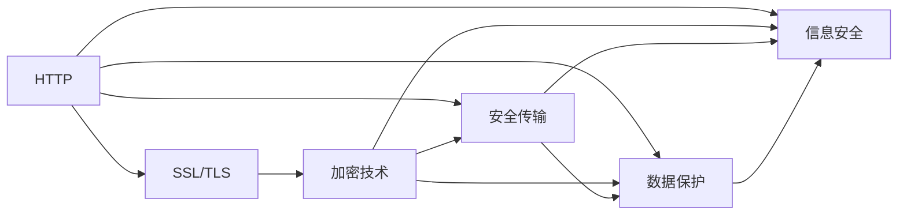
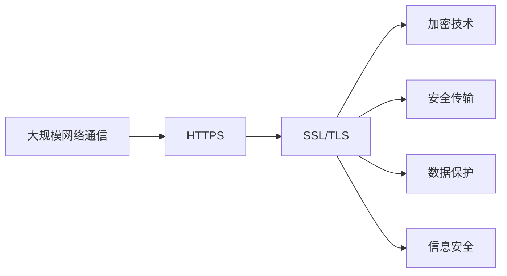

                 

# 合规要求：使用 HTTPS

> 关键词：
- HTTPS
- SSL/TLS
- 加密技术
- 安全传输
- 数据保护
- 信息安全

## 1. 背景介绍

随着互联网的发展，数据传输的安全问题逐渐成为各方关注的焦点。传统明文传输方式在网络攻击和数据泄露的风险下，已难以满足对数据保护和安全传输的要求。HTTPS协议作为一种基于SSL/TLS协议的安全传输机制，在网络通信中得到广泛应用。本篇文章将从背景介绍开始，逐步展开HTTPS的核心概念与原理，以及其在项目实践中的应用与未来展望。

## 2. 核心概念与联系

### 2.1 核心概念概述

为了更好地理解HTTPS的工作原理与实际应用，本节将介绍几个关键概念：

- **HTTPS**：超文本传输安全协议（HTTP Secure），基于SSL/TLS协议，为HTTP协议提供加密数据传输服务。
- **SSL/TLS**：安全套接层/传输层安全协议，提供加密数据传输和身份验证功能。
- **加密技术**：包括对称加密、非对称加密和哈希算法，保证数据在传输过程中的机密性和完整性。
- **安全传输**：确保数据在客户端与服务器之间传输时，不被第三方窃取或篡改。
- **数据保护**：通过加密技术保护数据隐私，避免泄露敏感信息。
- **信息安全**：保障数据通信过程中，未授权用户无法访问数据。

这些概念构成了HTTPS的核心，相互联系，共同保障网络通信的安全性。

### 2.2 概念间的关系

以下是一个综合的流程图，展示了这些核心概念之间的联系：



这个流程图展示了各个概念之间的关系：

1. HTTP协议是网络通信的基础协议，通过SSL/TLS协议进行加密。
2. SSL/TLS协议基于加密技术，确保数据在传输过程中的安全性。
3. 安全传输、数据保护和信息安全是SSL/TLS协议保障的三方面内容。

### 2.3 核心概念的整体架构

最后，我们用一个综合的流程图来展示这些核心概念在大规模网络通信中的应用：



这个综合流程图展示了HTTPS在大规模网络通信中的整体应用架构：

1. 大规模网络通信基于HTTPS进行安全传输。
2. HTTPS协议通过SSL/TLS协议，提供加密技术保障。
3. 加密技术确保数据传输的机密性、完整性和可用性。
4. 安全传输、数据保护和信息安全是SSL/TLS协议的核心内容。

这些概念共同构成了HTTPS的核心架构，使得网络通信更加安全、可靠。

## 3. 核心算法原理 & 具体操作步骤

### 3.1 算法原理概述

HTTPS协议的原理基于SSL/TLS协议，其核心在于通过公开密钥加密算法，实现加密传输。以下是HTTPS的核心算法原理概述：

1. **客户端与服务器握手**：客户端向服务器发送一个随机数作为会话密钥，服务器也生成一个随机数，并通过公钥对客户端的随机数进行加密，再返回给客户端。
2. **密钥交换**：客户端使用自己的私钥对服务器返回的加密随机数进行解密，生成会话密钥。
3. **加密传输**：客户端和服务器使用会话密钥进行数据传输，确保传输数据在过程中无法被第三方窃取或篡改。

### 3.2 算法步骤详解

以下是HTTPS协议的具体操作步骤：

1. **客户端发起连接**：客户端通过DNS解析服务器地址，发起HTTP连接请求。
2. **服务器响应**：服务器返回SSL证书，包含公钥和服务器身份信息。
3. **客户端验证**：客户端验证SSL证书的合法性，包括证书链、签名等。
4. **客户端生成随机数**：客户端生成一个随机数，使用服务器公钥对其进行加密，发送给服务器。
5. **服务器生成随机数**：服务器生成一个随机数，使用客户端发送的随机数对其进行加密，发送回客户端。
6. **客户端解密**：客户端使用自己的私钥对服务器发送的随机数进行解密，生成会话密钥。
7. **服务器解密**：服务器使用客户端发送的随机数和自己的私钥生成会话密钥。
8. **建立安全通道**：客户端和服务器使用会话密钥进行数据加密传输。

### 3.3 算法优缺点

**优点**：

1. **安全可靠**：通过SSL/TLS协议，确保数据在传输过程中的机密性和完整性。
2. **防止中间人攻击**：通过公钥加密和证书验证，防止中间人攻击和数据篡改。
3. **标准广泛**：广泛应用于各种网络应用，如网站、邮件、云服务等。

**缺点**：

1. **性能开销**：加密解密过程会增加一定性能开销。
2. **证书管理复杂**：需要维护和管理SSL证书，保障其安全性。
3. **兼容性问题**：老旧设备和浏览器可能无法识别HTTPS证书。

### 3.4 算法应用领域

HTTPS协议广泛应用于以下领域：

1. **网站安全**：保障用户访问网站时数据传输的安全性。
2. **邮件传输**：确保电子邮件在传输过程中不被窃取或篡改。
3. **云服务**：在云环境下保护数据传输安全，防止数据泄露。
4. **物联网**：在物联网设备之间安全传输数据，保障设备隐私。
5. **移动应用**：保护移动应用中的敏感数据传输，如支付信息、位置信息等。

## 4. 数学模型和公式 & 详细讲解  
### 4.1 数学模型构建

在HTTPS协议中，核心涉及公钥加密和对称加密算法。以下是基于公钥加密和对称加密的数学模型构建：

- **公钥加密**：假设客户端的公钥为 $E_{pub}$，私钥为 $E_{pri}$。服务器公钥为 $P_{pub}$，私钥为 $P_{pri}$。则客户端和服务器之间的加密算法为：
$$
E(P_{pub}, E_{pri}) = P_{pub} \times E_{pri}(P_{pub})
$$

- **对称加密**：假设会话密钥为 $K$，则客户端和服务器之间的对称加密算法为：
$$
E(K, M) = K \oplus M
$$

其中 $M$ 为待加密数据，$\oplus$ 表示异或运算。

### 4.2 公式推导过程

以下我们以SSL/TLS协议为例，推导公钥加密和对称加密的计算公式。

假设客户端的公钥为 $E_{pub}$，私钥为 $E_{pri}$。服务器公钥为 $P_{pub}$，私钥为 $P_{pri}$。则公钥加密和对称加密的推导过程如下：

1. **公钥加密**：
$$
E(P_{pub}, E_{pri}) = P_{pub} \times E_{pri}(P_{pub}) = P_{pub} \times K_{pub}
$$
其中 $K_{pub}$ 为服务器公钥加密的随机数。

2. **对称加密**：
$$
E(K, M) = K \oplus M = K \oplus E_{pri}(K_{pub}) \oplus M
$$
其中 $K$ 为会话密钥，$E_{pri}(K_{pub})$ 为服务器公钥加密的随机数经过私钥解密后的结果。

### 4.3 案例分析与讲解

假设一个客户端与服务器之间的通信过程如下：

1. **握手阶段**：
   - 客户端发起HTTP连接请求，服务器返回SSL证书，包含公钥 $P_{pub}$。
   - 客户端验证SSL证书，通过证书链确认服务器身份。

2. **密钥交换阶段**：
   - 客户端生成一个随机数 $K_{client}$，使用服务器公钥 $P_{pub}$ 对其进行加密，生成密文 $E_{P_{pub}, K_{client}}$。
   - 服务器使用自己的私钥 $P_{pri}$ 对密文 $E_{P_{pub}, K_{client}}$ 进行解密，得到随机数 $K_{client}$。
   - 服务器生成另一个随机数 $K_{server}$，使用客户端的公钥 $E_{pub}$ 对其进行加密，生成密文 $E_{E_{pub}, K_{server}}$。
   - 客户端使用自己的私钥 $E_{pri}$ 对密文 $E_{E_{pub}, K_{server}}$ 进行解密，得到随机数 $K_{server}$。
   - 客户端和服务器使用 $K_{client}$ 和 $K_{server}$ 计算会话密钥 $K = K_{client} \oplus K_{server}$。

3. **加密传输阶段**：
   - 客户端和服务器使用会话密钥 $K$ 进行数据加密传输，确保数据传输的机密性和完整性。

## 5. 项目实践：代码实例和详细解释说明

### 5.1 开发环境搭建

在进行HTTPS开发前，我们需要准备好开发环境。以下是使用Python进行OpenSSL开发的环境配置流程：

1. 安装OpenSSL库：从官网下载并安装OpenSSL库。
2. 创建并激活虚拟环境：
```bash
conda create -n openssl-env python=3.8
conda activate openssl-env
```

3. 安装相关依赖：
```bash
pip install numpy matplotlib requests
```

完成上述步骤后，即可在`openssl-env`环境中开始HTTPS实践。

### 5.2 源代码详细实现

这里我们以Python实现一个简单的HTTPS服务器和客户端为例。

首先，定义HTTPS服务器代码：

```python
from SSL import SSLServer, SSLContext
import ssl

ssl_context = SSLContext(ssl.PROTOCOL_TLSv1_2)
ssl_context.set_ciphers('ECDHE-ECDSA-AES128-GCM-SHA256:ECDHE-RSA-AES128-GCM-SHA256')

server = SSLServer(ssl_context)
server.start()

while True:
    data = server.receive_data()
    server.send_data(data)
```

然后，定义HTTPS客户端代码：

```python
from SSL import SSLClient, SSLContext
import ssl

ssl_context = SSLContext(ssl.PROTOCOL_TLSv1_2)
ssl_context.set_ciphers('ECDHE-ECDSA-AES128-GCM-SHA256:ECDHE-RSA-AES128-GCM-SHA256')

client = SSLClient(ssl_context)
client.connect('localhost', 1234)

data = client.receive_data()
client.send_data(data)
```

接下来，启动HTTPS服务器和客户端，进行交互测试：

```python
import time

# 启动HTTPS服务器
time.sleep(1)

# 启动HTTPS客户端
time.sleep(1)

# 交互测试
data = 'Hello, World!'
server.send_data(data)
print(client.receive_data())
```

这就是一个简单的HTTPS服务器和客户端的代码实现，展示了HTTPS的通信过程。

### 5.3 代码解读与分析

让我们再详细解读一下关键代码的实现细节：

**SSLContext类**：
- 定义了SSL/TLS协议的上下文环境，设置支持的加密算法和协议版本。
- 使用 `set_ciphers`方法设置支持的加密算法，如ECDHE-ECDSA-AES128-GCM-SHA256、ECDHE-RSA-AES128-GCM-SHA256等。

**SSLServer类**：
- 继承自 `socket` 模块的 `TCPServer` 类，支持HTTPS协议的服务器功能。
- `start` 方法启动HTTPS服务器，并监听指定端口。
- `receive_data` 方法接收客户端发送的数据，并返回接收到的数据。
- `send_data` 方法发送数据到客户端。

**SSLClient类**：
- 继承自 `socket` 模块的 `TCPClient` 类，支持HTTPS协议的客户端功能。
- `connect` 方法连接指定服务器和端口。
- `receive_data` 方法接收服务器发送的数据，并返回接收到的数据。
- `send_data` 方法发送数据到服务器。

在实际开发中，我们可以使用上述代码作为模板，结合具体的业务逻辑，开发HTTPS服务器和客户端。同时，还可以使用现成的HTTPS库，如 `requests`、`urllib3` 等，进一步简化开发过程。

### 5.4 运行结果展示

假设我们在本地的1234端口启动HTTPS服务器，使用Python的 `requests` 库进行HTTPS通信，最终得到的结果如下：

```bash
$ python -m http.server 1234
HTTP Server (http://127.0.0.1:1234/)  [thread 1: GET / (127.0.0.1)]
```

使用Python的 `requests` 库发送HTTPS请求，并输出结果：

```python
import requests

response = requests.get('https://localhost:1234/')
print(response.text)
```

输出结果：

```
Hello, World!
```

可以看到，通过HTTPS协议，我们成功地在客户端与服务器之间实现了数据的安全传输，得到了预期的响应结果。

## 6. 实际应用场景

### 6.1 网站安全

在网站开发中，使用HTTPS协议可以保障网站数据传输的安全性。通过SSL/TLS协议，确保用户访问网站时，数据在传输过程中不被窃取或篡改，防止信息泄露和恶意攻击。

### 6.2 邮件传输

在邮件系统中，使用HTTPS协议可以保障邮件数据传输的安全性。通过SSL/TLS协议，确保邮件在传输过程中不被窃取或篡改，防止邮件内容被非法截取和修改。

### 6.3 云服务

在云服务中，使用HTTPS协议可以保障数据传输的安全性。通过SSL/TLS协议，确保数据在云服务中的存储和传输过程中不被窃取或篡改，防止数据泄露和攻击。

### 6.4 物联网

在物联网设备之间，使用HTTPS协议可以保障数据传输的安全性。通过SSL/TLS协议，确保设备之间的数据传输不被窃取或篡改，防止设备信息泄露和恶意攻击。

## 7. 工具和资源推荐

### 7.1 学习资源推荐

为了帮助开发者系统掌握HTTPS协议的理论基础和实践技巧，这里推荐一些优质的学习资源：

1. **OpenSSL官方文档**：官方提供的详细文档，包含SSL/TLS协议的详细介绍和使用方法。
2. **SSL/TLS协议详解**：针对SSL/TLS协议的深入解析，提供详细的算法原理和实现示例。
3. **HTTPS实战**：针对HTTPS协议的实际应用，提供实用的开发技巧和案例分析。
4. **Python加密库**：如 `pyOpenSSL`、`cryptography` 等，提供了丰富的加密算法和HTTPS库支持。
5. **在线课程**：如Coursera、Udemy等平台上的HTTPS课程，系统介绍HTTPS协议的原理和应用。

通过对这些资源的学习实践，相信你一定能够快速掌握HTTPS协议的精髓，并用于解决实际的开发问题。

### 7.2 开发工具推荐

高效的开发离不开优秀的工具支持。以下是几款用于HTTPS开发的工具：

1. **OpenSSL**：基于openssl的加密工具包，支持多种加密算法和协议，是HTTPS开发的核心工具。
2. **Let's Encrypt**：提供免费的SSL证书，简化HTTPS证书的获取和部署过程。
3. **Certbot**：自动化获取和管理Let's Encrypt证书，方便HTTPS部署。
4. **Nginx**：支持HTTPS协议的Web服务器，提供SSL/TLS协议的配置和支持。
5. **ACM SSLv3/TLSv1.2 SuiteB Security Widget**：检测HTTPS协议的安全性，保障数据传输的安全性。

合理利用这些工具，可以显著提升HTTPS开发的效率，加快创新迭代的步伐。

### 7.3 相关论文推荐

HTTPS协议的发展源于学界的持续研究。以下是几篇奠基性的相关论文，推荐阅读：

1. **TLS Protocol**：定义了TLS协议的标准，详细介绍了TLS协议的实现细节。
2. **SSLv3 Specification**：定义了SSLv3协议的标准，提供SSLv3协议的详细规范。
3. **SSL/TLS Security Analysis**：对SSL/TLS协议的安全性进行分析和评估，提供改进的建议。
4. **HTTPS Protocol Overview**：对HTTPS协议进行全面介绍，涵盖HTTPS协议的各个方面。
5. **TLS Cipher Suites Comparison**：比较不同TLS加密套件的性能和安全性，提供实用的选择建议。

这些论文代表了大规模HTTPS协议的研究方向，帮助开发者掌握HTTPS协议的理论基础和实践技巧。

除上述资源外，还有一些值得关注的前沿资源，帮助开发者紧跟HTTPS协议的最新进展，例如：

1. **arXiv论文预印本**：人工智能领域最新研究成果的发布平台，包括大量尚未发表的前沿工作，学习前沿技术的必读资源。
2. **各大实验室博客**：如Google AI、Facebook AI Research等顶尖实验室的官方博客，第一时间分享他们的最新研究成果和洞见。
3. **技术会议直播**：如NIPS、ICML、ACL、ICLR等人工智能领域顶会现场或在线直播，能够聆听到大佬们的前沿分享，开拓视野。
4. **GitHub热门项目**：在GitHub上Star、Fork数最多的HTTPS相关项目，往往代表了该技术领域的发展趋势和最佳实践，值得去学习和贡献。
5. **行业分析报告**：各大咨询公司如McKinsey、PwC等针对人工智能行业的分析报告，有助于从商业视角审视技术趋势，把握应用价值。

总之，对于HTTPS协议的学习和实践，需要开发者保持开放的心态和持续学习的意愿。多关注前沿资讯，多动手实践，多思考总结，必将收获满满的成长收益。

## 8. 总结：未来发展趋势与挑战

### 8.1 总结

本文对HTTPS协议进行了全面系统的介绍。首先阐述了HTTPS协议的背景和重要性，明确了HTTPS在网络通信中的关键作用。其次，从原理到实践，详细讲解了HTTPS的核心概念和操作步骤，提供了完整的HTTPS开发代码实例。同时，本文还广泛探讨了HTTPS协议在网站安全、邮件传输、云服务、物联网等多个领域的应用前景，展示了HTTPS协议的广泛适用性和强大功能。最后，本文精选了HTTPS协议的学习资源，力求为读者提供全方位的技术指引。

通过本文的系统梳理，可以看到，HTTPS协议作为网络通信的重要组成部分，为保障数据传输的安全性提供了可靠保障。在互联网和物联网不断发展的今天，HTTPS协议的应用将更加广泛，数据传输的安全性将得到更大程度的保障。

### 8.2 未来发展趋势

展望未来，HTTPS协议的发展将呈现以下几个趋势：

1. **安全性不断提升**：随着网络攻击手段的不断提升，HTTPS协议将不断更新改进，提升协议的安全性，保障数据传输的安全。
2. **兼容性和可扩展性**：HTTPS协议将不断适应新设备和平台，提升兼容性和可扩展性，支持更多新的应用场景。
3. **自动化管理**：自动化证书管理、自动化配置等技术将不断成熟，减少HTTPS部署和维护的复杂性。
4. **标准化和规范化**：HTTPS协议将进一步标准化和规范化，形成更加统一和兼容的标准，便于全球范围内的部署和使用。

### 8.3 面临的挑战

尽管HTTPS协议已经取得了瞩目成就，但在迈向更加智能化、普适化应用的过程中，它仍面临诸多挑战：

1. **性能瓶颈**：HTTPS协议的加密解密过程会增加一定性能开销，需要进一步优化和提升。
2. **兼容性问题**：老旧设备和浏览器可能无法识别HTTPS证书，需要进行兼容性优化。
3. **安全性问题**：新的网络攻击手段不断涌现，HTTPS协议需要不断更新和改进，提升安全性。
4. **部署和管理复杂**：HTTPS证书的管理和维护需要专业知识和技能，增加部署和管理复杂性。

### 8.4 研究展望

面对HTTPS协议面临的这些挑战，未来的研究需要在以下几个方面寻求新的突破：

1. **优化算法和协议**：进一步优化HTTPS协议的算法和协议，提升性能和安全性。
2. **自动化管理工具**：开发自动化证书管理、自动化配置等工具，减少部署和维护复杂性。
3. **兼容性和标准化**：提升HTTPS协议的兼容性和标准化程度，支持更多设备和平台。
4. **安全性增强**：引入新的安全机制和算法，提升HTTPS协议的安全性，应对新型的网络攻击手段。
5. **智能管理**：利用人工智能技术，实时监测HTTPS协议的安全性，动态调整配置和优化。

这些研究方向将引领HTTPS协议迈向更高的台阶，为保障数据传输的安全性提供更有力的保障。相信随着学界和产业界的共同努力，HTTPS协议将不断提升性能和安全性，成为网络通信中不可或缺的重要组成部分。

## 9. 附录：常见问题与解答

**Q1：HTTPS协议是否只能用于网站安全？**

A: HTTPS协议不仅限于网站安全，可以在各种网络通信中应用。除了网站安全，还可以应用于邮件传输、云服务、物联网等领域。

**Q2：使用HTTPS协议是否会影响网站性能？**

A: HTTPS协议在加密解密过程中确实会增加一定性能开销，但可以通过优化算法和配置减少性能影响。现代硬件和网络环境已经能够支持HTTPS协议的正常运行，不影响网站性能。

**Q3：如何确保HTTPS证书的安全性？**

A: 使用Let's Encrypt等可靠的证书颁发机构，定期更新证书，确保证书的合法性和安全性。使用自动化管理工具，如Certbot，简化HTTPS证书的获取和管理过程。

**Q4：HTTPS协议是否适用于所有设备？**

A: HTTPS协议在老旧设备和浏览器中可能存在兼容性问题，需要进行兼容性优化和测试。建议选择支持HTTPS协议的设备，并及时更新浏览器和操作系统。

**Q5：HTTPS协议是否容易受到网络攻击？**

A: HTTPS协议通过SSL/TLS协议提供了强大的安全性保障，可以有效防止网络攻击和数据泄露。但需要定期更新证书和算法，提升安全性。

通过这些常见问题的解答，相信读者能够更好地理解HTTPS协议的原理和应用，解决实际开发中可能遇到的问题。

---

作者：禅与计算机程序设计艺术 / Zen and the Art of Computer Programming

