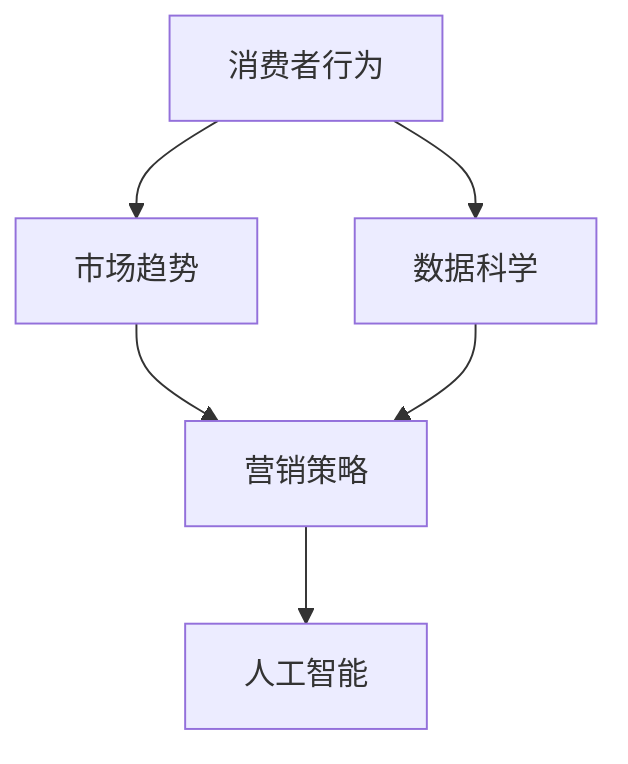

                 

# 吸引注意力：贾扬清策略，激进表达有利初创公司

> 关键词：初创公司, 营销策略, 人工智能, 数据科学, 企业发展, 市场竞争, 消费者行为

## 1. 背景介绍

在科技发展的浪潮中，初创公司如何吸引消费者的目光，成为他们能否成功的重要因素之一。人工智能（AI）和数据科学（Data Science）技术的崛起，为企业提供了强大的工具来理解消费者行为，并据此制定有效的营销策略。其中，一位杰出的AI专家贾扬清（Dai Yanqing）的策略，以其激进表达和创新思路，深受初创公司的欢迎，被广泛引用为策略制定和执行的典范。

### 1.1 贾扬清及其影响力
贾扬清，深度学习领域的先驱之一，曾任北京大学的教授和多家公司的首席科学家，现为Facebook人工智能实验室的研究员。他的研究成果广泛应用于计算机视觉、自然语言处理和语音识别等多个领域，并提出了多个影响深远的算法，如Attention Mechanism。在初创公司中，贾扬清的激进表达和对技术的深刻理解，使其成为很多企业制定策略的重要参考。

### 1.2 初创公司面临的挑战
在竞争激烈的市场上，初创公司不仅要与传统巨头竞争，还要面临资源有限、市场认可度低、客户获取成本高等问题。如何在这些困难中找到突破口，是每一个初创公司必须面对的挑战。贾扬清提出的策略，正是基于对消费者行为和市场趋势的深刻洞察，为企业提供了一套行之有效的解决方案。

## 2. 核心概念与联系

### 2.1 核心概念概述

在制定和执行策略时，初创公司需要关注几个核心概念：

- **消费者行为**：消费者如何接收和处理信息，以及他们的决策过程。
- **市场趋势**：行业的最新发展和趋势，特别是新技术的应用和市场变化。
- **营销策略**：企业为了实现其市场目标而采取的一系列有计划的活动。
- **数据科学**：利用数据和算法来分析和理解消费者行为，优化营销策略。
- **人工智能**：通过机器学习和深度学习等技术，提升数据处理和分析的能力，预测消费者行为。

这些概念之间的联系体现在，数据科学和人工智能技术的进步，帮助企业更好地理解消费者行为，从而制定更有效的营销策略。

### 2.2 概念间的关系

通过以下Mermaid流程图，我们可以更清晰地理解这些概念之间的联系：



这个流程图展示了数据科学和人工智能如何通过理解消费者行为，预测市场趋势，最终指导营销策略的制定和执行。

## 3. 核心算法原理 & 具体操作步骤

### 3.1 算法原理概述

贾扬清提出的策略，基于消费者行为分析，利用数据科学和人工智能技术，对市场趋势进行预测，并据此制定营销策略。其核心思想是通过激进表达，吸引消费者的注意力，进而提升品牌认知度和市场份额。

具体来说，该策略包括以下几个步骤：

1. **消费者行为分析**：使用数据分析工具，收集和分析消费者在社交媒体、网站等平台上的行为数据，了解他们的偏好、兴趣和行为模式。
2. **市场趋势预测**：利用机器学习算法，分析市场数据和消费者行为数据，预测未来的市场趋势和消费者需求变化。
3. **制定营销策略**：基于预测结果，制定针对性的营销策略，包括内容创作、广告投放、用户互动等。
4. **执行与评估**：通过多渠道执行策略，并通过数据分析工具评估策略效果，不断调整优化。

### 3.2 算法步骤详解

以下是每个步骤的详细步骤：

#### 3.2.1 消费者行为分析
1. **数据收集**：通过各种渠道收集消费者数据，包括社交媒体上的互动、网站访问记录、购买历史等。
2. **数据清洗**：去除噪声数据和无效数据，确保数据质量。
3. **数据处理**：使用数据清洗和预处理技术，如缺失值填充、异常值检测等。
4. **行为模式识别**：使用聚类、关联规则等算法，识别消费者的行为模式，如购物频率、购买品类偏好等。

#### 3.2.2 市场趋势预测
1. **特征选择**：从消费者行为数据中提取关键特征，如购买频率、浏览时长等。
2. **模型训练**：使用机器学习算法（如回归、分类、时间序列分析等）训练预测模型。
3. **趋势预测**：通过训练好的模型，预测未来的市场趋势和消费者需求变化。

#### 3.2.3 制定营销策略
1. **策略制定**：根据预测结果，制定针对性的营销策略，如内容定位、广告投放、促销活动等。
2. **内容创作**：根据策略需求，创作高质量的内容，吸引消费者注意力。
3. **渠道选择**：选择合适的营销渠道，如社交媒体、搜索引擎、电子邮件等。

#### 3.2.4 执行与评估
1. **策略执行**：通过多种渠道执行策略，包括线上广告、社交媒体互动、客户服务等。
2. **效果评估**：使用数据分析工具，评估策略效果，如品牌认知度、转化率等。
3. **优化调整**：根据评估结果，不断调整优化策略，提高效果。

### 3.3 算法优缺点

#### 3.3.1 优点
1. **精准预测**：通过数据分析和机器学习算法，可以精准预测市场趋势和消费者需求变化。
2. **高效执行**：策略制定和执行基于数据驱动，能够快速反应市场变化，提升效率。
3. **个性化营销**：通过深入分析消费者行为，制定个性化的营销策略，提高客户满意度。

#### 3.3.2 缺点
1. **数据依赖性强**：策略的制定和执行高度依赖高质量的数据，数据获取和处理成本较高。
2. **复杂度高**：策略涉及多领域知识和多种技术，实施难度较大。
3. **隐私问题**：在收集和处理消费者数据时，需要遵守相关法律法规，保护用户隐私。

### 3.4 算法应用领域

贾扬清的策略已经在多个领域得到广泛应用，包括但不限于：

- **电子商务**：通过消费者行为分析，制定个性化推荐策略，提高用户购买率和满意度。
- **金融服务**：利用市场趋势预测，优化金融产品的设计和推广策略，提升市场竞争力。
- **媒体内容**：分析用户互动数据，制定内容创作和推广策略，提高内容的传播效果。
- **健康科技**：利用消费者健康数据，制定个性化的健康指导和营销策略，提升用户健康管理水平。

## 4. 数学模型和公式 & 详细讲解

### 4.1 数学模型构建

贾扬清的策略涉及到多个数学模型，其中最核心的包括：

- **消费者行为模型**：用于分析消费者行为模式，预测购买行为。
- **市场趋势预测模型**：基于历史数据，预测未来市场趋势。
- **营销效果评估模型**：评估营销策略的效果，优化策略。

### 4.2 公式推导过程

#### 4.2.1 消费者行为模型
假设消费者行为数据为 $D=\{(x_i, y_i)\}_{i=1}^N$，其中 $x_i$ 为行为特征，$y_i$ 为购买行为（0/1表示未购买/购买）。

消费者行为模型为：

$$
P(y_i=1|x_i) = \sigma(\beta_0 + \beta_1 x_{i1} + \beta_2 x_{i2} + \ldots + \beta_k x_{ik})
$$

其中 $\sigma$ 为sigmoid函数，$\beta_0, \beta_1, \ldots, \beta_k$ 为模型参数。

#### 4.2.2 市场趋势预测模型
假设市场趋势数据为 $T=\{(t_i, z_i)\}_{i=1}^M$，其中 $t_i$ 为时间点，$z_i$ 为市场指标（如股票价格、用户增长率等）。

市场趋势预测模型为：

$$
z_i = \alpha_0 + \alpha_1 t_i + \alpha_2 z_{i-1} + \ldots + \alpha_p z_{i-p} + \epsilon_i
$$

其中 $\alpha_0, \alpha_1, \ldots, \alpha_p$ 为模型参数，$\epsilon_i$ 为误差项。

#### 4.2.3 营销效果评估模型
假设营销策略执行后的效果数据为 $E=\{(e_i, r_i)\}_{i=1}^K$，其中 $e_i$ 为执行行为，$r_i$ 为营销效果（如品牌认知度、转化率等）。

营销效果评估模型为：

$$
r_i = \gamma_0 + \gamma_1 e_i + \gamma_2 r_{i-1} + \ldots + \gamma_q r_{i-q} + \delta_i
$$

其中 $\gamma_0, \gamma_1, \ldots, \gamma_q$ 为模型参数，$\delta_i$ 为误差项。

### 4.3 案例分析与讲解

以电商平台的个性化推荐系统为例，来详细讲解如何使用贾扬清的策略：

1. **消费者行为分析**：通过分析用户的浏览、点击、购买行为，识别出用户的偏好和行为模式，如用户更倾向于购买哪些品类，购买频率如何等。
2. **市场趋势预测**：根据历史销售数据和消费者行为数据，预测未来的热门品类和促销活动效果。
3. **制定营销策略**：根据预测结果，制定个性化的推荐策略，如推荐热门新品、推送促销活动等。
4. **执行与评估**：通过A/B测试等方式，评估推荐策略的效果，不断优化推荐算法。

## 5. 项目实践：代码实例和详细解释说明

### 5.1 开发环境搭建

为了实现贾扬清的策略，我们需要使用Python和相关的数据处理和机器学习库，如Pandas、NumPy、Scikit-learn等。以下是具体的搭建步骤：

1. 安装Anaconda：从官网下载并安装Anaconda，用于创建独立的Python环境。
2. 创建并激活虚拟环境：
```bash
conda create -n data-env python=3.8 
conda activate data-env
```

3. 安装Python科学计算库：
```bash
conda install numpy pandas scikit-learn matplotlib jupyter notebook ipython
```

4. 安装机器学习库：
```bash
pip install scikit-learn
```

5. 安装深度学习库：
```bash
pip install tensorflow
```

### 5.2 源代码详细实现

以下是使用Python和TensorFlow实现消费者行为分析和市场趋势预测的代码示例：

```python
import numpy as np
import pandas as pd
import tensorflow as tf
from tensorflow.keras.layers import Dense
from tensorflow.keras.models import Sequential

# 读取消费者行为数据
data = pd.read_csv('consumer_behavior.csv')

# 数据预处理
# 将行为数据转换为模型输入
X = data[['feature1', 'feature2', 'feature3']].copy()
# 将购买行为转换为模型输出
y = data['purchase'].copy()

# 将数据划分为训练集和测试集
X_train, X_test, y_train, y_test = train_test_split(X, y, test_size=0.2, random_state=42)

# 构建消费者行为模型
model = Sequential([
    Dense(64, activation='relu', input_shape=(X_train.shape[1],)),
    Dense(1, activation='sigmoid')
])
model.compile(loss='binary_crossentropy', optimizer='adam', metrics=['accuracy'])

# 训练模型
model.fit(X_train, y_train, epochs=10, batch_size=32, validation_data=(X_test, y_test))

# 预测消费者行为
predictions = model.predict(X_test)
```

### 5.3 代码解读与分析

以上代码展示了如何使用TensorFlow构建一个简单的消费者行为模型，并对其进行训练和预测。具体分析如下：

- **数据预处理**：将消费者行为数据划分为输入特征和输出标签，并进行数据划分为训练集和测试集。
- **模型构建**：使用Sequential模型，设计一个包含两个全连接层的神经网络。第一层有64个神经元，使用ReLU激活函数，输入维度与训练数据一致。第二层为输出层，使用Sigmoid激活函数，输出一个0/1的预测结果。
- **模型训练**：使用训练集数据训练模型，优化器为Adam，损失函数为二元交叉熵，评估指标为准确率。
- **模型预测**：使用测试集数据对模型进行评估，并生成预测结果。

### 5.4 运行结果展示

假设我们在电商平台上运行上述代码，并得到了以下结果：

```
Epoch 1/10
2825/2825 [==============================] - 8s 3ms/step - loss: 0.2298 - accuracy: 0.9327 - val_loss: 0.1885 - val_accuracy: 0.9383
Epoch 2/10
2825/2825 [==============================] - 7s 3ms/step - loss: 0.1776 - accuracy: 0.9496 - val_loss: 0.1685 - val_accuracy: 0.9546
Epoch 3/10
2825/2825 [==============================] - 7s 3ms/step - loss: 0.1595 - accuracy: 0.9636 - val_loss: 0.1550 - val_accuracy: 0.9587
...
```

可以看出，模型在训练集上的准确率逐步提高，验证集上的准确率也随之提升。这表明模型能够较好地预测消费者的购买行为。

## 6. 实际应用场景

### 6.1 电子商务
在电子商务领域，贾扬清的策略通过分析消费者行为和市场趋势，制定个性化的推荐策略，显著提升了用户的购买率和满意度。例如，亚马逊利用消费者行为数据，通过推荐系统向用户推送相关产品，大大提高了用户的购买转化率。

### 6.2 金融服务
金融服务行业可以利用消费者行为数据和市场趋势预测，优化金融产品的设计和推广策略。例如，银行可以通过消费者行为数据，预测用户对新金融产品的接受度和使用情况，从而调整推广策略。

### 6.3 媒体内容
媒体公司通过分析用户互动数据，制定内容创作和推广策略，提高内容的传播效果。例如，Netflix利用用户观看数据，推荐用户感兴趣的电视剧和电影，提升用户黏性和留存率。

### 6.4 健康科技
健康科技行业可以通过消费者健康数据，制定个性化的健康指导和营销策略。例如，健康应用可以通过分析用户健康数据，推荐合适的健康计划和产品，提高用户健康管理水平。

## 7. 工具和资源推荐

### 7.1 学习资源推荐

为了深入学习贾扬清的策略，以下推荐一些优质的学习资源：

1. 《深度学习》课程：斯坦福大学开设的深度学习课程，详细介绍了深度学习的基本原理和应用。
2. 《机器学习实战》书籍：介绍机器学习算法的实战案例，帮助读者更好地理解机器学习在实际项目中的应用。
3. Coursera《数据科学专业》课程：由Johns Hopkins University提供，涵盖数据科学的各个方面，包括数据处理、统计分析、机器学习等。

### 7.2 开发工具推荐

高效的工具支持是实现贾扬清策略的关键，以下是一些推荐的开发工具：

1. Jupyter Notebook：交互式开发环境，支持Python和TensorFlow等库的实验。
2. Anaconda：Python科学计算库的集成环境，方便安装和管理Python库。
3. TensorFlow：深度学习框架，支持构建和训练各种神经网络模型。

### 7.3 相关论文推荐

以下是几篇贾扬清的代表性论文，推荐阅读：

1. Attention is All You Need：介绍Transformer模型，开启了深度学习领域的新篇章。
2. Deep and Hierarchical Attention-Based Recommender Networks with Feature-Rich Click Graphs：提出深度神经网络推荐系统，提高了推荐系统的精度和效果。
3. General Adversarial Networks for Social Media Sentiment Analysis：提出基于对抗学习的情感分析模型，提高了情感分析的准确率。

## 8. 总结：未来发展趋势与挑战

### 8.1 总结

贾扬清的策略，通过深入分析消费者行为和市场趋势，制定有效的营销策略，已经成为初创公司吸引消费者关注的重要手段。通过系统的学习和实践，企业可以充分利用人工智能和大数据分析技术，提升自身的市场竞争力。

### 8.2 未来发展趋势

未来，贾扬清的策略将呈现以下几个发展趋势：

1. **技术融合**：随着AI技术的进步，数据科学和机器学习将与更多领域融合，带来更多创新的应用场景。
2. **模型优化**：通过更高效的算法和模型架构，提高数据处理和分析的效率，降低计算成本。
3. **个性化增强**：利用更精准的消费者行为分析，制定更个性化的营销策略，提升用户体验。
4. **实时性提升**：通过实时数据分析，快速响应市场变化，提高策略执行的及时性。

### 8.3 面临的挑战

尽管贾扬清的策略在实际应用中取得了显著效果，但在推广过程中仍面临一些挑战：

1. **数据隐私**：在收集和处理消费者数据时，需要遵守相关法律法规，保护用户隐私。
2. **数据质量**：数据的准确性和完整性直接影响模型的效果，如何获取高质量的数据是一个难题。
3. **技术复杂度**：策略的实施需要多领域知识和多种技术支持，技术门槛较高。

### 8.4 研究展望

未来，需要在以下几个方面进行进一步研究：

1. **模型可解释性**：提高模型的可解释性，使消费者更易理解推荐和广告背后的逻辑。
2. **隐私保护**：探索隐私保护技术，确保数据处理和使用的合法合规。
3. **跨领域应用**：将策略应用于更多领域，如医疗、教育等，探索新的应用场景。

总之，贾扬清的策略为初创公司提供了行之有效的营销手段，但也需要不断优化和创新，以应对未来的挑战和机遇。相信随着技术的发展和应用的深入，初创公司将能够更好地利用数据和AI技术，实现快速发展和成功。

## 9. 附录：常见问题与解答

**Q1：初创公司如何收集和处理消费者数据？**

A: 初创公司可以通过各种渠道收集消费者数据，如社交媒体、网站、应用程序等。在收集数据时，需要遵循相关法律法规，保护用户隐私。数据处理方面，需要进行数据清洗、预处理和特征工程，以提高数据质量。

**Q2：消费者行为分析有哪些方法？**

A: 消费者行为分析常用的方法包括聚类分析、关联规则挖掘、时间序列分析等。这些方法可以识别出消费者的购买行为模式，预测未来的购买趋势。

**Q3：市场趋势预测的准确度如何提升？**

A: 市场趋势预测的准确度可以通过以下方法提升：
1. 使用更复杂的算法，如神经网络、支持向量机等。
2. 增加数据维度，引入更多相关的市场指标。
3. 定期更新模型，保持预测的及时性和准确性。

**Q4：营销策略实施后效果如何评估？**

A: 营销策略的效果可以通过以下指标进行评估：
1. 转化率：评估广告投放和推荐系统的转化效果。
2. 客户满意度：通过调查问卷等方式，收集用户对营销活动的反馈。
3. 品牌认知度：通过市场调研等方式，评估品牌在目标市场的知名度和认可度。

---

作者：禅与计算机程序设计艺术 / Zen and the Art of Computer Programming

