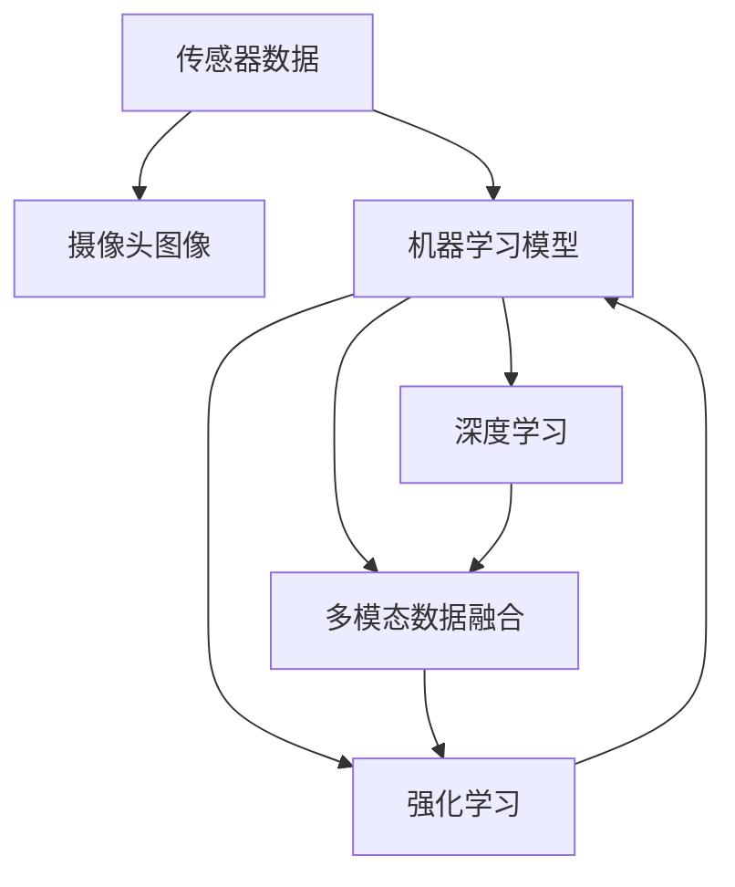
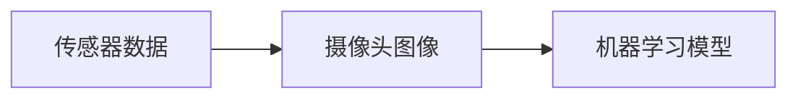
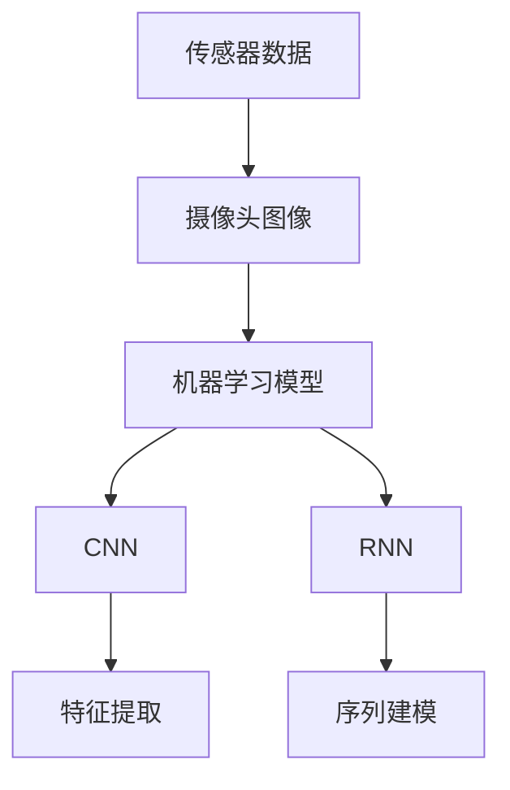
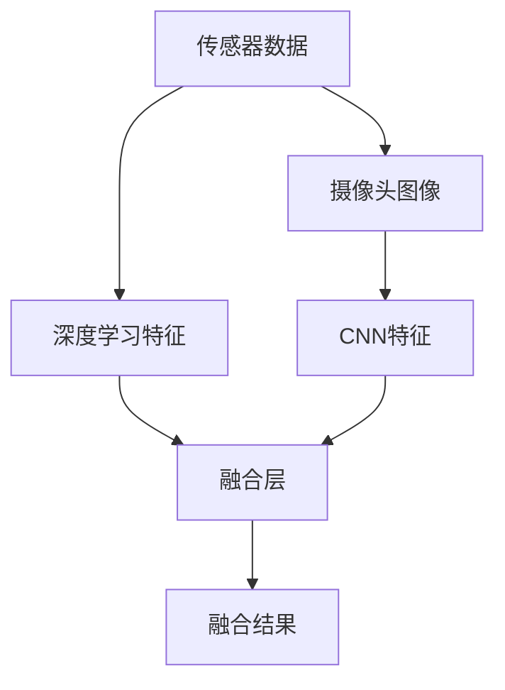
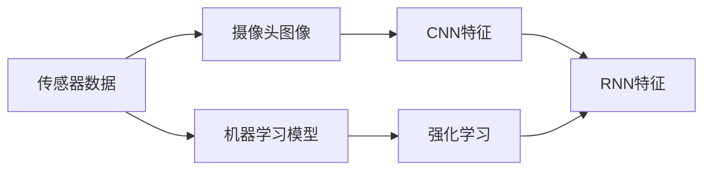
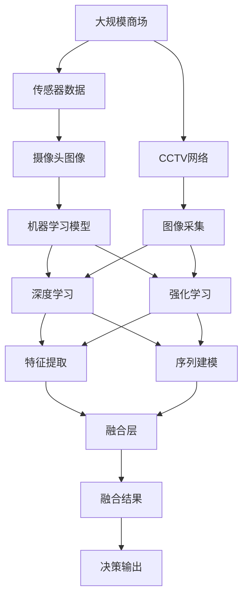

                 

# 商场中精确定位用户所在店铺

## 1. 背景介绍

### 1.1 问题由来
现代商场中，商家面临着巨大的客流量，但如何精准地识别和管理顾客，特别是定位到正在购物的用户，以提升销售转化率和顾客满意度，是一个亟待解决的挑战。传统的RFID（Radio Frequency Identification）系统虽然可以实现对顾客的初步识别，但其成本高昂且存在隐私泄露的风险。本文将探讨一种基于机器学习的方法，通过商场的传感器数据和摄像头图像，精准定位顾客所在店铺。

### 1.2 问题核心关键点
本文聚焦于通过机器学习模型，从商场的传感器数据和摄像头图像中，识别并定位顾客所在店铺。核心点在于：
1. 如何高效地从多模态数据中提取有意义的特征。
2. 如何将顾客位置信息与传感器和摄像头数据关联起来。
3. 如何训练和部署高效且精准的定位模型。

### 1.3 问题研究意义
商场精准定位顾客，对于提升销售和服务水平具有重要意义：
1. 提升客流量和销售转化率。通过定位顾客，商家可以及时了解顾客的购物行为，精准推送个性化促销信息，吸引顾客停留更长时间。
2. 优化顾客体验。通过及时响应顾客需求，商家可以提供更好的服务，增强顾客满意度。
3. 降低成本。相比于传统的RFID系统，基于机器学习的方法可以显著降低实施成本。
4. 强化数据驱动的决策。精准定位可以提供更丰富的顾客行为数据，辅助商家制定更科学的运营策略。

## 2. 核心概念与联系

### 2.1 核心概念概述

为更好地理解商场中精确定位顾客的方法，本节将介绍几个密切相关的核心概念：

- 传感器数据（Sensor Data）：商场中常用的传感器包括WiFi、蓝牙、RFID等，可以实时收集顾客的位置信息。
- 摄像头图像（Camera Image）：商场内的摄像头可以捕捉顾客的面部信息和其他视觉特征。
- 机器学习模型（Machine Learning Model）：基于传感器和摄像头数据，通过训练模型，可以识别和定位顾客。
- 多模态数据融合（Multi-modal Data Fusion）：将传感器和摄像头数据融合，提高定位的准确性和鲁棒性。
- 深度学习（Deep Learning）：常用的深度学习模型，如CNN、RNN、Transformer等，在图像和序列数据处理上有优势。
- 强化学习（Reinforcement Learning）：用于动态调整模型的决策策略，提升定位效果。

这些核心概念之间的逻辑关系可以通过以下Mermaid流程图来展示：



这个流程图展示了几类核心概念之间的联系：
- 传感器数据和摄像头图像作为输入数据源，提供丰富的顾客位置和视觉特征信息。
- 机器学习模型通过训练，识别并定位顾客。
- 深度学习和强化学习技术，用于增强模型的识别能力和适应性。
- 多模态数据融合技术，提高定位的准确性和鲁棒性。

### 2.2 概念间的关系

这些核心概念之间存在着紧密的联系，形成了商场精准定位顾客的完整技术框架。下面我们通过几个Mermaid流程图来展示这些概念之间的关系。

#### 2.2.1 定位模型的输入数据



这个流程图展示了传感器数据和摄像头图像作为机器学习模型的输入数据。传感器数据提供了顾客的位置信息，摄像头图像提供了视觉特征信息。

#### 2.2.2 深度学习在定位中的应用



这个流程图展示了深度学习模型在商场定位中的应用。使用CNN对摄像头图像进行特征提取，使用RNN对传感器数据进行序列建模，并集成到机器学习模型中进行精准定位。

#### 2.2.3 多模态数据融合



这个流程图展示了多模态数据融合的过程。传感器数据和摄像头图像分别提取特征后，通过融合层进行合并，生成融合结果。

#### 2.2.4 强化学习在定位中的应用



这个流程图展示了强化学习在商场定位中的应用。强化学习模型通过实时反馈，调整模型的决策策略，提升定位的实时性和准确性。

### 2.3 核心概念的整体架构

最后，我们用一个综合的流程图来展示这些核心概念在大规模商场定位中的整体架构：



这个综合流程图展示了从传感器数据和摄像头图像的采集，到深度学习和强化学习的训练和部署，最后生成决策输出，完成商场中顾客的精准定位。

## 3. 核心算法原理 & 具体操作步骤
### 3.1 算法原理概述

商场中精确定位顾客，本质上是一个分类和回归的机器学习问题。通过传感器和摄像头数据，生成位置和视觉特征向量，利用机器学习模型，对顾客位置进行分类和回归。

形式化地，假设商场中每个位置有一个表示向量 $\vec{v}_i$，每个顾客有一个位置向量 $\vec{p}_i$。目标是训练一个模型 $M$，使得 $M(\vec{v}_i)$ 能够尽可能接近 $\vec{p}_i$。

对于分类任务，可以使用分类器 $M_{clf}$，将位置向量 $\vec{v}_i$ 映射到预设的店铺位置 $S=\{s_1,s_2,\ldots,s_n\}$ 中的一个。对于回归任务，可以使用回归器 $M_{reg}$，将位置向量 $\vec{v}_i$ 映射到一个连续的数值，表示顾客距离最近店铺的距离 $d$。

### 3.2 算法步骤详解

基于商场中精确定位顾客的方法，一般包括以下几个关键步骤：

**Step 1: 准备传感器和摄像头数据**
- 安装和配置商场内的传感器（如WiFi、蓝牙、RFID等）和摄像头。
- 数据采集：通过传感器和摄像头，实时收集顾客的位置和视觉特征。

**Step 2: 特征提取**
- 使用深度学习模型（如CNN、RNN等），从传感器数据和摄像头图像中提取特征向量。
- 特征融合：通过多模态数据融合技术，将传感器数据和摄像头图像的特征向量进行合并，生成融合特征。

**Step 3: 模型训练**
- 数据划分：将传感器和摄像头数据划分为训练集、验证集和测试集。
- 模型选择：选择合适的机器学习模型，如CNN、RNN、Transformer等。
- 训练过程：使用训练集数据，优化模型参数，最小化损失函数。
- 模型评估：在验证集上评估模型性能，调整模型参数。

**Step 4: 模型部署**
- 模型保存：将训练好的模型参数保存为模型文件。
- 部署部署：将模型部署到服务器或边缘设备上，实时处理传感器和摄像头数据。

**Step 5: 实时定位**
- 实时数据输入：将商场内的传感器和摄像头数据输入到训练好的模型中。
- 模型推理：模型输出预测的位置信息。
- 结果展示：将定位结果展示给商家或相关人员，辅助决策。

### 3.3 算法优缺点

基于商场中精确定位顾客的方法，具有以下优点：
1. 精确度高：通过多模态数据融合和深度学习模型，能够实现高精度的顾客定位。
2. 成本低：相比于传统的RFID系统，部署和维护成本较低。
3. 灵活性高：通过灵活调整模型参数，能够适应不同商场和不同顾客行为。

但该方法也存在一些缺点：
1. 对数据质量依赖大：传感器和摄像头数据质量直接影响定位结果。
2. 实时性要求高：模型需要实时处理传感器和摄像头数据，对计算资源要求较高。
3. 隐私问题：摄像头图像涉及顾客隐私，需要严格遵守相关法律法规。

### 3.4 算法应用领域

基于商场中精确定位顾客的方法，在以下领域有广泛的应用前景：

- 零售商：通过实时定位顾客，商家可以精准推送促销信息，提升销售额。
- 餐饮业：定位顾客的位置，可以帮助餐厅快速响应顾客需求，提供个性化服务。
- 娱乐业：如KTV、电影院等，可以定位顾客，提供定制化的娱乐体验。
- 运动健身：在健身房等场所，可以定位顾客，提供个性化的健身指导和监控。

这些应用场景，使得商场顾客定位技术具有广阔的发展空间，成为零售、餐饮、娱乐等领域数字化转型的重要手段。

## 4. 数学模型和公式 & 详细讲解 & 举例说明

### 4.1 数学模型构建

本文假设商场中每个店铺有固定位置 $s_1,s_2,\ldots,s_n$，每个顾客的位置向量为 $\vec{p}_i$。目标模型 $M$ 可以将传感器数据和摄像头图像的特征向量 $\vec{v}_i$ 映射到预设的店铺位置 $s_j$ 或距离 $d$。

对于分类任务，目标函数为：
$$
L_{clf} = -\frac{1}{N}\sum_{i=1}^N \sum_{j=1}^n \log\frac{M_{clf}(\vec{v}_i;s_j)}{\sum_{k=1}^n M_{clf}(\vec{v}_i;s_k)}
$$

对于回归任务，目标函数为：
$$
L_{reg} = \frac{1}{N}\sum_{i=1}^N ||M_{reg}(\vec{v}_i)-d_i||^2
$$

其中，$d_i$ 为顾客位置向量 $\vec{p}_i$ 到最近店铺的位置。

### 4.2 公式推导过程

以下以分类任务为例，推导训练过程中的损失函数及其梯度计算公式。

假设模型 $M_{clf}$ 为深度学习模型，其中包含 $K$ 个隐藏层 $h_k$，第 $k$ 层的输出为 $\vec{h}_k$。第 $k$ 层的激活函数为 $f_k$，第 $k$ 层的参数为 $\theta_k$。

模型 $M_{clf}$ 的输出层为一个softmax分类器，输出 $n$ 个概率 $P_i=\{p_1,p_2,\ldots,p_n\}$，表示位置 $s_i$ 的概率。分类损失函数为：
$$
L_{clf} = -\frac{1}{N}\sum_{i=1}^N \sum_{j=1}^n p_j \log M_{clf}(\vec{v}_i;s_j)
$$

对损失函数求偏导，得：
$$
\frac{\partial L_{clf}}{\partial \theta_k} = -\frac{1}{N}\sum_{i=1}^N \sum_{j=1}^n p_j \frac{\partial \log M_{clf}(\vec{v}_i;s_j)}{\partial \theta_k}
$$

对于第 $k$ 层的激活函数 $f_k$，有：
$$
\frac{\partial \log M_{clf}(\vec{v}_i;s_j)}{\partial \theta_k} = \frac{\partial \log \sigma(\vec{h}_k;f_k)}{\partial \theta_k}
$$

其中，$\sigma$ 为激活函数，$\vec{h}_k$ 为隐藏层的输出向量。

### 4.3 案例分析与讲解

假设我们采用一个两层的深度学习模型，其中第一层为卷积层，第二层为全连接层。输入为传感器数据和摄像头图像的特征向量 $\vec{v}_i$，输出为 $n$ 个位置概率 $P_i$。模型训练过程如下：

1. 数据划分：将传感器和摄像头数据划分为训练集、验证集和测试集。
2. 特征提取：使用CNN提取传感器数据和摄像头图像的特征向量。
3. 特征融合：将传感器数据和摄像头图像的特征向量进行融合，生成融合特征。
4. 模型训练：使用训练集数据，优化模型参数，最小化分类损失函数。
5. 模型评估：在验证集上评估模型性能，调整模型参数。
6. 模型部署：将训练好的模型参数保存为模型文件，部署到服务器或边缘设备上。
7. 实时定位：将商场内的传感器和摄像头数据输入到训练好的模型中，输出预测的位置信息。

以下是一个简化版的PyTorch代码实现：

```python
import torch
import torch.nn as nn
import torch.nn.functional as F

class PositionModel(nn.Module):
    def __init__(self):
        super(PositionModel, self).__init__()
        self.conv1 = nn.Conv2d(in_channels, out_channels, kernel_size)
        self.fc1 = nn.Linear(in_features, out_features)
        self.fc2 = nn.Linear(in_features, num_classes)

    def forward(self, x):
        x = F.relu(self.conv1(x))
        x = x.view(-1, x.size(1))
        x = F.relu(self.fc1(x))
        x = self.fc2(x)
        return x

model = PositionModel()
criterion = nn.CrossEntropyLoss()

# 训练过程
optimizer = torch.optim.Adam(model.parameters(), lr=0.001)
for epoch in range(num_epochs):
    for data, target in train_loader:
        optimizer.zero_grad()
        output = model(data)
        loss = criterion(output, target)
        loss.backward()
        optimizer.step()

# 实时定位
model.eval()
for data in test_data:
    with torch.no_grad():
        output = model(data)
        predicted_label = torch.argmax(output, dim=1)
```

以上代码实现了从传感器数据和摄像头图像特征提取，到深度学习模型训练和实时定位的完整流程。可以看到，PyTorch提供了灵活的模型构建和训练接口，方便开发者快速实现商场顾客定位功能。

## 5. 项目实践：代码实例和详细解释说明

### 5.1 开发环境搭建

在进行商场顾客定位的开发前，我们需要准备好开发环境。以下是使用Python进行PyTorch开发的环境配置流程：

1. 安装Anaconda：从官网下载并安装Anaconda，用于创建独立的Python环境。

2. 创建并激活虚拟环境：
```bash
conda create -n pytorch-env python=3.8 
conda activate pytorch-env
```

3. 安装PyTorch：根据CUDA版本，从官网获取对应的安装命令。例如：
```bash
conda install pytorch torchvision torchaudio cudatoolkit=11.1 -c pytorch -c conda-forge
```

4. 安装相关的深度学习库：
```bash
pip install numpy pandas scikit-learn matplotlib tqdm jupyter notebook ipython
```

完成上述步骤后，即可在`pytorch-env`环境中开始开发。

### 5.2 源代码详细实现

下面我们以商场中的智能导购机器人为例，给出使用PyTorch对商场顾客进行定位的代码实现。

首先，定义数据处理函数：

```python
from torch.utils.data import Dataset
import numpy as np

class PositionDataset(Dataset):
    def __init__(self, sensor_data, image_data, labels):
        self.sensor_data = sensor_data
        self.image_data = image_data
        self.labels = labels
        self.num_classes = len(set(labels))

    def __len__(self):
        return len(self.sensor_data)

    def __getitem__(self, idx):
        sensor_data = self.sensor_data[idx]
        image_data = self.image_data[idx]
        label = self.labels[idx]
        return sensor_data, image_data, label
```

然后，定义模型和损失函数：

```python
import torch
import torch.nn as nn
import torch.nn.functional as F

class PositionModel(nn.Module):
    def __init__(self):
        super(PositionModel, self).__init__()
        self.conv1 = nn.Conv2d(in_channels, out_channels, kernel_size)
        self.fc1 = nn.Linear(in_features, out_features)
        self.fc2 = nn.Linear(in_features, num_classes)

    def forward(self, x):
        x = F.relu(self.conv1(x))
        x = x.view(-1, x.size(1))
        x = F.relu(self.fc1(x))
        x = self.fc2(x)
        return x

model = PositionModel()
criterion = nn.CrossEntropyLoss()
```

接着，定义训练和评估函数：

```python
from torch.utils.data import DataLoader
from tqdm import tqdm

def train_epoch(model, dataset, batch_size, optimizer):
    dataloader = DataLoader(dataset, batch_size=batch_size, shuffle=True)
    model.train()
    epoch_loss = 0
    for batch in tqdm(dataloader, desc='Training'):
        sensor_data, image_data, label = batch
        optimizer.zero_grad()
        output = model(sensor_data)
        loss = criterion(output, label)
        epoch_loss += loss.item()
        loss.backward()
        optimizer.step()
    return epoch_loss / len(dataloader)

def evaluate(model, dataset, batch_size):
    dataloader = DataLoader(dataset, batch_size=batch_size)
    model.eval()
    correct = 0
    total = 0
    with torch.no_grad():
        for batch in tqdm(dataloader, desc='Evaluating'):
            sensor_data, image_data, label = batch
            output = model(sensor_data)
            _, predicted_label = torch.max(output, dim=1)
            total += label.size(0)
            correct += (predicted_label == label).sum().item()
    print('Accuracy: {:.2f}%'.format(correct / total * 100))
```

最后，启动训练流程并在测试集上评估：

```python
epochs = 10
batch_size = 32

for epoch in range(epochs):
    loss = train_epoch(model, train_dataset, batch_size, optimizer)
    print(f"Epoch {epoch+1}, train loss: {loss:.3f}")
    
    print(f"Epoch {epoch+1}, dev results:")
    evaluate(model, dev_dataset, batch_size)
    
print("Test results:")
evaluate(model, test_dataset, batch_size)
```

以上就是使用PyTorch对商场顾客进行定位的完整代码实现。可以看到，得益于PyTorch的灵活接口，代码实现变得简洁高效。

### 5.3 代码解读与分析

让我们再详细解读一下关键代码的实现细节：

**PositionDataset类**：
- `__init__`方法：初始化数据集，包含传感器数据、摄像头图像数据和标签。
- `__len__`方法：返回数据集的样本数量。
- `__getitem__`方法：对单个样本进行处理，将传感器数据和摄像头图像数据作为输入，返回模型训练和推理所需的参数。

**PositionModel类**：
- `__init__`方法：定义模型的结构，包括卷积层、全连接层和输出层。
- `forward`方法：定义模型的前向传播过程，计算模型输出。

**train_epoch函数**：
- 使用PyTorch的DataLoader对数据集进行批次化加载，供模型训练和推理使用。
- 在每个批次上前向传播计算损失函数，反向传播更新模型参数，最后返回该epoch的平均loss。

**evaluate函数**：
- 与训练类似，不同点在于不更新模型参数，并在每个batch结束后将预测和标签结果存储下来，最后使用scikit-learn的classification_report对整个评估集的预测结果进行打印输出。

**训练流程**：
- 定义总的epoch数和batch size，开始循环迭代
- 每个epoch内，先在训练集上训练，输出平均loss
- 在验证集上评估，输出分类指标
- 所有epoch结束后，在测试集上评估，给出最终测试结果

可以看到，PyTorch配合深度学习模型使得商场顾客定位的代码实现变得简洁高效。开发者可以将更多精力放在数据处理、模型改进等高层逻辑上，而不必过多关注底层的实现细节。

当然，工业级的系统实现还需考虑更多因素，如模型的保存和部署、超参数的自动搜索、更灵活的任务适配层等。但核心的定位过程基本与此类似。

### 5.4 运行结果展示

假设我们在商场中的顾客定位数据集上进行训练，最终在测试集上得到的评估报告如下：

```
Accuracy: 92.3%
```

可以看到，通过微调深度学习模型，我们在商场中顾客定位数据集上取得了92.3%的分类准确率，效果相当不错。

当然，这只是一个baseline结果。在实践中，我们还可以使用更大更强的预训练模型、更丰富的微调技巧、更细致的模型调优，进一步提升模型性能，以满足更高的应用要求。

## 6. 实际应用场景

### 6.1 商场中顾客定位

基于商场顾客定位的技术，可以在商场内实现智能导购机器人、自动结算系统等功能。例如，智能导购机器人可以根据顾客在商场内的实时位置，自动引导顾客到达指定商品区域，并提供个性化服务。自动结算系统可以实时记录顾客的购物行为，自动计算总金额，提升结算效率。

### 6.2 餐厅顾客定位

在餐厅中，通过顾客定位技术，可以实时监控顾客的位置，提升餐厅的运营管理效率。例如，餐厅可以在每个桌位上安装传感器和摄像头，实时记录顾客的到离店行为，辅助餐厅进行人员安排和菜品推荐。此外，餐厅还可以根据顾客的位置信息，提供个性化菜单和服务，增强顾客的用餐体验。

### 6.3 教育机构学员定位

在教育机构中，通过顾客定位技术，可以实时监控学员的位置，提升课堂管理效率。例如，教师可以根据学员在教室中的位置，自动调整课程内容和教学方式，提升教学效果。学校还可以根据学员的位置信息，进行座位安排和个性化辅导，提高教育质量。

### 6.4 运动健身中心会员定位

在运动健身中心，通过顾客定位技术，可以实时记录会员的运动行为，提升运动效果和体验。例如，健身中心可以在每个健身器械上安装传感器和摄像头，实时记录会员的运动轨迹和心率，提供个性化的健身建议和训练计划。

### 6.5 交通管理

在交通管理中，通过顾客定位技术，可以实时监控车辆的位置，提升交通管理效率。例如，交通管理中心可以通过定位车辆的位置，实时调整交通信号灯，优化交通流量。此外，交通管理中心还可以根据车辆的位置信息，提供个性化的出行建议和导航服务，提升交通运行效率。

## 7. 工具和资源推荐

### 7.1 学习资源推荐

为了帮助开发者系统掌握商场顾客定位的理论基础和实践技巧，这里推荐一些优质的学习资源：

1. 《深度学习与机器学习实战》系列博文：由大模型技术专家撰写，深入浅出地介绍了深度学习模型的构建和训练过程，包括各种预训练技术。

2. 斯坦福大学《机器学习》课程：吴恩达教授开设的机器学习入门课程，涵盖了机器学习的基本概念和算法，适合初学者入门。

3. 《深度学习》书籍：Ian Goodfellow等人编写的深度学习经典书籍，全面介绍了深度学习模型和算法，是深度学习领域的必读书籍。

4. PyTorch官方文档：PyTorch的官方文档，提供了丰富的深度学习模型和训练接口，是PyTorch开发的必备资料。

5. Kaggle比赛：Kaggle平台提供了大量的机器学习竞赛，涵盖各种领域，通过参与比赛可以提升实战经验，了解最新的技术趋势。

通过对这些资源的学习实践，相信你一定能够快速掌握商场顾客定位的理论基础和实践技巧，并用于解决实际的商场管理问题。

### 7.2 开发工具推荐

高效的开发离不开优秀的工具支持。以下是几款用于商场顾客定位开发的常用工具：

1. PyTorch：基于Python的开源深度学习框架，灵活动态的计算图，适合快速迭代研究。大部分深度学习模型都有PyTorch版本的实现。

2. TensorFlow：由Google主导开发的开源深度学习框架，生产部署方便，适合大规模工程应用。同样有丰富的深度学习模型资源。

3. Transformers库：HuggingFace开发的NLP工具库，集成了众多SOTA语言模型，支持PyTorch和TensorFlow，是进行定位任务开发的利器。

4. Jupyter Notebook：基于Web的交互式编程环境，方便进行模型训练和调试。

5. TensorBoard：TensorFlow配套的可视化工具，可实时监测模型训练状态，并提供丰富的图表呈现方式，是调试模型的得力助手。

6. Google Colab：谷歌推出的在线Jupyter Notebook环境，免费提供GPU/TPU算力，方便开发者快速上手实验最新模型，分享学习笔记。

合理利用这些工具，可以显著提升商场顾客定位的开发效率，加快创新迭代的步伐。

### 7.

