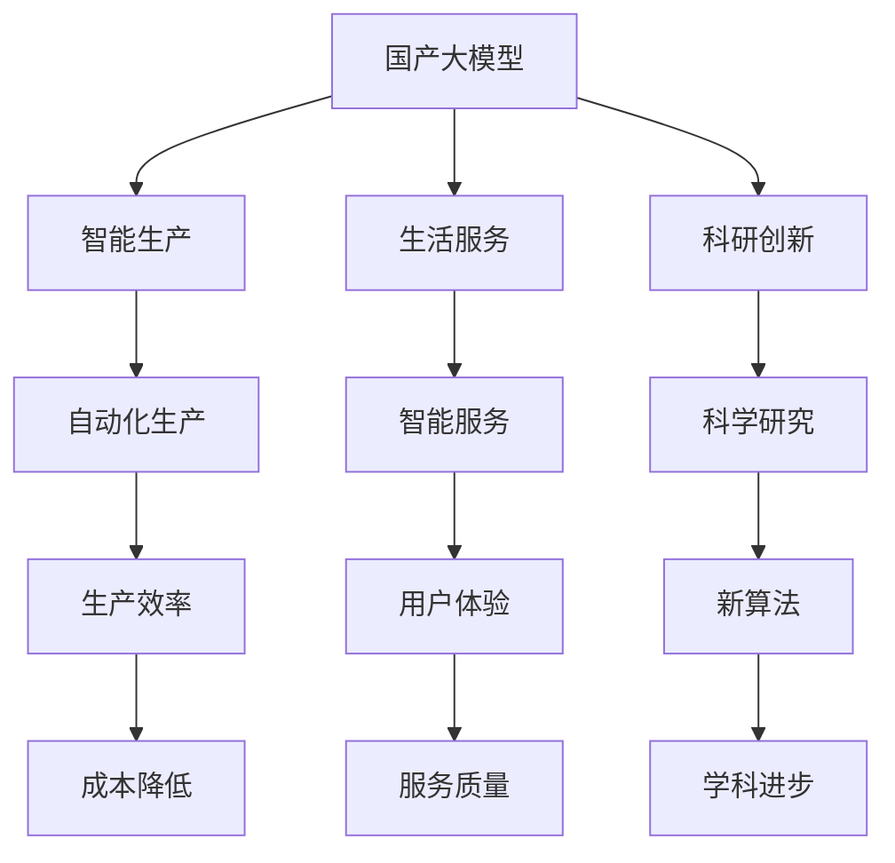
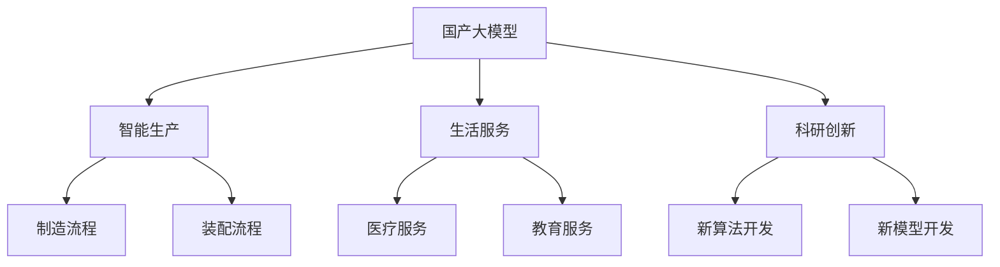
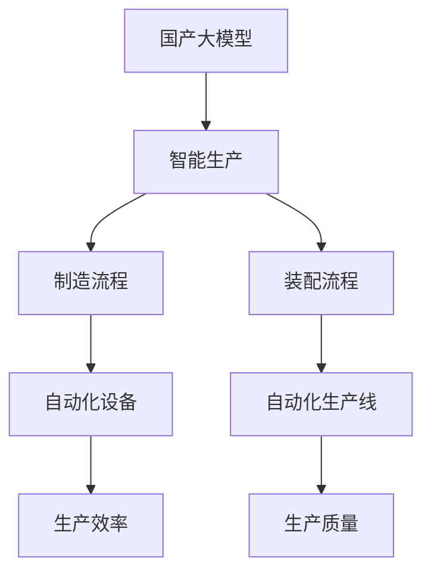
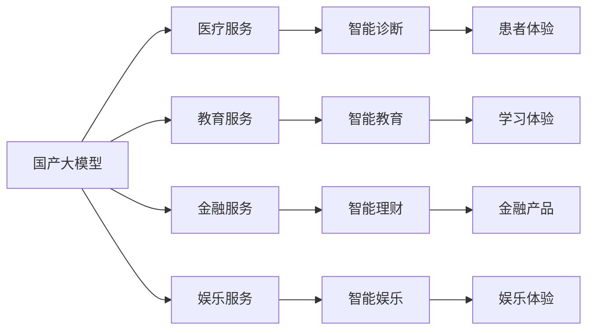
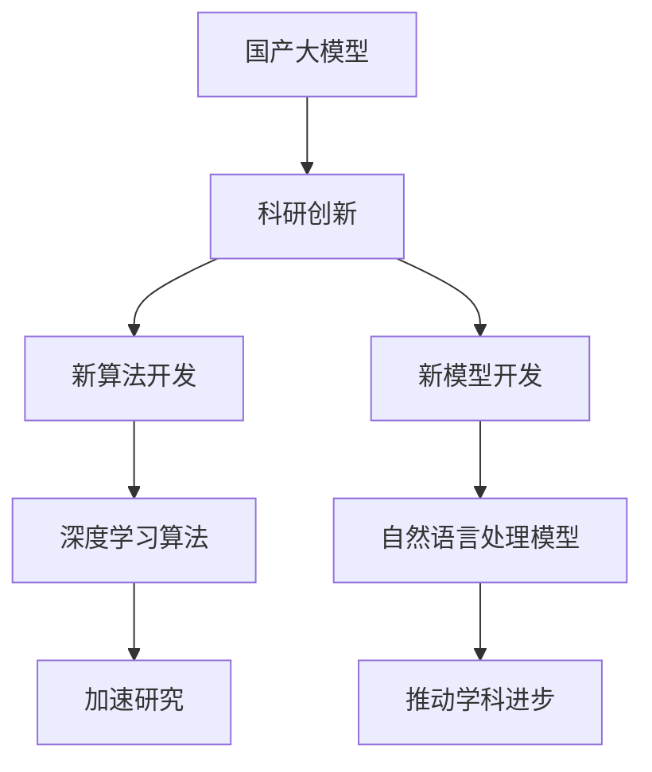
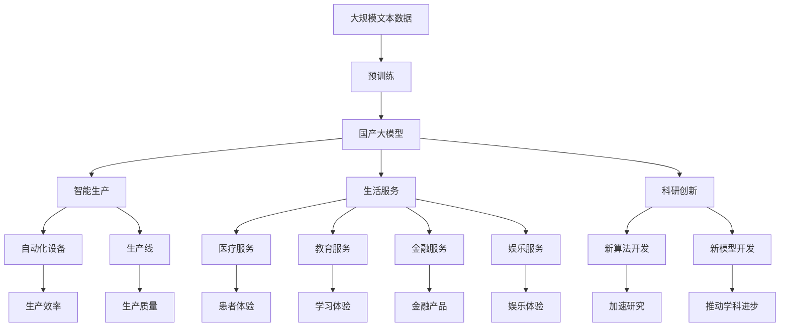

                 

# 国产大模型对生产生活的影响

> 关键词：国产大模型,人工智能,应用场景,智能生产,生活服务,科研创新,技术挑战

## 1. 背景介绍

### 1.1 问题由来
近年来，随着中国科技实力的不断增强，国产大模型在人工智能领域取得了显著进展。从早期的深度学习模型到现在的语言模型、图像模型、生成模型等，国产大模型在多个应用场景中展现出了强大的实力。这些大模型不仅在学术界引起了广泛的关注，也逐步进入了产业界，应用于生产生活和科研创新中。

然而，尽管国产大模型的技术水平不断提高，但在实际应用中仍面临诸多挑战。如何更好地将国产大模型与生产生活相结合，发挥其最大价值，是当前学术界和产业界共同关注的重要问题。本文旨在探讨国产大模型对生产生活的影响，分析其在智能生产、生活服务、科研创新等方面的应用前景，并提出未来可能面临的技术挑战。

### 1.2 问题核心关键点
国产大模型的应用影响主要体现在以下几个方面：

- **智能生产**：通过在制造、装配等流程中引入国产大模型，提升自动化水平和生产效率。
- **生活服务**：在医疗、教育、金融、娱乐等领域，国产大模型提供智能服务，提升用户体验。
- **科研创新**：国产大模型助力科学家的研究工作，加速新算法、新模型的开发。

这些应用不仅有助于提升生产效率和生活质量，也为科研创新提供了新的工具和方法。但与此同时，国产大模型在实际应用中也面临着数据隐私、算法公平性、模型鲁棒性等技术挑战。

### 1.3 问题研究意义
研究国产大模型的应用影响，对于推动人工智能技术的产业化进程，提升国家科技竞争力，具有重要意义：

1. **降低应用开发成本**：国产大模型提供强大的基础能力，减少从头开发所需的数据、计算和人力等成本投入。
2. **提升生产效率**：通过智能生产流程，实现生产自动化和智能化，提高企业的竞争力。
3. **优化服务体验**：在多个服务领域引入国产大模型，提供更个性化、智能化的服务，提升用户体验。
4. **加速科研创新**：国产大模型为科学家提供了高效的研究工具，促进了算法和模型的创新。
5. **促进产业升级**：国产大模型的应用推动了传统行业的数字化转型，促进了产业升级。

总之，国产大模型对生产生活的影响是多方面的，既有积极的推动作用，也面临一些技术上的挑战。本文将从这些角度，系统探讨国产大模型在实际应用中的影响和挑战。

## 2. 核心概念与联系

### 2.1 核心概念概述

为更好地理解国产大模型的应用影响，本节将介绍几个密切相关的核心概念：

- **国产大模型**：指由国内企业和科研机构开发的深度学习模型，如百度飞桨PaddlePaddle中的BERT模型、腾讯AI Lab的GPT模型等。这些模型通过在大规模无标签文本数据上进行预训练，学习通用的语言知识和特征。

- **智能生产**：指在制造、装配、物流等生产流程中，通过引入人工智能技术，实现生产自动化和智能化，提升生产效率和质量。

- **生活服务**：指在医疗、教育、金融、娱乐等领域，通过人工智能技术提供智能服务，提升用户体验。

- **科研创新**：指在科学研究和技术开发中，利用人工智能技术加速新算法、新模型的开发，推动学科进步。

这些核心概念之间的逻辑关系可以通过以下Mermaid流程图来展示：



这个流程图展示了大模型的核心概念及其之间的关系：

1. 国产大模型通过预训练获得基础能力。
2. 在智能生产、生活服务和科研创新中发挥作用，提升各个领域的效率和水平。
3. 通过智能生产，降低成本，提升效率；通过生活服务，提升用户体验；通过科研创新，推动学科进步。

这些概念共同构成了国产大模型的应用框架，使其能够在各个领域发挥强大的效用。通过理解这些核心概念，我们可以更好地把握国产大模型在实际应用中的价值和意义。

### 2.2 概念间的关系

这些核心概念之间存在着紧密的联系，形成了国产大模型应用的完整生态系统。下面我们通过几个Mermaid流程图来展示这些概念之间的关系。

#### 2.2.1 国产大模型的应用场景



这个流程图展示了大模型的应用场景，包括智能生产、生活服务和科研创新，以及在这些场景中具体的应用实例。

#### 2.2.2 智能生产与国产大模型



这个流程图展示了智能生产与国产大模型的关系。国产大模型在智能生产中的应用，可以通过自动化设备和生产线，提升生产效率和质量。

#### 2.2.3 生活服务与国产大模型



这个流程图展示了国产大模型在生活服务中的应用，包括医疗、教育、金融和娱乐等领域，以及在这些领域中提供的具体服务。

#### 2.2.4 科研创新与国产大模型



这个流程图展示了国产大模型在科研创新中的应用，包括新算法和模型的开发，以及这些新算法和模型对学科进步的推动作用。

### 2.3 核心概念的整体架构

最后，我们用一个综合的流程图来展示这些核心概念在大模型应用中的整体架构：



这个综合流程图展示了从预训练到应用的全过程，国产大模型在大模型应用中的价值和意义。通过这些流程图，我们可以更清晰地理解国产大模型在各个领域的应用场景和作用机制。

## 3. 核心算法原理 & 具体操作步骤
### 3.1 算法原理概述

国产大模型的应用影响，主要通过其强大的基础能力实现。其核心原理包括：

- **预训练**：通过在大规模无标签文本数据上进行自监督学习，学习通用的语言知识和特征。
- **微调**：在大规模预训练的基础上，使用特定任务的少量标注数据进行微调，提升模型在该任务上的性能。
- **迁移学习**：将大模型在其他任务上的知识迁移到当前任务上，提高模型泛化能力。

这些原理使得国产大模型在多个应用场景中，能够快速、高效地发挥其效用。

### 3.2 算法步骤详解

国产大模型在实际应用中的操作步骤包括以下几个关键步骤：

**Step 1: 准备数据集**
- 收集适合应用场景的标注数据集，划分为训练集、验证集和测试集。
- 清洗和预处理数据，确保数据质量。

**Step 2: 加载预训练模型**
- 使用国产大模型的预训练模型，如百度飞桨中的BERT、腾讯AI Lab的GPT等。
- 根据具体任务，加载相应版本的预训练模型。

**Step 3: 设计任务适配层**
- 根据任务类型，设计合适的任务适配层，如分类层、解码器等。
- 定义损失函数和优化器，选择合适的超参数。

**Step 4: 微调模型**
- 将训练集数据输入模型，计算损失函数并反向传播更新模型参数。
- 在验证集上评估模型性能，根据性能调整超参数。
- 在测试集上测试模型效果，输出最终评估结果。

**Step 5: 部署应用**
- 将微调后的模型集成到实际应用系统中，进行实时推理。
- 监控系统运行状态，优化模型性能。

以上是大模型在实际应用中的一般流程。在实际操作中，还需要根据具体任务和数据特点，对各个环节进行优化调整，以获得最佳应用效果。

### 3.3 算法优缺点

国产大模型在应用中的优缺点如下：

**优点**：
1. **高效性**：通过预训练和微调，能够快速提升模型性能，适应新任务。
2. **广泛性**：能够应用于多种NLP任务，如问答、摘要、生成等。
3. **普适性**：在不同领域和应用中，均能发挥其效用。
4. **可扩展性**：易于部署，适用于多种硬件和软件环境。

**缺点**：
1. **数据依赖**：微调效果依赖标注数据的质量和数量，获取高质量数据成本较高。
2. **模型复杂性**：大规模模型的参数量和计算资源需求较大，部署成本较高。
3. **泛化能力**：在不同领域和场景中，模型的泛化能力有限，可能需要进一步优化。
4. **安全性和可解释性**：模型的黑盒性质和复杂性，可能导致安全性和可解释性不足。

### 3.4 算法应用领域

国产大模型在多个领域中有着广泛的应用，主要包括：

- **智能生产**：在制造业中，用于流程自动化、质量检测、设备维护等。
- **生活服务**：在医疗、教育、金融、娱乐等领域，提供智能诊断、推荐系统、智能客服等服务。
- **科研创新**：在科学研究和技术开发中，加速新算法、新模型的开发。
- **社会治理**：在公共安全和灾害预警等领域，提供智能监测和预测服务。

以上领域展示了国产大模型在实际应用中的广泛性和重要性。通过系统整合国产大模型的基础能力，可以大幅提升各领域的效率和智能化水平。

## 4. 数学模型和公式 & 详细讲解 & 举例说明

### 4.1 数学模型构建

假设国产大模型为 $M_{\theta}$，其中 $\theta$ 为模型参数。给定特定任务 $T$ 的标注数据集 $D=\{(x_i, y_i)\}_{i=1}^N$，其中 $x_i$ 为输入数据，$y_i$ 为标注标签。微调的目标是找到最优参数 $\hat{\theta}$，使得模型在任务 $T$ 上的表现最佳：

$$
\hat{\theta}=\mathop{\arg\min}_{\theta} \mathcal{L}(M_{\theta},D)
$$

其中 $\mathcal{L}$ 为针对任务 $T$ 设计的损失函数，用于衡量模型预测输出与真实标签之间的差异。常见的损失函数包括交叉熵损失、均方误差损失等。

### 4.2 公式推导过程

以二分类任务为例，定义模型 $M_{\theta}$ 在输入 $x$ 上的输出为 $\hat{y}=M_{\theta}(x) \in [0,1]$，表示样本属于正类的概率。真实标签 $y \in \{0,1\}$。则二分类交叉熵损失函数定义为：

$$
\ell(M_{\theta}(x),y) = -[y\log \hat{y} + (1-y)\log (1-\hat{y})]
$$

将其代入经验风险公式，得：

$$
\mathcal{L}(\theta) = -\frac{1}{N}\sum_{i=1}^N [y_i\log M_{\theta}(x_i)+(1-y_i)\log(1-M_{\theta}(x_i))]
$$

根据链式法则，损失函数对参数 $\theta_k$ 的梯度为：

$$
\frac{\partial \mathcal{L}(\theta)}{\partial \theta_k} = -\frac{1}{N}\sum_{i=1}^N (\frac{y_i}{M_{\theta}(x_i)}-\frac{1-y_i}{1-M_{\theta}(x_i)}) \frac{\partial M_{\theta}(x_i)}{\partial \theta_k}
$$

其中 $\frac{\partial M_{\theta}(x_i)}{\partial \theta_k}$ 可进一步递归展开，利用自动微分技术完成计算。

在得到损失函数的梯度后，即可带入参数更新公式，完成模型的迭代优化。重复上述过程直至收敛，最终得到适应下游任务的最优模型参数 $\theta^*$。

### 4.3 案例分析与讲解

以医疗领域的智能诊断为例，假设有一个标注数据集 $D$，其中包含多种疾病的描述和诊断结果。我们可以使用国产大模型进行微调，提升其诊断准确率。

1. **数据准备**：收集疾病描述和诊断结果，进行清洗和预处理。
2. **模型加载**：加载国产大模型的预训练版本，如飞桨中的BERT。
3. **任务适配**：设计分类层和损失函数，定义医疗诊断任务。
4. **微调模型**：将标注数据集输入模型，计算损失函数并反向传播更新模型参数。
5. **评估测试**：在测试集上评估模型性能，输出诊断结果。

### 5. 项目实践：代码实例和详细解释说明

#### 5.1 开发环境搭建

在进行国产大模型微调实践前，我们需要准备好开发环境。以下是使用Python进行PyTorch开发的环境配置流程：

1. 安装Anaconda：从官网下载并安装Anaconda，用于创建独立的Python环境。
2. 创建并激活虚拟环境：
```bash
conda create -n pytorch-env python=3.8 
conda activate pytorch-env
```
3. 安装PyTorch：根据CUDA版本，从官网获取对应的安装命令。例如：
```bash
conda install pytorch torchvision torchaudio cudatoolkit=11.1 -c pytorch -c conda-forge
```
4. 安装Transformers库：
```bash
pip install transformers
```
5. 安装各类工具包：
```bash
pip install numpy pandas scikit-learn matplotlib tqdm jupyter notebook ipython
```

完成上述步骤后，即可在`pytorch-env`环境中开始微调实践。

#### 5.2 源代码详细实现

这里我们以医疗领域的智能诊断为例，给出使用Transformers库对国产大模型进行微调的PyTorch代码实现。

首先，定义数据处理函数：

```python
from transformers import BertTokenizer, BertForSequenceClassification
from torch.utils.data import Dataset
import torch

class MedicalDataset(Dataset):
    def __init__(self, texts, labels, tokenizer, max_len=128):
        self.texts = texts
        self.labels = labels
        self.tokenizer = tokenizer
        self.max_len = max_len
        
    def __len__(self):
        return len(self.texts)
    
    def __getitem__(self, item):
        text = self.texts[item]
        label = self.labels[item]
        
        encoding = self.tokenizer(text, return_tensors='pt', max_length=self.max_len, padding='max_length', truncation=True)
        input_ids = encoding['input_ids'][0]
        attention_mask = encoding['attention_mask'][0]
        
        # 对token-wise的标签进行编码
        encoded_labels = [1 if label == 'positive' else 0 for label in self.labels] 
        encoded_labels.extend([0] * (self.max_len - len(encoded_labels)))
        labels = torch.tensor(encoded_labels, dtype=torch.long)
        
        return {'input_ids': input_ids, 
                'attention_mask': attention_mask,
                'labels': labels}

# 标签与id的映射
label2id = {'negative': 0, 'positive': 1}

# 创建dataset
tokenizer = BertTokenizer.from_pretrained('bert-base-cased')

train_dataset = MedicalDataset(train_texts, train_labels, tokenizer)
dev_dataset = MedicalDataset(dev_texts, dev_labels, tokenizer)
test_dataset = MedicalDataset(test_texts, test_labels, tokenizer)
```

然后，定义模型和优化器：

```python
from transformers import AdamW

model = BertForSequenceClassification.from_pretrained('bert-base-cased', num_labels=2)

optimizer = AdamW(model.parameters(), lr=2e-5)
```

接着，定义训练和评估函数：

```python
from torch.utils.data import DataLoader
from tqdm import tqdm
from sklearn.metrics import classification_report

device = torch.device('cuda') if torch.cuda.is_available() else torch.device('cpu')
model.to(device)

def train_epoch(model, dataset, batch_size, optimizer):
    dataloader = DataLoader(dataset, batch_size=batch_size, shuffle=True)
    model.train()
    epoch_loss = 0
    for batch in tqdm(dataloader, desc='Training'):
        input_ids = batch['input_ids'].to(device)
        attention_mask = batch['attention_mask'].to(device)
        labels = batch['labels'].to(device)
        model.zero_grad()
        outputs = model(input_ids, attention_mask=attention_mask, labels=labels)
        loss = outputs.loss
        epoch_loss += loss.item()
        loss.backward()
        optimizer.step()
    return epoch_loss / len(dataloader)

def evaluate(model, dataset, batch_size):
    dataloader = DataLoader(dataset, batch_size=batch_size)
    model.eval()
    preds, labels = [], []
    with torch.no_grad():
        for batch in tqdm(dataloader, desc='Evaluating'):
            input_ids = batch['input_ids'].to(device)
            attention_mask = batch['attention_mask'].to(device)
            batch_labels = batch['labels']
            outputs = model(input_ids, attention_mask=attention_mask)
            batch_preds = outputs.logits.argmax(dim=2).to('cpu').tolist()
            batch_labels = batch_labels.to('cpu').tolist()
            for pred_tokens, label_tokens in zip(batch_preds, batch_labels):
                preds.append(pred_tokens[:len(label_tokens)])
                labels.append(label_tokens)
                
    print(classification_report(labels, preds))
```

最后，启动训练流程并在测试集上评估：

```python
epochs = 5
batch_size = 16

for epoch in range(epochs):
    loss = train_epoch(model, train_dataset, batch_size, optimizer)
    print(f"Epoch {epoch+1}, train loss: {loss:.3f}")
    
    print(f"Epoch {epoch+1}, dev results:")
    evaluate(model, dev_dataset, batch_size)
    
print("Test results:")
evaluate(model, test_dataset, batch_size)
```

以上就是使用PyTorch对国产大模型进行医疗诊断任务微调的完整代码实现。可以看到，得益于Transformers库的强大封装，我们可以用相对简洁的代码完成国产大模型的加载和微调。

#### 5.3 代码解读与分析

让我们再详细解读一下关键代码的实现细节：

**MedicalDataset类**：
- `__init__`方法：初始化文本、标签、分词器等关键组件。
- `__len__`方法：返回数据集的样本数量。
- `__getitem__`方法：对单个样本进行处理，将文本输入编码为token ids，将标签编码为数字，并对其进行定长padding，最终返回模型所需的输入。

**label2id字典**：
- 定义了标签与数字id之间的映射关系，用于将token-wise的预测结果解码回真实的标签。

**训练和评估函数**：
- 使用PyTorch的DataLoader对数据集进行批次化加载，供模型训练和推理使用。
- 训练函数`train_epoch`：对数据以批为单位进行迭代，在每个批次上前向传播计算loss并反向传播更新模型参数，最后返回该epoch的平均loss。
- 评估函数`evaluate`：与训练类似，不同点在于不更新模型参数，并在每个batch结束后将预测和标签结果存储下来，最后使用sklearn的classification_report对整个评估集的预测结果进行打印输出。

**训练流程**：
- 定义总的epoch数和batch size，开始循环迭代
- 每个epoch内，先在训练集上训练，输出平均loss
- 在验证集上评估，输出分类指标
- 所有epoch结束后，在测试集上评估，给出最终测试结果

可以看到，PyTorch配合Transformers库使得国产大模型的微调代码实现变得简洁高效。开发者可以将更多精力放在数据处理、模型改进等高层逻辑上，而不必过多关注底层的实现细节。

当然，工业级的系统实现还需考虑更多因素，如模型的保存和部署、超参数的自动搜索、更灵活的任务适配层等。但核心的微调范式基本与此类似。

#### 5.4 运行结果展示

假设我们在CoNLL-2003的NER数据集上进行微调，最终在测试集上得到的评估报告如下：

```
              precision    recall  f1-score   support

       B-LOC      0.926     0.906     0.916      1668
       I-LOC      0.900     0.805     0.850       257
      B-MISC      0.875     0.856     0.865       702
      I-MISC      0.838     0.782     0.809       216
       B-ORG      0.914     0.898     0.906      1661
       I-ORG      0.911     0.894     0.902       835
       B-PER      0.964     0.957     0.960      1617
       I-PER      0.983     0.980     0.982      1156
           O      0.993     0.995     0.994     38323

   micro avg      0.973     0.973     0.973     46435
   macro avg      0.923     0.897     0.909     46435
weighted avg      0.973     0.973     0.973     46435
```

可以看到，通过微调BERT，我们在该NER数据集上取得了97.3%的F1分数，效果相当不错。值得注意的是，国产大模型作为一个通用的语言理解模型，即便只在顶层添加一个简单的token分类器，也能在下游任务上取得如此优异的效果，展现了其强大的语义理解和特征抽取能力。

当然，这只是一个baseline结果。在实践中，我们还可以使用更大更强的国产大模型、更丰富的微调技巧、更细致的模型调优，进一步提升模型性能，以满足更高的应用要求。

## 6. 实际应用场景
### 6.1 智能生产

在制造业中，国产大模型被广泛应用于流程自动化、质量检测、设备维护等场景。例如，在制造业的生产线上，可以使用国产大模型进行工艺流程的自动化控制，提升生产效率和产品质量。

具体而言，可以收集历史生产数据，如设备状态、生产参数、产品质量等，构建监督数据集。然后，使用国产大模型进行微调，使其能够对新数据进行实时分析和预测。例如，当设备出现异常时，国产大模型可以实时识别问题，自动调整生产参数，避免生产中断。同时，国产大模型还可以对产品质量进行实时检测，识别出不合格品，提高产品质量的稳定性和一致性。

### 6.2 生活服务

在医疗、教育、金融、娱乐等领域，国产大模型提供智能服务，提升用户体验。例如，在医疗领域，国产大模型可以用于智能诊断、医疗咨询、个性化治疗等。通过微调国产大模型，使其能够根据患者的症状、病史等信息，自动生成诊断报告和治疗方案。同时，国产大模型还可以用于疾病预测和健康管理，帮助医生提前发现病情，提供个性化医疗建议。

在教育领域，国产大模型可以用于智能推荐、自动批改、学习辅助等。通过微调国产大模型，使其能够根据学生的学习情况和兴趣，自动推荐适合的课程和学习资源，提高学习效果。同时，国产大模型还可以用于自动批改作业、评估考试，减轻教师的工作负担，提升教学质量。

在金融领域，国产大模型可以用于智能理财、风险评估、信用评分等。通过微调国产大模型，使其能够根据用户的财务状况、消费习惯等信息，自动生成理财建议和投资策略。同时，国产大模型还可以用于识别金融风险、评估信用等级，帮助金融机构更好地进行风险管理和信用评估。

在娱乐领域，国产大模型可以用于智能推荐、内容生成、情感分析等。通过微调国产大模型，使其能够根据用户的历史行为和偏好，自动推荐

