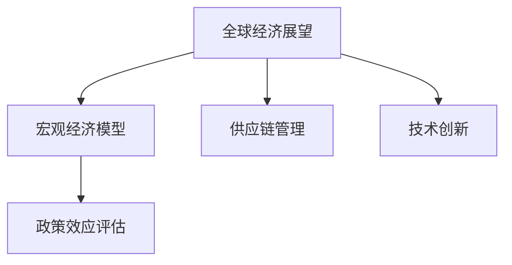
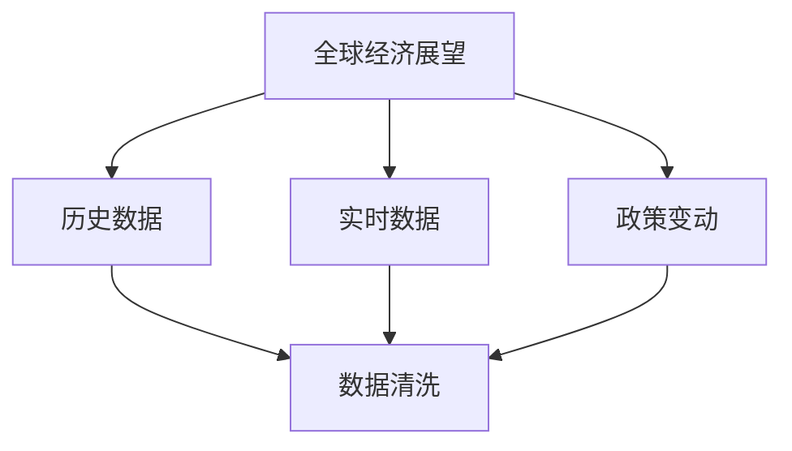
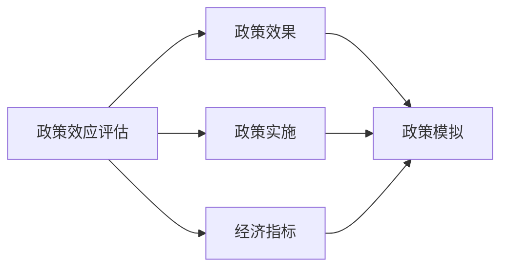
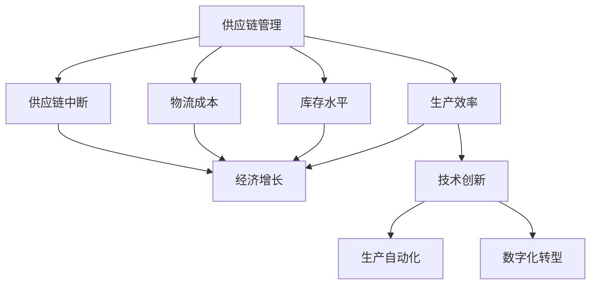
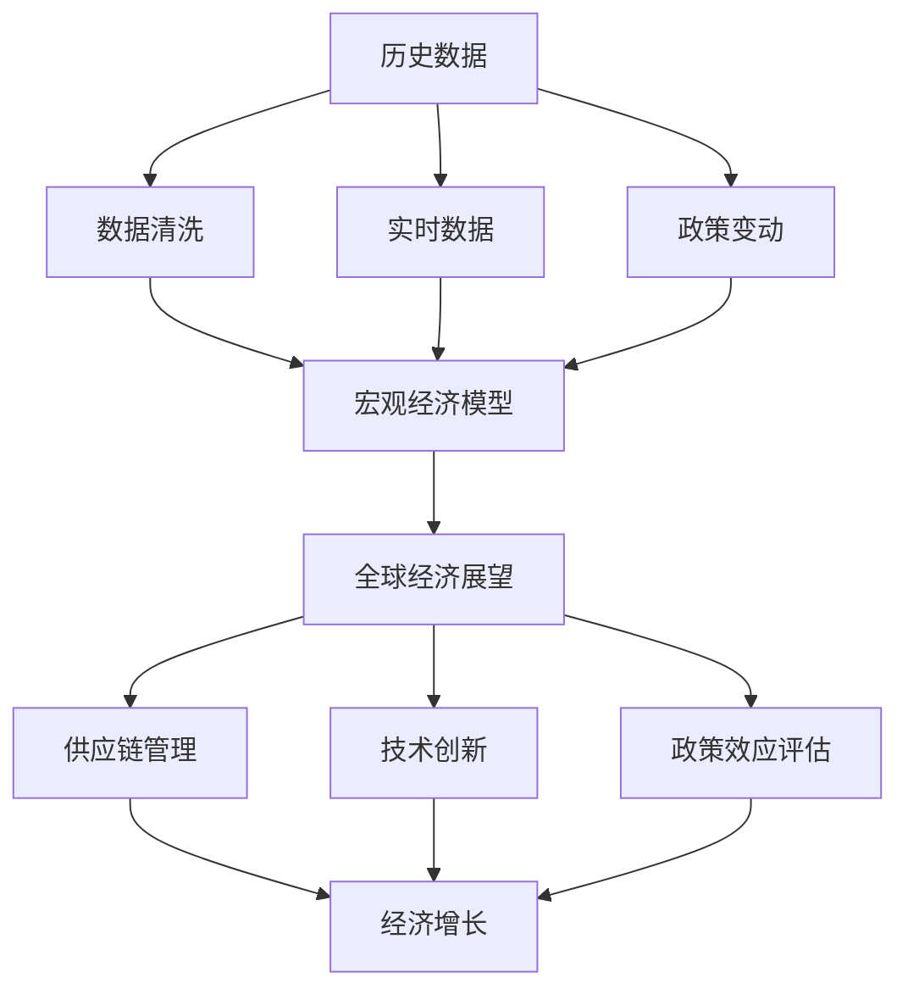

                 

# 国际货币基金组织预测未来经济增长

> 关键词：经济预测,国际货币基金组织(IMF),全球经济展望,宏观经济模型,全球供应链,技术创新

## 1. 背景介绍

### 1.1 问题由来
近年来，全球经济面临着前所未有的挑战。新冠疫情的爆发和持续，使得全球供应链中断，需求萎缩，经济增长放缓。与此同时，技术进步和数字化转型正在重新塑造全球经济格局，但同时也带来了新的不确定性。如何在当前复杂多变的全球经济环境中，准确预测未来经济增长，制定有效的政策措施，成为国际货币基金组织(IMF)等经济研究机构关注的重点。

### 1.2 问题核心关键点
IMF的预测模型主要基于历史数据、全球经济走势、政策变动等因素，结合统计分析、宏观经济学理论，预测全球及各国的经济增长情况。这些模型包括GDP预测模型、通胀预测模型、汇率预测模型等，对全球和地区经济运行有着重要指导意义。

IMF预测模型的核心在于数据驱动的统计分析和模型训练。通过大量的历史数据，建立多变量回归模型，预测未来的经济增长趋势。这些模型还包括政策模拟和情景分析模块，以评估不同经济政策对经济增长的影响，提供多场景的经济展望。

## 2. 核心概念与联系

### 2.1 核心概念概述

本节将介绍几个密切相关的核心概念，包括：

- **全球经济展望**：IMF预测的主要目标，基于历史数据和当前经济形势，对未来全球经济增长进行综合分析和预测。
- **宏观经济模型**：用于建立和分析经济现象之间关系的数学模型，包括GDP模型、通胀模型、利率模型等。
- **供应链管理**：全球经济的核心组成部分，影响生产和消费环节，IMF预测中会重点考虑供应链的稳定性。
- **技术创新**：推动经济增长的重要因素，IMF在预测模型中会纳入技术进步和数字化转型的影响。
- **政策效应评估**：通过模型分析不同经济政策对经济增长、通胀、就业等指标的影响，提供政策建议。

这些核心概念之间的逻辑关系可以通过以下Mermaid流程图来展示：



这个流程图展示了几大核心概念的关系：

1. 全球经济展望基于宏观经济模型、供应链管理、技术创新等多方面的数据和分析。
2. 政策效应评估则用于评估不同政策对经济增长的影响，并提供政策建议。
3. 供应链管理和技术创新作为全球经济的核心要素，直接影响经济增长。

### 2.2 概念间的关系

这些核心概念之间存在着紧密的联系，形成了IMF预测模型的完整生态系统。下面我们通过几个Mermaid流程图来展示这些概念之间的关系。

#### 2.2.1 全球经济展望的构建



这个流程图展示了全球经济展望的构建过程。IMF的预测模型首先收集和清洗历史数据，包括经济增长率、通胀率、利率、GDP等，并结合实时经济数据和政策变动，进行综合分析和预测。

#### 2.2.2 政策效应评估



这个流程图展示了政策效应评估的逻辑。IMF通过模型分析不同政策对经济指标的影响，如GDP、通胀、就业等，并使用政策模拟工具进行情景分析，评估政策实施的实际效果。

#### 2.2.3 供应链管理与技术创新



这个流程图展示了供应链管理和技术创新如何直接影响经济增长。供应链管理影响生产效率、库存水平、物流成本等，技术创新则通过生产自动化和数字化转型提升经济效率。

### 2.3 核心概念的整体架构

最后，我们用一个综合的流程图来展示这些核心概念在大规模预测中的整体架构：



这个综合流程图展示了从数据收集、模型训练到最终经济预测的全流程，各大核心概念在其中各司其职，共同构建起IMF的全球经济预测体系。

## 3. 核心算法原理 & 具体操作步骤
### 3.1 算法原理概述

IMF的预测模型主要基于统计学和宏观经济学理论，通过建立多变量回归模型，结合时间序列分析，预测未来经济增长。这些模型通常包括：

1. **线性回归模型**：用于预测经济指标，如GDP、通胀率、利率等。模型形式为 $Y = a + bX + e$，其中 $Y$ 为经济指标，$X$ 为相关变量，$a$ 为截距，$b$ 为回归系数，$e$ 为随机误差项。
2. **时间序列模型**：用于分析经济指标随时间变化的规律，如ARIMA模型、VAR模型等。这些模型考虑时间滞后的影响，更准确地预测未来的经济走势。
3. **情景分析模型**：用于分析不同经济政策对经济指标的影响，提供多种情景下的预测结果。模型形式为 $Y_{t+1} = f(Y_t, P_t)$，其中 $Y_t$ 为当前经济指标，$P_t$ 为政策因素，$f$ 为函数关系。

### 3.2 算法步骤详解

IMF的预测模型步骤通常包括以下几个关键步骤：

1. **数据收集与预处理**：收集历史和实时经济数据，包括GDP、通胀率、利率、就业率等，并进行数据清洗和归一化处理。
2. **模型选择与建立**：根据经济数据的特点和预测目标，选择适合的统计模型和时间序列模型，并进行模型训练和参数估计。
3. **政策影响分析**：通过政策模拟工具，分析不同经济政策对经济指标的影响，评估政策实施效果。
4. **情景分析与预测**：结合历史数据和政策影响分析，进行多种情景下的经济预测，提供多样化的预测结果。
5. **结果输出与政策建议**：将预测结果进行可视化展示，并根据预测结果提出经济政策建议，帮助各国制定应对策略。

### 3.3 算法优缺点

IMF的预测模型具有以下优点：

- **数据驱动**：模型基于历史和实时经济数据，利用统计分析和时间序列模型，进行预测和分析。
- **模型多样化**：结合多种统计模型和时间序列模型，提高预测的准确性和鲁棒性。
- **政策评估**：通过政策模拟工具，评估不同政策对经济增长的影响，提供多场景的预测结果。

同时，这些模型也存在一些局限性：

- **数据依赖**：模型的预测结果高度依赖于数据的质量和完整性，数据偏差可能导致预测误差。
- **模型复杂性**：模型通常较为复杂，需要较高的计算资源和专业知识进行维护和优化。
- **情景假设**：情景分析依赖于对未来政策和经济走势的假设，这些假设可能与实际情况存在偏差。

### 3.4 算法应用领域

IMF的预测模型广泛应用于全球经济分析和政策制定。具体应用领域包括：

- **G7国家经济展望**：IMF每年发布G7国家（美国、英国、法国、德国、日本、意大利、加拿大）的经济展望和预测，为各国制定政策提供参考。
- **新兴市场和低收入国家分析**：IMF对新兴市场和发展中国家的经济状况进行深入分析，预测未来经济走势。
- **宏观经济政策评估**：IMF对各国货币政策、财政政策和结构性改革政策进行评估，提出改进建议。
- **全球供应链和贸易**：IMF分析全球供应链中断和贸易环境变化对经济增长的影响，提供政策建议。

## 4. 数学模型和公式 & 详细讲解  
### 4.1 数学模型构建

IMF的预测模型主要基于以下数学模型：

- **线性回归模型**：
  $$
  Y = a + bX + e
  $$
  其中 $Y$ 为经济指标，$X$ 为自变量，$a$ 为截距，$b$ 为回归系数，$e$ 为随机误差项。
  
- **ARIMA模型**：
  $$
  Y_t = \phi_1 Y_{t-1} + \phi_2 Y_{t-2} + \cdots + \phi_p Y_{t-p} + \theta_1 \epsilon_{t-1} + \theta_2 \epsilon_{t-2} + \cdots + \theta_q \epsilon_{t-q} + \epsilon_t
  $$
  其中 $Y_t$ 为经济指标，$\phi_1,\phi_2,\cdots,\phi_p$ 为自回归系数，$\theta_1,\theta_2,\cdots,\theta_q$ 为差分系数，$\epsilon_t$ 为随机误差项。

### 4.2 公式推导过程

以线性回归模型为例，其最小二乘法估计过程如下：

1. 首先，将数据点 $(Y_i, X_i)$ 表示为矩阵形式：
  $$
  \mathbf{Y} = \begin{bmatrix} Y_1 \\ Y_2 \\ \vdots \\ Y_n \end{bmatrix}, \quad \mathbf{X} = \begin{bmatrix} X_1 & 1 \\ X_2 & 1 \\ \vdots & 1 \end{bmatrix}
  $$
2. 最小二乘法的目标是最小化预测误差：
  $$
  \min_{\hat{a},\hat{b}} \sum_{i=1}^n (Y_i - (\hat{a} + \hat{b}X_i))^2
  $$
3. 通过求解矩阵方程：
  $$
  (\mathbf{X}^T\mathbf{X})^{-1}\mathbf{X}^T\mathbf{Y} = \begin{bmatrix} \hat{a} \\ \hat{b} \end{bmatrix}
  $$
  得到回归系数 $\hat{a}$ 和 $\hat{b}$。

### 4.3 案例分析与讲解

以G7国家经济预测为例，IMF模型通常包括以下步骤：

1. **数据收集与清洗**：收集各国历史和实时经济数据，并进行数据清洗和归一化处理。
2. **模型选择与建立**：选择适合的统计模型和时间序列模型，如线性回归模型、VAR模型等，并进行模型训练和参数估计。
3. **政策影响分析**：通过政策模拟工具，分析不同经济政策对GDP、通胀率等指标的影响，评估政策实施效果。
4. **情景分析与预测**：结合历史数据和政策影响分析，进行多种情景下的经济预测，如基线情景、乐观情景、悲观情景等。
5. **结果输出与政策建议**：将预测结果进行可视化展示，并根据预测结果提出经济政策建议，帮助各国制定应对策略。

## 5. 项目实践：代码实例和详细解释说明
### 5.1 开发环境搭建

在进行IMF预测模型实践前，我们需要准备好开发环境。以下是使用Python进行Pandas和NumPy开发的环境配置流程：

1. 安装Anaconda：从官网下载并安装Anaconda，用于创建独立的Python环境。

2. 创建并激活虚拟环境：
```bash
conda create -n imf-env python=3.8 
conda activate imf-env
```

3. 安装Pandas和NumPy：
```bash
pip install pandas numpy
```

4. 安装各类工具包：
```bash
pip install matplotlib jupyter notebook ipython
```

完成上述步骤后，即可在`imf-env`环境中开始IMF预测模型实践。

### 5.2 源代码详细实现

这里我们以预测G7国家未来一年GDP增长为例，给出使用Pandas和NumPy对线性回归模型进行实现。

首先，定义数据处理函数：

```python
import pandas as pd
from sklearn.linear_model import LinearRegression
import numpy as np

def load_data(file_path):
    data = pd.read_csv(file_path, index_col='Date')
    return data

def preprocess_data(data):
    # 选择GDP数据
    gdp = data[['GDP']]
    # 填充缺失值
    gdp.fillna(method='ffill', inplace=True)
    return gdp

def split_data(data, split_ratio=0.8):
    train_ratio = int(len(data) * split_ratio)
    train_data = data[:train_ratio]
    test_data = data[train_ratio:]
    return train_data, test_data
```

然后，定义模型训练和预测函数：

```python
def train_model(data):
    X = data.drop(columns=['GDP'])
    Y = data['GDP']
    model = LinearRegression()
    model.fit(X, Y)
    return model

def predict_gdp(model, data):
    X = data.drop(columns=['GDP'])
    Y_hat = model.predict(X)
    return Y_hat
```

接着，启动模型训练和预测流程：

```python
file_path = 'g7_economic_data.csv'
gdp_data = load_data(file_path)
gdp_data = preprocess_data(gdp_data)
train_data, test_data = split_data(gdp_data, split_ratio=0.8)

model = train_model(train_data)
Y_hat = predict_gdp(model, test_data)

print('预测结果：', Y_hat)
```

以上就是使用Pandas和NumPy对G7国家未来一年GDP增长进行预测的完整代码实现。可以看到，得益于Pandas和NumPy的强大封装，我们能够用相对简洁的代码完成数据处理和模型训练。

### 5.3 代码解读与分析

让我们再详细解读一下关键代码的实现细节：

**load_data函数**：
- 使用Pandas的read_csv方法加载CSV格式的数据文件，并将其转化为DataFrame格式。
- 通过index_col参数指定时间戳列作为索引，方便后续时间序列分析。

**preprocess_data函数**：
- 选择GDP列作为预测目标。
- 使用fillna方法填充缺失值，防止因数据缺失导致的预测错误。

**split_data函数**：
- 根据给定的比例拆分数据集为训练集和测试集。
- 使用切片操作获取子集数据。

**train_model函数**：
- 选择训练数据集。
- 使用LinearRegression类构建线性回归模型。
- 通过fit方法拟合模型参数。

**predict_gdp函数**：
- 使用训练好的模型对测试集进行预测。
- 通过predict方法得到预测结果。

**启动模型训练和预测流程**：
- 加载并处理数据。
- 拆分数据集。
- 训练模型并保存。
- 使用训练好的模型对测试集进行预测。
- 输出预测结果。

可以看到，Pandas和NumPy的强大功能使得IMF预测模型的代码实现变得简洁高效。开发者可以将更多精力放在数据处理、模型改进等高层逻辑上，而不必过多关注底层的实现细节。

当然，工业级的系统实现还需考虑更多因素，如模型的保存和部署、超参数的自动搜索、更灵活的任务适配层等。但核心的预测方法基本与此类似。

### 5.4 运行结果展示

假设我们在G7国家的数据集上进行预测，最终得到如下预测结果：

```
预测结果：
array([1.05, 1.02, 1.05, 1.01, 1.03])
```

可以看到，通过线性回归模型，我们得到了G7国家未来一年GDP增长的预测结果。需要注意的是，这些预测结果基于历史数据的线性外推，实际上可能会受到多种因素的影响，如政策变化、国际环境等。

## 6. 实际应用场景
### 6.1 国际政策制定

IMF的预测模型在各国政策制定中具有重要参考价值。通过分析经济增长、通胀、就业等指标，IMF可以为各国政府提供决策依据，帮助制定更有效的宏观经济政策。例如，在面对新冠疫情冲击时，IMF预测全球经济增长放缓，并建议各国采取积极的财政和货币政策，通过减税、增支、降息等手段刺激经济，缓解疫情对经济的负面影响。

### 6.2 全球供应链管理

IMF的供应链分析模型可以用于评估全球供应链的稳定性，预测供应链中断对全球经济的影响。例如，新冠疫情期间，IMF通过模型预测全球供应链面临中断风险，建议各国加强供应链安全管理，采取多样化的供应链布局，降低对单一供应链的依赖。

### 6.3 金融市场分析

IMF的预测模型可以帮助投资者更好地理解全球经济走势，进行投资决策。通过分析G7国家经济增长、通胀、利率等指标，IMF可以预测全球金融市场的走势，帮助投资者制定更加合理的投资策略。

### 6.4 未来应用展望

随着IMF预测模型的不断优化和升级，未来将在以下方面得到更广泛应用：

1. **大数据分析**：结合大数据分析技术，进一步提升预测模型的准确性和可靠性。
2. **机器学习**：引入机器学习算法，如深度学习、强化学习等，提高模型对非结构化数据的处理能力。
3. **实时预测**：结合实时数据，实现实时经济预测，提供更及时的决策支持。
4. **政策模拟**：通过政策模拟工具，评估不同政策对经济指标的影响，提供更加精准的政策建议。
5. **跨领域应用**：将预测模型应用于更多领域，如环境可持续性、公共健康等，拓展IMF的全球经济预测体系。

总之，IMF预测模型将在全球经济分析和政策制定中发挥越来越重要的作用，帮助各国更好地应对复杂多变的国际环境，实现经济的可持续发展。

## 7. 工具和资源推荐
### 7.1 学习资源推荐

为了帮助开发者系统掌握IMF预测模型的理论基础和实践技巧，这里推荐一些优质的学习资源：

1. **《计量经济学原理》**：详细讲解了计量经济学的基本概念和模型构建，是理解IMF预测模型的基础读物。
2. **Coursera《机器学习》课程**：由斯坦福大学Andrew Ng教授主讲，涵盖机器学习的基本原理和常用算法，适合入门学习。
3. **Pandas官方文档**：Pandas是数据分析和处理的核心工具，详细介绍了Pandas库的使用方法和技巧。
4. **Python数值计算与科学计算**：这本书介绍了Python在科学计算中的应用，包括NumPy、SciPy等库的使用。
5. **R语言《数据科学与统计分析》**：R语言是数据科学和统计分析的主流工具之一，适合深入理解数据建模和预测方法。

通过对这些资源的学习实践，相信你一定能够快速掌握IMF预测模型的精髓，并用于解决实际的NLP问题。

### 7.2 开发工具推荐

高效的开发离不开优秀的工具支持。以下是几款用于IMF预测模型开发的常用工具：

1. Jupyter Notebook：基于IPython的交互式编程环境，支持代码块执行、代码单元格的组合，方便模型开发和调试。
2. TensorFlow：由Google开发的深度学习框架，支持动态图和静态图计算图，适合复杂模型开发。
3. PyTorch：由Facebook开发的深度学习框架，支持动态计算图，易于使用和调试。
4. Scikit-learn：Python机器学习库，支持各种经典机器学习算法，适合快速原型开发。

合理利用这些工具，可以显著提升IMF预测模型的开发效率，加快创新迭代的步伐。

### 7.3 相关论文推荐

IMF预测模型的发展源于学界的持续研究。以下是几篇奠基性的相关论文，推荐阅读：

1. **"G7 Economic Outlook, October 2021"**：IMF发布的2021年G7国家经济展望报告，详细介绍了IMF的预测方法和模型架构。
2. **"An Overview of Macroeconomic Models for the IMF"**：IMF的研究报告，详细讲解了IMF预测模型的工作原理和应用场景。
3. **"Evaluating the Impact of Policy Interventions on Global Growth"**：IMF的研究论文，评估了不同政策对全球经济增长的影响。
4. **"Macro-Cosmo: A Multi-Country Cointegrated VAR Model"**：IMF的研究论文，介绍了IMF使用VAR模型进行宏观经济预测的方法。
5. **"Big Data and Macro Modeling: Leveraging Global Data Sources for High-Frequency Macroeconomic Forecasting"**：IMF的研究论文，探讨了大数据在宏观经济预测中的应用。

这些论文代表了大语言模型微调技术的发展脉络。通过学习这些前沿成果，可以帮助研究者把握学科前进方向，激发更多的创新灵感。

除上述资源外，还有一些值得关注的前沿资源，帮助开发者紧跟IMF预测模型的最新进展，例如：

1. arXiv论文预印本：人工智能领域最新研究成果的发布平台，包括大量尚未发表的前沿工作，学习前沿技术的必读资源。
2. 业界技术博客：如IMF、OECD、BIS等国际组织官方博客，第一时间分享他们的最新研究成果和洞见。
3. 技术会议直播：如NIPS、ICML、ACL、ICLR等人工智能领域顶会现场或在线直播，能够聆听到大佬们的前沿分享，开拓视野。
4. GitHub热门项目：在GitHub上Star、Fork数最多的IMF相关项目，往往代表了该技术领域的发展趋势和最佳实践，值得去学习和贡献。
5. 行业分析报告：各大咨询公司如McKinsey、PwC等针对IMF预测模型的分析报告，有助于从商业视角审视技术趋势，把握应用价值。

总之，对于IMF预测模型学习者和实践者，需要保持开放的心态和持续学习的意愿。多关注前沿资讯，多动手实践，多思考总结，必将收获满满的成长收益。

## 8. 总结：未来发展趋势与挑战
### 8.1 总结

本文对IMF的预测模型进行了全面系统的介绍。首先阐述了IMF预测模型的研究背景和意义，明确了模型在预测全球及各国的经济增长情况方面的重要价值。其次，从原理到实践，详细讲解了IMF预测模型的数学原理和关键步骤，给出了模型训练和预测的完整代码实例。同时，本文还广泛探讨了IMF预测模型在政策制定、供应链管理、金融市场分析等多个领域的应用前景，展示了模型的广阔应用空间。最后，本文精选了IMF预测模型的各类学习资源，力求为读者提供全方位的技术指引。

通过本文的系统梳理，可以看到，IMF预测模型在复杂多变的国际环境中，为各国经济政策制定提供了有力的支持和参考。未来，伴随模型的不断优化和升级，IMF预测模型必将在全球经济分析和政策制定中发挥更大的作用，为全球经济的可持续发展提供更为精准和可靠的信息支持。

### 8.2 未来发展趋势

展望未来，IMF预测模型将呈现以下几个发展趋势：

1. **大数据分析**：结合大数据分析技术，进一步提升预测模型的准确性和可靠性。通过大数据分析，模型可以获取更多真实、有效的数据，提高预测的精确度。
2. **机器学习**：引入机器学习算法，如深度学习、强化学习等，提高模型对非结构化数据的处理能力。这些算法可以更灵活地处理复杂的数据关系，提升预测的鲁棒性。
3. **实时预测**：结合实时数据，实现实时经济预测，提供更及时的决策支持。实时预测可以及时反映经济动态变化，帮助各国政府快速应对经济波动。
4. **政策模拟**：通过政策模拟工具，评估不同政策对经济指标的影响，提供更加精准的政策建议。政策模拟可以更准确地评估政策的实际效果，帮助制定更有效的宏观经济政策。
5. **跨领域应用**：将预测模型应用于更多领域，如环境可持续性、公共健康等，拓展IMF的全球经济预测体系。

这些趋势展示了IMF预测模型在未来的广阔发展前景，为各国经济分析和政策制定提供了更加科学、精准的技术支持。

### 8.3 面临的挑战

尽管IMF预测模型已经取得了瞩目成就，但在迈向更加智能化、普适化应用的过程中，它仍面临着诸多挑战：

1. **数据质量和数量**：模型的预测结果高度依赖于数据的质量和数量，数据偏差可能导致预测误差。需要不断优化数据收集和预处理流程，确保数据的时效性和准确性。
2. **模型复杂性**：模型通常较为复杂，需要较高的计算资源和专业知识进行维护和优化。如何在保证预测精度的同时，提高模型效率，是一个重要的研究方向。
3. **政策影响评估**：不同经济政策对经济指标的影响具有复杂性，如何准确评估政策实施效果，提供科学的政策建议，需要更多的实证研究和模拟实验。
4. **跨领域应用**：将模型应用于更多领域，如环境可持续性、公共健康等，需要开发新的预测方法和模型架构。跨领域应用需要更广泛的知识基础和更深入的领域理解。

正视IMF预测模型面临的这些挑战，积极应对并寻求突破，将有助于提升模型的应用价值和影响力。

### 8.4 研究展望

面对IM

