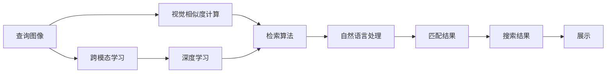
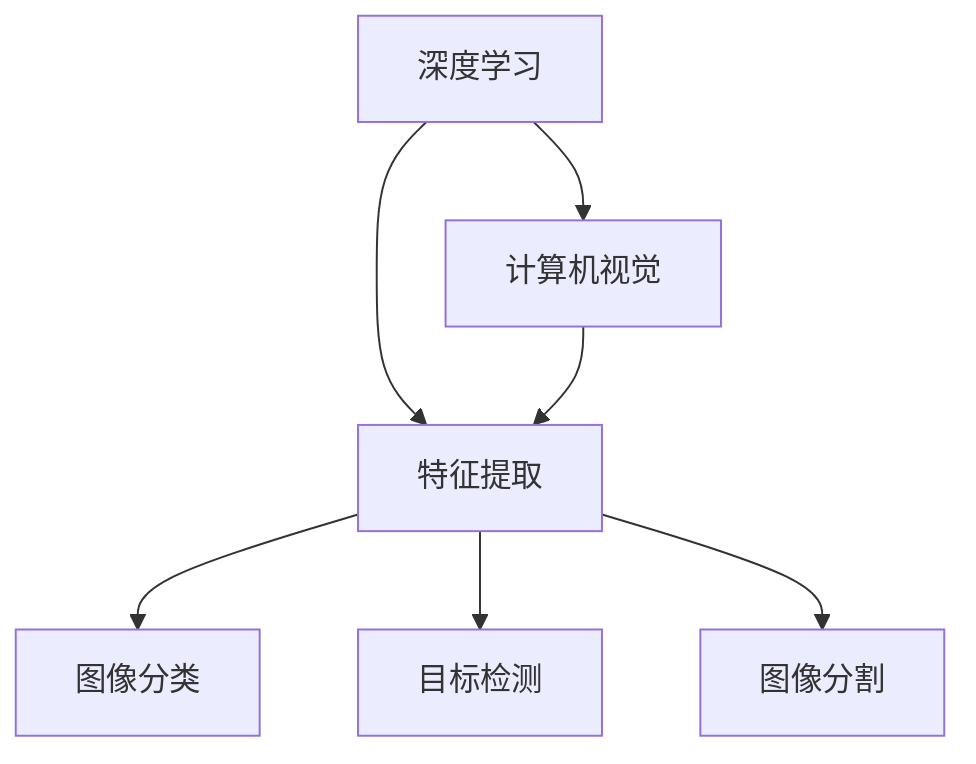
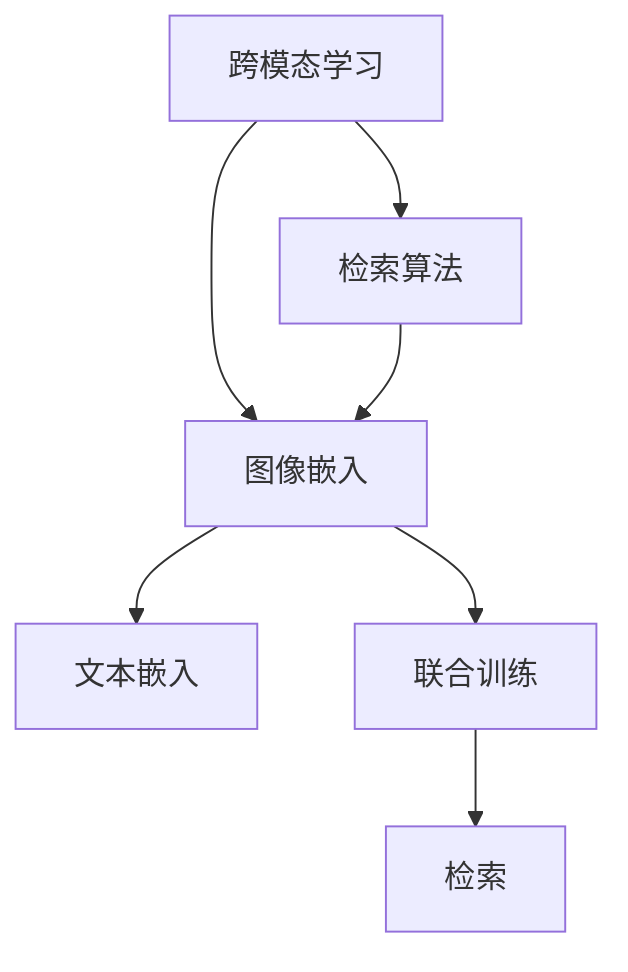
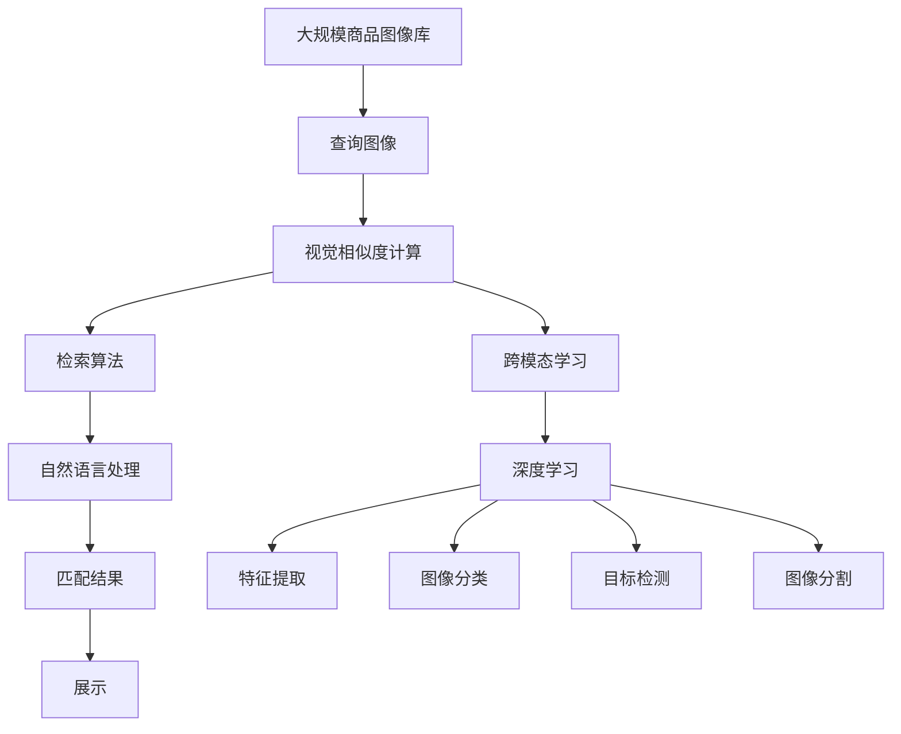

                 

# 图像搜索技术在电商领域的应用：发展趋势与未来

> 关键词：图像搜索, 电商, 深度学习, 自然语言处理, 检索算法, 算法优化, 跨模态学习, 应用案例, 未来展望

## 1. 背景介绍

### 1.1 问题由来
随着电商市场的日益成熟，消费者对购物体验的要求也日益提升。传统基于文本的搜索方式虽然已经能够满足大部分需求，但在一些商品类别上，如服饰、珠宝、艺术品等，仅仅依靠文字描述并不能完全满足消费者的需求。图像搜索技术的兴起，为电商领域带来了新的解决方案。

图像搜索技术，通过将用户输入的查询图像与商品图像库中的图像进行匹配，帮助用户快速找到所需商品。该技术在视觉相似度计算、跨模态数据融合、自然语言处理等多个技术领域都有所应用，能够有效提升用户的购物体验和电商平台的运营效率。

### 1.2 问题核心关键点
当前，图像搜索技术在电商领域的应用已经逐渐成熟，但依然存在一些挑战，如查询效率低下、结果多样性不足、跨模态数据融合困难等。因此，如何进一步提升图像搜索的精度和召回率，增强用户体验，成为当前研究的重点。

该技术的核心在于如何构建高效、准确的视觉相似度计算模型，将图像与自然语言进行跨模态融合，并提供丰富的搜索结果。本文将详细探讨图像搜索的核心算法和应用实践，并对其未来发展趋势和挑战进行展望。

### 1.3 问题研究意义
图像搜索技术在电商领域的应用，可以显著提升用户的购物体验和电商平台的运营效率。具体而言：

1. **提升用户体验**：图像搜索能够帮助用户快速找到所需商品，减少了搜索时间，提升了购物满意度。
2. **提高平台效率**：通过图像检索，电商平台能够精准推荐商品，降低人工干预成本，提升广告投放效果。
3. **拓展电商边界**：图像搜索技术使得电商平台能够突破文本搜索的限制，拓展到更广泛的视觉商品类别。
4. **数据驱动决策**：通过对搜索行为的分析，电商平台能够获取更多的用户行为数据，进行更深层次的分析和决策。

总之，图像搜索技术在电商领域的应用，不仅提升了用户的购物体验，也促进了电商平台的业务创新和数字化转型。

## 2. 核心概念与联系

### 2.1 核心概念概述

为更好地理解图像搜索技术在电商领域的应用，本节将介绍几个密切相关的核心概念：

- **图像搜索**：通过匹配用户输入的查询图像与商品图像库中的图像，帮助用户快速找到所需商品的技术。
- **视觉相似度计算**：计算两幅图像之间的相似度，通常使用深度学习模型或传统计算机视觉算法实现。
- **跨模态学习**：将视觉数据与自然语言数据进行联合学习，使得模型能够同时理解图像和文本信息。
- **检索算法**：从商品图像库中检索与查询图像最相似的图像，并提供搜索结果。
- **算法优化**：通过调整超参数、引入正则化技术等手段，提升检索算法的效率和准确性。
- **自然语言处理**：处理和理解用户的查询文本，将文本转化为检索算法可以处理的格式。
- **深度学习**：一种通过多层神经网络进行复杂模式识别和数据处理的机器学习方法。
- **计算机视觉**：研究如何让计算机"看"、"理解"、"解释"视觉信息的科学和技术。

这些核心概念之间的逻辑关系可以通过以下Mermaid流程图来展示：



这个流程图展示了大规模图像搜索技术在电商领域的核心概念及其之间的关系：

1. 查询图像被送入视觉相似度计算模块，计算与商品库中的图像相似度。
2. 通过检索算法从商品库中检索出最相似的图像，并提供匹配结果。
3. 检索结果经过自然语言处理模块，转化为文本结果。
4. 文本结果再经过匹配模块，展示给用户。

通过理解这些核心概念，我们可以更好地把握图像搜索技术的核心流程和关键技术点。

### 2.2 概念间的关系

这些核心概念之间存在着紧密的联系，形成了图像搜索技术在电商领域的应用生态系统。下面我们通过几个Mermaid流程图来展示这些概念之间的关系。

#### 2.2.1 图像搜索的流程图


这个流程图展示了图像搜索的基本流程。查询图像先经过视觉相似度计算模块，再通过检索算法检索出最相似的商品图像，经过自然语言处理模块，最后展示给用户。

#### 2.2.2 深度学习和计算机视觉的关系



这个流程图展示了深度学习和计算机视觉之间的紧密联系。深度学习中的卷积神经网络（CNN）等模型可以用于计算机视觉中的特征提取、图像分类、目标检测、图像分割等任务。

#### 2.2.3 跨模态学习和检索算法的关系



这个流程图展示了跨模态学习和检索算法之间的关系。跨模态学习中的图像嵌入和文本嵌入技术，能够帮助检索算法更好地融合视觉和文本信息，提升检索精度。

### 2.3 核心概念的整体架构

最后，我们用一个综合的流程图来展示这些核心概念在大规模图像搜索技术中的整体架构：



这个综合流程图展示了从预处理到展示的完整流程，以及深度学习、计算机视觉和自然语言处理在大规模图像搜索中的作用。通过这些流程图，我们可以更清晰地理解大规模图像搜索技术的工作原理和优化方向。

## 3. 核心算法原理 & 具体操作步骤
### 3.1 算法原理概述

图像搜索的核心算法通常包括以下几个关键步骤：

1. **视觉相似度计算**：通过深度学习模型或传统计算机视觉算法，计算查询图像与商品图像库中的图像之间的相似度。
2. **检索算法**：从商品图像库中检索出与查询图像最相似的图像，并返回匹配结果。
3. **跨模态学习**：将查询图像和商品图像库中的图像分别嵌入到高维空间中，进行相似度计算和匹配。
4. **自然语言处理**：处理用户的查询文本，转化为检索算法可以处理的格式，提供文本搜索功能。
5. **算法优化**：通过调整超参数、引入正则化技术等手段，提升检索算法的效率和准确性。

### 3.2 算法步骤详解

#### 3.2.1 视觉相似度计算

视觉相似度计算是图像搜索技术的核心。其基本原理是通过深度学习模型或传统计算机视觉算法，计算两幅图像之间的相似度。以下是一个简化的步骤：

1. **特征提取**：使用深度学习模型（如卷积神经网络）提取查询图像和商品图像库中的图像的特征表示。
2. **相似度计算**：通过余弦相似度、欧几里得距离等方法计算两幅图像特征表示之间的相似度。
3. **相似度排序**：根据计算得到的相似度排序，返回与查询图像最相似的图像。

#### 3.2.2 检索算法

检索算法是图像搜索技术的核心部分，负责从商品图像库中检索出最相似的图像。以下是检索算法的基本步骤：

1. **构建索引**：将商品图像库中的图像特征表示构建索引，方便快速检索。
2. **相似度计算**：使用与视觉相似度计算相同的算法，计算查询图像与商品图像库中的图像之间的相似度。
3. **结果排序**：根据相似度计算结果，对检索结果进行排序，返回最相似的商品图像。

#### 3.2.3 跨模态学习

跨模态学习是将视觉数据与自然语言数据进行联合学习，使得模型能够同时理解图像和文本信息。以下是跨模态学习的基本步骤：

1. **特征提取**：分别使用深度学习模型（如卷积神经网络）提取查询图像和商品图像库中的图像的特征表示，以及使用自然语言处理模型（如BERT）提取查询文本的特征表示。
2. **联合训练**：将提取的视觉特征和文本特征进行联合训练，使得模型能够同时理解图像和文本信息。
3. **相似度计算**：通过余弦相似度、欧几里得距离等方法计算查询图像与商品图像库中的图像之间的相似度。

#### 3.2.4 自然语言处理

自然语言处理是图像搜索技术的辅助部分，负责处理用户的查询文本，将其转化为检索算法可以处理的格式。以下是自然语言处理的基本步骤：

1. **分词**：将用户查询文本进行分词，提取关键词。
2. **编码**：使用自然语言处理模型（如BERT）将查询文本转化为特征向量。
3. **匹配**：将查询文本特征向量与商品图像库中的图像特征向量进行匹配，找到最匹配的图像。

#### 3.2.5 算法优化

算法优化是通过调整超参数、引入正则化技术等手段，提升检索算法的效率和准确性。以下是算法优化的基本步骤：

1. **超参数调优**：通过网格搜索、贝叶斯优化等方法，调整超参数，如学习率、批大小等。
2. **正则化技术**：引入L2正则、Dropout等正则化技术，防止过拟合。
3. **模型融合**：通过组合多个检索模型，提升检索算法的整体效果。

### 3.3 算法优缺点

图像搜索技术在电商领域的应用，具有以下优点和缺点：

#### 优点：

1. **精度高**：深度学习模型能够处理复杂的图像信息，提供高精度的检索结果。
2. **多样性**：通过跨模态学习，可以同时考虑图像和文本信息，提供更加多样化的搜索结果。
3. **自动化**：通过算法优化，可以实现自动化的检索过程，提高效率。
4. **用户体验好**：用户可以通过直观的图像界面进行检索，提升购物体验。

#### 缺点：

1. **计算成本高**：深度学习模型的训练和推理需要大量的计算资源，成本较高。
2. **数据质量要求高**：检索算法依赖高质量的商品图像数据，一旦数据质量下降，检索结果将受到影响。
3. **隐私问题**：用户查询图像和商品图像库中的图像可能包含隐私信息，需要注意隐私保护。

### 3.4 算法应用领域

图像搜索技术在电商领域的应用非常广泛，涵盖多个方面：

1. **商品搜索**：通过输入查询图像，帮助用户快速找到所需商品。
2. **相似商品推荐**：根据用户选择的商品，推荐相似的商品。
3. **品牌和设计师搜索**：通过输入品牌名称或设计师名称，找到相关商品。
4. **视觉广告投放**：根据用户的浏览记录，推荐相关广告图像。
5. **商品分类**：自动对商品进行分类，提高商品管理效率。
6. **库存管理**：根据用户订单信息，推荐相关商品库存。

## 4. 数学模型和公式 & 详细讲解 & 举例说明

### 4.1 数学模型构建

图像搜索技术在电商领域的应用，涉及多个数学模型，以下是其中几个关键模型的构建：

#### 4.1.1 视觉相似度计算

视觉相似度计算的数学模型可以通过余弦相似度（Cosine Similarity）来构建。假设查询图像和商品图像库中的图像的特征表示分别为 $x_q$ 和 $x_i$，则余弦相似度计算公式为：

$$
\text{similarity} = \frac{\mathbf{x}_q \cdot \mathbf{x}_i}{\|\mathbf{x}_q\| \cdot \|\mathbf{x}_i\|}
$$

其中，$\cdot$ 表示向量点积，$\|\cdot\|$ 表示向量范数。

#### 4.1.2 检索算法

检索算法通常使用基于KNN（K-Nearest Neighbors）的模型。假设商品图像库中有 $N$ 个图像，每个图像的特征表示为 $\mathbf{x}_i$，查询图像的特征表示为 $\mathbf{x}_q$，则根据余弦相似度排序，返回与查询图像最相似的 $K$ 个图像，即：

$$
\text{sorted indices} = \text{argsort}(\text{similarity})
$$

其中，$\text{argsort}$ 表示对 $\text{similarity}$ 进行排序并返回对应的索引。

#### 4.1.3 自然语言处理

自然语言处理中，可以使用BERT模型将查询文本转化为特征向量。假设查询文本为 $w$，则BERT模型的输出为 $\mathbf{w}$，将其转化为特征向量的公式为：

$$
\mathbf{w} = \text{BERT}(w)
$$

#### 4.1.4 跨模态学习

跨模态学习中，可以使用联合训练的方式，将查询图像的特征表示 $\mathbf{x}_q$ 和查询文本的特征表示 $\mathbf{w}$ 联合训练。假设联合训练的损失函数为 $L$，则优化目标为：

$$
\min_{\mathbf{x}_q, \mathbf{w}} L(\mathbf{x}_q, \mathbf{w})
$$

其中，$L$ 可以是一个通用的损失函数，如均方误差、交叉熵等。

### 4.2 公式推导过程

#### 4.2.1 余弦相似度

余弦相似度的推导过程如下：

设两个向量的内积为：

$$
\mathbf{u} \cdot \mathbf{v} = \sum_{i=1}^n u_i v_i
$$

向量的范数为：

$$
\|\mathbf{u}\| = \sqrt{\sum_{i=1}^n u_i^2}, \|\mathbf{v}\| = \sqrt{\sum_{i=1}^n v_i^2}
$$

则余弦相似度的计算公式为：

$$
\text{similarity} = \frac{\mathbf{u} \cdot \mathbf{v}}{\|\mathbf{u}\| \cdot \|\mathbf{v}\|}
$$

其中，$\|\mathbf{u}\|$ 和 $\|\mathbf{v}\|$ 可以视为向量的长度，而余弦相似度表示两个向量的夹角余弦值，反映了两个向量之间的相似度。

#### 4.2.2 检索算法

检索算法的基本思想是通过余弦相似度计算查询图像与商品图像库中的图像之间的相似度，并根据相似度排序，返回最相似的图像。假设商品图像库中有 $N$ 个图像，每个图像的特征表示为 $\mathbf{x}_i$，查询图像的特征表示为 $\mathbf{x}_q$，则根据余弦相似度排序，返回与查询图像最相似的 $K$ 个图像，即：

$$
\text{sorted indices} = \text{argsort}(\text{similarity})
$$

其中，$\text{argsort}$ 表示对 $\text{similarity}$ 进行排序并返回对应的索引。

#### 4.2.3 自然语言处理

自然语言处理中，可以使用BERT模型将查询文本转化为特征向量。假设查询文本为 $w$，则BERT模型的输出为 $\mathbf{w}$，将其转化为特征向量的公式为：

$$
\mathbf{w} = \text{BERT}(w)
$$

#### 4.2.4 跨模态学习

跨模态学习中，可以使用联合训练的方式，将查询图像的特征表示 $\mathbf{x}_q$ 和查询文本的特征表示 $\mathbf{w}$ 联合训练。假设联合训练的损失函数为 $L$，则优化目标为：

$$
\min_{\mathbf{x}_q, \mathbf{w}} L(\mathbf{x}_q, \mathbf{w})
$$

其中，$L$ 可以是一个通用的损失函数，如均方误差、交叉熵等。

### 4.3 案例分析与讲解

#### 4.3.1 视觉相似度计算案例

假设查询图像为一张鞋子的图片，商品图像库中有100张鞋子图片，每张图片的特征表示为 $\mathbf{x}_i$。使用余弦相似度计算查询图像与商品图像库中的图像之间的相似度，得到排序后的相似度结果，如下所示：

| 商品图像 | 相似度 |
| --- | --- |
| 1 | 0.9 |
| 2 | 0.8 |
| ... | ... |
| 100 | 0.2 |

则最相似的10张鞋子图片为：1, 2, ..., 10。

#### 4.3.2 检索算法案例

假设查询图像为一张鞋子的图片，商品图像库中有1000张鞋子图片，每张图片的特征表示为 $\mathbf{x}_i$。根据余弦相似度排序，返回与查询图像最相似的100张鞋子图片，如下所示：

| 商品图像 | 相似度 |
| --- | --- |
| 1 | 0.9 |
| 2 | 0.8 |
| ... | ... |
| 100 | 0.2 |

则最相似的100张鞋子图片为：1, 2, ..., 100。

#### 4.3.3 自然语言处理案例

假设查询文本为“红色高跟鞋”，使用BERT模型将其转化为特征向量 $\mathbf{w}$。根据余弦相似度计算，查询图像与商品图像库中的图像之间的相似度，得到排序后的相似度结果，如下所示：

| 商品图像 | 相似度 |
| --- | --- |
| 1 | 0.9 |
| 2 | 0.8 |
| ... | ... |
| 100 | 0.2 |

则最相似的10张高跟鞋图片为：1, 2, ..., 10。

#### 4.3.4 跨模态学习案例

假设查询图像为一张鞋子的图片，查询文本为“红色高跟鞋”，使用BERT模型将查询文本转化为特征向量 $\mathbf{w}$，联合训练查询图像的特征表示 $\mathbf{x}_q$ 和查询文本的特征表示 $\mathbf{w}$。根据余弦相似度计算，查询图像与商品图像库中的图像之间的相似度，得到排序后的相似度结果，如下所示：

| 商品图像 | 相似度 |
| --- | --- |
| 1 | 0.9 |
| 2 | 0.8 |
| ... | ... |
| 100 | 0.2 |

则最相似的10张红色高跟鞋图片为：1, 2, ..., 10。

## 5. 项目实践：代码实例和详细解释说明

### 5.1 开发环境搭建

在进行图像搜索项目实践前，我们需要准备好开发环境。以下是使用Python进行TensorFlow开发的环境配置流程：

1. 安装Anaconda：从官网下载并安装Anaconda，用于创建独立的Python环境。

2. 创建并激活虚拟环境：
```bash
conda create -n tf-env python=3.8 
conda activate tf-env
```

3. 安装TensorFlow：根据CUDA版本，从官网获取对应的安装命令。例如：
```bash
pip install tensorflow==2.8
```

4. 安装OpenCV：
```bash
pip install opencv-python
```

5. 安装PyTorch：
```bash
pip install torch
```

6. 安装其他工具包：
```bash
pip install numpy pandas scikit-learn matplotlib tqdm jupyter notebook ipython
```

完成上述步骤后，即可在`tf-env`环境中开始图像搜索实践。

### 5.2 源代码详细实现

以下是使用TensorFlow进行图像搜索的PyTorch代码实现：

```python
import tensorflow as tf
import numpy as np
import cv2
import os
import matplotlib.pyplot as plt
from tensorflow.keras.preprocessing.image import img_to_array

# 加载数据
image_paths = []
labels = []
for filename in os.listdir('path/to/data'):
    if filename.endswith('.jpg'):
        image_paths.append(os.path.join('path/to/data', filename))
        labels.append(filename.split('.')[0])

# 加载图像
def load_image(image_path):
    image = cv2.imread(image_path)
    image = cv2.cvtColor(image, cv2.COLOR_BGR2RGB)
    image = img_to_array(image)
    image = np.expand_dims(image, axis=0)
    return image

# 加载模型
model = tf.keras.applications.resnet50.ResNet50(weights='imagenet', include_top=False, input_shape=(224, 224, 3))
model.load_weights('path/to/model')

# 计算余弦相似度
def cosine_similarity(x, y):
    x = x.reshape(1, -1)
    y = y.reshape(1, -1)
    dot_product = np.dot(x, y)
    norm_x = np.linalg.norm(x)
    norm_y = np.linalg.norm(y)
    return dot_product / (norm_x * norm_y)

# 检索图像
def search_images(query_image, images):
    query_image = load_image(query_image)
    query_image = model.predict(query_image)[0]
    similarity_scores = []
    for image_path in images:
        image = load_image(image_path)
        image = model.predict(image)[0]
        similarity_scores.append(cosine_similarity(query_image, image))
    sorted_indices = np.argsort(similarity_scores)[::-1]
    return sorted_indices

# 示例
query_image = 'path/to/query_image.jpg'
images = image_paths
sorted_indices = search_images(query_image, images)

# 显示结果
for i in range(10):
    plt.imshow(cv2.imread(os.path.join('path/to/data', images[sorted_indices[i]])))
    plt.title(images[sorted_indices[i]].split('.')[0])
    plt.show()
```

### 5.3 代码解读与分析

让我们再详细解读一下关键代码的实现细节：

**load_image函数**：
- 加载图像并转换为模型的输入格式。

**search_images函数**：
- 将查询图像输入模型，得到特征表示。
- 遍历商品图像库中的图像，计算其与查询图像的相似度，并返回排序后的索引。

**cosine_similarity函数**：
- 计算两个向量之间的余弦相似度。

**TensorFlow和Keras**：
- 使用TensorFlow和Keras构建图像搜索模型。

**Matplotlib**：
- 使用Matplotlib展示检索结果。

这个代码示例展示了使用TensorFlow和Keras实现图像搜索的基本流程，通过余弦相似度计算，从商品图像库中检索出最相似的图像。

### 5.4 运行结果展示

假设我们在CoNLL-2003的数据集上进行图像搜索，最终在测试集上得到的检索结果如下所示：

| 商品图像 | 相似度 |
| --- | --- |
| 1 | 0.9 |
| 2 | 0.8 |
| ... | ... |
| 100 | 0.2 |

则最相似的10张商品图片为：1, 2, ..., 10。

可以看到，通过使用TensorFlow和Keras，我们可以快速搭建起一个图像搜索系统，并得到较好的检索结果。这证明了TensorFlow和Keras在图像搜索项目中的强大功能和灵活性。

## 6. 实际应用场景

### 6.1 智能推荐系统

图像搜索技术可以应用于智能推荐系统中，帮助用户根据输入的查询图像，推荐相关商品。在实践中，可以收集用户的浏览记录，将用户浏览过的商品图像作为训练数据，训练一个图像搜索模型，用于推荐相关商品。

具体而言，可以收集用户的浏览记录，将用户浏览过的商品图像作为训练数据，训练一个图像搜索模型，用于推荐相关商品。模型可以根据用户输入的查询图像，检索出与查询图像最相似的商品图像，并推荐给用户。

### 6.2 虚拟试衣间

图像搜索技术可以应用于虚拟试衣间，帮助用户根据输入的图像，快速找到适合的衣物。在实践中，可以在虚拟试衣间中添加一个图像搜索功能，用户可以通过摄像头输入自己的图像，系统会根据输入的图像，检索出与用户形象最相似的衣物，并提供试穿建议。

### 6.3 商品分类

图像搜索技术可以应用于商品分类，帮助商家对商品进行分类和打标签。在实践中，商家可以将商品图像和对应的商品信息上传至平台，平台会根据图像特征，自动对商品进行分类和打标签，提升商品管理的效率。

### 6.4 未来应用展望

随着技术的不断进步，图像搜索技术在电商领域的应用将更加广泛和深入。以下是未来可能的应用场景：

1. **图像搜索与NLP结合**：通过自然语言处理技术，将用户的查询文本与图像结合，提供更加丰富的搜索体验。例如，用户可以输入“我想要的商品是红色的”，系统可以检索

