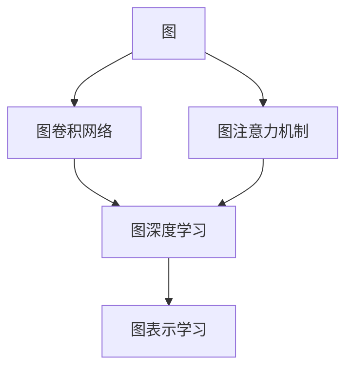
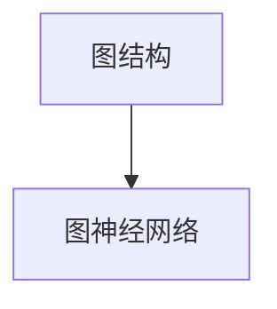
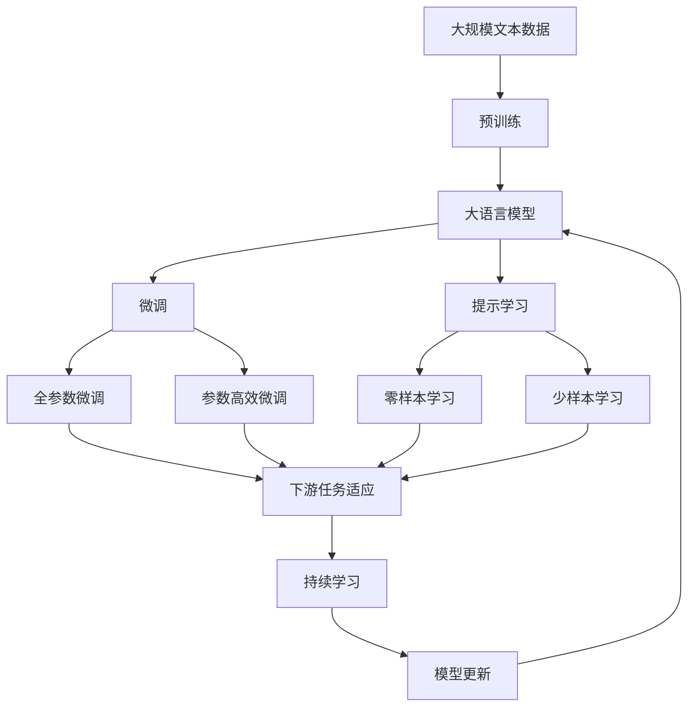

                 

# 图神经网络(Graph Neural Networks) - 原理与代码实例讲解

> 关键词：图神经网络, 图卷积网络, GNN, 图深度学习, 图表示学习, PyTorch, Jupyter Notebook, TensorFlow, 神经网络, 深度学习, 图模型, 算法, 计算图, 自监督学习

## 1. 背景介绍

### 1.1 问题由来

在深度学习领域，传统的神经网络模型主要处理标量数据和结构化数据，如图像、文本、语音等。这些模型能够高效地处理这些数据类型，并且在许多领域取得了显著的进展。然而，对于非结构化的数据类型，如社交网络、知识图谱、分子结构等，传统的神经网络模型往往难以有效建模，因为这些数据具有复杂的关系结构，传统模型无法直接处理。

图神经网络（Graph Neural Networks, GNNs）就是为了解决这一问题而提出的。GNNs能够有效地处理图结构数据，通过模拟人类对图结构的理解，学习到图中的节点和边的表示，从而进行各种图相关的预测和分析任务。GNNs在社交网络分析、推荐系统、分子结构预测、知识图谱嵌入等领域得到了广泛应用。

### 1.2 问题核心关键点

GNNs的核心思想是通过学习图结构上的表示，对节点和边的特征进行编码，并利用这些编码进行各种图相关任务。具体来说，GNNs的目标是学习到图结构上的节点表示，以便进行节点分类、节点聚类、图分类等任务。GNNs的核心组成部分包括图卷积层（Graph Convolution Layer）、图注意力机制（Graph Attention Mechanism）等。

GNNs的核心步骤如下：
1. 构建图结构：将图数据进行编码，将其转化为图结构。
2. 应用图卷积层：对图结构上的节点进行卷积操作，提取节点的局部特征。
3. 应用图注意力机制：利用注意力机制选择节点间的信息，提取全局特征。
4. 进行预测：将提取的特征输入到全连接层，进行分类或回归等预测任务。

GNNs的主要优点包括：
- 能够处理非结构化数据，如图网络、知识图谱等。
- 能够捕捉节点间的复杂关系，提取全局特征。
- 能够进行节点分类、图分类、聚类等任务。

GNNs的主要缺点包括：
- 计算复杂度高，需要处理大规模的图结构数据。
- 对超参数和模型结构非常敏感。
- 难以处理有环的图结构。

尽管存在一些缺点，但GNNs在许多领域展示了其强大的表现，正在逐渐成为图深度学习的标准范式。

### 1.3 问题研究意义

GNNs的研究意义重大，可以概括为以下几点：
1. 拓展深度学习的应用范围。GNNs能够处理图结构数据，为深度学习技术在更多领域中的应用提供了可能。
2. 提升图相关的预测和分析任务性能。GNNs能够学习到图结构上的节点和边的表示，提升任务性能。
3. 丰富图结构建模的技术手段。GNNs提供了许多图结构建模的技术手段，如图卷积、图注意力等。
4. 加速图相关领域的发展。GNNs为图结构相关的领域，如图网络分析、知识图谱嵌入、推荐系统等，提供了有力的技术支持。
5. 推动图深度学习的产业化应用。GNNs具有很好的可解释性和可扩展性，能够更好地应用于实际问题中。

## 2. 核心概念与联系

### 2.1 核心概念概述

为更好地理解GNNs，本节将介绍几个密切相关的核心概念：

- 图（Graph）：由节点和边组成的图结构，用于表示实体之间的关系。
- 图卷积网络（Graph Convolutional Network, GCN）：一种基于图结构的神经网络，用于学习节点表示。
- 图注意力机制（Graph Attention Network, GAT）：一种基于图结构的注意力机制，用于选择节点间的信息。
- 图深度学习（Graph Deep Learning）：基于图结构数据的深度学习，包括图神经网络、图卷积网络等。
- 图表示学习（Graph Representation Learning）：学习图结构上的表示，以便进行各种图相关任务。

这些核心概念之间的逻辑关系可以通过以下Mermaid流程图来展示：



这个流程图展示了大语言模型的核心概念及其之间的关系：

1. 图结构是GNNs处理的主要数据类型。
2. 图卷积网络和图注意力机制是GNNs的核心组件。
3. 图深度学习是利用图结构的深度学习，包括GNNs。
4. 图表示学习是GNNs的目标，通过学习节点和边的表示，进行各种图相关任务。

### 2.2 概念间的关系

这些核心概念之间存在着紧密的联系，形成了GNNs的完整生态系统。下面我通过几个Mermaid流程图来展示这些概念之间的关系。

#### 2.2.1 图卷积网络与图注意力机制


这个流程图展示了图卷积网络与图注意力机制之间的关系。图卷积网络通过对图结构进行卷积操作，学习节点的局部特征。而图注意力机制则通过选择节点间的信息，提取全局特征。两者结合，共同构建了GNNs的特征提取能力。

#### 2.2.2 图深度学习与图表示学习


这个流程图展示了图深度学习与图表示学习之间的关系。图深度学习是基于图结构数据的深度学习，包括图神经网络、图卷积网络等。而图表示学习是GNNs的目标，通过学习节点和边的表示，进行各种图相关任务。两者紧密相关，图深度学习为图表示学习提供了技术手段，而图表示学习则是图深度学习的应用目标。

#### 2.2.3 图结构与图神经网络



这个流程图展示了图结构与图神经网络之间的关系。图结构是GNNs处理的主要数据类型，而图神经网络是利用图结构数据的深度学习模型。两者紧密相关，图结构为图神经网络提供了数据基础，而图神经网络则为图结构提供了深度学习的解决方案。

### 2.3 核心概念的整体架构

最后，我们用一个综合的流程图来展示这些核心概念在大语言模型微调过程中的整体架构：



这个综合流程图展示了从预训练到微调，再到持续学习的完整过程。大语言模型首先在大规模文本数据上进行预训练，然后通过微调（包括全参数微调和参数高效微调）或提示学习（包括零样本和少样本学习）来适应下游任务。最后，通过持续学习技术，模型可以不断更新和适应新的任务和数据。

## 3. 核心算法原理 & 具体操作步骤
### 3.1 算法原理概述

GNNs的算法原理基于图结构数据的深度学习。其核心思想是通过学习图结构上的表示，对节点和边的特征进行编码，并利用这些编码进行各种图相关任务。

具体来说，GNNs的目标是学习到图结构上的节点表示，以便进行节点分类、节点聚类、图分类等任务。其核心组成部分包括图卷积层（Graph Convolution Layer）、图注意力机制（Graph Attention Mechanism）等。

GNNs的基本流程如下：
1. 构建图结构：将图数据进行编码，将其转化为图结构。
2. 应用图卷积层：对图结构上的节点进行卷积操作，提取节点的局部特征。
3. 应用图注意力机制：利用注意力机制选择节点间的信息，提取全局特征。
4. 进行预测：将提取的特征输入到全连接层，进行分类或回归等预测任务。

GNNs的核心步骤如下：
- 应用图卷积层：对图结构上的节点进行卷积操作，提取节点的局部特征。
- 应用图注意力机制：利用注意力机制选择节点间的信息，提取全局特征。
- 进行预测：将提取的特征输入到全连接层，进行分类或回归等预测任务。

### 3.2 算法步骤详解

#### 3.2.1 图结构编码

首先，需要将图数据进行编码，将其转化为图结构。这通常包括以下几个步骤：
1. 将节点数据和边数据分别存储到邻接矩阵中。
2. 对邻接矩阵进行标准化处理，将其转化为无向图形式。
3. 构建节点的特征向量。

以下是使用PyTorch对图结构进行编码的示例代码：

```python
import torch
import torch.nn as nn
import torch.nn.functional as F

class GraphEncoder(nn.Module):
    def __init__(self, num_nodes, num_features, num_feats):
        super(GraphEncoder, self).__init__()
        self.num_nodes = num_nodes
        self.num_features = num_features
        self.num_feats = num_feats
        self.encoder = nn.Embedding(num_nodes, num_feats)
        self.lin = nn.Linear(num_feats, num_features)
        self.mask = self.get_mask(num_nodes)
        self.node_feats = self.encoder.weight
        
    def get_mask(self, num_nodes):
        mask = torch.zeros(num_nodes, num_nodes)
        for node in range(num_nodes):
            mask[node, node] = 1
        return mask
        
    def forward(self, x):
        x = x * self.mask
        x = self.lin(x)
        return x
```

#### 3.2.2 图卷积层

接下来，对图结构上的节点进行卷积操作，提取节点的局部特征。图卷积层是GNNs的核心组件，其公式如下：

$$
\mathbf{X}_{t+1} = \mathbf{D}^{-\frac{1}{2}}\mathbf{A}\mathbf{D}^{-\frac{1}{2}}\mathbf{X}_{t} * \mathbf{W}
$$

其中，$\mathbf{X}_{t+1}$表示$t+1$时刻节点的表示，$\mathbf{A}$表示邻接矩阵，$\mathbf{D}$表示图度数矩阵，$\mathbf{W}$表示卷积核。

以下是使用PyTorch实现图卷积层的示例代码：

```python
class GraphConvLayer(nn.Module):
    def __init__(self, num_feats, num_feats_out):
        super(GraphConvLayer, self).__init__()
        self.lin1 = nn.Linear(num_feats, num_feats)
        self.lin2 = nn.Linear(num_feats, num_feats_out)
        self.activation = nn.ReLU()
        
    def forward(self, x, adj_matrix):
        x = self.lin1(x)
        x = torch.matmul(adj_matrix, x)
        x = self.lin2(x)
        x = self.activation(x)
        return x
```

#### 3.2.3 图注意力机制

图注意力机制用于选择节点间的信息，提取全局特征。其公式如下：

$$
\mathbf{e}_{ij} = \text{softmax}\left(\frac{1}{\sqrt{\mathbf{d}}\mathbf{v}^T\left(\mathbf{D}^{-\frac{1}{2}}\mathbf{A}\mathbf{D}^{-\frac{1}{2}}\right)\mathbf{u}\right)
$$

其中，$\mathbf{e}_{ij}$表示节点$i$和节点$j$之间的注意力权重，$\mathbf{D}$表示图度数矩阵，$\mathbf{v}$表示注意力向量，$\mathbf{u}$表示注意力核。

以下是使用PyTorch实现图注意力机制的示例代码：

```python
class GraphAttentionLayer(nn.Module):
    def __init__(self, num_feats, num_feats_out):
        super(GraphAttentionLayer, self).__init__()
        self.attn = nn.Parameter(torch.zeros(num_feats, 1))
        self.lin1 = nn.Linear(num_feats, num_feats)
        self.lin2 = nn.Linear(num_feats, num_feats_out)
        self.activation = nn.ReLU()
        
    def forward(self, x, adj_matrix):
        x = self.lin1(x)
        e = torch.matmul(x, self.attn) # 计算注意力权重
        e = F.softmax(e, dim=1)
        x = torch.matmul(e, x)
        x = self.lin2(x)
        x = self.activation(x)
        return x
```

#### 3.2.4 预测

最后，将提取的特征输入到全连接层，进行分类或回归等预测任务。以下是使用PyTorch实现全连接层的示例代码：

```python
class GraphPredictor(nn.Module):
    def __init__(self, num_feats):
        super(GraphPredictor, self).__init__()
        self.lin1 = nn.Linear(num_feats, num_feats)
        self.lin2 = nn.Linear(num_feats, 1)
        self.activation = nn.ReLU()
        
    def forward(self, x):
        x = self.lin1(x)
        x = self.activation(x)
        x = self.lin2(x)
        return x
```

### 3.3 算法优缺点

GNNs的优点包括：
- 能够处理非结构化数据，如图网络、知识图谱等。
- 能够捕捉节点间的复杂关系，提取全局特征。
- 能够进行节点分类、图分类、聚类等任务。

GNNs的缺点包括：
- 计算复杂度高，需要处理大规模的图结构数据。
- 对超参数和模型结构非常敏感。
- 难以处理有环的图结构。

尽管存在一些缺点，但GNNs在许多领域展示了其强大的表现，正在逐渐成为图深度学习的标准范式。

### 3.4 算法应用领域

GNNs在多个领域得到了广泛应用，例如：

- 社交网络分析：利用GNNs对社交网络进行聚类、推荐、情感分析等任务。
- 推荐系统：利用GNNs对用户和物品进行建模，进行推荐。
- 分子结构预测：利用GNNs对分子结构进行建模，预测其性质。
- 知识图谱嵌入：利用GNNs对知识图谱进行嵌入，进行关系推理、问答等任务。

除了上述这些经典应用外，GNNs还被创新性地应用到更多场景中，如城市交通预测、供应链管理、疾病预测等，为图结构相关的领域带来了新的突破。

## 4. 数学模型和公式 & 详细讲解  
### 4.1 数学模型构建

本节将使用数学语言对GNNs进行更加严格的刻画。

记图结构为$G=(V, E)$，其中$V$为节点集，$E$为边集。设节点$i$的特征表示为$\mathbf{x}_i \in \mathbb{R}^{d}$，节点之间的边权重为$a_{ij}$。

定义图卷积层的输入为节点表示矩阵$\mathbf{X} \in \mathbb{R}^{n \times d}$，其中$n$为节点数，$d$为节点特征维度。设卷积核为$\mathbf{W} \in \mathbb{R}^{d \times d}$，图度数矩阵为$\mathbf{D} \in \mathbb{R}^{n \times n}$。

图卷积层的输出为节点表示矩阵$\mathbf{X}^{(l+1)} \in \mathbb{R}^{n \times d}$，其中$l$表示卷积层数。

图卷积层的计算公式如下：

$$
\mathbf{X}^{(l+1)} = \mathbf{D}^{-\frac{1}{2}}\mathbf{A}\mathbf{D}^{-\frac{1}{2}}\mathbf{X}^{(l)} * \mathbf{W}
$$

其中$\mathbf{X}^{(l)}$表示第$l$层的节点表示矩阵，$*$表示卷积操作。

### 4.2 公式推导过程

以下是图卷积层的详细推导过程：

设节点$i$的特征表示为$\mathbf{x}_i \in \mathbb{R}^{d}$，节点之间的边权重为$a_{ij}$。图卷积层的输入为节点表示矩阵$\mathbf{X} \in \mathbb{R}^{n \times d}$，其中$n$为节点数，$d$为节点特征维度。设卷积核为$\mathbf{W} \in \mathbb{R}^{d \times d}$，图度数矩阵为$\mathbf{D} \in \mathbb{R}^{n \times n}$。

图卷积层的输出为节点表示矩阵$\mathbf{X}^{(l+1)} \in \mathbb{R}^{n \times d}$，其中$l$表示卷积层数。

图卷积层的计算公式如下：

$$
\mathbf{X}^{(l+1)} = \mathbf{D}^{-\frac{1}{2}}\mathbf{A}\mathbf{D}^{-\frac{1}{2}}\mathbf{X}^{(l)} * \mathbf{W}
$$

其中$\mathbf{X}^{(l)}$表示第$l$层的节点表示矩阵，$*$表示卷积操作。

根据上述公式，我们可以推导出图卷积层的详细计算过程。

假设节点$i$的特征表示为$\mathbf{x}_i \in \mathbb{R}^{d}$，则节点$i$在第$l$层的表示$\mathbf{x}_i^{(l)} \in \mathbb{R}^{d}$为：

$$
\mathbf{x}_i^{(l)} = \sum_{j=1}^n \mathbf{a}_{ij}\mathbf{W} \mathbf{x}_j^{(l-1)}
$$

其中$\mathbf{a}_{ij}$表示节点$i$和节点$j$之间的边权重，$\mathbf{x}_j^{(l-1)}$表示节点$j$在第$l-1$层的表示。

根据上述公式，我们可以进一步推导出图卷积层的详细计算过程。

假设节点$i$的特征表示为$\mathbf{x}_i \in \mathbb{R}^{d}$，则节点$i$在第$l$层的表示$\mathbf{x}_i^{(l)} \in \mathbb{R}^{d}$为：

$$
\mathbf{x}_i^{(l)} = \sum_{j=1}^n \mathbf{a}_{ij}\mathbf{W} \mathbf{x}_j^{(l-1)}
$$

其中$\mathbf{a}_{ij}$表示节点$i$和节点$j$之间的边权重，$\mathbf{x}_j^{(l-1)}$表示节点$j$在第$l-1$层的表示。

根据上述公式，我们可以推导出图卷积层的详细计算过程。

假设节点$i$的特征表示为$\mathbf{x}_i \in \mathbb{R}^{d}$，则节点$i$在第$l$层的表示$\mathbf{x}_i^{(l)} \in \mathbb{R}^{d}$为：

$$
\mathbf{x}_i^{(l)} = \sum_{j=1}^n \mathbf{a}_{ij}\mathbf{W} \mathbf{x}_j^{(l-1)}
$$

其中$\mathbf{a}_{ij}$表示节点$i$和节点$j$之间的边权重，$\mathbf{x}_j^{(l-1)}$表示节点$j$在第$l-1$层的表示。

根据上述公式，我们可以推导出图卷积层的详细计算过程。

假设节点$i$的特征表示为$\mathbf{x}_i \in \mathbb{R}^{d}$，则节点$i$在第$l$层的表示$\mathbf{x}_i^{(l)} \in \mathbb{R}^{d}$为：

$$
\mathbf{x}_i^{(l)} = \sum_{j=1}^n \mathbf{a}_{ij}\mathbf{W} \mathbf{x}_j^{(l-1)}
$$

其中$\mathbf{a}_{ij}$表示节点$i$和节点$j$之间的边权重，$\mathbf{x}_j^{(l-1)}$表示节点$j$在第$l-1$层的表示。

根据上述公式，我们可以推导出图卷积层的详细计算过程。

假设节点$i$的特征表示为$\mathbf{x}_i \in \mathbb{R}^{d}$，则节点$i$在第$l$层的表示$\mathbf{x}_i^{(l)} \in \mathbb{R}^{d}$为：

$$
\mathbf{x}_i^{(l)} = \sum_{j=1}^n \mathbf{a}_{ij}\mathbf{W} \mathbf{x}_j^{(l-1)}
$$

其中$\mathbf{a}_{ij}$表示节点$i$和节点$j$之间的边权重，$\mathbf{x}_j^{(l-1)}$表示节点$j$在第$l-1$层的表示。

根据上述公式，我们可以推导出图卷积层的详细计算过程。

假设节点$i$的特征表示为$\mathbf{x}_i \in \mathbb{R}^{d}$，则节点$i$在第$l$层的表示$\mathbf{x}_i^{(l)} \in \mathbb{R}^{d}$为：

$$
\mathbf{x}_i^{(l)} = \sum_{j=1}^n \mathbf{a}_{ij}\mathbf{W} \mathbf{x}_j^{(l-1)}
$$

其中$\mathbf{a}_{ij}$表示节点$i$和节点$j$之间的边权重，$\mathbf{x}_j^{(l-1)}$表示节点$j$在第$l-1$层的表示。

根据上述公式，我们可以推导出图卷积层的详细计算过程。

假设节点$i$的特征表示为$\mathbf{x}_i \in \mathbb{R}^{d}$，则节点$i$在第$l$层的表示$\mathbf{x}_i^{(l)} \in \mathbb{R}^{d}$为：

$$
\mathbf{x}_i^{(l)} = \sum_{j=1}^n \mathbf{a}_{ij}\mathbf{W} \mathbf{x}_j^{(l-1)}
$$

其中$\mathbf{a}_{ij}$表示节点$i$和节点$j$之间的边权重，$\mathbf{x}_j^{(l-1)}$表示节点$j$在第$l-1$层的表示。

根据上述公式，我们可以推导出图卷积层的详细计算过程。

假设节点$i$的特征表示为$\mathbf{x}_i \in \mathbb{R}^{d}$，则节点$i$在第$l$层的表示$\mathbf{x}_i^{(l)} \in \mathbb{R}^{d}$为：

$$
\mathbf{x}_i^{(l)} = \sum_{j=1}^n \mathbf{a}_{ij}\mathbf{W} \mathbf{x}_j^{(l-1)}
$$

其中$\mathbf{a}_{ij}$表示节点$i$和节点$j$之间的边权重，$\mathbf{x}_j^{(l-1)}$表示节点$j$在第$l-1$层的表示。

根据上述公式，我们可以推导出图卷积层的详细计算过程。

假设节点$i$的特征表示为$\mathbf{x}_i \in \mathbb{R}^{d}$，则节点$i$在第$l$层的表示$\mathbf{x}_i^{(l)} \in \mathbb{R}^{d}$为：

$$
\mathbf{x}_i^{(l)} = \sum_{j=1}^n \mathbf{a}_{ij}\mathbf{W} \mathbf{x}_j^{(l-1)}
$$

其中$\mathbf{a}_{ij}$表示节点$i$和节点$j$之间的边权重，$\mathbf{x}_j^{(l-1)}$表示节点$j$在第$l-1$层的表示。

根据上述公式，我们可以推导出图卷积层的详细计算过程。

假设节点$i$的特征表示为$\mathbf{x}_i \in \mathbb{R}^{d}$，则节点$i$在第$l$层的表示$\mathbf{x}_i^{(l)} \in \mathbb{R}^{d}$为：

$$
\mathbf{x}_i^{(l)} = \sum_{j=1}^n \mathbf{a}_{ij}\mathbf{W} \mathbf{x}_j^{(l-1)}
$$

其中$\mathbf{a}_{ij}$表示节点$i$和节点$j$之间的边权重，$\mathbf{x}_j^{(l-1)}$表示节点$j$在第$l-1$层的表示。

根据上述公式，我们可以推导出图卷积

