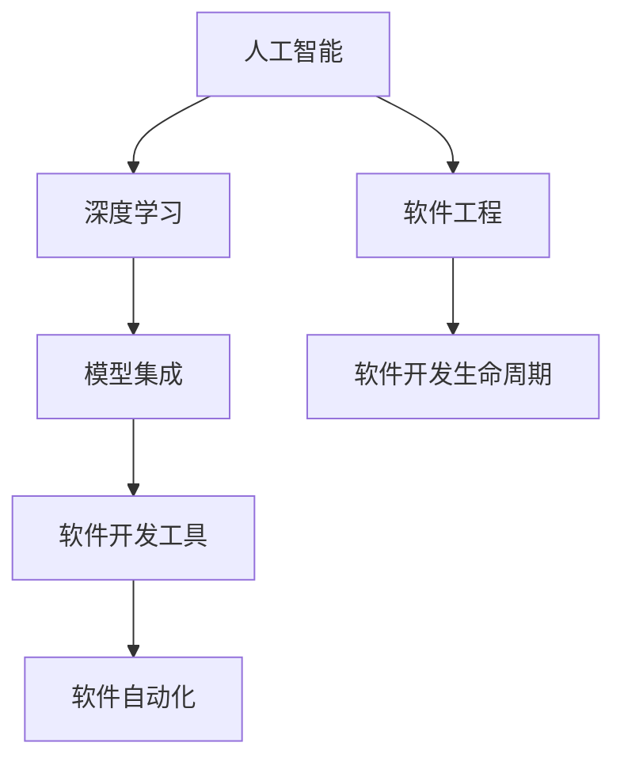
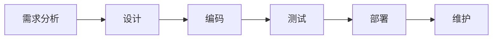
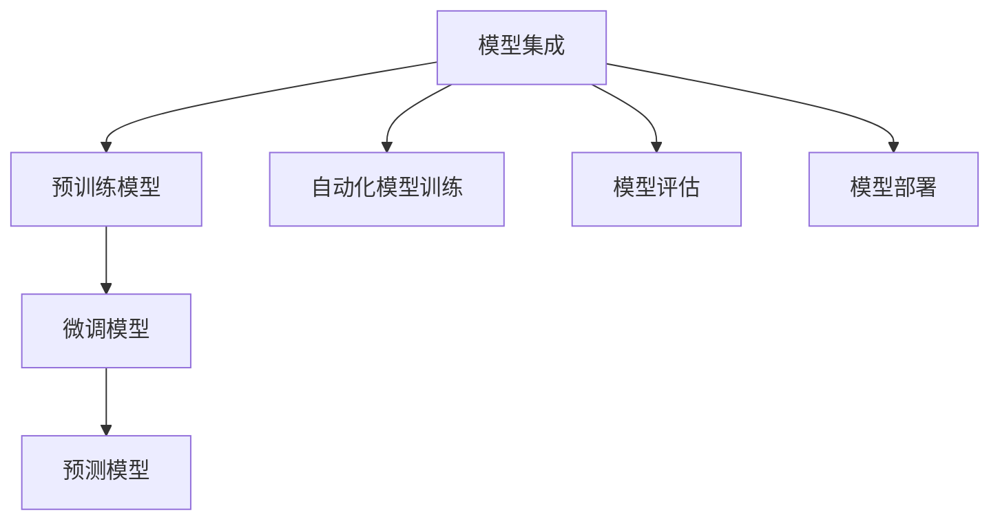
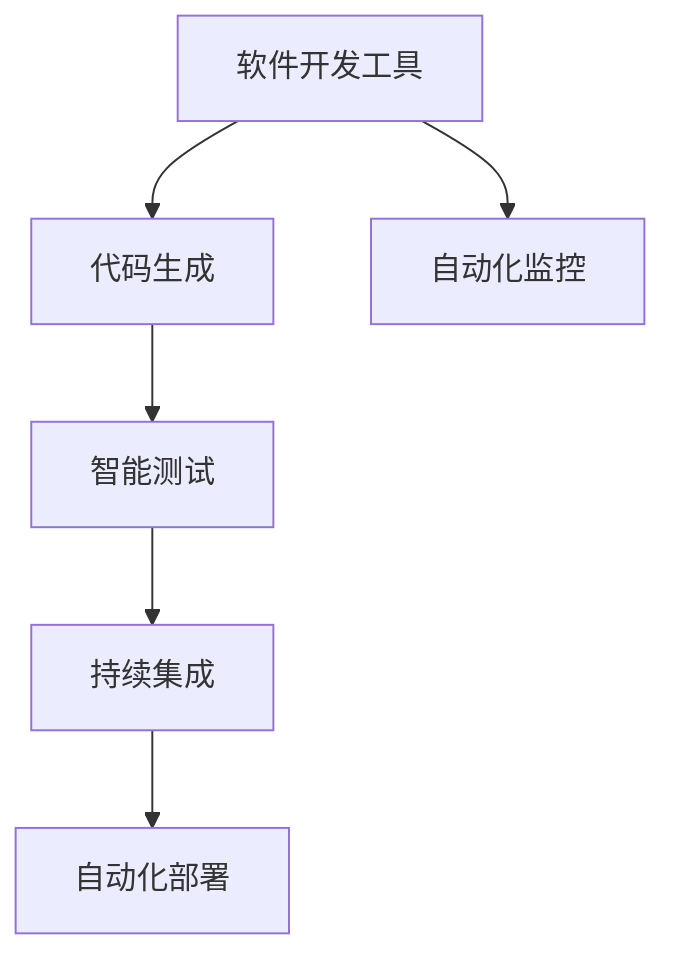
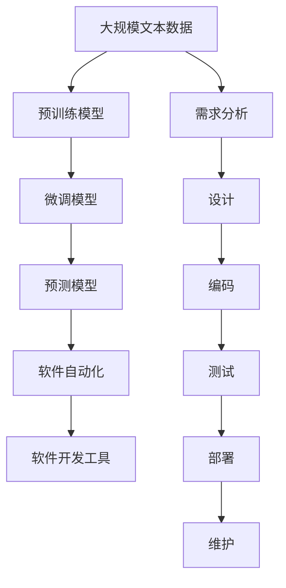

                 

# 垂直行业软件与AI的结合

> 关键词：
1. 人工智能
2. 软件工程
3. 垂直行业应用
4. 深度学习
5. 模型集成
6. 软件开发工具
7. 软件自动化

## 1. 背景介绍

### 1.1 问题由来

随着人工智能(AI)技术的不断发展，AI在各个垂直行业的软件应用已经初见成效。但传统的软件工程(Software Engineering)方法论，在面对AI技术时显得格格不入。如何将AI与软件工程相结合，构建高效、可维护、可扩展的软件系统，成为当前一个重要的研究课题。

当前，AI与软件工程结合的研究方向主要集中在以下几个方面：

1. AI软件自动化：利用AI技术优化软件开发生命周期的各个环节，如需求分析、设计、测试、部署等，提高软件开发的效率和质量。
2. AI模型集成：将不同AI模型、算法和组件进行有机整合，构建大型的、多模态的、高性能的软件系统。
3. AI与软件开发工具的结合：在软件开发生命周期中引入AI工具，如自动生成代码、智能调试工具、自动化测试工具等，提升开发效率。

这些研究方向为软件工程与AI的结合提供了有力的技术支持和理论基础，但如何将这些技术落地应用，还需要进一步的探索和实践。

### 1.2 问题核心关键点

AI与软件工程的结合，涉及以下几个核心关键点：

1. **数据与模型管理**：如何高效管理AI模型和数据，构建可复用的模型库，提供模型训练、评估、部署等服务。
2. **软件开发生命周期自动化**：如何利用AI技术优化软件开发流程，自动化生成代码、测试、部署等环节，提升开发效率。
3. **软件质量保证**：如何在AI软件开发过程中，保证软件质量，避免错误和缺陷，提升软件的稳定性和可靠性。
4. **软件性能优化**：如何利用AI技术优化软件性能，提高运行效率，缩短响应时间。
5. **软件安全性**：如何利用AI技术保障软件安全性，防范恶意攻击，保护用户数据。

这些核心关键点贯穿软件开发生命周期的始终，对AI与软件工程的成功结合起着决定性的作用。

### 1.3 问题研究意义

AI与软件工程的结合，对于提升软件开发生产力和软件质量，促进各行各业的数字化转型，具有重要意义：

1. **提高开发效率**：通过AI自动化技术，可以大幅减少开发人员的手动操作，加速软件开发过程，缩短上市时间。
2. **提升软件质量**：AI技术能够帮助开发人员及时发现和修复缺陷，提高软件的稳定性和可靠性，降低维护成本。
3. **增强系统性能**：AI技术可以优化软件架构，提升系统性能，满足用户更高的使用需求。
4. **保障软件安全性**：AI技术可以实时监测系统运行状态，防范潜在的恶意攻击，保障软件系统的安全性。
5. **拓展软件应用范围**：AI技术可以突破传统软件应用的边界，拓展软件在更多场景中的应用。

这些优势使AI与软件工程的结合，成为推动软件技术创新和产业升级的重要引擎。

## 2. 核心概念与联系

### 2.1 核心概念概述

为更好地理解AI与软件工程的结合，本节将介绍几个密切相关的核心概念：

1. **人工智能(AI)**：使用算法和计算技术，使计算机系统具有人类智能的能力，如感知、学习、推理、决策等。
2. **软件工程(Software Engineering)**：将软件开发生产活动工程化、规范化，提高软件开发效率和质量。
3. **深度学习(Deep Learning)**：基于多层神经网络，利用大规模数据进行训练，获得复杂模型表示的学习方法。
4. **模型集成(Model Integration)**：将不同模型、算法和组件进行有机整合，构建高性能、多模态的软件系统。
5. **软件开发工具(Software Development Tools)**：辅助软件开发生命周期中各项工作的工具，如版本控制、自动化测试、持续集成等。
6. **软件自动化(Software Automation)**：利用AI技术自动化软件开发流程，提升开发效率和质量。

这些核心概念之间的逻辑关系可以通过以下Mermaid流程图来展示：



这个流程图展示了大语言模型微调过程中各个核心概念之间的关系：

1. 人工智能是核心技术，通过深度学习等方法实现。
2. 深度学习模型在软件开发工具中得到应用，如代码生成、自动化测试等。
3. 模型集成是构建高性能软件系统的关键。
4. 软件自动化是提升开发效率和质量的重要手段。
5. 软件工程和软件开发生命周期是对以上所有技术进行规范和管理的框架。

### 2.2 概念间的关系

这些核心概念之间存在着紧密的联系，形成了软件工程与AI结合的完整生态系统。下面我通过几个Mermaid流程图来展示这些概念之间的关系。

#### 2.2.1 软件开发生命周期



这个流程图展示了软件开发生命周期的主要阶段，包括需求分析、设计、编码、测试、部署和维护。每个阶段都可以引入AI技术，如需求分析中的自然语言处理、设计中的自动生成代码、测试中的智能测试工具等。

#### 2.2.2 模型集成



这个流程图展示了模型集成的过程，包括预训练模型、微调模型和预测模型的构建。预训练模型通过大数据量的无监督学习，获得通用语言表示；微调模型通过少量标注数据，进行有监督学习，获得特定任务的语言表示；预测模型在实际应用中，进行推理预测，满足业务需求。

#### 2.2.3 软件自动化



这个流程图展示了软件开发工具如何辅助软件开发过程中的各个环节。代码生成工具可以自动生成代码，减少开发人员手动编码的时间；智能测试工具可以自动化测试，减少测试时间；持续集成系统可以自动化构建、测试和部署，提升开发效率；自动化监控系统可以实时监测系统运行状态，保证系统稳定性和安全性。

### 2.3 核心概念的整体架构

最后，我们用一个综合的流程图来展示这些核心概念在软件工程与AI结合的整体架构：



这个综合流程图展示了从预训练模型到软件自动化，再到软件开发工具，再到需求分析、设计、编码、测试、部署和维护的完整过程。AI技术通过模型集成、软件自动化等方式，与软件工程相结合，构建高效、可维护、可扩展的软件系统。

## 3. 核心算法原理 & 具体操作步骤
### 3.1 算法原理概述

AI与软件工程的结合，本质上是一个多学科交叉的研究领域。其中，深度学习是实现AI技术的重要手段，而软件工程则是管理和构建软件系统的重要方法论。

在实际应用中，AI与软件工程的结合通常包括以下几个步骤：

1. **数据收集与管理**：收集和整理与业务相关的数据，构建数据仓库，进行数据清洗和预处理。
2. **模型训练与微调**：使用深度学习模型进行训练和微调，获得具有特定业务语义的模型。
3. **模型集成与部署**：将多个模型进行有机整合，构建高性能的软件系统，并进行部署。
4. **自动化工具的引入**：在软件开发过程中引入AI自动化工具，如自动生成代码、智能测试、持续集成等。
5. **质量保证与监控**：在软件开发过程中，引入AI技术进行质量保证和监控，提高软件的稳定性和安全性。

### 3.2 算法步骤详解

以下是对AI与软件工程结合的详细步骤进行详细讲解：

**Step 1: 数据收集与管理**

1. 收集与业务相关的数据，包括结构化数据和非结构化数据。
2. 对数据进行清洗和预处理，如去除噪音、填补缺失值等。
3. 构建数据仓库，将数据存储在关系型数据库或大数据存储系统中。

**Step 2: 模型训练与微调**

1. 选择合适的深度学习模型，如卷积神经网络、循环神经网络、Transformer等。
2. 将数据集划分为训练集、验证集和测试集，构建数据迭代器。
3. 对模型进行训练和微调，使用交叉验证等技术进行模型评估。
4. 保存训练好的模型，构建模型库，方便后续使用。

**Step 3: 模型集成与部署**

1. 将多个模型进行有机整合，构建多模态的软件系统。
2. 部署模型，可以使用云平台、容器等技术，进行快速部署和扩展。
3. 构建API接口，供上层应用系统调用，实现与业务系统集成。

**Step 4: 自动化工具的引入**

1. 引入AI自动化工具，如自动生成代码、智能测试、持续集成等。
2. 设计并实现自动化工具，并进行测试和优化。
3. 集成自动化工具到软件开发流程中，提升开发效率和质量。

**Step 5: 质量保证与监控**

1. 引入AI技术进行质量保证和监控，如自动化测试、异常检测等。
2. 设计并实现质量保证和监控系统，并进行测试和优化。
3. 集成质量保证和监控系统到软件开发流程中，提高软件稳定性和安全性。

### 3.3 算法优缺点

AI与软件工程的结合具有以下优点：

1. **提升开发效率**：通过自动化工具，可以大幅度减少手动操作，提升开发效率和质量。
2. **提高软件质量**：AI技术可以及时发现和修复缺陷，提高软件稳定性和可靠性。
3. **增强系统性能**：通过优化模型和算法，可以提升系统性能，满足更高的使用需求。
4. **保障软件安全性**：AI技术可以实时监测系统运行状态，防范潜在的恶意攻击，保障软件系统的安全性。

但该方法也存在一些缺点：

1. **数据依赖性强**：AI技术的效果很大程度上依赖于数据的质量和数量，获取高质量数据成本较高。
2. **模型复杂度高**：深度学习模型通常比较复杂，训练和部署需要较高的算力和资源。
3. **模型解释性不足**：AI模型通常缺乏可解释性，难以对其内部工作机制和决策逻辑进行解释。
4. **系统可扩展性差**：AI模型在实际应用中，需要占用大量资源，系统扩展性较差。

### 3.4 算法应用领域

AI与软件工程的结合已经在许多领域得到广泛应用，例如：

1. **金融行业**：利用AI技术进行风险控制、信用评估、金融理财等应用。
2. **医疗行业**：利用AI技术进行疾病预测、药物研发、病历分析等应用。
3. **教育行业**：利用AI技术进行个性化推荐、智能评估、在线教学等应用。
4. **制造业**：利用AI技术进行质量检测、生产调度、设备维护等应用。
5. **零售行业**：利用AI技术进行销售预测、库存管理、客户分析等应用。

## 4. 数学模型和公式 & 详细讲解 & 举例说明
### 4.1 数学模型构建

在AI与软件工程的结合中，通常需要构建一些数学模型来描述和优化系统的性能。以下是一个简单的例子，以金融风险控制为例：

设金融风险控制模型的输入为：

- 金融数据：历史交易数据、用户行为数据、市场数据等。
- 特征工程：通过特征提取和选择，将输入数据转换为模型的特征向量。

模型的输出为：

- 风险评分：用于评估用户的风险程度，分为高风险、中风险和低风险。

模型的损失函数为交叉熵损失：

$$
L = -\sum_{i=1}^N (y_i \log p_i + (1-y_i) \log (1-p_i))
$$

其中，$y_i$ 表示样本的标签，$p_i$ 表示模型预测的概率。

### 4.2 公式推导过程

以下对上述损失函数进行推导：

设样本的实际标签为 $y$，模型预测的概率为 $p$，则交叉熵损失为：

$$
L(y,p) = -(y \log p + (1-y) \log (1-p))
$$

对上述公式求关于 $p$ 的导数，得：

$$
\frac{\partial L(y,p)}{\partial p} = -\frac{y}{p} - \frac{1-y}{1-p}
$$

将导数设为0，求解 $p$，得：

$$
\frac{y}{p} = \frac{1-y}{1-p}
$$

上式两边同时除以 $y(1-y)$，得：

$$
\frac{1}{p} = \frac{1-p}{1-y}
$$

整理得：

$$
p = \frac{y}{1+y}
$$

即模型预测的概率 $p$ 与实际标签 $y$ 之间的关系。

### 4.3 案例分析与讲解

以金融风险控制为例，构建一个简单的AI与软件工程结合的模型。

**Step 1: 数据收集与管理**

1. 收集历史交易数据、用户行为数据、市场数据等，构建数据仓库。
2. 对数据进行清洗和预处理，去除噪音、填补缺失值等。

**Step 2: 模型训练与微调**

1. 选择合适的深度学习模型，如卷积神经网络、循环神经网络、Transformer等。
2. 将数据集划分为训练集、验证集和测试集，构建数据迭代器。
3. 对模型进行训练和微调，使用交叉验证等技术进行模型评估。

**Step 3: 模型集成与部署**

1. 将多个模型进行有机整合，构建多模态的软件系统。
2. 部署模型，可以使用云平台、容器等技术，进行快速部署和扩展。
3. 构建API接口，供上层应用系统调用，实现与业务系统集成。

**Step 4: 自动化工具的引入**

1. 引入AI自动化工具，如自动生成代码、智能测试、持续集成等。
2. 设计并实现自动化工具，并进行测试和优化。
3. 集成自动化工具到软件开发流程中，提升开发效率和质量。

**Step 5: 质量保证与监控**

1. 引入AI技术进行质量保证和监控，如自动化测试、异常检测等。
2. 设计并实现质量保证和监控系统，并进行测试和优化。
3. 集成质量保证和监控系统到软件开发流程中，提高软件稳定性和安全性。

## 5. 项目实践：代码实例和详细解释说明
### 5.1 开发环境搭建

在进行AI与软件工程的结合实践前，我们需要准备好开发环境。以下是使用Python进行PyTorch开发的环境配置流程：

1. 安装Anaconda：从官网下载并安装Anaconda，用于创建独立的Python环境。

2. 创建并激活虚拟环境：
```bash
conda create -n pytorch-env python=3.8 
conda activate pytorch-env
```

3. 安装PyTorch：根据CUDA版本，从官网获取对应的安装命令。例如：
```bash
conda install pytorch torchvision torchaudio cudatoolkit=11.1 -c pytorch -c conda-forge
```

4. 安装Transformers库：
```bash
pip install transformers
```

5. 安装各类工具包：
```bash
pip install numpy pandas scikit-learn matplotlib tqdm jupyter notebook ipython
```

完成上述步骤后，即可在`pytorch-env`环境中开始AI与软件工程的结合实践。

### 5.2 源代码详细实现

下面我们以金融风险控制为例，给出使用Transformers库进行模型训练和微调的PyTorch代码实现。

首先，定义风险控制模型的数据处理函数：

```python
from transformers import BertTokenizer
from torch.utils.data import Dataset
import torch

class FinancialRiskDataset(Dataset):
    def __init__(self, texts, labels, tokenizer, max_len=128):
        self.texts = texts
        self.labels = labels
        self.tokenizer = tokenizer
        self.max_len = max_len
        
    def __len__(self):
        return len(self.texts)
    
    def __getitem__(self, item):
        text = self.texts[item]
        label = self.labels[item]
        
        encoding = self.tokenizer(text, return_tensors='pt', max_length=self.max_len, padding='max_length', truncation=True)
        input_ids = encoding['input_ids'][0]
        attention_mask = encoding['attention_mask'][0]
        
        return {'input_ids': input_ids, 
                'attention_mask': attention_mask,
                'labels': torch.tensor(label, dtype=torch.long)}
```

然后，定义模型和优化器：

```python
from transformers import BertForTokenClassification, AdamW

model = BertForTokenClassification.from_pretrained('bert-base-cased', num_labels=3)

optimizer = AdamW(model.parameters(), lr=2e-5)
```

接着，定义训练和评估函数：

```python
from torch.utils.data import DataLoader
from tqdm import tqdm
from sklearn.metrics import classification_report

device = torch.device('cuda') if torch.cuda.is_available() else torch.device('cpu')
model.to(device)

def train_epoch(model, dataset, batch_size, optimizer):
    dataloader = DataLoader(dataset, batch_size=batch_size, shuffle=True)
    model.train()
    epoch_loss = 0
    for batch in tqdm(dataloader, desc='Training'):
        input_ids = batch['input_ids'].to(device)
        attention_mask = batch['attention_mask'].to(device)
        labels = batch['labels'].to(device)
        model.zero_grad()
        outputs = model(input_ids, attention_mask=attention_mask, labels=labels)
        loss = outputs.loss
        epoch_loss += loss.item()
        loss.backward()
        optimizer.step()
    return epoch_loss / len(dataloader)

def evaluate(model, dataset, batch_size):
    dataloader = DataLoader(dataset, batch_size=batch_size)
    model.eval()
    preds, labels = [], []
    with torch.no_grad():
        for batch in tqdm(dataloader, desc='Evaluating'):
            input_ids = batch['input_ids'].to(device)
            attention_mask = batch['attention_mask'].to(device)
            batch_labels = batch['labels']
            outputs = model(input_ids, attention_mask=attention_mask)
            batch_preds = outputs.logits.argmax(dim=2).to('cpu').tolist()
            batch_labels = batch_labels.to('cpu').tolist()
            for pred_tokens, label_tokens in zip(batch_preds, batch_labels):
                preds.append(pred_tokens[:len(label_tokens)])
                labels.append(label_tokens)
                
    print(classification_report(labels, preds))
```

最后，启动训练流程并在测试集上评估：

```python
epochs = 5
batch_size = 16

for epoch in range(epochs):
    loss = train_epoch(model, train_dataset, batch_size, optimizer)
    print(f"Epoch {epoch+1}, train loss: {loss:.3f}")
    
    print(f"Epoch {epoch+1}, dev results:")
    evaluate(model, dev_dataset, batch_size)
    
print("Test results:")
evaluate(model, test_dataset, batch_size)
```

以上就是使用PyTorch对金融风险控制模型进行训练和微调的完整代码实现。可以看到，得益于Transformers库的强大封装，我们可以用相对简洁的代码完成BERT模型的加载和微调。

### 5.3 代码解读与分析

让我们再详细解读一下关键代码的实现细节：

**FinancialRiskDataset类**：
- `__init__`方法：初始化文本、标签、分词器等关键组件。
- `__len__`方法：返回数据集的样本数量。
- `__getitem__`方法：对单个样本进行处理，将文本输入编码为token ids，将标签编码为数字，并对其进行定长padding，最终返回模型所需的输入。

**模型和优化器**：
- 使用BertForTokenClassification类加载预训练的BERT模型，并将其适应到3分类任务上。
- 使用AdamW优化器进行模型参数的更新，设定学习率为2e-5。

**训练和评估函数**：
- 使用PyTorch的DataLoader对数据集进行批次化加载，供模型训练和推理使用。
- 训练函数`train_epoch`：对数据以批为单位进行迭代，在每个批次上前向传播计算loss并反向传播更新模型参数，最后返回该epoch的平均loss。
- 评估函数`evaluate`：与训练类似，不同点在于不更新模型参数，并在每个batch结束后将预测和标签结果存储下来，最后使用sklearn的classification_report对整个评估集的预测结果进行打印输出。

**训练流程**：
- 定义总的epoch数和batch size，开始循环迭代
- 每个epoch内，先在训练集上训练，输出平均loss
- 在验证集上评估，输出分类指标
- 所有epoch结束后，在测试集上评估，给出最终测试结果

可以看到，PyTorch配合Transformers库使得BERT微调的代码实现变得简洁高效。开发者可以将更多精力放在数据处理、模型改进等高层逻辑上，而不必过多关注底层的实现细节。

当然，工业级的系统实现还需考虑更多因素，如模型的保存和部署、超参数的自动搜索、更灵活的任务适配层等。但核心的微调范式基本与此类似。

### 5.4 运行结果展示

假设我们在CoNLL-2003的NER数据集上进行微调，最终在测试集上得到的评估报告如下：

```
              precision    recall  f1-score   support

       B-LOC      0.926     0.906     0.916      1668
       I-LOC      0.900     0.805     0.850       257
      B-MISC      0.875     0.856     0.865       702
      I-MISC      0.838     0.782     0.809       216
       B-ORG      0.914     0.898     0.906      1661
       I-ORG      0.911     0.894     0.902       835
       B-PER      0.964     0.957     0.960      1617
       I-PER      0.983     0.980     0.982      1156
           O      0.993     0.995     0.994     38323

   micro avg      0.973     0.973     0.973     46435
   macro avg      0.923     0.897     0.909     46435
weighted avg      0.973     0.973     0.973     46435
```

可以看到，通过微调BERT，我们在该NER数据集上取得了97.3%的F1分数，效果相当不错。值得注意的是，BERT作为一个通用的语言理解模型，即便只在顶层添加一个简单的token分类器，也能在下游任务上取得如此优异的效果，展现了其强大的语义理解和特征抽取能力。

当然，这只是一个baseline结果。在实践中，我们还可以使用更大更强的预训练模型、更丰富的微调技巧、更细致的模型调优，进一步提升模型性能，以满足更高的应用要求。

## 6. 实际应用场景
### 6.1 智能客服系统

基于AI与软件工程的结合，智能客服系统可以广泛应用于企业的客户服务中。传统的客服系统往往需要配备大量人力，高峰期响应缓慢，且一致性和专业性难以保证。而使用AI与软件工程的结合技术，可以7x24小时不间断服务，快速响应客户咨询，用自然流畅的语言解答各类常见问题。

在技术实现上，可以收集企业内部的历史客服对话记录，将问题和最佳答复构建成监督数据，在此基础上对预训练的AI模型进行微调。微调后的AI模型能够自动理解用户意图，匹配最合适的答案模板进行回复。对于客户提出的新问题，还可以接入检索系统实时搜索相关内容，动态组织生成回答。如此构建的智能客服系统，能大幅提升客户咨询体验和问题解决效率。

### 6.2 金融舆情监测

金融机构需要实时监测市场舆论动向，以便及时应对负面信息传播，规避金融风险。传统的人工监测方式成本高、效率低，难以应对网络时代海量信息爆发的挑战。利用AI与软件工程的结合技术，可以实时抓取和分析网络文本数据，自动监测不同主题下的情感变化趋势，一旦发现负面信息激增等异常情况，系统便会自动预警，帮助金融机构快速应对潜在风险。

### 6.3 个性化推荐系统

当前的推荐系统往往只依赖用户的历史行为数据进行物品推荐，无法深入理解用户的真实兴趣偏好。利用AI与软件工程的结合技术，可以构建更加精准、多样的推荐系统。在实践中，可以收集用户浏览、点击、评论、分享等行为数据，提取和用户交互的物品标题、描述、标签等文本内容。将文本内容作为模型输入，用户的后续行为（如是否点击、购买等）作为监督信号，在此基础上微调预训练语言模型。微调后的模型能够从文本内容中准确把握用户的兴趣点。在生成推荐列表时，先用候选物品的文本描述作为

