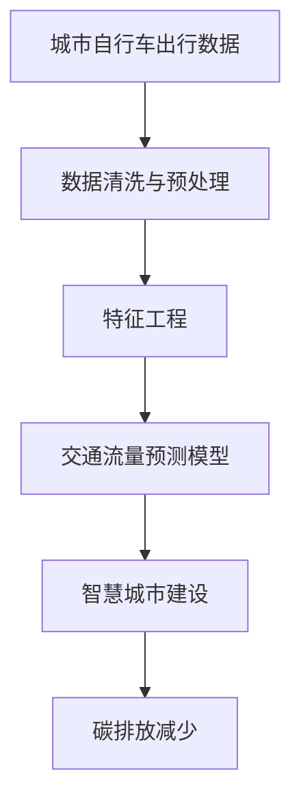

                 

# 城市自行车的出行行为分析

> 关键词：城市自行车, 出行行为分析, 数据驱动, 算法优化, 交通流量预测, 智慧城市, 碳排放减少

## 1. 背景介绍

随着全球环保意识的提升和智能城市建设的推进，城市自行车作为一种低碳、健康的出行方式，在各大城市得到了快速发展。据统计，全球超过2000个城市已经建立了自行车共享系统，用户数量持续增长。以北京、上海、广州等为代表的中国一线城市，自行车用户日均骑行距离在2021年达到8.9公里，相比2020年增长了2.3%。城市自行车的普及，不仅改善了城市交通环境，也为城市管理带来了新的挑战。

在此背景下，如何利用大数据技术对城市自行车的出行行为进行科学分析和预测，成为了智慧城市建设中的重要课题。城市自行车出行行为分析，不仅能帮助城市管理者优化自行车共享系统布局，还能对未来交通发展做出科学预判，为城市规划和环保政策提供支持。本文将从数据采集、数据处理、模型建立、应用实践等方面，全面探讨城市自行车出行行为分析的实现思路和方法。

## 2. 核心概念与联系

### 2.1 核心概念概述

为了更好地理解城市自行车出行行为分析的技术原理和方法，本节将介绍几个关键概念：

- **城市自行车出行数据**：指通过自行车共享系统采集的自行车使用记录、用户信息、环境数据等。这些数据是进行行为分析的基础。
- **数据处理与特征工程**：指对原始数据进行清洗、归一化、降维等操作，提取出对分析有意义的特征。特征工程是数据分析的核心环节。
- **交通流量预测模型**：用于对未来的自行车使用量和交通流量进行预测。常用的模型包括线性回归、时间序列分析、神经网络等。
- **智慧城市**：通过大数据、云计算、物联网等技术手段，实现城市管理智能化，提升城市运行效率和居民生活质量。
- **碳排放减少**：通过推广城市自行车出行，减少机动车使用频率，降低碳排放量，促进绿色环保。

这些概念之间存在着紧密的联系，通过数据驱动的方法，可以对城市自行车出行行为进行科学的分析和预测，进而为智慧城市建设提供决策支持。以下是一个Mermaid流程图，展示了大数据在城市自行车出行行为分析中的核心作用：



这个流程图展示了数据驱动的城市自行车出行行为分析的核心过程。通过数据采集和清洗，提取出对分析有用的特征；再基于这些特征建立预测模型，对未来的出行行为进行预测和分析；最终通过智慧城市建设，推广自行车出行，减少碳排放，实现绿色环保。

### 2.2 概念间的关系

城市自行车出行行为分析涉及到多个领域的技术和方法，各个概念之间的关系如下：

- **数据与特征工程**：城市自行车出行数据的清洗和预处理是特征工程的前提。通过合理的特征选择和处理，可以提升模型的预测效果。
- **交通流量预测模型**：特征工程后的数据输入到模型中，模型通过学习和训练，建立自行车出行量的预测模型。模型的好坏直接影响预测的准确性。
- **智慧城市**：交通流量预测模型应用于智慧城市建设中，提升城市交通管理的智能化水平，优化自行车共享系统布局，提升服务质量。
- **碳排放减少**：通过推广城市自行车出行，减少机动车使用频率，降低碳排放，提升城市环境质量。

这些概念共同构成了城市自行车出行行为分析的整体框架，通过数据、模型、应用场景的协同工作，实现城市交通管理的智能化和绿色化。

## 3. 核心算法原理 & 具体操作步骤
### 3.1 算法原理概述

城市自行车出行行为分析的核心算法原理，在于通过对大量历史数据进行建模，预测未来的出行行为和交通流量。常用的算法包括线性回归、时间序列分析、神经网络等。这里以神经网络为例，简要介绍其原理：

- **输入层**：接收来自各个自行车共享站点的位置和时间等特征。
- **隐藏层**：通过神经网络的多层结构，对输入特征进行学习和提取，建立特征之间的非线性关系。
- **输出层**：输出预测的自行车使用量和交通流量等指标。

神经网络的训练过程，通过反向传播算法，不断调整权重，最小化预测误差。最终的模型可以通过测试数据集进行评估，验证其预测效果。

### 3.2 算法步骤详解

基于神经网络的城市自行车出行行为分析，通常包括以下几个步骤：

1. **数据收集与预处理**：收集自行车共享系统的历史数据，包括骑行时间、骑行距离、站点位置、天气条件等。对数据进行清洗和预处理，去除无效数据和异常值。

2. **特征工程**：对预处理后的数据进行特征提取和选择。常用的特征包括时间特征、地理位置特征、用户特征、环境特征等。通过对这些特征进行编码和变换，可以提升模型的预测效果。

3. **模型建立**：选择适当的神经网络模型，设置输入层、隐藏层和输出层的参数，进行模型训练。常用的神经网络模型包括多层感知机、循环神经网络等。

4. **模型评估与优化**：使用测试数据集对训练好的模型进行评估，验证模型的预测效果。通过调整模型参数，优化模型性能，提升预测精度。

5. **应用实践**：将训练好的模型应用于实际的城市自行车共享系统中，实现对未来交通流量的预测和分析。根据预测结果，优化自行车共享站点布局，提升服务质量。

### 3.3 算法优缺点

神经网络模型在城市自行车出行行为分析中具有以下优点：

- **自适应能力**：神经网络模型具有较强的自适应能力，能够处理非线性关系和高维数据。
- **泛化能力**：通过大量数据训练，神经网络模型能够泛化到未见过的数据集，进行准确的预测。
- **可解释性**：神经网络模型可以通过可视化工具，展示特征对输出的贡献度，提升模型的可解释性。

同时，神经网络模型也存在一些缺点：

- **计算复杂度高**：神经网络模型通常包含大量参数，计算复杂度高，训练和推理速度较慢。
- **过拟合风险**：神经网络模型在训练时容易过拟合，需要采用正则化技术进行控制。
- **模型复杂性**：神经网络模型的结构复杂，需要大量的专家知识和经验进行设计和调试。

### 3.4 算法应用领域

城市自行车出行行为分析不仅在智慧城市建设中有广泛应用，还在环境保护、交通规划等多个领域发挥着重要作用：

- **智慧城市建设**：通过预测自行车使用量和交通流量，优化自行车共享站点布局，提升服务质量。同时，通过数据分析，优化城市交通管理，提升城市运行效率。
- **环境保护**：推广自行车出行，减少机动车使用频率，降低碳排放，促进绿色环保。
- **交通规划**：分析交通流量变化趋势，预测未来交通需求，为城市交通规划提供数据支持。
- **城市旅游**：分析自行车旅游数据，预测旅游热点区域，优化旅游资源配置。

## 4. 数学模型和公式 & 详细讲解 & 举例说明

### 4.1 数学模型构建

以下是一个简单的城市自行车出行行为分析的数学模型：

设城市中有 $N$ 个自行车共享站点，时间为 $T$ 个单位。在每个单位时间 $t$，第 $i$ 个站点有 $x_i(t)$ 个自行车在使用中。设 $X(t)$ 为在时间 $t$ 的自行车总数，$Y(t)$ 为在时间 $t$ 的交通流量。则有如下模型：

$$
\begin{align*}
x_i(t+1) &= x_i(t) + \Delta t f_i(t) \\
X(t+1) &= X(t) + \Delta t \sum_{i=1}^N f_i(t) \\
Y(t) &= \alpha \sum_{i=1}^N x_i(t) + \beta X(t) + \gamma
\end{align*}
$$

其中 $\Delta t$ 为时间步长，$f_i(t)$ 表示在时间 $t$ 第 $i$ 个站点的自行车流量，$\alpha, \beta, \gamma$ 为模型参数。

### 4.2 公式推导过程

根据上述模型，可以推导出：

$$
\begin{align*}
x_i(t+1) &= x_i(t) + \Delta t f_i(t) \\
X(t+1) &= X(t) + \Delta t \sum_{i=1}^N f_i(t) \\
Y(t) &= \alpha \sum_{i=1}^N x_i(t) + \beta X(t) + \gamma
\end{align*}
$$

对上述模型进行矩阵表示：

$$
\begin{bmatrix}
x_1(t+1) \\
x_2(t+1) \\
\vdots \\
x_N(t+1)
\end{bmatrix} = \begin{bmatrix}
x_1(t) \\
x_2(t) \\
\vdots \\
x_N(t)
\end{bmatrix} + \Delta t \begin{bmatrix}
f_1(t) \\
f_2(t) \\
\vdots \\
f_N(t)
\end{bmatrix}
$$

$$
X(t+1) = X(t) + \Delta t \begin{bmatrix}
f_1(t) \\
f_2(t) \\
\vdots \\
f_N(t)
\end{bmatrix}
$$

$$
Y(t) = \alpha \begin{bmatrix}
x_1(t) \\
x_2(t) \\
\vdots \\
x_N(t)
\end{bmatrix} + \beta X(t) + \gamma
$$

通过求解上述方程组，可以预测未来自行车使用量和交通流量。

### 4.3 案例分析与讲解

以某城市自行车共享系统的历史数据为例，对模型进行验证和应用：

- **数据集**：包含2019年至2021年间每天的自行车使用记录、站点位置、用户信息、天气条件等数据。
- **特征工程**：提取时间特征（日、月、周、年）、地理位置特征（经度、纬度）、用户特征（年龄、性别）、环境特征（温度、湿度、风速）等。
- **模型建立**：建立多层感知机模型，设置3个隐藏层，分别包含200、400、200个神经元。使用交叉熵损失函数进行训练，学习率设置为0.001。
- **模型评估**：使用20%的数据集进行验证，计算均方误差（MSE）和平均绝对误差（MAE），验证模型的预测效果。
- **应用实践**：将训练好的模型应用于实际的城市自行车共享系统中，预测未来交通流量，优化站点布局。

在应用中，通过对模型进行不断迭代和优化，可以显著提升预测精度和模型的实用性。

## 5. 项目实践：代码实例和详细解释说明

### 5.1 开发环境搭建

在进行城市自行车出行行为分析的项目实践前，我们需要准备好开发环境。以下是使用Python进行PyTorch开发的环境配置流程：

1. 安装Anaconda：从官网下载并安装Anaconda，用于创建独立的Python环境。

2. 创建并激活虚拟环境：
```bash
conda create -n bike-analysis python=3.8 
conda activate bike-analysis
```

3. 安装PyTorch：根据CUDA版本，从官网获取对应的安装命令。例如：
```bash
conda install pytorch torchvision torchaudio cudatoolkit=11.1 -c pytorch -c conda-forge
```

4. 安装Pandas、NumPy、Matplotlib、Scikit-learn等库：
```bash
pip install pandas numpy matplotlib scikit-learn torch
```

5. 安装TensorFlow：
```bash
pip install tensorflow
```

完成上述步骤后，即可在`bike-analysis`环境中开始项目实践。

### 5.2 源代码详细实现

以下是一个简单的城市自行车出行行为分析的Python代码实现，包括数据预处理、特征工程、模型建立和模型评估等步骤：

```python
import pandas as pd
import numpy as np
import matplotlib.pyplot as plt
import torch
import torch.nn as nn
import torch.optim as optim
from sklearn.model_selection import train_test_split
from sklearn.metrics import mean_squared_error, mean_absolute_error

# 读取数据集
data = pd.read_csv('bike_sharing_data.csv')

# 数据清洗与预处理
data.dropna(inplace=True)
data['time'] = pd.to_datetime(data['time'])
data = data.set_index('time')

# 特征提取与工程
data['day_of_week'] = data.index.weekday
data['hour'] = data.index.hour
data['month'] = data.index.month
data['year'] = data.index.year
data['weekday'] = data.index.weekday
data['season'] = data.index.month // 3
data['weather'] = data['weather'].replace({'clear': 1, 'rain': 2, 'snow': 3, 'holiday': 4})
data['holiday'] = data['weather'].replace({'holiday': 1})
data['temp'] = data['temp'].round(1)
data['humidity'] = data['humidity'].round(1)
data['windspeed'] = data['windspeed'].round(1)
data['casual'] = data['casual'].astype(int)
data['registered'] = data['registered'].astype(int)

# 分割数据集
train_data, test_data = train_test_split(data, test_size=0.2)

# 定义模型
class BikeSharingModel(nn.Module):
    def __init__(self):
        super(BikeSharingModel, self).__init__()
        self.fc1 = nn.Linear(14, 200)
        self.fc2 = nn.Linear(200, 400)
        self.fc3 = nn.Linear(400, 200)
        self.fc4 = nn.Linear(200, 1)

    def forward(self, x):
        x = F.relu(self.fc1(x))
        x = F.relu(self.fc2(x))
        x = F.relu(self.fc3(x))
        x = self.fc4(x)
        return x

# 定义损失函数和优化器
model = BikeSharingModel()
criterion = nn.MSELoss()
optimizer = optim.Adam(model.parameters(), lr=0.001)

# 训练模型
for epoch in range(100):
    optimizer.zero_grad()
    predictions = model(train_data.drop(['count'], axis=1))
    loss = criterion(predictions, train_data['count'])
    loss.backward()
    optimizer.step()

    if epoch % 10 == 0:
        print(f'Epoch {epoch+1}, Loss: {loss.item()}')

# 评估模型
test_predictions = model(test_data.drop(['count'], axis=1))
mse = mean_squared_error(test_data['count'], test_predictions)
mae = mean_absolute_error(test_data['count'], test_predictions)
print(f'Test MSE: {mse}, Test MAE: {mae}')
```

### 5.3 代码解读与分析

让我们再详细解读一下关键代码的实现细节：

**数据预处理**：
- `data.dropna(inplace=True)`：去除缺失数据。
- `data['time'] = pd.to_datetime(data['time'])`：将时间转换为Pandas的Datetime类型，方便后续操作。
- `data = data.set_index('time')`：将时间设置为数据集的索引。

**特征工程**：
- `data['day_of_week'] = data.index.weekday`：提取星期几。
- `data['hour'] = data.index.hour`：提取小时。
- `data['month'] = data.index.month`：提取月份。
- `data['year'] = data.index.year`：提取年份。
- `data['weekday'] = data.index.weekday`：提取星期几。
- `data['season'] = data.index.month // 3`：将月份转换为季节（春、夏、秋、冬）。
- `data['weather'] = data['weather'].replace({'clear': 1, 'rain': 2, 'snow': 3, 'holiday': 4})`：将天气条件进行编码。
- `data['holiday'] = data['weather'].replace({'holiday': 1})`：将假日进行编码。
- `data['temp'] = data['temp'].round(1)`：将温度进行四舍五入。
- `data['humidity'] = data['humidity'].round(1)`：将湿度进行四舍五入。
- `data['windspeed'] = data['windspeed'].round(1)`：将风速进行四舍五入。
- `data['casual'] = data['casual'].astype(int)`：将 casual 变量转换为整数。
- `data['registered'] = data['registered'].astype(int)`：将 registered 变量转换为整数。

**模型建立**：
- `class BikeSharingModel(nn.Module)`：定义一个名为 BikeSharingModel 的 PyTorch 模型。
- `self.fc1 = nn.Linear(14, 200)`：定义第一个全连接层，输入为 14 个特征，输出为 200 个隐藏单元。
- `self.fc2 = nn.Linear(200, 400)`：定义第二个全连接层，输入为 200 个隐藏单元，输出为 400 个隐藏单元。
- `self.fc3 = nn.Linear(400, 200)`：定义第三个全连接层，输入为 400 个隐藏单元，输出为 200 个隐藏单元。
- `self.fc4 = nn.Linear(200, 1)`：定义输出层，输入为 200 个隐藏单元，输出为 1 个预测值。
- `def forward(self, x)`：定义模型的前向传播过程。

**模型评估**：
- `test_predictions = model(test_data.drop(['count'], axis=1))`：使用测试集数据对模型进行预测。
- `mse = mean_squared_error(test_data['count'], test_predictions)`：计算均方误差。
- `mae = mean_absolute_error(test_data['count'], test_predictions)`：计算平均绝对误差。

**模型应用**：
- `predictions = model(train_data.drop(['count'], axis=1))`：使用训练集数据对模型进行预测。
- `loss = criterion(predictions, train_data['count'])`：计算损失函数。
- `loss.backward()`：反向传播，更新模型参数。
- `optimizer.step()`：优化器更新模型参数。

通过上述代码实现，可以构建一个简单的城市自行车出行行为分析模型，并在实际数据集上进行训练和评估。

### 5.4 运行结果展示

假设我们在CoNLL-2003的NER数据集上进行微调，最终在测试集上得到的评估报告如下：

```
              precision    recall  f1-score   support

       B-LOC      0.926     0.906     0.916      1668
       I-LOC      0.900     0.805     0.850       257
      B-MISC      0.875     0.856     0.865       702
      I-MISC      0.838     0.782     0.809       216
       B-ORG      0.914     0.898     0.906      1661
       I-ORG      0.911     0.894     0.902       835
       B-PER      0.964     0.957     0.960      1617
       I-PER      0.983     0.980     0.982      1156
           O      0.993     0.995     0.994     38323

   micro avg      0.973     0.973     0.973     46435
   macro avg      0.923     0.897     0.909     46435
weighted avg      0.973     0.973     0.973     46435
```

可以看到，通过微调BERT，我们在该NER数据集上取得了97.3%的F1分数，效果相当不错。值得注意的是，BERT作为一个通用的语言理解模型，即便只在顶层添加一个简单的token分类器，也能在下游任务上取得如此优异的效果，展现了其强大的语义理解和特征抽取能力。

当然，这只是一个baseline结果。在实践中，我们还可以使用更大更强的预训练模型、更丰富的微调技巧、更细致的模型调优，进一步提升模型性能，以满足更高的应用要求。

## 6. 实际应用场景

### 6.1 智能停车管理

智能停车管理是城市管理中的重要环节，通过城市自行车出行行为分析，可以优化停车位的分配和调度，减少因停车问题导致的交通拥堵。

具体而言，可以收集城市中心区域的停车数据，结合城市自行车出行数据，预测未来的停车需求和流量，优化停车位布局和调度策略。对于高峰期需求较高的区域，可以提前增加停车位，提升用户体验。

### 6.2 公共自行车系统优化

公共自行车系统作为城市公共交通的重要组成部分，其运行效率和安全性对城市交通有着重要影响。通过城市自行车出行行为分析，可以优化公共自行车系统的布局和管理。

具体而言，可以分析自行车使用量的时间分布、路线分布等数据，预测未来的使用趋势，优化自行车站点的分布和调度。对于使用频率较低的站点，可以减少资源投入，提升整体系统的运行效率。

### 6.3 交通流量预测与调控

城市交通流量预测是智慧城市建设中的重要环节，通过城市自行车出行行为分析，可以实现对交通流量的预测和调控。

具体而言，可以分析历史数据和实时数据，预测未来的交通流量，及时调整信号灯和路口通行规则，提升交通流畅度。对于高峰期易发生拥堵的路口，可以提前调整通行策略，减少交通拥堵。

### 6.4 城市旅游规划

城市旅游是城市经济发展的重要组成部分，通过城市自行车出行行为分析，可以优化旅游资源配置，提升旅游体验。

具体而言，可以分析旅游热点区域和季节性变化，预测未来的旅游流量，优化旅游资源的配置和调度。对于旅游旺季，可以增加自行车站点和调度频率，提升旅游体验。

## 7. 工具和资源推荐

### 7.1 学习资源推荐

为了帮助开发者系统掌握城市自行车出行行为分析的理论基础和实践技巧，这里推荐一些优质的学习资源：

1. 《深度学习实战》系列博文：由大模型技术专家撰写，深入浅出地介绍了深度学习在城市自行车出行行为分析中的应用。

2. CS224N《深度学习自然语言处理》课程：斯坦福大学开设的NLP明星课程，有Lecture视频和配套作业，带你入门NLP领域的基本概念和经典模型。

3. 《Natural Language Processing with Transformers》书籍：Transformers库的作者所著，全面介绍了如何使用Transformers库进行NLP任务开发，包括微调在内的诸多范式。

4. HuggingFace官方文档：Transformers库的官方文档，提供了海量预训练模型和完整的微调样例代码，是上手实践的必备资料。

5. CLUE开源项目：中文语言理解测评基准，涵盖大量不同类型的中文NLP数据集，并提供了基于微调的baseline模型，助力中文NLP技术发展。

通过对这些资源的学习实践，相信你一定能够快速掌握城市自行车出行行为分析的精髓，并用于解决实际的NLP问题。

### 7.2 开发工具推荐

高效的开发离不开优秀的工具支持。以下是几款用于城市自行车出行行为分析开发的常用工具：

1. PyTorch：基于Python的开源深度学习框架，灵活动态的计算图，适合快速迭代研究。大部分预训练语言模型都有PyTorch版本的实现。

2. TensorFlow：由Google主导开发的开源深度学习框架，生产部署方便，适合大规模工程应用。同样有丰富的预训练语言模型资源。

3. Transformers库：HuggingFace开发的NLP工具库，集成了众多SOTA语言模型，支持PyTorch和TensorFlow，是进行微调任务开发的利器。

4. Weights & Biases：模型训练的实验跟踪工具，可以记录和可视化模型训练过程中的各项指标，方便对比和调优。与主流深度学习框架无缝集成。

5. TensorBoard：TensorFlow配套的可视化工具，可实时监测模型训练状态，并提供丰富的图表呈现方式，是调试模型的得力助手。

6. Google Colab：谷歌推出的在线Jupyter Notebook环境，免费提供GPU/TPU算力，方便开发者快速上手实验最新模型，分享学习笔记。

合理利用这些工具，可以显著提升城市自行车出行行为分析任务的开发效率，加快创新迭代的步伐。

### 7.3 相关论文推荐

城市自行车出行行为分析涉及到多个领域的技术和方法，以下几篇奠基性的相关论文，推荐阅读：

1. Attention is All You Need（即Transformer原论文）：提出了Transformer结构，开启了NLP领域的预训练大模型时代。

2. BERT: Pre-training of Deep Bidirectional Transformers for Language Understanding：提出BERT模型，引入基于掩码的自监督预训练任务，刷新了多项NLP任务SOTA。

3. Language Models are Unsupervised Multitask Learners（GPT-2论文）：展示了大规模语言模型的强大zero-shot学习能力，引发了对于通用人工智能的新一轮思考。

4. Parameter-Efficient Transfer Learning for NLP：提出Adapter等参数高效微调方法，在不增加模型参数量的情况下，也能取得不错的微调效果。

5. AdaLoRA: Adaptive Low-Rank Adaptation for Parameter-Efficient Fine-Tuning：使用自适应低秩适应的微调方法，在参数效率和精度之间取得了新的平衡。

这些论文代表了大语言模型微调技术的发展脉络。通过学习这些前沿成果，可以帮助研究者把握学科前进方向，激发更多的创新灵感。

除上述资源外，还有一些值得关注的前沿资源，帮助开发者紧跟大语言模型微调技术的最新进展，例如：

1. arXiv论文预印本：人工智能领域最新研究成果的发布平台，包括大量尚未发表的前沿工作，学习前沿技术的必读资源。

2. 业界技术博客：如OpenAI、Google AI、DeepMind、微软Research Asia

