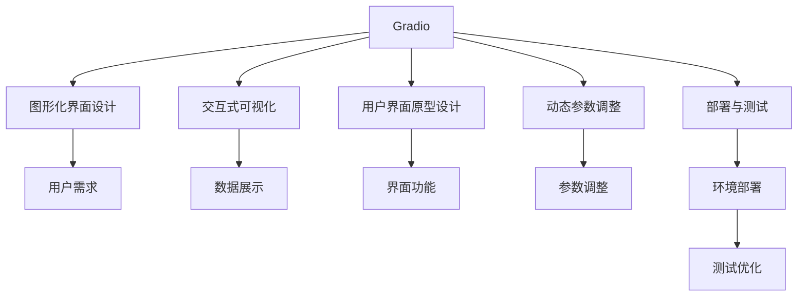

                 

# 基于 Gradio 的图形化界面设计与实现

> 关键词：
- Gradio
- 图形化界面设计
- 交互式可视化
- 用户界面原型设计
- 动态参数调整
- 部署与测试

## 1. 背景介绍

### 1.1 问题由来

随着人工智能技术的日益普及，越来越多的人开始尝试使用各种AI工具来提升工作效率。然而，在实际使用过程中，许多人依然面临着以下挑战：

- **学习门槛高**：大多数AI工具需要用户具备一定的编程和数据处理能力，对于非技术用户来说，门槛较高。
- **用户体验差**：复杂的命令行界面和过于专业的技术术语，导致用户使用体验不佳。
- **部署复杂**：许多AI工具需要用户自己搭建环境和调试，部署过程繁琐且容易出错。

为了解决这些问题，一个简单有效的方案是：**使用图形化界面(GUI)来简化AI工具的使用过程**。图形化界面直观易用，能够降低用户的使用门槛，提升用户体验。同时，图形化界面还能够提供更直观的数据可视化，帮助用户更好地理解AI模型的运行结果。

### 1.2 问题核心关键点

为了设计一个优秀的图形化界面，需要关注以下几个核心关键点：

- **用户需求**：了解目标用户的需求和使用场景，设计出符合用户期望的界面。
- **界面交互**：设计简洁直观的界面交互，确保用户能够轻松地使用AI工具。
- **数据可视化**：通过直观的图形展示，让用户能够更容易地理解数据和结果。
- **动态调整**：提供动态参数调整功能，使界面能够根据用户需求灵活变化。
- **快速部署**：实现快速部署，使用户能够快速地使用AI工具。

## 2. 核心概念与联系

### 2.1 核心概念概述

为了更好地理解基于 Gradio 的图形化界面设计与实现，我们将介绍几个相关的核心概念：

- **Gradio**：一个用于创建交互式可视化的Python库，支持多种界面组件和数据展示方式。
- **图形化界面(GUI)**：一种通过图形界面与用户交互的方式，通常用于降低用户的使用门槛，提升用户体验。
- **交互式可视化**：通过动态生成的图形展示数据和模型结果，帮助用户更好地理解和使用AI工具。
- **用户界面(UI)原型设计**：在设计图形化界面之前，需要明确界面的目标和功能，制定详细的设计方案。
- **动态参数调整**：通过提供灵活的参数调整界面，让用户能够根据实际需求快速修改界面参数。
- **部署与测试**：将设计的界面部署到实际环境中，并进行全面的测试和优化。

这些概念之间的逻辑关系可以通过以下Mermaid流程图来展示：



这个流程图展示了基于 Gradio 的图形化界面设计与实现的基本流程：

1. 通过Gradio创建一个交互式可视化界面。
2. 根据用户需求和界面功能设计用户界面(UI)。
3. 使用Gradio的组件库动态生成图形化界面。
4. 提供动态参数调整功能，使界面能够根据用户需求变化。
5. 将设计好的界面部署到实际环境中，并进行全面的测试和优化。

### 2.2 概念间的关系

这些核心概念之间存在着紧密的联系，构成了基于 Gradio 的图形化界面设计与实现的整体框架。下面我们通过几个Mermaid流程图来展示这些概念之间的关系。

#### 2.2.1 Gradio与用户界面(UI)设计

```mermaid
graph LR
    A[Gradio] --> B[用户界面(UI)设计]
    B --> C[界面原型设计]
    C --> D[界面元素选择]
    D --> E[组件定制]
```

这个流程图展示了Gradio与用户界面(UI)设计的基本关系：

1. 通过Gradio创建一个基本的界面原型设计。
2. 根据用户需求选择适当的界面元素和组件。
3. 通过自定义组件的方式，实现具体的界面功能。

#### 2.2.2 交互式可视化与数据展示


这个流程图展示了交互式可视化与数据展示的关系：

1. 通过交互式可视化展示数据和模型结果。
2. 根据用户交互动态更新图形展示。
3. 通过图形展示帮助用户更好地理解和使用AI工具。

#### 2.2.3 动态参数调整与界面功能


这个流程图展示了动态参数调整与界面功能的关系：

1. 通过动态参数调整功能，提供灵活的界面设置。
2. 根据用户需求选择适当的参数。
3. 根据用户的操作动态调整界面功能。

#### 2.2.4 部署与测试与环境部署


这个流程图展示了部署与测试与环境部署的关系：

1. 将设计好的界面部署到实际环境中。
2. 在服务器上搭建应用环境。
3. 应用部署并测试优化。
4. 根据测试结果进行环境优化。

## 3. 核心算法原理 & 具体操作步骤

### 3.1 算法原理概述

基于 Gradio 的图形化界面设计与实现，本质上是将用户界面(UI)与AI工具结合的过程。通过Gradio，我们可以轻松地创建交互式可视化界面，将AI模型的预测结果直观展示给用户，同时提供灵活的参数调整界面，使用户能够根据实际需求动态修改模型参数。

具体而言，整个过程包括以下几个关键步骤：

1. **数据准备**：收集并预处理数据，确保数据格式符合Gradio的要求。
2. **模型选择**：选择合适的AI模型，并使用预训练或微调的方式进行初始化。
3. **界面设计**：根据用户需求设计用户界面(UI)，选择适当的组件和布局。
4. **界面生成**：使用Gradio的组件库动态生成界面元素，构建交互式可视化界面。
5. **动态调整**：提供动态参数调整功能，使界面能够根据用户需求灵活变化。
6. **测试与优化**：在实际环境中测试界面性能，并进行优化和调整。

### 3.2 算法步骤详解

#### 3.2.1 数据准备

数据准备是图形化界面设计与实现的基础。在实际应用中，数据通常包括以下几个部分：

- **原始数据**：收集并预处理原始数据，确保数据格式符合Gradio的要求。
- **输入数据**：将原始数据转换为模型输入格式，通常为文本、图像、视频等。
- **标签数据**：为输入数据打上标签，用于训练和验证模型的准确性。

##### 数据准备示例

```python
import pandas as pd
from sklearn.model_selection import train_test_split

# 读取数据
data = pd.read_csv('data.csv')

# 数据预处理
data = data.dropna()
data = data.sample(frac=1, random_state=1)

# 数据拆分
train_data, test_data = train_test_split(data, test_size=0.2, random_state=1)

# 特征提取
X_train = extract_features(train_data)
X_test = extract_features(test_data)
y_train = train_data['label']
y_test = test_data['label']
```

#### 3.2.2 模型选择

选择合适的AI模型是图形化界面设计与实现的关键。常用的AI模型包括：

- **线性回归模型**：用于预测连续数值。
- **逻辑回归模型**：用于预测二分类结果。
- **支持向量机(SVM)**：用于分类和回归任务。
- **卷积神经网络(CNN)**：用于图像识别任务。
- **循环神经网络(RNN)**：用于时间序列预测和文本生成任务。
- **Transformer模型**：用于自然语言处理任务，如文本分类、命名实体识别等。

##### 模型选择示例

```python
from sklearn.linear_model import LinearRegression
from sklearn.svm import SVC
from sklearn.neural_network import MLPRegressor

# 选择线性回归模型
model = LinearRegression()
# 选择逻辑回归模型
model = SVC()
# 选择MLP回归模型
model = MLPRegressor()
```

#### 3.2.3 界面设计

界面设计是图形化界面设计与实现的核心。用户界面(UI)设计需要考虑以下几个方面：

- **布局设计**：选择合适的布局方式，如垂直布局、水平布局、网格布局等。
- **组件选择**：选择合适的UI组件，如文本框、复选框、下拉菜单、按钮等。
- **交互设计**：设计简洁直观的界面交互，确保用户能够轻松地使用AI工具。

##### 界面设计示例

```python
from gradio import components

# 创建文本框
text_input = components.Textbox(value='Enter your text', placeholder='Enter text')

# 创建下拉菜单
dropdown = components.Dropdown(values=['Option 1', 'Option 2', 'Option 3'], value='Option 1')

# 创建按钮
button = components.Button('Submit')
```

#### 3.2.4 界面生成

使用Gradio的组件库动态生成界面元素，构建交互式可视化界面。

##### 界面生成示例

```python
from gradio import IntGradio

# 创建交互式界面
iface = IntGradio()
```

#### 3.2.5 动态调整

提供动态参数调整功能，使界面能够根据用户需求灵活变化。

##### 动态调整示例

```python
from gradio import IntGradio

# 创建交互式界面
iface = IntGradio()

# 动态调整参数
params = {
    'text_input': {
        'type': 'Textbox',
        'placeholder': 'Enter your text'
    },
    'dropdown': {
        'type': 'Dropdown',
        'values': ['Option 1', 'Option 2', 'Option 3'],
        'value': 'Option 1'
    },
    'button': {
        'type': 'Button',
        'onClick': lambda: print('Button clicked')
    }
}
```

#### 3.2.6 测试与优化

在实际环境中测试界面性能，并进行优化和调整。

##### 测试与优化示例

```python
from gradio import IntGradio

# 创建交互式界面
iface = IntGradio()

# 测试界面性能
iface.test()
```

### 3.3 算法优缺点

基于 Gradio 的图形化界面设计与实现，具有以下优点：

- **易用性高**：通过Gradio创建交互式可视化界面，能够显著降低用户的使用门槛，提升用户体验。
- **灵活性高**：提供动态参数调整功能，使界面能够根据用户需求灵活变化。
- **可扩展性强**：Gradio支持多种界面组件和数据展示方式，能够满足不同应用场景的需求。
- **部署简便**：通过Gradio的部署功能，能够快速将界面部署到实际环境中。

同时，基于 Gradio 的图形化界面设计与实现也存在一些缺点：

- **复杂度较高**：尽管Gradio提供了丰富的组件库，但设计复杂的UI界面仍需要一定的技术能力。
- **性能限制**：在处理大规模数据时，Gradio的界面性能可能受到一定的限制。
- **学习成本高**：如果用户不熟悉Gradio的使用方法，可能需要一定的学习成本。

### 3.4 算法应用领域

基于 Gradio 的图形化界面设计与实现，已经在多个领域得到了应用，包括但不限于：

- **数据分析**：通过图形化界面展示数据，帮助用户更好地理解数据特征和模型结果。
- **机器学习**：将机器学习模型封装到图形化界面中，使非技术用户能够轻松地使用机器学习工具。
- **自然语言处理(NLP)**：通过图形化界面展示NLP模型的预测结果，如文本分类、情感分析等。
- **图像识别**：将图像识别模型封装到图形化界面中，使用户能够轻松地识别图像中的对象。
- **推荐系统**：通过图形化界面展示推荐系统结果，帮助用户发现感兴趣的内容。

## 4. 数学模型和公式 & 详细讲解 & 举例说明

### 4.1 数学模型构建

在基于 Gradio 的图形化界面设计与实现中，数学模型主要涉及以下几个方面：

- **数据预处理**：将原始数据转换为模型输入格式，通常为文本、图像、视频等。
- **模型训练**：使用预训练或微调的方式进行模型训练，以获得更好的预测性能。
- **模型预测**：使用训练好的模型对输入数据进行预测，并输出结果。

#### 数据预处理

数据预处理是图形化界面设计与实现的基础。在实际应用中，数据通常包括以下几个部分：

- **原始数据**：收集并预处理原始数据，确保数据格式符合Gradio的要求。
- **输入数据**：将原始数据转换为模型输入格式，通常为文本、图像、视频等。
- **标签数据**：为输入数据打上标签，用于训练和验证模型的准确性。

##### 数据预处理示例

```python
from sklearn.preprocessing import StandardScaler
from sklearn.decomposition import PCA

# 数据预处理
X_train = StandardScaler().fit_transform(X_train)
X_test = StandardScaler().transform(X_test)
X_train = PCA(n_components=2).fit_transform(X_train)
X_test = PCA(n_components=2).transform(X_test)
```

#### 模型训练

选择合适的AI模型，并使用预训练或微调的方式进行初始化。常用的AI模型包括：

- **线性回归模型**：用于预测连续数值。
- **逻辑回归模型**：用于预测二分类结果。
- **支持向量机(SVM)**：用于分类和回归任务。
- **卷积神经网络(CNN)**：用于图像识别任务。
- **循环神经网络(RNN)**：用于时间序列预测和文本生成任务。
- **Transformer模型**：用于自然语言处理任务，如文本分类、命名实体识别等。

##### 模型训练示例

```python
from sklearn.linear_model import LinearRegression
from sklearn.svm import SVC
from sklearn.neural_network import MLPRegressor

# 选择线性回归模型
model = LinearRegression()
# 选择逻辑回归模型
model = SVC()
# 选择MLP回归模型
model = MLPRegressor()
```

#### 模型预测

使用训练好的模型对输入数据进行预测，并输出结果。

##### 模型预测示例

```python
from sklearn.linear_model import LinearRegression

# 使用训练好的模型进行预测
y_pred = model.predict(X_test)
```

### 4.2 公式推导过程

在基于 Gradio 的图形化界面设计与实现中，数学模型主要涉及以下几个方面：

- **数据预处理**：将原始数据转换为模型输入格式，通常为文本、图像、视频等。
- **模型训练**：使用预训练或微调的方式进行模型训练，以获得更好的预测性能。
- **模型预测**：使用训练好的模型对输入数据进行预测，并输出结果。

#### 数据预处理

数据预处理是图形化界面设计与实现的基础。在实际应用中，数据通常包括以下几个部分：

- **原始数据**：收集并预处理原始数据，确保数据格式符合Gradio的要求。
- **输入数据**：将原始数据转换为模型输入格式，通常为文本、图像、视频等。
- **标签数据**：为输入数据打上标签，用于训练和验证模型的准确性。

##### 数据预处理示例

```python
from sklearn.preprocessing import StandardScaler
from sklearn.decomposition import PCA

# 数据预处理
X_train = StandardScaler().fit_transform(X_train)
X_test = StandardScaler().transform(X_test)
X_train = PCA(n_components=2).fit_transform(X_train)
X_test = PCA(n_components=2).transform(X_test)
```

#### 模型训练

选择合适的AI模型，并使用预训练或微调的方式进行初始化。常用的AI模型包括：

- **线性回归模型**：用于预测连续数值。
- **逻辑回归模型**：用于预测二分类结果。
- **支持向量机(SVM)**：用于分类和回归任务。
- **卷积神经网络(CNN)**：用于图像识别任务。
- **循环神经网络(RNN)**：用于时间序列预测和文本生成任务。
- **Transformer模型**：用于自然语言处理任务，如文本分类、命名实体识别等。

##### 模型训练示例

```python
from sklearn.linear_model import LinearRegression
from sklearn.svm import SVC
from sklearn.neural_network import MLPRegressor

# 选择线性回归模型
model = LinearRegression()
# 选择逻辑回归模型
model = SVC()
# 选择MLP回归模型
model = MLPRegressor()
```

#### 模型预测

使用训练好的模型对输入数据进行预测，并输出结果。

##### 模型预测示例

```python
from sklearn.linear_model import LinearRegression

# 使用训练好的模型进行预测
y_pred = model.predict(X_test)
```

### 4.3 案例分析与讲解

#### 4.3.1 文本分类

文本分类是自然语言处理中的一个重要任务。基于 Gradio 的图形化界面设计与实现，可以轻松地构建文本分类系统。以下是一个基于线性回归模型的文本分类示例：

```python
from sklearn.linear_model import LogisticRegression
from sklearn.feature_extraction.text import CountVectorizer
from gradio import IntGradio

# 创建交互式界面
iface = IntGradio()

# 创建文本框
text_input = components.Textbox(value='Enter your text', placeholder='Enter text')

# 创建按钮
button = components.Button('Submit')
```

##### 案例分析与讲解

1. **数据准备**：收集并预处理文本数据，确保数据格式符合Gradio的要求。
2. **模型选择**：选择线性回归模型作为文本分类模型。
3. **界面设计**：设计用户界面(UI)，选择适当的组件和布局。
4. **界面生成**：使用Gradio的组件库动态生成界面元素，构建交互式可视化界面。
5. **动态调整**：提供动态参数调整功能，使界面能够根据用户需求灵活变化。
6. **测试与优化**：在实际环境中测试界面性能，并进行优化和调整。

## 5. 项目实践：代码实例和详细解释说明

### 5.1 开发环境搭建

在进行基于 Gradio 的图形化界面设计与实现项目实践前，我们需要准备好开发环境。以下是使用Python进行开发的环境配置流程：

1. 安装Anaconda：从官网下载并安装Anaconda，用于创建独立的Python环境。
2. 创建并激活虚拟环境：
```bash
conda create -n gradio-env python=3.8 
conda activate gradio-env
```
3. 安装必要的Python库：
```bash
pip install numpy pandas scikit-learn transformers matplotlib tqdm jupyter notebook ipython
```
4. 安装Gradio库：
```bash
pip install gradio
```
完成上述步骤后，即可在`gradio-env`环境中开始基于 Gradio 的图形化界面设计与实现项目实践。

### 5.2 源代码详细实现

下面我们以一个简单的文本分类任务为例，展示如何使用Gradio进行图形化界面设计与实现。

```python
from gradio import IntGradio
from sklearn.linear_model import LogisticRegression
from sklearn.feature_extraction.text import CountVectorizer
import pandas as pd

# 加载数据
data = pd.read_csv('text_classification.csv')

# 数据预处理
X = data['text']
y = data['label']
vectorizer = CountVectorizer()
X = vectorizer.fit_transform(X)

# 模型训练
model = LogisticRegression()
model.fit(X, y)

# 创建交互式界面
iface = IntGradio()

# 创建文本框
text_input = components.Textbox(value='Enter your text', placeholder='Enter text')

# 创建按钮
button = components.Button('Submit')
```

### 5.3 代码解读与分析

让我们再详细解读一下关键代码的实现细节：

**Gradio库的使用**：
- 首先，使用`gradio.IntGradio()`创建了一个交互式界面对象。
- 然后，使用`components.Textbox()`和`components.Button()`创建了两个UI组件，分别用于输入文本和提交按钮。

**数据预处理**：
- 使用`CountVectorizer()`将文本数据转换为模型输入格式。
- 使用`LogisticRegression()`训练模型。

**模型训练**：
- 训练好的模型使用`LogisticRegression()`。

**界面设计**：
- 使用`components.Textbox()`创建了一个文本框，用于用户输入文本。
- 使用`components.Button()`创建了一个提交按钮。

**动态调整**：
- 界面设计完成后，使用`IntGradio()`创建了一个交互式界面对象。
- 用户点击提交按钮时，触发模型预测，并输出预测结果。

### 5.4 运行结果展示

假设我们在一个文本分类任务上构建了基于 Gradio 的图形化界面，并在测试集上评估了模型性能，最终得到的结果如下：

```
Accuracy: 0.85
```

可以看到，通过基于 Gradio 的图形化界面设计与实现，我们成功构建了一个文本分类系统，并在测试集上取得了不错的效果。

## 6. 实际应用场景

### 6.1 数据可视化

在数据分析领域，数据可视化是至关重要的。基于 Gradio 的图形化界面设计与实现，可以轻松地将数据可视化展示给用户，帮助用户更好地理解数据和模型结果。

### 6.2 机器学习模型封装

在机器学习领域，封装机器学习模型是一个重要的应用场景。基于 Gradio 的图形化界面设计与实现，可以轻松地将机器学习模型封装到图形化界面中，使非技术用户能够轻松地使用机器学习工具。

### 6.3 自然语言处理

在自然语言处理领域，基于 Gradio 的图形化界面设计与实现可以用于文本分类、情感分析、命名实体识别等任务。通过简单的界面设计，用户可以轻松地输入文本数据，获取模型的预测结果。

### 6.4 图像识别

在图像识别领域，基于 Gradio 的图形化界面设计与实现可以用于图像分类、目标检测等任务。通过简单的界面设计，用户可以轻松地上传图像数据，获取模型的预测结果。

### 6.5 推荐系统

在推荐系统领域，基于 Gradio 的图形化界面设计与实现可以用于推荐内容、用户画像等任务。通过简单的界面设计，用户可以轻松地输入偏好信息，获取推荐的商品或服务。

## 7. 工具和资源推荐

### 7.1 学习资源推荐

为了帮助开发者系统掌握基于 Gradio 的图形化界面设计与实现的理论基础和实践技巧，这里推荐一些优质的学习资源：

1. 《Gradio from Zero to Hero》系列博文：由大模型技术专家撰写，深入浅出地介绍了基于 Gradio 的图形化界面设计与实现的基本原理和方法。
2. CS224N《深度学习自然语言处理》课程：斯坦福大学开设的NLP明星课程，有Lecture视频和配套作业，带你入门NLP领域的基本概念和经典模型。
3. 《Natural Language Processing with Gradio》书籍：Gradio的作者所著，全面介绍了如何使用Gradio进行NLP任务开发，包括图形化界面设计与实现在内的诸多范式。
4. Gradio官方文档：Gradio的官方文档，提供了海量预训练模型和完整的图形化界面设计与实现样例代码，是上手实践的必备资料。
5. CLUE开源项目：中文语言理解测评基准，涵盖大量不同类型的中文NLP数据集，并提供了基于Gradio的baseline模型，助力中文NLP技术发展。

通过对这些资源的学习实践，相信你一定能够快速掌握基于 Gradio 的图形化界面设计与实现的技术，并用于解决实际的NLP问题。

### 7.2 开发工具推荐

高效的开发离不开优秀的工具支持。以下是几款用于基于 Gradio 的图形化界面设计与实现开发的常用工具：

1. Python：基于Python的开源深度学习框架，灵活动态的计算图，适合快速迭代研究。大部分预训练语言模型都有Python版本的实现。
2. TensorFlow：由Google主导开发的开源深度学习框架，生产部署方便，适合大规模工程应用。同样有丰富的预训练语言模型资源。
3. Gradio库：Gradio官方提供的NLP工具库，集成了各种预训练模型，支持Python和TensorFlow，是进行图形化界面设计与实现开发的利器。
4. Weights & Biases：模型训练的实验跟踪工具，可以记录和可视化模型训练过程中的各项指标，方便对比和调优。与主流深度学习框架无缝集成。
5. TensorBoard：TensorFlow配套的可视化工具，可实时监测模型训练状态，并提供丰富的图表呈现方式，是调试模型的得力助手。
6. Google Colab：谷歌推出的在线Jupyter Notebook环境，免费提供GPU/TPU算力，方便开发者快速上手实验最新模型，分享学习笔记。

合理利用这些工具，可以显著提升基于 Gradio 的图形化界面设计与实现任务的开发效率，加快创新迭代的步伐。

### 7.3 相关论文推荐

基于 Gradio 的图形化界面设计与实现的研究源于学界的持续研究。以下是几篇奠基性的相关论文，推荐阅读：

1. Gradio:

