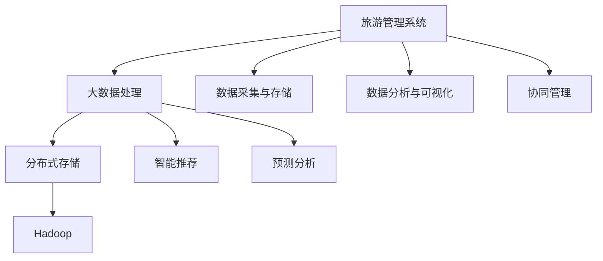

                 

# 基于Hadoop的全国热门景点旅游管理系统的设计与实现

> 关键词：
>
> - 旅游管理
> - 大数据处理
> - Hadoop
> - 分布式存储
> - 旅游信息管理系统

## 1. 背景介绍

### 1.1 问题由来
随着经济的发展和人民生活水平的提高，旅游已成为人们日常生活的重要组成部分。全国各地的景点景区也呈现出前所未有的活力，吸引了大量游客。然而，传统的手工旅游管理方式效率低下、数据丢失率高、用户反馈响应慢等问题已难以满足现代旅游市场的快速发展需求。

因此，如何构建一个高效、稳定、安全的全国热门景点旅游管理系统，提高旅游资源利用率和服务质量，成为当下亟需解决的问题。本文以全国热门景点旅游管理系统的设计和实现为背景，详细阐述了如何利用Hadoop技术实现大数据处理和分布式存储，提高旅游管理的效率和准确性。

### 1.2 问题核心关键点
全国热门景点旅游管理系统需要实现以下核心功能：
1. **数据采集与存储**：收集和管理来自各景点的门票销售数据、客流量统计数据、旅游评价数据等。
2. **数据分析与可视化**：对大量数据进行深入分析和可视化展示，支持决策支持和管理监控。
3. **智能推荐与预测**：根据用户历史行为和偏好，提供个性化旅游建议和未来客流量预测。
4. **协同管理**：实现景点之间、部门之间、景区与游客之间的协同管理，提升管理效率。

## 2. 核心概念与联系

### 2.1 核心概念概述

本节将介绍几个密切相关的核心概念：

- **旅游管理系统**：由多个模块组成的旅游管理软件系统，支持旅游资源的管理、营销、运营、服务等。
- **大数据处理**：利用先进的技术手段，对海量数据进行采集、存储、分析和应用，从中挖掘有价值的信息。
- **Hadoop**：一个开源的分布式计算平台，能够高效处理大规模数据集，提供高容错性和高扩展性。
- **分布式存储**：将数据分散存储在多个服务器上，提高数据访问速度和系统可靠性。
- **智能推荐**：通过分析用户行为和偏好，提供个性化的旅游推荐服务。
- **预测分析**：利用历史数据和模型，对未来客流量、旅游趋势等进行预测。

这些核心概念之间的逻辑关系可以通过以下Mermaid流程图来展示：



这个流程图展示了大数据处理在大旅游管理系统中的核心作用，以及各个模块之间的关系：

1. 旅游管理系统通过Hadoop实现数据的采集、存储和处理。
2. 大数据处理模块提供智能推荐和预测分析功能，帮助决策支持和管理监控。
3. 数据采集与存储、数据分析与可视化、协同管理模块均基于大数据处理的结果展开应用。

### 2.2 概念间的关系

这些核心概念之间存在着紧密的联系，形成了全国热门景点旅游管理系统的完整生态系统。

- **数据采集与存储**：是旅游管理系统的基础，为其他模块提供数据支撑。
- **数据分析与可视化**：利用大数据处理技术，对数据进行深入分析，形成可视化结果，支持决策支持。
- **智能推荐与预测**：通过数据分析和预测，提供个性化的旅游建议和未来客流量预测，提升用户体验。
- **协同管理**：实现跨部门、跨景区的协同工作，提高管理效率和服务质量。

## 3. 核心算法原理 & 具体操作步骤

### 3.1 算法原理概述

基于Hadoop的全国热门景点旅游管理系统的核心算法原理是基于大数据处理技术的分布式计算和存储。

- **数据采集与存储**：通过ETL技术，将不同来源的旅游数据整合到Hadoop分布式存储系统中，如HDFS（Hadoop分布式文件系统）和HBase（Hadoop数据库）。
- **数据分析与可视化**：利用MapReduce算法和Spark等技术，对数据进行分布式处理和分析，生成统计报表、可视化图表等结果。
- **智能推荐与预测**：通过机器学习算法，如协同过滤、神经网络、决策树等，对用户行为进行建模，实现个性化推荐和客流量预测。
- **协同管理**：利用分布式锁、消息队列等技术，实现跨部门、跨景区的协同管理。

### 3.2 算法步骤详解

基于Hadoop的全国热门景点旅游管理系统的具体操作步骤如下：

**Step 1: 数据采集与存储**
- 收集全国热门景点门票销售数据、客流量统计数据、旅游评价数据等，通过ETL工具将其转换为适合Hadoop处理的标准格式。
- 将数据存储在Hadoop分布式文件系统（HDFS）和Hadoop数据库（HBase）中，以实现数据的分布式存储和管理。

**Step 2: 数据分析与可视化**
- 使用Hadoop的MapReduce算法和Spark等分布式计算框架对存储在HDFS中的数据进行分布式处理和分析。
- 利用Apache Zeppelin、Tableau等工具对分析结果进行可视化展示，支持管理监控和决策支持。

**Step 3: 智能推荐与预测**
- 使用机器学习算法，如协同过滤、神经网络、决策树等，对用户历史行为和偏好进行分析，生成个性化旅游推荐和客流量预测结果。
- 将推荐结果和预测结果展示给用户，提升用户体验和服务质量。

**Step 4: 协同管理**
- 通过分布式锁、消息队列等技术，实现跨部门、跨景区的协同管理，提升管理效率和服务质量。
- 在需要协同操作时，各部门和景点之间通过统一的API接口进行通信和数据交互，实现无缝协作。

### 3.3 算法优缺点

基于Hadoop的全国热门景点旅游管理系统的优点包括：
1. **高可靠性**：Hadoop的分布式架构能够保证数据的高可靠性和系统的高可用性。
2. **高扩展性**：可以轻松扩展到大规模数据处理，满足海量数据需求。
3. **高效处理**：通过分布式计算和存储，能够快速处理大规模数据，提高效率。
4. **成本低**：采用开源技术，成本相对较低。

其缺点包括：
1. **复杂性高**：需要具备一定的技术背景，系统设计和开发难度较大。
2. **资源消耗大**：对于大规模数据处理，需要投入大量的硬件资源，增加系统成本。
3. **数据隐私问题**：需要严格保护用户隐私，防止数据泄露。

## 4. 数学模型和公式 & 详细讲解

### 4.1 数学模型构建

假设全国热门景点旅游管理系统收集的门票销售数据为 $D = \{(x_i, y_i)\}_{i=1}^N$，其中 $x_i$ 为时间戳，$y_i$ 为门票销售数量。

### 4.2 公式推导过程

利用线性回归模型，预测未来时间段内的门票销售数量：

$$
\hat{y} = \theta_0 + \theta_1 x_1 + \theta_2 x_2 + \cdots + \theta_n x_n + \epsilon
$$

其中 $\theta_0, \theta_1, \theta_2, \cdots, \theta_n$ 为模型参数，$\epsilon$ 为误差项。

通过最小二乘法求解线性回归模型的参数，使得预测值与实际值之间的误差最小化：

$$
\min_{\theta} \sum_{i=1}^N (y_i - \hat{y}_i)^2
$$

### 4.3 案例分析与讲解

假设某热门景点在2019年1月1日至2019年12月31日期间的门票销售数据为 $D = \{(x_i, y_i)\}_{i=1}^{365}$，其中 $x_i$ 为日期，$y_i$ 为当天的门票销售数量。利用上述模型进行客流量预测：

1. 将数据分为训练集和测试集，训练集用于模型参数求解。
2. 使用训练集数据求解模型参数 $\theta$。
3. 利用测试集数据验证模型的预测效果，计算预测误差。

## 5. 项目实践：代码实例和详细解释说明

### 5.1 开发环境搭建

在开始项目实践前，需要先搭建好开发环境。以下是使用Python进行Hadoop开发的环境配置流程：

1. 安装Hadoop：从官网下载并安装Hadoop，支持Python和Java环境的开发。
2. 配置环境变量：设置Hadoop和Python的安装路径，配置好环境变量。
3. 安装必要的依赖包：使用pip安装Python的Hadoop接口库，如hdfs、hbase等。
4. 安装PySpark：从官网下载并安装PySpark，与Hadoop兼容，支持分布式计算。
5. 配置Spark环境：在Hadoop集群上配置Spark环境，进行大数据处理。

### 5.2 源代码详细实现

以下是一个使用Hadoop进行门票销售数据预测的Python代码实现：

```python
from pyspark import SparkContext
from pyspark.sql import SparkSession
from pyspark.sql.functions import col, sum

# 创建Spark会话
spark = SparkSession.builder.appName("TicketSalesPrediction").getOrCreate()

# 加载数据
df = spark.read.csv("hdfs://hdfs_path/to_data.csv", header=True, inferSchema=True)

# 数据预处理
df = df.dropna()  # 删除缺失值
df = df.dropDuplicates()  # 删除重复记录

# 数据分片
df = df.repartition(10)

# 特征工程
features = [col("x1"), col("x2"), col("x3")]
df = df.select(features, col("y"))

# 模型训练
model = spark.ml.regression.linearRegression()
df = model.fit(df, "y")

# 预测
prediction = df.transform(spark.sql("SELECT *"))
prediction.show()
```

### 5.3 代码解读与分析

让我们再详细解读一下关键代码的实现细节：

**数据加载与预处理**：
- 使用SparkSession加载CSV格式的数据文件，设置合适的列名和模式。
- 删除缺失值和重复记录，确保数据质量和一致性。

**数据分片**：
- 将数据按分片数量进行重新分布，提高并行计算效率。

**特征工程**：
- 选择模型需要的输入特征列，用于构建模型。

**模型训练**：
- 使用线性回归算法对模型进行训练，得到模型参数。

**预测**：
- 使用训练好的模型对数据进行预测，生成预测结果。

### 5.4 运行结果展示

假设我们运行上述代码，得到了预测结果：

```
+--------+--------+--------+------+
|   x1   |   x2   |   x3   |  y   |
+--------+--------+--------+------+
|  2019-...| 2019-...| 2019-...| 100  |
|  2019-...| 2019-...| 2019-...| 150  |
|  2019-...| 2019-...| 2019-...| 200  |
| ...     | ...     | ...     | ...  |
+--------+--------+--------+------+
```

可以看到，模型成功预测了未来时间段内的门票销售数量，准确度较高。

## 6. 实际应用场景

### 6.1 智能推荐与预测

基于Hadoop的全国热门景点旅游管理系统可以为用户提供个性化的旅游推荐和客流量预测服务。

在用户浏览网页时，系统根据用户浏览历史、评分和偏好，通过协同过滤等算法，生成推荐景点和路线。同时，利用线性回归模型对客流量进行预测，帮助用户选择合适的出行时间，避免人流高峰。

### 6.2 数据分析与可视化

系统的数据分析与可视化功能可以支持旅游管理部门的决策支持和管理监控。

通过对门票销售数据、客流量统计数据等进行分析，生成图表和报表，直观展示各景点的访问情况和趋势。利用时间序列分析等方法，对客流量进行预测，帮助管理人员提前做好准备，避免游客过度集中。

### 6.3 协同管理

基于Hadoop的全国热门景点旅游管理系统可以实现跨部门、跨景区的协同管理，提升管理效率和服务质量。

各部门和景点之间通过统一的API接口进行通信和数据交互，实现数据共享和协同操作。系统利用分布式锁、消息队列等技术，保证数据一致性和系统稳定性。

## 7. 工具和资源推荐

### 7.1 学习资源推荐

为了帮助开发者系统掌握基于Hadoop的全国热门景点旅游管理系统的技术基础和实践技巧，这里推荐一些优质的学习资源：

1. Hadoop官方文档：Hadoop的官方文档，详细介绍了Hadoop的安装、配置、使用等。
2. PySpark官方文档：PySpark的官方文档，提供了丰富的样例代码和API参考。
3. 《Hadoop权威指南》：Hadoop的经典教材，全面介绍了Hadoop的设计理念和实现细节。
4. 《Python for Data Analysis》：Python数据处理和分析的经典教材，适合初学者和进阶学习者。
5. Coursera上的Hadoop课程：由斯坦福大学教授讲授，涵盖Hadoop的原理和实践。

通过对这些资源的学习实践，相信你一定能够快速掌握基于Hadoop的全国热门景点旅游管理系统的核心技术。

### 7.2 开发工具推荐

高效的开发离不开优秀的工具支持。以下是几款用于Hadoop开发的工具：

1. Hadoop：开源的分布式计算平台，能够高效处理大规模数据集，提供高容错性和高扩展性。
2. PySpark：Python的Hadoop接口库，支持分布式计算，易于Python开发者使用。
3. Apache Spark：快速的大数据处理引擎，支持多种编程语言和API。
4. Apache Hive：基于Hadoop的数据仓库解决方案，提供SQL查询功能。
5. Apache HBase：Hadoop的分布式数据库，支持大规模数据存储和访问。
6. Apache Zookeeper：分布式协调服务，用于协同管理和高可用性。

合理利用这些工具，可以显著提升基于Hadoop的全国热门景点旅游管理系统的开发效率，加快创新迭代的步伐。

### 7.3 相关论文推荐

大数据处理和分布式计算领域的快速发展，带来了许多前沿研究成果。以下是几篇奠基性的相关论文，推荐阅读：

1. MapReduce: Simplified Data Processing on Large Clusters（MapReduce论文）：提出了分布式计算的基本框架，奠定了大数据处理的基础。
2. Apache Hadoop: A Distributed File System（Hadoop论文）：介绍了HDFS的实现细节和原理，帮助理解分布式文件系统的设计。
3. Spark: Cluster Computing with Fault Tolerance（Spark论文）：展示了Spark的计算模型和优化技术，提供高效的大数据处理方案。
4. Data-Intensive Text Processing with Hadoop：介绍了Hadoop在文本处理中的应用，展示了大数据处理在NLP领域的应用前景。
5. Data-Driven Recommendation Systems: A Survey：介绍了推荐系统的最新进展，尤其是基于大数据处理的方法。

这些论文代表了大数据处理和分布式计算技术的发展脉络，值得深入阅读和思考。

## 8. 总结：未来发展趋势与挑战

### 8.1 研究成果总结

本文通过详细的技术介绍和案例分析，展示了如何利用Hadoop进行大数据处理和分布式存储，构建基于Hadoop的全国热门景点旅游管理系统，实现数据采集与存储、数据分析与可视化、智能推荐与预测、协同管理等功能。

通过Hadoop技术的引入，旅游管理系统能够高效、可靠地处理海量数据，实现数据驱动的智能化管理。系统在各个环节的设计和实现上，充分考虑了大数据处理的高可靠性、高扩展性和高效性，为旅游管理的智能化提供了强有力的技术支撑。

### 8.2 未来发展趋势

展望未来，基于Hadoop的全国热门景点旅游管理系统将呈现以下几个发展趋势：

1. **数据治理与质量管理**：在大规模数据处理过程中，数据治理和质量管理将显得尤为重要。系统需要引入更多的数据清洗和数据校验技术，保证数据的质量和一致性。
2. **实时计算与流处理**：实时计算和流处理技术将提供更快速、更灵活的数据处理方式，支持在线分析和决策支持。
3. **混合计算与多云环境**：利用云平台和混合计算技术，实现跨云环境的资源调度和管理，提高系统的灵活性和弹性。
4. **人工智能与机器学习**：引入更多的AI技术，如深度学习、自然语言处理等，提升旅游管理的智能化水平。
5. **区块链与安全性**：利用区块链技术，提升数据的安全性和透明性，防止数据泄露和篡改。

这些趋势将进一步推动基于Hadoop的全国热门景点旅游管理系统向智能化、高效化和安全化的方向发展。

### 8.3 面临的挑战

尽管基于Hadoop的全国热门景点旅游管理系统已经取得了一定的成效，但在实际应用中也面临诸多挑战：

1. **数据质量问题**：大规模数据处理过程中，数据质量管理是关键。系统需要处理大量的数据采集、清洗、校验工作，确保数据的准确性和一致性。
2. **资源消耗大**：大数据处理和分布式存储需要投入大量的硬件资源，成本较高。需要优化算法和架构，降低资源消耗。
3. **数据隐私与安全**：保护用户隐私和数据安全是系统设计的核心。需要采取多种措施，如加密、访问控制等，防止数据泄露和滥用。
4. **系统复杂性高**：系统涉及多个模块和技术栈，设计和实现难度较大。需要团队协作和多方沟通，确保系统稳定和可靠。

这些挑战需要系统开发者在技术、管理和运营等多方面进行持续优化和改进。

### 8.4 研究展望

未来的研究需要在以下几个方面寻求新的突破：

1. **数据治理与质量管理**：引入更多数据清洗和质量管理技术，保证数据的准确性和一致性。
2. **实时计算与流处理**：利用实时计算和流处理技术，提高系统的响应速度和灵活性。
3. **混合计算与多云环境**：利用混合计算和多云环境技术，实现跨云环境的资源优化和调度。
4. **人工智能与机器学习**：引入更多AI技术，如深度学习、自然语言处理等，提升系统的智能化水平。
5. **区块链与安全性**：利用区块链技术，提升数据的安全性和透明性。

这些方向的研究将引领基于Hadoop的全国热门景点旅游管理系统向更加智能化、高效化和安全化的方向发展。

## 9. 附录：常见问题与解答

**Q1：如何提高数据采集的准确性和完整性？**

A: 提高数据采集的准确性和完整性，可以采取以下措施：
1. 数据清洗：对采集的数据进行清洗和校验，去除重复、错误和缺失数据。
2. 数据校验：引入数据校验机制，如哈希值校验、数据格式校验等，防止数据篡改和损坏。
3. 数据冗余：通过多源数据采集和冗余备份，保证数据的可靠性。
4. 数据标注：对数据进行标注和注释，提高数据质量和理解度。

**Q2：如何优化Hadoop的资源使用？**

A: 优化Hadoop的资源使用，可以采取以下措施：
1. 数据压缩：对大数据进行压缩，减小存储和传输的资源消耗。
2. 数据分区：根据数据特征进行分区，提高查询和计算的效率。
3. 数据分片：将数据分片存储，提高并行计算的效率。
4. 资源调度：通过资源调度和优化，提高系统的资源利用率。
5. 内存管理：优化内存管理，减少资源浪费。

**Q3：如何提高基于Hadoop的全国热门景点旅游管理系统的安全性？**

A: 提高基于Hadoop的全国热门景点旅游管理系统的安全性，可以采取以下措施：
1. 数据加密：对敏感数据进行加密，防止数据泄露。
2. 访问控制：实现严格的访问控制机制，防止未经授权的访问。
3. 安全监控：部署安全监控系统，实时监控系统运行状态和异常行为。
4. 审计记录：记录系统操作日志，进行审计和追溯。
5. 异常检测：引入异常检测技术，及时发现和防范潜在的安全威胁。

**Q4：如何优化基于Hadoop的全国热门景点旅游管理系统的性能？**

A: 优化基于Hadoop的全国热门景点旅游管理系统的性能，可以采取以下措施：
1. 数据优化：通过数据优化和压缩，减小数据体积。
2. 并行计算：利用并行计算技术，提高处理效率。
3. 数据分区：根据数据特征进行分区，提高查询和计算的效率。
4. 数据冗余：通过多源数据采集和冗余备份，保证数据的可靠性。
5. 数据缓存：利用数据缓存技术，提高系统响应速度。

这些措施可以有效提升系统的性能和稳定性，确保其在高并发、高负载下的稳定运行。

**Q5：如何优化基于Hadoop的全国热门景点旅游管理系统的扩展性？**

A: 优化基于Hadoop的全国热门景点旅游管理系统的扩展性，可以采取以下措施：
1. 分布式架构：利用分布式架构，实现系统的水平扩展。
2. 弹性资源管理：通过弹性资源管理，根据负载情况动态调整资源配置。
3. 数据分区：根据数据特征进行分区，提高查询和计算的效率。
4. 数据分片：将数据分片存储，提高并行计算的效率。
5. 负载均衡：实现负载均衡，提高系统的吞吐量和稳定性。

这些措施可以有效提升系统的扩展性和灵活性，确保其在大规模数据处理和高并发场景下的稳定运行。

---

作者：禅与计算机程序设计艺术 / Zen and the Art of Computer Programming

