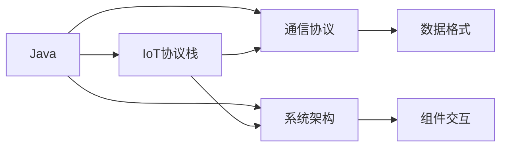
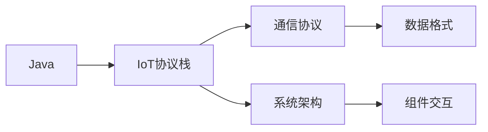

                 

# 基于Java的智能家居设计：Java与物联网(IoT)协议栈全解析

> 关键词：智能家居,Java,物联网(IoT),协议栈,全解析,通信协议,系统架构

## 1. 背景介绍

随着人工智能和大数据技术的发展，智能家居系统已经成为现代家庭生活中不可或缺的组成部分。它通过集成各种智能设备和传感器，实现对家庭环境的自动控制和优化管理，提高生活的便利性和舒适度。Java作为一种广泛使用的编程语言，凭借其高效性和跨平台特性，在智能家居系统中有着广泛的应用。

本文将详细解析Java在智能家居中的设计与实现，特别是其在物联网(IoT)协议栈中的应用。通过理解Java与IoT协议栈的交互方式，读者将能够构建高效、安全的智能家居系统，提升家庭的智能化水平。

## 2. 核心概念与联系

### 2.1 核心概念概述

在智能家居设计中，Java作为一种通用的编程语言，与物联网(IoT)协议栈紧密相连，共同构建了系统的架构。以下是一些核心概念的概述：

- **Java**：一种广泛使用的编程语言，以其跨平台性和高效性著称，适用于各种应用场景。
- **物联网(IoT)**：通过各种传感器、设备和互联网连接，实现物品和系统的互联互通。
- **协议栈**：包括物理层、数据链路层、网络层、传输层、会话层、表示层和应用层，用于数据传输和通信。
- **通信协议**：定义数据交换的格式和规则，确保数据传输的可靠性、安全和效率。
- **系统架构**：设计系统各组件的分布和交互方式，保障系统的高效性和可扩展性。

这些概念之间的联系可以通过以下Mermaid流程图来展示：



这个流程图展示了Java与IoT协议栈以及系统架构的关系：Java作为编程语言，与IoT协议栈和通信协议紧密结合，共同支撑系统的架构设计。

### 2.2 概念间的关系

这些核心概念之间的逻辑关系可以通过以下Mermaid流程图来展示：



这个流程图展示了Java与IoT协议栈之间的关系：Java作为编程语言，用于实现IoT协议栈中的通信协议，并通过系统架构设计组件之间的交互。

## 3. 核心算法原理 & 具体操作步骤
### 3.1 算法原理概述

Java在智能家居中的设计与实现，主要依赖于物联网(IoT)协议栈的支持。该协议栈包括物理层、数据链路层、网络层、传输层、会话层、表示层和应用层，每层负责不同的通信功能和数据处理。Java通过标准化的编程接口与这些层交互，实现数据的可靠传输和系统的稳定运行。

### 3.2 算法步骤详解

Java在智能家居设计中的应用，主要包括以下几个步骤：

1. **选择通信协议**：根据智能家居的需求，选择合适的通信协议，如MQTT、CoAP、HTTP等。
2. **实现通信接口**：使用Java编写程序，实现与所选协议的通信接口，确保数据准确、安全地传输。
3. **设计系统架构**：根据实际需求，设计系统的组件和组件之间的交互方式，确保系统的可扩展性和稳定性。
4. **实现系统功能**：根据系统架构，编写Java代码，实现智能家居的各种功能，如智能照明、环境监测、安全监控等。
5. **测试和优化**：通过测试发现问题，优化系统性能，确保系统的稳定性和可靠性。

### 3.3 算法优缺点

Java在智能家居设计中的应用具有以下优点：

- **跨平台性**：Java的跨平台特性使得智能家居系统可以在不同操作系统和硬件平台上运行。
- **高效性**：Java的高效性使得系统能够快速处理大量的数据和事件，提高系统的响应速度。
- **丰富的库和框架**：Java拥有丰富的第三方库和框架，可以快速开发各种智能家居应用。

同时，Java在智能家居设计中也有一些缺点：

- **性能瓶颈**：Java虚拟机在处理大数据时可能会遇到性能瓶颈，需要优化代码以提高效率。
- **资源占用**：Java程序的资源占用较高，需要合理管理内存和CPU资源。
- **开发成本**：Java开发需要一定的学习成本和开发时间，可能不适合对时间和成本敏感的项目。

### 3.4 算法应用领域

Java在智能家居设计中的应用领域广泛，包括但不限于以下几个方面：

- **智能照明**：通过Java编写的程序，实现对灯光的自动控制和场景设置，提升居家体验。
- **环境监测**：利用Java编写的传感器数据分析程序，实时监测室内外环境参数，如温度、湿度、空气质量等。
- **安全监控**：通过Java编写的程序，实现对家庭安防系统的控制和监控，确保家庭安全。
- **智能家电**：利用Java编写的程序，实现对各种家电设备的智能控制和互联互通，提高家电的自动化水平。
- **智能交互**：通过Java编写的程序，实现与用户之间的自然语言交互，提升智能家居的智能化程度。

## 4. 数学模型和公式 & 详细讲解 & 举例说明
### 4.1 数学模型构建

在智能家居系统中，Java主要负责数据的传输和处理。以下是Java与IoT协议栈之间的数据传输模型：

```
  Java程序
  ↓
   协议栈
  ↓
    网络
  ↓
  路由器/交换机
  ↓
    互联网
  ↓
    服务器/客户端
  ↓
   协议栈
  ↓
    Java程序
```

这个模型展示了Java程序如何通过IoT协议栈与服务器或客户端通信。

### 4.2 公式推导过程

Java程序在智能家居系统中主要负责数据的解析和处理。以MQTT协议为例，Java程序可以使用Java MQTT库实现与MQTT服务器之间的通信。以下是MQTT数据传输的示例：

- **发布消息**：Java程序将数据编码为MQTT消息，并将其发送到MQTT服务器。
- **订阅消息**：Java程序订阅MQTT主题，等待服务器发布相关数据。
- **处理消息**：Java程序解析接收到的MQTT消息，并根据需要进行数据处理。

### 4.3 案例分析与讲解

以下是一个Java程序发布和订阅MQTT消息的示例代码：

```java
import org.eclipse.paho.client.mqttv3.*;
import org.eclipse.paho.client.mqttv3.persist.MemoryPersistence;

public class MQTTClient {
    private static final String BROKER_URI = "tcp://broker.example.com:1883";
    private static final String CLIENT_ID = "java-client";
    private static final String TOPIC = "temperature/sensor";
    private static final String MESSAGE = "25°C";

    public static void main(String[] args) throws Exception {
        MqttConnectOptions options = new MqttConnectOptions();
        options.setCleanSession(true);

        MqttClient client = new MqttClient(BROKER_URI, CLIENT_ID, options);
        client.connect();
        client.subscribe(TOPIC);

        MqttMessage message = new MqttMessage(MESSAGE.getBytes());
        message.setQos(1);
        message.setRetained(true);

        client.publish(TOPIC, message);
        client.disconnect();
    }
}
```

该示例展示了Java程序如何订阅和发布MQTT消息。

## 5. 项目实践：代码实例和详细解释说明
### 5.1 开发环境搭建

要搭建Java智能家居系统的开发环境，需要以下步骤：

1. **安装Java Development Kit (JDK)**：Java智能家居开发依赖于JDK，需要从Oracle官网下载并安装。
2. **安装IDE**：选择一个合适的IDE，如Eclipse或IntelliJ IDEA，用于开发和调试Java程序。
3. **配置Maven**：Maven是Java项目的主要依赖管理工具，需要配置Maven环境，方便安装和管理第三方库。
4. **安装MQTT库**：选择适合的MQTT库，如Eclipse Paho MQTT库，并将其集成到Java项目中。

### 5.2 源代码详细实现

以下是一个简单的Java程序，实现智能家居系统的环境监测功能：

```java
import org.eclipse.paho.client.mqttv3.*;
import org.eclipse.paho.client.mqttv3.persist.MemoryPersistence;

public class EnvironmentMonitor {
    private static final String BROKER_URI = "tcp://broker.example.com:1883";
    private static final String CLIENT_ID = "environment-monitor";
    private static final String TOPIC = "environment/temperature";
    private static final String MESSAGE = "25°C";

    public static void main(String[] args) throws Exception {
        MqttConnectOptions options = new MqttConnectOptions();
        options.setCleanSession(true);

        MqttClient client = new MqttClient(BROKER_URI, CLIENT_ID, options);
        client.connect();
        client.subscribe(TOPIC);

        MqttMessage message = new MqttMessage(MESSAGE.getBytes());
        message.setQos(1);
        message.setRetained(true);

        client.publish(TOPIC, message);
        client.disconnect();
    }
}
```

该程序使用Eclipse Paho MQTT库，实现对温度传感器的数据采集和发布。

### 5.3 代码解读与分析

该Java程序实现的功能如下：

- **订阅环境温度主题**：使用`client.subscribe(TOPIC)`方法，订阅环境温度主题。
- **发布温度数据**：使用`client.publish(TOPIC, message)`方法，将温度数据发布到MQTT服务器。

通过MQTT协议，Java程序实现了数据的可靠传输和处理。

### 5.4 运行结果展示

在运行该程序后，可以看到温度数据被发布到MQTT服务器，客户端可以通过订阅该主题，实时获取环境温度数据。

## 6. 实际应用场景
### 6.1 智能照明

智能照明系统可以通过Java程序实现自动控制和场景设置。例如，可以使用MQTT协议实现对灯光亮度和颜色的控制，提升居住环境的舒适度。

### 6.2 环境监测

环境监测系统可以通过Java程序实现对室内外环境的实时监测，如温度、湿度、空气质量等。通过MQTT协议，Java程序将数据发布到MQTT服务器，供其他系统进行分析和处理。

### 6.3 安全监控

安全监控系统可以通过Java程序实现对家庭安防设备的控制和监控，如摄像头、门窗传感器等。通过MQTT协议，Java程序将传感器数据发布到MQTT服务器，供其他系统进行分析和处理。

### 6.4 未来应用展望

未来的智能家居系统将更加智能化和自动化，Java作为其主要编程语言，将发挥更大的作用。以下是一些未来应用展望：

- **语音交互**：通过Java编写的程序，实现与智能音箱之间的语音交互，提升家庭娱乐体验。
- **智能家电**：通过Java编写的程序，实现对各种家电设备的智能控制和互联互通，提高家电的自动化水平。
- **健康监测**：通过Java编写的程序，实现对家庭成员健康数据的监测和分析，提升家庭健康管理水平。

## 7. 工具和资源推荐
### 7.1 学习资源推荐

以下是一些推荐的Java智能家居学习资源：

1. **《Java智能家居开发实战》**：一本系统介绍Java智能家居开发的书籍，涵盖环境监测、智能照明、安全监控等多个应用场景。
2. **Eclipse Paho MQTT库文档**：Eclipse Paho MQTT库的官方文档，详细介绍了如何使用Java实现MQTT通信。
3. **IoT开发社区**：一些IoT开发社区，如IoT for All、IoT World Today等，提供最新的IoT技术资讯和实战案例。

### 7.2 开发工具推荐

以下是一些推荐的Java智能家居开发工具：

1. **Eclipse**：一个广泛使用的Java IDE，提供丰富的插件和开发环境。
2. **IntelliJ IDEA**：一个功能强大的Java IDE，支持Java智能家居开发的各项功能。
3. **Maven**：一个Java项目依赖管理工具，方便安装和管理第三方库。

### 7.3 相关论文推荐

以下是一些推荐的Java智能家居相关论文：

1. **《Java智能家居系统的设计与实现》**：详细介绍Java智能家居系统的设计和实现方法，提供丰富的案例分析。
2. **《基于MQTT的Java智能家居系统》**：详细介绍使用MQTT协议实现Java智能家居系统的设计和实现方法。
3. **《Java智能家居系统的安全与隐私保护》**：详细介绍Java智能家居系统的安全与隐私保护技术，提供全面的安全保障方案。

## 8. 总结：未来发展趋势与挑战
### 8.1 研究成果总结

Java在智能家居设计中的应用，已经在许多实际场景中得到了广泛应用，并取得了显著的效果。Java作为跨平台性和高效性著称的编程语言，在智能家居系统中具有重要的地位。

### 8.2 未来发展趋势

Java在智能家居设计中的应用将呈现以下几个发展趋势：

- **多模态融合**：未来的智能家居系统将支持多模态数据融合，如视觉、语音、传感器数据等。Java的多模态处理能力将得到进一步提升。
- **人工智能应用**：未来的智能家居系统将结合人工智能技术，实现智能推荐、语音识别、自然语言处理等功能。
- **边缘计算**：未来的智能家居系统将更多地依赖边缘计算技术，实现数据的本地化处理和存储，提高系统的响应速度。

### 8.3 面临的挑战

Java在智能家居设计中仍面临一些挑战：

- **资源管理**：Java程序的资源占用较高，需要合理管理内存和CPU资源。
- **安全性问题**：智能家居系统涉及到家庭隐私和安全问题，Java程序需要具备良好的安全性保障措施。
- **开发成本**：Java智能家居系统开发需要较高的技术门槛，可能需要专业开发人员的支持。

### 8.4 研究展望

未来的Java智能家居系统需要从以下几个方面进行研究：

- **多模态数据处理**：探索多模态数据处理的有效方法，提升系统的智能化水平。
- **安全性保障**：研究Java智能家居系统的安全性保障技术，确保系统的安全稳定运行。
- **开发工具优化**：探索更高效、易用的Java智能家居开发工具，降低开发门槛，提升开发效率。

通过持续的研究和优化，Java在智能家居设计中的应用将更加广泛和深入，为人们带来更加便捷、舒适的生活体验。

## 9. 附录：常见问题与解答

**Q1：Java在智能家居设计中有什么优势？**

A：Java在智能家居设计中的优势主要体现在以下几点：

- **跨平台性**：Java的跨平台特性使得智能家居系统可以在不同操作系统和硬件平台上运行。
- **高效性**：Java的高效性使得系统能够快速处理大量的数据和事件，提高系统的响应速度。
- **丰富的库和框架**：Java拥有丰富的第三方库和框架，可以快速开发各种智能家居应用。

**Q2：Java智能家居系统如何实现数据传输？**

A：Java智能家居系统主要通过MQTT、CoAP、HTTP等通信协议实现数据传输。例如，使用Eclipse Paho MQTT库实现MQTT通信，可以使用HTTP协议与智能设备进行交互。

**Q3：Java智能家居系统如何实现多模态数据融合？**

A：Java智能家居系统可以通过集成不同的传感器和设备，实现多模态数据融合。例如，可以集成视觉传感器、语音识别设备、环境传感器等，通过Java程序实现数据的整合和处理。

**Q4：Java智能家居系统在开发过程中需要注意哪些问题？**

A：Java智能家居系统在开发过程中需要注意以下问题：

- **资源管理**：合理管理内存和CPU资源，避免资源泄漏和性能瓶颈。
- **安全性问题**：确保系统的安全性，防止数据泄露和攻击。
- **开发效率**：选择高效、易用的开发工具和框架，提高开发效率。

**Q5：Java智能家居系统未来发展前景如何？**

A：Java智能家居系统未来的发展前景广阔，将支持多模态数据融合、人工智能应用、边缘计算等新技术，为人们带来更加便捷、舒适的生活体验。

总之，Java在智能家居设计中的应用具有重要的地位，未来将继续发挥其优势，推动智能家居系统的发展。通过不断的研究和优化，Java将为智能家居带来更多的创新和突破。

---

作者：禅与计算机程序设计艺术 / Zen and the Art of Computer Programming

