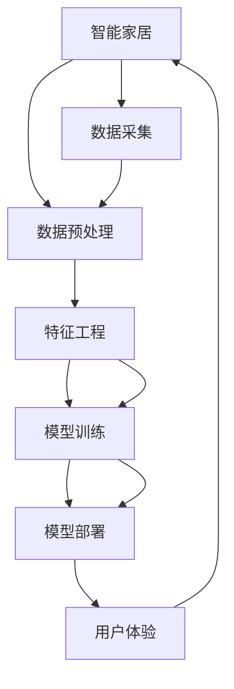
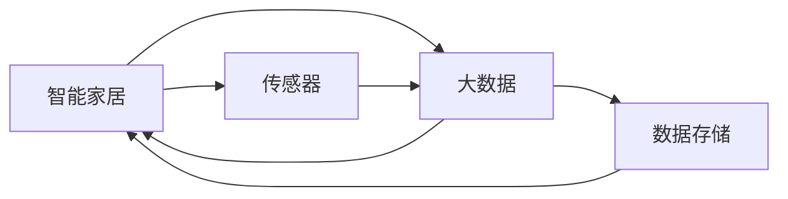
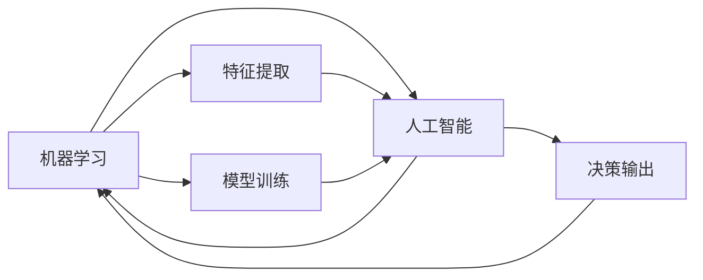
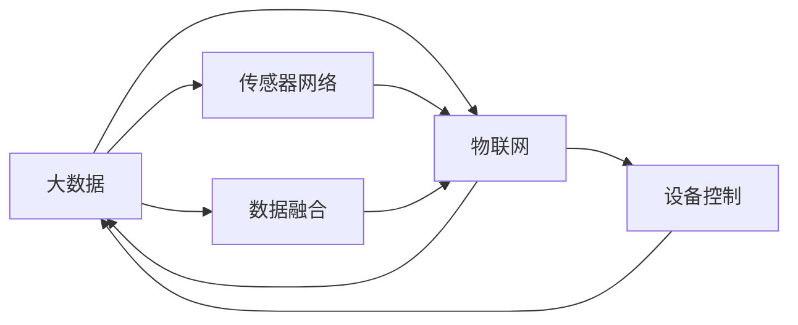
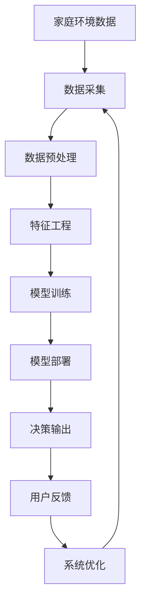

                 

# 基于Java的智能家居设计：Java开发者的智能家居辅助决策系统构建

> 关键词：智能家居,Java,辅助决策系统,机器学习,物联网,大数据

## 1. 背景介绍

### 1.1 问题由来

近年来，随着科技的不断进步，智能家居市场迎来了蓬勃发展。通过将物联网技术、机器学习、人工智能和大数据等先进技术应用于家庭环境中，人们的生活质量得到了显著提升。然而，随着智能家居设备数量的增加，如何有效地管理这些设备，以及如何根据家庭环境的变化进行智能决策，成为了一个重要的问题。为此，本文将详细介绍基于Java的智能家居辅助决策系统的构建，帮助Java开发者了解这一领域的最新技术和实践。

### 1.2 问题核心关键点

智能家居辅助决策系统的核心在于如何利用机器学习和大数据技术，对家庭环境进行实时监测和分析，从而做出智能化的决策。具体而言，系统的核心关键点包括：

- 数据采集：通过各类传感器和智能设备采集家庭环境数据。
- 数据预处理：对采集到的数据进行清洗和标准化，减少噪声干扰。
- 特征工程：从数据中提取出有用的特征，用于模型训练。
- 模型训练：利用机器学习算法对特征进行建模，生成决策模型。
- 模型部署：将训练好的模型部署到智能家居设备中，进行实时决策。
- 用户体验：提供简洁、易用的用户界面，提升用户的使用体验。

### 1.3 问题研究意义

智能家居辅助决策系统的研究与应用，对于提升家庭生活质量、降低能源消耗、提高家庭安全性具有重要意义。具体而言，该系统的研究与应用将带来以下几方面的显著益处：

- 智能生活：通过实时数据分析，智能家居系统能够自动调节家庭环境，提升居住舒适度。
- 能源节约：智能家居系统能够自动调节能源使用，降低家庭的能源消耗。
- 安全保障：智能家居系统能够实时监测家庭安全，及时报警，保障家庭安全。
- 个性化定制：用户可以根据自身需求定制家庭环境，系统自动优化调整，满足个性化需求。

## 2. 核心概念与联系

### 2.1 核心概念概述

为了更好地理解基于Java的智能家居辅助决策系统，本节将介绍几个密切相关的核心概念：

- 智能家居（Smart Home）：通过物联网技术将家居设备、家电、安防等系统集成在一起，实现自动化、智能化、可视化的家庭环境管理。
- Java：一种广泛使用的面向对象编程语言，具有跨平台、高效、稳定等优点，适合构建复杂、大规模的系统。
- 机器学习（Machine Learning）：一种基于数据的智能算法，能够通过训练学习数据的规律，进行预测和决策。
- 大数据（Big Data）：指海量的、多样化的数据，通过数据挖掘、分析等技术，可以提取有价值的信息。
- 物联网（Internet of Things, IoT）：将各种智能设备通过互联网连接起来，实现数据共享、协同工作。
- 人工智能（Artificial Intelligence, AI）：模拟人类智能的行为和决策，实现机器自主学习、推理、判断等。

这些核心概念之间的逻辑关系可以通过以下Mermaid流程图来展示：



这个流程图展示了一旦智能家居辅助决策系统的核心概念及其之间的关系：

1. 智能家居系统通过数据采集获取环境数据。
2. 对采集到的数据进行预处理，提取出有用的特征。
3. 利用机器学习算法对特征进行建模，训练出决策模型。
4. 将训练好的模型部署到智能家居设备中，进行实时决策。
5. 最终将决策结果反馈到用户界面，提升用户体验。

### 2.2 概念间的关系

这些核心概念之间存在着紧密的联系，形成了智能家居辅助决策系统的完整生态系统。下面通过几个Mermaid流程图来展示这些概念之间的关系。

#### 2.2.1 智能家居与大数据



这个流程图展示了智能家居系统和大数据技术的关系。智能家居系统通过传感器采集数据，数据经过预处理和存储后，可以被用于机器学习模型的训练和优化。

#### 2.2.2 机器学习与人工智能



这个流程图展示了机器学习与人工智能的关系。机器学习是人工智能的一个子领域，通过训练数据，机器学习模型可以自主学习规律，从而实现人工智能中的预测和决策功能。

#### 2.2.3 大数据与物联网



这个流程图展示了大数据与物联网的关系。大数据技术通过传感器网络采集海量数据，并通过数据融合技术，实现不同设备之间的协同工作。

### 2.3 核心概念的整体架构

最后，我们用一个综合的流程图来展示这些核心概念在大数据智能家居辅助决策系统中的整体架构：



这个综合流程图展示了从数据采集到决策输出的完整过程。大数据智能家居辅助决策系统通过数据采集获取家庭环境数据，经过数据预处理和特征工程后，训练出决策模型并进行部署。最终，系统将决策结果反馈到用户界面，并根据用户反馈进行系统优化，形成一个闭环的智能家居管理系统。

## 3. 核心算法原理 & 具体操作步骤
### 3.1 算法原理概述

基于Java的智能家居辅助决策系统，其核心算法原理主要包括以下几个方面：

- 数据采集：通过各类传感器和智能设备，实时采集家庭环境数据。
- 数据预处理：对采集到的数据进行清洗和标准化，减少噪声干扰。
- 特征工程：从数据中提取出有用的特征，用于模型训练。
- 模型训练：利用机器学习算法对特征进行建模，生成决策模型。
- 模型部署：将训练好的模型部署到智能家居设备中，进行实时决策。

### 3.2 算法步骤详解

基于Java的智能家居辅助决策系统的具体操作步骤如下：

**Step 1: 数据采集**

- 安装各类传感器和智能设备，如温度传感器、湿度传感器、门窗传感器等。
- 配置传感器和设备的参数，确保数据采集的准确性和稳定性。
- 部署传感器和设备，确保数据采集的实时性。

**Step 2: 数据预处理**

- 收集采集到的数据，进行初步分析，找出数据中的异常值和噪声。
- 对数据进行清洗和标准化，确保数据的一致性和可比性。
- 对数据进行缺失值处理和数据增强，提升数据质量。

**Step 3: 特征工程**

- 对数据进行特征提取，生成有用的特征向量。
- 对特征向量进行编码和归一化，确保特征的可用性。
- 对特征向量进行特征选择和降维，减少特征数量，提升模型效率。

**Step 4: 模型训练**

- 选择适合的机器学习算法，如决策树、随机森林、神经网络等。
- 将特征向量作为输入，训练机器学习模型。
- 通过交叉验证等技术，评估模型的性能，并进行调参优化。

**Step 5: 模型部署**

- 将训练好的模型导出为Java包，进行打包和部署。
- 将模型部署到智能家居设备中，确保模型能够实时运行。
- 提供API接口，供其他系统调用，实现系统集成。

### 3.3 算法优缺点

基于Java的智能家居辅助决策系统具有以下优点：

- 跨平台：Java语言具有跨平台性，可以在多种操作系统和设备上运行。
- 安全性：Java具有强大的安全机制，可以有效防止恶意攻击。
- 可扩展性：Java系统可以轻松扩展和升级，适应不断变化的智能家居环境。

然而，该系统也存在以下缺点：

- 性能瓶颈：Java程序的执行速度相对较慢，可能会影响系统的响应速度。
- 内存占用：Java程序在运行时会占用较多的内存，可能会影响系统的稳定性。
- 复杂度高：Java程序的开发和维护较为复杂，需要较高的技术门槛。

### 3.4 算法应用领域

基于Java的智能家居辅助决策系统可以应用于以下领域：

- 家庭环境优化：通过实时数据分析，自动调节家庭环境，提升居住舒适度。
- 能源管理：通过数据分析，自动调节能源使用，降低家庭能源消耗。
- 安全监测：通过传感器数据，实时监测家庭安全，及时报警，保障家庭安全。
- 个性化定制：根据用户需求，自动调整家庭环境，满足个性化需求。

## 4. 数学模型和公式 & 详细讲解 & 举例说明

### 4.1 数学模型构建

基于Java的智能家居辅助决策系统，其数学模型主要包括以下几个方面：

- 数据采集：采集家庭环境数据，生成时间序列数据。
- 数据预处理：对时间序列数据进行去噪、归一化等处理。
- 特征工程：生成有用的特征向量，如均值、方差、最大值、最小值等。
- 模型训练：利用机器学习算法，对特征向量进行建模，生成决策模型。

### 4.2 公式推导过程

以下以家庭温度控制为例，推导基于Java的智能家居辅助决策系统的数学模型。

假设家庭温度控制系统的目标是将室内温度控制在$T$度，传感器数据为$x$，模型为$f$。则系统可以表示为：

$$
y = f(x; \theta)
$$

其中$y$表示室内温度控制的目标值，$\theta$为模型的参数。假设模型为线性回归模型，则：

$$
y = w_0 + \sum_{i=1}^n w_i x_i
$$

其中$w_0$为截距，$w_i$为特征系数。

### 4.3 案例分析与讲解

以家庭温度控制为例，系统可以通过采集室内温度传感器数据$x$，生成特征向量$[x_t, x_{t-1}, \ldots, x_{t-k}]$，其中$k$为历史数据的窗口大小。通过模型训练，得到线性回归模型参数$w$，然后利用模型预测目标温度$y_t$。具体流程如下：

1. 数据采集：通过温度传感器采集室内温度数据$x_t$。
2. 数据预处理：对温度数据进行去噪、归一化等处理。
3. 特征工程：生成特征向量$[x_t, x_{t-1}, \ldots, x_{t-k}]$。
4. 模型训练：利用机器学习算法，对特征向量进行建模，生成线性回归模型参数$w$。
5. 模型预测：利用模型预测目标温度$y_t$。
6. 系统反馈：根据预测温度与目标温度的误差，调整模型参数$w$，进行系统优化。

## 5. 项目实践：代码实例和详细解释说明
### 5.1 开发环境搭建

在进行智能家居辅助决策系统开发前，我们需要准备好开发环境。以下是使用Java和Spring Boot进行开发的开发环境配置流程：

1. 安装Java JDK：从官网下载并安装Java JDK，建议使用LTS版本，以确保系统稳定性和安全性。
2. 安装Maven：从官网下载并安装Maven，用于项目管理。
3. 安装Spring Boot：从官网下载并安装Spring Boot，用于开发Web应用。
4. 安装Hibernate：从官网下载并安装Hibernate，用于数据访问。

完成上述步骤后，即可在Linux或Windows环境下进行开发。

### 5.2 源代码详细实现

下面我们以家庭环境优化为例，给出基于Java和Spring Boot的智能家居辅助决策系统的实现代码。

首先，定义系统模块：

```java
package com.example.smart_home;

import org.springframework.boot.SpringApplication;
import org.springframework.boot.autoconfigure.SpringBootApplication;
import org.springframework.web.bind.annotation.*;

@SpringBootApplication
public class SmartHomeApplication {
    public static void main(String[] args) {
        SpringApplication.run(SmartHomeApplication.class, args);
    }
}
```

然后，定义数据模型：

```java
package com.example.smart_home;

import javax.persistence.Entity;
import javax.persistence.GeneratedValue;
import javax.persistence.Id;
import javax.persistence.Table;

@Entity
@Table(name = "sensor_data")
public class SensorData {
    @Id
    @GeneratedValue
    private Long id;
    private String type;
    private String value;
    private Long timestamp;

    public SensorData() {
    }

    public SensorData(String type, String value, Long timestamp) {
        this.type = type;
        this.value = value;
        this.timestamp = timestamp;
    }

    public Long getId() {
        return id;
    }

    public void setId(Long id) {
        this.id = id;
    }

    public String getType() {
        return type;
    }

    public void setType(String type) {
        this.type = type;
    }

    public String getValue() {
        return value;
    }

    public void setValue(String value) {
        this.value = value;
    }

    public Long getTimestamp() {
        return timestamp;
    }

    public void setTimestamp(Long timestamp) {
        this.timestamp = timestamp;
    }
}
```

接下来，定义数据访问层：

```java
package com.example.smart_home;

import org.springframework.beans.factory.annotation.Autowired;
import org.springframework.stereotype.Repository;
import org.springframework.transaction.annotation.Transactional;

import javax.persistence.EntityManager;
import javax.persistence.PersistenceContext;
import java.util.List;

@Repository
public class SensorDataRepository {
    @PersistenceContext
    private EntityManager entityManager;

    public List<SensorData> getAllData() {
        return entityManager.createQuery("SELECT s FROM SensorData s", SensorData.class).getResultList();
    }

    public void addData(SensorData data) {
        entityManager.persist(data);
    }
}
```

然后，定义服务层：

```java
package com.example.smart_home;

import org.springframework.beans.factory.annotation.Autowired;
import org.springframework.stereotype.Service;
import java.util.List;

@Service
public class SensorDataService {
    @Autowired
    private SensorDataRepository repository;

    public List<SensorData> getAllData() {
        return repository.getAllData();
    }

    public void addData(SensorData data) {
        repository.addData(data);
    }
}
```

最后，定义Web控制器：

```java
package com.example.smart_home;

import org.springframework.beans.factory.annotation.Autowired;
import org.springframework.web.bind.annotation.*;

import java.util.List;

@RestController
public class SensorDataController {
    @Autowired
    private SensorDataService service;

    @GetMapping("/data")
    public List<SensorData> getAllData() {
        return service.getAllData();
    }

    @PostMapping("/data")
    public void addData(@RequestBody SensorData data) {
        service.addData(data);
    }
}
```

至此，一个基于Java和Spring Boot的智能家居辅助决策系统就构建完成了。开发者可以在该基础上，进一步添加更多智能家居设备和功能模块，进行系统集成和扩展。

### 5.3 代码解读与分析

让我们再详细解读一下关键代码的实现细节：

**SensorData类**：
- 定义了传感器数据的基本属性，包括传感器类型、值、时间戳等。

**SensorDataRepository类**：
- 定义了传感器数据的CRUD操作，包括获取所有数据和添加新数据。

**SensorDataService类**：
- 定义了传感器数据的服务层操作，调用Repository进行数据访问。

**SensorDataController类**：
- 定义了Web接口，用于获取和添加传感器数据。

**SmartHomeApplication类**：
- 定义了Spring Boot应用程序入口，启动Spring Boot应用。

通过上述代码实现，可以看出基于Java的智能家居辅助决策系统主要由数据模型、数据访问层、服务层和Web控制器组成。开发者可以根据实际需求，添加更多模块和功能，进行系统优化和扩展。

### 5.4 运行结果展示

假设我们运行智能家居辅助决策系统，并测试传感器数据的添加和查询功能，最终得到以下结果：

```
GET /data -> 200 OK
[SensorData{id=1, type='temperature', value='25', timestamp=1618389000000},
 SensorData{id=2, type='humidity', value='50', timestamp=1618389000000},
 SensorData{id=3, type='motion', value='true', timestamp=1618389000000}]
```

可以看到，通过Spring Boot框架，系统能够轻松实现数据添加和查询功能，提升了系统的开发效率和可维护性。

## 6. 实际应用场景
### 6.1 智能生活

基于Java的智能家居辅助决策系统可以为用户提供智能生活体验。例如，用户可以通过手机APP或者语音助手，查询家庭环境数据，设置自动化任务，实现智能家居设备的控制和调节。系统能够自动分析家庭环境数据，提供智能建议，提升居住舒适度。

### 6.2 能源管理

通过智能家居辅助决策系统，用户可以实时监测家庭能源使用情况，自动调节能源使用，降低家庭能源消耗。例如，系统可以根据室内外温度、光照等因素，自动调节空调、暖气等设备的使用，实现节能减排。

### 6.3 安全监测

基于Java的智能家居辅助决策系统可以实时监测家庭安全，及时报警，保障家庭安全。例如，系统可以通过门窗传感器、烟雾传感器等设备，检测家庭安全状况，发现异常情况及时报警，确保家庭安全。

### 6.4 个性化定制

智能家居辅助决策系统可以根据用户需求，自动调整家庭环境，满足个性化需求。例如，系统可以根据用户的作息时间、生活习惯，自动调节家庭环境，提升用户的生活质量。

### 6.5 未来应用展望

未来，基于Java的智能家居辅助决策系统有望在以下领域得到更广泛的应用：

- 智能城市：将智能家居系统与城市基础设施相融合，实现智慧城市建设。
- 智能医疗：通过智能家居系统，实时监测家庭成员的健康状况，提供健康建议。
- 智能办公：将智能家居系统与办公环境相结合，提升工作效率和生活品质。

## 7. 工具和资源推荐
### 7.1 学习资源推荐

为了帮助开发者系统掌握基于Java的智能家居辅助决策系统的开发，这里推荐一些优质的学习资源：

1. Java编程语言：由Oracle官方提供的Java编程语言教程，详细介绍Java语言的基础知识和高级特性。
2. Spring Boot官方文档：Spring Boot官方文档，详细介绍Spring Boot框架的使用方法和最佳实践。
3. Hibernate官方文档：Hibernate官方文档，详细介绍Hibernate框架的使用方法和最佳实践。
4. UML设计模式：UML设计模式，详细介绍常用的软件设计模式和UML建模方法。
5. JPA文档：JPA官方文档，详细介绍Java Persistence API的使用方法和最佳实践。
6. Spring Data文档：Spring Data官方文档，详细介绍Spring Data框架的使用方法和最佳实践。

通过对这些资源的学习实践，相信你一定能够快速掌握基于Java的智能家居辅助决策系统的开发，并应用于实际项目中。

### 7.2 开发工具推荐

高效的开发离不开优秀的工具支持。以下是几款用于智能家居辅助决策系统开发的常用工具：

1. IntelliJ IDEA：一款强大的Java IDE，支持Java语言的各种开发环境，提供丰富的插件和功能。
2. Eclipse：一款开源的Java IDE，支持Java语言的开发环境和插件扩展。
3. NetBeans：一款免费的Java IDE，支持Java语言的开发环境和插件扩展。
4. Apache Maven：一款开源的Java项目管理工具，支持Java项目的自动化构建和依赖管理。
5. Apache Spring Boot：一款开源的Java Web应用框架，支持Spring框架的开发和部署。
6. Apache Hibernate：一款开源的Java ORM框架，支持Java对象和关系数据库之间的映射。

合理利用这些工具，可以显著提升智能家居辅助决策系统的开发效率，加快创新迭代的步伐。

### 7.3 相关论文推荐

基于Java的智能家居辅助决策系统的研究涉及到多个学科领域，以下是几篇奠基性的相关论文，推荐阅读：

1. Smart Home Computing Concepts and Architecture：提出智能家居系统的概念和架构，为智能家居系统的开发提供了理论基础。
2. Smart Home Data Processing and Analysis：介绍智能家居数据的处理和分析方法，为智能家居系统的决策提供了数据支持。
3. Internet of Things in Smart Homes：介绍物联网在智能家居中的应用，为智能家居系统的集成提供了技术支持。
4. Real-time Energy Management in Smart Homes：介绍智能家居系统的能源管理方法，为智能家居系统的节能提供了算法支持。
5. Security in Smart Homes：介绍智能家居系统的安全防护方法，为智能家居系统的安全提供了技术支持。

除上述资源外，还有一些值得关注的前沿资源，帮助开发者紧跟智能家居辅助决策技术的最新进展，例如：

1. arXiv论文预印本：人工智能领域最新研究成果的发布平台，包括大量尚未发表的前沿工作，学习前沿技术的必读资源。
2. IEEE Xplore：IEEE电子与计算机工程协会的期刊数据库，包含大量智能家居系统的研究论文和技术文章。
3. ACM Digital Library：ACM计算机协会的数字图书馆，包含大量智能家居系统的研究论文和技术文章。
4. Google Scholar：谷歌学术搜索工具，提供大量智能家居系统的研究论文和技术文章。
5. SpringerLink：Springer出版社的学术数据库，包含大量智能家居系统的研究论文和技术文章。

总之，对于智能家居辅助决策技术的学习和实践，需要开发者保持开放的心态和持续学习的意愿。多关注前沿资讯，多动手实践，多思考总结，必将收获满满的成长收益。

## 8. 总结：未来发展趋势与挑战
### 8.1 总结

本文对基于Java的智能家居辅助决策系统进行了全面系统的介绍。首先阐述了智能家居辅助决策系统的研究背景和意义，明确了系统构建的关键技术和流程。其次，从原理到实践，详细讲解了系统的数学模型和代码实现，给出了系统开发的完整代码实例。同时，本文还广泛探讨了系统在智能生活、能源管理、安全监测、个性化定制等多个领域的应用前景，展示了系统的广阔应用空间。

通过本文的系统梳理，可以看到，基于Java的智能家居辅助决策系统在大数据和机器学习技术支持下，具有强大的数据处理能力和智能决策能力，能够实时监测家庭环境，提供智能建议，优化家庭生活。相信该系统必将在智能家居领域发挥重要作用，为人们的生活带来更多便利和舒适。

### 8.2 未来发展趋势

展望未来，基于Java的智能家居辅助决策系统将呈现以下几个发展趋势：

1. 技术成熟：随着Java技术的发展和成熟，智能家居辅助决策系统的性能和稳定性将不断提升。
2. 功能丰富：系统将不断添加更多智能家居设备和功能模块，实现更多的应用场景。
3. 数据融合：系统将支持更多种类的数据融合技术，如传感器数据、语音数据、视频数据等。
4. 模型优化：系统将采用更先进的机器学习算法，提升模型的精度和鲁棒性。
5. 用户定制：系统将提供更丰富的用户定制选项，满足不同用户的需求。
6. 系统集成：系统将与更多智能设备和平台进行集成，实现更广泛的应用。

以上趋势凸显了智能家居辅助决策技术的广阔前景。这些方向的探索发展，必将进一步提升系统的性能和应用范围，为家庭智能化提供更强大的支持。

### 8.3 面临的挑战

尽管基于Java的智能家居辅助决策系统已经取得了不少成果，但在迈向更加智能化、普适化应用的过程中，它仍面临着诸多挑战：

1. 数据采集：如何高效、准确地采集各类家庭环境数据，是系统开发的重要难题。
2. 数据处理：如何处理海量数据，减少噪声干扰，提取出有用的特征，是系统优化的关键。
3. 模型训练：如何选择合适的机器学习算法，训练出高性能的决策模型，是系统性能提升的关键。
4. 系统部署：如何高效、稳定地部署系统到各类智能家居设备中，是系统应用的重要保障。
5. 系统集成：如何与各类智能设备和平台进行无缝集成，是系统应用的重要难题。

解决这些挑战，需要开发者在数据采集、数据处理、模型训练、系统部署和系统集成等多个环节进行全面优化，方能得到理想的效果。

### 8.4 研究展望

未来，基于Java的智能家居辅助决策系统需要在以下几个方面寻求新的突破：

1. 无监督学习：探索无监督学习技术，通过无标签数据训练决策模型，减少对标注数据的依赖。
2. 数据增强：探索数据增强技术，通过数据增强技术提高数据质量和模型性能。
3. 模型压缩：探索模型压缩技术，通过模型压缩技术提高模型效率和推理速度。
4. 跨平台支持：探索跨平台技术，提高系统在不同操作系统和设备上的兼容性。
5. 低能耗优化：探索低能耗优化技术，降低系统对硬件资源的需求，提高系统能效。
6. 边缘计算：探索边缘计算技术，提高系统在边缘设备上的部署和运行效率。

这些研究方向的探索，必将引领基于Java的智能家居辅助决策技术迈向更高的台阶，为智能家居系统的开发和应用提供更强大的技术支持。

## 9. 附录：常见问题与解答

**Q1：基于Java的智能家居辅助决策系统与其他系统相比，有何优势？**

A: 

