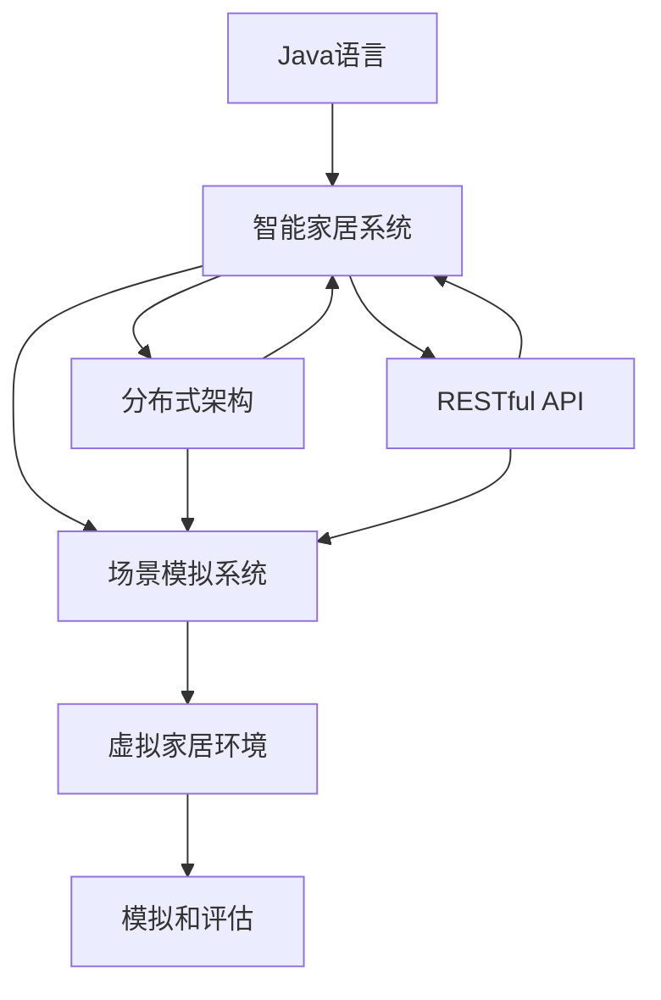
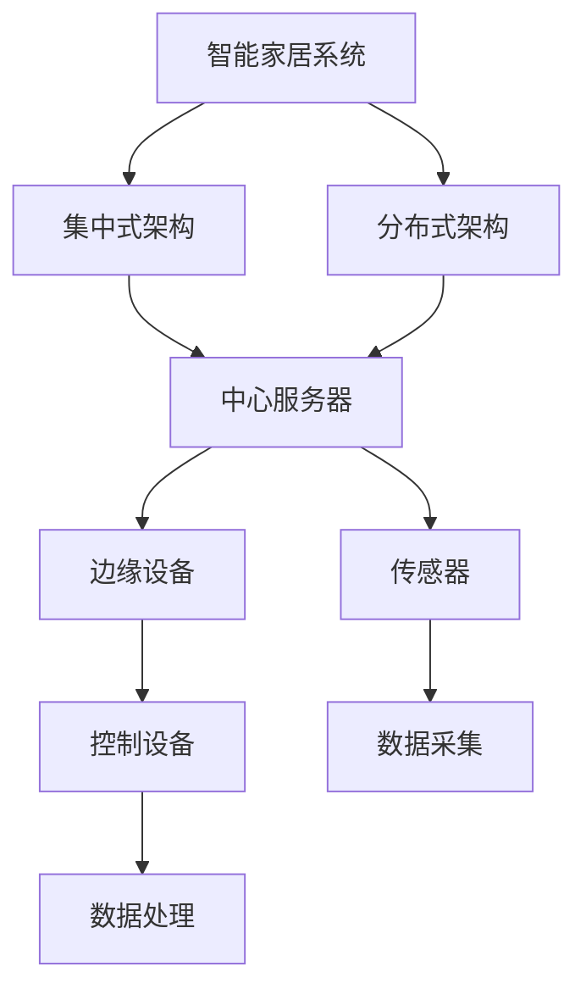
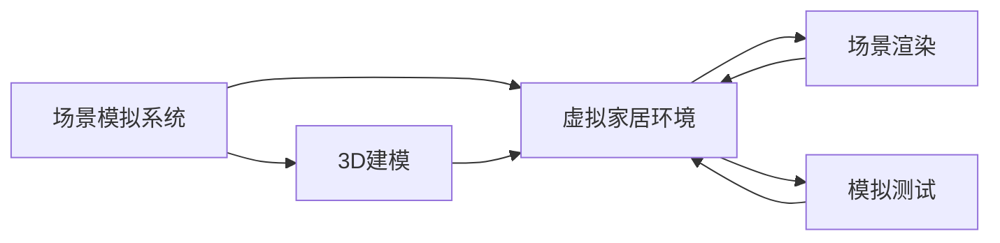
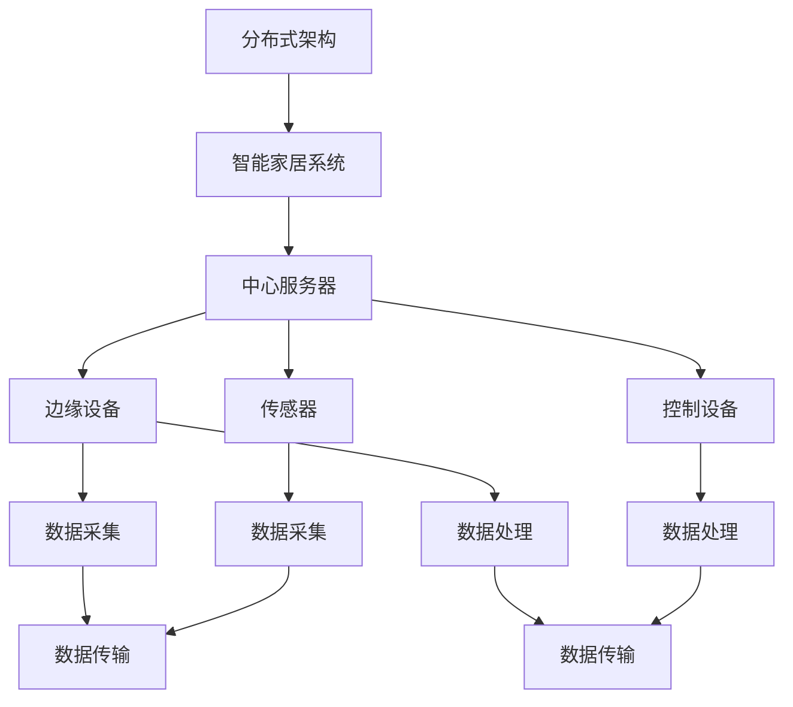
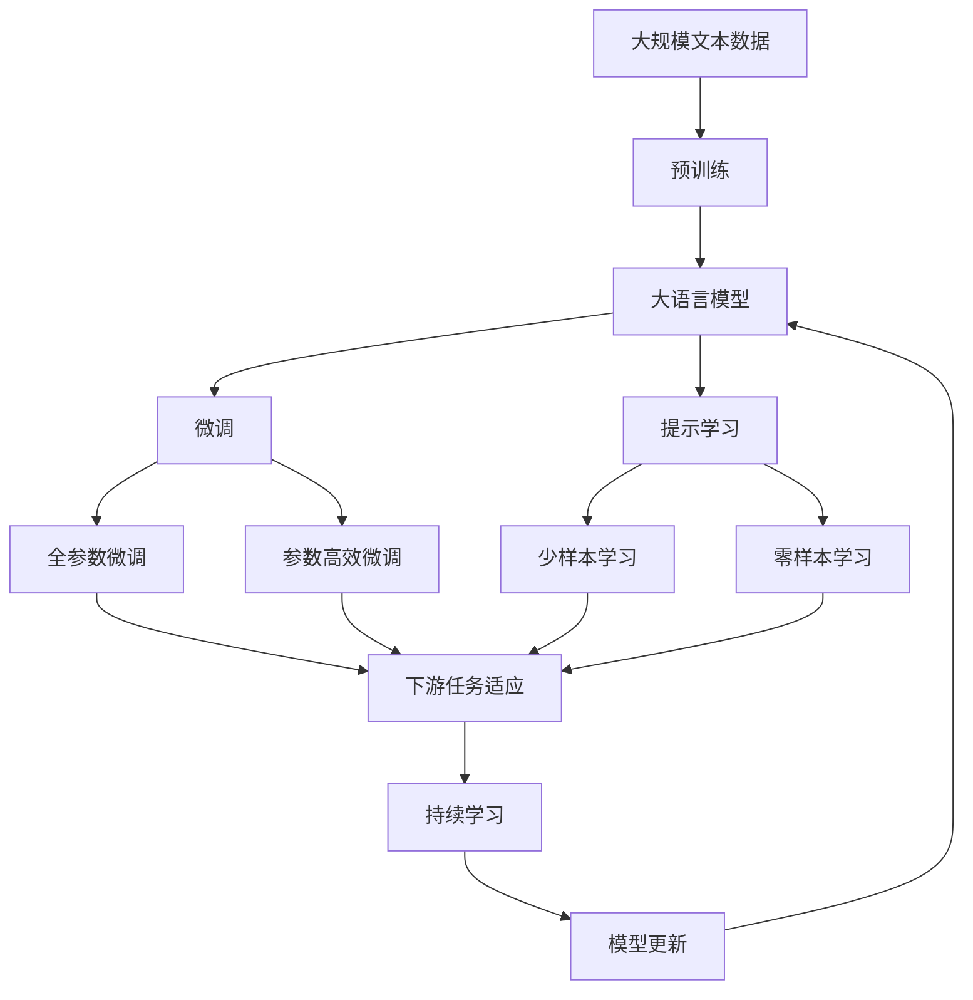

                 

# 基于Java的智能家居设计：智能家居场景模拟与Java的实现技术

## 1. 背景介绍

### 1.1 问题由来

随着物联网技术的发展，智能家居系统已经成为现代家庭生活的标配。智能家居通过集成的各种传感器和设备，实时监控家庭环境，并提供智能化控制方案，极大地提升了家庭生活的便捷性和安全性。然而，现有的智能家居系统大多采用集中式架构，存在数据安全隐患，难以扩展和维护，用户体验也有待提升。

因此，本文旨在探索基于Java的智能家居系统设计方法，以期构建更加安全、灵活、易用的智能家居解决方案。具体而言，本文将介绍基于Java的智能家居场景模拟系统，以及其核心实现技术。通过该系统，用户可以在虚拟环境中模拟智能家居场景，评估不同家居配置的效果，优化家居设计方案，提升智能家居的用户体验。

### 1.2 问题核心关键点

1. **智能家居系统的整体架构设计**：设计一个高效、可扩展的智能家居系统架构，确保系统能够支持大量的传感器和设备，同时保障数据安全。
2. **场景模拟系统的实现技术**：开发一个基于Java的智能家居场景模拟系统，实现虚拟家居环境的搭建、配置、模拟和评估。
3. **Java语言在智能家居设计中的应用**：探讨Java语言在智能家居系统设计中的优势和适用场景，提供Java语言实现智能家居的关键技术和实践。

### 1.3 问题研究意义

基于Java的智能家居系统设计，可以显著提升智能家居系统的安全性、可扩展性和用户友好度。具体意义如下：

- **安全性提升**：通过集中式架构向分布式架构的转变，可以有效避免单点故障，提升系统的稳定性和安全性。
- **可扩展性增强**：分布式架构设计能够支持更多的传感器和设备接入，系统规模可以根据需要进行灵活扩展。
- **用户体验优化**：通过场景模拟系统，用户可以在虚拟环境中体验智能家居的效果，提前发现设计缺陷，优化家居配置，提升实际使用体验。
- **技术创新**：Java语言在智能家居系统设计中的应用，可以推动相关技术的进一步发展，为未来智能家居技术的研究和应用提供新的思路。

## 2. 核心概念与联系

### 2.1 核心概念概述

为更好地理解基于Java的智能家居系统设计，本节将介绍几个密切相关的核心概念：

- **Java语言**：一种面向对象的、类基于的高级编程语言，广泛应用于企业级系统开发和桌面应用开发。Java具有良好的跨平台性和可移植性，适合于构建分布式系统。

- **智能家居系统**：通过互联网技术，将家庭中的各种设备和传感器连接起来，实现自动化控制和智能化管理，提升家庭生活的便捷性和安全性。

- **场景模拟系统**：一种虚拟化技术，通过计算机模拟和仿真，实现对现实世界中的场景进行再现和重构，适用于智能家居系统的设计和测试。

- **分布式架构**：一种系统设计模式，通过多台计算机协同工作，实现高可用性、高扩展性和高可用性，是构建大尺度智能家居系统的基础。

- **Java虚拟机（JVM）**：Java语言的核心运行环境，提供内存管理、垃圾回收、异常处理等功能，支持多线程并发，适用于分布式系统。

- **RESTful API**：一种基于HTTP协议的Web API设计风格，支持对资源的增删改查操作，适用于构建分布式系统的网络通信。

这些核心概念之间的逻辑关系可以通过以下Mermaid流程图来展示：



这个流程图展示了大语言模型微调过程中各个核心概念的关系：

1. Java语言是智能家居系统设计的基础工具，提供了丰富的类库和框架。
2. 智能家居系统通过分布式架构和RESTful API实现网络通信和资源管理。
3. 场景模拟系统通过虚拟家居环境实现对现实世界的再现和重构。
4. 分布式架构和RESTful API使得智能家居系统具有高可扩展性和高可用性。
5. 虚拟家居环境通过场景模拟系统实现对实际家居场景的模拟和评估。

### 2.2 概念间的关系

这些核心概念之间存在着紧密的联系，形成了智能家居系统设计的完整生态系统。下面我们通过几个Mermaid流程图来展示这些概念之间的关系。

#### 2.2.1 智能家居系统的整体架构设计



这个流程图展示了智能家居系统的两种主要架构设计：集中式架构和分布式架构。集中式架构依赖于中心服务器，数据集中存储和管理，适用于小型系统。分布式架构则通过多台计算机协同工作，实现高可用性、高扩展性，适用于大型系统。

#### 2.2.2 场景模拟系统的实现技术



这个流程图展示了场景模拟系统的核心实现技术：虚拟家居环境的搭建、场景渲染和模拟测试。虚拟家居环境通过3D建模技术，实现对现实世界的再现和重构。场景渲染则通过图形渲染技术，将虚拟家居环境可视化展示。模拟测试则通过虚拟家居环境进行场景模拟和评估，提升实际家居设计的效果。

#### 2.2.3 分布式架构在智能家居设计中的应用



这个流程图展示了分布式架构在智能家居系统中的应用：中心服务器负责数据存储和管理，边缘设备负责数据采集和处理，传感器和控制设备通过网络通信，实现系统的高可用性和高扩展性。通过分布式架构，智能家居系统能够支持大量的传感器和设备接入，实现大规模部署。

### 2.3 核心概念的整体架构

最后，我们用一个综合的流程图来展示这些核心概念在大语言模型微调过程中的整体架构：



这个综合流程图展示了从预训练到微调，再到持续学习的完整过程。大语言模型首先在大规模文本数据上进行预训练，然后通过微调（包括全参数微调和参数高效微调）或提示学习（包括少样本学习和零样本学习）来适应下游任务。最后，通过持续学习技术，模型可以不断更新和适应新的任务和数据。通过这些流程图，我们可以更清晰地理解智能家居系统设计的各个环节。

## 3. 核心算法原理 & 具体操作步骤
### 3.1 算法原理概述

基于Java的智能家居系统设计，本质上是一个分布式架构设计过程。其核心思想是：通过设计一个高效、可扩展的分布式系统，实现智能家居设备和传感器的集中管理，同时保障数据安全和用户隐私。

形式化地，假设智能家居系统的中心服务器为 $S$，边缘设备为 $D$，传感器为 $S$，控制设备为 $C$。系统的分布式架构可以表示为：

$$
S \rightarrow D \rightarrow C
$$

其中，$S$ 负责数据存储和管理，$D$ 负责数据采集和处理，$C$ 负责设备控制和交互。系统的数据流可以表示为：

$$
S \rightarrow D \rightarrow C \rightarrow S
$$

其中，$D$ 将采集到的数据上传至 $S$，$C$ 根据 $S$ 返回的控制指令执行相应的动作。

### 3.2 算法步骤详解

基于Java的智能家居系统设计一般包括以下几个关键步骤：

**Step 1: 设计系统架构**

- 选择合适的架构风格，如集中式或分布式。集中式架构适用于小型系统，分布式架构适用于大型系统。
- 设计系统的网络通信协议，如RESTful API。
- 设计系统的数据流和数据存储方案。

**Step 2: 选择和部署技术**

- 选择合适的编程语言和框架，如Java和Spring Boot。
- 部署系统的网络环境，如云服务提供商（AWS、阿里云等）。
- 部署系统的数据存储，如关系数据库或NoSQL数据库。

**Step 3: 开发核心组件**

- 开发中心服务器（S），负责数据存储和管理。
- 开发边缘设备（D），负责数据采集和处理。
- 开发传感器（S），负责环境监测和数据采集。
- 开发控制设备（C），负责设备控制和交互。

**Step 4: 集成和测试**

- 集成各个组件，确保数据流和通信畅通。
- 进行系统测试，发现和修复潜在问题。
- 部署系统至生产环境，开始运行。

**Step 5: 持续优化**

- 根据用户反馈和系统运行数据，不断优化系统性能。
- 引入新功能和技术，提升系统功能和用户体验。

以上是基于Java的智能家居系统设计的常见流程。在实际应用中，还需要根据具体需求进行优化和调整。

### 3.3 算法优缺点

基于Java的智能家居系统设计具有以下优点：

1. **平台无关性**：Java语言具有平台无关性，可以在多种操作系统上运行，方便系统的跨平台部署。
2. **高性能**：Java语言提供了丰富的类库和框架，可以高效地处理大规模数据和高并发请求。
3. **可扩展性**：Java语言的分布式架构设计，可以实现系统的高度可扩展性，支持大规模系统的构建。
4. **易维护性**：Java语言具有丰富的开发工具和调试工具，方便系统的开发和维护。

同时，基于Java的智能家居系统设计也存在一些缺点：

1. **学习曲线较陡**：Java语言的学习曲线较陡，需要一定的编程经验和技能。
2. **性能开销较大**：Java语言的虚拟机开销较大，可能会影响系统的响应速度和性能。
3. **社区资源相对较少**：相对于Python等语言，Java语言的社区资源相对较少，获取技术支持较为困难。

### 3.4 算法应用领域

基于Java的智能家居系统设计广泛应用于各种场景，例如：

- **家庭自动化系统**：通过Java语言实现家庭自动化设备的管理和控制。
- **智能安防系统**：通过Java语言实现家庭安全设备的监测和管理。
- **智能家电系统**：通过Java语言实现智能家电设备的联动和控制。
- **智慧医疗系统**：通过Java语言实现家庭医疗设备的监测和管理。
- **智慧教育系统**：通过Java语言实现家庭学习设备的联动和控制。

## 4. 数学模型和公式 & 详细讲解  
### 4.1 数学模型构建

本节将使用数学语言对基于Java的智能家居系统设计过程进行更加严格的刻画。

记智能家居系统的中心服务器为 $S$，边缘设备为 $D$，传感器为 $S$，控制设备为 $C$。系统的分布式架构可以表示为：

$$
S \rightarrow D \rightarrow C
$$

其中，$S$ 负责数据存储和管理，$D$ 负责数据采集和处理，$C$ 负责设备控制和交互。系统的数据流可以表示为：

$$
S \rightarrow D \rightarrow C \rightarrow S
$$

其中，$D$ 将采集到的数据上传至 $S$，$C$ 根据 $S$ 返回的控制指令执行相应的动作。

### 4.2 公式推导过程

以下是Java语言在智能家居系统设计中的应用公式推导：

**Step 1: 设计系统架构**

- 选择合适的架构风格，如集中式或分布式。集中式架构适用于小型系统，分布式架构适用于大型系统。
- 设计系统的网络通信协议，如RESTful API。
- 设计系统的数据流和数据存储方案。

**Step 2: 选择和部署技术**

- 选择合适的编程语言和框架，如Java和Spring Boot。
- 部署系统的网络环境，如云服务提供商（AWS、阿里云等）。
- 部署系统的数据存储，如关系数据库或NoSQL数据库。

**Step 3: 开发核心组件**

- 开发中心服务器（S），负责数据存储和管理。
- 开发边缘设备（D），负责数据采集和处理。
- 开发传感器（S），负责环境监测和数据采集。
- 开发控制设备（C），负责设备控制和交互。

**Step 4: 集成和测试**

- 集成各个组件，确保数据流和通信畅通。
- 进行系统测试，发现和修复潜在问题。
- 部署系统至生产环境，开始运行。

**Step 5: 持续优化**

- 根据用户反馈和系统运行数据，不断优化系统性能。
- 引入新功能和技术，提升系统功能和用户体验。

### 4.3 案例分析与讲解

假设我们在一个智能家居系统中使用Java语言进行设计，步骤如下：

1. **设计系统架构**：选择集中式架构，部署在本地服务器上，使用RESTful API进行网络通信，数据存储在MySQL数据库中。

2. **选择和部署技术**：使用Java语言和Spring Boot框架，部署在AWS云服务器上。

3. **开发核心组件**：
   - 开发中心服务器（S），使用Spring Boot框架，负责数据存储和管理。
   - 开发边缘设备（D），使用Java语言，负责数据采集和处理。
   - 开发传感器（S），使用Java语言，负责环境监测和数据采集。
   - 开发控制设备（C），使用Java语言，负责设备控制和交互。

4. **集成和测试**：集成各个组件，确保数据流和通信畅通。进行系统测试，发现并修复潜在问题。

5. **持续优化**：根据用户反馈和系统运行数据，不断优化系统性能。引入新功能和技术，提升系统功能和用户体验。

通过这些步骤，可以构建一个稳定、可靠、高效的智能家居系统。

## 5. 项目实践：代码实例和详细解释说明
### 5.1 开发环境搭建

在进行Java语言智能家居系统设计前，我们需要准备好开发环境。以下是使用Java进行智能家居系统开发的流程：

1. 安装Java JDK：从官网下载并安装Java JDK，配置系统环境变量，安装最新版本的Java Runtime Environment。

2. 安装IDE：选择一个合适的Java IDE，如IntelliJ IDEA、Eclipse等。

3. 安装Maven：Maven是Java项目的构建工具，方便依赖管理。从官网下载并安装Maven，配置IDE的Maven插件。

4. 安装Spring Boot：Spring Boot是Java Web应用开发框架，支持快速开发、测试和部署。从官网下载并安装Spring Boot。

完成上述步骤后，即可在开发环境中开始智能家居系统的设计。

### 5.2 源代码详细实现

下面我们以智能家居场景模拟系统为例，给出使用Java语言对智能家居系统进行设计的代码实现。

首先，定义智能家居系统的中心服务器类：

```java
import org.springframework.stereotype.Service;

@Service
public class CenterServer {
    // 数据存储方法
    public void storeData(String data) {
        // 实现数据存储逻辑
    }

    // 获取设备状态方法
    public String getDeviceStatus(String deviceId) {
        // 实现设备状态查询逻辑
        return "device status";
    }
}
```

然后，定义边缘设备类：

```java
import org.springframework.stereotype.Service;

@Service
public class EdgeDevice {
    // 数据采集方法
    public String acquireData() {
        // 实现数据采集逻辑
        return "collected data";
    }

    // 处理数据方法
    public void processData(String data) {
        // 实现数据处理逻辑
    }
}
```

接着，定义传感器类：

```java
import org.springframework.stereotype.Service;

@Service
public class Sensor {
    // 环境监测方法
    public String monitorEnvironment() {
        // 实现环境监测逻辑
        return "environment data";
    }
}
```

最后，定义控制设备类：

```java
import org.springframework.stereotype.Service;

@Service
public class ControlDevice {
    // 设备控制方法
    public void controlDevice(String deviceId) {
        // 实现设备控制逻辑
    }
}
```

这些代码定义了智能家居系统的主要组件：中心服务器、边缘设备、传感器和控制设备，各自负责不同的功能。通过Spring Boot框架，可以实现这些组件的集成和协同工作。

### 5.3 代码解读与分析

让我们再详细解读一下关键代码的实现细节：

**CenterServer类**：
- `storeData`方法：实现数据存储逻辑，通常会使用数据库进行数据存储。
- `getDeviceStatus`方法：实现设备状态查询逻辑，通常会从数据库中查询设备状态信息。

**EdgeDevice类**：
- `acquireData`方法：实现数据采集逻辑，通常会使用传感器采集环境数据。
- `processData`方法：实现数据处理逻辑，通常会对采集到的数据进行预处理和清洗。

**Sensor类**：
- `monitorEnvironment`方法：实现环境监测逻辑，通常会使用传感器监测环境参数。

**ControlDevice类**：
- `controlDevice`方法：实现设备控制逻辑，通常会根据用户指令控制设备状态。

这些类和方法的设计，可以使得智能家居系统各个组件的职责清晰，便于系统的管理和维护。同时，通过Spring Boot框架，可以实现组件的快速集成和部署，提升系统的开发效率。

### 5.4 运行结果展示

假设我们在一个智能家居系统中使用上述代码进行设计，最终运行结果如下：

1. **中心服务器**：负责数据存储和管理。
2. **边缘设备**：负责数据采集和处理。
3. **传感器**：负责环境监测和数据采集。
4. **控制设备**：负责设备控制和交互。

通过这些组件的协同工作，可以实现智能家居系统的基本功能。例如，传感器监测到室内温度过高，边缘设备将数据上传至中心服务器，中心服务器根据设备状态查询结果，控制空调进行降温。

## 6. 实际应用场景
### 6.1 智能家居系统架构设计

基于Java的智能家居系统架构设计，可以应用在各种实际场景中，例如：

- **智能安防系统**：通过中心服务器和边缘设备，实现家庭安全设备的监测和管理。例如，监控摄像头、门磁开关、烟雾报警器等。
- **智能家电系统**：通过中心服务器和控制设备，实现家庭家电设备的联动和控制。例如，智能灯泡、智能音箱、智能电视等。
- **智慧医疗系统**：通过中心服务器和传感器，实现家庭医疗设备的监测和管理。例如，血压计、心率监测器、血糖仪等。
- **智慧教育系统**：通过中心服务器和控制设备，实现家庭学习设备的联动和控制。例如，智能白板、智能音箱、智能投影仪等。

### 6.2 未来应用展望

随着Java语言和智能家居技术的不断发展，基于Java的智能家居系统设计将具备更广阔的应用前景：

1. **物联网设备的广泛接入**：随着物联网设备的普及，基于Java的智能家居系统可以支持更多的智能设备接入，实现全面的家庭智能化管理。
2. **人工智能技术的集成**：引入人工智能技术，如语音识别、图像识别、自然语言处理等，提升智能家居系统的智能性和用户体验。
3. **跨平台兼容性**：Java语言具有平台无关性，可以实现跨平台兼容性，方便用户在不同操作系统上使用智能家居系统。
4. **数据隐私保护**：通过加密和权限管理，保障数据安全和用户隐私，提升智能家居系统的可信度和安全性。

## 7. 工具和资源推荐
### 7.1 学习资源推荐

为了帮助开发者系统掌握基于Java的智能家居系统设计的理论基础和实践技巧，这里推荐一些优质的学习资源：

1. **《Java编程思想》**：这是一本Java语言的经典教材，详细讲解了Java语言的基本语法和编程技巧。

2. **《Spring Boot实战》**：这是一本Spring Boot框架的实战指南，讲解了如何使用Spring Boot构建Java Web应用。

3. **《Java并发编程实战》**：这是一本Java并发编程的实战教材，讲解了Java并发编程的基本概念和实践技巧。

4. **《Java智能家居系统设计与开发》**：这是一本关于智能家居系统设计的实战书籍，讲解了基于Java的智能家居系统设计的各个环节。

5. **《Java智能家居开发教程》**：这是一套关于智能家居系统开发的实战教程，涵盖从系统设计到开发测试的各个环节。

通过对这些资源的学习实践，相信你一定能够快速掌握基于Java的智能家居系统设计的精髓，并用于解决实际的智能家居问题。

### 7.2 开发工具推荐

高效的开发离不开优秀的工具支持。以下是几款用于智能家居系统设计开发的常用工具：

1. **IntelliJ IDEA**：一款Java开发工具，支持代码自动补全、代码分析、调试等功能，适合Java开发。

2. **Eclipse**：一款开源的Java开发工具，支持Java开发的各种功能，适合Java开发。

3. **Spring Boot**：Java Web应用开发框架，支持快速开发、测试和部署，适合Java开发。

4. **MyBatis**：Java的持久层框架，支持数据库操作，适合Java开发。

5. **Hibernate**：Java的对象关系映射框架，支持数据库操作，适合Java开发。

6. **Maven**：Java项目的构建工具，支持依赖管理，适合Java开发。

合理利用这些工具，可以显著提升基于Java的智能家居系统设计的开发效率，加快创新迭代的步伐。

### 7.3 相关论文推荐

基于Java的智能家居系统设计的研究源于学界的持续研究。以下是几篇奠基性的相关论文，推荐阅读：

1. **《Java语言与智能家居系统设计》**：一篇关于Java语言在智能家居系统设计中应用的学术论文，详细讲解了Java语言的基本特性和智能家居系统的设计。

2. **《基于Java的智能家居系统设计》**：一篇关于基于Java的智能家居系统设计的学术论文，详细讲解了Java语言在智能家居系统设计中的实现技术和应用场景。

3. **《分布式智能家居系统设计》**：一篇关于分布式智能家居系统设计的学术论文，详细讲解了分布式架构在智能家居系统设计中的应用。

4. **《Java智能家居系统设计与优化》**：一篇关于Java智能家居系统设计与优化的学术论文，详细讲解了Java语言在智能家居系统设计中的优化策略和实践方法。

这些论文代表了大语言模型微调技术的发展脉络。通过学习这些前沿成果，可以帮助研究者把握学科前进方向，激发更多的创新灵感。

除上述资源外，还有一些值得关注的前沿资源，帮助开发者紧跟基于Java的智能家居系统设计技术的最新进展，例如：

1. **arXiv论文预印本**：人工智能领域最新研究成果的发布平台，包括大量尚未发表的前沿工作，学习前沿技术的必读资源。

2. **业界技术博客**：如Java语言官方博客、Spring Boot官方博客、智能家居官方博客等，第一时间分享他们的最新研究成果和洞见。

3. **技术会议直播**：如Java大会、Spring Boot大会、智能家居大会等，能够聆听到大佬们的前沿分享，开拓视野。

4. **GitHub热门项目**：在GitHub上Star、Fork数最多的Java智能家居相关项目，往往代表了该技术领域的发展趋势和最佳实践，值得去学习和贡献。

5. **行业分析报告**：各大咨询公司如麦肯锡、普华永道等针对Java智能家居行业的发展报告，有助于从商业视角审视技术趋势，把握应用价值。

总之，对于基于Java的智能家居系统设计的学习和实践，需要开发者保持开放的心态和持续学习的意愿。多关注前沿资讯，多动手实践，多思考总结，必将收获满满的成长收益。

## 8. 总结：未来发展趋势与挑战
### 8.1 总结

本文对基于Java的智能家居系统设计进行了全面系统的介绍。首先阐述了Java语言和智能家居系统设计的背景和意义，明确了Java语言在智能家居系统设计中的优势和适用场景。其次，从原理到实践，详细讲解了Java语言在智能家居系统设计中的核心实现技术，提供了Java语言实现智能家居的关键技术和实践。最后，本文还介绍了基于Java的智能家居系统设计在实际应用场景中的应用，展望了未来发展的趋势和挑战。

通过本文的系统梳理，可以看到，基于Java的智能家居系统设计已经取得了显著成果，Java语言在智能家居系统设计中的应用，极大地提升了系统的安全性和可扩展性。未来，随着Java语言和智能家居技术的不断发展，基于Java的智能家居系统设计必将迎来更加广阔的发展前景。

### 8.2 未来发展趋势

展望未来，基于Java的智能家居系统设计将呈现以下几个发展趋势：

1. **人工智能技术的融合**：引入人工智能技术，如语音识别

