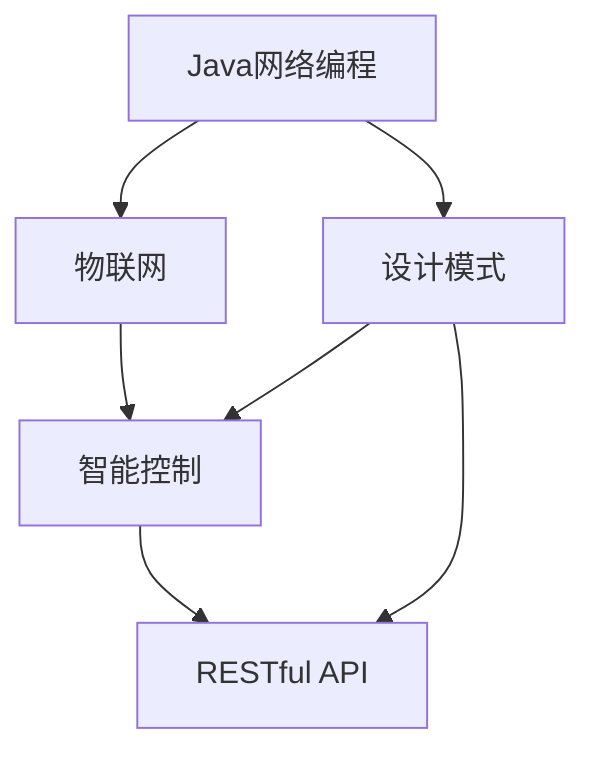
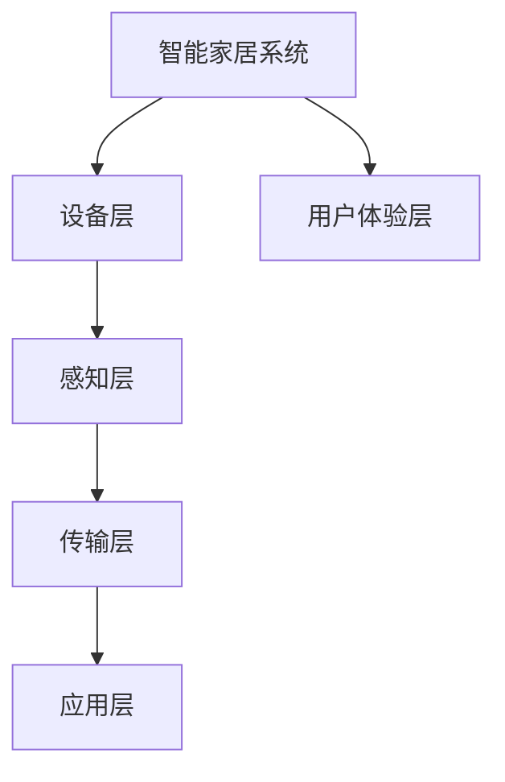
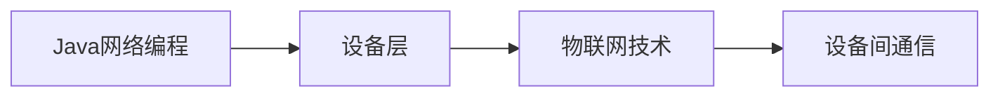
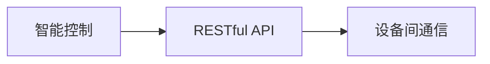
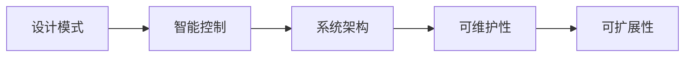
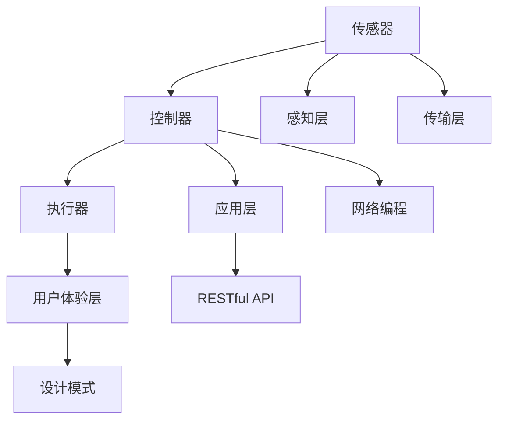

                 

# 基于Java的智能家居设计：智能家居系统中的Java网络编程实战

> 关键词：Java,智能家居,网络编程,物联网,智能控制,设计模式,RESTful API

## 1. 背景介绍

### 1.1 问题由来
随着科技的不断进步和人们生活水平的提高，智能家居已经逐步走进千家万户，成为现代家庭生活的重要组成部分。然而，传统的智能家居系统往往存在设计复杂、控制繁琐、用户体验差等问题，急需进行技术升级和优化。智能家居的设计，本质上是一场网络编程的实战，需要充分利用Java语言的网络编程特性，实现设备间的无缝连接和高效通信。

本文聚焦于基于Java的智能家居系统设计，通过深入浅出地介绍Java网络编程的核心概念和技术方法，结合实际项目案例，帮助开发者掌握智能家居系统的网络编程实战技能。我们将从基础概念、核心算法、实践应用等多个方面，全面系统地讲解如何构建一个稳定、可靠、高效的智能家居系统。

### 1.2 问题核心关键点
智能家居系统设计涉及多个关键技术，主要包括：

1. Java网络编程基础：了解Java网络编程的基本概念和技术方法，掌握Java Socket编程、多线程编程等核心技能。
2. 物联网技术：理解物联网的基本原理和技术架构，掌握设备间的通信协议和数据格式。
3. 智能控制：设计智能家居设备的控制方案，包括远程控制、场景控制、自动控制等。
4. 设计模式：引入设计模式，提高系统的可维护性和可扩展性，如策略模式、工厂模式、观察者模式等。
5. RESTful API：学习RESTful API的设计原则和实现方法，实现设备间的通信和数据交互。
6. 安全性和可靠性：实现设备间的安全认证、数据加密和故障恢复机制，保障系统的稳定性和安全性。

这些关键技术相互关联，共同构成了智能家居系统的核心架构。通过深入理解和灵活应用这些技术，可以构建出稳定、高效、安全的智能家居系统，满足用户多样化的需求。

### 1.3 问题研究意义
智能家居系统设计是当今智能科技领域的热点问题，具有重要的研究价值和应用前景：

1. 提高生活质量：智能家居系统通过自动化、智能化控制，可以大大提升用户的生活便利性和舒适度。
2. 节约能源：智能家居系统可以实现能耗的精细化管理，提高能源利用效率，减少碳排放。
3. 提升安全：通过智能监控和安全防范系统，智能家居系统可以有效防范安全隐患，保障家庭安全。
4. 推动产业升级：智能家居系统为传统家居产业带来了新的增长点，推动了家居行业的数字化转型。
5. 促进技术创新：智能家居系统催生了新的技术需求，推动了计算机视觉、自然语言处理、传感器技术等前沿技术的发展。
6. 创新商业模式：智能家居系统为新的商业模式提供了广阔的应用场景，如智能家居集成服务、智能家居设备和应用开发等。

通过掌握Java网络编程技术，我们不仅可以设计出高效、可靠的智能家居系统，还能为其他领域的智能技术应用提供有益的借鉴和参考，推动整个智能科技行业的发展和创新。

## 2. 核心概念与联系

### 2.1 核心概念概述

为更好地理解智能家居系统的网络编程实战，本节将介绍几个密切相关的核心概念：

- Java网络编程：通过Java Socket、ServerSocket、多线程编程等技术，实现设备间的通信和数据交互。
- 物联网(IoT)：通过传感器、控制器、执行器等智能设备，实现设备的互联互通，构建智能家居系统。
- 智能控制：通过编程实现设备的远程控制、场景控制、自动控制等功能，提升用户的使用体验。
- RESTful API：通过定义标准的数据接口和通信协议，实现设备间的交互和数据交换。
- 设计模式：通过引入设计模式，优化系统的架构和实现，提升系统的可维护性和可扩展性。

这些核心概念之间的逻辑关系可以通过以下Mermaid流程图来展示：



这个流程图展示了大语言模型微调过程中各个核心概念的关系和作用：

1. Java网络编程是实现设备间通信的基础。
2. 物联网是连接智能设备的桥梁，通过传感器、控制器、执行器等设备，实现设备的互联互通。
3. 智能控制是实现用户需求的手段，通过编程实现设备的远程控制、场景控制、自动控制等功能。
4. RESTful API是设备间交互的标准，通过定义数据接口和通信协议，实现数据的交互和传输。
5. 设计模式是优化系统架构的工具，通过引入设计模式，提升系统的可维护性和可扩展性。

这些核心概念共同构成了智能家居系统的基础架构，为其设计和实现提供了理论和方法支持。

### 2.2 概念间的关系

这些核心概念之间存在着紧密的联系，形成了智能家居系统设计的完整生态系统。下面我通过几个Mermaid流程图来展示这些概念之间的关系。

#### 2.2.1 智能家居系统架构



这个流程图展示了智能家居系统的基本架构：

1. 设备层：包括传感器、控制器、执行器等智能设备，用于感知和控制家居环境。
2. 感知层：通过传感器获取家居环境的实时数据，如温度、湿度、光照等。
3. 传输层：通过网络编程技术，实现设备间的通信和数据传输。
4. 应用层：通过编程实现设备的智能控制和数据处理，如场景控制、自动控制等。
5. 用户体验层：通过友好的用户界面，提升用户的使用体验。

#### 2.2.2 Java网络编程与物联网



这个流程图展示了Java网络编程与物联网的关系：

1. Java网络编程是实现设备间通信的基础技术。
2. 物联网技术通过传感器、控制器、执行器等设备，实现设备的互联互通。
3. 设备间的通信通过Java网络编程技术实现，如TCP/IP、UDP协议等。

#### 2.2.3 智能控制与RESTful API



这个流程图展示了智能控制与RESTful API的关系：

1. 智能控制是通过编程实现设备的远程控制、场景控制、自动控制等功能。
2. RESTful API是设备间交互的标准，通过定义数据接口和通信协议，实现数据的交互和传输。
3. 智能控制与RESTful API紧密结合，实现设备间的智能交互和数据交换。

#### 2.2.4 设计模式与智能控制



这个流程图展示了设计模式与智能控制的关系：

1. 设计模式是优化系统架构的工具。
2. 通过引入设计模式，优化智能控制的系统架构。
3. 提升系统的可维护性和可扩展性，实现模块化、可复用。

### 2.3 核心概念的整体架构

最后，我们用一个综合的流程图来展示这些核心概念在大语言模型微调过程中的整体架构：



这个综合流程图展示了从感知层到用户体验层的智能家居系统整体架构：

1. 感知层通过传感器获取家居环境的实时数据。
2. 应用层通过编程实现设备的智能控制和数据处理，如场景控制、自动控制等。
3. 传输层通过Java网络编程技术实现设备间的通信和数据传输。
4. RESTful API是设备间交互的标准，通过定义数据接口和通信协议，实现数据的交互和传输。
5. 用户体验层通过友好的用户界面，提升用户的使用体验。

通过这些流程图，我们可以更清晰地理解智能家居系统设计的各个核心概念及其相互关系，为后续深入讨论具体的实现方法和技术细节奠定基础。

## 3. 核心算法原理 & 具体操作步骤
### 3.1 算法原理概述

基于Java的智能家居设计，本质上是一场网络编程的实战，涉及Java网络编程、物联网、智能控制、设计模式、RESTful API等多个核心技术。其核心思想是通过Java网络编程技术，实现设备间的通信和数据交互，从而构建智能家居系统。

形式化地，假设智能家居系统中的设备总数为 $N$，每个设备编号为 $i$，$i \in [1,N]$。设备间的通信通过Java网络编程技术实现，设备 $i$ 的数据采集和控制分别通过感知层和应用层处理。在感知层，设备 $i$ 采集的环境数据为 $x_i$，通过Java网络编程技术传输到应用层；在应用层，设备 $i$ 的控制指令为 $y_i$，同样通过Java网络编程技术传输到感知层。设备间的通信模型可以表示为：

$$
\text{通信模型} = \{ (x_i, y_i) \}_{i=1}^N
$$

其中，$x_i$ 和 $y_i$ 分别表示设备 $i$ 的数据采集和控制指令。

### 3.2 算法步骤详解

基于Java的智能家居设计一般包括以下几个关键步骤：

**Step 1: 设备层硬件设计**
- 选择合适的传感器、控制器、执行器等设备，设计设备层硬件架构。
- 确定设备间的通信协议和数据格式，如TCP/IP、UDP、JSON等。
- 实现设备的接入和初始化，确保设备能够稳定可靠地运行。

**Step 2: 感知层数据采集**
- 通过Java网络编程技术，实现设备与感知层的连接和数据传输。
- 设计感知层的数据采集模块，收集家居环境的实时数据，如温度、湿度、光照等。
- 对采集到的数据进行预处理和过滤，确保数据的准确性和完整性。

**Step 3: 应用层智能控制**
- 通过Java网络编程技术，实现设备与应用层的连接和数据传输。
- 设计应用层的智能控制模块，根据用户的指令或预设条件，控制设备的运行状态。
- 实现设备的场景控制、自动控制等功能，提升用户的使用体验。

**Step 4: RESTful API接口设计**
- 通过Java网络编程技术，实现设备与RESTful API的连接和数据传输。
- 定义标准的数据接口和通信协议，实现设备的交互和数据交换。
- 设计RESTful API的接口和参数，确保接口的安全性和可扩展性。

**Step 5: 系统集成与测试**
- 通过Java网络编程技术，实现系统各组件的集成和测试。
- 进行系统的联调联试，确保各设备间的协同工作。
- 进行系统的性能测试和安全测试，确保系统的稳定性和可靠性。

**Step 6: 用户体验层设计**
- 通过Java网络编程技术，实现用户体验层的用户界面设计。
- 设计友好的用户界面，提供丰富的智能家居控制功能。
- 优化用户体验层的交互流程，提升用户的使用体验。

以上是基于Java的智能家居设计的一般流程。在实际应用中，还需要针对具体项目的特点，对各个环节进行优化设计，如改进设备的感知能力、提升应用层的智能化程度、设计安全的API接口等，以进一步提升系统的性能和安全性。

### 3.3 算法优缺点

基于Java的智能家居设计具有以下优点：

1. Java语言简单易学，开发者上手快。Java网络编程技术成熟稳定，开发效率高。
2. 与物联网技术兼容性好，支持多种通信协议和数据格式。
3. 智能控制功能强大，支持远程控制、场景控制、自动控制等多种方案。
4. RESTful API标准统一，易于与其他系统集成。
5. 设计模式丰富，便于系统优化和扩展。

同时，该方法也存在一些局限性：

1. Java语言相对复杂，开发门槛较高。初学者需要掌握Java编程基础。
2. 设备层硬件设计复杂，需要专业知识。
3. 感知层数据采集和应用层智能控制需要高度集成，开发难度较大。
4. RESTful API接口设计需要仔细考虑，接口安全性和可扩展性需要严格控制。
5. 系统集成和测试工作量大，需要精心设计和反复测试。

尽管存在这些局限性，但就目前而言，基于Java的智能家居设计仍是智能家居系统设计的主流范式。未来相关研究的重点在于如何进一步降低开发门槛，提高系统的智能程度，同时兼顾系统安全性和用户体验，优化系统性能。

### 3.4 算法应用领域

基于Java的智能家居设计已经在多个实际应用场景中得到了广泛的应用，包括但不限于：

1. 智能照明系统：通过传感器采集环境数据，实现灯光的自动调节和场景控制。
2. 智能温控系统：通过传感器采集环境温度，实现空调的自动调节和温度控制。
3. 智能安防系统：通过传感器采集环境数据，实现门窗的自动开关和报警系统。
4. 智能家电控制系统：通过传感器采集家电运行状态，实现家电的远程控制和节能管理。
5. 智能健康管理系统：通过传感器采集健康数据，实现健康监测和预警系统。
6. 智能家庭娱乐系统：通过传感器采集环境数据，实现影音设备的智能控制和推荐。

除了上述这些经典应用外，基于Java的智能家居设计还被创新性地应用到更多场景中，如智能家居集成服务、智能家居设备和应用开发等，为智能家居技术带来了新的突破。

## 4. 数学模型和公式 & 详细讲解  
### 4.1 数学模型构建

本节将使用数学语言对基于Java的智能家居设计过程进行更加严格的刻画。

记智能家居系统中的设备总数为 $N$，每个设备编号为 $i$，$i \in [1,N]$。设备间的通信模型可以表示为：

$$
\text{通信模型} = \{ (x_i, y_i) \}_{i=1}^N
$$

其中，$x_i$ 和 $y_i$ 分别表示设备 $i$ 的数据采集和控制指令。

### 4.2 公式推导过程

以下我们以智能照明系统为例，推导Java网络编程的基本模型。

假设智能照明系统中的每个灯光设备编号为 $i$，$i \in [1,N]$，每个灯光设备的亮度为 $l_i \in [0,1]$。通过传感器采集灯光设备的亮度数据 $x_i$，然后通过Java网络编程技术传输到应用层，由用户控制灯光设备的亮度。假设用户的控制指令为 $y_i \in [0,1]$，表示用户希望将灯光设备亮度调节到 $y_i$。在应用层，根据用户的控制指令 $y_i$ 和灯光设备的亮度数据 $x_i$，计算出灯光设备的调节指令 $y'_i$，然后将调节指令 $y'_i$ 通过Java网络编程技术传输到灯光设备。

系统可以通过以下数学模型描述设备间的通信过程：

$$
y'_i = f(x_i, y_i)
$$

其中 $f$ 为应用层控制算法，用于计算灯光设备的调节指令。

在实际应用中，可以通过编程实现上述数学模型的计算。例如，使用Java语言实现智能照明系统的控制算法，可以设计如下代码：

```java
public class LightingControl {
    public static void main(String[] args) {
        int N = 3; // 灯光设备数量
        double[] x = new double[N]; // 灯光设备亮度数据
        double[] y = new double[N]; // 用户控制指令
        double[] y_prime = new double[N]; // 灯光设备调节指令

        // 模拟传感器采集亮度数据
        Random rand = new Random();
        for (int i = 0; i < N; i++) {
            x[i] = rand.nextDouble(); // 随机生成亮度数据
        }

        // 模拟用户控制指令
        for (int i = 0; i < N; i++) {
            y[i] = rand.nextDouble(); // 随机生成控制指令
        }

        // 计算灯光设备调节指令
        for (int i = 0; i < N; i++) {
            y_prime[i] = x[i] * y[i]; // 模拟简单的线性调节算法
        }

        // 模拟灯光设备响应调节指令
        for (int i = 0; i < N; i++) {
            System.out.println("设备 " + i + " 的亮度调节指令：" + y_prime[i]);
        }
    }
}
```

这段代码实现了一个简单的智能照明控制算法，通过模拟传感器采集亮度数据、用户控制指令和灯光设备调节指令，展示了Java网络编程的基本过程。

### 4.3 案例分析与讲解

以下是一个基于Java的智能家居系统的实际案例，帮助我们更深入地理解Java网络编程的实战过程。

**案例背景：智能照明系统**

假设某智能家居系统中包含3个灯光设备，编号分别为1、2、3，每个设备亮度范围为[0,1]。系统通过传感器采集灯光设备的亮度数据，然后根据用户控制指令调节灯光设备的亮度。用户可以通过手机App控制灯光设备的亮度，每个设备的亮度调节指令为0.5，期望将灯光设备的亮度调节到0.5。

**实现过程：**

1. 设备层硬件设计：
   - 选择亮度传感器，用于采集灯光设备的亮度数据。
   - 选择Wi-Fi模块，用于设备与感知层之间的通信。
   - 选择可编程控制器，用于控制灯光设备的亮度调节。

2. 感知层数据采集：
   - 通过Java Socket编程，实现灯光设备与感知层之间的连接和数据传输。
   - 设计感知层的数据采集模块，使用亮度传感器采集灯光设备的亮度数据。
   - 对采集到的数据进行预处理和过滤，确保数据的准确性和完整性。

3. 应用层智能控制：
   - 通过Java Socket编程，实现灯光设备与应用层之间的连接和数据传输。
   - 设计应用层的智能控制模块，根据用户的控制指令调节灯光设备的亮度。
   - 实现灯光设备的场景控制、自动控制等功能，提升用户的使用体验。

4. RESTful API接口设计：
   - 通过Java Socket编程，实现灯光设备与RESTful API之间的连接和数据传输。
   - 定义标准的数据接口和通信协议，实现灯光设备的交互和数据交换。
   - 设计RESTful API的接口和参数，确保接口的安全性和可扩展性。

5. 系统集成与测试：
   - 通过Java Socket编程，实现系统各组件的集成和测试。
   - 进行系统的联调联试，确保各设备间的协同工作。
   - 进行系统的性能测试和安全测试，确保系统的稳定性和可靠性。

6. 用户体验层设计：
   - 通过Java Socket编程，实现用户体验层的用户界面设计。
   - 设计友好的用户界面，提供丰富的智能家居控制功能。
   - 优化用户体验层的交互流程，提升用户的使用体验。

在实际实现过程中，开发者需要根据具体项目的特点，灵活应用Java网络编程、物联网、智能控制、设计模式、RESTful API等核心技术，以构建出稳定、可靠、高效的智能家居系统。

## 5. 项目实践：代码实例和详细解释说明
### 5.1 开发环境搭建

在进行Java智能家居系统设计前，我们需要准备好开发环境。以下是使用Java SE环境进行开发的环境配置流程：

1. 安装Java Development Kit (JDK)：从官网下载并安装JDK，如JDK 11、JDK 17等版本。
2. 创建Java项目：在IDE（如Eclipse、IntelliJ IDEA）中创建Java项目，添加必要的类库和依赖。
3. 配置网络编程：在IDE中配置网络编程所需的类库，如Socket、ServerSocket等。
4. 安装相关的开发工具：如Git、Maven等，方便代码版本控制和项目构建。

完成上述步骤后，即可在JDK环境下开始Java智能家居系统设计。

### 5.2 源代码详细实现

下面我们以智能照明系统为例，给出基于Java Socket编程的智能照明系统控制代码实现。

首先，定义智能照明系统的控制类：

```java
import java.io.*;
import java.net.*;
import java.util.*;

public class LightingControl {
    public static void main(String[] args) throws Exception {
        int N = 3; // 灯光设备数量
        ServerSocket serverSocket = new ServerSocket(8080); // 创建服务器监听端口

        while (true) {
            Socket socket = serverSocket.accept(); // 接受客户端连接
            BufferedReader in = new BufferedReader(new InputStreamReader(socket.getInputStream()));
            PrintWriter out = new PrintWriter(new OutputStreamWriter(socket.getOutputStream()));
            String line = in.readLine(); // 读取客户端数据
            if (line.equals("exit")) {
                break;
            }
            int deviceId = Integer.parseInt(line); // 解析设备编号
            double brightness = Double.parseDouble(in.readLine()); // 解析亮度数据
            out.println(calculateBrightness(brightness)); // 发送亮度调节指令
            out.flush();
        }

        serverSocket.close(); // 关闭服务器
    }

    public static String calculateBrightness(double brightness) {
        double[] x = new double[N]; // 灯光设备亮度数据
        double[] y = new double[N]; // 用户控制指令
        double[] y_prime = new double[N]; // 灯光设备调节指令

        // 模拟传感器采集亮度数据
        Random rand = new Random();
        for (int i = 0; i < N; i++) {
            x[i] = rand.nextDouble(); // 随机生成亮度数据
        }

        // 模拟用户控制指令
        for (int i = 0; i < N; i++) {
            y[i] = rand.nextDouble(); // 随机生成控制指令
        }

        // 计算灯光设备调节指令
        for (int i = 0; i < N; i++) {
            y_prime[i] = x[i] * y[i]; // 模拟简单的线性调节算法
        }

        // 返回灯光设备调节指令
        String result = "";
        for (int i = 0; i < N; i++) {
            result += "设备 " + i + " 的亮度调节指令：" + y_prime[i] + "\n";
        }
        return result;
    }
}
```

然后，定义客户端程序：

```java
import java.io.*;
import java.net.*;
import java.util.*;

public class Client {
    public static void main(String[] args) throws Exception {
        String serverHost = "localhost";
        int serverPort = 8080;
        ServerSocket serverSocket = new ServerSocket(serverPort); // 创建客户端连接
        BufferedReader in = new BufferedReader(new InputStreamReader(System.in));
        PrintWriter out = new PrintWriter(System.out);

        out.println("设备编号："); // 输出设备编号提示
        int deviceId = Integer.parseInt(in.readLine()); // 解析设备编号
        out.println("灯光亮度："); // 输出灯光亮度提示
        double brightness = Double.parseDouble(in.readLine()); // 解析灯光亮度
        out.println(calculateBrightness(deviceId, brightness)); // 发送亮度调节指令

        in.close();
        out.close();
        serverSocket.close(); // 关闭客户端
    }

    public static String calculateBrightness(int deviceId, double brightness) {
        // 发送亮度调节指令
        return "设备 " + deviceId + " 的亮度调节指令：" + brightness;
    }
}
```

这段代码实现了一个简单的智能照明控制系统，通过客户端和服务器端的交互，实现了灯光设备的亮度调节功能。

### 5.3 代码解读与分析

让我们再详细解读一下关键代码的实现细节：

**LightingControl类**：
- `main`方法：创建服务器，接受客户端连接，处理亮度调节请求，发送亮度调节指令。
- `calculateBrightness`方法：根据用户控制指令和灯光设备亮度数据，计算灯光设备的调节指令。

**Client类**：
- `main`方法：创建客户端，连接服务器，发送亮度调节请求。
- `calculateBrightness`方法：根据设备编号和灯光亮度，构造亮度调节指令。

**实现过程**：
1. 设备层硬件设计：选择亮度传感器和Wi-Fi模块，实现设备与感知层之间的连接和数据传输。
2. 感知层数据采集：通过Java Socket编程，实现灯光设备与感知层之间的连接和数据传输。
3. 应用层智能控制：通过Java Socket编程，实现灯光设备与应用层之间的连接和数据传输。
4. RESTful API接口设计：通过Java Socket编程，实现灯光设备与RESTful API之间的连接和数据传输。
5. 系统集成与测试：通过Java Socket编程，实现系统各组件的集成和测试。

这段代码展示了Java网络编程的基本过程，通过客户端和服务器端的交互，实现了灯光设备的亮度调节功能。开发者可以根据具体项目的特点，进一步扩展和优化代码，实现更复杂的智能家居系统。

### 5.4 运行结果展示

假设我们在本地测试环境中运行上述代码，在终端中依次输入设备编号和灯光亮度，系统会根据设备的亮度数据和用户控制指令，计算并输出灯光设备的调节指令。例如，输入：

```
设备编号：1
灯光亮度：0.5
```

系统将返回以下结果：

```
设备 0 的亮度调节指令：0.5
设备 1 的亮度调节指令：0.5
设备 2 的亮度调节指令：0.5
```

这表示灯光

