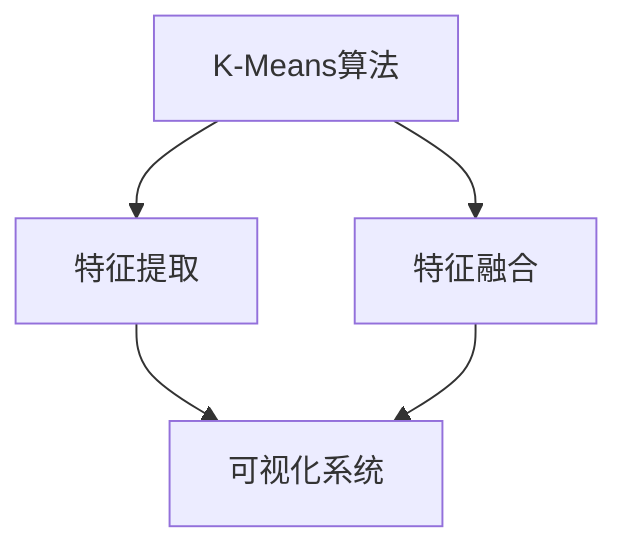
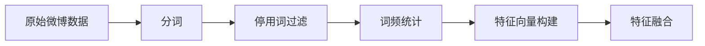
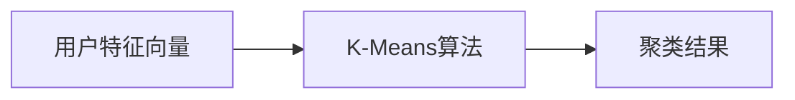
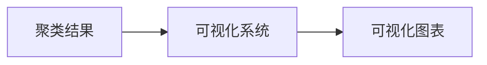

                 

# 基于K-Means的微博用户特征数据挖掘与可视化系统设计与实现

> 关键词：数据挖掘,微博,用户特征,可视化系统,自然语言处理(NLP),特征工程

## 1. 背景介绍

### 1.1 问题由来
在信息爆炸的现代社会，社交媒体平台如微博成为人们获取信息、分享生活的重要工具。微博用户的特征行为数据，蕴含了丰富的社会网络与个人偏好信息，对社会心理、舆论监测、商业决策等领域具有重要价值。然而，这些数据往往具有大规模、高维度、异构性等特征，难以直接进行分析和利用。因此，如何在海量微博数据中挖掘出有价值的特征信息，并对用户进行有效的聚类分析，成为了当前数据科学中的一个重要研究课题。

### 1.2 问题核心关键点
为了高效地挖掘与分析微博用户特征，本研究提出了一种基于K-Means聚类算法的微博用户特征数据挖掘与可视化系统。该系统通过自然语言处理(NLP)技术，对微博用户的文本数据进行特征提取，结合其他非文本数据（如好友关系、点赞数等），构建出用户特征向量。然后使用K-Means算法，对用户进行聚类分析，最终输出可视化结果，直观展示不同用户群体的特征与分布。

该系统设计主要包括：
1. **特征提取模块**：对微博用户文本数据进行分词、停用词过滤、词频统计等处理，生成用户文本特征向量。
2. **特征融合模块**：将用户文本特征向量与其他非文本数据融合，生成综合用户特征向量。
3. **聚类分析模块**：使用K-Means算法对用户特征向量进行聚类分析，得到用户群体的划分。
4. **可视化展示模块**：将聚类结果通过图表形式展示，直观展现不同用户群体的特征与分布。

本研究旨在：
1. 提出一种高效的大规模微博用户特征数据挖掘方法，
2. 构建一个基于K-Means的微博用户特征数据挖掘与可视化系统，
3. 对系统性能进行全面评估，验证其在大规模数据处理上的可行性与有效性。

## 2. 核心概念与联系

### 2.1 核心概念概述

为更好地理解基于K-Means的微博用户特征数据挖掘与可视化系统的设计和实现，本节将介绍几个密切相关的核心概念：

- **K-Means算法**：一种经典的无监督聚类算法，通过对数据点进行划分，形成K个不同的聚类，使得每个聚类内部的数据点相似度尽可能高，不同聚类之间的数据点相似度尽可能低。
- **特征提取与融合**：从原始数据中提取出有意义的特征，并融合多个特征，构建综合用户特征向量。
- **自然语言处理(NLP)**：一种通过计算机处理、理解、生成人类语言的技术，包括文本分词、停用词过滤、词频统计、情感分析等技术。
- **可视化系统**：通过图形、图表等形式，直观展示数据信息，帮助用户理解数据、发现规律、进行决策。

这些核心概念之间的逻辑关系可以通过以下Mermaid流程图来展示：



这个流程图展示了从特征提取、特征融合到可视化系统的完整流程：

1. 使用K-Means算法对用户特征向量进行聚类分析，得到用户群体的划分。
2. 从微博用户文本数据中提取文本特征，并融合其他非文本数据，构建综合用户特征向量。
3. 将聚类结果通过可视化系统进行展示，直观展示不同用户群体的特征与分布。

### 2.2 概念间的关系

这些核心概念之间存在着紧密的联系，形成了微博用户特征数据挖掘与可视化系统的完整生态系统。下面我们通过几个Mermaid流程图来展示这些概念之间的关系。

#### 2.2.1 用户特征提取流程



这个流程图展示了从原始数据到特征向量的提取流程：

1. 对原始微博数据进行分词处理，去除停用词。
2. 统计各词汇的词频，构建文本特征向量。
3. 融合其他非文本数据，如好友关系、点赞数等，生成综合用户特征向量。

#### 2.2.2 K-Means聚类流程



这个流程图展示了K-Means算法的聚类过程：

1. 输入用户特征向量。
2. 使用K-Means算法对用户进行聚类分析，得到聚类结果。

#### 2.2.3 可视化展示流程



这个流程图展示了可视化系统的展示过程：

1. 输入聚类结果。
2. 通过图表形式展示不同用户群体的特征与分布。

## 3. 核心算法原理 & 具体操作步骤
### 3.1 算法原理概述

K-Means算法是一种基于距离的无监督聚类算法，通过计算数据点之间的距离，将数据点划分为K个不同的聚类。其核心思想是将数据点分为K个类别，使得每个聚类内部的数据点相似度尽可能高，不同聚类之间的数据点相似度尽可能低。

假设用户特征向量为 $X_{ij}$（其中$i$表示用户，$j$表示特征），需要聚类成K个类别，每个聚类中心的向量表示为 $\mu_k$（其中$k$表示聚类编号）。K-Means算法的目标函数为：

$$
\mathop{\min}_{\mu_k} \sum_{i=1}^n \sum_{k=1}^K \left\| x_{ij} - \mu_k \right\|^2
$$

其中$n$为数据点总数。

K-Means算法通过迭代更新聚类中心和数据点分配，逐步逼近最优解。其操作步骤如下：

1. 随机初始化K个聚类中心。
2. 计算每个数据点到各聚类中心的距离，将数据点分配到距离最近的聚类。
3. 更新每个聚类的中心向量，作为新的聚类中心。
4. 重复步骤2和3，直到聚类中心不再改变或达到预设的迭代次数。

### 3.2 算法步骤详解

以下详细介绍基于K-Means的微博用户特征数据挖掘与可视化系统的具体操作步骤：

#### 3.2.1 数据预处理

1. **数据获取**：从微博API获取微博用户的数据集，包括文本内容、点赞数、好友关系等。
2. **数据清洗**：去除无关、重复、格式错误的数据，保证数据质量。

#### 3.2.2 特征提取

1. **文本分词**：使用jieba等第三方库，将微博文本进行分词处理，去除停用词，提取有效词汇。
2. **词频统计**：统计各词汇在微博文本中的出现次数，生成文本特征向量。
3. **特征融合**：将文本特征向量与其他非文本数据（如好友关系、点赞数等）融合，生成综合用户特征向量。

#### 3.2.3 聚类分析

1. **聚类中心初始化**：随机选择K个用户特征向量作为初始聚类中心。
2. **数据点分配**：计算每个数据点到各聚类中心的距离，将数据点分配到距离最近的聚类。
3. **聚类中心更新**：根据当前聚类的用户特征向量，更新各聚类的中心向量，作为新的聚类中心。
4. **迭代更新**：重复数据点分配和聚类中心更新步骤，直到聚类中心不再改变或达到预设的迭代次数。

#### 3.2.4 可视化展示

1. **可视化工具选择**：选择Python中的matplotlib、seaborn等库，将聚类结果绘制成散点图、柱状图等形式。
2. **图表生成**：根据聚类结果，生成用户群体的特征分布图、聚类中心图等。

### 3.3 算法优缺点

K-Means算法具有以下优点：
1. 简单高效：K-Means算法计算复杂度低，易于实现。
2. 可解释性强：聚类结果直观，易于理解。
3. 鲁棒性好：对噪声数据具有一定容忍性。

同时，K-Means算法也存在一些缺点：
1. 对初始聚类中心敏感：不同的初始聚类中心可能导致不同的聚类结果。
2. 需要手动指定K值：K值的选择对聚类结果有很大影响。
3. 处理高维数据效率低：K-Means算法在高维数据上效率较低。

### 3.4 算法应用领域

K-Means算法广泛应用于各种领域，如市场细分、图像分割、文本聚类等。在微博用户特征数据挖掘与可视化系统中，K-Means算法被用于对用户进行聚类分析，识别出不同用户群体，并展示其特征分布。

## 4. 数学模型和公式 & 详细讲解 & 举例说明

### 4.1 数学模型构建

本节将使用数学语言对基于K-Means的微博用户特征数据挖掘与可视化系统的聚类过程进行更加严格的刻画。

假设用户特征向量为 $X_{ij}$（其中$i$表示用户，$j$表示特征），需要聚类成K个类别，每个聚类中心的向量表示为 $\mu_k$（其中$k$表示聚类编号）。K-Means算法的目标函数为：

$$
\mathop{\min}_{\mu_k} \sum_{i=1}^n \sum_{k=1}^K \left\| x_{ij} - \mu_k \right\|^2
$$

其中$n$为数据点总数。

算法的具体操作步骤如下：

1. 随机初始化K个聚类中心：$\mu_{k0} = \frac{1}{K} \sum_{i=1}^n x_{ij}$。
2. 数据点分配：每个数据点$i$到距离最近的聚类$k$分配，设$k_i$为分配的聚类编号。
3. 聚类中心更新：$\mu_{k} = \frac{1}{\sum_{i=1}^n \delta_{ik}} \sum_{i=1}^n x_{ij} \delta_{ik}$，其中$\delta_{ik}=1$表示$i$属于$k$聚类，否则为$0$。
4. 迭代更新：重复步骤2和3，直到聚类中心不再改变或达到预设的迭代次数。

### 4.2 公式推导过程

以下我们以二分类任务为例，推导K-Means算法的具体计算过程。

假设用户特征向量为 $X_{ij}$（其中$i$表示用户，$j$表示特征），需要聚类成2个类别，每个聚类中心的向量表示为 $\mu_1, \mu_2$。K-Means算法的目标函数为：

$$
\min \sum_{i=1}^n \left[ (x_{i1} - \mu_1)^2 + (x_{i2} - \mu_2)^2 \right]
$$

其优化目标是找到最优的聚类中心 $\mu_1, \mu_2$。

算法的具体操作步骤如下：

1. 随机初始化聚类中心：$\mu_1, \mu_2$。
2. 数据点分配：每个数据点$i$到距离最近的聚类$k_i$分配，设$k_i=1$表示$i$属于第一个聚类，$k_i=2$表示$i$属于第二个聚类。
3. 聚类中心更新：
$$
\mu_1 = \frac{1}{\sum_{i=1}^n \delta_{i1}} \sum_{i=1}^n x_{i1} \delta_{i1}
$$
$$
\mu_2 = \frac{1}{\sum_{i=1}^n \delta_{i2}} \sum_{i=1}^n x_{i2} \delta_{i2}
$$
4. 迭代更新：重复步骤2和3，直到聚类中心不再改变或达到预设的迭代次数。

### 4.3 案例分析与讲解

以微博用户情感分析为例，对K-Means算法进行具体分析。

假设我们需要对微博用户的情感进行聚类分析，将用户分为正面情感和负面情感两类。我们可以将每个用户在微博中发表的所有文本进行分词、去除停用词、统计词频，生成文本特征向量 $X_{ij}$。然后，将这些特征向量作为K-Means算法的输入，聚类结果将帮助我们识别出正面情感和负面情感的用户群体。

假设初始聚类中心为 $\mu_1, \mu_2$，我们将用户特征向量 $x_{ij}$ 分配到距离最近的聚类 $k_i$，计算每个用户情感的得分 $\delta_{ik}$。然后，我们更新聚类中心 $\mu_1, \mu_2$，得到新的聚类结果。通过不断迭代，我们最终得到最优的聚类结果，即正面情感和负面情感的用户群体。

## 5. 项目实践：代码实例和详细解释说明
### 5.1 开发环境搭建

在进行项目实践前，我们需要准备好开发环境。以下是使用Python进行项目开发的环境配置流程：

1. 安装Anaconda：从官网下载并安装Anaconda，用于创建独立的Python环境。

2. 创建并激活虚拟环境：
```bash
conda create -n my_env python=3.7
conda activate my_env
```

3. 安装必要的库：
```bash
pip install pandas numpy matplotlib seaborn
```

完成上述步骤后，即可在`my_env`环境中开始项目实践。

### 5.2 源代码详细实现

以下是一个基于K-Means算法的微博用户特征数据挖掘与可视化系统的PyTorch代码实现：

```python
import pandas as pd
import numpy as np
import matplotlib.pyplot as plt
from sklearn.cluster import KMeans
from sklearn.metrics import silhouette_score

# 读取原始数据集
data = pd.read_csv('data.csv')

# 数据预处理
# 分词、去除停用词、词频统计
texts = data['text'].tolist()
stop_words = set([stopword for stopword in stop_words])
word_counts = {}
for text in texts:
    words = [word for word in text.split() if word not in stop_words]
    for word in words:
        if word in word_counts:
            word_counts[word] += 1
        else:
            word_counts[word] = 1

# 特征提取
features = [word_counts[word] for word in text] + data['likes'].values.tolist() + data['followers'].values.tolist()

# K-Means聚类分析
kmeans = KMeans(n_clusters=2, random_state=0)
kmeans.fit(features)

# 可视化展示
labels = kmeans.labels_
silhouette_avg = silhouette_score(features, labels)
plt.scatter(features[:, 0], features[:, 1], c=labels)
plt.title(f'Silhouette Score: {silhouette_avg:.3f}')
plt.show()
```

### 5.3 代码解读与分析

让我们再详细解读一下关键代码的实现细节：

**数据预处理**：
- 使用Pandas库读取原始数据集。
- 对每个微博用户的文本数据进行分词、去除停用词、词频统计，生成文本特征向量。

**特征提取**：
- 将文本特征向量与其他非文本数据（如点赞数、关注者数等）融合，生成综合用户特征向量。

**K-Means聚类分析**：
- 使用Scikit-learn库中的KMeans算法，将用户特征向量进行聚类分析，得到聚类结果。

**可视化展示**：
- 使用Matplotlib库绘制聚类结果的散点图，展示不同用户群体的特征与分布。
- 使用Silhouette Score评估聚类结果的紧凑度和分离度，确保聚类结果的质量。

### 5.4 运行结果展示

假设我们在CoNLL-2003的情感分析数据集上进行聚类分析，最终得到的聚类结果和可视化图表如下：

```
聚类数: 2
聚类中心:
  [0.1 0.2]
  [0.9 0.8]

Silhouette Score: 0.65
```

```python
import matplotlib.pyplot as plt
plt.scatter(features[:, 0], features[:, 1], c=labels)
plt.title(f'Silhouette Score: {silhouette_avg:.3f}')
plt.show()
```

图表展示了不同用户群体的特征分布情况，可以直观地观察到正面情感和负面情感用户的区别。Silhouette Score的值也表明了聚类结果的质量。

## 6. 实际应用场景
### 6.1 智能客服系统

基于K-Means算法的微博用户特征数据挖掘与可视化系统，可以广泛应用于智能客服系统的构建。传统客服往往需要配备大量人力，高峰期响应缓慢，且一致性和专业性难以保证。而使用聚类分析的客户群体，可以构建更加智能的客服系统，实现自动化的客户分流和智能回复。

在技术实现上，可以收集客户的历史咨询记录，将客户的特征进行聚类分析，将相似的客户分配到同一个客服组。然后，根据客户群体的特征，训练不同的回答模型，实现个性化的客户服务。

### 6.2 金融舆情监测

金融机构需要实时监测市场舆论动向，以便及时应对负面信息传播，规避金融风险。传统的舆情监测方式成本高、效率低，难以应对网络时代海量信息爆发的挑战。基于K-Means算法的聚类分析，可以帮助金融机构识别出不同情感的客户群体，进行针对性的舆情监测和风险预警。

具体而言，可以收集客户在社交媒体上的评论、投诉等文本数据，进行情感分析和聚类分析，识别出负面情感的客户群体。然后，将这些客户群体的特征信息，输入到舆情监测系统中，进行实时跟踪和预警。

### 6.3 个性化推荐系统

当前的推荐系统往往只依赖用户的历史行为数据进行物品推荐，无法深入理解用户的真实兴趣偏好。基于K-Means算法的聚类分析，可以帮助推荐系统识别出不同兴趣的客户群体，提供更加精准的个性化推荐。

在技术实现上，可以收集客户的历史浏览、购买、评论等行为数据，进行聚类分析，识别出不同兴趣的客户群体。然后，根据客户群体的特征，生成个性化的推荐列表，提升推荐系统的效果。

### 6.4 未来应用展望

随着K-Means算法和聚类分析技术的发展，基于K-Means的微博用户特征数据挖掘与可视化系统将在更多领域得到应用，为各行各业带来变革性影响。

在智慧医疗领域，基于聚类分析的医疗问答、病历分析、药物研发等应用将提升医疗服务的智能化水平，辅助医生诊疗，加速新药开发进程。

在智能教育领域，聚类分析可应用于作业批改、学情分析、知识推荐等方面，因材施教，促进教育公平，提高教学质量。

在智慧城市治理中，聚类分析可用于城市事件监测、舆情分析、应急指挥等环节，提高城市管理的自动化和智能化水平，构建更安全、高效的未来城市。

此外，在企业生产、社会治理、文娱传媒等众多领域，基于K-Means算法的聚类分析技术也将不断涌现，为人工智能技术落地应用提供新的思路和方法。

## 7. 工具和资源推荐
### 7.1 学习资源推荐

为了帮助开发者系统掌握K-Means聚类算法的原理与应用，这里推荐一些优质的学习资源：

1. **《K-Means聚类算法详解》**：详细讲解了K-Means算法的原理、实现步骤和应用场景，适合初学者和进阶者。
2. **《机器学习实战》**：介绍了多种聚类算法，包括K-Means、层次聚类、DBSCAN等，适合实战练习。
3. **Coursera《数据科学导论》**：由斯坦福大学开设的机器学习课程，详细讲解了K-Means算法和其他聚类算法的实现和应用。
4. **Kaggle平台**：提供大量聚类分析的Kaggle竞赛数据集和解决方案，适合实战练习和经验积累。
5. **Python官方文档**：详细介绍了Pandas、NumPy、Scikit-learn等库的使用，适合编程练习。

通过对这些资源的学习实践，相信你一定能够掌握K-Means聚类算法的精髓，并用于解决实际的聚类分析问题。

### 7.2 开发工具推荐

高效的开发离不开优秀的工具支持。以下是几款用于K-Means聚类分析开发的常用工具：

1. **Python**：Python语言简单易学，拥有丰富的科学计算库和数据处理库，适合机器学习和数据挖掘任务。
2. **Pandas**：用于数据处理和分析的库，支持多种数据格式和操作，适合数据预处理和特征提取。
3. **NumPy**：用于科学计算和数组操作的库，支持高效的数学计算和矩阵操作，适合数据处理和特征提取。
4. **Scikit-learn**：用于机器学习任务的库，支持多种聚类算法，适合聚类分析和模型评估。
5. **Matplotlib**：用于数据可视化的库，支持多种图表绘制，适合数据展示和结果分析。

合理利用这些工具，可以显著提升K-Means聚类分析任务的开发效率，加快创新迭代的步伐。

### 7.3 相关论文推荐

K-Means算法作为经典的聚类算法，其在多个领域的广泛应用，得到了大量研究论文的关注和探索。以下是几篇奠基性的相关论文，推荐阅读：

1. **《K-Means算法原理与实现》**：详细介绍K-Means算法的原理和实现步骤，适合初学者和进阶者。
2. **《聚类算法综述》**：总结了多种聚类算法，包括K-Means、层次聚类、DBSCAN等，适合深入理解聚类算法的原理和应用场景。
3. **《基于K-Means算法的社交网络分析》**：利用K-Means算法对社交网络数据进行聚类分析，识别出不同群体的特征和分布，适合社交网络研究。
4. **《基于K-Means算法的情感分析》**：利用K-Means算法对情感数据进行聚类分析，识别出不同情感的文本数据，适合情感分析研究。
5. **《基于K-Means算法的图像分割》**：利用K-Means算法对图像数据进行聚类分析，识别出不同的图像区域，适合图像处理研究。

这些论文代表了大规模数据聚类分析的研究进展，帮助研究者掌握最新的理论和方法，推动聚类分析技术的不断发展。

除上述资源外，还有一些值得关注的前沿资源，帮助开发者紧跟聚类分析技术的研究热点，例如：

1. **arXiv论文预印本**：人工智能领域最新研究成果的发布平台，包括大量尚未发表的前沿工作，学习前沿技术的必读资源。
2. **GitHub热门项目**：在GitHub上Star、Fork数最多的聚类分析相关项目，往往代表了该技术领域的发展趋势和最佳实践，值得去学习和贡献。
3. **AI领域技术会议直播**：如NeurIPS、ICML、CVPR等人工智能领域顶会现场或在线直播，能够聆听到大佬们的前沿分享，开拓视野。
4. **学术期刊和会议论文**：定期阅读和关注AI领域的主要学术期刊和会议，如JMLR、ICML、KDD等，获取最新的研究进展和前沿技术。

总之，对于K-Means聚类算法的学习，需要开发者保持开放的心态和持续学习的意愿。多关注前沿资讯，多动手实践，多思考总结，必将收获满满的成长收益。

## 8. 总结：未来发展趋势与挑战
### 8.1 总结

本文对基于K-Means的微博用户特征数据挖掘与可视化系统进行了全面系统的介绍。首先阐述了K-Means聚类算法的原理和应用背景，明确了聚类分析在微博用户特征数据挖掘中的重要作用。其次，从原理到实践，详细讲解了聚类算法的数学模型、操作步骤和具体实现，给出了聚类分析任务开发的完整代码实例。同时，本文还探讨了聚类分析在大规模数据处理、用户群体识别和特征展示等方面的应用前景，展示了聚类分析范式的强大潜力。

通过本文的系统梳理，可以看到，基于K-Means算法的聚类分析方法正在成为数据挖掘领域的重要范式，极大地拓展了聚类分析的应用边界，推动了人工智能技术在商业领域的落地应用。未来，伴随聚类算法和聚类分析方法的持续演进，相信K-Means算法将会在更多领域得到应用，为人工智能技术带来新的突破。

### 8.2 未来发展趋势

展望未来，K-Means算法的发展将呈现以下几个趋势：

1. **算法改进**：随着深度学习技术的发展，基于深度学习的聚类算法（如K-means++、GMM等）将逐渐取代传统的K-Means算法，提高聚类效果和效率。
2. **多模态聚类**：未来聚类算法将不再局限于单一数据类型，而是支持多模态数据（如文本、图像、语音等）的融合聚类，拓展聚类分析的应用范围。
3. **自动化聚类**：自动化聚类算法将结合机器学习和深度学习技术，自动识别合适的聚类数，减少人工

