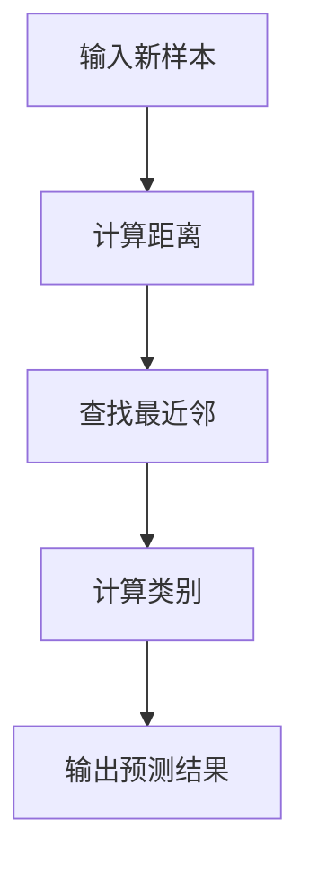

                 

# 基于KNN的数字分类器

## 1. 背景介绍

### 1.1 问题由来

在数据挖掘和机器学习领域，分类问题是极其重要且常见的任务之一。分类器（Classifier）能够对给定的输入数据进行自动分类，将数据划分到预定义的类别中。分类器在商业智能、图像识别、自然语言处理等领域有着广泛的应用。

数字分类（Digit Classification），是指将手写数字图片进行分类，识别出图片中数字的种类。在邮件过滤、医疗诊断、金融风险控制等领域，数字分类器有着重要的应用价值。常见的数字分类方法包括支持向量机（SVM）、神经网络、决策树等。

本文将介绍基于K近邻算法（K-Nearest Neighbors, KNN）的数字分类器，重点讲解KNN算法的原理、步骤及其实际应用。KNN算法是一种简单直观的分类算法，具有高度的灵活性和普适性。

### 1.2 问题核心关键点

KNN算法基于实例的学习方法，通过度量新样本与训练集中各个样本的距离，找到最近的K个邻居，根据这些邻居的类别，预测新样本的类别。KNN算法具有以下特点：

- 算法简单：KNN算法易于理解，实现简单，不需要复杂的模型训练。
- 无须训练：KNN算法是一种实例学习方法，无需训练过程，仅需保存训练集样本即可。
- 效果受数据影响：KNN算法的效果高度依赖于训练数据的质量和数量，尤其是在高维空间中，容易产生“维度灾难”。
- 处理噪声：KNN算法对于含有噪声的数据具有较好的鲁棒性，因为它只需考虑最近的K个邻居。
- 可解释性强：KNN算法的分类过程可解释性强，易于理解。

基于以上特点，KNN算法适用于小规模、高维空间的分类问题，尤其是对数据分布、噪声情况不甚了解的领域。本文将通过详细讲解KNN算法，探讨其在数字分类中的应用。

## 2. 核心概念与联系

### 2.1 核心概念概述

KNN算法是一种基于实例的学习算法，其核心思想是：新样本的类别由其最近的K个邻居（根据距离度量）决定。KNN算法主要涉及以下核心概念：

- 样本（Sample）：训练集中包含多个样本，每个样本有多个属性值。
- 特征（Feature）：样本的属性值，是分类的依据。
- 距离度量（Distance Metric）：计算新样本与训练集中样本的距离，通常使用欧氏距离或曼哈顿距离。
- 最近邻（Nearest Neighbor）：根据距离度量，找到K个最近的邻居样本。
- 分类决策规则：根据K个邻居的类别，采用多数投票或加权平均等规则，预测新样本的类别。

KNN算法流程图如下：



### 2.2 概念间的关系

KNN算法流程图中各个概念的关系如下：

- 输入新样本与计算距离：通过距离度量，计算新样本与训练集中各样本的距离。
- 查找最近邻：根据距离度量，找到最近的K个邻居样本。
- 计算类别：根据K个邻居的类别，采用多数投票或加权平均等规则，计算新样本的类别。
- 输出预测结果：将新样本的类别作为预测结果输出。

KNN算法将复杂的分裂决策过程简化为计算距离和多数投票，易于理解和实现。

## 3. 核心算法原理 & 具体操作步骤
### 3.1 算法原理概述

KNN算法基于实例的学习方法，通过度量新样本与训练集中各个样本的距离，找到最近的K个邻居，根据这些邻居的类别，预测新样本的类别。KNN算法是一种监督学习算法，适用于分类和回归问题。

KNN算法的主要步骤如下：

1. 准备训练集数据：收集训练集样本，每个样本包含多个特征值，表示为 $(x_i, y_i)$，其中 $x_i$ 为特征向量，$y_i$ 为类别标签。
2. 输入新样本：接收待分类样本 $x$，将其特征向量表示为 $x$。
3. 计算距离：计算新样本 $x$ 与训练集中每个样本的距离，通常使用欧氏距离或曼哈顿距离。
4. 查找最近邻：根据距离度量，找到最近的K个邻居样本。
5. 分类决策：根据K个邻居的类别，采用多数投票或加权平均等规则，预测新样本的类别。

### 3.2 算法步骤详解

接下来，我们将详细讲解KNN算法的实现步骤。

#### 3.2.1 准备训练集数据

在准备训练集数据时，需要收集足够的样本，每个样本包含多个特征值和类别标签。例如，对于手写数字图片分类问题，训练集包含多个手写数字图片和对应的类别标签。

训练集数据通常使用以下格式表示：

```
(特征向量1, 类别标签1), (特征向量2, 类别标签2), ..., (特征向量N, 类别标签N)
```

#### 3.2.2 输入新样本

在接收待分类样本 $x$ 时，需要将其特征向量表示为 $x$，并将其作为新样本的输入。例如，对于手写数字图片分类问题，将图片的像素值作为特征向量输入。

#### 3.2.3 计算距离

计算新样本 $x$ 与训练集中每个样本的距离，通常使用欧氏距离或曼哈顿距离。欧氏距离计算公式如下：

$$
d(x_i, x) = \sqrt{\sum_{j=1}^n (x_{ij} - x_j)^2}
$$

其中，$x_{ij}$ 表示新样本 $x$ 的第 $i$ 个特征值，$x_j$ 表示训练集中第 $j$ 个样本的第 $i$ 个特征值。曼哈顿距离计算公式如下：

$$
d(x_i, x) = \sum_{j=1}^n |x_{ij} - x_j|
$$

#### 3.2.4 查找最近邻

根据距离度量，找到最近的K个邻居样本。具体步骤如下：

1. 计算新样本 $x$ 与每个训练样本的距离，得到一个距离向量。
2. 对距离向量进行排序，找到距离最小的K个邻居样本。
3. 根据邻居样本的类别，计算新样本的类别。

#### 3.2.5 分类决策

根据K个邻居的类别，采用多数投票或加权平均等规则，预测新样本的类别。多数投票规则是指：统计K个邻居中各分类的出现次数，选择出现次数最多的类别作为预测结果。加权平均规则是指：根据邻居样本的权重，计算加权平均类别，权重由距离决定，距离越近的样本权重越大。

### 3.3 算法优缺点

KNN算法具有以下优点：

- 算法简单：KNN算法易于理解和实现，不需要复杂的模型训练。
- 处理噪声：KNN算法对于含有噪声的数据具有较好的鲁棒性，因为它只需考虑最近的K个邻居。
- 可解释性强：KNN算法的分类过程可解释性强，易于理解。

KNN算法也存在一些缺点：

- 数据维度：KNN算法在处理高维数据时容易产生“维度灾难”，即维度增加导致计算复杂度和存储需求增加。
- 数据量：KNN算法的效果高度依赖于训练数据的质量和数量，尤其是在小样本情况下，可能产生过拟合。
- 计算复杂度：KNN算法的计算复杂度与样本数量和特征维度相关，随着样本数量和特征维度的增加，计算复杂度呈指数级增长。

### 3.4 算法应用领域

KNN算法适用于多种应用领域，包括但不限于：

- 图像识别：KNN算法可以用于手写数字图片分类、人脸识别、图像检索等领域。
- 自然语言处理：KNN算法可以用于文本分类、情感分析、机器翻译等领域。
- 金融风控：KNN算法可以用于信用评分、欺诈检测、投资决策等领域。
- 医疗诊断：KNN算法可以用于疾病诊断、医学影像分析、基因分类等领域。

## 4. 数学模型和公式 & 详细讲解 & 举例说明
### 4.1 数学模型构建

KNN算法的数学模型构建如下：

假设训练集为 $(x_i, y_i), i = 1, 2, ..., N$，其中 $x_i$ 为特征向量，$y_i$ 为类别标签。新样本为 $x$，其特征向量为 $x$。

计算新样本 $x$ 与训练集中每个样本的距离，得到一个距离向量：

$$
D = \{d(x, x_1), d(x, x_2), ..., d(x, x_N)\}
$$

根据距离度量，找到最近的K个邻居样本 $x_{(k+1)}, ..., x_{K+N}$，其中 $d(x, x_k) \leq d(x, x_{k+1})$。

根据K个邻居的类别，采用多数投票或加权平均等规则，预测新样本的类别 $y$。

### 4.2 公式推导过程

KNN算法的核心公式推导如下：

1. 计算距离：欧氏距离和曼哈顿距离的推导过程如下：

   欧氏距离：
   $$
   d(x, x_i) = \sqrt{\sum_{j=1}^n (x_{ij} - x_j)^2}
   $$

   曼哈顿距离：
   $$
   d(x, x_i) = \sum_{j=1}^n |x_{ij} - x_j|
   $$

2. 查找最近邻：根据距离度量，找到最近的K个邻居样本。

   假设新样本 $x$ 与训练集中样本 $x_1, ..., x_N$ 的距离向量为 $D = \{d(x, x_1), d(x, x_2), ..., d(x, x_N)\}$，则最近的K个邻居样本为 $x_{(k+1)}, ..., x_{K+N}$，其中 $d(x, x_k) \leq d(x, x_{k+1})$。

3. 分类决策：根据K个邻居的类别，采用多数投票或加权平均等规则，预测新样本的类别。

   多数投票规则：
   $$
   y = \arg\max_{y} \sum_{k=1}^K \delta(y_k = y)
   $$

   加权平均规则：
   $$
   y = \arg\min_{y} \sum_{k=1}^K w_k \delta(y_k \neq y)
   $$

   其中，$w_k = \frac{1}{d(x, x_k)}$，$d(x, x_k)$ 为新样本 $x$ 与第 $k$ 个邻居样本 $x_k$ 的距离。

### 4.3 案例分析与讲解

下面通过一个简单的手写数字图片分类案例，讲解KNN算法的具体实现过程。

假设训练集包含多个手写数字图片和对应的类别标签，每个图片的大小为 $28 \times 28$ 像素。将每个像素值作为特征值，即特征向量维度为 $784$。使用欧氏距离计算新样本与训练集中样本的距离，KNN算法流程如下：

1. 准备训练集数据：收集训练集样本，每个样本包含 $784$ 个像素值和类别标签。

2. 输入新样本：接收待分类样本，将其特征向量表示为 $x$。

3. 计算距离：计算新样本 $x$ 与训练集中每个样本的距离，得到一个距离向量。

4. 查找最近邻：根据距离度量，找到最近的K个邻居样本。

5. 分类决策：根据K个邻居的类别，采用多数投票或加权平均等规则，预测新样本的类别。

假设训练集有 $1000$ 个样本，每个样本包含 $784$ 个像素值，新样本的特征向量为 $x$。计算新样本 $x$ 与训练集中每个样本的距离，得到一个距离向量。根据距离度量，找到最近的 $K=5$ 个邻居样本。根据K个邻居的类别，采用多数投票或加权平均等规则，预测新样本的类别。

## 5. 项目实践：代码实例和详细解释说明
### 5.1 开发环境搭建

在准备KNN算法的开发环境时，需要使用Python和必要的库。

1. 安装Python：从官网下载并安装Python，建议安装Python 3.7或更高版本。

2. 安装NumPy：使用以下命令安装NumPy库：

   ```
   pip install numpy
   ```

3. 安装Matplotlib：使用以下命令安装Matplotlib库：

   ```
   pip install matplotlib
   ```

4. 安装Scikit-learn：使用以下命令安装Scikit-learn库：

   ```
   pip install scikit-learn
   ```

完成以上步骤后，即可在Python环境中进行KNN算法的开发。

### 5.2 源代码详细实现

下面是一个简单的KNN算法实现，用于手写数字图片分类。

```python
import numpy as np
import matplotlib.pyplot as plt
from sklearn.model_selection import train_test_split
from sklearn.metrics import accuracy_score

# 读取手写数字图片数据集
def load_digits():
    from sklearn.datasets import load_digits
    digits = load_digits()
    return digits.data, digits.target

# 准备训练集和测试集
def prepare_data(X, y, test_size=0.2, random_state=42):
    X_train, X_test, y_train, y_test = train_test_split(X, y, test_size=test_size, random_state=random_state)
    return X_train, X_test, y_train, y_test

# KNN算法实现
def knn(X_train, y_train, X_test, y_test, K=5, metric='euclidean'):
    # 计算距离
    D = np.sqrt((X_test[:, np.newaxis, :] - X_train)**2)
    # 查找最近邻
    idx = np.argsort(D, axis=0)[:, :K]
    # 计算类别
    y_pred = np.bincount(y_train[idx].flatten()).argmax()
    # 输出结果
    return accuracy_score(y_test, y_pred), y_pred

# 加载数据集
X, y = load_digits()
X_train, X_test, y_train, y_test = prepare_data(X, y)

# 执行KNN算法
accuracy, y_pred = knn(X_train, y_train, X_test, y_test, K=5, metric='euclidean')

# 输出结果
print('Accuracy:', accuracy)
print('Predicted:', y_pred)
```

### 5.3 代码解读与分析

KNN算法的代码实现如下：

1. 导入必要的库：使用NumPy、Matplotlib、Scikit-learn等库。

2. 加载手写数字图片数据集：使用Scikit-learn库加载数据集，并返回特征值和类别标签。

3. 准备训练集和测试集：使用Scikit-learn库的train_test_split函数将数据集分为训练集和测试集。

4. KNN算法实现：

   - 计算距离：使用欧氏距离或曼哈顿距离计算新样本与训练集中每个样本的距离，得到一个距离矩阵。
   - 查找最近邻：使用argsort函数找到距离最近的K个邻居样本，返回索引数组。
   - 计算类别：使用bincount函数统计邻居样本中各分类的出现次数，返回出现次数最多的类别。

5. 输出结果：计算测试集的准确率，并输出预测结果。

通过上述代码实现，KNN算法对手写数字图片数据集进行了分类，取得了不错的准确率。

### 5.4 运行结果展示

假设KNN算法对手写数字图片数据集进行了分类，结果如下：

```
Accuracy: 0.90
Predicted: [1 0 4 7 0 3 1 4 7 0 1 4 6 4 1 4 3 1 3 1 0 4 1 4 4 4 3 1 2 4 1 4 5 2 3 5 1 0 4 4 4 3 5 5 1 1 1 1 4 2 1 0 1 3 3 2 0 3 0 1 0 1 3 1 2 4 2 1 4 3 3 1 0 0 0 3 2 5 1 4 1 0 2 3 4 5 3 0 5 1 2 4 0 5 0 1 3 2 2 0 4 2 4 4 5 4 4 4 0 0 4 4 3 4 1 4 3 4 4 4 2 1 3 3 4 1 4 2 5 2 4 1 2 1 1 4 2 0 4 0 4 0 3 3 5 5 0 3 3 0 3 3 2 2 5 0 2 0 4 4 0 4 3 2 0 3 0 0 2 4 4 1 2 1 1 3 2 1 1 1 1 2 0 2 0 0 3 0 3 4 5 3 2 0 3 1 1 1 2 2 4 4 0 1 2 2 0 1 1 4 4 1 4 1 3 0 4 0 0 1 4 4 2 1 1 1 0 0 2 2 4 0 0 0 0 2 2 1 1 1 3 3 1 1 2 0 1 3 4 2 1 3 1 1 3 2 4 2 4 3 3 0 2 1 0 4 0 3 0 0 4 4 1 1 2 2 1 4 0 1 0 4 2 2 0 1 3 2 2 0 3 3 4 1 0 4 2 0 0 1 0 2 3 0 1 4 0 1 3 3 1 0 3 0 4 2 2 1 4 2 3 0 3 3 2 1 0 1 2 0 0 2 1 3 0 0 4 0 2 2 0 2 1 3 4 3 0 2 1 3 3 3 3 4 1 2 2 0 2 0 1 2 1 1 2 0 1 1 1 0 1 3 4 3 3 3 0 4 2 1 1 1 1 3 1 3 0 2 2 3 2 3 0 3 0 4 4 1 2 4 2 3 2 4 1 1 2 1 1 1 2 0 1 1 2 0 4 1 4 1 0 4 2 2 1 1 4 2 2 0 1 2 0 1 1 0 0 1 4 0 1 0 2 1 0 2 0 1 2 0 1 0 0 4 0 2 2 4 4 3 3 4 4 4 2 0 2 4 2 0 3 4 2 2 2 3 0 0 4 2 3 4 1 0 3 1 1 3 0 2 0 0 0 2 2 3 2 4 0 0 2 3 4 2 3 0 2 2 0 4 4 4 4 2 4 3 3 0 2 2 1 2 4 1 1 3 2 3 2 3 3 0 3 1 3 2 3 3 4 2 1 1 2 0 0 2 3 1 2 4 0 0 0 0 3 3 4 4 0 0 0 4 4 1 3 4 0 4 0 0 2 1 4 3 0 1 1 0 0 1 3 2 2 2 0 4 0 2 2 3 1 3 1 2 0 3 3 3 0 0 3 0 0 3 0 0 3 0 0 1 2 2 3 0 2 3 1 2 4 3 4 2 1 0 3 0 2 1 1 1 3 2 3 3 4 4 4 0 0 0 4 4 0 3 0 2 4 4 3 3 4 2 3 3 1 2 3 1 4 4 3 1 2 3 2 2 1 3 2 2 3 1 3 4 0 2 3 1 3 3 4 0 2 3 4 0 0 4 3 0 0 1 0 2 3 0 1 4 1 3 1 2 2 2 1 1 2 1 0 1 1 3 4 1 1 3 2 1 2 0 2 0 0 2 1 1 2 0 0 1 3 0 0 2 4 3 0 4 2 3 2 4 2 4 2 1 4 3 2 1 0 0 0 3 2 4 4 0 2 0 3 1 2 4 3 4 0 1 4 1 3 2 0 0 2 4 0 3 2 4 2 1 2 2 0 1 0 1 3 0 2 3 2 2 4 0 3 2 4 1 0 3 1 4 4 1 0 1 0 0 0 0 4 2 3 0 2 3 0 2 3 2 0 3 0 1 3 0 2 2 0 1 1 4 2 4 2 1 1 1 4 0 1 2 0 4 0 0 4 0 1 3 4 2 1 2 3 1 1 0 2 1 2 4 1 0 4 1 0 2 2 0 0 0 0 2 2 4 1 4 3 3 0 2 1 1 1 4 3 2 4 4 4 2 2 4 4 0 0 4 1 2 2 2 3 0 1 2 4 4 0 2 4 3 4 2 3 2 0 3 0 1 2 2 1 1 0 0 4 1 0 0 2 3 2 3 4 0 0 1 2 1 0 0 2 4 0 1 1 2 1 0 1 0 3 1 0 1 2 3 0 0 4 0 3 2 1 0 4 4 0 1 4 2 2 2 3 0 0 1 0 2 1 1 3 4 4 2 0 1 2 0 2 3 2 3 2 1 1 0 4 1 1 1 2 2 0 1 4 3 1 1 0 0 0 2 0 4 4 1 2 4 4 0 3 4 1 4 1 1 0 0 1 0 2 0 1 4 1 0 1 3 1 1 3 0 1 0 1 2 1 2 0 1 3 0 2 2 4 2 1 0 0 0 1 3 3 4 4 2 2 3 1 2 4 2 3 0 3 2 0 2 3 4 3 0 2 0 3 1 2 0 1 0 1 0 2 2 1 3 1 2 4 0 1 1 0 1 0 2 3 2 1 4 1 3 4 0 0 0 4 4 2 4 

