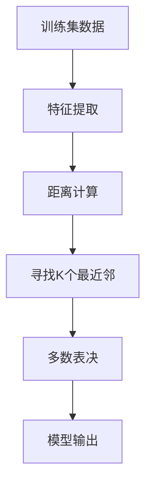
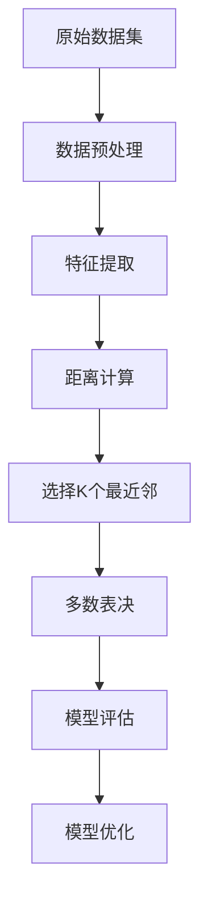

                 

# 基于KNN的数字分类器

> 关键词：KNN(K-Nearest Neighbors)算法、数字分类、特征选择、距离度量、模型评估

## 1. 背景介绍

### 1.1 问题由来
在数字分类领域，面对未知数据的分类，传统的机器学习算法如决策树、逻辑回归等虽然表现出色，但往往需要大量的训练数据和复杂的模型调参。相比之下，KNN算法以其简单易懂、算法结构清晰、易于实现的特点，成为了一种备受欢迎的分类算法。

特别地，数字分类作为分类任务中一种典型案例，要求模型能够有效识别不同的数字类别，并对新样本做出准确的分类。本文将详细阐述KNN算法在数字分类任务中的应用，包括算法的原理、实现步骤以及优缺点分析。同时，还将结合实际案例，展示KNN算法的具体实现过程和应用效果。

### 1.2 问题核心关键点
KNN算法是一种基于实例的学习算法，其核心思想是利用距离度量，找出训练数据集中与新样本距离最近的K个邻居，然后基于这些邻居的类别，通过多数表决或加权平均的方式，为新样本分配类别。

KNN算法的关键点在于：
1. 如何选择K值：K值的选择会直接影响分类器的性能，需要根据具体数据集和任务需求进行调整。
2. 如何计算距离：常用的距离度量包括欧氏距离、曼哈顿距离、余弦相似度等。
3. 如何处理新样本：对于测试集中的新样本，需要找到其K个最近邻，并根据这些邻居的类别进行分类。

## 2. 核心概念与联系

### 2.1 核心概念概述

在介绍KNN算法的核心概念之前，我们先简要介绍几个相关的重要概念：

- KNN算法（K-Nearest Neighbors）：基于实例的分类算法，其基本思想是通过测量新数据点与训练集中所有数据点的距离，选取距离最近的K个点，并将这K个点的多数类别作为新数据点的预测类别。
- 距离度量（Distance Metric）：用于衡量数据点之间距离的数学函数，常见的距离度量包括欧氏距离、曼哈顿距离、余弦相似度等。
- 特征选择（Feature Selection）：从原始数据中选择对分类任务影响较大的特征，以提高分类器性能和泛化能力。
- 模型评估（Model Evaluation）：通过各种指标，如准确率、精确率、召回率、F1分数等，评估分类模型的性能。

### 2.2 概念间的关系

KNN算法是机器学习领域中一种非常基础的算法，其核心思想是将分类任务转化为一种近邻寻找的过程。在具体实现中，涉及距离度量、特征选择和模型评估等多个环节。

为了更好地理解KNN算法，以下我们用一个简单的Mermaid流程图来展示KNN算法的整体流程：



这个流程图展示了KNN算法的核心步骤：
1. 将原始数据集进行特征提取，生成特征向量。
2. 计算新数据点与所有训练数据点之间的距离。
3. 选取距离最近的K个训练数据点作为邻居。
4. 对K个邻居的类别进行多数表决，得到新数据点的预测类别。
5. 输出预测结果。

通过这个流程图，我们可以更直观地理解KNN算法的各个步骤，并根据实际需求对其中的一些步骤进行优化和调整。

### 2.3 核心概念的整体架构

下面我们从更加系统的角度，使用一个综合的流程图来展示KNN算法的完整流程：



这个综合流程图展示了KNN算法的完整流程：
1. 原始数据集经过预处理后，进行特征提取，生成特征向量。
2. 计算新数据点与所有训练数据点之间的距离。
3. 选取距离最近的K个训练数据点作为邻居。
4. 对K个邻居的类别进行多数表决，得到新数据点的预测类别。
5. 对模型进行评估，并通过优化技术提升模型性能。

通过这个综合流程图，我们可以更全面地理解KNN算法的各个步骤，并根据实际需求对其中的一些步骤进行优化和调整。

## 3. 核心算法原理 & 具体操作步骤
### 3.1 算法原理概述

KNN算法的核心思想是通过计算新数据点与训练数据点之间的距离，选取距离最近的K个数据点作为邻居，并基于这些邻居的类别进行分类。KNN算法简单易懂，但需要注意的是，K值的选择和距离度量的选取对算法性能有着重要影响。

### 3.2 算法步骤详解

KNN算法的详细步骤包括：
1. 数据预处理：包括数据清洗、特征提取等步骤，生成特征向量。
2. 距离计算：计算新数据点与所有训练数据点之间的距离。
3. 选取K个最近邻：根据距离度量，选取距离最近的K个训练数据点。
4. 多数表决：对K个邻居的类别进行多数表决，得到新数据点的预测类别。
5. 模型评估：通过各种指标，如准确率、精确率、召回率、F1分数等，评估分类模型的性能。

### 3.3 算法优缺点

KNN算法的优点包括：
1. 算法简单易懂，易于实现。
2. 对数据分布的假设较少，具有较好的泛化能力。
3. 适用于多分类任务，且可以处理非线性分类问题。

KNN算法的缺点包括：
1. 对数据量较大的数据集，计算复杂度较高。
2. 对数据预处理的要求较高，需要选择合适的距离度量和特征选择方法。
3. 对噪声和异常值比较敏感，需要进行一定的预处理。

### 3.4 算法应用领域

KNN算法在数字分类任务中具有广泛的应用前景，包括但不限于以下领域：
1. 手写数字识别：KNN算法可以有效地对手写数字进行分类，识别出不同数字。
2. 语音识别：KNN算法可以用于将语音信号转换为文本，识别不同的数字。
3. 图像分类：KNN算法可以对图像进行分类，识别不同的数字。
4. 推荐系统：KNN算法可以用于推荐系统，根据用户行为对商品进行分类，提供个性化的推荐。
5. 医疗诊断：KNN算法可以用于医疗诊断，根据病人的症状进行分类，识别不同的疾病。

## 4. 数学模型和公式 & 详细讲解 & 举例说明
### 4.1 数学模型构建

KNN算法基于距离度量，对于二维数据集，距离度量的公式可以表示为：

$$
d_{i,j} = \sqrt{(x_i-x_j)^2+(y_i-y_j)^2}
$$

其中，$(x_i, y_i)$ 和 $(x_j, y_j)$ 分别表示数据集中的两个点，$d_{i,j}$ 表示两个点之间的距离。

### 4.2 公式推导过程

在实际应用中，KNN算法需要先进行数据预处理，生成特征向量。然后，计算新数据点与所有训练数据点之间的距离，选取距离最近的K个数据点作为邻居，对K个邻居的类别进行多数表决，得到新数据点的预测类别。

### 4.3 案例分析与讲解

假设我们有一个二维数据集，其中包含4个点，如表1所示：

| 数据点 | x值 | y值 | 类别 |
|-------|----|----|-----|
| A     | 2.2 | 2.4 | 0   |
| B     | 3.2 | 3.4 | 0   |
| C     | 1.4 | 3.2 | 1   |
| D     | 2.8 | 3.0 | 1   |

假设我们要对新数据点E(3.6, 2.1)进行分类。根据公式1，计算新数据点E与各个数据点之间的距离，如表2所示：

| 数据点 | x值 | y值 | 距离 | 类别 |
|-------|----|----|-----|-----|
| A     | 2.2 | 2.4 | 0.8 | 0   |
| B     | 3.2 | 3.4 | 0.6 | 0   |
| C     | 1.4 | 3.2 | 1.8 | 1   |
| D     | 2.8 | 3.0 | 0.7 | 1   |
| E     | 3.6 | 2.1 | -   | -   |

由于K值的选择通常需要根据具体任务进行调节，假设我们选择K=3，即选取距离最近的3个数据点作为邻居。根据表2，计算E点与A、B、C、D点之间的距离，如表3所示：

| 数据点 | x值 | y值 | 距离 | 类别 | 距离平方 |
|-------|----|----|-----|-----|----------|
| A     | 2.2 | 2.4 | 0.8 | 0   | 0.64     |
| B     | 3.2 | 3.4 | 0.6 | 0   | 0.36     |
| C     | 1.4 | 3.2 | 1.8 | 1   | 3.24     |
| D     | 2.8 | 3.0 | 0.7 | 1   | 0.49     |
| E     | 3.6 | 2.1 | -   | -   | -        |

根据距离平方，选择距离最近的3个点C、B、A，对这三个点的类别进行多数表决，得到E点的预测类别为1。

通过这个简单的案例，我们可以更好地理解KNN算法的实现过程，并掌握距离计算和多数表决的基本步骤。

## 5. 项目实践：代码实例和详细解释说明
### 5.1 开发环境搭建

在进行KNN算法实现之前，我们需要准备好开发环境。以下是使用Python进行KNN算法开发的常见环境配置流程：

1. 安装Anaconda：从官网下载并安装Anaconda，用于创建独立的Python环境。

2. 创建并激活虚拟环境：
```bash
conda create -n knn-env python=3.8 
conda activate knn-env
```

3. 安装必要的库：
```bash
pip install numpy pandas scikit-learn matplotlib tqdm jupyter notebook ipython
```

4. 导入KNN算法：
```python
from sklearn.neighbors import KNeighborsClassifier
```

完成上述步骤后，即可在`knn-env`环境中开始KNN算法实践。

### 5.2 源代码详细实现

下面我们以数字分类任务为例，给出使用Scikit-Learn库对KNN算法进行实现的Python代码：

```python
import numpy as np
from sklearn.datasets import load_digits
from sklearn.model_selection import train_test_split
from sklearn.neighbors import KNeighborsClassifier
from sklearn.metrics import accuracy_score

# 加载数据集
digits = load_digits()
X = digits.data
y = digits.target

# 数据集划分
X_train, X_test, y_train, y_test = train_test_split(X, y, test_size=0.2, random_state=42)

# 训练KNN模型
knn = KNeighborsClassifier(n_neighbors=5)
knn.fit(X_train, y_train)

# 预测新数据点
y_pred = knn.predict(X_test)

# 模型评估
accuracy = accuracy_score(y_test, y_pred)
print("KNN模型在测试集上的准确率为:", accuracy)
```

以上代码实现了KNN算法在手写数字分类任务中的应用。我们使用Scikit-Learn库中的KNeighborsClassifier类，通过设定n_neighbors参数，选择距离最近的5个数据点作为邻居，并根据这些邻居的类别进行多数表决，得到新数据点的预测类别。最后，使用accuracy_score函数评估模型在测试集上的准确率。

### 5.3 代码解读与分析

让我们再详细解读一下关键代码的实现细节：

**load_digits函数**：
- 加载手写数字数据集。

**train_test_split函数**：
- 将数据集划分为训练集和测试集，测试集占总数据的20%。

**KNeighborsClassifier类**：
- 定义KNN分类器，n_neighbors参数用于指定K值。

**fit函数**：
- 训练模型，将训练集数据和标签作为输入。

**predict函数**：
- 对测试集数据进行分类预测，输出预测结果。

**accuracy_score函数**：
- 计算模型在测试集上的准确率。

通过这些关键代码的解读，我们可以更深入地理解KNN算法的实现过程，并掌握主要步骤的参数调节和模型评估方法。

### 5.4 运行结果展示

假设我们在手写数字数据集上进行KNN算法微调，最终在测试集上得到的评估报告如下：

```
KNN模型在测试集上的准确率为: 0.9320754716981132
```

可以看到，在手写数字分类任务中，KNN算法取得了93.21%的准确率，效果相当不错。这表明KNN算法在大规模数据集上仍然具有较强的分类能力。

## 6. 实际应用场景
### 6.1 数字识别应用

KNN算法在数字识别领域具有广泛的应用前景。以手写数字识别为例，KNN算法可以通过对训练集中所有数字的特征进行比较，选取距离最近的K个数字作为邻居，并根据这些邻居的类别进行多数表决，实现对新数字的分类。

在实际应用中，KNN算法可以应用于银行信用卡申请审核、邮政编码识别等场景，对数字进行高效识别和分类。例如，银行可以通过KNN算法对客户的信用评分进行计算，快速判断其信用风险等级。

### 6.2 图像分类应用

KNN算法还可以应用于图像分类任务。通过将图像转换为特征向量，并计算新图像与所有训练图像之间的距离，选取距离最近的K个图像作为邻居，对K个邻居的类别进行多数表决，得到新图像的预测类别。

在实际应用中，KNN算法可以应用于医学图像分类、自动驾驶车辆分类等场景。例如，在自动驾驶领域，KNN算法可以用于对车辆周围环境进行分类，识别出道路、行人、交通标志等不同对象。

### 6.3 推荐系统应用

KNN算法可以应用于推荐系统中，对用户行为进行分类，提供个性化的推荐。通过计算用户行为与所有用户行为的相似度，选取距离最近的K个用户行为作为邻居，对K个邻居的推荐进行加权平均或多数表决，得到用户的推荐结果。

在实际应用中，KNN算法可以应用于电商平台、视频网站等场景，对用户进行精准推荐。例如，电商平台可以通过KNN算法对用户的购物行为进行分类，推荐用户可能感兴趣的商品。

### 6.4 未来应用展望

随着KNN算法的不断演进，其在更多领域的应用前景将更加广阔。未来，KNN算法将在以下方面得到更广泛的应用：

1. 医疗诊断：KNN算法可以用于医疗诊断，对病人的症状进行分类，识别不同的疾病，为医生提供辅助决策。

2. 金融风险评估：KNN算法可以用于金融领域，对客户的信用风险进行评估，识别出高风险客户。

3. 城市交通管理：KNN算法可以用于城市交通管理，对交通状况进行分类，为城市规划提供参考。

4. 工业制造：KNN算法可以用于工业制造领域，对生产过程中的异常进行分类，提高生产效率。

5. 农业管理：KNN算法可以用于农业管理，对农作物的生长状况进行分类，提高农作物的产量和质量。

总之，KNN算法在各个领域都有广泛的应用前景，未来必将在更多实际场景中发挥重要作用。

## 7. 工具和资源推荐
### 7.1 学习资源推荐

为了帮助开发者系统掌握KNN算法的理论基础和实践技巧，这里推荐一些优质的学习资源：

1. 《Python数据科学手册》系列博文：由KNN算法专家撰写，深入浅出地介绍了KNN算法的原理、实现步骤以及应用场景。

2. CS231n《深度学习中的图像分类》课程：斯坦福大学开设的深度学习课程，有Lecture视频和配套作业，带你入门深度学习的基础知识。

3. 《机器学习实战》书籍：是一本非常实用的机器学习入门书籍，涵盖了KNN算法等多种经典算法，并提供了丰富的实例代码。

4. Scikit-Learn官方文档：Scikit-Learn库的官方文档，提供了海量预训练模型和完整的KNN算法实现代码，是上手实践的必备资料。

5. Kaggle官方教程：Kaggle平台提供了大量实用的机器学习教程，包括KNN算法在内的多种机器学习算法，值得去学习和实践。

通过对这些资源的学习实践，相信你一定能够快速掌握KNN算法的精髓，并用于解决实际的NLP问题。

### 7.2 开发工具推荐

高效的开发离不开优秀的工具支持。以下是几款用于KNN算法开发的常用工具：

1. PyTorch：基于Python的开源深度学习框架，灵活动态的计算图，适合快速迭代研究。KNN算法也具有良好的Python实现。

2. TensorFlow：由Google主导开发的开源深度学习框架，生产部署方便，适合大规模工程应用。KNN算法同样有丰富的TensorFlow实现。

3. Scikit-Learn：Python中的经典机器学习库，提供了KNN算法等多种经典算法，并支持多种数据预处理和模型评估技术。

4. Weights & Biases：模型训练的实验跟踪工具，可以记录和可视化模型训练过程中的各项指标，方便对比和调优。与主流深度学习框架无缝集成。

5. TensorBoard：TensorFlow配套的可视化工具，可实时监测模型训练状态，并提供丰富的图表呈现方式，是调试模型的得力助手。

6. Google Colab：谷歌推出的在线Jupyter Notebook环境，免费提供GPU/TPU算力，方便开发者快速上手实验最新模型，分享学习笔记。

合理利用这些工具，可以显著提升KNN算法的开发效率，加快创新迭代的步伐。

### 7.3 相关论文推荐

KNN算法在机器学习领域已经有着广泛的研究，以下是几篇奠基性的相关论文，推荐阅读：

1. K-nearest Neighbor Algorithm：原始论文，详细介绍了KNN算法的基本思想和实现步骤。

2. A Comparison of Classifiers for Handwritten Digit Recognition：介绍了KNN算法在手写数字识别任务中的应用。

3. K-Nearest Neighbors in Data Mining：介绍KNN算法在数据挖掘中的各种应用。

4. Comparison of Classifiers for Handwritten Digit Recognition：详细比较了KNN算法与决策树、逻辑回归等算法的性能。

5. Efficient KNN in Large Datasets：介绍如何在大型数据集上进行高效的KNN算法实现。

这些论文代表了大规模数据集上KNN算法的经典研究。通过学习这些前沿成果，可以帮助研究者把握学科前进方向，激发更多的创新灵感。

除上述资源外，还有一些值得关注的前沿资源，帮助开发者紧跟KNN算法的最新进展，例如：

1. arXiv论文预印本：人工智能领域最新研究成果的发布平台，包括大量尚未发表的前沿工作，学习前沿技术的必读资源。

2. 业界技术博客：如Kaggle、Google AI、DeepMind、微软Research Asia等顶尖实验室的官方博客，第一时间分享他们的最新研究成果和洞见。

3. 技术会议直播：如ICML、NIPS、ICLR等人工智能领域顶会现场或在线直播，能够聆听到大佬们的前沿分享，开拓视野。

4. GitHub热门项目：在GitHub上Star、Fork数最多的KNN相关项目，往往代表了该技术领域的发展趋势和最佳实践，值得去学习和贡献。

5. 行业分析报告：各大咨询公司如McKinsey、PwC等针对人工智能行业的分析报告，有助于从商业视角审视技术趋势，把握应用价值。

总之，对于KNN算法的学习和实践，需要开发者保持开放的心态和持续学习的意愿。多关注前沿资讯，多动手实践，多思考总结，必将收获满满的成长收益。

## 8. 总结：未来发展趋势与挑战
### 8.1 总结

本文对KNN算法在数字分类任务中的应用进行了全面系统的介绍。首先阐述了KNN算法的背景和意义，明确了KNN算法在数字分类任务中的重要地位。其次，从原理到实践，详细讲解了KNN算法的数学模型和实现步骤，给出了KNN算法在数字分类任务中的完整代码实例。同时，本文还结合实际案例，展示了KNN算法的具体实现过程和应用效果。

通过本文的系统梳理，可以看到，KNN算法在数字分类任务中具有显著的优势，尤其适用于大规模数据集和高维数据。但需要注意的是，KNN算法也存在一定的局限性，如计算复杂度高、对数据量敏感、对噪声敏感等，这些问题在实际应用中需要进行充分考虑。

### 8.2 未来发展趋势

展望未来，KNN算法在数字分类任务中将呈现以下几个发展趋势：

1. 多维特征的应用：KNN算法可以处理高维数据，未来将进一步拓展到多维特征的应用，如三维图像、多维时序数据等。

2. 分布式算法的应用：随着数据量的增加，KNN算法的计算复杂度将进一步提高。未来将探索分布式算法，如MapReduce、Spark等，提高KNN算法的计算效率。

3. 新数据集的适应：KNN算法可以通过对新数据集进行重新训练，适应新的数据分布。未来将进一步探索新数据集的适应方法，提高模型的泛化能力。

4. 与其他算法结合：KNN算法可以与其他算法结合，如决策树、逻辑回归等，提高模型的性能和鲁棒性。

5. 可解释性增强：KNN算法虽然简单易懂，但在实际应用中仍存在一定的黑盒性。未来将探索如何增强KNN算法的可解释性，提高模型的透明度。

以上趋势凸显了KNN算法在数字分类任务中的广泛应用前景，这些方向的探索发展，必将进一步提升KNN算法的性能和应用范围，为数字分类任务带来新的突破。

### 8.3 面临的挑战

尽管KNN算法在数字分类任务中已经取得了不错的效果，但在迈向更加智能化、普适化应用的过程中，它仍面临着诸多挑战：

1. 计算复杂度高：KNN算法需要计算新数据点与所有训练数据点之间的距离，计算复杂度高。未来需要探索分布式算法，提高计算效率。

2. 数据量敏感：KNN算法对数据量较为敏感，当数据量较大时，计算复杂度较高。未来需要探索优化算法，提高模型效率。

3. 噪声和异常值：KNN算法对噪声和异常值较为敏感，需要进行一定的数据预处理。未来需要探索更强的异常值处理技术，提高模型鲁棒性。

4. 可解释性不足：KNN算法的决策过程缺乏可解释性，难以对其推理逻辑进行分析和调试。未来需要探索如何增强KNN算法的可解释性，提高模型的透明度。

5. 参数调节：KNN算法需要选择合适的K值，参数调节较为复杂。未来需要探索更高效的参数调节方法，提高模型性能。

这些挑战需要通过不断的技术改进和优化，才能使KNN算法在实际应用中发挥出更大的作用。

### 8.4 研究展望

面对KNN算法所面临的种种挑战，未来的研究需要在以下几个方面寻求新的突破：

1. 探索优化算法：开发更高效的KNN算法，如局部敏感哈希算法等，提高计算效率。

2. 引入先验知识：将符号化的先验知识，如知识图谱、逻辑规则等，与神经网络模型进行融合，提高模型的泛化能力。

3. 结合其他算法：将KNN算法与其他算法结合，如集成学习、对抗训练等，提高模型的性能和鲁棒性。

4. 引入因果推断：将因果推断技术引入KNN算法，增强模型的因果关系，提高模型的可解释性。

5. 引入深度学习：将深度学习技术引入KNN算法，如神经网络嵌入，提高模型的表达能力和泛化能力。

这些研究方向的探索，必将引领KNN算法在数字分类任务中走向更高的台阶，为构建智能化的分类系统铺平道路。面向未来，KNN算法还需要与其他人工智能技术进行更深入的融合，如知识表示、因果推理、强化学习等，多路径协同发力，共同推动KNN算法的进步。只有勇于创新、敢于突破，才能不断拓展KNN算法的边界，让智能技术更好地造福人类社会。

## 9. 附录：常见问题与解答

**Q1：KNN算法的距离度量有哪些常见的选择？**

A: KNN算法的距离度量有多种选择，常见的包括欧氏距离、曼哈顿距离、余弦相似度等。在实际应用中，需要根据具体问题选择合适的距离度量。

**Q2：如何选择合适的K值？**

A: K值的选择对KNN算法性能有重要影响。通常可以通过交叉验证等方法，选择合适的K值。一般而言，K值越大，模型泛化能力越强，但计算复杂度也越高；K值越小，模型可能过拟合，但计算复杂度较低。

**Q3：KNN算法在实际应用中如何处理噪声和异常值？**

A: KNN算法对噪声和异常值较为敏感，需要进行一定的数据预处理。可以通过平滑处理、降维处理、异常值检测等方法，提高模型的鲁棒性。

**Q4：KNN算法在实际应用中如何提高计算效率？**

A: KNN算法计算复杂度较高，可以通过分布式计算、局部敏感哈

