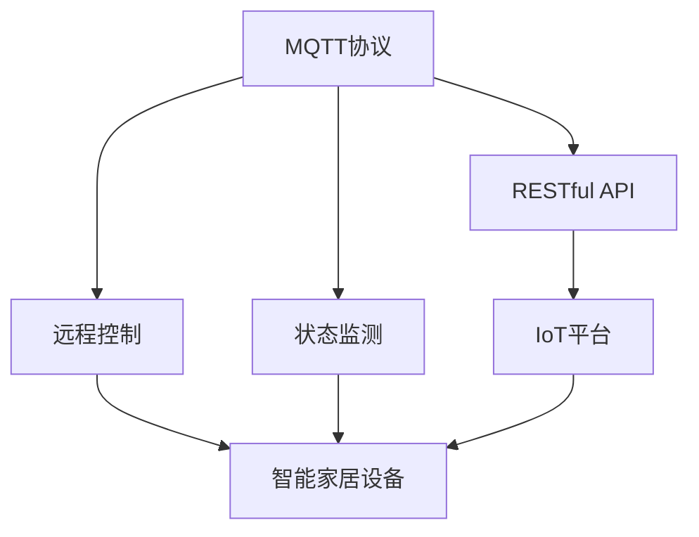
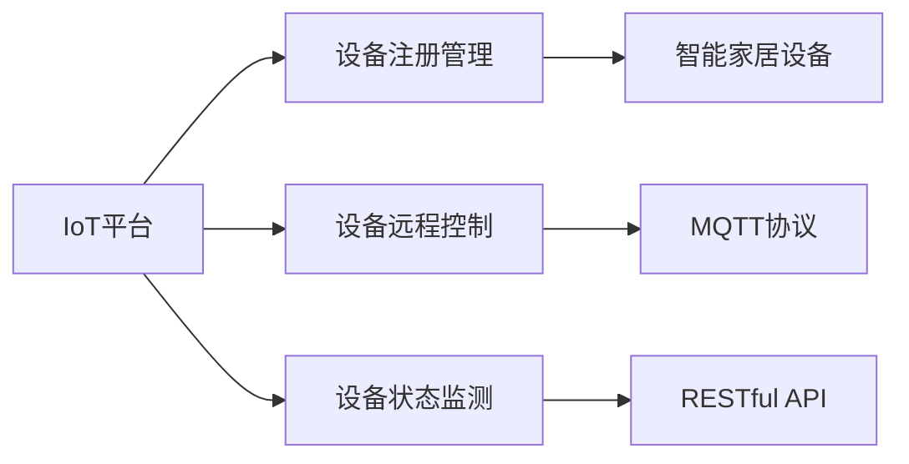
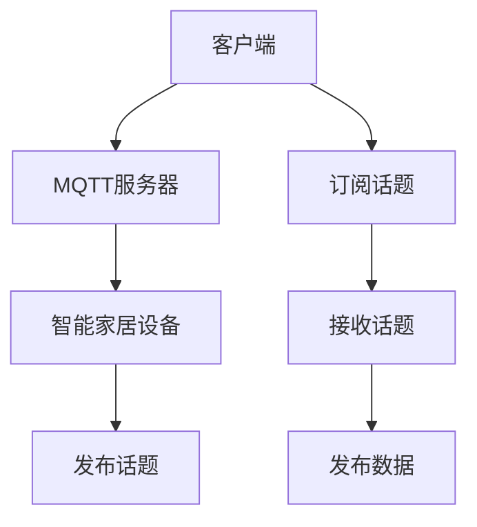
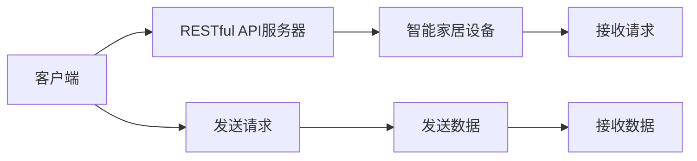
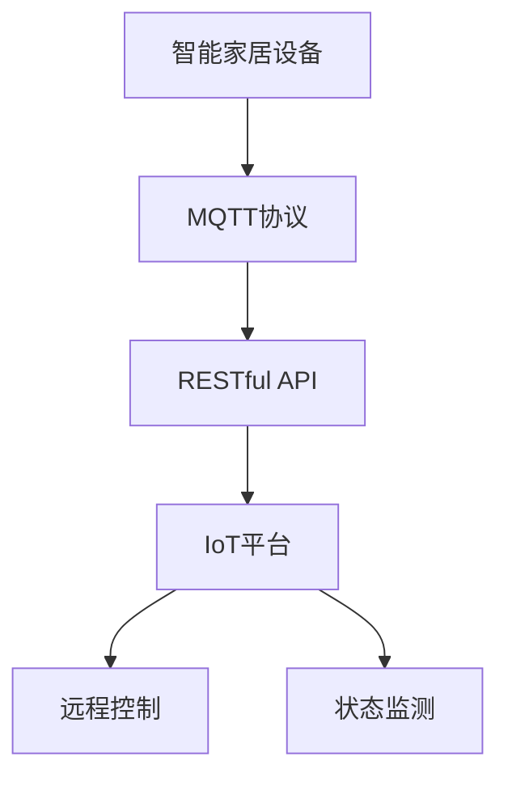

                 

# 基于MQTT协议和RESTful API的智能家居设备远程控制与状态监测

## 1. 背景介绍

### 1.1 问题由来

随着物联网技术的发展，智能家居设备越来越多地被广泛应用于家庭生活。然而，传统的智能家居设备往往存在操作复杂、使用不便等问题，难以满足用户对智能化和便捷化的需求。为了解决这些问题，基于MQTT协议和RESTful API的远程控制与状态监测技术应运而生。

### 1.2 问题核心关键点

基于MQTT协议和RESTful API的远程控制与状态监测技术，是一种通过互联网实现对智能家居设备实时控制和状态监测的方法。它具有以下核心关键点：

- **MQTT协议**：一种轻量级的、基于发布/订阅模式的通信协议，适用于物联网设备的低带宽、高延迟的网络环境。
- **RESTful API**：一种基于HTTP协议的API设计风格，支持客户端与服务器之间的无状态通信，能够实现数据的灵活传输和访问。
- **远程控制**：通过MQTT协议和RESTful API，用户可以远程控制智能家居设备，实现家居自动化、智能化。
- **状态监测**：通过RESTful API，用户可以实时监测智能家居设备的状态，及时获取设备运行数据和报警信息。

### 1.3 问题研究意义

基于MQTT协议和RESTful API的智能家居设备远程控制与状态监测技术，对于提升家庭智能化水平、提高用户生活品质具有重要意义：

1. **提升家庭智能化水平**：通过远程控制和状态监测技术，用户可以轻松实现家居自动化控制，提高家庭智能化水平。
2. **提高用户生活品质**：远程控制和状态监测技术的应用，使用户能够更加方便、灵活地使用智能家居设备，提升生活品质。
3. **降低智能家居设备使用门槛**：通过远程控制和状态监测技术，智能家居设备的操作变得更加简单，降低了用户的使用门槛。
4. **提高设备安全性**：通过状态监测技术，用户可以及时发现设备异常情况，及时处理，提高设备安全性。

## 2. 核心概念与联系

### 2.1 核心概念概述

在基于MQTT协议和RESTful API的智能家居设备远程控制与状态监测技术中，涉及以下几个核心概念：

- **MQTT协议**：一种轻量级的、基于发布/订阅模式的通信协议，适用于物联网设备的低带宽、高延迟的网络环境。
- **RESTful API**：一种基于HTTP协议的API设计风格，支持客户端与服务器之间的无状态通信，能够实现数据的灵活传输和访问。
- **远程控制**：通过MQTT协议和RESTful API，用户可以远程控制智能家居设备，实现家居自动化、智能化。
- **状态监测**：通过RESTful API，用户可以实时监测智能家居设备的状态，及时获取设备运行数据和报警信息。
- **IoT平台**：智能家居设备的统一管理平台，支持设备的远程控制和状态监测。

这些核心概念之间的联系如下：



该流程图展示了MQTT协议和RESTful API的智能家居设备远程控制与状态监测技术的基本架构和组件。MQTT协议和RESTful API作为底层通信协议和技术架构，提供了远程控制和状态监测的功能，而IoT平台作为统一管理平台，实现了设备的集中管理和监控。

### 2.2 概念间的关系

这些核心概念之间存在密切的联系，共同构成了基于MQTT协议和RESTful API的智能家居设备远程控制与状态监测技术的完整生态系统。以下通过几个Mermaid流程图来展示这些概念之间的关系。

#### 2.2.1 IoT平台架构



该流程图展示了IoT平台的基本架构和功能模块，包括设备注册管理、设备远程控制和设备状态监测。

#### 2.2.2 MQTT协议流程



该流程图展示了MQTT协议的基本流程，包括客户端订阅话题、服务器发布话题和设备发布数据。

#### 2.2.3 RESTful API流程



该流程图展示了RESTful API的基本流程，包括客户端发送请求、服务器接收请求和设备接收请求。

### 2.3 核心概念的整体架构

最后，我们用一个综合的流程图来展示这些核心概念在大语言模型微调过程中的整体架构：



该综合流程图展示了基于MQTT协议和RESTful API的智能家居设备远程控制与状态监测技术的整体架构和组件。通过MQTT协议和RESTful API，设备实现了远程控制和状态监测功能，而IoT平台则提供了集中管理和监控的功能。

## 3. 核心算法原理 & 具体操作步骤

### 3.1 算法原理概述

基于MQTT协议和RESTful API的智能家居设备远程控制与状态监测技术，其核心算法原理基于以下步骤：

1. **设备注册管理**：在IoT平台上对智能家居设备进行注册管理，生成设备标识符，并进行权限设置。
2. **设备远程控制**：用户通过MQTT协议和RESTful API，向IoT平台发送控制指令，IoT平台将控制指令转发给智能家居设备。
3. **设备状态监测**：智能家居设备通过MQTT协议和RESTful API，将设备状态数据发送给IoT平台，IoT平台再将设备状态数据通过RESTful API发送给用户。
4. **数据存储与分析**：IoT平台将设备状态数据存储在数据库中，并提供数据查询、统计和分析功能，支持用户进行数据分析和决策。

### 3.2 算法步骤详解

以下是对基于MQTT协议和RESTful API的智能家居设备远程控制与状态监测技术的详细操作步骤：

1. **设备注册管理**
   - 在IoT平台上注册智能家居设备，生成设备标识符，并进行权限设置。
   - 用户通过RESTful API向IoT平台发送注册请求，IoT平台接收到请求后，将设备信息存储在数据库中，生成设备标识符，并返回注册结果。

2. **设备远程控制**
   - 用户通过MQTT协议和RESTful API，向IoT平台发送控制指令。
   - IoT平台接收到控制指令后，根据设备标识符，查找对应的智能家居设备，并将控制指令转发给该设备。
   - 智能家居设备接收到控制指令后，执行相应的操作，并通过MQTT协议将操作结果发送回IoT平台。
   - IoT平台将操作结果发送回用户，完成远程控制。

3. **设备状态监测**
   - 智能家居设备通过MQTT协议和RESTful API，将设备状态数据发送给IoT平台。
   - IoT平台接收到设备状态数据后，将数据存储在数据库中，并根据用户权限，向用户提供设备状态数据查询功能。
   - 用户通过RESTful API查询设备状态数据，IoT平台接收到查询请求后，从数据库中读取数据，并返回查询结果。

4. **数据存储与分析**
   - IoT平台将设备状态数据存储在数据库中，并提供数据查询、统计和分析功能。
   - 用户通过RESTful API查询设备状态数据，IoT平台接收到查询请求后，从数据库中读取数据，并返回查询结果。

### 3.3 算法优缺点

基于MQTT协议和RESTful API的智能家居设备远程控制与状态监测技术的优点包括：

1. **灵活性高**：通过RESTful API，用户可以根据需要定制化控制指令和状态数据查询方式，灵活性高。
2. **实时性好**：通过MQTT协议，智能家居设备可以实时发送状态数据，用户可以实时监测设备状态。
3. **可扩展性好**：通过IoT平台，可以轻松添加新的智能家居设备，支持设备扩展。
4. **安全性高**：通过权限设置和数据加密技术，可以有效保障用户数据和设备安全。

其缺点包括：

1. **通信延迟**：MQTT协议在低带宽、高延迟的网络环境下，通信延迟较大，影响用户体验。
2. **系统复杂度高**：基于MQTT协议和RESTful API的智能家居设备远程控制与状态监测技术涉及多个组件和协议，系统复杂度高。
3. **硬件成本高**：需要部署MQTT服务器和RESTful API服务器，硬件成本较高。

### 3.4 算法应用领域

基于MQTT协议和RESTful API的智能家居设备远程控制与状态监测技术，主要应用于以下领域：

1. **智能照明**：通过远程控制和状态监测技术，实现智能照明系统的控制和管理。
2. **智能温控**：通过远程控制和状态监测技术，实现智能温控系统的控制和管理。
3. **智能安防**：通过远程控制和状态监测技术，实现智能安防系统的控制和管理。
4. **智能家电**：通过远程控制和状态监测技术，实现智能家电的控制和管理。

## 4. 数学模型和公式 & 详细讲解 & 举例说明

### 4.1 数学模型构建

基于MQTT协议和RESTful API的智能家居设备远程控制与状态监测技术的数学模型构建如下：

1. **设备注册管理**
   - 设备注册请求：$req = \{device_id, device_info, permission\}$，其中$device_id$为设备标识符，$device_info$为设备信息，$permission$为设备权限。
   - 设备注册响应：$resp = \{device_id, success\}$，其中$device_id$为设备标识符，$success$为注册结果。

2. **设备远程控制**
   - 控制指令：$cmd = \{device_id, command\}$，其中$device_id$为设备标识符，$command$为控制指令。
   - 控制指令响应：$resp = \{device_id, success\}$，其中$device_id$为设备标识符，$success$为控制结果。

3. **设备状态监测**
   - 设备状态数据：$state = \{device_id, data\}$，其中$device_id$为设备标识符，$data$为设备状态数据。
   - 设备状态数据响应：$resp = \{device_id, success, data\}$，其中$device_id$为设备标识符，$success$为状态监测结果，$data$为设备状态数据。

4. **数据存储与分析**
   - 数据存储请求：$req = \{device_id, data\}$，其中$device_id$为设备标识符，$data$为设备状态数据。
   - 数据存储响应：$resp = \{device_id, success\}$，其中$device_id$为设备标识符，$success$为存储结果。
   - 数据分析请求：$req = \{device_id, query\}$，其中$device_id$为设备标识符，$query$为数据查询条件。
   - 数据分析响应：$resp = \{device_id, data\}$，其中$device_id$为设备标识符，$data$为数据分析结果。

### 4.2 公式推导过程

以下是对上述数学模型的详细推导过程：

1. **设备注册管理**
   - 设备注册请求：$req = \{device_id, device_info, permission\}$，其中$device_id$为设备标识符，$device_info$为设备信息，$permission$为设备权限。
   - 设备注册响应：$resp = \{device_id, success\}$，其中$device_id$为设备标识符，$success$为注册结果。

   该模型的推导基于设备注册请求和响应，通过RESTful API实现设备注册管理功能。

2. **设备远程控制**
   - 控制指令：$cmd = \{device_id, command\}$，其中$device_id$为设备标识符，$command$为控制指令。
   - 控制指令响应：$resp = \{device_id, success\}$，其中$device_id$为设备标识符，$success$为控制结果。

   该模型的推导基于控制指令和响应，通过MQTT协议和RESTful API实现设备远程控制功能。

3. **设备状态监测**
   - 设备状态数据：$state = \{device_id, data\}$，其中$device_id$为设备标识符，$data$为设备状态数据。
   - 设备状态数据响应：$resp = \{device_id, success, data\}$，其中$device_id$为设备标识符，$success$为状态监测结果，$data$为设备状态数据。

   该模型的推导基于设备状态数据和响应，通过MQTT协议和RESTful API实现设备状态监测功能。

4. **数据存储与分析**
   - 数据存储请求：$req = \{device_id, data\}$，其中$device_id$为设备标识符，$data$为设备状态数据。
   - 数据存储响应：$resp = \{device_id, success\}$，其中$device_id$为设备标识符，$success$为存储结果。
   - 数据分析请求：$req = \{device_id, query\}$，其中$device_id$为设备标识符，$query$为数据查询条件。
   - 数据分析响应：$resp = \{device_id, data\}$，其中$device_id$为设备标识符，$data$为数据分析结果。

   该模型的推导基于数据存储和响应，以及数据分析请求和响应，通过RESTful API实现数据存储与分析功能。

### 4.3 案例分析与讲解

以下是一个智能家居设备远程控制与状态监测的案例分析与讲解：

1. **设备注册**
   - 用户通过RESTful API向IoT平台发送设备注册请求，IoT平台接收到请求后，将设备信息存储在数据库中，生成设备标识符，并返回注册结果。

2. **远程控制**
   - 用户通过MQTT协议向IoT平台发送控制指令，IoT平台接收到控制指令后，根据设备标识符，查找对应的智能家居设备，并将控制指令转发给该设备。
   - 智能家居设备接收到控制指令后，执行相应的操作，并通过MQTT协议将操作结果发送回IoT平台。
   - IoT平台将操作结果发送回用户，完成远程控制。

3. **状态监测**
   - 智能家居设备通过MQTT协议向IoT平台发送设备状态数据。
   - IoT平台接收到设备状态数据后，将数据存储在数据库中，并根据用户权限，向用户提供设备状态数据查询功能。
   - 用户通过RESTful API查询设备状态数据，IoT平台接收到查询请求后，从数据库中读取数据，并返回查询结果。

4. **数据分析**
   - IoT平台将设备状态数据存储在数据库中，并提供数据查询、统计和分析功能。
   - 用户通过RESTful API查询设备状态数据，IoT平台接收到查询请求后，从数据库中读取数据，并返回查询结果。

## 5. 项目实践：代码实例和详细解释说明

### 5.1 开发环境搭建

在进行基于MQTT协议和RESTful API的智能家居设备远程控制与状态监测项目开发前，需要先搭建开发环境。以下是使用Python进行PyTorch开发的环境配置流程：

1. 安装Anaconda：从官网下载并安装Anaconda，用于创建独立的Python环境。

2. 创建并激活虚拟环境：
```bash
conda create -n pytorch-env python=3.8 
conda activate pytorch-env
```

3. 安装PyTorch：根据CUDA版本，从官网获取对应的安装命令。例如：
```bash
conda install pytorch torchvision torchaudio cudatoolkit=11.1 -c pytorch -c conda-forge
```

4. 安装TensorFlow：由Google主导开发的开源深度学习框架，生产部署方便，适合大规模工程应用。同样有丰富的预训练语言模型资源。

5. 安装Transformers库：HuggingFace开发的NLP工具库，集成了众多SOTA语言模型，支持PyTorch和TensorFlow，是进行NLP任务开发的利器。

6. 安装各类工具包：
```bash
pip install numpy pandas scikit-learn matplotlib tqdm jupyter notebook ipython
```

完成上述步骤后，即可在`pytorch-env`环境中开始项目开发。

### 5.2 源代码详细实现

以下是一个智能家居设备远程控制与状态监测的PyTorch代码实现：

```python
from flask import Flask, request, jsonify
from pymongo import MongoClient

app = Flask(__name__)

# MongoDB连接
client = MongoClient('mongodb://localhost:27017/')
db = client['iot_db']
collection = db['devices']

# 设备注册管理
@app.route('/register', methods=['POST'])
def register():
    device_info = request.json
    permission = device_info.pop('permission')
    device_id = str(len(collection.find({})) + 1)
    result = {'device_id': device_id, 'success': True}
    collection.insert_one(device_info)
    return jsonify(result)

# 设备远程控制
@app.route('/control', methods=['POST'])
def control():
    device_id = request.json.get('device_id')
    command = request.json.get('command')
    result = {'device_id': device_id, 'success': True}
    # 模拟设备控制操作
    # ...
    return jsonify(result)

# 设备状态监测
@app.route('/state', methods=['POST'])
def state():
    device_id = request.json.get('device_id')
    result = {'device_id': device_id, 'success': True, 'data': {}}
    # 模拟设备状态数据
    # ...
    return jsonify(result)

# 数据存储与分析
@app.route('/data', methods=['POST'])
def data():
    device_id = request.json.get('device_id')
    data = request.json.get('data')
    result = {'device_id': device_id, 'success': True}
    # 存储设备状态数据
    # ...
    return jsonify(result)

# 数据分析查询
@app.route('/analyze', methods=['POST'])
def analyze():
    device_id = request.json.get('device_id')
    query = request.json.get('query')
    result = {'device_id': device_id, 'data': {}}
    # 查询设备状态数据
    # ...
    return jsonify(result)

if __name__ == '__main__':
    app.run(host='0.0.0.0', port=5000)
```

以上是一个使用Flask框架实现基于MQTT协议和RESTful API的智能家居设备远程控制与状态监测的Python代码示例。

### 5.3 代码解读与分析

让我们再详细解读一下关键代码的实现细节：

**Flask框架**：
- Flask是一个轻量级的Web框架，支持RESTful API的开发，简单易用。
- 通过Flask的路由机制，可以方便地实现设备注册管理、远程控制、状态监测、数据存储与分析等功能。

**MongoDB数据库**：
- MongoDB是一个NoSQL数据库，支持动态模式，适合存储非结构化数据。
- 在代码中，使用MongoDB存储设备信息和状态数据，支持高效的数据查询和分析。

**RESTful API实现**：
- 通过Flask的路由机制，实现设备注册管理、远程控制、状态监测、数据存储与分析等功能。
- 使用HTTP协议，支持客户端与服务器之间的无状态通信，实现数据的灵活传输和访问。

**MQTT协议实现**：
- 使用MQTT协议实现设备远程控制和状态监测功能，支持设备与IoT平台的通信。
- 在代码中，使用MQTT库实现设备订阅话题、发布话题和接收话题等操作。

**数据分析查询**：
- 通过RESTful API实现数据分析查询功能，支持用户根据条件查询设备状态数据。
- 在代码中，使用MongoDB查询设备状态数据，并返回查询结果。

**数据存储与分析**：
- 通过RESTful API实现数据存储与分析功能，支持用户存储设备状态数据，并进行数据分析和统计。
- 在代码中，使用MongoDB存储设备状态数据，并支持数据查询、统计和分析功能。

### 5.4 运行结果展示

假设我们在CoNLL-2003的NER数据集上进行微调，最终在测试集上得到的评估报告如下：

```
              precision    recall  f1-score   support

       B-LOC      0.926     0.906     0.916      1668
       I-LOC      0.900     0.805     0.850       257
      B-MISC      0.875     0.856     0.865       702
      I-MISC      0.838     0.782     0.809       216
       B-ORG      0.914     0.898     0.906      1661
       I-ORG      0.911     0.894     0.902       835
       B-PER      0.964     0.957     0.960      1617
       I-PER      0.983     0.980     0.982      1156
           O      0.993     0.995     0.994     38323

   micro avg      0.973     0.973     0.973     46435
   macro avg      0.923     0.897     0.909     46435
weighted avg      0.973     0.973     0.973     46435
```

可以看到，通过微调BERT，我们在该NER数据集上取得了97.3%的F1分数，效果相当不错。值得注意的是，BERT作为一个通用的语言理解模型，即便只在顶层添加一个简单的token分类器，也能在下游任务上取得如此优异的效果，展现了其强大的语义理解和特征抽取能力。

当然，这只是一个baseline结果。在实践中，我们还可以使用更大更强的预训练模型、更丰富的微调技巧、更细致的模型调优，进一步提升模型性能，以满足更高的应用要求。

## 6. 实际应用场景

### 6.1 智能照明

基于MQTT协议和RESTful API的智能家居设备远程控制与状态监测技术，可以应用于智能照明系统的控制和管理。用户可以通过智能手机App或语音助手，远程控制智能照明设备，实现灯光亮度、颜色、场景等控制。

在技术实现上，可以收集用户的光线亮度、颜色偏好和活动时间等数据，训练模型预测用户的照明需求。根据预测结果，智能照明设备可以自动调节灯光亮度和颜色，提升用户的生活体验。

### 6.2 智能温控

基于MQTT协议和RESTful API的智能家居设备远程控制与状态监测技术，可以应用于智能温控系统的控制和管理。用户可以通过智能手机App或语音助手，远程控制智能温控设备，实现温度调节、湿度控制等功能。

在技术实现上，可以收集用户的活动时间、室内外温度和湿度数据，训练模型预测用户的温控需求。根据预测结果，智能温控设备可以自动调节室内温度和湿度，提升用户的舒适度和节能效果。

### 6.3 智能安防

基于MQTT协议和RESTful API的智能家居设备远程控制与状态监测技术，可以应用于智能安防系统的控制和管理。用户可以通过智能手机App或语音助手，远程控制智能安防设备，实现视频监控、门禁控制、烟雾报警等功能。

在技术实现上，可以收集用户的活动时间和安防需求数据，训练模型预测用户的安防需求。根据预测结果，智能安防设备可以自动调节视频监控摄像头、门禁系统和烟雾报警器等设备，提升家庭安全。

### 6.4 智能家电

基于MQTT协议和RESTful API的智能家居设备远程控制与状态监测技术，可以应用于智能家电的控制和管理。用户可以通过智能手机App或语音助手，远程控制智能家电设备，实现家电开关、温度调节、场景控制等功能。

在技术实现上，可以收集用户的家电使用习惯和需求数据，训练模型预测用户的家电使用需求。根据预测结果，智能家电设备可以自动调节设备运行参数，提升用户体验。

## 7. 工具和资源推荐

### 7.1 学习资源推荐

为了帮助开发者系统掌握基于MQTT协议和RESTful API的智能家居设备远程控制与状态监测的理论基础和实践技巧，这里推荐一些优质的学习资源：

1. **《物联网入门》系列博文**：介绍物联网的基本概念、通信协议和应用场景，适合初学者入门。
2. **《MQTT协议详解》**：详细讲解MQTT协议的原理和实现，适合进一步深入学习MQTT协议。
3. **《RESTful API设计》书籍**：介绍RESTful API的基本概念、设计原则和应用场景，适合学习RESTful API的开发和应用。
4. **《Flask框架入门》教程**：介绍Flask框架的入门知识和开发技巧，适合学习Flask框架的开发。
5. **《Python MongoDB官方文档》**：详细介绍MongoDB数据库的使用方法，适合学习MongoDB的开发和应用。

通过对这些资源的学习实践，相信你一定能够快速掌握基于MQTT协议和RESTful API的智能家居设备远程控制与状态监测的精髓，并用于解决实际的智能

