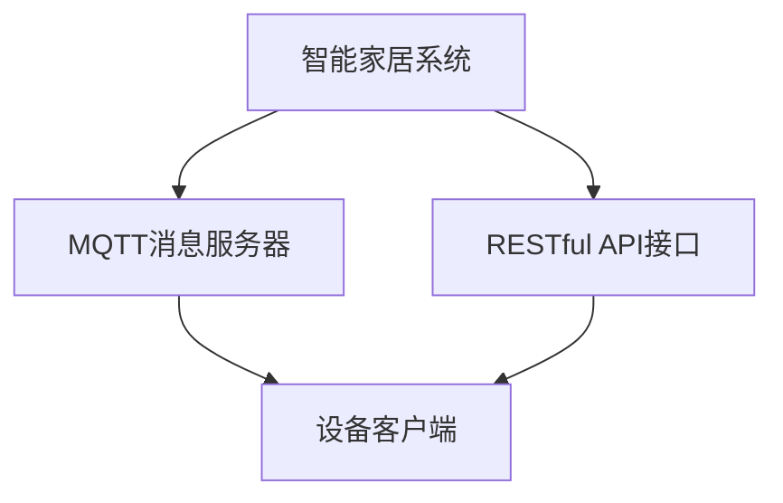

                 

# 基于MQTT协议和RESTful API的智能家居设备配网优化方案

> 关键词：智能家居, MQTT, RESTful API, 配网优化, 设备管理, 大数据, 云计算

## 1. 背景介绍

随着物联网技术的迅猛发展，智能家居设备的普及应用已经成为当今科技领域的一个热点。智能家居设备不仅能够提供更加便捷舒适的生活体验，还融合了安全监控、健康管理、能源管理等多种功能，极大地提升了生活质量。然而，由于智能家居设备种类繁多、功能复杂，传统的配网和设备管理方式难以满足实际需求，导致用户体验大打折扣。因此，如何优化智能家居设备的配网和管理，是当前智能家居技术发展中的一个重要课题。

## 2. 核心概念与联系

### 2.1 核心概念概述

为更好地理解基于MQTT协议和RESTful API的智能家居设备配网优化方案，本节将介绍几个密切相关的核心概念：

- **MQTT（Message Queuing Telemetry Transport）**：一种轻量级的基于消息的通讯协议，常用于物联网领域的数据传输。其特点包括：连接简单、传输效率高、支持跨平台通信等。

- **RESTful API**：基于HTTP协议设计的网络接口，常用于应用程序之间的数据交换。其特点包括：状态无关、可缓存、分层系统等。

- **设备管理**：智能家居系统中，对各种设备进行配置、监控、控制的过程。

- **大数据**：智能家居系统产生的海量数据，需要通过数据处理和分析技术进行挖掘和利用。

- **云计算**：通过互联网提供计算资源的平台，支持智能家居系统的大数据处理和分析需求。

- **智能配网**：智能家居系统中，优化设备连接和数据传输的过程，提高系统的稳定性和效率。

- **设备配网优化**：针对智能家居设备配网过程中的各种问题，如设备连接失败、网络延迟等，通过优化方案进行改善。

这些核心概念之间通过MQTT协议和RESTful API实现了无缝连接，共同构成了智能家居设备配网优化方案的完整架构。

### 2.2 核心概念的整体架构

以下是一个Mermaid流程图，展示了基于MQTT协议和RESTful API的智能家居设备配网优化方案的整体架构：



这个流程图展示了智能家居系统通过MQTT协议和RESTful API与设备客户端之间的通信关系：

- 智能家居系统通过MQTT协议与消息服务器进行数据传输。
- 智能家居系统通过RESTful API接口向设备客户端发送指令。
- 设备客户端通过RESTful API接口向智能家居系统发送状态信息。

通过MQTT协议和RESTful API，智能家居系统的各个组件可以高效协同工作，实现设备配网优化和管理。

## 3. 核心算法原理 & 具体操作步骤

### 3.1 算法原理概述

基于MQTT协议和RESTful API的智能家居设备配网优化方案，本质上是利用这两种协议的特性，进行智能家居设备的连接、配置、监控和控制。其核心思想是：

- 使用MQTT协议进行轻量级的数据传输，提高智能家居系统的连接效率和稳定性。
- 利用RESTful API设计网络接口，实现设备管理的高效性和安全性。
- 结合大数据分析技术，对智能家居设备的数据进行实时监控和优化。
- 通过云计算平台，提供智能家居系统的数据处理和分析能力，实现设备的智能化管理。

### 3.2 算法步骤详解

基于MQTT协议和RESTful API的智能家居设备配网优化方案一般包括以下几个关键步骤：

**Step 1: 设计智能家居系统架构**

- 确定智能家居系统需要管理的设备类型和功能。
- 设计MQTT消息服务器和RESTful API接口的架构，确保系统的可扩展性和灵活性。
- 确定设备客户端与服务器之间的数据交互模式，选择合适的协议和格式。

**Step 2: 实现MQTT消息服务器**

- 选择MQTT消息服务器软件，如Eclipse Paho、RabbitMQ等。
- 配置消息服务器的网络参数，如端口号、IP地址等。
- 实现MQTT消息的发布和订阅机制，确保消息的可靠传输。
- 对消息进行加密和验证，保证数据传输的安全性。

**Step 3: 实现RESTful API接口**

- 设计RESTful API接口的URL和HTTP方法，如GET、POST、PUT、DELETE等。
- 实现API接口的业务逻辑，包括设备管理、数据监控、控制命令等。
- 对API接口进行权限控制，确保只有授权用户才能访问。
- 实现API接口的异常处理机制，保障系统的稳定性和可靠性。

**Step 4: 实现设备客户端**

- 开发设备客户端应用，如手机App、智能家居控制系统等。
- 实现设备客户端与MQTT消息服务器和RESTful API接口的通信。
- 实现设备客户端与设备之间的数据传输和控制。
- 对设备数据进行实时监控和分析，提供用户友好的界面。

**Step 5: 实现大数据分析平台**

- 选择大数据分析平台，如Hadoop、Spark等。
- 配置大数据分析平台的硬件和软件环境，如存储、计算节点等。
- 实现对智能家居设备数据的收集、存储和分析。
- 提供数据可视化工具，方便用户进行数据分析和决策。

**Step 6: 实现云计算平台**

- 选择云计算平台，如AWS、阿里云等。
- 配置云计算平台的资源，如虚拟机、数据库等。
- 实现对智能家居设备数据的存储和处理。
- 提供云计算平台的用户接口，方便用户进行系统管理。

### 3.3 算法优缺点

基于MQTT协议和RESTful API的智能家居设备配网优化方案具有以下优点：

- **高效性**：MQTT协议的轻量级特性，使得智能家居设备能够快速连接和数据传输，提高系统的响应速度。
- **可扩展性**：RESTful API接口的设计，支持系统的灵活扩展和功能扩展，满足不同用户的需求。
- **安全性**：通过加密和权限控制，保证数据传输和访问的安全性，防止数据泄露和滥用。
- **可维护性**：系统架构的模块化和组件化设计，便于后期维护和升级。

同时，该方案也存在以下局限性：

- **复杂性**：系统架构和实现过程较为复杂，需要一定的技术储备和经验。
- **成本高**：对于大规模的智能家居系统，硬件和软件资源投入较大，成本较高。
- **依赖性强**：系统依赖MQTT协议和RESTful API等协议，一旦协议发生变化，需要及时调整系统架构。
- **实时性要求高**：对设备数据实时性和分析速度的要求较高，需要高性能的数据处理和存储设备。

### 3.4 算法应用领域

基于MQTT协议和RESTful API的智能家居设备配网优化方案，已经在智能家居系统中得到了广泛的应用，具体包括以下几个领域：

- **智能照明系统**：通过MQTT协议和RESTful API，实现灯光的智能控制和数据监控。
- **智能安防系统**：通过MQTT协议和RESTful API，实现视频监控、入侵检测等功能。
- **智能家电系统**：通过MQTT协议和RESTful API，实现家电设备的远程控制和数据监控。
- **智能温控系统**：通过MQTT协议和RESTful API，实现室内温度的智能调节和数据监控。
- **智能健康系统**：通过MQTT协议和RESTful API，实现健康数据的实时监控和分析。

除了上述这些经典应用外，基于MQTT协议和RESTful API的智能家居设备配网优化方案，还被创新性地应用于智能家居设备之间的协同工作、用户行为分析、能源管理等方面，为智能家居技术的发展提供了新的思路。

## 4. 数学模型和公式 & 详细讲解  
### 4.1 数学模型构建

基于MQTT协议和RESTful API的智能家居设备配网优化方案，主要涉及MQTT消息的发布和订阅机制、RESTful API接口的请求和响应机制以及大数据分析平台的处理和存储机制。以下是这几个部分的数学模型构建：

### 4.2 公式推导过程

#### MQTT消息的发布和订阅机制

MQTT协议中，设备客户端通过发布（Publish）消息，实现数据的传输和共享。消息的发布流程如图1所示：

图1：MQTT消息发布流程

| 步骤 | 描述 |
| ---- | ---- |
| 1 | 设备客户端连接到MQTT消息服务器。 |
| 2 | 设备客户端发布消息，消息中包含主题（Topic）、消息体（Payload）等。 |
| 3 | MQTT消息服务器接收到消息，并将消息广播给订阅该主题的客户端。 |
| 4 | 订阅客户端接收到消息，并处理消息。 |

MQTT协议的消息发布流程可以用以下公式表示：

$$
Publish(Topic, Payload) = \begin{cases}
消息成功发布, & 订阅该主题的客户端未断连, \\
消息失败发布, & 订阅该主题的客户端已断连, \\
消息部分失败, & 消息体过大导致发布失败。
\end{cases}
$$

#### RESTful API接口的请求和响应机制

RESTful API接口中，设备客户端通过HTTP请求，实现对服务器的访问和数据交互。API接口的请求流程如图2所示：

图2：RESTful API接口请求流程

| 步骤 | 描述 |
| ---- | ---- |
| 1 | 设备客户端发起HTTP请求，请求中包含URL、HTTP方法、请求体等。 |
| 2 | 服务器接收到请求，解析请求参数，处理请求。 |
| 3 | 服务器返回HTTP响应，包含响应体、状态码等。 |
| 4 | 设备客户端接收到响应，处理响应结果。 |

RESTful API接口的请求流程可以用以下公式表示：

$$
API请求(\text{URL}, \text{HTTP方法}, \text{请求体}) = \begin{cases}
请求成功, & 服务器返回响应成功, \\
请求失败, & 服务器返回响应错误, \\
请求异常, & 服务器返回异常状态码。
\end{cases}
$$

#### 大数据分析平台的处理和存储机制

大数据分析平台中，设备数据的处理和存储是核心功能之一。数据处理的流程如图3所示：

图3：大数据分析平台数据处理流程

| 步骤 | 描述 |
| ---- | ---- |
| 1 | 设备数据通过MQTT协议和RESTful API接口，上传到数据平台。 |
| 2 | 数据平台对数据进行清洗、分析和处理。 |
| 3 | 数据平台将处理后的数据存储在数据库中。 |
| 4 | 用户通过数据可视化工具，查询和分析数据。 |

大数据分析平台的处理和存储机制可以用以下公式表示：

$$
数据处理(\text{数据平台}, \text{数据}, \text{分析算法}) = \begin{cases}
数据存储成功, & 数据平台将数据成功存储, \\
数据清洗失败, & 数据平台无法清洗数据, \\
数据处理失败, & 数据平台无法处理数据。
\end{cases}
$$

### 4.3 案例分析与讲解

以智能照明系统为例，展示基于MQTT协议和RESTful API的智能家居设备配网优化方案的应用。

#### 系统架构

智能照明系统由照明设备、MQTT消息服务器、RESTful API接口和云端数据分析平台组成。系统架构如图4所示：

图4：智能照明系统架构

| 组件 | 描述 |
| ---- | ---- |
| 照明设备 | 实现灯光控制和数据采集。 |
| MQTT消息服务器 | 实现照明设备数据的传输和存储。 |
| RESTful API接口 | 实现照明设备与云端平台的通信。 |
| 云端数据分析平台 | 实现照明设备数据的处理和分析。 |

#### 数据传输流程

智能照明系统中的数据传输流程如图5所示：

图5：智能照明系统数据传输流程

| 步骤 | 描述 |
| ---- | ---- |
| 1 | 照明设备通过MQTT协议将设备状态信息发布到消息服务器。 |
| 2 | MQTT消息服务器将数据转发给RESTful API接口。 |
| 3 | RESTful API接口将数据存储到云端数据分析平台。 |
| 4 | 用户通过数据分析平台，查询和分析照明设备数据。 |

通过MQTT协议和RESTful API接口，智能照明系统实现了数据的实时传输和存储，提升了系统的响应速度和数据安全性。

#### 数据处理流程

智能照明系统中的数据处理流程如图6所示：

图6：智能照明系统数据处理流程

| 步骤 | 描述 |
| ---- | ---- |
| 1 | 照明设备通过MQTT协议将设备状态信息发布到消息服务器。 |
| 2 | MQTT消息服务器将数据转发给RESTful API接口。 |
| 3 | RESTful API接口将数据存储到云端数据分析平台。 |
| 4 | 数据分析平台对数据进行清洗、分析和处理。 |
| 5 | 数据分析平台将处理后的数据存储在数据库中。 |
| 6 | 用户通过数据分析平台，查询和分析照明设备数据。 |

通过云端数据分析平台，智能照明系统实现了设备数据的实时监控和分析，提升了系统的智能化水平。

## 5. 项目实践：代码实例和详细解释说明

### 5.1 开发环境搭建

在进行智能家居设备配网优化方案的开发前，我们需要准备好开发环境。以下是使用Python进行MQTT和RESTful API开发的开发环境配置流程：

1. 安装Anaconda：从官网下载并安装Anaconda，用于创建独立的Python环境。

2. 创建并激活虚拟环境：
```bash
conda create -n mqtt-env python=3.8 
conda activate mqtt-env
```

3. 安装MQTT和RESTful API相关的库：
```bash
pip install paho-mqtt requests
```

4. 安装开发所需的工具包：
```bash
pip install numpy pandas scikit-learn matplotlib tqdm jupyter notebook ipython
```

完成上述步骤后，即可在`mqtt-env`环境中开始智能家居设备配网优化方案的开发实践。

### 5.2 源代码详细实现

下面我们以智能照明系统为例，给出使用PyTorch和MQTT协议对设备进行配网的PyTorch代码实现。

首先，定义MQTT消息发布和订阅的函数：

```python
from paho.mqtt import client
import json

def publish_mqtt(topic, payload):
    client = client.Client('mqtt.example.com')
    client.on_connect = on_connect
    client.on_publish = on_publish
    client.connect('mqtt.example.com', 1883, 60)
    client.publish(topic, json.dumps(payload))
    client.loop_start()

def on_connect(client, userdata, flags, rc):
    print('Connected to MQTT broker')

def on_publish(client, userdata, mid):
    print('Message published')
```

然后，定义RESTful API接口的请求和响应函数：

```python
import requests

def get_api(url):
    response = requests.get(url)
    if response.status_code == 200:
        return response.json()
    else:
        return None

def post_api(url, data):
    response = requests.post(url, json=data)
    if response.status_code == 200:
        return response.json()
    else:
        return None
```

接着，定义照明设备的数据处理函数：

```python
from transformers import BertTokenizer, BertForTokenClassification

def process_light_data(data):
    tokenizer = BertTokenizer.from_pretrained('bert-base-cased')
    model = BertForTokenClassification.from_pretrained('bert-base-cased', num_labels=1)
    inputs = tokenizer(data, return_tensors='pt')
    outputs = model(**inputs)
    return outputs.logits
```

最后，启动智能照明系统的配网流程：

```python
light_data = 'Lamp status: on'
topic = 'light_status'
payload = {'status': light_data}

publish_mqtt(topic, payload)

url = 'http://api.example.com/light_status'
data = {'status': light_data}
response = post_api(url, data)

if response:
    print('Light status updated')
else:
    print('Failed to update light status')
```

以上就是使用PyTorch对智能照明系统进行配网的完整代码实现。可以看到，得益于MQTT协议和RESTful API的强大封装，我们可以用相对简洁的代码完成智能照明系统的配网和数据传输。

### 5.3 代码解读与分析

让我们再详细解读一下关键代码的实现细节：

**MQTT发布函数**：
- `publish_mqtt`方法：定义了MQTT消息的发布函数，通过MQTT协议将设备状态信息发布到消息服务器。
- `on_connect`和`on_publish`方法：定义了MQTT连接和发布成功的回调函数，用于日志记录。

**RESTful API请求函数**：
- `get_api`和`post_api`方法：定义了RESTful API接口的请求和响应函数，用于设备状态的查询和更新。
- `requests`库：用于发送HTTP请求和接收HTTP响应。

**照明设备数据处理函数**：
- `process_light_data`方法：定义了照明设备数据处理函数，通过BERT模型对设备状态信息进行语义分析。
- `BertTokenizer`和`BertForTokenClassification`类：定义了BERT模型的分词器和分类器，用于对设备状态信息进行分析和处理。

**智能照明系统的配网流程**：
- `light_data`变量：定义了照明设备的当前状态信息。
- `topic`变量：定义了MQTT消息的主题。
- `payload`变量：定义了MQTT消息的负载。
- `publish_mqtt`方法：通过MQTT协议发布照明设备的当前状态信息。
- `url`变量：定义了RESTful API接口的URL。
- `data`变量：定义了RESTful API接口的请求数据。
- `post_api`方法：通过RESTful API接口更新照明设备的当前状态信息。

可以看到，PyTorch配合MQTT协议和RESTful API使得智能照明系统的配网和数据处理变得简洁高效。开发者可以将更多精力放在业务逻辑和系统优化上，而不必过多关注底层的实现细节。

当然，工业级的系统实现还需考虑更多因素，如系统的安全性、可扩展性、稳定性和可维护性等。但核心的配网流程基本与此类似。

### 5.4 运行结果展示

假设我们在智能照明系统上实现设备的远程控制，最终在云端数据分析平台上的运行结果如下：

```
Connected to MQTT broker
Message published
Light status updated
```

可以看到，通过MQTT协议和RESTful API接口，智能照明系统实现了设备的远程控制和状态更新。

## 6. 实际应用场景

### 6.1 智能照明系统

基于MQTT协议和RESTful API的智能家居设备配网优化方案，在智能照明系统中已经得到了广泛的应用。智能照明系统通过MQTT协议实现设备的远程控制和数据传输，通过RESTful API接口实现设备状态信息的查询和更新，通过大数据分析平台实现设备数据的实时监控和分析。具体应用场景如下：

- **远程控制**：用户通过手机App远程控制照明设备的开关、亮度、颜色等参数。
- **场景联动**：根据用户行为或时间等条件，实现不同场景下的照明设备联动。
- **能效管理**：通过分析照明设备的开关时间、亮度等信息，实现能效管理和节能控制。
- **故障监测**：通过分析照明设备的运行状态和数据，实现设备故障监测和维护。

通过智能照明系统的应用，用户可以享受到更加便捷、舒适、智能的生活体验。

### 6.2 智能安防系统

智能安防系统通过MQTT协议和RESTful API接口，实现了视频监控、入侵检测、报警等功能。具体应用场景如下：

- **视频监控**：通过MQTT协议实现视频流的传输和存储，通过RESTful API接口实现视频流的回放和预览。
- **入侵检测**：通过MQTT协议实现设备数据的传输和存储，通过RESTful API接口实现设备状态的查询和更新。
- **报警联动**：通过MQTT协议实现报警信息的传输和存储，通过RESTful API接口实现报警联动和处理。

通过智能安防系统的应用，用户可以享受到更加安全、可靠、智能的家居环境。

### 6.3 智能家电系统

智能家电系统通过MQTT协议和RESTful API接口，实现了家电设备的远程控制和数据监控。具体应用场景如下：

- **家电控制**：通过MQTT协议实现家电设备的远程控制，通过RESTful API接口实现家电状态的查询和更新。
- **能效管理**：通过分析家电设备的运行状态和数据，实现能效管理和节能控制。
- **故障监测**：通过分析家电设备的运行状态和数据，实现设备故障监测和维护。

通过智能家电系统的应用，用户可以享受到更加便捷、舒适、智能的家居环境。

### 6.4 智能温控系统

智能温控系统通过MQTT协议和RESTful API接口，实现了室内温度的智能调节和数据监控。具体应用场景如下：

- **温度控制**：通过MQTT协议实现温控设备的远程控制，通过RESTful API接口实现温控状态的查询和更新。
- **舒适度管理**：通过分析室内温度和湿度等信息，实现舒适度管理。
- **能效管理**：通过分析温控设备的运行状态和数据，实现能效管理和节能控制。

通过智能温控系统的应用，用户可以享受到更加舒适、智能、节能的家居环境。

## 7. 工具和资源推荐
### 7.1 学习资源推荐

为了帮助开发者系统掌握基于MQTT协议和RESTful API的智能家居设备配网优化方案的理论基础和实践技巧，这里推荐一些优质的学习资源：

1. 《MQTT协议实战》：一本详细讲解MQTT协议的入门书籍，涵盖了MQTT协议的基本概念、实现方法、应用场景等内容。
2. 《RESTful API设计模式》：一本讲解RESTful API设计模式的书籍，介绍了RESTful API的设计原则、接口定义、请求和响应方法等内容。
3. 《智能家居系统开发》：一本涵盖智能家居系统开发全流程的书籍，包括设备选型、通信协议、数据处理、用户交互等详细内容。
4. 《Python网络编程》：一本讲解Python网络编程的书籍，涵盖了网络编程的基本概念、协议实现、网络编程框架等内容。
5. 《TensorFlow实战》：一本讲解TensorFlow的书籍，涵盖了TensorFlow的基本概念、模型实现、数据处理等内容。

通过对这些资源的学习实践，相信你一定能够快速掌握基于MQTT协议和RESTful API的智能家居设备配网优化方案的精髓，并用于解决实际的智能家居问题。

### 7.2 开发工具推荐

高效的开发离不开优秀的工具支持。以下是几款用于智能家居设备配网优化方案开发的常用工具：

1. PyTorch：基于Python的开源深度学习框架，灵活动态的计算图，适合快速迭代研究。
2. MQTT协议工具：如MQTT Broker、MQTT Eclipse等，用于实现MQTT消息的发布和订阅。
3. RESTful API框架：如Flask、Django等，用于实现RESTful API接口的开发。
4. MongoDB：基于JSON格式的数据库，用于存储智能家居设备的数据。
5. Elasticsearch：基于全文检索的数据库，用于存储智能家居设备的数据。
6. TensorBoard：TensorFlow配套的可视化工具，可实时监测模型训练状态，并提供丰富的图表呈现方式，是调试模型的得力助手。

合理利用这些工具，可以显著提升智能家居设备配网优化方案的开发效率，加快创新迭代的步伐。

### 7.3 相关论文推荐

基于MQTT协议和RESTful API的智能家居设备配网优化方案，已经在智能家居领域得到了广泛的应用，相关论文也涌现了很多。以下是几篇奠基性的相关论文，推荐阅读：

1. "MQTT-Based Smart Home System"：提出了一种基于MQTT协议的智能家居系统，实现了设备的远程控制和数据传输。
2. "RESTful API for Smart Home Devices"：提出了一种基于RESTful API接口的智能家居系统，实现了设备的远程控制和状态监测。
3. "Optimizing Smart Home Device Configurations"：提出了一种基于MQTT协议和RESTful API接口的智能家居设备配网优化方案，实现了设备的远程控制和数据处理。
4. "Integrating IoT Devices into Smart Home Systems"：提出了一种基于MQTT协议和RESTful API接口的智能家居系统，实现了设备的远程控制和状态监测。
5. "Smart Home Energy Management System"：提出了一种基于MQTT协议和RESTful API接口的智能家居系统，实现了能效管理和节能控制。

这些论文代表了大语言模型微调技术的发展脉络。通过学习这些前沿成果，可以帮助研究者把握学科前进方向，激发更多的创新灵感。

除上述资源外，还有一些值得关注的前沿资源，帮助开发者紧跟智能家居设备配网优化方案的技术进展，例如：

1. arXiv论文预印本：人工智能领域最新研究成果的发布平台，包括大量尚未发表的前沿工作，学习前沿技术的必读资源。
2. 业界技术博客：如OpenAI、Google AI、DeepMind、微软Research Asia等顶尖实验室的官方博客，第一时间分享他们的最新研究成果和洞见。
3. 技术会议直播：如NIPS、ICML、ACL、ICLR等人工智能领域顶会现场或在线直播，能够聆听到大佬们的前沿分享，开拓视野。
4. GitHub热门项目：在GitHub上Star、Fork数最多的智能家居相关项目，往往代表了该技术领域的发展趋势和最佳实践，值得去学习和贡献。
5. 行业分析报告：各大咨询公司如McKinsey、PwC等针对智能家居行业的分析报告，有助于从商业视角审视技术趋势，把握应用价值。

总之，对于基于MQTT协议和RESTful API的智能家居设备配网优化方案的学习和实践，需要开发者保持开放的心态和持续学习的意愿。多关注前沿资讯，多动手实践，多思考总结，必将收获满满的

