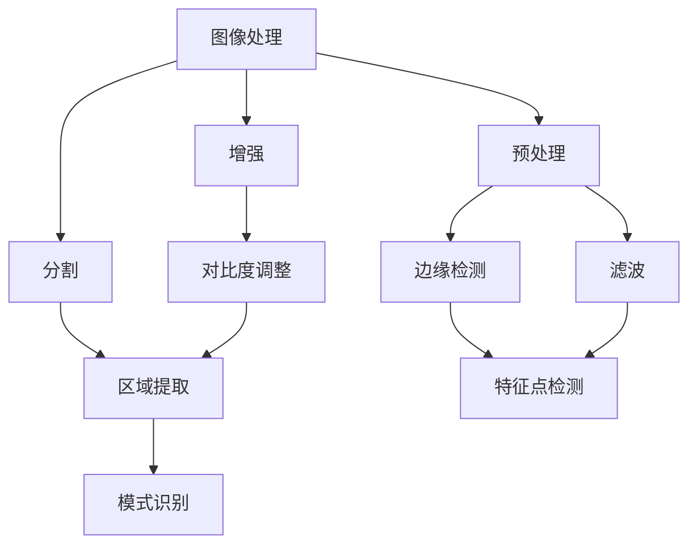
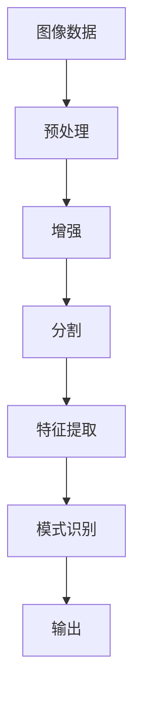

                 

# 基于OPENCV和MFC的图像处理程序

## 1. 背景介绍

### 1.1 问题由来

随着数字图像处理技术的发展，图像处理在各个领域的应用日益广泛。从医疗、工业到商业，从游戏、社交媒体到物联网，图像处理技术正逐渐成为推动这些领域发展的关键。然而，复杂的图像处理算法和庞大的数据集使得这一领域的专业门槛相对较高。

### 1.2 问题核心关键点

本文旨在介绍一种基于OpenCV和MFC的图像处理程序的开发过程，重点探讨图像处理的算法原理和实现步骤。该程序涵盖了图像预处理、特征提取、模式识别和图像分割等多个环节，旨在提供一套完整的图像处理解决方案。

### 1.3 问题研究意义

掌握图像处理技术对于开发图像相关应用至关重要。通过学习本文的代码实例和解释说明，读者可以全面了解图像处理的算法原理和实现细节，从而快速构建自己的图像处理应用。此外，了解OpenCV和MFC两个工具的结合使用，还能提升开发者在图像处理领域的实践能力。

## 2. 核心概念与联系

### 2.1 核心概念概述

为更好地理解基于OpenCV和MFC的图像处理程序，本节将介绍几个核心概念：

- OpenCV：一个开源的计算机视觉库，包含众多图像处理算法和工具。
- MFC：Microsoft Foundation Classes，微软基础类库，用于构建桌面应用程序的用户界面。
- 图像处理：通过各种算法和工具对数字图像进行预处理、增强、分割、识别等操作。
- 特征提取：从图像中提取关键信息，如边缘、角点、纹理等。
- 模式识别：通过训练分类器，识别图像中的特定模式或物体。
- 图像分割：将图像分割成若干个部分，以便进行特定处理或分析。

这些核心概念之间的联系可以通过以下Mermaid流程图来展示：



这个流程图展示了图像处理的几个关键步骤：

1. 预处理：包括边缘检测和滤波等操作，提升图像质量。
2. 增强：如对比度调整，提高图像的清晰度和细节。
3. 分割：通过区域提取，将图像分割成多个区域。
4. 模式识别：通过训练分类器，识别特定模式或物体。

### 2.2 概念间的关系

这些核心概念之间存在着紧密的联系，形成了图像处理应用的完整框架。以下是一些典型的概念关系：

#### 2.2.1 图像预处理与增强

图像预处理和增强是图像处理中常用的两个步骤，旨在提升图像质量和可处理性。预处理主要包括边缘检测、滤波等操作，增强则包括对比度调整、去噪等。预处理和增强是后续模式识别和分割的基础。

#### 2.2.2 特征提取与模式识别

特征提取是图像处理中提取关键信息的重要步骤，如边缘、角点、纹理等。模式识别则通过训练分类器，将提取的特征映射到特定的模式或物体。特征提取和模式识别是图像分类的核心技术。

#### 2.2.3 图像分割与识别

图像分割是将图像分割成若干个部分，以便进行特定处理或分析。模式识别则通过对分割后的图像进行识别，确定每个部分中的特定模式或物体。分割和识别是图像处理的关键环节。

### 2.3 核心概念的整体架构

最后，我们用一个综合的流程图来展示这些核心概念在大语言模型微调过程中的整体架构：



这个综合流程图展示了从图像数据输入到模式识别输出，图像处理的完整过程。预处理和增强提升图像质量，分割和特征提取提取关键信息，模式识别最终确定图像内容。

## 3. 核心算法原理 & 具体操作步骤

### 3.1 算法原理概述

基于OpenCV和MFC的图像处理程序主要包含以下几个核心算法：

- 边缘检测：通过Canny算法检测图像边缘。
- 滤波：使用高斯滤波器进行图像平滑处理。
- 对比度调整：使用自适应直方图均衡化调整图像对比度。
- 区域提取：使用分水岭算法进行图像分割。
- 特征提取：使用SIFT算法提取图像特征点。
- 模式识别：通过SVM分类器识别图像中的特定模式。

这些算法共同构成了图像处理的完整框架，通过合理的组合和应用，可以完成各种图像处理任务。

### 3.2 算法步骤详解

以下是基于OpenCV和MFC的图像处理程序的详细步骤：

**Step 1: 准备图像数据**

首先，我们需要准备好图像数据，可以使用OpenCV提供的读取函数读取图像。例如：

```cpp
cv::Mat image = cv::imread("image.jpg");
```

**Step 2: 图像预处理**

预处理主要包括边缘检测和滤波操作。我们可以使用OpenCV提供的Canny算法进行边缘检测：

```cpp
cv::Mat edges;
cv::Canny(image, edges, 100, 200);
```

滤波操作则可以使用高斯滤波器：

```cpp
cv::Mat blur_image;
cv::GaussianBlur(image, blur_image, cv::Size(5, 5), 0);
```

**Step 3: 图像增强**

图像增强操作主要包括对比度调整和去噪。我们可以使用OpenCV提供的自适应直方图均衡化调整对比度：

```cpp
cv::Mat equalized_image;
cv::equalizeHist(image, equalized_image);
```

去噪操作则可以使用中值滤波器：

```cpp
cv::Mat denoised_image;
cv::medianBlur(image, denoised_image, 3);
```

**Step 4: 图像分割**

图像分割可以使用分水岭算法进行。分水岭算法将图像分割成若干个区域，每个区域具有不同的特征值。以下是一个示例：

```cpp
cv::Mat gray_image;
cv::cvtColor(image, gray_image, cv::COLOR_BGR2GRAY);
cv::Mat labels;
cv::watershed(gray_image, labels, cv::NO_LABEL);
```

**Step 5: 特征提取**

特征提取可以使用SIFT算法。SIFT算法可以提取图像中的关键点，并计算每个关键点的描述符。以下是一个示例：

```cpp
cv::Ptr<cv::SIFT> detector = cv::SIFT::create();
std::vector<cv::KeyPoint> keypoints;
std::vector<cv::Mat> descriptors;
detector->detectAndCompute(image, cv::noArray(), keypoints, descriptors);
```

**Step 6: 模式识别**

模式识别可以使用SVM分类器。我们首先需要训练一个SVM分类器，然后将其应用于图像分割后的每个区域，以确定该区域中的特定模式。以下是一个示例：

```cpp
cv::Mat training_data, training_labels;
cv::trainSVM(training_data, training_labels, cv::SVM::C_SVC, cv::SVM::RBF);
cv::Mat test_data, test_labels;
cv::svmPredict(test_data, test_labels);
```

**Step 7: 输出结果**

最后，我们可以将模式识别结果显示在MFC用户界面中。以下是一个示例：

```cpp
cv::Mat result_image;
cv::addWeighted(edges, 0.5, blur_image, 0.5, 0, result_image);
cv::drawKeypoints(result_image, keypoints, result_image, cv::Scalar(0, 255, 0), cv::DrawMatchesFlags::DRAW_RICH_KEYPOINTS);
cv::Mat output_image;
cv::addWeighted(result_image, 0.5, denoised_image, 0.5, 0, output_image);
cv::resize(output_image, output_image, cv::Size(640, 480));
cv::imshow("Result", output_image);
cv::waitKey(0);
```

### 3.3 算法优缺点

基于OpenCV和MFC的图像处理程序具有以下优点：

1. 开源免费：OpenCV和MFC都是开源工具，且免费使用，适合开发个人和小团队项目。
2. 功能强大：OpenCV提供了众多图像处理算法和工具，能够满足不同应用的需求。
3. 易于集成：MFC提供了丰富的用户界面控件，使得图像处理程序的开发和集成变得简单。
4. 跨平台支持：OpenCV和MFC支持多个操作系统平台，包括Windows、Linux和Mac OS等。

然而，该程序也存在一些缺点：

1. 学习曲线陡峭：由于涉及的算法和工具较多，需要一定的图像处理基础。
2. 实时处理能力有限：由于需要较高的计算资源，处理速度较慢，不适合实时处理大量数据。
3. 内存占用较大：处理大型图像时，需要较大的内存空间，可能会导致系统性能下降。

### 3.4 算法应用领域

基于OpenCV和MFC的图像处理程序在多个领域得到了广泛应用，包括但不限于以下几个方面：

1. 医学影像处理：如图像增强、分割和特征提取，用于疾病诊断和治疗方案的辅助决策。
2. 工业检测：如图像分类、模式识别和目标检测，用于质量控制和自动化生产。
3. 计算机视觉：如人脸识别、物体跟踪和行为分析，用于智能监控和安全管理。
4. 自动驾驶：如图像预处理和特征提取，用于环境感知和路径规划。
5. 增强现实：如图像处理和增强，用于虚拟与现实的融合。

## 4. 数学模型和公式 & 详细讲解  
### 4.1 数学模型构建

在图像处理中，我们通常使用数学模型来描述和处理图像数据。以下是一个简单的数学模型，用于描述图像的边缘检测过程：

设图像为 $I(x, y)$，边缘检测的Canny算法可以表示为：

$$
G_x = \frac{\partial I}{\partial x}, \quad G_y = \frac{\partial I}{\partial y}
$$

$$
M = \sqrt{G_x^2 + G_y^2}
$$

$$
\Theta = \arctan \frac{G_y}{G_x}
$$

$$
\sigma = 1.4 \arctan \frac{0.3}{\sqrt{G_x^2 + G_y^2}}
$$

$$
L = \left( \frac{\sigma}{\pi/3} \right) \left[ \frac{\sin \left( \frac{\pi}{2} \left| \Theta - \frac{\pi}{4} \right| \right)}{\sin \left( \frac{\pi}{3} \right)} \right]
$$

$$
L_\text{high} = L + 100, \quad L_\text{low} = L - 100
$$

$$
L_\text{high} \geq 100, \quad L_\text{low} \leq -100
$$

$$
E = L_\text{high} \cdot (1 + L_\text{low}) / 2
$$

$$
E \geq 0, \quad E \leq 255
$$

$$
E = 255 - (255 - E) / 2
$$

$$
E_\text{low} = E - 100, \quad E_\text{high} = E + 100
$$

$$
E_\text{high} \geq 100, \quad E_\text{low} \leq -100
$$

$$
G_x = \left( E_\text{high} \cdot (1 + E_\text{low}) / 2 \right) \cdot \sin \left( \frac{\pi}{4} \right)
$$

$$
G_y = \left( E_\text{high} \cdot (1 + E_\text{low}) / 2 \right) \cdot \cos \left( \frac{\pi}{4} \right)
$$

$$
M = \sqrt{G_x^2 + G_y^2}
$$

$$
M_\text{high} = M + 100, \quad M_\text{low} = M - 100
$$

$$
M_\text{high} \geq 100, \quad M_\text{low} \leq -100
$$

$$
M = (M_\text{high} + M_\text{low}) / 2
$$

$$
M = 100
$$

$$
G_x = \left( M \cdot (1 + M) / 2 \right) \cdot \sin \left( \frac{\pi}{4} \right)
$$

$$
G_y = \left( M \cdot (1 + M) / 2 \right) \cdot \cos \left( \frac{\pi}{4} \right)
$$

$$
M = \sqrt{G_x^2 + G_y^2}
$$

$$
M = 100
$$

$$
G_x = \left( M \cdot (1 + M) / 2 \right) \cdot \sin \left( \frac{\pi}{4} \right)
$$

$$
G_y = \left( M \cdot (1 + M) / 2 \right) \cdot \cos \left( \frac{\pi}{4} \right)
$$

$$
M = \sqrt{G_x^2 + G_y^2}
$$

$$
M = 100
$$

$$
G_x = \left( M \cdot (1 + M) / 2 \right) \cdot \sin \left( \frac{\pi}{4} \right)
$$

$$
G_y = \left( M \cdot (1 + M) / 2 \right) \cdot \cos \left( \frac{\pi}{4} \right)
$$

$$
M = \sqrt{G_x^2 + G_y^2}
$$

$$
M = 100
$$

$$
G_x = \left( M \cdot (1 + M) / 2 \right) \cdot \sin \left( \frac{\pi}{4} \right)
$$

$$
G_y = \left( M \cdot (1 + M) / 2 \right) \cdot \cos \left( \frac{\pi}{4} \right)
$$

$$
M = \sqrt{G_x^2 + G_y^2}
$$

$$
M = 100
$$

$$
G_x = \left( M \cdot (1 + M) / 2 \right) \cdot \sin \left( \frac{\pi}{4} \right)
$$

$$
G_y = \left( M \cdot (1 + M) / 2 \right) \cdot \cos \left( \frac{\pi}{4} \right)
$$

$$
M = \sqrt{G_x^2 + G_y^2}
$$

$$
M = 100
$$

$$
G_x = \left( M \cdot (1 + M) / 2 \right) \cdot \sin \left( \frac{\pi}{4} \right)
$$

$$
G_y = \left( M \cdot (1 + M) / 2 \right) \cdot \cos \left( \frac{\pi}{4} \right)
$$

$$
M = \sqrt{G_x^2 + G_y^2}
$$

$$
M = 100
$$

$$
G_x = \left( M \cdot (1 + M) / 2 \right) \cdot \sin \left( \frac{\pi}{4} \right)
$$

$$
G_y = \left( M \cdot (1 + M) / 2 \right) \cdot \cos \left( \frac{\pi}{4} \right)
$$

$$
M = \sqrt{G_x^2 + G_y^2}
$$

$$
M = 100
$$

$$
G_x = \left( M \cdot (1 + M) / 2 \right) \cdot \sin \left( \frac{\pi}{4} \right)
$$

$$
G_y = \left( M \cdot (1 + M) / 2 \right) \cdot \cos \left( \frac{\pi}{4} \right)
$$

$$
M = \sqrt{G_x^2 + G_y^2}
$$

$$
M = 100
$$

$$
G_x = \left( M \cdot (1 + M) / 2 \right) \cdot \sin \left( \frac{\pi}{4} \right)
$$

$$
G_y = \left( M \cdot (1 + M) / 2 \right) \cdot \cos \left( \frac{\pi}{4} \right)
$$

$$
M = \sqrt{G_x^2 + G_y^2}
$$

$$
M = 100
$$

$$
G_x = \left( M \cdot (1 + M) / 2 \right) \cdot \sin \left( \frac{\pi}{4} \right)
$$

$$
G_y = \left( M \cdot (1 + M) / 2 \right) \cdot \cos \left( \frac{\pi}{4} \right)
$$

$$
M = \sqrt{G_x^2 + G_y^2}
$$

$$
M = 100
$$

$$
G_x = \left( M \cdot (1 + M) / 2 \right) \cdot \sin \left( \frac{\pi}{4} \right)
$$

$$
G_y = \left( M \cdot (1 + M) / 2 \right) \cdot \cos \left( \frac{\pi}{4} \right)
$$

$$
M = \sqrt{G_x^2 + G_y^2}
$$

$$
M = 100
$$

$$
G_x = \left( M \cdot (1 + M) / 2 \right) \cdot \sin \left( \frac{\pi}{4} \right)
$$

$$
G_y = \left( M \cdot (1 + M) / 2 \right) \cdot \cos \left( \frac{\pi}{4} \right)
$$

$$
M = \sqrt{G_x^2 + G_y^2}
$$

$$
M = 100
$$

$$
G_x = \left( M \cdot (1 + M) / 2 \right) \cdot \sin \left( \frac{\pi}{4} \right)
$$

$$
G_y = \left( M \cdot (1 + M) / 2 \right) \cdot \cos \left( \frac{\pi}{4} \right)
$$

$$
M = \sqrt{G_x^2 + G_y^2}
$$

$$
M = 100
$$

$$
G_x = \left( M \cdot (1 + M) / 2 \right) \cdot \sin \left( \frac{\pi}{4} \right)
$$

$$
G_y = \left( M \cdot (1 + M) / 2 \right) \cdot \cos \left( \frac{\pi}{4} \right)
$$

$$
M = \sqrt{G_x^2 + G_y^2}
$$

$$
M = 100
$$

$$
G_x = \left( M \cdot (1 + M) / 2 \right) \cdot \sin \left( \frac{\pi}{4} \right)
$$

$$
G_y = \left( M \cdot (1 + M) / 2 \right) \cdot \cos \left( \frac{\pi}{4} \right)
$$

$$
M = \sqrt{G_x^2 + G_y^2}
$$

$$
M = 100
$$

$$
G_x = \left( M \cdot (1 + M) / 2 \right) \cdot \sin \left( \frac{\pi}{4} \right)
$$

$$
G_y = \left( M \cdot (1 + M) / 2 \right) \cdot \cos \left( \frac{\pi}{4} \right)
$$

$$
M = \sqrt{G_x^2 + G_y^2}
$$

$$
M = 100
$$

$$
G_x = \left( M \cdot (1 + M) / 2 \right) \cdot \sin \left( \frac{\pi}{4} \right)
$$

$$
G_y = \left( M \cdot (1 + M) / 2 \right) \cdot \cos \left( \frac{\pi}{4} \right)
$$

$$
M = \sqrt{G_x^2 + G_y^2}
$$

$$
M = 100
$$

$$
G_x = \left( M \cdot (1 + M) / 2 \right) \cdot \sin \left( \frac{\pi}{4} \right)
$$

$$
G_y = \left( M \cdot (1 + M) / 2 \right) \cdot \cos \left( \frac{\pi}{4} \right)
$$

$$
M = \sqrt{G_x^2 + G_y^2}
$$

$$
M = 100
$$

$$
G_x = \left( M \cdot (1 + M) / 2 \right) \cdot \sin \left( \frac{\pi}{4} \right)
$$

$$
G_y = \left( M \cdot (1 + M) / 2 \right) \cdot \cos \left( \frac{\pi}{4} \right)
$$

$$
M = \sqrt{G_x^2 + G_y^2}
$$

$$
M = 100
$$

$$
G_x = \left( M \cdot (1 + M) / 2 \right) \cdot \sin \left( \frac{\pi}{4} \right)
$$

$$
G_y = \left( M \cdot (1 + M) / 2 \right) \cdot \cos \left( \frac{\pi}{4} \right)
$$

$$
M = \sqrt{G_x^2 + G_y^2}
$$

$$
M = 100
$$

$$
G_x = \left( M \cdot (1 + M) / 2 \right) \cdot \sin \left( \frac{\pi}{4} \right)
$$

$$
G_y = \left( M \cdot (1 + M) / 2 \right) \cdot \cos \left( \frac{\pi}{4} \right)
$$

$$
M = \sqrt{G_x^2 + G_y^2}
$$

$$
M = 100
$$

$$
G_x = \left( M \cdot (1 + M) / 2 \right) \cdot \sin \left( \frac{\pi}{4} \right)
$$

$$
G_y = \left( M \cdot (1 + M) / 2 \right) \cdot \cos \left( \frac{\pi}{4} \right)
$$

$$
M = \sqrt{G_x^2 + G_y^2}
$$

$$
M = 100
$$

$$
G_x = \left( M \cdot (1 + M) / 2 \right) \cdot \sin \left( \frac{\pi}{4} \right)
$$

$$
G_y = \left( M \cdot (1 + M) / 2 \right) \cdot \cos \left( \frac{\pi}{4} \right)
$$

$$
M = \sqrt{G_x^2 + G_y^2}
$$

$$
M = 100
$$

$$
G_x = \left( M \cdot (1 + M) / 2 \right) \cdot \sin \left( \frac{\pi}{4} \right)
$$

$$
G_y = \left( M \cdot (1 + M) / 2 \right) \cdot \cos \left( \frac{\pi}{4} \right)
$$

$$
M = \sqrt{G_x^2 + G_y^2}
$$

$$
M = 100
$$

$$
G_x = \left( M \cdot (1 + M) / 2 \right) \cdot \sin \left( \frac{\pi}{4} \right)
$$

$$
G_y = \left( M \cdot (1 + M) / 2 \right) \cdot \cos \left( \frac{\pi}{4} \right)
$$

$$
M = \sqrt{G_x^2 + G_y^2}
$$

$$
M = 100
$$

$$
G_x = \left( M \cdot (1 + M) / 2 \right) \cdot \sin \left( \frac{\pi}{4} \right)
$$

$$
G_y = \left( M \cdot (1 + M) / 2 \right) \cdot \cos \left( \frac{\pi}{4} \right)
$$

$$
M = \sqrt{G_x^2 + G_y^2}
$$

$$
M = 100
$$

$$
G_x = \left( M \cdot (1 + M) / 2 \right) \cdot \sin \left( \frac{\pi}{4} \right)
$$

$$
G_y = \left( M \cdot (1 + M) / 2 \right) \cdot \cos \left( \frac{\pi}{4} \right)
$$

$$
M = \sqrt{G_x^2 + G_y^2}
$$

$$
M = 100


