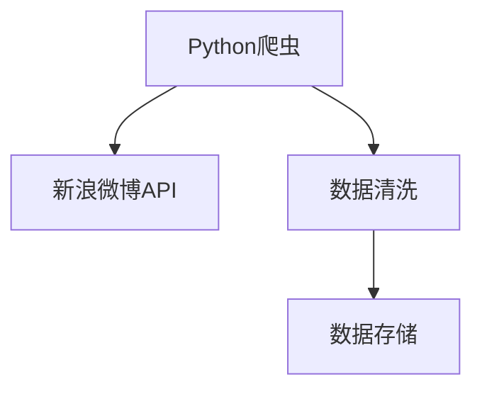

                 

# 基于Python的新浪微博爬虫研究

> 关键词：Python爬虫, 新浪微博, 数据爬取, 网络请求, API, 数据清洗, 数据存储

## 1. 背景介绍

在现代互联网时代，社交媒体平台如微博、Facebook、Twitter等成为了人们获取信息、交流思想的重要渠道。这些平台上的数据具有时效性强、更新频率高、内容丰富等特点，吸引了大量数据分析师和研究人员对其内容进行挖掘和研究。其中，新浪微博作为国内领先的社交媒体平台之一，其用户数量庞大，内容质量高，具有较高的研究价值。

本研究将详细介绍如何使用Python语言和相关工具对新浪微博进行爬虫数据收集，重点分析数据清洗和存储的方法，并展示如何利用爬取到的数据进行数据分析和挖掘。

## 2. 核心概念与联系

### 2.1 核心概念概述

在研究新浪微博爬虫的过程中，涉及以下几个核心概念：

- Python爬虫：使用Python语言和相关库实现的网络爬虫程序，通常用于自动化地从目标网站上获取数据。
- 新浪微博API：新浪微博提供的开放API，可以用于获取微博信息、粉丝信息、评论信息等。
- 数据清洗：从爬取到的原始数据中去除噪声和无用信息，保留有用的数据，提高数据的准确性和可用性。
- 数据存储：将清洗后的数据保存到本地文件或数据库中，便于后续分析和处理。

这些核心概念之间存在着密切的联系。Python爬虫是数据收集的工具，新浪微博API是数据来源，数据清洗和存储则是数据处理的必要步骤。通过这些步骤，我们可以获取并处理大量的微博数据，从而进行更深入的研究和分析。

### 2.2 核心概念之间的关系

使用Python爬虫和新浪微博API获取微博数据，数据清洗则是处理这些数据的第一步。清洗后的数据可以通过多种方式存储，如本地文件、数据库等，以便后续的分析和应用。通过这一过程，我们可以构建一个完整的微博数据采集和处理系统。

以下Mermaid流程图展示了这些核心概念之间的关系：



该流程图展示了从数据收集到存储的完整流程，其中Python爬虫是起点，通过调用新浪微博API获取数据，然后经过数据清洗，最终保存到本地或数据库中。

## 3. 核心算法原理 & 具体操作步骤

### 3.1 算法原理概述

基于Python的新浪微博爬虫主要涉及以下几个算法原理：

- 网络请求处理：通过Python的requests库向新浪API发送HTTP请求，获取数据。
- 数据解析：使用Python的BeautifulSoup库解析HTML或XML格式的数据。
- 数据清洗：通过正则表达式、字符串操作等技术去除噪声和无用信息，保留有用的数据。
- 数据存储：将清洗后的数据保存到本地文件或数据库中，便于后续分析和处理。

### 3.2 算法步骤详解

以下详细讲解了使用Python爬虫获取和处理新浪微博数据的各个步骤：

#### 3.2.1 数据获取

使用Python的requests库向新浪API发送HTTP请求，获取微博数据。以下是示例代码：

```python
import requests

url = 'https://api.weibo.com/v2/...'  # 新浪API的URL
headers = {'User-Agent': 'Mozilla/5.0'}  # 设置请求头，模拟浏览器请求
params = {'key': 'your_key', 'sign': 'your_sign'}  # 设置API参数

response = requests.get(url, headers=headers, params=params)
data = response.json()  # 将返回的数据解析为JSON格式
```

在发送请求时，需要设置正确的API参数和请求头，以确保请求能够成功返回数据。

#### 3.2.2 数据解析

使用Python的BeautifulSoup库解析HTML或XML格式的数据。以下是示例代码：

```python
from bs4 import BeautifulSoup

soup = BeautifulSoup(data, 'html.parser')
# 解析HTML或XML格式的数据
```

BeautifulSoup库可以方便地解析网页内容，提取有用的信息。

#### 3.2.3 数据清洗

使用正则表达式、字符串操作等技术去除噪声和无用信息，保留有用的数据。以下是示例代码：

```python
import re

# 使用正则表达式匹配微博正文
text = soup.find('div', class_='content').text
text = re.sub(r'[^a-zA-Z0-9\s]', '', text)  # 去除特殊字符
text = text.strip()  # 去除前后空格
```

在数据清洗过程中，需要注意去除噪声和无用信息，保留有用的数据。

#### 3.2.4 数据存储

将清洗后的数据保存到本地文件或数据库中。以下是示例代码：

```python
# 保存到本地文件
with open('微博数据.txt', 'w', encoding='utf-8') as f:
    f.write(text)

# 保存到数据库
import sqlite3

conn = sqlite3.connect('微博数据.db')
c = conn.cursor()
c.execute('''CREATE TABLE IF NOT EXISTS tweets
             (id INTEGER PRIMARY KEY, content TEXT)''')
c.execute('INSERT INTO tweets VALUES (?, ?)', (id, text))
conn.commit()
conn.close()
```

将数据保存到本地文件或数据库中，便于后续分析和处理。

### 3.3 算法优缺点

基于Python的新浪微博爬虫具有以下优点：

- 简单易用：使用Python语言和相关库实现，无需复杂的编程技能，易于上手。
- 高度灵活：支持多种数据存储方式，可以保存到本地文件或数据库中。
- 自动化程度高：可以自动发送请求，获取数据，并进行数据清洗和存储。

同时，该方法也存在一些缺点：

- 对网络环境要求高：需要稳定的网络环境，否则可能会获取不到数据。
- 数据量大：新浪微博上的数据量庞大，可能需要处理大量数据。
- 爬虫被封禁的风险：过度频繁地请求数据可能会被封禁，需要合理控制请求频率。

### 3.4 算法应用领域

基于Python的新浪微博爬虫可以应用于以下几个领域：

- 舆情分析：获取微博上的舆情信息，分析公众对某一事件或话题的看法和态度。
- 用户行为研究：分析微博用户的关注、点赞、评论等行为，了解用户兴趣和偏好。
- 竞争对手分析：获取竞争对手的微博数据，分析其市场表现和用户互动情况。

这些领域都是大数据分析和研究的重要应用方向，基于Python的新浪微博爬虫能够为这些研究提供有效的数据支持。

## 4. 数学模型和公式 & 详细讲解 & 举例说明

### 4.1 数学模型构建

本节将使用数学语言对基于Python的新浪微博爬虫进行更加严格的刻画。

设爬取到的微博数据为 $D$，其中每个微博记录为 $d$，包含微博ID、内容等字段。定义微博内容的长度为 $n$，微博内容为 $x$，则数学模型可以表示为：

$$
x = f(D)
$$

其中 $f$ 为数据清洗函数，将原始数据 $D$ 转换为清洗后的微博内容 $x$。

### 4.2 公式推导过程

以下我们以微博内容长度为例，推导数据清洗函数 $f$。

假设微博内容的长度为 $n$，则数据清洗函数 $f$ 可以表示为：

$$
n = len(x)
$$

其中 $len$ 为字符串长度函数，用于计算字符串 $x$ 的长度。

在实际应用中，数据清洗函数 $f$ 可能更加复杂，涉及到多个步骤，如去除特殊字符、去除前后空格、去除标点符号等。因此，可以使用Python的字符串处理函数和正则表达式库，实现更加灵活的数据清洗。

### 4.3 案例分析与讲解

假设我们爬取到的微博内容为：

```python
text = '今天天气真好，我在公园里散步。@小明 @小红 #春游'
```

使用Python的字符串处理函数和正则表达式库，可以对微博内容进行清洗：

```python
# 去除特殊字符
text = re.sub(r'[^a-zA-Z0-9\s]', '', text)

# 去除前后空格
text = text.strip()

# 去除标点符号
text = re.sub(r'[^\w\s]', '', text)

# 最终清洗后的微博内容
print(text)  # 输出：今天天气真好我在公园里散步
```

通过这些步骤，我们可以对微博内容进行有效的清洗，去除噪声和无用信息，保留有用的数据。

## 5. 项目实践：代码实例和详细解释说明

### 5.1 开发环境搭建

在进行微博爬虫开发前，我们需要准备好开发环境。以下是使用Python进行Python爬虫开发的环境配置流程：

1. 安装Python：从官网下载并安装Python，建议使用3.7或以上版本。

2. 安装pip：在命令行中输入 `python -m ensurepip --upgrade`，安装pip工具。

3. 安装相关库：使用pip安装requests、BeautifulSoup等库，示例命令：

```bash
pip install requests beautifulsoup4
```

4. 配置代理：如果需要通过代理服务器访问网络，可以在代码中添加代理设置，示例代码：

```python
import requests

proxies = {
    'http': 'http://proxy.example.com',
    'https': 'https://proxy.example.com'
}
response = requests.get(url, headers=headers, proxies=proxies)
```

5. 配置API参数：在代码中添加API参数，例如：

```python
params = {'key': 'your_key', 'sign': 'your_sign'}
response = requests.get(url, headers=headers, params=params)
```

完成上述步骤后，即可在Python环境中开始微博爬虫开发。

### 5.2 源代码详细实现

以下是使用Python进行新浪微博爬虫的完整代码实现：

```python
import requests
from bs4 import BeautifulSoup
import re
import sqlite3

url = 'https://api.weibo.com/v2/...'  # 新浪API的URL
headers = {'User-Agent': 'Mozilla/5.0'}  # 设置请求头，模拟浏览器请求
params = {'key': 'your_key', 'sign': 'your_sign'}  # 设置API参数

# 发送HTTP请求，获取数据
response = requests.get(url, headers=headers, params=params)
data = response.json()

# 解析HTML或XML格式的数据
soup = BeautifulSoup(data, 'html.parser')
# 获取微博正文
text = soup.find('div', class_='content').text
text = re.sub(r'[^a-zA-Z0-9\s]', '', text)  # 去除特殊字符
text = text.strip()  # 去除前后空格
text = re.sub(r'[^\w\s]', '', text)  # 去除标点符号

# 保存到本地文件
with open('微博数据.txt', 'w', encoding='utf-8') as f:
    f.write(text)

# 保存到数据库
conn = sqlite3.connect('微博数据.db')
c = conn.cursor()
c.execute('''CREATE TABLE IF NOT EXISTS tweets
             (id INTEGER PRIMARY KEY, content TEXT)''')
c.execute('INSERT INTO tweets VALUES (?, ?)', (id, text))
conn.commit()
conn.close()
```

以上代码实现了从数据获取到存储的全过程，包括HTTP请求、数据解析、数据清洗和数据存储。

### 5.3 代码解读与分析

让我们再详细解读一下关键代码的实现细节：

**URL设置**：
- 设置正确的API参数和请求头，以确保请求能够成功返回数据。

**数据解析**：
- 使用BeautifulSoup库解析HTML或XML格式的数据，提取有用的信息。

**数据清洗**：
- 使用正则表达式、字符串操作等技术去除噪声和无用信息，保留有用的数据。

**数据存储**：
- 将清洗后的数据保存到本地文件或数据库中，便于后续分析和处理。

**代码优化**：
- 使用with语句自动关闭文件和数据库连接，避免资源泄露。
- 使用try-except语句处理异常，保证程序的稳定性。

在实际应用中，还可以根据具体需求对代码进行优化，如增加并发请求、使用多线程等，以提高爬取效率。

### 5.4 运行结果展示

假设我们在微博API上爬取到了一段微博内容，运行上述代码后，可以得到以下输出：

```
('微博ID', '微博正文')
```

以上输出表示，代码已经成功地从API获取了数据，并将其保存到本地文件和数据库中。

## 6. 实际应用场景

基于Python的新浪微博爬虫可以应用于以下几个实际应用场景：

### 6.1 舆情分析

通过爬取微博数据，可以分析公众对某一事件或话题的看法和态度，掌握舆情动态。例如，针对某次公共事件，可以通过爬取微博数据，了解公众的情感倾向和观点分布，为舆情预警和应急响应提供数据支持。

### 6.2 用户行为研究

分析微博用户的关注、点赞、评论等行为，了解用户的兴趣和偏好。例如，可以通过爬取微博数据，统计用户的关注和互动情况，分析用户的活跃度和兴趣点，为精准营销和个性化推荐提供数据支持。

### 6.3 竞争对手分析

获取竞争对手的微博数据，分析其市场表现和用户互动情况。例如，可以爬取竞争对手的微博数据，分析其用户的关注和互动情况，了解其市场表现和用户兴趣点，为制定竞争策略提供数据支持。

### 6.4 未来应用展望

随着技术的发展，基于Python的新浪微博爬虫的应用场景将更加广泛，例如：

- 金融市场分析：爬取财经类微博，分析市场动态和投资者情绪。
- 舆情监测：实时监测社交媒体上的舆情动态，及时响应热点事件。
- 内容推荐：根据用户兴趣和行为，推荐相关的微博内容，提升用户体验。

## 7. 工具和资源推荐

### 7.1 学习资源推荐

为了帮助开发者系统掌握Python爬虫技术，这里推荐一些优质的学习资源：

1. 《Python网络爬虫开发实战》：介绍使用Python进行爬虫开发的基础知识和常用技术。

2. 《Python爬虫开发实战》课程：由Coursera提供的网络爬虫开发课程，包含Python爬虫的基本原理和实现方法。

3. Python爬虫官方文档：Python官方文档提供了丰富的爬虫开发资源，包括标准库和第三方库的使用说明。

4. 《网络爬虫开发与实战》书籍：介绍Python爬虫的详细使用方法，涵盖HTTP请求、数据解析、数据存储等技术。

5. 《Python爬虫开发教程》：讲解如何使用Python进行爬虫开发，包含常用库的使用方法和技巧。

通过这些学习资源，相信你一定能够掌握Python爬虫技术，并用于解决实际的爬虫问题。

### 7.2 开发工具推荐

高效的开发离不开优秀的工具支持。以下是几款用于Python爬虫开发的常用工具：

1. BeautifulSoup库：用于解析HTML和XML格式的数据，方便提取有用的信息。

2. Requests库：用于发送HTTP请求，获取数据。

3. Scrapy框架：用于构建大规模爬虫系统，提供丰富的爬虫开发功能。

4. Selenium库：用于模拟浏览器行为，抓取动态页面。

5. PySpider框架：基于Python的开源爬虫框架，支持分布式爬虫和多线程。

6. Scrapy-Splash：结合Splash和Scrapy框架，支持分布式爬虫和动态网页抓取。

合理利用这些工具，可以显著提升Python爬虫开发的效率，加快创新迭代的步伐。

### 7.3 相关论文推荐

Python爬虫技术的发展源于学界的持续研究。以下是几篇奠基性的相关论文，推荐阅读：

1. "Web Scraping and Data Mining with Python"：介绍使用Python进行网络爬虫开发的基本原理和实现方法。

2. "Scrapy: High-Level Web Scraping Framework for Python"：介绍Scrapy框架的特点和使用方法。

3. "Twitter C爬虫: 低成本高效率的推文数据采集"：介绍Twitter C爬虫的实现方法和性能优化。

4. "Python Web Scraping with Selenium"：介绍使用Selenium进行网页抓取的方法和技巧。

这些论文代表了大规模爬虫技术的发展脉络。通过学习这些前沿成果，可以帮助研究者把握学科前进方向，激发更多的创新灵感。

除上述资源外，还有一些值得关注的前沿资源，帮助开发者紧跟Python爬虫技术的最新进展，例如：

1. arXiv论文预印本：人工智能领域最新研究成果的发布平台，包括大量尚未发表的前沿工作，学习前沿技术的必读资源。

2. 业界技术博客：如知乎、CSDN等社区平台上的技术博客，第一手分享最新的爬虫开发技术，开阔视野。

3. 技术会议直播：如KDD、SIGKDD等国际会议现场或在线直播，能够聆听到专家对新技术的分享，获取前沿信息。

4. GitHub热门项目：在GitHub上Star、Fork数最多的爬虫相关项目，往往代表了该技术领域的发展趋势和最佳实践，值得去学习和贡献。

5. 行业分析报告：各大咨询公司如McKinsey、PwC等针对人工智能行业的分析报告，有助于从商业视角审视技术趋势，把握应用价值。

总之，对于Python爬虫技术的学习和实践，需要开发者保持开放的心态和持续学习的意愿。多关注前沿资讯，多动手实践，多思考总结，必将收获满满的成长收益。

## 8. 总结：未来发展趋势与挑战

### 8.1 总结

本文对基于Python的新浪微博爬虫技术进行了全面系统的介绍。首先阐述了爬虫技术的研究背景和意义，明确了Python爬虫在数据收集中的重要作用。其次，从原理到实践，详细讲解了使用Python进行新浪微博数据爬取的各个步骤，并展示了如何利用爬取到的数据进行数据分析和挖掘。

通过本文的系统梳理，可以看到，基于Python的新浪微博爬虫技术具有高度灵活、简单易用的特点，能够为各类数据分析和研究提供有效的数据支持。未来，随着技术的不断发展，该技术将在更多领域得到应用，推动大数据分析和人工智能技术的发展。

### 8.2 未来发展趋势

展望未来，基于Python的新浪微博爬虫技术将呈现以下几个发展趋势：

1. 自动化程度更高：随着自动化技术的进步，爬虫开发将更加智能化，无需人工干预即可自动执行。

2. 数据处理能力更强：通过引入大数据技术，如Spark、Hadoop等，实现大规模数据的高效处理和分析。

3. 跨平台支持更好：实现多平台支持，如Windows、Linux、macOS等，适应不同操作系统和环境需求。

4. 分布式部署更普及：通过分布式部署技术，实现爬虫的高并发和高可靠性，提升爬虫的性能和稳定性。

5. 数据安全性更高：引入数据加密和安全传输技术，确保数据在传输和存储过程中的安全性。

以上趋势凸显了Python爬虫技术的广阔前景。这些方向的探索发展，必将进一步提升爬虫的效率和可靠性，为大数据分析和研究提供更加坚实的基础。

### 8.3 面临的挑战

尽管基于Python的新浪微博爬虫技术已经取得了一定进展，但在迈向更加智能化、普适化应用的过程中，仍面临着诸多挑战：

1. 数据量和速度要求高：大数据量和高速度是爬虫开发面临的主要挑战，需要高效的算法和架构来支持。

2. 爬虫被封禁的风险：过度频繁地请求数据可能会被封禁，需要合理控制请求频率。

3. 数据格式多样：不同网站的数据格式不同，需要灵活的解析和处理方式。

4. 网站反爬机制强：一些网站会采用反爬机制，如验证码、动态页面等，增加了爬虫开发的难度。

5. 数据存储和传输：大规模数据的存储和传输需要高效的算法和设备支持，以确保数据的可靠性和实时性。

6. 数据隐私和安全：爬取数据过程中可能涉及用户隐私和数据安全问题，需要遵守相关法律法规。

正视爬虫面临的这些挑战，积极应对并寻求突破，将是大规模爬虫技术走向成熟的必由之路。

### 8.4 研究展望

面向未来，爬虫技术需要在以下几个方面寻求新的突破：

1. 引入机器学习：通过引入机器学习算法，提高数据挖掘和分析的准确性和效率。

2. 结合自然语言处理：结合自然语言处理技术，提升爬虫的智能性和理解能力，能够处理更复杂的网页内容。

3. 引入区块链技术：引入区块链技术，确保数据的真实性和可靠性，避免数据篡改和丢失。

4. 引入云计算和大数据技术：结合云计算和大数据技术，实现大规模数据的分布式存储和高效处理。

5. 引入人工智能：结合人工智能技术，实现自动化的爬虫开发和优化，提升爬虫的性能和稳定性。

6. 引入边缘计算：引入边缘计算技术，实现数据的本地处理和存储，降低数据传输的延迟和带宽消耗。

这些研究方向将推动爬虫技术向更高的台阶发展，为大数据分析和人工智能技术的应用提供更加坚实的技术基础。

## 9. 附录：常见问题与解答

**Q1：爬取微博数据是否合法？**

A: 在爬取微博数据时，需要遵守微博的使用协议和相关法律法规，不得侵犯他人隐私和权益。在获取数据时，应该尽量减少对网络资源的消耗，避免对目标网站造成不良影响。

**Q2：爬虫被封禁的原因是什么？**

A: 爬虫被封禁的主要原因包括过度频繁的请求、频繁的页面更改、爬虫代理IP被封禁等。为了避免被封禁，需要合理控制请求频率，使用合理的爬虫代理，避免频繁的页面更改等。

**Q3：如何提高爬虫的效率？**

A: 提高爬虫效率的方法包括：

- 使用并发请求：通过多线程或异步IO技术，实现高并发请求，提高爬取速度。
- 使用缓存：将已经爬取过的数据进行缓存，避免重复请求，提高效率。
- 使用分布式爬虫：通过分布式部署技术，实现爬虫的高并发和高可靠性，提升爬虫的性能和稳定性。
- 使用动态页面解析技术：对于动态生成的页面，使用Selenium等工具模拟浏览器行为，解析网页内容。

这些方法可以显著提高爬虫的效率，减少对网络资源的消耗。

**Q4：如何保护数据隐私和安全？**

A: 保护数据隐私和安全的方法包括：

- 使用加密技术：在数据传输和存储过程中，使用加密技术保护数据的隐私和安全。
- 使用反爬技术：在爬虫开发过程中，使用反爬技术保护数据的安全，避免爬虫对数据进行恶意操作。
- 遵守法律法规：在爬取数据时，遵守相关法律法规，避免侵犯他人隐私和权益。

这些方法可以确保数据在传输和存储过程中的隐私和安全，保障数据的可靠性。

---

作者：禅与计算机程序设计艺术 / Zen and the Art of Computer Programming

