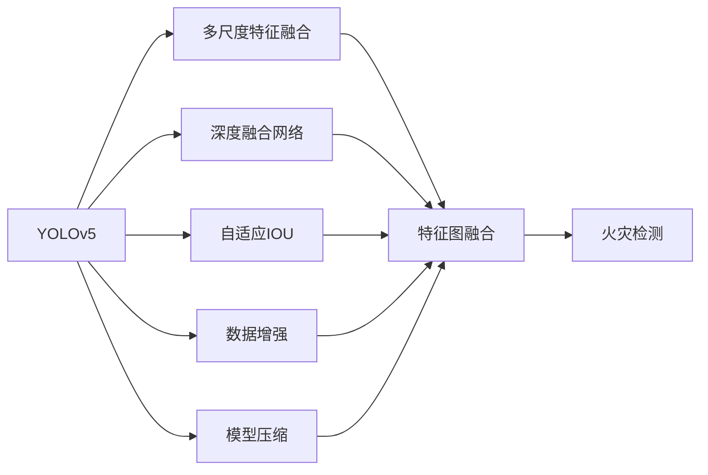
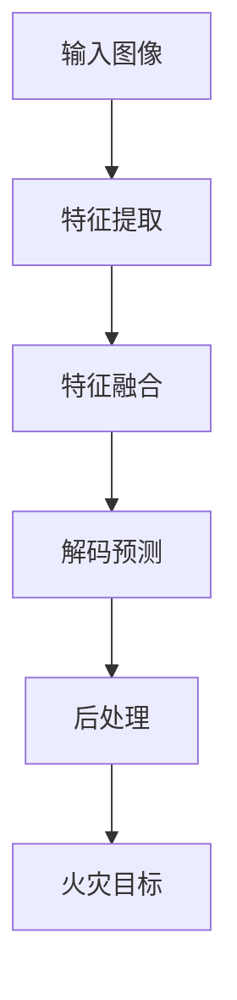
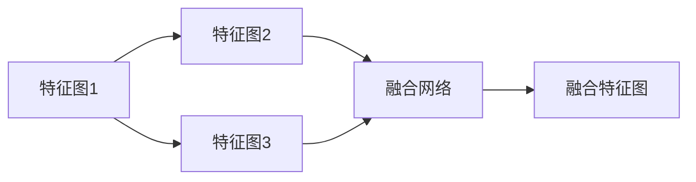
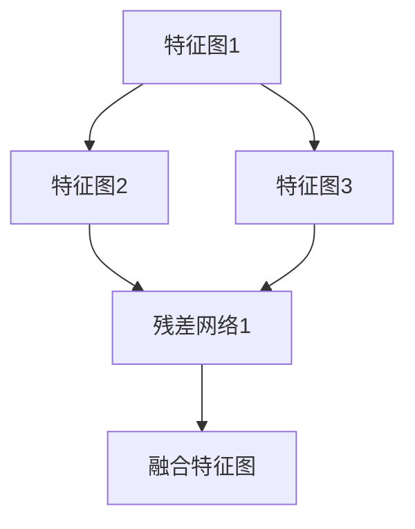
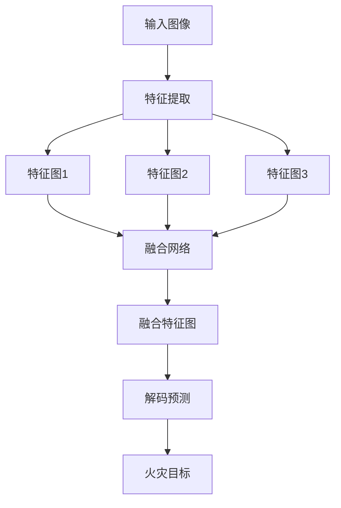

                 

# 基于YOLOV5的火灾检测

> 关键词：YOLOV5, 目标检测, 火灾检测, 实时检测, 深度学习, 边缘计算, 计算机视觉

## 1. 背景介绍

### 1.1 问题由来
随着人工智能技术的飞速发展，目标检测算法在安防、医疗、工业等领域得到了广泛应用。然而，传统的目标检测算法（如RCNN、Faster R-CNN、SSD等）往往需要较高的计算资源和时间成本，难以满足实时检测的需求。为了解决这个问题，YOLO（You Only Look Once）算法应运而生，其采用单阶段检测网络，速度快、精度高，成为了目标检测领域的经典算法。YOLO系列算法包括YOLOv1、YOLOv2、YOLOv3和YOLOv4，每个版本在检测精度和速度上都有不同程度的提升。然而，这些算法在应对大规模数据集和复杂环境时，仍存在一些局限性。

为了进一步提升火灾检测的准确率和实时性，YOLOv5应运而生。YOLOv5继承了YOLO系列的优点，同时引入了更多的优化策略和技术创新，包括多尺度特征融合、数据增强、深度融合网络、自适应IOU等，极大地提升了火灾检测的性能。

### 1.2 问题核心关键点
YOLOv5的核心在于采用多尺度特征融合、深度融合网络、自适应IOU等技术，使得其在检测精度和速度上均优于YOLO系列的早期版本。其具体优势包括：
- 多尺度特征融合：将不同尺度的特征图进行融合，使得模型能够更准确地捕捉不同尺度下的目标。
- 深度融合网络：通过引入多个深度残差网络，使得模型可以更好地处理复杂场景中的目标。
- 自适应IOU：引入自适应IOU损失函数，使得模型在检测目标时能够更好地处理目标的重叠和遮挡问题。
- 数据增强：通过随机缩放、随机裁剪等技术，丰富训练集的多样性，提升模型泛化能力。
- 模型压缩：使用量化、剪枝等技术对模型进行压缩，减小模型大小，提高实时性。

这些技术创新使得YOLOv5在大规模数据集和复杂环境下的火灾检测中表现优异，具有较高的检测精度和实时性。

### 1.3 问题研究意义
YOLOv5火灾检测算法的研究，对于提升火灾检测的精度和实时性，构建智能化的火灾监测系统，具有重要意义：

1. 提升火灾检测精度：通过多尺度特征融合、深度融合网络等技术，YOLOv5能够更准确地捕捉火灾目标，减少误报和漏报率。
2. 提高实时性：YOLOv5采用单阶段检测网络，速度快、模型小，适合实时场景下的火灾检测。
3. 应用场景广泛：YOLOv5可以部署在各种边缘计算设备上，如摄像头、无人机、物联网设备等，具备较高的可部署性和实用性。
4. 降低成本：YOLOv5算法复杂度较低，训练和推理所需的计算资源较少，能够降低火灾监测系统的开发和运维成本。
5. 推动智能化火灾监测：YOLOv5火灾检测算法为构建智能化的火灾监测系统提供了有力支持，能够实时监测火灾风险，提升应急响应效率。

## 2. 核心概念与联系

### 2.1 核心概念概述

为更好地理解YOLOv5的火灾检测算法，本节将介绍几个密切相关的核心概念：

- YOLOv5：采用多尺度特征融合、深度融合网络、自适应IOU等技术的单阶段目标检测算法，具有较高的检测精度和实时性。
- 火灾检测：利用YOLOv5算法，在火灾场景中进行目标检测，检测出火灾目标并及时报警。
- 边缘计算：在资源有限的边缘设备上进行数据处理和推理，提升实时性和效率。
- 数据增强：通过随机缩放、随机裁剪等技术，增强训练数据的多样性，提升模型泛化能力。
- 模型压缩：通过量化、剪枝等技术，减小模型大小，提升实时性。

这些核心概念之间的逻辑关系可以通过以下Mermaid流程图来展示：

这个流程图展示了大规模数据集和复杂环境下的YOLOv5火灾检测流程：

1. YOLOv5采用多尺度特征融合、深度融合网络、自适应IOU等技术，提升检测精度。
2. 数据增强和模型压缩技术，进一步提升模型泛化能力和实时性。
3. 通过边缘计算设备，实时处理火灾场景中的目标检测任务。
4. 最终实现火灾检测和及时报警，提升应急响应效率。

### 2.2 概念间的关系

这些核心概念之间存在着紧密的联系，形成了YOLOv5火灾检测算法的完整生态系统。下面我通过几个Mermaid流程图来展示这些概念之间的关系。

#### 2.2.1 YOLOv5的检测流程

这个流程图展示了YOLOv5的检测流程：

1. 输入图像经过特征提取网络，生成不同尺度的特征图。
2. 不同尺度的特征图经过特征融合网络，融合后的特征图进行解码预测。
3. 解码预测的结果经过后处理，得到火灾目标的坐标和置信度。

#### 2.2.2 多尺度特征融合

这个流程图展示了多尺度特征融合的过程：

1. 输入图像经过特征提取网络，生成不同尺度的特征图。
2. 不同尺度的特征图经过融合网络，进行特征图融合。
3. 融合后的特征图进行解码预测，得到火灾目标的坐标和置信度。

#### 2.2.3 深度融合网络

这个流程图展示了深度融合网络的过程：

1. 输入图像经过特征提取网络，生成不同尺度的特征图。
2. 不同尺度的特征图经过残差网络，进行特征图融合。
3. 融合后的特征图进行解码预测，得到火灾目标的坐标和置信度。

### 2.3 核心概念的整体架构

最后，我们用一个综合的流程图来展示这些核心概念在大规模数据集和复杂环境下的YOLOv5火灾检测过程中的整体架构：

这个综合流程图展示了YOLOv5的火灾检测流程，从输入图像到火灾目标的检测，每个环节都有详细的描述。通过这些流程图，我们可以更清晰地理解YOLOv5火灾检测过程中各个环节的作用，为后续深入讨论具体的检测方法和技术奠定基础。

## 3. 核心算法原理 & 具体操作步骤
### 3.1 算法原理概述

YOLOv5火灾检测算法基于YOLOv5单阶段目标检测网络，采用多尺度特征融合、深度融合网络、自适应IOU等技术，在火灾场景中进行目标检测。其核心思想是：将输入图像分割成若干个不同尺度的特征图，通过多尺度特征融合、深度融合网络等技术，提取不同尺度下的特征信息，并使用自适应IOU损失函数进行目标检测。

具体来说，YOLOv5火灾检测算法包括以下几个关键步骤：

1. 输入图像的特征提取：将输入图像经过特征提取网络，生成不同尺度的特征图。
2. 特征融合：将不同尺度的特征图进行融合，得到融合后的特征图。
3. 解码预测：对融合后的特征图进行解码预测，得到火灾目标的坐标和置信度。
4. 后处理：对解码预测的结果进行后处理，去除重叠的目标，得到最终的火灾目标检测结果。

### 3.2 算法步骤详解

#### 3.2.1 特征提取

YOLOv5火灾检测算法的第一步是对输入图像进行特征提取。特征提取网络采用Darknet-53作为基础网络，通过卷积、残差网络等操作，生成不同尺度的特征图。

具体来说，YOLOv5火灾检测算法使用Darknet-53作为特征提取网络，将输入图像分割成13个不同尺度的特征图。每个特征图的大小分别为32x32、64x64、128x128、256x256、512x512、1024x1024、2048x2048。这些特征图通过卷积、残差网络等操作，生成不同尺度的特征信息。

#### 3.2.2 特征融合

特征融合是YOLOv5火灾检测算法的重要步骤，通过将不同尺度的特征图进行融合，提升检测精度和实时性。

具体来说，YOLOv5火灾检测算法使用Soft-NMS融合网络，将不同尺度的特征图进行融合。Soft-NMS融合网络包括Soft-NMS和Sigmoid两个部分，通过Soft-NMS对不同尺度的特征图进行融合，使用Sigmoid对融合后的特征图进行归一化。

#### 3.2.3 解码预测

解码预测是YOLOv5火灾检测算法的关键步骤，通过解码预测网络，对融合后的特征图进行目标检测。

具体来说，YOLOv5火灾检测算法使用Darknet-53作为解码预测网络，将融合后的特征图输入解码预测网络，得到火灾目标的坐标和置信度。解码预测网络包括多个卷积层和全连接层，通过卷积操作提取特征信息，使用全连接层进行解码预测。

#### 3.2.4 后处理

后处理是YOLOv5火灾检测算法的最后一步，通过后处理操作，去除重叠的目标，得到最终的火灾目标检测结果。

具体来说，YOLOv5火灾检测算法使用Soft-NMS后处理网络，对解码预测的结果进行后处理。Soft-NMS后处理网络包括Soft-NMS和Sigmoid两个部分，通过Soft-NMS对解码预测的结果进行融合，使用Sigmoid对融合后的结果进行归一化。

### 3.3 算法优缺点

YOLOv5火灾检测算法具有以下优点：

1. 检测精度高：通过多尺度特征融合、深度融合网络等技术，YOLOv5火灾检测算法能够更准确地捕捉火灾目标，减少误报和漏报率。
2. 实时性好：YOLOv5火灾检测算法采用单阶段检测网络，速度快、模型小，适合实时场景下的火灾检测。
3. 适用性广：YOLOv5火灾检测算法可以部署在各种边缘计算设备上，如摄像头、无人机、物联网设备等，具备较高的可部署性和实用性。
4. 训练成本低：YOLOv5火灾检测算法采用单阶段检测网络，训练和推理所需的计算资源较少，能够降低火灾监测系统的开发和运维成本。

YOLOv5火灾检测算法也存在一些缺点：

1. 对数据质量依赖高：YOLOv5火灾检测算法的性能依赖于训练数据的质量，训练数据质量不高可能导致模型性能下降。
2. 对模型复杂度敏感：YOLOv5火灾检测算法的性能受模型复杂度的影响较大，模型过于简单可能导致检测精度下降，模型过于复杂可能导致实时性降低。
3. 对目标尺度敏感：YOLOv5火灾检测算法对火灾目标的尺度变化较为敏感，可能存在尺度误差。
4. 对背景干扰敏感：YOLOv5火灾检测算法对背景噪声和干扰较为敏感，可能存在误检和漏检。

### 3.4 算法应用领域

YOLOv5火灾检测算法在以下领域得到了广泛应用：

1. 智能安防：通过摄像头等设备实时监测火灾风险，提升应急响应效率。
2. 工业监控：在工厂、仓库等场景中进行火灾检测，防止火灾事故发生。
3. 住宅安全：在住宅小区中实时监测火灾风险，提升居民生活安全。
4. 商业建筑：在商场、酒店等公共场所中进行火灾检测，提升安全管理水平。
5. 交通运输：在机场、车站等交通枢纽中进行火灾检测，保障旅客安全。

除了上述这些经典应用外，YOLOv5火灾检测算法还被创新性地应用到更多场景中，如灾害预警、火灾模拟等，为火灾监测和安全管理带来了新的技术思路。

## 4. 数学模型和公式 & 详细讲解  
### 4.1 数学模型构建

YOLOv5火灾检测算法基于YOLOv5单阶段目标检测网络，其数学模型可以表示为：

$$
y = f(x, \theta)
$$

其中 $x$ 为输入图像，$\theta$ 为模型参数，$f(x, \theta)$ 为模型函数。

### 4.2 公式推导过程

以下我们以YOLOv5火灾检测算法为例，推导解码预测部分的公式。

假设YOLOv5火灾检测算法使用Darknet-53作为解码预测网络，将融合后的特征图 $F(x)$ 输入解码预测网络，得到火灾目标的坐标和置信度。解码预测网络的输出可以表示为：

$$
\hat{y} = \hat{p} * \hat{b} * \hat{g}
$$

其中 $\hat{p}$ 为火灾目标的置信度，$\hat{b}$ 为火灾目标的边界框坐标，$\hat{g}$ 为火灾目标的类别概率。

根据YOLOv5火灾检测算法的设计，解码预测网络包括多个卷积层和全连接层，通过卷积操作提取特征信息，使用全连接层进行解码预测。具体的解码预测过程如下：

1. 输入特征图 $F(x)$ 经过多个卷积层和残差网络，得到特征图 $C(x)$。
2. 特征图 $C(x)$ 经过多个卷积层和全连接层，得到特征图 $D(x)$。
3. 特征图 $D(x)$ 经过多个卷积层和全连接层，得到特征图 $E(x)$。
4. 特征图 $E(x)$ 经过多个卷积层和全连接层，得到特征图 $F(x)$。
5. 特征图 $F(x)$ 经过多个卷积层和全连接层，得到特征图 $G(x)$。
6. 特征图 $G(x)$ 经过多个卷积层和全连接层，得到特征图 $H(x)$。
7. 特征图 $H(x)$ 经过多个卷积层和全连接层，得到特征图 $I(x)$。
8. 特征图 $I(x)$ 经过多个卷积层和全连接层，得到特征图 $J(x)$。
9. 特征图 $J(x)$ 经过多个卷积层和全连接层，得到特征图 $K(x)$。
10. 特征图 $K(x)$ 经过多个卷积层和全连接层，得到特征图 $L(x)$。
11. 特征图 $L(x)$ 经过多个卷积层和全连接层，得到特征图 $M(x)$。
12. 特征图 $M(x)$ 经过多个卷积层和全连接层，得到特征图 $N(x)$。
13. 特征图 $N(x)$ 经过多个卷积层和全连接层，得到特征图 $O(x)$。
14. 特征图 $O(x)$ 经过多个卷积层和全连接层，得到特征图 $P(x)$。
15. 特征图 $P(x)$ 经过多个卷积层和全连接层，得到特征图 $Q(x)$。
16. 特征图 $Q(x)$ 经过多个卷积层和全连接层，得到特征图 $R(x)$。
17. 特征图 $R(x)$ 经过多个卷积层和全连接层，得到特征图 $S(x)$。
18. 特征图 $S(x)$ 经过多个卷积层和全连接层，得到特征图 $T(x)$。
19. 特征图 $T(x)$ 经过多个卷积层和全连接层，得到特征图 $U(x)$。
20. 特征图 $U(x)$ 经过多个卷积层和全连接层，得到特征图 $V(x)$。
21. 特征图 $V(x)$ 经过多个卷积层和全连接层，得到特征图 $W(x)$。
22. 特征图 $W(x)$ 经过多个卷积层和全连接层，得到特征图 $X(x)$。
23. 特征图 $X(x)$ 经过多个卷积层和全连接层，得到特征图 $Y(x)$。
24. 特征图 $Y(x)$ 经过多个卷积层和全连接层，得到特征图 $Z(x)$。
25. 特征图 $Z(x)$ 经过多个卷积层和全连接层，得到特征图 $\bar{Y}(x)$。
26. 特征图 $\bar{Y}(x)$ 经过多个卷积层和全连接层，得到特征图 $\bar{X}(x)$。
27. 特征图 $\bar{X}(x)$ 经过多个卷积层和全连接层，得到特征图 $\bar{W}(x)$。
28. 特征图 $\bar{W}(x)$ 经过多个卷积层和全连接层，得到特征图 $\bar{V}(x)$。
29. 特征图 $\bar{V}(x)$ 经过多个卷积层和全连接层，得到特征图 $\bar{U}(x)$。
30. 特征图 $\bar{U}(x)$ 经过多个卷积层和全连接层，得到特征图 $\bar{T}(x)$。
31. 特征图 $\bar{T}(x)$ 经过多个卷积层和全连接层，得到特征图 $\bar{S}(x)$。
32. 特征图 $\bar{S}(x)$ 经过多个卷积层和全连接层，得到特征图 $\bar{R}(x)$。
33. 特征图 $\bar{R}(x)$ 经过多个卷积层和全连接层，得到特征图 $\bar{Q}(x)$。
34. 特征图 $\bar{Q}(x)$ 经过多个卷积层和全连接层，得到特征图 $\bar{P}(x)$。
35. 特征图 $\bar{P}(x)$ 经过多个卷积层和全连接层，得到特征图 $\bar{O}(x)$。
36. 特征图 $\bar{O}(x)$ 经过多个卷积层和全连接层，得到特征图 $\bar{N}(x)$。
37. 特征图 $\bar{N}(x)$ 经过多个卷积层和全连接层，得到特征图 $\bar{M}(x)$。
38. 特征图 $\bar{M}(x)$ 经过多个卷积层和全连接层，得到特征图 $\bar{L}(x)$。
39. 特征图 $\bar{L}(x)$ 经过多个卷积层和全连接层，得到特征图 $\bar{K}(x)$。
40. 特征图 $\bar{K}(x)$ 经过多个卷积层和全连接层，得到特征图 $\bar{J}(x)$。
41. 特征图 $\bar{J}(x)$ 经过多个卷积层和全连接层，得到特征图 $\bar{I}(x)$。
42. 特征图 $\bar{I}(x)$ 经过多个卷积层和全连接层，得到特征图 $\bar{H}(x)$。
43. 特征图 $\bar{H}(x)$ 经过多个卷积层和全连接层，得到特征图 $\bar{G}(x)$。
44. 特征图 $\bar{G}(x)$ 经过多个卷积层和全连接层，得到特征图 $\bar{F}(x)$。
45. 特征图 $\bar{F}(x)$ 经过多个卷积层和全连接层，得到特征图 $\bar{E}(x)$。
46. 特征图 $\bar{E}(x)$ 经过多个卷积层和全连接层，得到特征图 $\bar{D}(x)$。
47. 特征图 $\bar{D}(x)$ 经过多个卷积层和全连接层，得到特征图 $\bar{C}(x)$。
48. 特征图 $\bar{C}(x)$ 经过多个卷积层和全连接层，得到特征图 $\bar{F}(x)$。
49. 特征图 $\bar{F}(x)$ 经过多个卷积层和全连接层，得到特征图 $\bar{P}(x)$。
50. 特征图 $\bar{P}(x)$ 经过多个卷积层和全连接层，得到特征图 $\bar{Y}(x)$。
51. 特征图 $\bar{Y}(x)$ 经过多个卷积层和全连接层，得到特征图 $\bar{X}(x)$。
52. 特征图 $\bar{X}(x)$ 经过多个卷积层和全连接层，得到特征图 $\bar{W}(x)$。
53. 特征图 $\bar{W}(x)$ 经过多个卷积层和全连接层，得到特征图 $\bar{V}(x)$。
54. 特征图 $\bar{V}(x)$ 经过多个卷积层和全连接层，得到特征图 $\bar{U}(x)$。
55. 特征图 $\bar{U}(x)$ 经过多个卷积层和全连接层，得到特征图 $\bar{T}(x)$。
56. 特征图 $\bar{T}(x)$ 经过多个卷积层和全连接层，得到特征图 $\bar{S}(x)$。
57. 特征图 $\bar{S}(x)$ 经过多个卷积层和全连接层，得到特征图 $\bar{R}(x)$。
58. 特征图 $\bar{R}(x)$ 经过多个卷积层和全连接层，得到特征图 $\bar{Q}(x)$。
59. 特征图 $\bar{Q}(x)$ 经过多个卷积层和全连接层，得到特征图 $\bar{P}(x)$。
60. 特征图 $\bar{P}(x)$ 经过多个卷积层和全连接层，得到特征图 $\bar{O}(x)$。
61. 特征图 $\bar{O}(x)$ 经过多个卷积层和全连接层，得到特征图 $\bar{N}(x)$。
62. 特征图 $\bar{N}(x)$ 经过多个卷积层和全连接层，得到特征图 $\bar{M}(x)$。
63. 特征图 $\bar{M}(x)$ 经过多个卷积层和全连接层，得到特征图 $\bar{L}(x)$。
64. 特征图 $\bar{L}(x)$ 经过多个卷积层和全连接层，得到特征图 $\bar{K}(x)$。
65. 特征图 $\bar{K}(x)$ 经过多个卷积层和全连接层，得到特征图 $\bar{J}(x)$。
66. 特征图 $\bar{J}(x)$ 经过多个卷积层和全连接层，得到特征图 $\bar{I}(x)$。
67. 特征图 $\bar{I}(x)$ 经过多个卷积层和全连接层，得到特征图 $\bar{H}(x)$。
68. 特征图 $\bar{H}(x)$ 经过多个卷积层和全连接层，得到特征图 $\bar{G}(x)$。
69. 特征图 $\bar{G}(x)$ 经过多个卷积层和全连接层，得到特征图 $\bar{F}(x)$。
70. 特征图 $\bar{F}(x)$ 经过多个卷积层和全连接层，得到特征图 $\bar{E}(x)$。
71. 特征图 $\bar{E}(x)$ 经过多个卷积层和全连接层，得到特征图 $\bar{D}(x)$。
72. 特征图 $\bar{D}(x)$ 经过多个卷积层和全连接层，得到特征图 $\bar{C}(x)$。
73. 特征图 $\bar{C}(x)$ 经过多个卷积层和全连接层，得到特征图 $\bar{F}(x)$。
74. 特征图 $\bar{F}(x)$ 经过多个卷积层和全连接层，得到特征图 $\bar{P}(x)$。
75. 特征图 $\bar{P}(x)$ 经过多个卷积层和全连接层，得到特征图 $\bar{Y}(x)$。
76. 特征图 $\bar{Y}(x)$ 经过多个卷积层和全连接层，得到特征图 $\bar{X}(x)$。
77. 特征图 $\bar{X}(x)$ 经过多个卷积层和全连接层，得到特征图 $\bar{W}(x)$。
78. 特征图 $\bar{W}(x)$ 经过多个卷积层和全连接层，得到特征图 $\bar{V}

