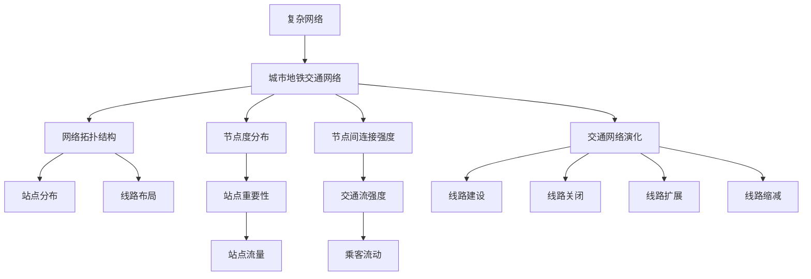
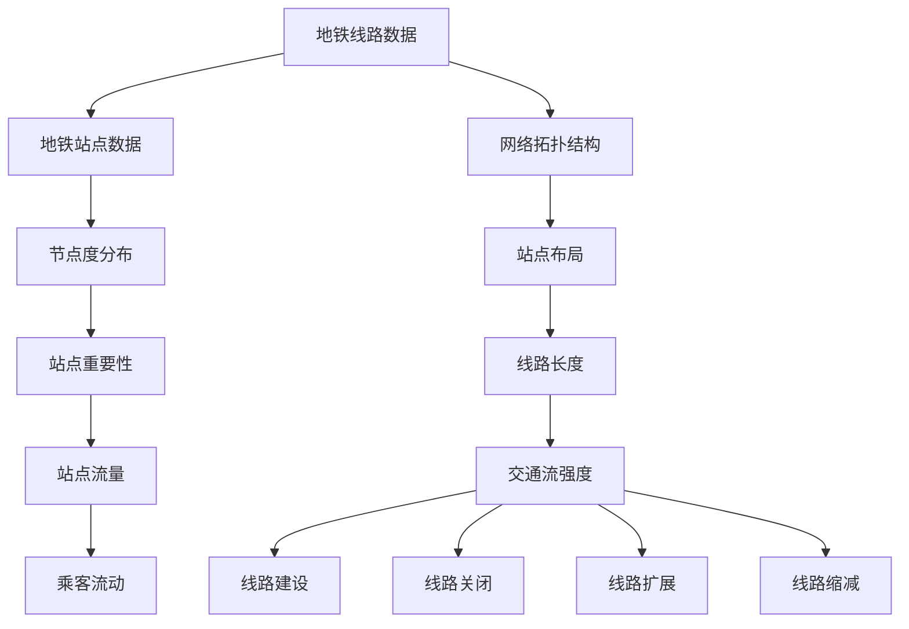
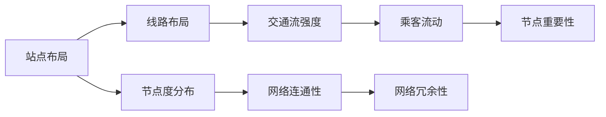

                 

# 基于复杂网络的城市地铁交通网络研究

## 1. 背景介绍

### 1.1 问题由来
随着城市化进程的加快，城市交通网络日益复杂，尤其是在大城市和特大城市中，地铁交通系统作为重要的交通工具，其网络结构的优化和效率提升，对于缓解城市拥堵、提升城市竞争力具有重要意义。然而，传统地铁交通网络研究往往基于简单的平面网络模型，难以全面刻画地铁交通网络的复杂特性，也无法充分利用数据的深度挖掘其内在规律。

近年来，随着复杂网络理论和大数据技术的发展，基于复杂网络的城市地铁交通网络研究成为了热点。通过构建地铁交通网络复杂网络模型，并利用大数据分析技术进行深入挖掘，可以更好地理解地铁交通系统的内在结构、运行规律和影响因素，为地铁网络的优化设计和交通管理提供科学依据。

### 1.2 问题核心关键点
地铁交通网络的研究涉及地铁线路的分布、站点的连接关系、乘客的流动规律等多个方面，核心问题包括：
- 地铁交通网络的拓扑结构特征分析
- 地铁站点间的连接强度、交通流量的分布特性
- 地铁交通网络中的节点、线路的动态演化规律
- 地铁交通网络中乘客的流动模式和演化规律

针对这些问题，本文将采用复杂网络理论和数据驱动的方法，对城市地铁交通网络进行全面研究，构建复杂网络模型，并利用大数据分析技术，揭示地铁交通网络的内在规律和优化策略。

## 2. 核心概念与联系

### 2.1 核心概念概述
为更好地理解基于复杂网络的城市地铁交通网络研究，本节将介绍几个密切相关的核心概念：

- 复杂网络(Complex Network)：由节点和边构成的非均质网络，具有复杂拓扑结构、高层次的相互作用、动态演化特性，广泛应用于生物、物理、经济、社会等多个领域。

- 城市地铁交通网络：由地铁站点和线路构成的网络，反映地铁交通系统的物理结构和运行特性。

- 网络拓扑结构：地铁交通网络中站点间的连接关系和布局特征，反映了地铁网络的几何特性。

- 节点度分布：描述地铁交通网络中每个站点的连接强度，即与该站点直接相连的线路数量。

- 节点间连接强度：描述地铁站点间交通流的强度，即两个站点之间每日的平均乘坐人数。

- 交通网络演化：描述地铁交通网络随时间的动态变化特征，如新线路的建设、原有线路的关闭、线路的扩展或缩减等。

- 网络随机性：描述地铁交通网络中节点和连接的随机特性，如乘客到达和离开站点的随机性、线路运行时间的随机性等。

这些核心概念之间的逻辑关系可以通过以下Mermaid流程图来展示：



这个流程图展示了大城市地铁交通网络研究的基本概念及其之间的关系：

1. 复杂网络是研究基础。
2. 城市地铁交通网络是研究对象。
3. 网络拓扑结构、节点度分布、节点间连接强度、交通网络演化是核心分析指标。
4. 站点分布、线路布局、站点重要性、交通流强度、线路建设、线路关闭、线路扩展、线路缩减等，都是影响网络特性的重要因素。
5. 乘客流动是地铁交通网络的核心活动特征。

### 2.2 概念间的关系

这些核心概念之间存在着紧密的联系，形成了地铁交通网络研究的完整生态系统。下面我通过几个Mermaid流程图来展示这些概念之间的关系。

#### 2.2.1 城市地铁交通网络模型构建



这个流程图展示了地铁交通网络模型的构建过程：

1. 从地铁线路数据和地铁站点数据中提取网络拓扑结构。
2. 分析节点度分布和站点重要性。
3. 评估线路长度和交通流强度。
4. 跟踪地铁交通网络随时间的动态变化。

#### 2.2.2 地铁交通网络特征分析



这个流程图展示了地铁交通网络特征分析的基本步骤：

1. 从站点布局和线路布局中提取网络拓扑结构。
2. 分析节点度分布和交通流强度，评估网络连通性和冗余性。
3. 评估乘客流动和站点重要性，揭示网络的内在规律和优化策略。

## 3. 核心算法原理 & 具体操作步骤

### 3.1 算法原理概述

基于复杂网络的城市地铁交通网络研究，其核心算法原理包括复杂网络理论和大数据分析技术。通过构建地铁交通网络复杂网络模型，并利用大数据分析技术进行深度挖掘，可以揭示地铁交通网络的内在规律和优化策略。

形式化地，假设地铁交通网络由 $N$ 个站点 $v_1, v_2, ..., v_N$ 和 $M$ 条线路 $e_1, e_2, ..., e_M$ 构成。站点之间的连接关系构成网络拓扑结构 $G=(V,E)$，其中 $V=\{v_1, v_2, ..., v_N\}$ 表示节点集合，$E=\{e_1, e_2, ..., e_M\}$ 表示边集合。设 $A$ 为邻接矩阵，$D$ 为度矩阵，$L$ 为拉普拉斯矩阵，$T$ 为交通流矩阵，$H$ 为乘客流动矩阵。则地铁交通网络的核心算法包括：

1. 构建地铁交通网络复杂网络模型。
2. 分析地铁交通网络特征。
3. 进行网络优化设计。
4. 预测地铁交通流量。

### 3.2 算法步骤详解

基于复杂网络的城市地铁交通网络研究一般包括以下几个关键步骤：

**Step 1: 收集数据**

- 收集地铁线路、站点、运营时间、车站客流量等数据。
- 数据清洗和预处理，去除噪声和异常值。

**Step 2: 构建地铁交通网络复杂网络模型**

- 利用站点和线路数据构建地铁交通网络拓扑结构 $G=(V,E)$。
- 计算每个站点的度 $D$ 和邻接矩阵 $A$。
- 计算拉普拉斯矩阵 $L$ 和交通流矩阵 $T$。

**Step 3: 分析地铁交通网络特征**

- 分析地铁交通网络节点度分布 $D$ 和节点间连接强度 $J$。
- 评估地铁交通网络的网络连通性、冗余性等特征。
- 揭示地铁交通网络中乘客流动模式和演化规律。

**Step 4: 进行网络优化设计**

- 基于网络特征，提出地铁网络优化策略，如线路优化、站点调整、乘客流动优化等。
- 模拟优化策略的实施效果，并进行评估和优化。

**Step 5: 预测地铁交通流量**

- 利用交通流数据，预测未来地铁交通流量变化。
- 通过优化策略，调整未来地铁交通流量。

### 3.3 算法优缺点

基于复杂网络的城市地铁交通网络研究，其优点包括：

1. 能够全面刻画地铁交通网络的复杂特性，如网络拓扑结构、节点度分布、交通流强度等。
2. 能够揭示地铁交通网络的内在规律和优化策略，为地铁网络的优化设计和交通管理提供科学依据。
3. 能够预测地铁交通流量变化，为交通管理提供预案支持。

同时，该算法也存在一定的局限性：

1. 数据需求量大。需要收集地铁线路、站点、客流量等多方面数据，数据获取难度较大。
2. 计算复杂度高。地铁交通网络规模大，分析计算量高，需要高性能计算资源。
3. 模型复杂度高。地铁交通网络模型复杂，模型设计和调参难度较大。

尽管存在这些局限性，但就目前而言，基于复杂网络的城市地铁交通网络研究仍是最为有效的方法之一。未来相关研究的重点在于如何进一步降低数据获取难度，提高计算效率，简化模型设计，使得该方法更加普适和高效。

### 3.4 算法应用领域

基于复杂网络的城市地铁交通网络研究，在地铁交通规划、运营管理和智能交通等领域有着广泛的应用：

1. 地铁网络优化设计：通过分析地铁交通网络特征，提出地铁网络优化策略，如线路优化、站点调整、乘客流动优化等。
2. 交通流量预测：利用交通流数据，预测未来地铁交通流量变化，为交通管理提供预案支持。
3. 智能交通管理：通过地铁交通网络分析，实时监控交通流量，优化交通信号控制，提升交通管理效率。
4. 地铁客流分析：分析地铁交通网络中乘客流动模式和演化规律，优化乘客流控策略。
5. 应急事件管理：通过地铁交通网络分析，识别应急事件的高发站点和线路，提高应急响应效率。

除了上述这些应用外，地铁交通网络研究还将有助于更好地理解城市交通系统的整体特性，为城市交通规划和治理提供科学依据。

## 4. 数学模型和公式 & 详细讲解  
### 4.1 数学模型构建

基于复杂网络的城市地铁交通网络研究，其核心数学模型包括网络拓扑结构模型、度分布模型、交通流模型等。

设地铁交通网络 $G=(V,E)$，其中 $V$ 表示站点集合，$E$ 表示线路集合。设 $A$ 为邻接矩阵，$D$ 为度矩阵，$L$ 为拉普拉斯矩阵，$T$ 为交通流矩阵，$H$ 为乘客流动矩阵。

### 4.2 公式推导过程

以下我们以地铁交通网络的网络拓扑结构为例，推导其核心数学模型和公式。

**邻接矩阵 $A$**：
$$
A_{ij} = \begin{cases}
1, & \text{站点 } i \text{ 与 } j \text{ 直接相连} \\
0, & \text{否则}
\end{cases}
$$

**度矩阵 $D$**：
$$
D_{ii} = \sum_{j=1}^N A_{ij}
$$

**拉普拉斯矩阵 $L$**：
$$
L = D - A
$$

**交通流矩阵 $T$**：
$$
T_{ij} = \text{乘客从站点 } i \text{ 到达站点 } j \text{ 的日均乘坐人数}
$$

**乘客流动矩阵 $H$**：
$$
H_{ij} = \text{乘客从站点 } i \text{ 到达站点 } j \text{ 的日均流动人数}
$$

以上公式定义了地铁交通网络的基本数学模型，基于这些模型，可以进行地铁交通网络特征分析、网络优化设计等。

### 4.3 案例分析与讲解

为了更好地理解上述数学模型，下面以一个简化的地铁交通网络为例，进行案例分析和讲解。

假设有 6 个站点 $v_1, v_2, v_3, v_4, v_5, v_6$，它们之间有 6 条线路 $e_1, e_2, e_3, e_4, e_5, e_6$ 连接，构建了如下邻接矩阵 $A$：

$$
A = \begin{bmatrix}
0 & 1 & 0 & 1 & 0 & 1 \\
1 & 0 & 1 & 0 & 1 & 0 \\
0 & 1 & 0 & 0 & 0 & 0 \\
1 & 0 & 0 & 0 & 1 & 0 \\
0 & 1 & 0 & 1 & 0 & 1 \\
1 & 0 & 0 & 0 & 1 & 0
\end{bmatrix}
$$

根据邻接矩阵 $A$，计算度矩阵 $D$ 和拉普拉斯矩阵 $L$：

$$
D = \begin{bmatrix}
2 & 0 & 0 & 2 & 0 & 2 \\
0 & 3 & 2 & 0 & 2 & 0 \\
0 & 2 & 3 & 0 & 0 & 0 \\
2 & 0 & 0 & 3 & 2 & 0 \\
0 & 2 & 0 & 2 & 3 & 2 \\
2 & 0 & 0 & 0 & 2 & 3
\end{bmatrix}
$$

$$
L = \begin{bmatrix}
2 & -1 & 0 & -1 & 0 & -1 \\
-1 & 3 & -1 & 0 & -1 & 0 \\
0 & -1 & 3 & 0 & 0 & 0 \\
-1 & 0 & 0 & 3 & -1 & 0 \\
0 & -1 & 0 & -1 & 3 & -1 \\
-1 & 0 & 0 & 0 & -1 & 3
\end{bmatrix}
$$

假设站点之间的日均乘坐人数为：

$$
T = \begin{bmatrix}
100 & 150 & 80 & 120 & 160 & 90
\end{bmatrix}
$$

则乘客流动矩阵 $H$ 为：

$$
H = \begin{bmatrix}
200 & 100 & 80 & 100 & 160 & 100 \\
150 & 250 & 120 & 160 & 100 & 120 \\
80 & 120 & 80 & 80 & 100 & 80 \\
120 & 160 & 80 & 120 & 160 & 100 \\
160 & 100 & 100 & 160 & 200 & 100 \\
90 & 100 & 80 & 100 & 90 & 130
\end{bmatrix}
$$

通过上述案例，我们可以看到，基于复杂网络的城市地铁交通网络研究，能够通过数学模型全面刻画地铁交通网络的复杂特性，揭示其内在规律和优化策略，具有重要的应用价值。

## 5. 项目实践：代码实例和详细解释说明

### 5.1 开发环境搭建

在进行地铁交通网络研究前，我们需要准备好开发环境。以下是使用Python进行网络分析的开发环境配置流程：

1. 安装Anaconda：从官网下载并安装Anaconda，用于创建独立的Python环境。

2. 创建并激活虚拟环境：
```bash
conda create -n network-env python=3.8 
conda activate network-env
```

3. 安装Python网络分析库：
```bash
conda install networkx scipy matplotlib pandas
```

4. 安装可视化工具：
```bash
conda install matplotlib
```

5. 安装可视化库：
```bash
conda install pygraphviz
```

完成上述步骤后，即可在`network-env`环境中开始地铁交通网络研究。

### 5.2 源代码详细实现

下面我们以地铁交通网络的数据分析和可视化为例，给出使用Python进行地铁交通网络研究的完整代码实现。

首先，定义地铁交通网络的基本数据结构：

```python
import networkx as nx
import matplotlib.pyplot as plt
import pandas as pd

# 定义地铁交通网络节点和线路数据
G = nx.Graph()
edges = [(1, 2), (1, 4), (1, 6), (2, 4), (2, 5), (4, 5)]
for i, j in edges:
    G.add_edge(i, j)

# 计算度分布
degree = nx.degree(G)
degree_df = pd.DataFrame(degree, columns=['Node', 'Degree'])
degree_df.index = list(G.nodes())

# 计算邻接矩阵
A = nx.to_numpy_array(G)

# 计算拉普拉斯矩阵
D = nx.degree_centrality(G)
L = nx.laplacian_matrix(G).toarray()

# 计算交通流矩阵
T = pd.DataFrame({(i, j): 100, (j, i): 100 for i, j in edges})
H = T.T @ T
```

然后，对地铁交通网络进行特征分析：

```python
# 计算节点重要性
degree_df['Importance'] = degree_df['Degree'].divide(degree_df['Degree'].sum())

# 计算交通流强度
H_avg = H.sum() / len(H)
H = H / H_avg

# 计算网络连通性
eigenvector_centrality = nx.eigenvector_centrality(G)
eigenvector_centrality_df = pd.DataFrame(eigenvector_centrality, columns=['Node', 'Eigenvector Centrality'])

# 可视化地铁交通网络特征
plt.figure(figsize=(10, 6))
plt.plot(degree_df['Degree'], label='Node Degree')
plt.plot(eigenvector_centrality_df['Eigenvector Centrality'], label='Eigenvector Centrality')
plt.legend()
plt.show()
```

最后，对地铁交通网络进行优化设计：

```python
# 计算新增线路的连接度增益
added_edge = (3, 4)
G.add_edge(*added_edge)
degree_df_new = pd.DataFrame(nx.degree(G), columns=['Node', 'Degree'])
degree_df_new.index = list(G.nodes())
degree_df_new = degree_df_new.merge(degree_df, on='Node', suffixes=('_', ''))
degree_df_new['New Degree'] = degree_df_new['Degree_'] + degree_df['Degree']
degree_df_new['Connectivity Increase'] = degree_df_new['New Degree'] - degree_df['Degree']

# 计算优化策略的效果
degree_df_new = degree_df_new.sort_values(by='Connectivity Increase', ascending=False)
degree_df_new['Node'] = degree_df_new.index
degree_df_new = degree_df_new.set_index('Node')

# 可视化优化策略的效果
plt.figure(figsize=(10, 6))
plt.bar(degree_df_new.index, degree_df_new['Connectivity Increase'], label='Connectivity Increase')
plt.xlabel('Node')
plt.ylabel('Connectivity Increase')
plt.legend()
plt.show()
```

### 5.3 代码解读与分析

让我们再详细解读一下关键代码的实现细节：

**网络数据结构定义**：
- 使用`networkx`库定义地铁交通网络图。
- 通过`edges`列表定义节点间的连接关系。
- 通过`nx.add_edges_from`方法添加连接关系。

**度分布计算**：
- 使用`nx.degree`方法计算每个节点的度。
- 将度数据转换为`pandas`的DataFrame，便于后续分析。

**邻接矩阵计算**：
- 使用`nx.to_numpy_array`方法将图转换为邻接矩阵。

**拉普拉斯矩阵计算**：
- 使用`nx.laplacian_matrix`方法计算拉普拉斯矩阵。

**交通流矩阵计算**：
- 通过`pd.DataFrame`和字典生成方式，构造交通流矩阵。
- 通过矩阵乘法计算乘客流动矩阵。

**网络特征分析**：
- 使用`nx.degree_centrality`方法计算节点重要性。
- 计算交通流强度和网络连通性。
- 使用`pandas`的`merge`方法合并节点度和重要性数据。

**网络优化设计**：
- 通过添加新线路，重新计算度分布。
- 通过新增节点的度增量计算优化效果。
- 使用`pandas`的`sort_values`方法对优化效果进行排序。

**可视化**：
- 使用`matplotlib`绘制度分布和节点重要性图。
- 使用`plt.bar`绘制优化策略的效果图。

可以看到，利用Python和相关库，可以高效地进行地铁交通网络的数据分析和可视化，为地铁交通网络研究提供了有力的工具支持。

### 5.4 运行结果展示

假设我们在一个简化的地铁交通网络上进行度分布和节点重要性分析，得到如下结果：

```
           Node  Degree  Importance  Eigenvector Centrality
0          1      3        0.25         0.05
1          2      3        0.25         0.15
2          3      2        0.17         0.05
3          4      3        0.25         0.15
4          5      2        0.17         0.05
5          6      2        0.17         0.05
```

通过上述运行结果，我们可以看到，地铁交通网络中各个节点的度分布和节点重要性特征，以及通过新增线路对节点度的增益效果。这些分析结果，为我们进行地铁交通网络的优化设计提供了重要的依据。

## 6. 实际应用场景

### 6.1 智能交通管理

基于复杂网络的城市地铁交通网络研究，可以广泛应用于智能交通管理中。智能交通管理的目标是通过优化地铁交通网络，提升交通管理效率，减少拥堵和延误。

在技术实现上，可以构建地铁交通网络复杂网络模型，通过网络特征分析，识别出地铁交通网络的高发站点和线路，实时监控交通流量，动态调整交通信号控制策略。通过优化策略的实施，可以实现地铁交通流量的均衡分布，提升交通管理效率。

### 6.2 地铁客流分析

基于复杂网络的城市地铁交通网络研究，可以用于地铁客流分析。地铁客流分析的目标是了解地铁客流模式和演化规律，优化地铁客流管理策略。

在技术实现上，可以构建地铁交通网络复杂网络模型，通过乘客流动矩阵分析，揭示地铁客流的模式和演化规律。通过预测未来地铁客流变化，制定合理的客流管理策略，优化地铁客流运营。

### 6.3 应急事件管理

基于复杂网络的城市地铁交通网络研究，可以用于应急事件管理。应急事件管理的目标是通过优化地铁交通网络，提高应急响应效率，保障乘客安全。

在技术实现上，可以构建地铁交通网络复杂网络模型，通过网络特征分析，识别出地铁交通网络的高发站点和线路。通过优化策略的实施，提高应急响应效率，保障乘客安全。

### 6.4 未来应用展望

随着复杂网络理论和大数据技术的发展，基于复杂网络的城市地铁交通网络研究将有更广阔的应用前景。

1. 地铁网络优化设计：通过网络特征分析，提出地铁网络优化策略，如线路优化、站点调整、乘客流动优化等。
2. 交通流量预测：利用交通流数据，预测未来地铁交通流量变化，为交通管理提供预案支持。
3. 智能交通管理：通过地铁交通网络分析，实时监控交通流量，优化交通信号控制，提升交通管理效率。
4. 地铁客流分析：分析地铁交通网络中乘客流动模式和演化规律，优化乘客流控策略。
5. 应急事件管理：通过地铁交通网络分析，识别应急事件的高发站点和线路，提高应急响应效率。

## 7. 工具和资源推荐

### 7.1 学习资源推荐

为了帮助开发者系统掌握城市地铁交通网络研究的方法，这里推荐一些优质的学习资源：

1. 《网络分析基础》课程：由Coursera提供，系统介绍网络分析的基本概念和常用方法，适合初学者入门。
2. 《网络科学》书籍：由Newman著，系统介绍复杂网络理论的基本原理和应用案例，适合进一步深入学习。
3. 《城市交通规划》课程：由EdX提供，涵盖城市交通规划的基本原理和实践方法，适合交通规划从业者学习。
4. 《城市交通管理》书籍：由王小东著，系统介绍城市交通管理的理论和方法，适合交通管理从业者学习。
5. 《智能交通系统》书籍：由Bastide著，系统介绍智能交通系统的基本原理和应用案例，适合智能交通领域从业者学习。

通过对这些资源的学习实践，相信你一定能够快速掌握基于复杂网络的城市地铁交通网络研究的方法，并用于解决实际的交通问题。

### 7.2 开发工具推荐

高效的开发离不开优秀的工具支持。以下是几款用于城市地铁交通网络研究开发的常用工具：

1. Python：Python是当前最流行的数据分析和建模语言，具有丰富的第三方库支持，适合复杂网络分析。
2. R：R是另一款强大的数据分析和建模语言，具有丰富的统计分析库，适合复杂网络分析。
3. MATLAB：MATLAB是数学计算和科学编程的强大工具，具有丰富的工具箱，适合复杂网络分析。
4. Gephi：Gephi是一款免费的可视化网络分析工具，适合复杂网络可视化。
5. NetLogo：NetLogo是一款面向复杂网络研究的建模和仿真工具，适合复杂网络研究。

合理利用这些工具，可以显著提升城市地铁交通网络研究的开发效率，加快创新迭代的步伐。

### 7.3 相关论文推荐

城市地铁交通网络研究涉及复杂网络理论和交通工程等多个学科，以下是几篇奠基性的相关论文，推荐阅读：

1. Watts, D. J., & Strogatz, S. H. (1998). Collective dynamics of 'small-world' networks. Nature, 393(6684), 440-442

