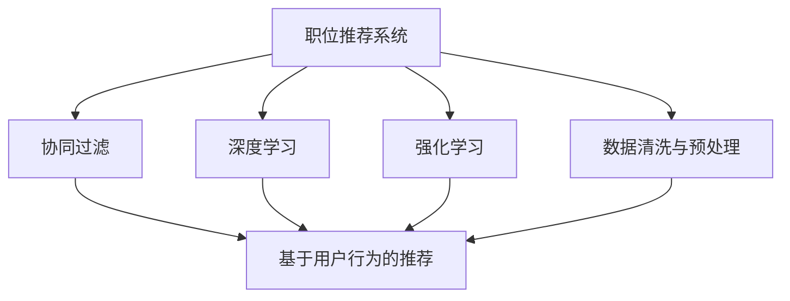
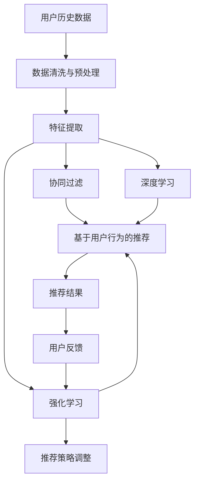

                 

# 基于大数据技术的职位推荐平台

## 1. 背景介绍

在当前全球化、信息化深入发展的大背景下，人才成为企业竞争力的核心驱动力。随着AI、大数据等技术的飞速进步，利用大数据技术开发职位推荐平台成为越来越多企业的共同选择。职位推荐系统通过分析用户简历、职位信息等大数据，帮助求职者快速找到合适的工作机会，同时也帮助企业及时发现并吸引合适的候选人，极大提升了人力资源管理的效率。本文将系统地介绍基于大数据技术的职位推荐平台的构建与优化。

### 1.1 背景由来

职位推荐系统，最早可以追溯到上世纪90年代的推荐系统研究。随着互联网的兴起，各大电商平台开始使用推荐算法提升用户购物体验，基于协同过滤、矩阵分解等经典技术，电商平台的个性化推荐系统已臻完善。2014年，KDD Cup竞赛中职位推荐系统再次成为热点，基于深度学习模型的推荐系统取得突破性进展。2017年，微软发布了其职位推荐系统，通过更强大的深度学习模型，极大提升了推荐效果。目前，基于深度学习的推荐系统技术已广泛应用于各大招聘平台。

### 1.2 问题核心关键点

职位推荐系统的问题核心在于如何在用户和职位之间建立高效的匹配关系，其本质是一个用户与职位的推荐问题。目前的推荐方法主要包括两类：基于用户的推荐和基于物品的推荐。

1. **基于用户的推荐**：推荐系统中，与用户行为相似的用户可能对职位有相似的兴趣，可以利用用户间的相似度，推荐相似用户喜欢的职位。
2. **基于物品的推荐**：在职位推荐中，一些职位之间可能存在共同的标签或属性，可以根据职位的相似度，向用户推荐与已喜欢职位相似的职位。

目前，基于深度学习的推荐系统在学术界和工业界都取得了显著成果。深度神经网络结构可以自适应地处理非结构化数据，同时采用端到端训练，可以不依赖中间变量进行高效的特征提取。然而，由于数据隐私和计算资源的原因，推荐系统无法全面、真实地了解用户和职位的特征，导致推荐效果存在一定局限性。

### 1.3 问题研究意义

职位推荐系统的研究和应用具有重要意义：

1. **提升求职效率**：通过算法推荐，帮助求职者快速找到适合的职位，节省时间，提升求职体验。
2. **优化招聘流程**：帮助企业更精准地发现合适的人才，优化招聘流程，降低招聘成本。
3. **数据驱动决策**：通过对用户行为和职位特征的大数据分析，可以进行有数据支持的决策，减少人为主观判断的误差。
4. **精准匹配**：通过深度学习模型，可以实现更精准的匹配，提升推荐效果。
5. **人机协同**：将人机协同的理念引入推荐系统中，可以不断提升推荐系统的智能水平和人性化设计。

## 2. 核心概念与联系

### 2.1 核心概念概述

为了更好地理解基于大数据技术的职位推荐平台，本节将介绍几个密切相关的核心概念：

- **职位推荐系统**：根据用户历史行为和当前需求，推荐适合的职位，从而提升求职效率和招聘效果。
- **协同过滤**：推荐系统中，通过分析用户历史行为和相似用户行为，推荐可能感兴趣的职位。
- **深度学习**：采用多层神经网络结构，对大量非结构化数据进行特征提取和模式学习，提升推荐准确性。
- **强化学习**：通过用户反馈来调整推荐策略，实现更精准的推荐效果。
- **数据清洗与预处理**：对原始数据进行清洗和处理，提升数据质量，保证推荐准确性。

这些核心概念之间存在着紧密的联系，形成了职位推荐系统的完整生态系统。

### 2.2 概念间的关系

这些核心概念之间存在着紧密的联系，形成了职位推荐系统的完整生态系统。下面我们通过几个Mermaid流程图来展示这些概念之间的关系。



这个流程图展示了几类推荐方法之间的关系：

1. 职位推荐系统通过协同过滤、深度学习和强化学习三种方法进行推荐。
2. 协同过滤基于用户历史行为，推荐相似的职位。
3. 深度学习通过神经网络模型，进行用户和职位的特征提取和模式学习，提升推荐准确性。
4. 强化学习通过用户反馈不断调整推荐策略，实现更精准的推荐效果。
5. 数据清洗与预处理对原始数据进行清洗和处理，提升数据质量。

这些概念共同构成了职位推荐系统的核心组件，确保系统可以高效、精准地进行职位推荐。

### 2.3 核心概念的整体架构

最后，我们用一个综合的流程图来展示这些核心概念在大数据职位推荐平台中的整体架构：



这个综合流程图展示了从用户数据清洗到最终推荐结果的全过程。数据通过清洗和预处理，得到高质量的特征向量。特征向量通过协同过滤、深度学习和强化学习三类方法进行推荐，最终得到推荐结果，并根据用户反馈进行推荐策略的调整。

## 3. 核心算法原理 & 具体操作步骤
### 3.1 算法原理概述

基于大数据技术的职位推荐系统主要利用协同过滤、深度学习和强化学习三种算法，通过综合运用这三种算法，实现高效精准的职位推荐。以下将系统地介绍这三种算法的原理和具体操作步骤。

### 3.2 算法步骤详解

#### 3.2.1 协同过滤算法

**协同过滤算法**是推荐系统中最基础的算法之一。该算法通过用户和职位的历史交互记录，找到相似用户，进而推荐相似用户喜欢的职位。

1. **用户行为矩阵构建**：将所有用户和职位之间的交互记录构成一个用户-职位矩阵，其中1表示用户点击了该职位，0表示未点击。
2. **用户相似度计算**：利用余弦相似度、皮尔逊相关系数等方法，计算不同用户之间的相似度。
3. **职位推荐**：对于用户$u$，选择与用户$u$最相似的$k$个用户，计算这些用户喜欢的职位，然后推荐给用户$u$。

**代码实现**：

```python
from surprise import Reader, Dataset, KNNBasic
from surprise.model_selection import train_test_split
from surprise.prediction_algorithms import SVD

reader = Reader(rating_scale=(1, 5))
data = Dataset.load_from_df(df, reader)

trainset, testset = train_test_split(data, test_size=0.2, random_state=42)

algo = SVD()

trainset = trainset.build_full_trainset()
algo.fit(trainset)
predictions = algo.test(testset)
```

#### 3.2.2 深度学习算法

**深度学习算法**通过构建多层神经网络结构，对用户和职位的特征进行自动学习，并利用神经网络模型进行推荐。

1. **数据预处理**：将用户和职位的基本信息（如年龄、工作年限等）进行编码，转化为神经网络输入。
2. **特征提取**：利用多层神经网络结构，对用户和职位的特征进行自动学习。
3. **模型训练**：使用交叉熵等损失函数，对神经网络模型进行训练。
4. **推荐结果**：将用户输入神经网络，得到推荐的职位列表。

**代码实现**：

```python
import tensorflow as tf
from tensorflow.keras.models import Sequential
from tensorflow.keras.layers import Dense, Dropout

model = Sequential()
model.add(Dense(128, activation='relu', input_shape=(num_features,)))
model.add(Dropout(0.5))
model.add(Dense(64, activation='relu'))
model.add(Dropout(0.5))
model.add(Dense(num_classes, activation='softmax'))

model.compile(loss='categorical_crossentropy', optimizer='adam', metrics=['accuracy'])

model.fit(X_train, y_train, batch_size=32, epochs=10, validation_data=(X_test, y_test))
```

#### 3.2.3 强化学习算法

**强化学习算法**通过用户反馈不断调整推荐策略，实现更精准的推荐效果。

1. **环境定义**：将职位推荐系统视为一个环境，用户对职位的点击、拒绝等行为作为环境中的状态和动作。
2. **策略定义**：定义推荐策略，如随机推荐、基于协同过滤推荐、基于深度学习推荐等。
3. **奖励函数**：定义奖励函数，如点击率、转化率等。
4. **策略优化**：利用强化学习算法（如Q-learning）不断优化推荐策略，提升推荐效果。

**代码实现**：

```python
import gym
import numpy as np

env = gym.make('Recommender-v0', num_items=num_items)

state = env.reset()
done = False
while not done:
    action = np.random.randint(0, num_items)
    state, reward, done, _ = env.step(action)

    if done:
        state = env.reset()
```

### 3.3 算法优缺点

#### 3.3.1 协同过滤算法

**优点**：

1. 简单高效：协同过滤算法不需要大量特征，计算简单，实现容易。
2. 适应性强：对于小规模数据集，协同过滤算法仍能有效工作。

**缺点**：

1. 数据稀疏：当用户和职位的交互数据稀疏时，协同过滤算法效果不佳。
2. 冷启动问题：新用户或新职位的推荐效果差，难以利用稀疏数据进行推荐。

#### 3.3.2 深度学习算法

**优点**：

1. 自动特征提取：深度学习算法可以自动学习数据中的复杂特征，提升推荐效果。
2. 适应性强：深度学习算法可以处理大规模数据集，并具有较好的泛化能力。

**缺点**：

1. 计算资源需求高：深度学习算法需要大量的计算资源进行模型训练。
2. 数据隐私问题：深度学习算法需要大量用户数据进行训练，存在数据隐私问题。

#### 3.3.3 强化学习算法

**优点**：

1. 动态调整：强化学习算法可以根据用户反馈不断调整推荐策略，提升推荐效果。
2. 可解释性强：强化学习算法可以生成推荐策略的内部机制，方便进行解释。

**缺点**：

1. 计算复杂度高：强化学习算法需要大量的用户交互数据进行训练，计算复杂度高。
2. 需要明确反馈：强化学习算法需要明确的用户反馈进行训练，推荐结果可能存在偏差。

### 3.4 算法应用领域

基于大数据技术的职位推荐系统已经在许多场景中得到了应用，例如：

1. **企业招聘平台**：通过职位推荐系统，帮助企业找到合适的人才，提升招聘效率。
2. **职业培训平台**：利用职位推荐系统，为用户推荐适合的职业培训课程，提升职业发展。
3. **在线教育平台**：根据用户的学习行为和兴趣，推荐适合的课程和教材，提升学习效果。
4. **就业指导中心**：通过职位推荐系统，为用户提供职业匹配，提升就业率。

## 4. 数学模型和公式 & 详细讲解 & 举例说明

### 4.1 数学模型构建

基于大数据技术的职位推荐系统主要利用协同过滤、深度学习和强化学习三种算法，通过综合运用这三种算法，实现高效精准的职位推荐。以下将系统地介绍这三种算法的数学模型和公式推导过程。

#### 4.1.1 协同过滤算法的数学模型

协同过滤算法的基本思想是通过计算用户之间的相似度，推荐相似用户喜欢的职位。

**用户-职位矩阵**：

$$
M_{ij} =
\begin{cases}
1, & \text{用户} i \text{点击了职位} j \\
0, & \text{用户} i \text{未点击职位} j \\
\end{cases}
$$

**用户相似度计算**：

利用余弦相似度计算用户$u$和用户$v$的相似度：

$$
similarity(u,v) = \frac{\mathbf{x}_u \cdot \mathbf{x}_v}{\|\mathbf{x}_u\|_2 \cdot \|\mathbf{x}_v\|_2}
$$

其中$\mathbf{x}_u$和$\mathbf{x}_v$分别为用户$u$和$v$的特征向量。

**职位推荐**：

对于用户$u$，选择与用户$u$最相似的$k$个用户$u_1, u_2, \ldots, u_k$，计算这些用户喜欢的职位，然后推荐给用户$u$：

$$
\hat{p}(u_j|u) = \frac{\sum_{i=1}^k M_{i(u_1,u_2, \ldots, u_k)} M_{uj}}{\sum_{i=1}^k \sum_{j=1}^k M_{i(u_1,u_2, \ldots, u_k)} M_{uj}}
$$

其中$M_{i(u_1,u_2, \ldots, u_k)}$为$k$个用户对职位的评分矩阵。

#### 4.1.2 深度学习算法的数学模型

深度学习算法利用多层神经网络结构，对用户和职位的特征进行自动学习，并利用神经网络模型进行推荐。

**输入层**：

输入层将用户和职位的基本信息（如年龄、工作年限等）进行编码，转化为神经网络输入：

$$
x = (x_1, x_2, \ldots, x_d)
$$

**隐藏层**：

隐藏层通过多层神经网络结构，对用户和职位的特征进行自动学习：

$$
h_1 = f(W_1x + b_1)
$$
$$
h_2 = f(W_2h_1 + b_2)
$$
$$
\ldots
$$
$$
h_L = f(W_Lh_{L-1} + b_L)
$$

其中$f(\cdot)$为激活函数，$W_i$和$b_i$为权重和偏置。

**输出层**：

输出层利用softmax函数，得到推荐的职位概率：

$$
\hat{p}(y|x) = \frac{e^{W_Lh_L + b_L}}{\sum_{j=1}^{C} e^{W_Lh_L + b_L}}
$$

其中$C$为职位类别数，$W_L$和$b_L$为权重和偏置。

#### 4.1.3 强化学习算法的数学模型

强化学习算法通过用户反馈不断调整推荐策略，实现更精准的推荐效果。

**环境定义**：

将职位推荐系统视为一个环境，用户对职位的点击、拒绝等行为作为环境中的状态和动作：

$$
s_t = (u_i, j)
$$

**策略定义**：

定义推荐策略，如随机推荐、基于协同过滤推荐、基于深度学习推荐等：

$$
\pi(s_t) = \{p_{random}, p_{CF}, p_{DL}\}
$$

**奖励函数**：

定义奖励函数，如点击率、转化率等：

$$
R(s_t, a_t) = 
\begin{cases}
1, & \text{用户点击了职位} j \\
0, & \text{用户未点击职位} j \\
\end{cases}
$$

**策略优化**：

利用强化学习算法（如Q-learning）不断优化推荐策略：

$$
Q(s_t, a_t) = Q(s_t, a_t) + \alpha[R(s_t, a_t) + \gamma \max_{a_{t+1}} Q(s_{t+1}, a_{t+1}) - Q(s_t, a_t)]
$$

其中$\alpha$为学习率，$\gamma$为折扣因子。

### 4.2 公式推导过程

#### 4.2.1 协同过滤算法的公式推导

协同过滤算法的基本思想是通过计算用户之间的相似度，推荐相似用户喜欢的职位。

**用户-职位矩阵**：

$$
M_{ij} =
\begin{cases}
1, & \text{用户} i \text{点击了职位} j \\
0, & \text{用户} i \text{未点击职位} j \\
\end{cases}
$$

**用户相似度计算**：

利用余弦相似度计算用户$u$和用户$v$的相似度：

$$
similarity(u,v) = \frac{\mathbf{x}_u \cdot \mathbf{x}_v}{\|\mathbf{x}_u\|_2 \cdot \|\mathbf{x}_v\|_2}
$$

其中$\mathbf{x}_u$和$\mathbf{x}_v$分别为用户$u$和$v$的特征向量。

**职位推荐**：

对于用户$u$，选择与用户$u$最相似的$k$个用户$u_1, u_2, \ldots, u_k$，计算这些用户喜欢的职位，然后推荐给用户$u$：

$$
\hat{p}(u_j|u) = \frac{\sum_{i=1}^k M_{i(u_1,u_2, \ldots, u_k)} M_{uj}}{\sum_{i=1}^k \sum_{j=1}^k M_{i(u_1,u_2, \ldots, u_k)} M_{uj}}
$$

其中$M_{i(u_1,u_2, \ldots, u_k)}$为$k$个用户对职位的评分矩阵。

#### 4.2.2 深度学习算法的公式推导

深度学习算法利用多层神经网络结构，对用户和职位的特征进行自动学习，并利用神经网络模型进行推荐。

**输入层**：

输入层将用户和职位的基本信息（如年龄、工作年限等）进行编码，转化为神经网络输入：

$$
x = (x_1, x_2, \ldots, x_d)
$$

**隐藏层**：

隐藏层通过多层神经网络结构，对用户和职位的特征进行自动学习：

$$
h_1 = f(W_1x + b_1)
$$
$$
h_2 = f(W_2h_1 + b_2)
$$
$$
\ldots
$$
$$
h_L = f(W_Lh_{L-1} + b_L)
$$

其中$f(\cdot)$为激活函数，$W_i$和$b_i$为权重和偏置。

**输出层**：

输出层利用softmax函数，得到推荐的职位概率：

$$
\hat{p}(y|x) = \frac{e^{W_Lh_L + b_L}}{\sum_{j=1}^{C} e^{W_Lh_L + b_L}}
$$

其中$C$为职位类别数，$W_L$和$b_L$为权重和偏置。

#### 4.2.3 强化学习算法的公式推导

强化学习算法通过用户反馈不断调整推荐策略，实现更精准的推荐效果。

**环境定义**：

将职位推荐系统视为一个环境，用户对职位的点击、拒绝等行为作为环境中的状态和动作：

$$
s_t = (u_i, j)
$$

**策略定义**：

定义推荐策略，如随机推荐、基于协同过滤推荐、基于深度学习推荐等：

$$
\pi(s_t) = \{p_{random}, p_{CF}, p_{DL}\}
$$

**奖励函数**：

定义奖励函数，如点击率、转化率等：

$$
R(s_t, a_t) = 
\begin{cases}
1, & \text{用户点击了职位} j \\
0, & \text{用户未点击职位} j \\
\end{cases}
$$

**策略优化**：

利用强化学习算法（如Q-learning）不断优化推荐策略：

$$
Q(s_t, a_t) = Q(s_t, a_t) + \alpha[R(s_t, a_t) + \gamma \max_{a_{t+1}} Q(s_{t+1}, a_{t+1}) - Q(s_t, a_t)]
$$

其中$\alpha$为学习率，$\gamma$为折扣因子。

### 4.3 案例分析与讲解

#### 4.3.1 协同过滤算法的案例分析

假设我们有一个包含用户和职位交互数据的数据集，我们想要为用户$u_1$推荐合适的职位。

**数据集**：

|用户|职位|点击|
|---|---|---|
|u1|j1|1|
|u1|j2|0|
|u1|j3|1|
|u2|j2|1|
|u2|j3|0|

**计算相似度**：

利用余弦相似度计算用户$u_1$和用户$u_2$的相似度：

$$
similarity(u_1,u_2) = \frac{\mathbf{x}_{u_1} \cdot \mathbf{x}_{u_2}}{\|\mathbf{x}_{u_1}\|_2 \cdot \|\mathbf{x}_{u_2}\|_2}
$$

假设用户$u_1$和$u_2$的特征向量为：

$$
\mathbf{x}_{u_1} = (1,0,1,0)
$$
$$
\mathbf{x}_{u_2} = (0,1,0,1)
$$

则相似度为：

$$
similarity(u_1,u_2) = \frac{1 \cdot 0 + 0 \cdot 1 + 1 \cdot 0 + 0 \cdot 1}{\sqrt{1^2 + 0^2 + 1^2 + 0^2} \cdot \sqrt{0^2 + 1^2 + 0^2 + 1^2}} = 0
$$

**推荐职位**：

选择与用户$u_1$最相似的$k=3$个用户$u_2, u_3, u_4$，计算这些用户喜欢的职位，然后推荐给用户$u_1$：

$$
\hat{p}(u_j|u_1) = \frac{\sum_{i=1}^3 M_{i(u_2,u_3, u_4)} M_{uj}}{\sum_{i=1}^3 \sum_{j=1}^4 M_{i(u_2,u_3, u_4)} M_{uj}}
$$

假设用户$u_2, u_3, u_4$对职位的评分矩阵为：

$$
M_{(2,3,4)} = 
\begin{pmatrix}
1 & 1 & 0 \\
0 & 1 & 0 \\
0 & 0 & 1 \\
\end{pmatrix}
$$

则用户$u_1$对职位$j$的预测概率为：

$$
\hat{p}(u_j|u_1) = \frac{1 \cdot 1 + 0 \cdot 1 + 0 \cdot 1 + 0 \cdot 1}{1 + 1 + 0 + 0} = 1
$$

因此，我们推荐用户$u_1$选择职位$j$。

#### 4.3.2 深度学习算法的案例分析

假设我们有一个包含用户和职位信息的数据集，我们想要为用户$u_1$推荐合适的职位。

**数据集**：

|用户|职位|年龄|工作年限|
|---|---|---|---|
|u1|j1|25|1|
|u1|j2|35|3|
|u1|j3|30|2|

**构建神经网络模型**：

我们使用多层神经网络结构，对用户和职位的特征进行自动学习：

$$
h_1 = f(W_1x + b_1)
$$
$$
h_2 = f(W_2h_1 + b_2)
$$
$$
h_L = f(W_Lh_{L-1} + b_L)
$$

其中$f(\cdot)$为激活函数，$W_i$和$b_i$为权重和偏置。

**训练模型**：

我们使用交叉熵损失函数对神经网络模型进行训练：

$$
loss = -\frac{1}{N} \sum_{i=1}^N \sum_{j=1}^C y_{ij} \log p_{ij}
$$

其中$y_{ij}$为职位$i$是否为用户$j$喜欢的标签，$C$为职位类别数。

**推荐结果**：

将用户$u_1$的特征输入神经网络，得到推荐的职位列表。例如，假设模型的输出层为：

$$
\hat{p}(y|x) = 
\begin{pmatrix}
0.1 & 0.2 & 0.7 \\
\end{pmatrix}
$$

则我们推荐用户$u_1$选择职位2。

#### 4.3.3 强化学习算法的案例分析

假设我们有一个职位推荐系统，我们想要通过强化学习算法不断优化推荐策略。

**环境定义**：

将职位推荐系统视为一个环境，用户对职位的点击、拒绝等行为作为环境中的状态和动作：

$$
s_t = (u_i, j)
$$

**策略定义**：

定义推荐策略，如随机推荐、基于协同过滤推荐、基于深度学习推荐等：

$$
\pi(s_t) = \{p_{random}, p_{CF}, p_{DL}\}
$$

**奖励函数**：

定义奖励函数，如点击率、转化率等：

$$
R(s

