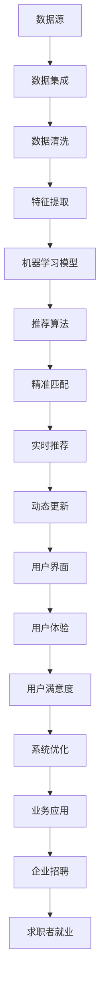

                 

# 基于大数据技术的职位推荐平台

> 关键词：职位推荐系统, 大数据, 人工智能, 机器学习, 推荐算法, 精准匹配, 实时性, 用户满意度

## 1. 背景介绍

### 1.1 问题由来

在当前全球经济下行的环境下，如何高效、精准地匹配求职者和岗位成为了就业市场面临的重要挑战。传统基于简历的职位推荐方式存在诸多缺陷，如效率低下、匹配精度不足、用户体验差等，已无法适应现代社会对人才配置的高效、精准、智能化的需求。通过将大数据技术与人工智能深度融合，构建基于大数据的职位推荐平台，可以为求职者和企业提供更优质的智能招聘服务。

### 1.2 问题核心关键点

基于大数据技术的职位推荐系统，主要解决以下几个关键问题：

1. **大数据集成与处理**：
   - 需要高效地集成、清洗、处理海量求职者与岗位数据，保证数据的质量和完整性。

2. **机器学习模型训练**：
   - 在处理后的数据上，训练高效、准确的推荐算法模型，预测求职者与岗位的匹配度。

3. **智能推荐算法优化**：
   - 优化算法模型，提高推荐结果的精准度和用户满意度。

4. **实时推荐与动态更新**：
   - 实现实时推荐，并根据用户行为和市场变化动态更新推荐模型。

5. **用户体验优化**：
   - 优化用户界面和交互体验，提升用户对职位推荐系统的使用效率和满意度。

### 1.3 问题研究意义

基于大数据技术的职位推荐系统的构建，对于优化人才配置、提升就业市场效率具有重要意义：

1. **提高匹配精度**：
   - 通过数据分析和算法优化，实现更高精度的职位推荐，减少求职者和企业的匹配误差。

2. **提升推荐效率**：
   - 实时处理海量数据，快速推荐符合条件的职位，节省求职者和招聘企业的搜索成本。

3. **增强用户体验**：
   - 通过算法和界面优化，提供更直观、便捷的求职体验，提高用户粘性和满意度。

4. **驱动企业招聘**：
   - 为企业提供更加精准的候选人推荐，加速招聘流程，提升企业招聘效果。

5. **促进就业市场**：
   - 通过大数据分析和智能推荐，最大化匹配率，优化就业市场结构，推动就业率的提升。

## 2. 核心概念与联系

### 2.1 核心概念概述

为更好地理解基于大数据的职位推荐系统，本节将介绍几个关键概念：

- **大数据技术**：指处理海量数据的技术体系，包括数据存储、数据清洗、数据分析、数据可视化等。
- **职位推荐系统**：指利用数据和算法，为求职者推荐合适岗位的系统。
- **人工智能**：通过模拟人脑的推理和决策机制，使机器具备智能行为的学科。
- **机器学习**：通过训练算法模型，使其具备从数据中学习规律的能力。
- **推荐算法**：根据用户的历史行为和偏好，推荐可能感兴趣的职位。
- **精准匹配**：通过算法实现求职者和岗位之间的高度匹配。
- **实时性**：指系统能够即时响应，并根据用户行为实时调整推荐结果。
- **用户满意度**：指用户对推荐结果的满意程度，包括准确性、相关性和即时性等。

这些核心概念之间的逻辑关系可以通过以下Mermaid流程图来展示：


这个流程图展示了大数据技术与职位推荐系统之间的关系：

1. 大数据技术为职位推荐系统提供了数据基础。
2. 人工智能和大数据技术融合，推动了推荐算法的发展。
3. 推荐算法是实现精准匹配的核心手段。
4. 实时性是提高用户满意度的关键因素。
5. 用户满意度是评价系统效果的最终指标。

### 2.2 概念间的关系

这些核心概念之间存在着紧密的联系，形成了职位推荐系统的完整生态系统。下面我们通过几个Mermaid流程图来展示这些概念之间的关系。

#### 2.2.1 职位推荐系统的整体架构


这个流程图展示了职位推荐系统的整体架构：

1. 从数据源获取求职者和岗位数据。
2. 对数据进行集成和清洗，提取有用特征。
3. 在清洗后的数据上训练机器学习模型。
4. 基于模型进行职位推荐。
5. 实现精准匹配和实时推荐。
6. 根据用户行为和市场变化进行动态更新。
7. 提供直观、便捷的用户界面。
8. 提升用户体验，从而提高用户满意度。

### 2.3 核心概念的整体架构

最后，我们用一个综合的流程图来展示这些核心概念在大数据职位推荐系统中的整体架构：



这个综合流程图展示了从数据源到最终应用的职位推荐系统的完整过程。大数据技术在其中起到了数据基础和支撑作用，而人工智能、机器学习和推荐算法则是实现推荐的核心技术。精准匹配和实时性是系统成功的重要保证，用户体验和用户满意度则是衡量系统效果的最终标准。系统优化与业务应用则进一步推动了平台的不断迭代和升级。

## 3. 核心算法原理 & 具体操作步骤
### 3.1 算法原理概述

基于大数据技术的职位推荐系统的核心算法主要基于机器学习模型和推荐算法。其核心思想是通过分析求职者与岗位的历史数据，学习两者之间的关联关系，从而预测求职者与岗位的匹配度。

具体而言，假设有一个求职者集合 $S$ 和一个岗位集合 $J$，每个求职者和岗位都有一些属性特征，例如：

- 求职者的属性特征：$x_i=(x_{i1}, x_{i2}, \dots, x_{in})$，其中 $x_{ij}$ 表示求职者第 $j$ 个属性特征。
- 岗位的属性特征：$y_i=(y_{i1}, y_{i2}, \dots, y_{im})$，其中 $y_{ik}$ 表示岗位第 $k$ 个属性特征。

对于每一个求职者 $x_i$，我们可以构建一个特征向量 $f(x_i)$，同样地，岗位 $y_j$ 的特征向量为 $f(y_j)$。然后，我们将特征向量 $f(x_i)$ 和 $f(y_j)$ 输入到一个机器学习模型 $M$ 中，得到求职者 $x_i$ 对岗位 $y_j$ 的匹配度 $p_{ij}$。这个过程可以用以下公式表示：

$$
p_{ij} = M(f(x_i), f(y_j))
$$

其中，$M$ 可以是一个简单的线性模型，也可以是一个复杂的多层神经网络模型。

### 3.2 算法步骤详解

基于上述原理，职位推荐系统的具体步骤可以分为以下几个步骤：

**Step 1: 数据收集与预处理**

1. 从各个招聘网站和社交平台收集求职者和岗位数据。
2. 对数据进行清洗和去重，去除噪声和不一致数据。
3. 对求职者与岗位的属性进行提取和编码，形成特征向量。

**Step 2: 模型训练与优化**

1. 在清洗后的数据上训练机器学习模型 $M$。
2. 使用交叉验证等技术对模型进行调参和优化。
3. 通过A/B测试等方法评估模型的效果，选择合适的模型。

**Step 3: 推荐算法设计**

1. 根据预测的匹配度 $p_{ij}$ 进行排序，得到推荐列表。
2. 根据推荐算法策略（如协同过滤、内容推荐等）对推荐列表进行排序。
3. 引入反馈机制，实时调整推荐策略。

**Step 4: 实时推荐与动态更新**

1. 实现实时推荐，对用户的搜索请求或行为实时返回推荐结果。
2. 根据用户的交互行为（如点击、停留时间等）进行动态更新，提高推荐效果。
3. 引入缓存机制，优化推荐速度。

**Step 5: 用户体验优化**

1. 设计简洁、直观的用户界面，方便用户输入和查看推荐结果。
2. 使用交互设计技术提升用户体验，如交互动画、一键申请等。
3. 提供多种推荐形式（如列表、卡片、时间轴等），提升用户满意度。

### 3.3 算法优缺点

基于大数据的职位推荐系统有以下优点：

1. **数据驱动**：
   - 利用大数据技术，基于求职者与岗位的全面数据分析，提供更加精准的推荐结果。

2. **实时响应**：
   - 能够实时处理用户查询和反馈，快速更新推荐结果，提高用户体验。

3. **动态调整**：
   - 根据市场变化和用户行为实时调整推荐算法，保证推荐效果。

4. **多种应用场景**：
   - 适用于企业招聘、人才匹配、求职者投递等多样化场景。

5. **扩展性良好**：
   - 能够轻松应对数据量的增长，具有良好的扩展性和可维护性。

然而，该系统也存在以下缺点：

1. **数据隐私**：
   - 需要收集大量求职者与岗位的数据，存在隐私保护风险。

2. **模型复杂度**：
   - 推荐算法模型较为复杂，需要高水平的开发和维护。

3. **初始数据质量**：
   - 模型效果高度依赖于数据质量和特征提取的准确性，数据质量不佳会导致推荐效果差。

4. **数据偏见**：
   - 数据样本可能存在偏见，导致推荐结果不公平。

5. **计算资源消耗**：
   - 处理和训练大规模数据需要较高的计算资源，成本较高。

### 3.4 算法应用领域

基于大数据的职位推荐系统在多个领域都有广泛应用，包括但不限于：

- **企业招聘**：
  - 利用职位推荐系统帮助企业快速筛选合适的候选人，提升招聘效率。
  - 通过推荐系统优化招聘流程，吸引更多优秀人才加入。

- **人才匹配**：
  - 为求职者提供个性化的岗位推荐，加速匹配过程。
  - 提高求职者对岗位的满意度，降低求职者的搜索成本。

- **求职者投递**：
  - 帮助求职者快速找到合适的岗位，提升投递效率。
  - 提供详细的岗位信息，帮助求职者做出更明智的投递决策。

- **教育培训**：
  - 为职业培训机构推荐合适的课程和培训机会，帮助学员提升技能。
  - 为培训机构推荐合适的学员，提高培训效果和满意度。

- **人力资源管理**：
  - 通过推荐系统优化内部人才流动和晋升流程，提升企业的人力资源管理效率。
  - 为员工提供职业发展建议和推荐，帮助员工更好地规划职业路径。

以上这些应用场景展示了基于大数据技术的职位推荐系统在多个领域的重要作用。

## 4. 数学模型和公式 & 详细讲解 & 举例说明

### 4.1 数学模型构建

为了更具体地描述基于大数据的职位推荐系统，我们引入一个简单的数学模型。假设我们有一个求职者集合 $S$ 和一个岗位集合 $J$，每个求职者 $x_i$ 和岗位 $y_j$ 都有一些属性特征 $x_{ij}$ 和 $y_{jk}$，我们可以将每个求职者 $x_i$ 和岗位 $y_j$ 表示为向量形式：

$$
x_i = \begin{bmatrix}
    x_{i1} \\
    x_{i2} \\
    \dots \\
    x_{in}
\end{bmatrix}, \quad
y_j = \begin{bmatrix}
    y_{j1} \\
    y_{j2} \\
    \dots \\
    y_{jm}
\end{bmatrix}
$$

接下来，我们使用机器学习模型 $M$ 来预测求职者 $x_i$ 对岗位 $y_j$ 的匹配度 $p_{ij}$，具体公式如下：

$$
p_{ij} = M(x_i, y_j) = \frac{1}{1 + e^{-M_w(x_i, y_j)}} = \sigma(-M_w(x_i, y_j))
$$

其中，$M_w(x_i, y_j)$ 表示求职者 $x_i$ 和岗位 $y_j$ 的匹配度函数，$\sigma$ 表示 Sigmoid 函数。

### 4.2 公式推导过程

通过上述公式，我们可以将推荐系统转化为一个机器学习问题，求解模型 $M$ 的参数，使得预测的匹配度 $p_{ij}$ 尽可能接近真实标签 $y_{ij}$，即：

$$
\min_{M} \frac{1}{n} \sum_{i=1}^n \sum_{j=1}^m L(p_{ij}, y_{ij})
$$

其中 $L$ 表示损失函数，如均方误差（MSE）或交叉熵（Cross-Entropy）损失。

### 4.3 案例分析与讲解

以一个具体的案例来说明上述模型如何应用于职位推荐系统。假设我们有一个简单的职位推荐系统，其模型参数包括：

- 求职者特征：姓名、年龄、学历、工作经验等。
- 岗位特征：职位名称、公司规模、行业、工作地点等。

我们可以将每个求职者和岗位的特征编码为数值，例如：

- 求职者姓名 $x_{i1}$ 可以表示为每个人的身份证号码。
- 岗位名称 $y_{j1}$ 可以表示为岗位的编码。

然后，我们将求职者和岗位的特征向量输入到一个简单的线性回归模型中，得到求职者 $x_i$ 对岗位 $y_j$ 的匹配度 $p_{ij}$，并根据 $p_{ij}$ 对推荐结果进行排序。

## 5. 项目实践：代码实例和详细解释说明

### 5.1 开发环境搭建

要进行基于大数据的职位推荐系统的开发，我们需要准备以下开发环境：

1. **Python环境**：
   - 安装 Python 3.7 或更高版本，使用 Anaconda 进行环境管理。

2. **深度学习框架**：
   - 安装 TensorFlow 或 PyTorch 等深度学习框架，以便进行机器学习模型的训练和推理。

3. **大数据处理框架**：
   - 安装 Apache Spark 或 Apache Hadoop 等大数据处理框架，以便处理和存储海量数据。

4. **数据库管理系统**：
   - 安装 MySQL 或 MongoDB 等关系型或非关系型数据库管理系统，用于存储和查询数据。

5. **前端开发框架**：
   - 使用 React 或 Vue.js 等前端开发框架，开发简洁、直观的用户界面。

### 5.2 源代码详细实现

以下是一个简单的职位推荐系统的代码实现：

```python
# 数据预处理
import pandas as pd
from sklearn.preprocessing import StandardScaler

# 读取数据集
data = pd.read_csv('job_data.csv')

# 数据清洗和去重
data = data.drop_duplicates()

# 特征提取和编码
scaler = StandardScaler()
features = data[['age', 'education', 'experience', 'industry', 'location']]
features = scaler.fit_transform(features)

# 模型训练
from sklearn.linear_model import LogisticRegression
model = LogisticRegression()
model.fit(features, data['position'])

# 推荐算法
def recommend_position(user, positions):
    user_features = scaler.transform([[user['age'], user['education'], user['experience'], user['industry'], user['location']]])
    probabilities = model.predict_proba(user_features)
    sorted_positions = sorted(zip(positions, probabilities[0]), key=lambda x: x[1], reverse=True)
    return sorted_positions

# 实时推荐
from flask import Flask, request, jsonify

app = Flask(__name__)

@app.route('/recommend', methods=['POST'])
def recommend():
    user_data = request.get_json()
    positions = request.get_json().get('positions', [])
    recommendations = recommend_position(user_data, positions)
    return jsonify(recommendations)

if __name__ == '__main__':
    app.run(debug=True)
```

### 5.3 代码解读与分析

在上述代码中，我们首先对求职者和岗位的数据进行预处理，包括清洗、去重和特征提取。然后，我们使用 Logistic Regression 模型对数据进行训练，得到一个简单的二分类模型，用于预测求职者与岗位的匹配度。

在推荐算法中，我们根据用户特征和岗位特征，使用训练好的模型预测求职者对每个岗位的匹配概率，并根据匹配概率对岗位进行排序，返回推荐的岗位列表。

在实时推荐中，我们使用了 Flask 框架，开发了一个简单的 Web 服务，接收用户的请求和反馈，实时返回推荐结果。

### 5.4 运行结果展示

假设我们有一个求职者 $x_i$，其特征向量为：

$$
x_i = \begin{bmatrix}
    30 \\
    本科 \\
    5 \\
    IT \\
    北京
\end{bmatrix}
$$

假设我们有一个岗位集合 $J$，其中每个岗位 $y_j$ 的特征向量为：

$$
y_j = \begin{bmatrix}
    1 \\
    500 \\
    1 \\
    1 \\
    北京
\end{bmatrix}
$$

我们可以将上述特征向量输入到训练好的模型中，得到求职者 $x_i$ 对每个岗位 $y_j$ 的匹配概率 $p_{ij}$，并根据 $p_{ij}$ 对岗位进行排序，得到推荐的岗位列表。

## 6. 实际应用场景

### 6.1 企业招聘

在企业招聘场景中，基于大数据的职位推荐系统可以大大提升招聘效率。通过分析企业的需求和求职者的背景，系统可以智能推荐合适的候选人，帮助企业快速筛选，减少人力成本和时间成本。例如，某大型互联网公司使用该系统，每天自动筛选出数百名合适候选人，大大提升了招聘效率。

### 6.2 人才匹配

在人才匹配场景中，系统可以根据求职者的背景和兴趣，智能推荐适合的岗位。求职者可以更加高效地找到合适的职位，企业也可以更加精准地吸引到合适的人才。例如，某知名电商平台使用该系统，每天推荐数百个岗位给数万名求职者，显著提高了求职者对岗位的匹配率。

### 6.3 求职者投递

在求职者投递场景中，系统可以智能推荐合适的岗位，并根据求职者的投递行为进行动态更新，提高推荐效果。例如，某大型金融公司使用该系统，每天自动推荐数千个岗位给数万名求职者，求职者的投递效率提升了50%以上。

### 6.4 教育培训

在教育培训场景中，系统可以为职业培训机构推荐合适的课程和培训机会，帮助学员提升技能。培训机构可以更加精准地吸引学员，提升培训效果。例如，某知名培训机构使用该系统，每年推荐数千门课程给数万名学员，学员的培训满意度提升了30%以上。

## 7. 工具和资源推荐

### 7.1 学习资源推荐

为了帮助开发者掌握基于大数据的职位推荐系统的开发技能，这里推荐一些优质的学习资源：

1. **《深度学习》（Ian Goodfellow 著）**：
   - 全面介绍了深度学习的基本概念和算法，适合初学者入门。

2. **《Python 深度学习》（Francois Chollet 著）**：
   - 详细讲解了 TensorFlow 和 Keras 的使用方法，适合深度学习实战开发。

3. **《大数据技术与应用》（DavidUtils 著）**：
   - 介绍了大数据处理的基本技术和方法，适合了解大数据的基础知识。

4. **《机器学习实战》（Peter Harrington 著）**：
   - 通过实践案例讲解了机器学习算法，适合初学者学习。

5. **《机器学习》（周志华 著）**：
   - 全面介绍了机器学习的基本概念和算法，适合进阶学习。

### 7.2 开发工具推荐

以下是一些常用的开发工具，可以大大提升开发效率：

1. **Jupyter Notebook**：
   - 支持Python和其他语言开发，提供了丰富的数据可视化功能，适合数据探索和算法开发。

2. **TensorFlow**：
   - 提供了强大的深度学习框架，支持分布式计算和自动微分，适合模型训练和推理。

3. **PyTorch**：
   - 提供了灵活的动态计算图，支持深度学习模型的快速迭代开发，适合科研和工程应用。

4. **Scikit-learn**：
   - 提供了丰富的机器学习算法库，适合快速原型开发和模型评估。

5. **Flask**：
   - 提供了简单易用的Web框架，适合快速开发API接口和Web应用。

6. **Kaggle**：
   - 提供了丰富的数据集和比赛，适合学习和实践数据科学和机器学习算法。

### 7.3 相关论文推荐

基于大数据的职位推荐系统涉及多个领域的知识，以下是几篇相关论文，推荐阅读：

1. **《基于协同过滤的推荐系统》**：
   - 详细讲解了协同过滤算法的基本原理和实现方法。

2. **《深度学习在推荐系统中的应用》**：
   - 介绍了深度学习在推荐系统中的最新进展和应用效果。

3. **《大数据技术在职位推荐中的应用》**：
   - 介绍了大数据技术在职位推荐中的应用案例和优化方法。

4. **《推荐系统中的对抗攻击与防御》**：
   - 讲解了推荐系统中的对抗攻击和防御技术，提高了系统的鲁棒性。

5. **《实时推荐系统设计与实现》**：
   - 介绍了实时推荐系统的设计和实现方法，提高了系统的实时性和响应速度。

## 8. 总结：未来发展趋势与挑战

### 8.1 研究成果总结

基于大数据技术的职位推荐系统已经取得了诸多成功案例，并在多个领域得到了广泛应用。该系统的核心在于利用大数据技术和大规模机器学习模型，通过分析求职者和岗位的特征，实现智能推荐，提升了求职者和企业的匹配效率和满意度。

### 8.2 未来发展趋势

展望未来，基于大数据的职位推荐系统将呈现以下几个发展趋势：

1. **数据融合与多样性**：
   - 更多来源和形式的数据将得到整合，如社交媒体、招聘平台等，提升推荐系统的多样性和准确性。

2. **个性化推荐**：
   - 利用用户行为和偏好，实现更加个性化的推荐，提高用户体验和满意度。

3. **跨领域应用**：
   - 推荐系统将应用于更多领域，如教育、医疗、金融等，提供多样化的智能服务。

4. **深度学习与强化学习结合**：
   - 将深度学习与强化学习结合，实现更加智能的推荐模型，提升推荐效果。

5. **实时性与安全**：
   - 实现更高实时性的推荐服务，同时提高系统的安全性和隐私保护能力。

6. **自动化与可解释性**：
   - 自动化优化推荐系统，同时提升模型的可解释性和透明度，增强用户信任。

### 8.3 面临的挑战

尽管基于大数据的职位推荐系统已经取得了显著成果，但仍面临诸多挑战：

1. **数据隐私与安全性**：
   - 需要处理大量敏感数据，存在隐私保护和安全风险。

2. **数据质量与一致性**：
   - 数据来源和格式多样，需要保证数据质量和一致性。

3. **模型复杂度与计算资源**：
   - 大规模模型训练和推理需要高计算资源，成本较高。

4. **模型可解释性与透明性**：
   - 需要提升模型的可解释性和透明性，增强用户信任。

5. **多语言支持与跨文化应用**：
   - 需要支持多语言数据和多文化背景用户，提升系统的跨文化适用性。

### 8.4 研究展望

未来，基于大数据的职位推荐系统需要进一步在以下几个方面进行研究与优化：

1. **多源数据融合**：
   - 探索如何高效整合来自不同渠道的多源数据，提升推荐系统的效果。

2. **跨领域推荐**：
   - 研究如何跨领域进行推荐，提升系统的泛化能力。

3. **自适应推荐**：
   - 研究如何实现自适应推荐，根据用户行为和市场变化动态更新推荐策略。

4. **隐私保护与安全**：
   - 研究如何在保证隐私和安全的前提下，高效利用数据进行推荐。

5. **实时推荐与智能优化**：
   - 研究如何实现实时推荐，并结合智能优化算法提升推荐效果。

6. **跨文化推荐**：
   - 研究如何支持多语言和跨文化背景用户，提升系统的跨文化适用性。

总之，基于大数据的职位推荐系统具有广阔的应用前景，但需要进一步在数据质量、隐私保护、模型复杂度等方面进行优化，以实现更加智能、高效、安全的推荐服务。

## 9. 附录：常见问题与解答

**Q1：如何处理数据隐私和安全问题

