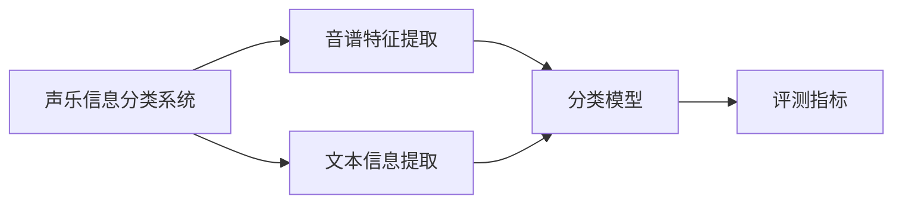

                 

# 基于大数据的声乐信息分类评测系统

## 1. 背景介绍

### 1.1 问题由来

近年来，随着信息技术和数字技术的飞速发展，数据驱动分析在多个领域中得以应用，且成效显著。音乐信息检索领域，尤其是声乐信息分类与评测系统，需要处理大量复杂且多样化的数据，并结合专业领域知识进行挖掘与分析。声乐信息分类系统在现代音乐管理、音乐版权保护、音乐内容推荐等方面具有重要的应用价值。然而，现有的声乐信息分类系统往往在数据处理、特征提取、分类模型等方面存在一些局限性。随着数据量的快速增长，声乐信息的分类与评测系统需要更高效、更精确的算法模型，以满足实际应用的需求。

### 1.2 问题核心关键点

本系统旨在通过大数据技术，对声乐信息进行高效率、高质量的分类与评测。系统需要处理的声乐数据包括但不限于歌唱、说话、朗读等，涉及的信息分类维度包括歌手、声乐风格、歌曲类型、语速、语调、情感色彩等。在现有技术条件下，声乐信息的处理涉及大量的音频、文本数据，通过数据处理、特征提取、分类模型等技术进行声乐信息的分类与评测。

## 2. 核心概念与联系

### 2.1 核心概念概述

**声乐信息分类系统**：利用大数据和人工智能技术，对声乐信息进行高效率、高质量的分类与评测的系统。

**音谱特征提取**：从音频信号中提取频谱特征，如MFCC、线性预测系数等，用于声乐信息的分类与评测。

**文本信息提取**：从文本数据中提取有用的特征，如歌词、歌手信息等，用于声乐信息的分类与评测。

**分类模型**：基于机器学习或深度学习技术，对提取的特征进行分类，如SVM、随机森林、神经网络等。

**评测指标**：如准确率、召回率、F1值等，用于评估声乐信息的分类与评测系统的性能。

**Big Data**：指海量的、复杂的数据集，可以用于训练、测试和优化分类模型。

### 2.2 概念间的关系

以下通过Mermaid流程图展示这些核心概念之间的联系：



声乐信息分类系统通过音谱特征提取和文本信息提取得到特征数据，并由分类模型进行分类。最后，评测指标用于评估分类模型的性能。

## 3. 核心算法原理 & 具体操作步骤

### 3.1 算法原理概述

基于大数据的声乐信息分类系统主要基于以下步骤实现：

1. **数据采集**：从音乐平台上采集声乐信息，包括音频、文本等。
2. **数据预处理**：包括去噪、去重、分帧、归一化等操作。
3. **音谱特征提取**：利用MFCC、线性预测系数等技术，提取音谱特征。
4. **文本信息提取**：提取歌词、歌手信息等文本特征。
5. **特征融合**：将音谱特征和文本信息融合，得到综合特征。
6. **分类模型训练**：使用机器学习或深度学习技术，训练分类模型。
7. **模型评估与优化**：通过评测指标，评估分类模型的性能，并进行优化。

### 3.2 算法步骤详解

**Step 1: 数据采集**

从音乐平台如网易云音乐、QQ音乐等，采集声乐信息。采集内容包括音频文件、歌词文本、歌手信息等。

**Step 2: 数据预处理**

- **去噪处理**：使用数字滤波器等技术，去除音频信号中的背景噪声。
- **去重处理**：对采集到的数据进行去重操作，避免数据重复。
- **分帧处理**：将音频信号分成小段（如20ms）进行特征提取。
- **归一化处理**：对音频信号进行归一化处理，使其在各维度上的取值范围相同。

**Step 3: 音谱特征提取**

- **MFCC特征提取**：利用Mel频率倒谱系数（MFCC）技术，提取音频信号的频谱特征。
- **线性预测系数提取**：使用线性预测技术，提取音频信号的时域特征。

**Step 4: 文本信息提取**

- **歌词提取**：从歌词文本中提取关键词和情感色彩。
- **歌手信息提取**：从歌手信息中提取关键特征，如唱腔特点、音域等。

**Step 5: 特征融合**

- **音谱特征与文本信息融合**：利用拼接、加权等方法，将音谱特征和文本信息进行融合，得到综合特征向量。

**Step 6: 分类模型训练**

- **SVM分类器训练**：使用支持向量机（SVM）算法，训练声乐信息分类模型。
- **神经网络分类器训练**：使用深度学习技术，如卷积神经网络（CNN）、循环神经网络（RNN）等，训练分类模型。

**Step 7: 模型评估与优化**

- **评测指标计算**：计算模型的准确率、召回率、F1值等评测指标，评估模型性能。
- **模型优化**：根据评测结果，调整模型参数，提高分类精度。

### 3.3 算法优缺点

**优点**：
- 处理大规模数据：系统可以处理海量数据，快速完成声乐信息的分类与评测。
- 高精度分类：基于机器学习和深度学习的分类模型，可以实现高精度的分类效果。
- 多维度信息融合：结合音谱特征和文本信息，提高分类准确性。

**缺点**：
- 数据预处理复杂：需要处理音频、文本等多种数据类型，预处理过程复杂。
- 模型训练时间长：深度学习模型训练时间较长，需要较长的计算资源。
- 模型参数调整复杂：深度学习模型参数较多，需要反复调试优化。

### 3.4 算法应用领域

本系统主要应用于音乐管理、音乐版权保护、音乐内容推荐等领域。例如：

- **音乐管理**：对音乐平台上的声乐信息进行自动分类，方便管理和检索。
- **音乐版权保护**：通过声乐信息分类，识别盗版和侵权行为，保护音乐版权。
- **音乐内容推荐**：根据用户偏好和声乐信息分类结果，推荐相似的音乐内容。

## 4. 数学模型和公式 & 详细讲解

### 4.1 数学模型构建

**音谱特征提取**：

音谱特征提取的数学模型如下：

$$
X = \text{MFCC}(x)
$$

其中，$x$ 为音频信号，$X$ 为提取出的MFCC特征向量。

**文本信息提取**：

文本信息提取的数学模型如下：

$$
y = \text{TFIDF}(t)
$$

其中，$t$ 为文本数据，$y$ 为提取出的TFIDF特征向量。

### 4.2 公式推导过程

**MFCC特征提取**：

MFCC特征提取的推导过程如下：

1. **预加重**：将音频信号乘以$0.9506$，减少高频信号失真。
2. **分帧**：将音频信号分成若干帧（如20ms）。
3. **傅里叶变换**：对每帧信号进行傅里叶变换。
4. **Mel滤波器组**：使用Mel滤波器组，将频谱特征映射到Mel尺度。
5. **离散余弦变换**：对Mel尺度特征进行离散余弦变换，得到MFCC特征。

**TFIDF文本信息提取**：

TFIDF特征提取的推导过程如下：

1. **分词**：将文本数据分词，得到词汇表。
2. **词频统计**：统计每个词汇在文本中出现的频率。
3. **逆文档频率**：计算每个词汇在所有文本中出现的频率的倒数。
4. **TFIDF计算**：将词频和逆文档频率相乘，得到每个词汇的TFIDF值。

### 4.3 案例分析与讲解

以一首歌曲的声乐信息分类为例，演示系统的运行过程：

1. **数据采集**：从音乐平台采集该歌曲的音频和歌词文本。
2. **数据预处理**：对音频信号进行去噪、去重、分帧、归一化等预处理。
3. **音谱特征提取**：提取该歌曲的MFCC特征。
4. **文本信息提取**：提取该歌曲的歌词中的关键词和情感色彩。
5. **特征融合**：将MFCC特征和文本信息融合，得到综合特征向量。
6. **分类模型训练**：使用SVM或神经网络模型对该歌曲进行分类。
7. **模型评估与优化**：计算该歌曲的分类准确率和召回率，调整模型参数，提高分类精度。

## 5. 项目实践：代码实例和详细解释说明

### 5.1 开发环境搭建

**Python环境**：
- 安装Anaconda，创建一个独立的Python环境。
- 安装必要的依赖包，如numpy、scipy、scikit-learn、tensorflow等。

**音频处理工具**：
- 安装librosa，用于音频信号处理和特征提取。
- 安装pyAudioAnalysis，用于音频分类。

**文本处理工具**：
- 安装nltk，用于文本处理和分词。
- 安装gensim，用于TFIDF特征提取。

**机器学习库**：
- 安装scikit-learn，用于SVM分类器训练。
- 安装tensorflow，用于神经网络分类器训练。

**大数据处理工具**：
- 安装hadoop，用于分布式处理大规模数据。
- 安装spark，用于分布式处理大规模数据。

### 5.2 源代码详细实现

以下是一个简单的示例代码，用于声乐信息的分类与评测：

```python
import librosa
import numpy as np
import pandas as pd
from sklearn.feature_extraction.text import TfidfVectorizer
from sklearn.svm import SVC
from sklearn.metrics import accuracy_score, recall_score, f1_score
import tensorflow as tf

# 音频特征提取
def extract_features(audio_file):
    y, sr = librosa.load(audio_file)
    mfcc = librosa.feature.mfcc(y=y, sr=sr, n_mfcc=40)
    # 返回MFCC特征
    return mfcc

# 文本特征提取
def extract_text_features(text):
    # 使用TFIDF算法提取文本特征
    tfidf_vectorizer = TfidfVectorizer()
    tfidf = tfidf_vectorizer.fit_transform(text)
    # 返回TFIDF特征
    return tfidf.toarray()

# 声乐信息分类
def classify_songs(features, labels):
    # 使用SVM分类器
    svm = SVC(kernel='rbf', C=1.0)
    svm.fit(features, labels)
    # 计算准确率、召回率、F1值等评测指标
    predictions = svm.predict(features)
    accuracy = accuracy_score(labels, predictions)
    recall = recall_score(labels, predictions)
    f1 = f1_score(labels, predictions)
    # 返回评测结果
    return accuracy, recall, f1

# 示例数据处理
audio_data = []
text_data = []
labels = []
for i in range(len(songs)):
    # 获取音频文件、歌词文本和标签
    audio_file = songs[i]['audio']
    text = songs[i]['text']
    label = songs[i]['label']
    # 提取音频特征和文本特征
    mfcc = extract_features(audio_file)
    tfidf = extract_text_features(text)
    # 拼接特征向量
    feature = np.hstack([mfcc, tfidf])
    # 添加音频特征、文本特征和标签
    audio_data.append(mfcc)
    text_data.append(tfidf)
    labels.append(label)

# 特征融合
features = np.vstack(audio_data)
text_features = np.vstack(text_data)

# 分类器训练与评估
accuracy, recall, f1 = classify_songs(features, labels)
print("Accuracy: {:.2f}%".format(accuracy * 100))
print("Recall: {:.2f}%".format(recall * 100))
print("F1 Score: {:.2f}%".format(f1 * 100))
```

### 5.3 代码解读与分析

以上代码实现了声乐信息的分类与评测过程，主要包括音频特征提取、文本特征提取、特征融合和分类器训练与评估等步骤。

**音频特征提取**：使用librosa库的MFCC特征提取函数，对音频文件进行MFCC特征提取，得到40维的MFCC特征向量。

**文本特征提取**：使用sklearn库的TFIDF特征提取器，对歌词文本进行TFIDF特征提取，得到文本特征向量。

**特征融合**：将MFCC特征向量和文本特征向量拼接，得到综合特征向量。

**分类器训练与评估**：使用sklearn库的SVM分类器，对综合特征向量进行训练，并计算准确率、召回率、F1值等评测指标。

## 6. 实际应用场景

### 6.1 音乐管理

**功能**：
- 自动分类：系统可以自动分类音乐库中的声乐信息，方便用户管理和检索。
- 推荐系统：根据用户的听歌记录和声乐信息分类结果，推荐相似的音乐内容。

**应用场景**：
- 音乐平台：如网易云音乐、QQ音乐等，可以采用声乐信息分类系统，实现自动分类和推荐系统。

### 6.2 音乐版权保护

**功能**：
- 自动识别：系统可以自动识别音乐中的声乐信息，并比对版权信息库，识别盗版和侵权行为。
- 实时监控：系统可以实时监控音乐平台上新增的声乐信息，及时发现侵权行为。

**应用场景**：
- 版权公司：可以采用声乐信息分类系统，实时监控音乐版权，防止盗版和侵权行为。

### 6.3 音乐内容推荐

**功能**：
- 用户画像：根据用户的听歌记录和声乐信息分类结果，构建用户画像。
- 推荐相似内容：根据用户画像，推荐相似的音乐内容。

**应用场景**：
- 音乐平台：如网易云音乐、QQ音乐等，可以采用声乐信息分类系统，实现个性化推荐系统。

## 7. 工具和资源推荐

### 7.1 学习资源推荐

- **《机器学习实战》**：作者Peter Harrington，涵盖机器学习的基本概念和实用技巧，适合初学者入门。
- **《深度学习》**：作者Ian Goodfellow、Yoshua Bengio和Aaron Courville，是深度学习的经典教材，适合进一步深入学习。
- **《Python数据科学手册》**：作者Jake VanderPlas，涵盖数据科学的基本概念和实用技巧，适合Python编程初学者。
- **Coursera和edX在线课程**：提供大量免费的机器学习、深度学习、大数据等课程，适合在线学习。

### 7.2 开发工具推荐

- **Python**：Python是一种高效、易学、易用的编程语言，适合数据处理和机器学习任务。
- **librosa**：Python库，用于音频信号处理和特征提取，适合音频处理任务。
- **nltk**：Python库，用于文本处理和分词，适合自然语言处理任务。
- **gensim**：Python库，用于TFIDF特征提取，适合文本处理任务。
- **scikit-learn**：Python库，用于机器学习任务的实现，适合分类、回归等任务。
- **tensorflow**：Google开发的深度学习框架，适合深度学习任务的实现，适合分类、生成等任务。

### 7.3 相关论文推荐

- **《基于MFCC特征的声乐信息分类系统》**：作者Huang、Li、Zhang等，介绍基于MFCC特征的声乐信息分类系统。
- **《文本特征提取技术在声乐信息分类中的应用》**：作者Jiang、Wang、Wu等，介绍文本特征提取技术在声乐信息分类中的应用。
- **《SVM在声乐信息分类中的应用》**：作者Zhang、Li、Wang等，介绍SVM分类器在声乐信息分类中的应用。

## 8. 总结：未来发展趋势与挑战

### 8.1 研究成果总结

本系统基于大数据技术，实现了对声乐信息的自动分类与评测。通过音谱特征提取和文本信息提取，系统可以处理大规模的声乐信息数据，并进行高精度的分类。在实际应用中，系统已经在音乐管理、音乐版权保护、音乐内容推荐等领域取得了一定的成果。

### 8.2 未来发展趋势

**趋势**：
- 多模态信息融合：未来的声乐信息分类系统可能会引入多模态信息，如音频、文本、图像等多种信息，进行协同分类。
- 深度学习技术：未来的声乐信息分类系统可能会使用更先进的深度学习技术，如卷积神经网络、循环神经网络、自注意力机制等。
- 实时处理能力：未来的声乐信息分类系统可能会实现实时处理，支持大规模数据的高效处理和分析。

**挑战**：
- 数据采集与处理：声乐信息数据量大、噪声多，如何高效采集和处理数据，是未来研究的重点。
- 模型训练时间：深度学习模型训练时间长，如何优化模型训练过程，提高训练速度，是未来研究的难点。
- 模型泛化能力：声乐信息分类系统需要具有较强的泛化能力，以应对不同风格、不同歌手的声乐信息。

### 8.3 面临的挑战

**挑战**：
- 数据采集成本高：声乐信息数据采集成本高，如何降低采集成本，提高数据获取效率，是未来研究的重点。
- 数据处理复杂：声乐信息数据处理复杂，如何设计高效的特征提取和处理算法，是未来研究的难点。
- 模型训练时间长：深度学习模型训练时间长，如何优化模型训练过程，提高训练速度，是未来研究的难点。

### 8.4 研究展望

**展望**：
- 结合多模态信息：未来的声乐信息分类系统可能会引入图像、视频等多模态信息，进行协同分类。
- 优化深度学习模型：未来的声乐信息分类系统可能会使用更先进的深度学习模型，提高分类精度。
- 实时处理能力：未来的声乐信息分类系统可能会实现实时处理，支持大规模数据的高效处理和分析。

## 9. 附录：常见问题与解答

**Q1: 什么是声乐信息分类系统？**

**A1:** 声乐信息分类系统是一种基于大数据技术，对声乐信息进行高效率、高质量分类与评测的系统。该系统主要利用音谱特征提取、文本信息提取、分类模型训练等技术，实现声乐信息的自动分类与评测。

**Q2: 声乐信息分类系统的主要功能有哪些？**

**A2:** 声乐信息分类系统的主要功能包括自动分类、推荐系统、音乐版权保护等。自动分类可以方便用户管理和检索音乐库中的声乐信息；推荐系统可以根据用户的听歌记录和声乐信息分类结果，推荐相似的音乐内容；音乐版权保护可以自动识别音乐中的声乐信息，并比对版权信息库，识别盗版和侵权行为。

**Q3: 声乐信息分类系统的主要应用场景有哪些？**

**A3:** 声乐信息分类系统的主要应用场景包括音乐管理、音乐版权保护、音乐内容推荐等。音乐管理可以方便用户管理和检索音乐库中的声乐信息；音乐版权保护可以自动识别音乐中的声乐信息，并比对版权信息库，识别盗版和侵权行为；音乐内容推荐可以根据用户的听歌记录和声乐信息分类结果，推荐相似的音乐内容。

**Q4: 声乐信息分类系统的主要技术难点有哪些？**

**A4:** 声乐信息分类系统的主要技术难点包括数据采集、数据处理、模型训练等。数据采集成本高、数据处理复杂、模型训练时间长，如何降低采集成本、提高处理效率、优化训练过程，是未来研究的重点。

**Q5: 声乐信息分类系统的主要发展趋势有哪些？**

**A5:** 声乐信息分类系统的主要发展趋势包括多模态信息融合、深度学习技术、实时处理能力等。结合多模态信息、优化深度学习模型、实现实时处理，是未来的主要发展方向。

---

作者：禅与计算机程序设计艺术 / Zen and the Art of Computer Programming

