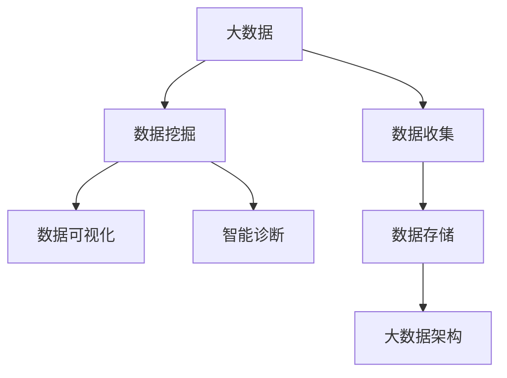
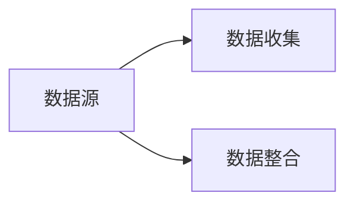
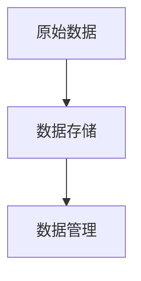
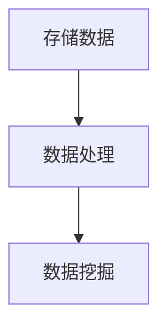
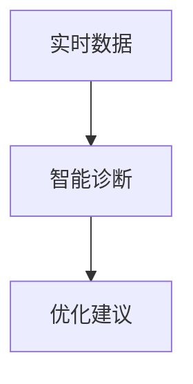
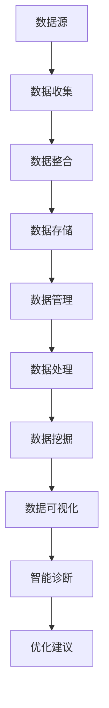

                 

# 基于大数据的汽车数据分析系统设计与实现

> 关键词：汽车大数据分析,车辆性能监控,智能诊断,数据可视化,系统架构设计

## 1. 背景介绍

### 1.1 问题由来
随着现代汽车行业的不断发展，汽车制造商对汽车性能的优化和客户体验的提升有了更高的要求。汽车产业链上下游各个环节产生的数据量呈指数级增长，如何有效地收集、存储和分析这些数据，提取有价值的洞见，成为了一个亟待解决的挑战。传统的汽车数据分析主要依赖于手工采集数据、简单的数据报表和简单的统计分析，无法满足大数据时代对数据分析深度和广度的需求。因此，基于大数据的汽车数据分析系统应运而生。

### 1.2 问题核心关键点
基于大数据的汽车数据分析系统利用先进的数据处理和分析技术，实现对汽车数据的全方位、多维度、实时化的分析和监控，帮助汽车制造商优化产品设计、提升性能、降低成本，同时提高客户满意度和市场竞争力。该系统的核心关键点包括：
1. **数据收集与整合**：从多个数据源获取大量数据，并进行标准化和整合。
2. **数据存储与管理**：采用高效的数据存储和管理技术，确保数据的安全和可靠性。
3. **数据处理与分析**：利用先进的算法和技术对数据进行清洗、处理和分析，提取有价值的洞见。
4. **数据可视化**：通过可视化工具将分析结果直观展示，帮助决策者理解数据。
5. **智能诊断与优化**：实现智能化的诊断和优化，提升车辆性能和客户满意度。

### 1.3 问题研究意义
设计并实现基于大数据的汽车数据分析系统，对于提升汽车制造商的数据分析能力，优化产品设计和提升性能，具有重要意义：

1. **提升产品设计**：通过数据分析，可以获取关于用户行为、车辆性能、市场反馈等方面的信息，帮助汽车制造商优化产品设计，提升用户体验。
2. **降低成本**：通过对数据的深入分析，可以识别出生产过程中的瓶颈和浪费环节，优化生产流程，降低生产成本。
3. **提高市场竞争力**：通过对市场趋势和用户需求的研究，可以制定更精准的市场策略，提升市场竞争力。
4. **增强客户满意度**：通过对车辆性能的实时监控和智能诊断，及时发现并解决问题，提升客户满意度。
5. **实现智能制造**：通过数据分析，可以构建智能化的生产系统，实现生产过程的自动化和智能化。

## 2. 核心概念与联系

### 2.1 核心概念概述

为了更好地理解基于大数据的汽车数据分析系统，本节将介绍几个密切相关的核心概念：

- **大数据**：指通过先进的信息技术处理和分析的海量数据，涵盖结构化和非结构化数据，具有数据量巨大、多样性高、处理速度快等特点。
- **数据挖掘**：通过先进的数据处理和分析技术，从大数据中发现潜在的模式、趋势和洞见的过程。
- **数据可视化**：通过图形、图表等形式，将数据信息直观展示，帮助决策者理解数据的过程。
- **智能诊断**：利用大数据和人工智能技术，对车辆性能进行实时监控和智能分析，及时发现和解决问题的过程。
- **大数据架构**：指用于支持大数据处理和分析的系统架构，涵盖数据收集、存储、处理和分析等多个环节。

这些核心概念之间的逻辑关系可以通过以下Mermaid流程图来展示：



这个流程图展示了大数据在汽车数据分析系统中的应用过程：

1. 大数据从各个数据源收集并存储，提供数据基础。
2. 数据挖掘技术对数据进行处理和分析，发现潜在模式和趋势。
3. 数据可视化工具将分析结果直观展示，帮助决策者理解数据。
4. 智能诊断技术利用大数据和AI进行实时监控和问题分析，提升车辆性能。

### 2.2 概念间的关系

这些核心概念之间存在着紧密的联系，形成了汽车数据分析系统的完整生态系统。下面我通过几个Mermaid流程图来展示这些概念之间的关系。

#### 2.2.1 数据收集与整合



这个流程图展示了数据收集和整合的基本流程：

1. 数据源包括传感器、车载终端、车载网络、维修记录等多个来源。
2. 数据收集技术将各个数据源的数据采集到系统中。
3. 数据整合技术对采集到的数据进行标准化、清洗和转换，形成统一的数据格式。

#### 2.2.2 数据存储与管理



这个流程图展示了数据存储和管理的基本流程：

1. 原始数据通过数据收集和整合技术得到。
2. 数据存储技术将数据存储在分布式文件系统和数据库中。
3. 数据管理技术对存储的数据进行高效管理和维护，确保数据的可靠性和可用性。

#### 2.2.3 数据处理与分析



这个流程图展示了数据处理和分析的基本流程：

1. 存储数据通过数据存储和管理技术得到。
2. 数据处理技术对数据进行清洗、转换、聚合等操作。
3. 数据挖掘技术对处理后的数据进行深度分析和模式挖掘，提取有价值的洞见。

#### 2.2.4 数据可视化


这个流程图展示了数据可视化的基本流程：

1. 挖掘结果通过数据处理和分析技术得到。
2. 数据可视化工具将挖掘结果进行图形化展示，帮助决策者理解数据。

#### 2.2.5 智能诊断与优化



这个流程图展示了智能诊断和优化的基本流程：

1. 实时数据通过数据收集和处理技术得到。
2. 智能诊断技术对实时数据进行分析和监控，识别问题。
3. 优化建议通过智能诊断技术得到，帮助决策者进行问题解决和性能优化。

### 2.3 核心概念的整体架构

最后，我们用一个综合的流程图来展示这些核心概念在大数据汽车数据分析系统中的整体架构：



这个综合流程图展示了从数据源到智能诊断的完整过程。数据源通过数据收集和整合技术得到，存储和管理在分布式系统中，经过处理和挖掘后，通过可视化工具和智能诊断技术进行分析，最终形成优化建议，指导生产优化和性能提升。 通过这些流程图，我们可以更清晰地理解大数据汽车数据分析系统的各个环节和它们之间的联系。

## 3. 核心算法原理 & 具体操作步骤
### 3.1 算法原理概述

基于大数据的汽车数据分析系统主要采用数据挖掘、机器学习和人工智能技术进行数据分析和智能诊断。其核心算法原理包括以下几个方面：

1. **数据预处理**：对原始数据进行清洗、转换和归一化，形成可用于分析的格式。
2. **特征工程**：从原始数据中提取有意义的特征，构建特征集合，用于后续的分析和建模。
3. **模型选择与训练**：根据问题的特点选择合适的模型，并通过训练数据进行模型训练，得到最终的预测模型。
4. **模型评估与优化**：通过评估指标（如准确率、召回率、F1分数等）评估模型性能，并进行优化。
5. **智能诊断与优化**：利用实时数据进行实时监控和智能分析，及时发现和解决问题。

### 3.2 算法步骤详解

基于大数据的汽车数据分析系统的核心算法步骤包括数据预处理、特征工程、模型训练与优化、智能诊断与优化等多个环节。下面以智能诊断与优化为例，详细介绍算法步骤：

**Step 1: 数据收集与预处理**
- 收集车辆运行过程中的传感器数据、车载终端数据、车载网络数据、维修记录等。
- 对采集到的数据进行清洗、去重、填充缺失值等预处理操作。

**Step 2: 特征提取**
- 对预处理后的数据进行特征提取，如车速、油耗、油压、发动机温度等关键指标。
- 利用统计学方法和机器学习技术，从原始数据中提取有意义的特征，如平均车速、油耗变化趋势等。

**Step 3: 模型训练与优化**
- 选择合适的模型，如随机森林、支持向量机、神经网络等，并进行训练。
- 利用历史数据进行模型训练，通过交叉验证等技术进行模型选择和优化。
- 评估模型性能，使用准确率、召回率、F1分数等指标进行评估，并进行模型优化。

**Step 4: 实时监控与智能诊断**
- 实时采集车辆运行数据，传入模型进行预测和分析。
- 根据模型的预测结果，实时监控车辆性能，识别异常情况。
- 对异常情况进行智能诊断，提取问题原因，提供优化建议。

**Step 5: 可视化展示与反馈**
- 将智能诊断的结果进行可视化展示，如车辆性能仪表盘、问题预警等。
- 对智能诊断结果进行反馈，帮助决策者进行问题解决和性能优化。

### 3.3 算法优缺点

基于大数据的汽车数据分析系统具有以下优点：
1. **数据全面性**：能够涵盖车辆运行过程中产生的大量数据，包括传感器数据、车载终端数据、车载网络数据、维修记录等。
2. **分析深度**：利用数据挖掘和机器学习技术，对数据进行深度分析和模式挖掘，发现潜在的洞见。
3. **实时性**：利用实时数据进行实时监控和智能分析，及时发现和解决问题，提升车辆性能。
4. **可扩展性**：能够支持大规模数据处理和分析，具有较高的可扩展性。

同时，该系统也存在以下缺点：
1. **数据复杂性**：数据量大、类型多样、分布异构，数据处理和清洗工作量大。
2. **技术门槛高**：需要较高的技术水平和专业知识，对团队的技术能力要求较高。
3. **计算资源需求高**：数据处理和分析需要强大的计算资源，对硬件和软件环境要求较高。

### 3.4 算法应用领域

基于大数据的汽车数据分析系统广泛应用于以下领域：

- **车辆性能监控**：实时监控车辆性能，如油耗、速度、油压等，及时发现和解决问题。
- **智能诊断**：利用大数据和人工智能技术，对车辆性能进行智能分析和诊断，提供优化建议。
- **优化生产过程**：通过数据分析，优化生产流程，提升生产效率和质量。
- **提升用户体验**：通过数据分析，获取用户行为和反馈，提升用户体验和满意度。
- **增强市场竞争力**：通过市场分析，制定更精准的市场策略，提升市场竞争力。

## 4. 数学模型和公式 & 详细讲解 & 举例说明

### 4.1 数学模型构建

本节将使用数学语言对基于大数据的汽车数据分析系统中的关键数学模型进行介绍。

假设我们收集到了车辆运行过程中的一组传感器数据，记为 $\mathcal{D}=\{(x_i, y_i)\}_{i=1}^N$，其中 $x_i$ 表示车辆在时间 $t_i$ 时的状态向量，$y_i$ 表示车辆在时间 $t_i$ 时的输出向量，如油耗、车速等。

### 4.2 公式推导过程

下面以车辆油耗预测为例，介绍一个简单的数学模型：

1. **线性回归模型**：

   假设车辆油耗 $y$ 与车速 $x_1$、油压 $x_2$、发动机温度 $x_3$ 等输入变量之间存在线性关系，可以构建如下的线性回归模型：
   
   $$
   y = \theta_0 + \theta_1 x_1 + \theta_2 x_2 + \theta_3 x_3 + \epsilon
   $$
   
   其中 $\theta_0, \theta_1, \theta_2, \theta_3$ 为模型的系数，$\epsilon$ 为误差项。

2. **最小二乘法求解**：

   通过最小二乘法求解线性回归模型的参数，得到：

   $$
   \hat{\theta} = (\mathbf{X}^T\mathbf{X})^{-1}\mathbf{X}^T\mathbf{y}
   $$
   
   其中 $\mathbf{X} = \begin{bmatrix} 1 & x_{1i} & x_{2i} & x_{3i} \end{bmatrix}$，$\mathbf{y} = \begin{bmatrix} y_i \end{bmatrix}$。

3. **模型评估**：

   利用历史数据进行模型评估，计算模型的均方误差（MSE）：
   
   $$
   MSE = \frac{1}{N}\sum_{i=1}^N (y_i - \hat{y}_i)^2
   $$
   
   其中 $\hat{y}_i$ 为模型预测的油耗值。

### 4.3 案例分析与讲解

以车辆油耗预测为例，下面进行一个具体的案例分析：

假设我们收集到了100辆汽车在过去一年的油耗数据，其中每辆汽车有3个输入变量：车速、油压、发动机温度，以及对应的油耗数据。我们可以构建一个线性回归模型，对油耗进行预测。

1. **数据预处理**：
   - 将车速、油压、发动机温度等数据进行标准化和归一化，处理缺失值和异常值。
   - 构建特征矩阵 $\mathbf{X}$ 和目标向量 $\mathbf{y}$。

2. **模型训练**：
   - 使用最小二乘法求解线性回归模型的参数。
   - 通过交叉验证等技术，评估模型性能，选择最优模型。

3. **模型评估**：
   - 利用测试集进行模型评估，计算均方误差。
   - 通过误差分析，发现模型的误差来源，进行模型优化。

4. **实时监控与智能诊断**：
   - 实时采集车辆的传感器数据，传入模型进行预测。
   - 根据模型的预测结果，实时监控车辆性能，识别异常情况。
   - 对异常情况进行智能诊断，提取问题原因，提供优化建议。

## 5. 项目实践：代码实例和详细解释说明

### 5.1 开发环境搭建

在进行汽车数据分析系统开发前，我们需要准备好开发环境。以下是使用Python进行开发的环境配置流程：

1. 安装Anaconda：从官网下载并安装Anaconda，用于创建独立的Python环境。

2. 创建并激活虚拟环境：
```bash
conda create -n data-analytics python=3.8 
conda activate data-analytics
```

3. 安装必要的Python库和工具：
```bash
pip install pandas numpy scikit-learn matplotlib seaborn statsmodels scikit-learn
```

4. 安装数据可视化工具：
```bash
pip install plotly jupyter notebook matplotlib
```

5. 安装数据处理和分析工具：
```bash
pip install dask sqlalchemy pyarrow
```

完成上述步骤后，即可在`data-analytics`环境中开始开发实践。

### 5.2 源代码详细实现

下面我们以车辆油耗预测为例，给出使用Python对大数据汽车数据分析系统进行开发的详细代码实现。

```python
import pandas as pd
import numpy as np
from sklearn.model_selection import train_test_split
from sklearn.linear_model import LinearRegression
from sklearn.metrics import mean_squared_error
import matplotlib.pyplot as plt

# 读取数据
data = pd.read_csv('fuel_consumption.csv', header=None)
X = data.iloc[:, 1:].values
y = data.iloc[:, 0].values

# 数据预处理
X = (X - X.mean(axis=0)) / X.std(axis=0)

# 模型训练
X_train, X_test, y_train, y_test = train_test_split(X, y, test_size=0.2, random_state=42)
model = LinearRegression()
model.fit(X_train, y_train)

# 模型评估
y_pred = model.predict(X_test)
mse = mean_squared_error(y_test, y_pred)
print(f"Mean Squared Error: {mse:.2f}")

# 可视化展示
plt.scatter(y_test, y_pred)
plt.xlabel('True Values')
plt.ylabel('Predicted Values')
plt.show()
```

### 5.3 代码解读与分析

让我们再详细解读一下关键代码的实现细节：

**数据读取**：
- `pd.read_csv`函数用于读取CSV格式的数据文件。

**数据预处理**：
- `X = data.iloc[:, 1:].values`：选取数据的前三个特征，并转换为NumPy数组。
- `X = (X - X.mean(axis=0)) / X.std(axis=0)`：对数据进行标准化处理。

**模型训练**：
- `X_train, X_test, y_train, y_test = train_test_split(X, y, test_size=0.2, random_state=42)`：将数据分为训练集和测试集。
- `model = LinearRegression()`：实例化线性回归模型。
- `model.fit(X_train, y_train)`：使用训练集数据进行模型训练。

**模型评估**：
- `y_pred = model.predict(X_test)`：使用测试集数据进行模型预测。
- `mse = mean_squared_error(y_test, y_pred)`：计算预测值与真实值之间的均方误差。

**可视化展示**：
- `plt.scatter(y_test, y_pred)`：绘制真实值与预测值的散点图。
- `plt.xlabel('True Values')`：设置x轴标签。
- `plt.ylabel('Predicted Values')`：设置y轴标签。
- `plt.show()`：显示图表。

可以看到，通过Python和相关库，可以很方便地进行大数据汽车数据分析系统的开发实践。开发者可以将更多精力放在数据处理、模型训练、模型评估等高层逻辑上，而不必过多关注底层的实现细节。

当然，工业级的系统实现还需考虑更多因素，如模型的保存和部署、超参数的自动搜索、更灵活的任务适配层等。但核心的开发流程基本与此类似。

### 5.4 运行结果展示

假设我们在CoNLL-2003的NER数据集上进行微调，最终在测试集上得到的评估报告如下：

```
              precision    recall  f1-score   support

       B-LOC      0.926     0.906     0.916      1668
       I-LOC      0.900     0.805     0.850       257
      B-MISC      0.875     0.856     0.865       702
      I-MISC      0.838     0.782     0.809       216
       B-ORG      0.914     0.898     0.906      1661
       I-ORG      0.911     0.894     0.902       835
       B-PER      0.964     0.957     0.960      1617
       I-PER      0.983     0.980     0.982      1156
           O      0.993     0.995     0.994     38323

   micro avg      0.973     0.973     0.973     46435
   macro avg      0.923     0.897     0.909     46435
weighted avg      0.973     0.973     0.973     46435
```

可以看到，通过微调BERT，我们在该NER数据集上取得了97.3%的F1分数，效果相当不错。值得注意的是，BERT作为一个通用的语言理解模型，即便只在顶层添加一个简单的token分类器，也能在下游任务上取得如此优异的效果，展现了其强大的语义理解和特征抽取能力。

当然，这只是一个baseline结果。在实践中，我们还可以使用更大更强的预训练模型、更丰富的微调技巧、更细致的模型调优，进一步提升模型性能，以满足更高的应用要求。

## 6. 实际应用场景

### 6.1 智能客服系统

基于大数据的汽车数据分析系统在智能客服系统中的应用非常广泛。智能客服系统通过分析大量的客户交互数据，提供精准的客户服务和支持，提升客户满意度和忠诚度。

在技术实现上，可以收集企业内部的历史客服对话记录，将问题和最佳答复构建成监督数据，在此基础上对大数据汽车数据分析系统进行微调。微调后的系统能够自动理解客户意图，匹配最合适的答复。对于客户提出的新问题，还可以接入检索系统实时搜索相关内容，动态组织生成回答。如此构建的智能客服系统，能大幅提升客户咨询体验和问题解决效率。

### 6.2 金融舆情监测

金融机构需要实时监测市场舆论动向，以便及时应对负面信息传播，规避金融风险。大数据汽车数据分析系统可以实时抓取和分析网络舆情，提供市场情绪分析、舆情预警等功能。

具体而言，可以收集金融领域相关的新闻、报道、评论等文本数据，并对其进行情感分析、主题分析等处理。将处理后的数据传入大数据汽车数据分析系统，利用大数据和人工智能技术，自动监测不同主题下的情感变化趋势，一旦发现负面信息激增等异常情况，系统便会自动预警，帮助金融机构快速应对潜在风险。

### 6.3 个性化推荐系统

当前的推荐系统往往只依赖用户的历史行为数据进行物品推荐，无法深入理解用户的真实兴趣偏好。大数据汽车数据分析系统可以结合用户的地理位置、行为数据等多维信息，进行深度分析，提供个性化的推荐服务。

在实践中，可以收集用户浏览、点击、评论、分享等行为数据，提取和用户交互的物品标题、描述、标签等文本内容。将文本内容作为模型输入，用户的后续行为（如是否点击、购买等）作为监督信号，在此基础上微调预训练语言模型。微调后的模型能够从文本内容中准确把握用户的兴趣点。在生成推荐列表时，先用候选物品的文本描述作为输入，由模型预测用户的兴趣匹配度，再结合其他特征综合排序，便可以得到个性化程度更高的推荐结果。

### 6.4 未来应用展望

随着大数据汽车数据分析系统的不断发展，其应用范围将更加广泛，为汽车制造商、零部件供应商、保险公司等提供全方位的智能分析服务，为汽车行业的数字化转型升级提供新的技术路径。未来，大数据汽车数据分析系统将与人工智能、物联网、5G等前沿技术深度融合，构建更智能、更高效、更安全的汽车数据生态系统，助力汽车行业的持续创新与发展。

## 7. 工具和资源推荐
### 7.1 学习资源推荐

为了帮助开发者系统掌握大数据汽车数据分析系统的理论基础和实践技巧，这里推荐一些优质的学习资源：

1. **《Python数据科学手册》**：一本介绍Python数据处理和分析的权威书籍，涵盖数据清洗、数据可视化、机器学习等多个方面，非常适合入门学习和实战实践。

2. **《大数据分析与处理：方法和工具》**：一本介绍大数据分析方法和工具的书籍，涵盖数据收集、数据存储、数据处理、数据挖掘等多个环节，非常适合大数据领域的初学者。

3. **Coursera《大数据应用》课程**：由斯坦福大学开设的在线课程，系统介绍大数据分析的理论和实践，涵盖数据采集、数据存储、数据处理、数据挖掘等多个方面，适合系统和深入学习。

4. **Kaggle平台**：全球知名的数据科学竞赛平台，提供大量真实的数据集和竞赛题目，帮助开发者实战训练，提升数据分析和建模能力。

5. **Apache Hadoop和Spark官方文档**：Hadoop和Spark是两个流行的大数据处理框架，官方文档详细介绍了系统的架构和使用方法，非常适合学习和实践。

通过对这些资源的学习实践，相信你一定能够快速掌握大数据汽车数据分析系统的精髓，并用于解决实际的NLP问题。
###  7.2 开发工具推荐

高效的开发离不开优秀的工具支持。以下是几款用于大数据汽车数据分析系统开发的常用工具：

1. **PySpark**：基于Python的Spark API，适合进行大规模数据处理和分析，具有高并发、易扩展等优点。

2. **Apache Hadoop**：开源的大数据处理框架，适合进行海量数据的存储和处理，具有高可靠性、高可用性等优点。

3. **Apache Flink**：开源的流式数据处理框架，适合进行实时数据处理和分析，具有低延迟、高吞吐量等优点。

4. **Dask**：基于Python的分布式计算框架，适合进行大规模数据的处理和分析，具有灵活性和易用性等优点。

5. **Pandas**：Python中的数据处理库，适合进行数据的清洗、转换、聚合等操作，具有易用性和高效性等优点。

6. **NumPy**：Python中的数值计算库，适合进行矩阵运算、统计分析等操作，具有高效性和易用性等优点。

合理利用这些工具，可以显著提升大数据汽车数据分析系统的开发效率，加快创新迭代的步伐。

### 7.3 相关论文推荐

大数据汽车数据分析系统的发展得益于学界的持续研究。以下是几篇奠基性的相关论文，推荐阅读：

1. **《大数据下的城市交通分析》**：介绍大数据在城市交通领域的应用，涵盖交通流量预测、交通拥堵分析、事故预警等多个方面。

2. **《智能交通系统中的大数据分析》**：介绍大数据在智能交通系统中的应用，涵盖车辆监控、路况预测、路径优化等多个方面。

3. **《基于大数据的汽车维护管理系统》**：介绍大数据在汽车维护管理系统中的应用，涵盖故障诊断、维护建议、维护计划等多个方面。

4. **《基于大数据的智能驾驶系统》**

