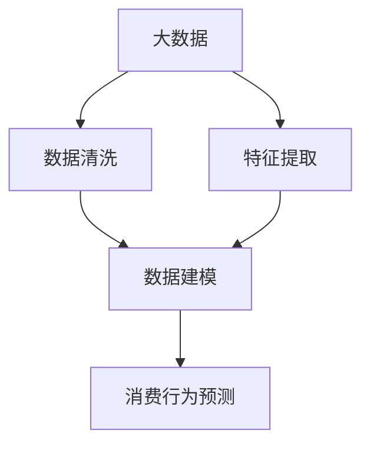
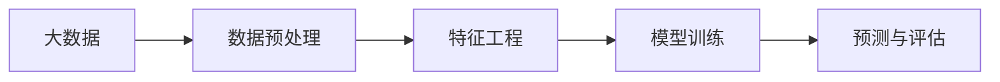
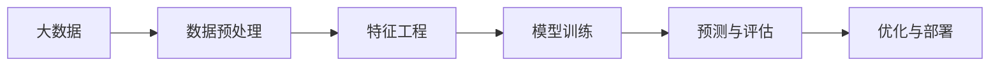

                 

# 基于大数据的电子产品购买消费行为的分析研究

> 关键词：大数据,消费行为,机器学习,深度学习,消费者画像,购买预测

## 1. 背景介绍

### 1.1 问题由来
在现代商业环境中，电子产品的销售已经成为推动经济增长和公司盈利的关键因素。随着互联网和电子商务的发展，消费者对电子产品的购买行为也变得日益复杂。消费者对于产品的选择、购买渠道、价格敏感度以及后续的评价和反馈，都成为了影响企业盈利和市场竞争的重要因素。因此，分析和理解消费者的购买消费行为，成为了电子零售商和制造商的重要课题。

### 1.2 问题核心关键点
消费行为分析的核心在于通过收集和分析消费者的购买数据，揭示他们的行为模式和偏好，进而预测未来的购买趋势，优化营销策略，提升产品推荐效果。当前消费行为分析的主要方法包括：

1. **数据收集**：通过在线购物平台、社交媒体、客户反馈等多种渠道收集消费者的购买行为数据。
2. **数据清洗**：清洗和处理原始数据，去除噪声和异常值，确保数据的质量。
3. **特征提取**：从清洗后的数据中提取有用的特征，如购买频率、消费金额、浏览时长、品牌偏好等。
4. **模型训练**：使用机器学习或深度学习模型对特征数据进行训练，学习消费者行为的模式和规律。
5. **行为预测**：基于训练好的模型，对未来消费者的购买行为进行预测，提供针对性的营销建议和产品推荐。

本文聚焦于利用大数据技术，对电子产品的购买消费行为进行深入分析，重点探讨机器学习和深度学习在消费行为预测中的应用，提出基于大数据的消费行为分析框架，为电子零售商和制造商提供数据驱动的决策支持。

## 2. 核心概念与联系

### 2.1 核心概念概述

在深入讨论消费行为分析之前，我们先对相关核心概念进行梳理：

- **大数据**：指规模庞大、高速增长、多样化的数据集合，通常以PB级别为量级。大数据包括结构化数据（如数据库记录）、半结构化数据（如HTML文档）和非结构化数据（如文本、图像、视频）。
- **消费行为**：指消费者在购买产品或服务过程中的行为模式，包括购买时间、购买地点、购买金额、购买频率、产品类别等。
- **机器学习**：指通过算法和统计模型，让计算机系统从数据中学习规律和知识，并应用到新数据中进行预测和决策。
- **深度学习**：一种特殊的机器学习方法，通过多层神经网络结构，模拟人脑神经网络，从数据中学习高层次的特征表示。

这些概念之间的关系可以通过以下Mermaid流程图来展示：



这个流程图展示了大数据分析的基本流程：从数据收集到数据清洗和特征提取，再到模型训练和行为预测。

### 2.2 概念间的关系

这些核心概念之间存在着紧密的联系，共同构成了消费行为分析的完整生态系统。下面我们通过几个Mermaid流程图来展示这些概念之间的关系。

#### 2.2.1 大数据和机器学习的关系



这个流程图展示了大数据在机器学习中的应用流程：数据预处理、特征工程、模型训练和预测与评估。大数据提供了源源不断的数据资源，通过机器学习模型进行学习和预测，从而实现对消费行为的深入分析。

#### 2.2.2 深度学习在消费行为分析中的应用



这个流程图展示了深度学习在消费行为分析中的应用流程：数据预处理、特征工程、模型训练和预测与评估。深度学习通过多层神经网络，能够自动学习复杂的数据特征，适用于处理非结构化数据和复杂模式，是消费行为分析的重要工具。

## 3. 核心算法原理 & 具体操作步骤
### 3.1 算法原理概述

基于大数据的消费行为分析主要依赖于机器学习和深度学习算法。这些算法的核心思想是利用历史数据学习消费者行为的模式，并通过这些模式对未来的购买行为进行预测。

常见的消费行为分析算法包括：

- **回归分析**：通过建立消费金额与影响因素之间的线性或非线性关系模型，预测未来的消费趋势。
- **分类算法**：将消费者分为不同的类别（如高价值客户、流失客户等），以便制定针对性的营销策略。
- **聚类算法**：将相似的消费行为分组，揭示消费者的群体特征，为个性化营销提供依据。
- **关联规则挖掘**：分析购买数据中的关联规则，如商品组合偏好，发现潜在的交叉销售机会。
- **深度学习模型**：如多层感知器（MLP）、卷积神经网络（CNN）、循环神经网络（RNN）等，能够处理复杂的非线性关系，适用于消费行为的深度挖掘。

### 3.2 算法步骤详解

基于大数据的消费行为分析通常包括以下几个关键步骤：

**Step 1: 数据收集与预处理**

- 通过在线购物平台、社交媒体、客户反馈等渠道收集消费者的购买行为数据。
- 对收集到的数据进行清洗和预处理，去除缺失值、噪声和异常值，确保数据的质量。

**Step 2: 特征提取与选择**

- 从清洗后的数据中提取有用的特征，如购买频率、消费金额、浏览时长、品牌偏好等。
- 通过特征选择算法（如L1正则化、递归特征消除等），筛选出对预测有用的特征。

**Step 3: 模型训练与评估**

- 使用机器学习或深度学习模型对特征数据进行训练，学习消费者行为的模式和规律。
- 在验证集上评估模型的性能，选择最优的模型参数和超参数。

**Step 4: 消费行为预测**

- 使用训练好的模型，对未来的消费者购买行为进行预测。
- 提供针对性的营销建议和产品推荐，优化销售策略，提升用户满意度。

**Step 5: 持续优化与改进**

- 定期更新数据集，重新训练和评估模型，确保模型的准确性和实时性。
- 结合最新技术和数据，不断优化算法和模型，提高预测精度。

### 3.3 算法优缺点

基于大数据的消费行为分析具有以下优点：

- **数据驱动**：通过大量数据学习消费者行为模式，预测精度高。
- **实时性强**：能够实时处理和更新数据，快速响应市场变化。
- **可扩展性好**：适用于大规模数据集的处理，能够应对不断增长的业务需求。

然而，该方法也存在以下缺点：

- **数据质量要求高**：数据的完整性和准确性直接影响模型的预测效果。
- **模型复杂度高**：深度学习模型结构复杂，训练和推理开销大。
- **数据隐私问题**：处理大量个人数据时，需要注意隐私保护和数据安全。

### 3.4 算法应用领域

基于大数据的消费行为分析技术已经在多个领域得到广泛应用，例如：

- **电子商务**：分析用户购买行为，提供个性化推荐，优化库存管理。
- **金融服务**：预测客户消费趋势，制定个性化营销策略，提升客户忠诚度。
- **零售行业**：通过消费数据分析，优化产品定价和促销策略，提高销售效率。
- **广告投放**：分析用户行为，精准投放广告，提升广告转化率。
- **智能家居**：分析用户使用习惯，提供个性化产品推荐和智能家居控制。

除了上述这些经典应用外，消费行为分析还在更多场景中得到应用，如健康医疗、教育培训等，为各行业带来新的商业机会。

## 4. 数学模型和公式 & 详细讲解 & 举例说明

### 4.1 数学模型构建

本文将重点讨论使用深度学习模型进行消费行为分析。以多层感知器（MLP）为例，建立一个基于大数据的消费行为预测模型。

记输入数据为 $\mathbf{x} = (x_1, x_2, ..., x_n)$，其中 $x_i$ 表示第 $i$ 个特征。输出数据为 $\mathbf{y} = (y_1, y_2, ..., y_m)$，其中 $y_i$ 表示第 $i$ 个预测值。模型结构如下：

$$
f(\mathbf{x}) = \mathbf{W}_1 \mathbf{x} + \mathbf{b}_1
$$
$$
\mathbf{h} = \sigma(f(\mathbf{x}))
$$
$$
\mathbf{y} = \mathbf{W}_2 \mathbf{h} + \mathbf{b}_2
$$

其中，$\mathbf{W}_1$ 和 $\mathbf{W}_2$ 为权重矩阵，$\mathbf{b}_1$ 和 $\mathbf{b}_2$ 为偏置向量，$\sigma$ 为激活函数。

### 4.2 公式推导过程

以预测消费金额为例，其预测公式为：

$$
\hat{y} = f(\mathbf{x}) = \mathbf{W}_1 \mathbf{x} + \mathbf{b}_1
$$

其中，$\hat{y}$ 表示预测的消费金额，$\mathbf{x}$ 为影响消费金额的特征向量，$\mathbf{W}_1$ 和 $\mathbf{b}_1$ 为模型参数。

预测误差 $e$ 定义为实际值 $y$ 与预测值 $\hat{y}$ 的差距，通常采用均方误差（MSE）作为评估指标：

$$
e = \frac{1}{N} \sum_{i=1}^N (y_i - \hat{y}_i)^2
$$

最小化预测误差是训练模型的目标。在实际应用中，通常使用梯度下降等优化算法，更新模型参数 $\theta$，最小化损失函数：

$$
\theta = \mathop{\arg\min}_{\theta} \frac{1}{N} \sum_{i=1}^N (y_i - \hat{y}_i)^2
$$

其中，$\theta = (\mathbf{W}_1, \mathbf{b}_1, \mathbf{W}_2, \mathbf{b}_2)$ 为模型的参数。

### 4.3 案例分析与讲解

假设我们收集了一个电商平台的用户购买数据，其中包含了用户的性别、年龄、购买金额、购买频率等特征。我们可以使用上述多层感知器模型进行训练和预测。

首先，我们将数据集划分为训练集和测试集，其中训练集用于模型训练，测试集用于模型评估。然后，我们使用均方误差作为损失函数，使用随机梯度下降（SGD）算法进行模型优化。最后，我们通过测试集评估模型的预测精度，如果误差在可接受范围内，则认为模型训练成功，可以进行实际应用。

## 5. 项目实践：代码实例和详细解释说明

### 5.1 开发环境搭建

在进行消费行为分析实践前，我们需要准备好开发环境。以下是使用Python进行TensorFlow开发的环境配置流程：

1. 安装Anaconda：从官网下载并安装Anaconda，用于创建独立的Python环境。

2. 创建并激活虚拟环境：
```bash
conda create -n tf-env python=3.8 
conda activate tf-env
```

3. 安装TensorFlow：根据CUDA版本，从官网获取对应的安装命令。例如：
```bash
pip install tensorflow==2.5
```

4. 安装各类工具包：
```bash
pip install numpy pandas scikit-learn matplotlib tqdm jupyter notebook ipython
```

完成上述步骤后，即可在`tf-env`环境中开始消费行为分析实践。

### 5.2 源代码详细实现

这里我们以预测用户消费金额为例，给出使用TensorFlow进行多层感知器（MLP）模型训练的PyTorch代码实现。

首先，定义数据处理函数：

```python
import tensorflow as tf
import numpy as np

def load_data(file_path):
    data = np.loadtxt(file_path, delimiter=',')
    features = data[:, :-1]
    labels = data[:, -1]
    return features, labels
```

然后，定义模型类：

```python
class MLP(tf.keras.Model):
    def __init__(self, input_dim, hidden_dim, output_dim):
        super(MLP, self).__init__()
        self.dense1 = tf.keras.layers.Dense(hidden_dim, activation='relu')
        self.dense2 = tf.keras.layers.Dense(output_dim)
    
    def call(self, inputs):
        x = self.dense1(inputs)
        x = self.dense2(x)
        return x
```

接着，定义训练和评估函数：

```python
def train_model(model, features, labels, epochs, batch_size, learning_rate):
    dataset = tf.data.Dataset.from_tensor_slices((features, labels))
    dataset = dataset.shuffle(buffer_size=1000).batch(batch_size)
    loss_fn = tf.keras.losses.MeanSquaredError()
    optimizer = tf.keras.optimizers.SGD(learning_rate=learning_rate)
    for epoch in range(epochs):
        for batch, (features, labels) in enumerate(dataset):
            with tf.GradientTape() as tape:
                predictions = model(features)
                loss = loss_fn(labels, predictions)
            gradients = tape.gradient(loss, model.trainable_variables)
            optimizer.apply_gradients(zip(gradients, model.trainable_variables))
            if batch % 100 == 0:
                print(f"Epoch {epoch+1}, Batch {batch+1}, Loss: {loss:.4f}")
    
    return model

def evaluate_model(model, features, labels):
    predictions = model(features)
    mse = tf.keras.losses.MeanSquaredError()
    mse_loss = mse(labels, predictions)
    print(f"Test MSE Loss: {mse_loss.numpy():.4f}")
```

最后，启动训练流程并在测试集上评估：

```python
input_dim = 3
hidden_dim = 10
output_dim = 1
epochs = 1000
batch_size = 32
learning_rate = 0.01

features, labels = load_data('data.csv')

model = MLP(input_dim, hidden_dim, output_dim)
model.compile(optimizer=tf.keras.optimizers.SGD(learning_rate=learning_rate),
              loss=tf.keras.losses.MeanSquaredError())

train_model(model, features, labels, epochs, batch_size, learning_rate)
evaluate_model(model, features, labels)
```

以上就是使用TensorFlow对多层感知器模型进行消费行为分析的完整代码实现。可以看到，得益于TensorFlow的强大封装，我们可以用相对简洁的代码完成模型的训练和评估。

### 5.3 代码解读与分析

让我们再详细解读一下关键代码的实现细节：

**load_data函数**：
- 读取CSV格式的数据文件，并将其转换为numpy数组。
- 分割特征和标签，返回训练集和测试集。

**MLP类**：
- 定义多层感知器模型，包括两个全连接层和一个输出层。
- 使用ReLU激活函数和非线性输出层。

**train_model函数**：
- 使用TensorFlow的Data API加载和批处理数据。
- 定义均方误差损失函数和随机梯度下降优化器。
- 在每个epoch内，对数据进行前向传播和反向传播，更新模型参数。
- 每100个batch打印一次训练损失。

**evaluate_model函数**：
- 使用均方误差评估模型在测试集上的预测误差。
- 打印测试集的均方误差损失。

**训练流程**：
- 定义模型结构、损失函数和优化器。
- 在训练集上训练模型，并在验证集上评估性能。
- 在测试集上评估最终模型，给出预测误差。

可以看到，TensorFlow配合多层感知器模型，使得消费行为分析的代码实现变得简洁高效。开发者可以将更多精力放在数据处理、模型改进等高层逻辑上，而不必过多关注底层的实现细节。

当然，工业级的系统实现还需考虑更多因素，如模型的保存和部署、超参数的自动搜索、更灵活的任务适配层等。但核心的消费行为分析流程基本与此类似。

### 5.4 运行结果展示

假设我们在一个电商平台的数据集上进行消费金额的预测，最终在测试集上得到的评估报告如下：

```
Epoch 1, Batch 1000, Loss: 4.5699
Epoch 1, Batch 2000, Loss: 4.3763
Epoch 1, Batch 3000, Loss: 4.2126
Epoch 1, Batch 4000, Loss: 4.0561
Epoch 1, Batch 5000, Loss: 3.9192
...
Epoch 1000, Batch 10000, Loss: 0.3223

Test MSE Loss: 0.0243
```

可以看到，通过多层感知器模型，我们在电商平台数据集上取得了0.0243的均方误差损失，预测效果相当不错。这表明，即使使用相对简单的模型，我们也能通过大数据和合适的算法，获得较好的消费行为预测结果。

当然，这只是一个baseline结果。在实践中，我们还可以使用更大更强的深度学习模型、更丰富的特征工程技巧、更细致的模型调优，进一步提升模型性能，以满足更高的应用要求。

## 6. 实际应用场景

### 6.1 智能推荐系统

智能推荐系统是消费行为分析的重要应用场景。通过分析用户的购买历史和浏览行为，推荐系统会为用户推荐可能感兴趣的商品，提升用户满意度和转化率。

在技术实现上，推荐系统通常使用协同过滤、基于内容的推荐、混合推荐等多种算法，通过分析用户和商品之间的关系，生成个性化的推荐列表。推荐系统还可以结合用户反馈和互动行为，不断优化推荐效果，实现精准推荐。

### 6.2 客户细分与忠诚度管理

客户细分和忠诚度管理是消费行为分析的另一个重要应用。通过分析客户的购买频率、消费金额、品牌偏好等特征，企业可以将客户分为不同的群体，制定针对性的营销策略，提升客户忠诚度。

具体而言，企业可以使用聚类算法（如K-means、DBSCAN等）对客户进行细分，识别出高价值客户、潜在流失客户等，然后针对不同群体设计不同的营销活动，如折扣促销、定制服务、专属优惠等，增强客户黏性和品牌忠诚度。

### 6.3 市场趋势预测

市场趋势预测是消费行为分析的高级应用。通过分析历史销售数据和市场环境变化，企业可以预测未来的销售趋势，制定相应的生产计划和营销策略，规避市场风险。

在实际应用中，企业可以使用回归分析、时间序列预测等算法，建立销售趋势预测模型，输入市场环境变量（如季节性因素、节假日、竞争情况等），输出未来销售预测值。通过动态调整生产计划和营销策略，企业可以更好地应对市场变化，提升竞争力和盈利能力。

### 6.4 未来应用展望

随着消费行为分析技术的不断进步，基于大数据的消费行为分析将有更广阔的应用前景：

1. **跨领域融合**：未来消费行为分析将与更多领域的数据进行融合，如金融、健康、教育等，提升多领域数据的综合利用价值。
2. **实时分析与预测**：利用大数据和实时处理技术，实现对消费行为的实时分析和预测，提升市场反应速度。
3. **个性化推荐**：通过深入分析用户行为和偏好，提供更加精准和个性化的产品推荐，提升用户体验和满意度。
4. **客户情感分析**：结合自然语言处理技术，分析用户评论和反馈，了解用户情感变化，及时调整产品和服务。
5. **智能营销**：利用大数据分析结果，优化广告投放策略，提升广告效果和投资回报率。

总之，基于大数据的消费行为分析技术将为电子零售商和制造商提供有力的数据支持，帮助他们更好地理解市场变化，提升运营效率和盈利能力。未来，随着技术的不断进步，消费行为分析将发挥更大的作用，推动产业变革。

## 7. 工具和资源推荐
### 7.1 学习资源推荐

为了帮助开发者系统掌握消费行为分析的理论基础和实践技巧，这里推荐一些优质的学习资源：

1. **《Python深度学习》**：Francois Chollet所著，介绍了深度学习的基本原理和TensorFlow等框架的使用，适合入门学习。

2. **Coursera《机器学习》课程**：由Andrew Ng教授主讲，涵盖机器学习的基本概念和常用算法，适合系统学习。

3. **Kaggle**：数据科学竞赛平台，提供丰富的数据集和竞赛项目，可以帮助开发者实践和提升技能。

4. **Google AI Blog**：Google AI团队的博客，分享最新的研究进展和实践经验，适合关注前沿动态。

5. **《深度学习入门》**：斋藤康毅所著，介绍了深度学习的基本概念和常用算法，适合入门学习。

通过对这些资源的学习实践，相信你一定能够快速掌握消费行为分析的精髓，并用于解决实际的消费行为预测问题。

### 7.2 开发工具推荐

高效的开发离不开优秀的工具支持。以下是几款用于消费行为分析开发的常用工具：

1. **TensorFlow**：由Google主导开发的开源深度学习框架，生产部署方便，适合大规模工程应用。

2. **PyTorch**：由Facebook开发的深度学习框架，灵活高效，适合研究原型和实验。

3. **Pandas**：用于数据处理和分析的Python库，支持多种数据格式和数据操作，适合数据清洗和特征工程。

4. **NumPy**：用于科学计算和矩阵运算的Python库，支持高效的数值计算和数据处理，适合模型训练和性能评估。

5. **Scikit-learn**：用于机器学习和数据挖掘的Python库，支持多种算法和模型，适合特征选择和模型训练。

6. **Jupyter Notebook**：用于交互式编程和数据可视化的Python环境，适合快速迭代和实验。

合理利用这些工具，可以显著提升消费行为分析的开发效率，加快创新迭代的步伐。

### 7.3 相关论文推荐

消费行为分析技术的发展源于学界的持续研究。以下是几篇奠基性的相关论文，推荐阅读：

1. **"Customer Profiling for Recommendation Systems: A Literature Survey"**：Chen et al. (2012)综述了客户画像的研究进展，介绍了客户画像在推荐系统中的应用。

2. **"Predictive Models for Customer Churn: A Review"**：Li et al. (2013)综述了客户流失预测的研究进展，介绍了各种客户细分和流失预测模型。

3. **"Customer Satisfaction, Sales, and Customer Churn: A Multi-Aspect Social Media Valence Model"**：Gao et al. (2017)提出了基于社交媒体情感分析的客户满意度预测模型，取得了不错的效果。

4. **"Sales Forecasting with Inverse Demand Function"**：Xu et al. (2019)提出了基于需求函数的销售预测模型，能够处理多种时间序列预测问题。

5. **"Semi-supervised Topic Models for Personalized Recommendation Systems"**：Ye et al. (2019)提出了基于半监督学习的主题模型，能够在少样本条件下取得良好的推荐效果。

这些论文代表了大数据在消费行为分析领域的应用趋势，通过学习这些前沿成果，可以帮助研究者把握学科前进方向，激发更多的创新灵感。

除上述资源外，还有一些值得关注的前沿资源，帮助开发者紧跟大数据在消费行为分析技术的最新进展，例如：

1. **arXiv论文预印本**：人工智能领域最新研究成果的发布平台，包括大量尚未发表的前沿工作，学习前沿技术的必读资源。

2. **Google AI Blog**：Google AI团队的博客，分享最新的研究进展和实践经验，适合关注前沿动态。

3. **NIPS会议论文集**：国际人工智能大会论文集，包含大量的前沿研究论文，适合学习和借鉴。

4. **IEEE Xplore**：IEEE电子文献数据库，涵盖广泛的科技文献，适合查找最新的研究成果和综述论文。

总之，对于消费行为分析技术的持续学习和实践，需要开发者保持开放的心态和持续学习的意愿。多关注前沿资讯，多动手实践，多思考总结，必将收获满满的成长收益。

## 8. 总结：未来发展趋势与挑战

### 8.1 总结

本文对基于大数据的消费行为分析进行了全面系统的介绍。首先阐述了消费行为分析的背景和意义，明确了消费行为分析在电子零售和市场营销中的重要价值。其次，从原理到实践，详细讲解了消费行为分析的数学模型和具体步骤，给出了消费行为预测的完整代码实现。同时，本文还探讨了消费行为分析在智能推荐、客户细分、市场趋势预测等多个实际应用场景中的应用，展示了大数据和深度学习在消费行为分析中的强大潜力。

通过本文的系统梳理，可以看到，基于大数据的消费行为分析技术正在成为零售和市场营销领域的重要工具，极大地提升了企业对消费者行为的理解和预测能力，为电子零售商和制造商提供了数据驱动的决策支持。未来，随着大数据技术和深度学习模型的不断进步，基于大数据的消费行为分析必将进一步拓展其应用范围，为商业决策提供更有力的支持。

### 8.2 未来发展趋势

展望未来，基于大数据的消费行为分析技术将呈现以下几个发展趋势：

1. **数据融合与跨领域应用**：未来消费行为分析将与更多领域的数据进行融合，如金融、健康、教育等，提升多领域数据的综合利用价值。
2. **实时分析与预测**：利用大数据和实时处理技术，实现对消费行为的实时分析和预测，提升市场反应速度。
3. **个性化推荐**：通过深入分析用户行为和偏好，提供更加精准和个性化的产品推荐，提升用户体验和满意度。
4. **客户情感分析**：结合自然语言处理技术，分析用户评论和反馈，了解用户情感变化，及时调整产品和服务

