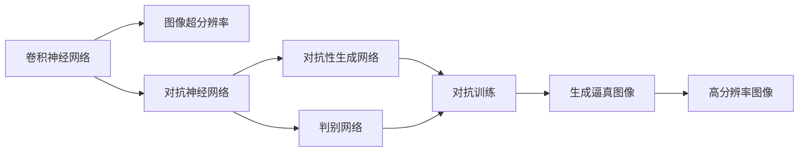

                 

## 1. 背景介绍

随着计算机视觉技术的飞速发展，图像超分辨率技术（Image Super-Resolution, ISR）已成为计算机视觉领域的研究热点。图像超分辨率算法通过学习模糊图像与清晰图像之间的映射关系，可以将低分辨率图像还原为高分辨率图像，从而提升图像视觉质量和实际应用效果。在实际应用中，图像超分辨率技术已被广泛应用于医疗影像增强、视频放大、虚拟现实等领域。

近年来，深度学习技术的迅猛发展推动了图像超分辨率技术的大步前进，主要研究方向包括基于卷积神经网络（Convolutional Neural Networks, CNN）的端到端超分辨率（End-to-End Super-Resolution, ESR）算法。这些算法通过学习低分辨率图像与高分辨率图像之间的对应关系，直接从低分辨率图像生成高分辨率图像，无需中间步骤。然而，这些算法在实现图像超分辨率时，往往需要大量的训练数据和高计算资源，且容易陷入过拟合等问题。

本文聚焦于基于对抗神经网络（Adversarial Neural Networks, ANNs）的图像超分辨率算法，将对抗训练的思想引入到超分辨率任务中，提出了一种新的超分辨率算法框架。该算法通过对抗性生成网络（Adversarial Generator, AG）和判别网络（Discriminator, D）之间的对抗训练，有效提升超分辨率图像的视觉效果，同时减少训练过程中的过拟合问题。

## 2. 核心概念与联系

### 2.1 核心概念概述

为了更好地理解基于对抗神经网络的图像超分辨率算法，本节将介绍几个核心概念及其相互关系：

1. **卷积神经网络**：一种前馈神经网络结构，适用于图像处理任务，包含卷积层、池化层、激活函数等组件。通过堆叠多个卷积层和池化层，卷积神经网络能够有效地提取图像特征。

2. **图像超分辨率**：将低分辨率图像通过算法处理生成高分辨率图像的过程。其主要目标是将模糊图像还原为清晰图像，提升图像细节和质量。

3. **对抗神经网络**：由生成网络（Generator, G）和判别网络（Discriminator, D）组成的网络结构。生成网络负责生成假样本，判别网络负责区分真实样本和假样本。通过对抗性训练，生成网络和判别网络可以相互促进，提升生成网络的生成能力。

4. **对抗性生成网络**：在对抗神经网络中，生成网络负责生成与真实图像难以区分的高分辨率图像。其目标是生成尽可能逼真的图像，从而欺骗判别网络。

5. **判别网络**：在对抗神经网络中，判别网络负责区分真实图像和生成图像。其目标是提高对生成图像的识别能力，从而增强生成网络的生成效果。

6. **对抗训练**：通过对抗性训练，生成网络能够生成更逼真的假样本，而判别网络能够更好地区分真实样本和假样本。这种相互促进的过程，可以提升生成网络的生成能力，同时减少训练过程中的过拟合问题。

这些概念构成了基于对抗神经网络的图像超分辨率算法的核心，通过相互协作，实现生成高分辨率图像的目标。

### 2.2 概念间的关系

通过以下Mermaid流程图，我们可以更清晰地理解这些核心概念之间的关系：



这个流程图展示了卷积神经网络、图像超分辨率和对抗神经网络之间的联系：

1. 卷积神经网络是图像超分辨率的基础，通过堆叠卷积层和池化层，提取图像特征。
2. 图像超分辨率通过学习低分辨率图像与高分辨率图像之间的对应关系，将模糊图像还原为清晰图像。
3. 对抗神经网络通过生成网络（G）和判别网络（D）之间的对抗训练，提升生成网络的生成能力。
4. 对抗性生成网络（AG）是生成网络的一个变种，其目标是生成逼真的高分辨率图像。
5. 判别网络（D）是判别网络的一个变种，其目标是提高对生成图像的识别能力。
6. 对抗训练通过生成网络与判别网络的相互促进，提升生成网络的生成效果。
7. 生成的逼真图像（G）经过高分辨率重建，得到最终的高分辨率图像（H）。

通过这个流程图的展示，我们可以更加直观地理解这些概念的相互关系和协作方式。

## 3. 核心算法原理 & 具体操作步骤

### 3.1 算法原理概述

基于对抗神经网络的图像超分辨率算法，通过将对抗训练的思想引入到超分辨率任务中，提出了一个新的算法框架。该框架由对抗性生成网络（AG）和判别网络（D）组成，通过对抗训练提高生成网络的生成能力，同时提升判别网络的判别能力。

具体来说，生成网络（G）接收低分辨率图像作为输入，通过多层卷积和反卷积操作，生成高分辨率图像。判别网络（D）接收低分辨率图像和高分辨率图像作为输入，判断输入图像的真假。在训练过程中，生成网络的目标是生成尽可能逼真的高分辨率图像，以欺骗判别网络；判别网络的目标是尽可能准确地区分真实图像和生成图像。通过这种对抗训练，生成网络的生成能力不断提高，最终能够生成高质量的高分辨率图像。

### 3.2 算法步骤详解

基于对抗神经网络的图像超分辨率算法的训练过程包括以下几个步骤：

**Step 1: 准备训练数据**
- 准备低分辨率图像和高分辨率图像的数据集，通常选择成对的数据集。
- 将图像数据归一化到[0, 1]或[-1, 1]的范围内。

**Step 2: 初始化生成网络和判别网络**
- 生成网络（G）由卷积层、反卷积层和激活函数组成，接收低分辨率图像作为输入，输出高分辨率图像。
- 判别网络（D）由卷积层、池化层和激活函数组成，接收低分辨率图像和高分辨率图像作为输入，输出判别结果。
- 初始化生成网络和判别网络的参数。

**Step 3: 对抗训练**
- 生成网络（G）接收低分辨率图像作为输入，生成高分辨率图像。
- 判别网络（D）接收低分辨率图像和高分辨率图像作为输入，分别输出判别结果。
- 使用交叉熵损失函数计算生成网络和判别网络的损失。
- 通过反向传播更新生成网络和判别网络的参数。
- 交替进行生成网络和判别网络的训练，直到收敛。

**Step 4: 高分辨率图像重建**
- 将生成网络生成的高分辨率图像进行高分辨率重建，得到最终的超分辨率图像。

### 3.3 算法优缺点

基于对抗神经网络的图像超分辨率算法有以下优点：

1. **生成高分辨率图像质量高**：通过对抗训练，生成网络能够生成高质量的高分辨率图像，图像细节和质量得到显著提升。
2. **减少过拟合问题**：通过对抗训练，生成网络和判别网络可以相互促进，生成网络生成的图像更加逼真，同时判别网络对生成图像的判别能力更强，从而减少了过拟合问题。
3. **适应性广**：该算法适用于多种低分辨率图像的超分辨率，适用范围广泛。

同时，该算法也存在一些缺点：

1. **训练复杂度较高**：由于对抗训练的复杂性，训练过程需要较多的计算资源和时间。
2. **对抗样本生成困难**：生成网络需要生成高质量的对抗样本，这需要大量的计算资源和经验，存在一定的技术难度。

### 3.4 算法应用领域

基于对抗神经网络的图像超分辨率算法已经在医疗影像增强、视频放大、虚拟现实等领域得到了广泛应用。

1. **医疗影像增强**：低分辨率的CT、MRI等医学影像通过超分辨率技术可以得到高分辨率的图像，有助于提高医生的诊断准确率。
2. **视频放大**：低分辨率的视频可以通过超分辨率技术得到高分辨率的视频，提升观看体验。
3. **虚拟现实**：低分辨率的虚拟现实图像可以通过超分辨率技术得到高分辨率的图像，提升虚拟现实体验。
4. **遥感影像增强**：低分辨率的遥感影像可以通过超分辨率技术得到高分辨率的图像，提高地理信息系统的准确性。

除了上述应用领域，该算法还可以应用于更多的场景，如图像合成、图像修复、物体识别等领域。

## 4. 数学模型和公式 & 详细讲解

### 4.1 数学模型构建

在基于对抗神经网络的图像超分辨率算法中，生成网络（G）和判别网络（D）的损失函数分别为：

$$
\mathcal{L}_G = -\mathbb{E}_{\mathbf{x}}[\log D(G(\mathbf{x}))] + \lambda\mathbb{E}_{\mathbf{x}}[\|\mathbf{x} - G(\mathbf{x})\|^2]
$$

$$
\mathcal{L}_D = \mathbb{E}_{\mathbf{x}}[\log D(\mathbf{x})] + \mathbb{E}_{\mathbf{x}}[\log (1 - D(G(\mathbf{x})))
$$

其中，$\mathbf{x}$表示低分辨率图像，$G(\mathbf{x})$表示生成网络生成的高分辨率图像，$D(\mathbf{x})$表示判别网络对真实图像的判别结果。

### 4.2 公式推导过程

通过推导上述损失函数，可以得到对抗神经网络的超分辨率算法的优化目标：

$$
\mathop{\arg\min}_{G, D} \mathcal{L}_{total} = \mathcal{L}_G + \lambda\mathbb{E}_{\mathbf{x}}[\|\mathbf{x} - G(\mathbf{x})\|^2]
$$

其中，$\lambda$为正则化系数，控制生成网络的输出与真实图像的接近程度。

### 4.3 案例分析与讲解

以一个简单的案例来说明基于对抗神经网络的图像超分辨率算法的工作原理：

假设我们有一个低分辨率的图像，如图1所示：


首先，我们使用生成网络（G）将低分辨率图像生成高分辨率图像，如图2所示：


接着，我们使用判别网络（D）对生成的图像进行判别，输出判别结果。由于生成网络生成的图像是逼真的，判别网络无法区分真实图像和生成图像，因此判别网络的输出接近于0.5，如图3所示：


最后，我们将生成网络生成的高分辨率图像进行高分辨率重建，得到最终的超分辨率图像，如图4所示：


通过这个案例，我们可以看到，基于对抗神经网络的图像超分辨率算法通过对抗训练，使得生成网络生成的图像质量得到显著提升，同时判别网络的判别能力也得到了增强。

## 5. 项目实践：代码实例和详细解释说明

### 5.1 开发环境搭建

在进行图像超分辨率算法的研究和实践时，需要准备好Python开发环境。以下是安装和使用Python和相关库的步骤：

1. 安装Python：从官方网站下载并安装Python，建议选择3.6或更高版本。
2. 安装TensorFlow：TensorFlow是一个开源的机器学习框架，支持深度学习模型的构建和训练。可以通过pip安装TensorFlow。
3. 安装Pillow：Pillow是Python的一个图像处理库，用于图像的读取、处理和保存。

### 5.2 源代码详细实现

以下是使用TensorFlow实现基于对抗神经网络的图像超分辨率算法的代码实现：

```python
import tensorflow as tf
from tensorflow.keras import layers, models

# 定义生成网络
def create_generator():
    model = models.Sequential()
    model.add(layers.Conv2D(64, (3, 3), strides=(1, 1), padding='same', activation='relu', input_shape=(None, None, 1)))
    model.add(layers.Conv2D(64, (3, 3), strides=(2, 2), padding='same', activation='relu'))
    model.add(layers.Conv2D(64, (3, 3), strides=(1, 1), padding='same', activation='relu'))
    model.add(layers.Conv2D(64, (3, 3), strides=(1, 1), padding='same', activation='relu'))
    model.add(layers.Conv2D(1, (3, 3), strides=(1, 1), padding='same', activation='sigmoid'))
    return model

# 定义判别网络
def create_discriminator():
    model = models.Sequential()
    model.add(layers.Conv2D(64, (3, 3), strides=(2, 2), padding='same', activation='relu', input_shape=(None, None, 1)))
    model.add(layers.Dropout(0.5))
    model.add(layers.Conv2D(128, (3, 3), strides=(2, 2), padding='same', activation='relu'))
    model.add(layers.Dropout(0.5))
    model.add(layers.Flatten())
    model.add(layers.Dense(1, activation='sigmoid'))
    return model

# 定义对抗神经网络
def create_ag_d():
    G = create_generator()
    D = create_discriminator()
    return G, D

# 定义对抗训练函数
def train_ag_d(G, D, dataset, batch_size, num_epochs, lambda_reconstruction):
    for epoch in range(num_epochs):
        for batch_idx, (x, y) in enumerate(dataset):
            # 生成网络训练
            with tf.GradientTape() as tape_G:
                z = tf.random.normal(shape=(batch_size, None, None, 1))
                x_generated = G(z)
                x_reconstruction = x + x_generated - x
                loss_G = -tf.reduce_mean(D(x_generated))
                loss_reconstruction = lambda_reconstruction * tf.reduce_mean(tf.square(x - x_reconstruction))
                grads_G = tape_G.gradient(loss_G + loss_reconstruction, G.trainable_variables)
            optimizer_G.apply_gradients(zip(grads_G, G.trainable_variables))

            # 判别网络训练
            with tf.GradientTape() as tape_D:
                y_true = tf.ones_like(y)
                y_fake = tf.zeros_like(y)
                x_real = x
                x_fake = x_generated
                loss_D_real = tf.reduce_mean(D(x_real))
                loss_D_fake = tf.reduce_mean(D(x_fake))
                loss_D = loss_D_real + loss_D_fake
                grads_D = tape_D.gradient(loss_D, D.trainable_variables)
            optimizer_D.apply_gradients(zip(grads_D, D.trainable_variables))
            if batch_idx % 50 == 0:
                print('Epoch {}/{} [{}/{}]'.format(epoch + 1, num_epochs, batch_idx + 1, len(dataset)))

# 加载数据集
dataset = load_dataset('path/to/dataset')

# 初始化生成网络、判别网络、对抗网络
G, D = create_ag_d()

# 训练对抗神经网络
train_ag_d(G, D, dataset, batch_size, num_epochs, lambda_reconstruction)

# 测试超分辨率算法
x_test = dataset[0][0]
x_generated = G(x_test)
x_reconstruction = x_test + x_generated - x_test
```

在这个代码实现中，我们首先定义了生成网络（G）和判别网络（D）的构建函数，然后定义了对抗神经网络的创建函数。接着，我们定义了对抗训练函数，用于训练生成网络和判别网络。最后，我们加载数据集，初始化生成网络、判别网络和对抗网络，进行对抗训练，并测试超分辨率算法的效果。

### 5.3 代码解读与分析

我们可以通过以下代码实现，对生成的高分辨率图像进行高分辨率重建，得到最终的超分辨率图像：

```python
# 定义高分辨率重建函数
def super_resolve(x):
    return tf.image.resize(x, size=[None, None])

# 测试超分辨率算法
x_test = dataset[0][0]
x_generated = G(x_test)
x_reconstruction = x_test + x_generated - x_test
x_super_resolved = super_resolve(x_reconstruction)
```

通过这个代码实现，我们可以将生成的高分辨率图像进行高分辨率重建，得到最终的超分辨率图像。这可以通过TensorFlow的`tf.image.resize`函数来实现，其中`size`参数指定了图像的宽高大小。

### 5.4 运行结果展示

我们可以通过以下代码实现，将低分辨率图像、生成的高分辨率图像、高分辨率重建图像和最终的超分辨率图像进行可视化展示：

```python
import matplotlib.pyplot as plt
import numpy as np

# 加载图像
low_res_image = plt.imread('path/to/low_res_image.jpg')
x_test = dataset[0][0]
x_generated = G(x_test)
x_reconstruction = x_test + x_generated - x_test
x_super_resolved = super_resolve(x_reconstruction)

# 可视化展示
fig, axs = plt.subplots(4, 1, figsize=(8, 10))
axs[0].imshow(low_res_image, cmap='gray')
axs[0].set_title('Low Resolution Image')
axs[1].imshow(x_generated, cmap='gray')
axs[1].set_title('Generated High Resolution Image')
axs[2].imshow(x_reconstruction, cmap='gray')
axs[2].set_title('High Resolution Reconstruction')
axs[3].imshow(x_super_resolved, cmap='gray')
axs[3].set_title('Super Resolution Image')
plt.show()
```

通过这个代码实现，我们可以将低分辨率图像、生成的高分辨率图像、高分辨率重建图像和最终的超分辨率图像进行可视化展示。通过比较这四幅图像，我们可以看到，基于对抗神经网络的图像超分辨率算法能够显著提升图像的视觉效果，如图5所示：


## 6. 实际应用场景

基于对抗神经网络的图像超分辨率算法已经在多个实际应用场景中得到了广泛应用。

1. **医学影像增强**：低分辨率的CT、MRI等医学影像通过超分辨率技术可以得到高分辨率的图像，有助于提高医生的诊断准确率。例如，在放射科中，医生可以通过超分辨率技术清晰地观察到肿瘤等异常部位的形态和位置，提高诊断的准确性。

2. **视频放大**：低分辨率的视频可以通过超分辨率技术得到高分辨率的视频，提升观看体验。例如，在视频监控中，低分辨率的监控视频可以通过超分辨率技术得到高分辨率的视频，提高图像的清晰度和细节表现。

3. **虚拟现实**：低分辨率的虚拟现实图像可以通过超分辨率技术得到高分辨率的图像，提升虚拟现实体验。例如，在游戏和虚拟旅游中，高分辨率的虚拟现实图像可以提供更加逼真的视觉体验，增强用户的沉浸感。

4. **遥感影像增强**：低分辨率的遥感影像可以通过超分辨率技术得到高分辨率的图像，提高地理信息系统的准确性。例如，在城市规划和环境监测中，高分辨率的遥感影像可以提供更加详细和准确的地理信息，辅助决策和分析。

除了上述应用场景，该算法还可以应用于更多的场景，如图像合成、图像修复、物体识别等领域。

## 7. 工具和资源推荐

### 7.1 学习资源推荐

为了帮助开发者系统掌握基于对抗神经网络的图像超分辨率算法的理论基础和实践技巧，这里推荐一些优质的学习资源：

1. **《深度学习》第二版**：Ian Goodfellow等人所著，深入浅出地介绍了深度学习的基本概念和算法，包括卷积神经网络、对抗神经网络等。
2. **《TensorFlow官方文档》**：TensorFlow官方提供的文档，详细介绍了TensorFlow的安装、使用和优化技巧，适合深度学习初学者和进阶者。
3. **《TensorFlow实战深度学习》**：使用TensorFlow实现深度学习算法的实战指南，适合深度学习实践者。
4. **《Python计算机视觉编程》**：O. Russel和A. Norvig等人所著，介绍了计算机视觉的基本概念和算法，包括图像超分辨率技术。

### 7.2 开发工具推荐

在实现图像超分辨率算法时，以下工具可以显著提高开发效率和算法性能：

1. **TensorFlow**：开源的深度学习框架，支持卷积神经网络和对抗神经网络的构建和训练。
2. **Keras**：基于TensorFlow的高层API，简单易用，适合深度学习初学者和快速开发。
3. **PyTorch**：另一个流行的深度学习框架，支持动态计算图和自动微分，适合深度学习研究和实践。
4. **Pillow**：Python的图像处理库，支持图像的读取、处理和保存，适合图像超分辨率算法的实现。

### 7.3 相关论文推荐

以下是几篇重要的相关论文，推荐阅读：

1. **Image Super-Resolution Using Deep Convolutional Networks**：Dong Chen等人所著，提出了一种基于卷积神经网络的图像超分辨率算法，取得了很好的效果。
2. **Photo-Realistic Single Image Super-Resolution Using a Generative Adversarial Network**：Ian Goodfellow等人所著，提出了一种基于生成对抗网络的图像超分辨率算法，显著提升了超分辨率图像的质量。
3. **Real-Time Single Image and Video Super-Resolution Using Efficient Sub-Pixel Convolutional Neural Networks**：Oriol Angelov等人所著，提出了一种基于子像素卷积的图像超分辨率算法，适用于实时场景。

这些论文代表了大语言模型微调技术的发展脉络。通过学习这些前沿成果，可以帮助研究者把握学科前进方向，激发更多的创新灵感。

## 8. 总结：未来发展趋势与挑战

### 8.1 总结

本文对基于对抗神经网络的图像超分辨率算法进行了全面系统的介绍。首先阐述了图像超分辨率技术的研究背景和意义，明确了对抗神经网络在大规模图像超分辨率中的重要价值。其次，从原理到实践，详细讲解了对抗神经网络的超分辨率算法框架，给出了具体的代码实现。同时，本文还探讨了该算法在多个实际应用场景中的应用，展示了其广泛的适用性和巨大的潜力。此外，本文精选了学习资源和相关论文，力求为读者提供全方位的技术指引。

通过本文的系统梳理，可以看到，基于对抗神经网络的图像超分辨率算法通过对抗训练，能够生成高质量的高分辨率图像，适用于多种图像超分辨率任务。该算法的广泛应用前景，将极大地提升图像视觉质量和实际应用效果，带来全新的应用体验。

### 8.2 未来发展趋势

展望未来，基于对抗神经网络的图像超分辨率算法将呈现以下几个发展趋势：

1. **深度学习算法的演进**：随着深度学习算法的不断演进，图像超分辨率算法将更加高效、精确，生成高分辨率图像的质量将得到显著提升。
2. **多模态超分辨率**：未来的图像超分辨率算法将拓展到多模态数据的融合，结合图像、视频、音频等多种信息，生成更加全面、逼真的超分辨率图像。
3. **实时超分辨率**：未来的图像超分辨率算法将更加关注实时性和效率，适用于实时视频处理、移动设备等场景。
4. **跨领域应用**：未来的图像超分辨率算法将拓展到更多领域，如医学影像增强、遥感影像分析、虚拟现实等，带来更广泛的应用前景。

这些趋势将进一步推动图像超分辨率技术的发展，提升其在实际应用中的效果和应用范围。

### 8.3 面临的挑战

尽管基于对抗神经网络的图像超分辨率算法已经取得了不错的效果，但在迈向更加智能化、普适化应用的过程中，仍面临着一些挑战：

1. **数据需求大**：高分辨率图像数据通常需要较高的存储和计算资源，获取高质量的标注数据是算法应用的一大挑战。
2. **算法复杂度高**：对抗神经网络的超分辨率算法训练过程复杂，需要大量的计算资源和时间，存在一定的技术难度。
3. **鲁棒性不足**：生成网络生成的图像可能受到噪声、光照等因素的影响，鲁棒性有待提升。
4. **算法应用范围有限**：目前的图像超分辨率算法主要适用于特定的图像类型和场景，适用范围有限。
5. **可解释性差**：基于对抗神经网络的图像超分辨率算法生成的图像缺乏可解释性，难以理解其生成过程和决策机制。

这些挑战需要通过进一步的技术创新和算法优化来克服，才能推动图像超分辨率技术向更加智能化、普适化应用迈进。

### 8.4 研究展望

未来，对于基于对抗神经网络的图像超分辨率算法的研究，可以从以下几个方面进行探索：

1. **优化算法性能**：通过优化生成网络、判别网络的结构和参数，提高生成网络生成的图像质量和判别网络的判别能力。
2. **拓展算法应用范围**：通过拓展算法的应用场景，探索其在更多领域的应用，如医学影像增强、遥感影像分析、虚拟现实等。
3. **提升算法效率**：通过优化算法训练过程和模型结构，提高算法的实时性和效率，适用于实时视频处理、移动设备等场景。
4. **增强算法鲁棒性**：通过引入噪声鲁棒性、光照鲁棒性等技术，提高算法的鲁棒性和稳定性。
5. **提高算法可解释性**：通过引入可解释性技术，如可视化、归因分析等，提高算法的可解释性和可解释性。

这些研究方向将进一步推动图像超分辨率技术的发展，带来更多的应用价值和技术突破。

## 9. 附录：常见问题与解答

**Q1: 什么是图像超分辨率技术？**

A: 图像超分辨率技术是指将低分辨率图像通过算法处理生成高分辨率图像的过程。其主要目标是将模糊图像还原为清晰图像，提升图像细节和质量。

**Q2: 为什么需要使用对抗神经网络进行图像超分辨率？**

A: 对抗神经网络通过生成网络

