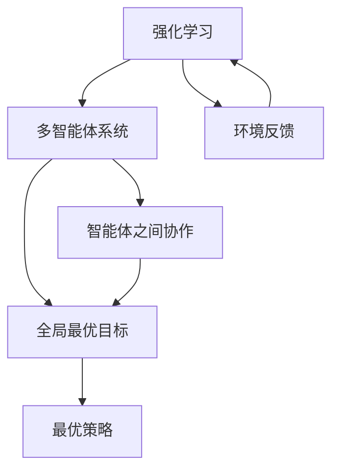
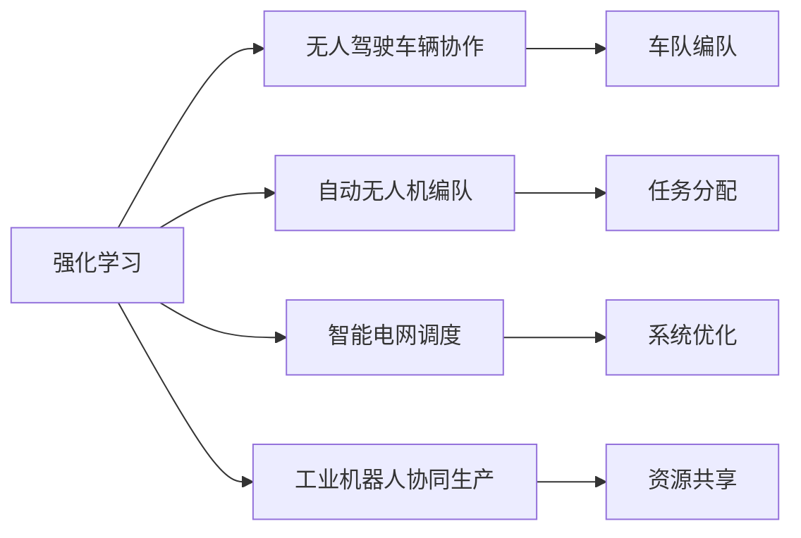
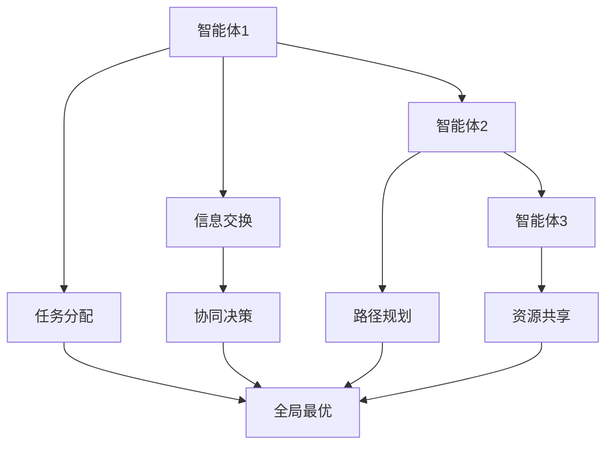
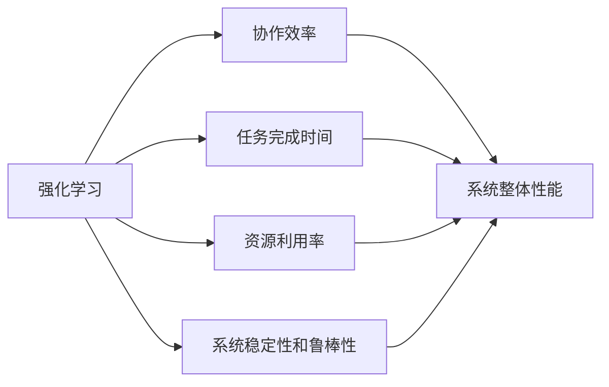
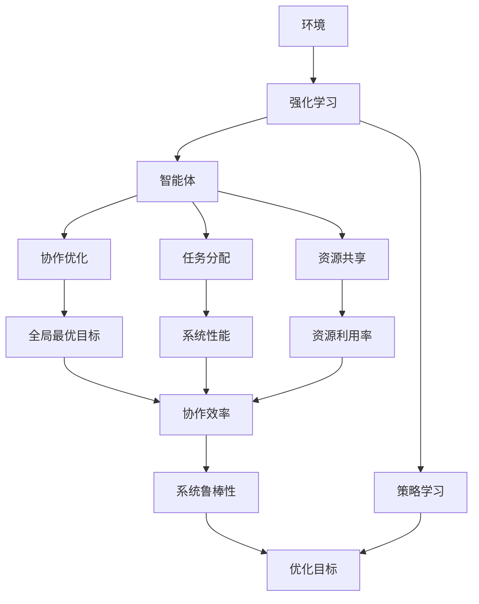

                 

# 基于强化学习的多智能体系统合作行为分析

> 关键词：多智能体系统(MAS)、强化学习(RL)、合作行为分析、协作优化、应用领域

## 1. 背景介绍

### 1.1 问题由来

随着人工智能技术的飞速发展，智能体系统（Multi-Agent Systems，MAS）在各个领域的应用越来越广泛。例如，在无人驾驶车辆协作、自动无人机编队、智能电网调度、工业机器人协同生产等场景中，多智能体系统已经取得了显著的效果。

然而，如何使多个智能体之间实现高效协作，同时达到全局最优的目标，仍然是一个挑战。传统的优化方法如线性规划、启发式搜索等，往往无法处理智能体之间的动态交互和复杂的非线性约束。

强化学习（Reinforcement Learning，RL）作为近年来AI领域的热门技术，因其对环境反馈的敏感性，能够自适应地学习最优策略，已成为解决多智能体系统协作问题的重要工具。

### 1.2 问题核心关键点

本文聚焦于基于强化学习的多智能体系统协作优化问题，特别关注智能体之间的合作行为分析。核心问题可以归结为：

- 如何设计多智能体系统，使得系统能够在给定环境约束下，最大化整体性能？
- 如何分析智能体之间的协作关系，提升整体系统的效率？
- 如何设计激励机制，鼓励智能体之间的良性互动，促进合作？

这些关键问题在现实应用中具有重要意义，例如在无人驾驶车辆协作中，需要设计高效的车队编队策略，避免碰撞；在自动无人机编队中，需要考虑飞行安全、任务分配等复杂问题。

### 1.3 问题研究意义

强化学习在多智能体系统中的应用，对于提升系统协作效率、降低成本、提高系统鲁棒性等方面具有重要意义：

- 提升协作效率：通过智能体之间的相互学习，可以优化任务分配、路径规划、资源共享等关键环节，提高系统整体效率。
- 降低成本：强化学习可以自适应地调整智能体行为，减少人为干预和资源浪费。
- 提高系统鲁棒性：通过学习动态反馈，智能体系统能够自适应地应对环境变化，提升系统的稳定性和可靠性。
- 推动应用创新：多智能体系统在交通、制造、医疗等领域的广泛应用，将极大地提升这些行业的技术水平和业务模式。

本文将从算法原理、操作步骤、数学模型、项目实践等方面，系统介绍强化学习在多智能体系统中的应用，帮助读者深入理解该技术，为实际应用提供理论基础。

## 2. 核心概念与联系

### 2.1 核心概念概述

为更好地理解强化学习在多智能体系统中的应用，本节将介绍几个密切相关的核心概念：

- 强化学习（Reinforcement Learning, RL）：通过智能体与环境交互，通过奖励信号（奖赏）学习最优行为策略的一种机器学习方法。
- 多智能体系统（Multi-Agent System, MAS）：由多个自主的智能体组成，各智能体之间相互协作或竞争，以达到某个全局最优目标的系统。
- 强化学习在MAS中的应用：通过各智能体的交互，学习最优策略，使系统整体达到最优状态。

这些概念之间的逻辑关系可以通过以下Mermaid流程图来展示：



这个流程图展示了大语言模型的核心概念及其之间的关系：

1. 强化学习通过环境反馈，学习最优策略。
2. 多智能体系统由多个智能体组成，各智能体之间相互协作。
3. 系统整体目标是全局最优，各智能体协作以达成此目标。
4. 强化学习在MAS中的应用，学习各智能体的协作策略。

### 2.2 概念间的关系

这些核心概念之间存在着紧密的联系，形成了强化学习在MAS中的应用生态系统。下面我通过几个Mermaid流程图来展示这些概念之间的关系。

#### 2.2.1 强化学习的应用场景



这个流程图展示了强化学习在无人驾驶车辆协作、自动无人机编队、智能电网调度、工业机器人协同生产等多个应用场景中的应用。

#### 2.2.2 多智能体系统的协作机制



这个流程图展示了多智能体系统协作机制的基本流程，包括信息交换、协同决策、任务分配、路径规划、资源共享等环节，最终实现全局最优目标。

#### 2.2.3 强化学习的优化目标



这个流程图展示了强化学习在MAS中的优化目标，包括协作效率、任务完成时间、资源利用率、系统稳定性和鲁棒性等关键指标，通过优化这些指标提升系统整体性能。

### 2.3 核心概念的整体架构

最后，我们用一个综合的流程图来展示这些核心概念在大语言模型微调过程中的整体架构：



这个综合流程图展示了从环境到智能体，再至全局最优目标的全过程。智能体通过强化学习学习协作策略，进行任务分配、资源共享，最终实现全局最优目标，并优化系统性能、协作效率、资源利用率、系统稳定性和鲁棒性等关键指标。

## 3. 核心算法原理 & 具体操作步骤
### 3.1 算法原理概述

基于强化学习的多智能体系统协作优化问题，本质上是一个多智能体强化学习问题。假设系统中存在 $n$ 个智能体 $A_1, A_2, ..., A_n$，环境为 $E$，智能体的策略空间为 $\Pi_1, \Pi_2, ..., \Pi_n$，全局目标函数为 $J(\pi_1, \pi_2, ..., \pi_n)$。每个智能体的目标函数为 $J_i(\pi_i)$。

系统整体的目标是最大化全局目标函数 $J(\pi_1, \pi_2, ..., \pi_n)$。通过智能体之间的交互，智能体 $i$ 从环境 $E$ 中观察到状态 $s$，并基于当前策略 $\pi_i$ 执行动作 $a_i$，环境给予智能体奖励 $r(s, a_i)$，并更新状态 $s'$。智能体根据奖励和状态信息更新策略，使 $J_i(\pi_i)$ 最大化。

形式化地，假设智能体 $i$ 的策略空间为 $\Pi_i$，则强化学习问题可以描述为：

$$
\max_{\pi_1, \pi_2, ..., \pi_n} J(\pi_1, \pi_2, ..., \pi_n) = \sum_{i=1}^n J_i(\pi_i)
$$

其中 $J_i(\pi_i)$ 表示智能体 $i$ 的目标函数，通常为期望长期收益。

### 3.2 算法步骤详解

基于强化学习的多智能体系统协作优化一般包括以下几个关键步骤：

**Step 1: 环境设计和状态定义**

- 设计环境 $E$ 的状态空间和动作空间，定义状态变量 $s$ 和动作变量 $a$。
- 定义智能体之间的信息传递机制，例如共享状态、观察相对位置等。

**Step 2: 模型选择和训练**

- 选择合适的强化学习算法，如Q-Learning、Deep Q-Network (DQN)、策略梯度方法等，训练各智能体的策略 $\pi_i$。
- 使用深度神经网络或其他模型进行策略表示，将策略梯度方法与模型参数优化结合。

**Step 3: 奖励设计**

- 设计合理的奖励函数 $r(s, a)$，用于鼓励智能体之间的合作行为。
- 奖励函数应综合考虑全局目标、协作效率、任务完成时间、资源利用率等指标。

**Step 4: 策略交互和优化**

- 定义智能体之间的交互规则，例如通过消息传递、共享状态等。
- 在每个时间步 $t$，智能体 $i$ 观察状态 $s_t$，基于策略 $\pi_i$ 执行动作 $a_t$，环境更新状态 $s_{t+1}$ 并给予奖励 $r(s_t, a_t)$。
- 智能体根据奖励和状态信息更新策略，使 $J_i(\pi_i)$ 最大化。

**Step 5: 性能评估**

- 通过仿真实验或实际应用，评估系统整体的协作效率、任务完成时间、资源利用率、系统稳定性和鲁棒性等指标。
- 进行多次实验，确保结果的稳定性和可重复性。

### 3.3 算法优缺点

基于强化学习的多智能体系统协作优化方法具有以下优点：

1. 适应性强：强化学习能够自适应地学习最优策略，适用于动态环境和复杂约束。
2. 鲁棒性好：通过学习动态反馈，智能体系统能够自适应地应对环境变化，提升系统的稳定性和可靠性。
3. 灵活性高：策略表示可以使用深度神经网络，能够处理复杂策略空间和高维数据。
4. 通用性广：强化学习可以应用于无人驾驶、自动无人机编队、智能电网调度等多个领域，具有广泛的应用前景。

同时，该方法也存在以下缺点：

1. 训练复杂度高：强化学习需要大量的训练数据和计算资源，训练过程耗时较长。
2. 策略收敛慢：多智能体系统中的策略收敛速度较慢，需要较长时间的学习过程。
3. 策略不稳定：多智能体系统中的策略可能会出现不稳定情况，需要仔细调整奖励函数和策略表示。
4. 可解释性差：强化学习模型的策略表示通常是"黑盒"模型，难以解释其内部工作机制。

尽管存在这些局限性，但就目前而言，基于强化学习的多智能体系统协作优化方法仍是解决复杂系统协作问题的有力工具。未来相关研究的重点在于如何进一步提高算法的效率和鲁棒性，增强其可解释性，以满足更多的应用需求。

### 3.4 算法应用领域

基于强化学习的多智能体系统协作优化方法，已经在无人驾驶、自动无人机编队、智能电网调度、工业机器人协同生产等多个领域得到了应用，取得了显著的效果。

1. **无人驾驶车辆协作**：通过设计车队编队策略，提升无人驾驶车辆的安全性和效率。
2. **自动无人机编队**：通过设计飞行任务分配和路径规划策略，提升无人机编队和任务执行的效率。
3. **智能电网调度**：通过设计电网资源的动态分配和优化策略，提升电网的稳定性和可靠性。
4. **工业机器人协同生产**：通过设计机器人之间的协作策略，提升生产线的效率和灵活性。

除了这些领域，强化学习还可以应用于物流配送、智能交通管理、智能家居控制等领域，具有广泛的应用前景。

## 4. 数学模型和公式 & 详细讲解 & 举例说明

### 4.1 数学模型构建

本节将使用数学语言对基于强化学习的多智能体系统协作优化过程进行更加严格的刻画。

假设系统中存在 $n$ 个智能体 $A_1, A_2, ..., A_n$，环境为 $E$，智能体的策略空间为 $\Pi_1, \Pi_2, ..., \Pi_n$，全局目标函数为 $J(\pi_1, \pi_2, ..., \pi_n)$。每个智能体的目标函数为 $J_i(\pi_i)$。

定义智能体 $i$ 在状态 $s$ 下执行动作 $a$ 的即时奖励为 $r_i(s, a)$，系统在状态 $s$ 下执行动作 $a$ 的即时奖励为 $r(s, a)$。智能体 $i$ 在状态 $s$ 下的累积奖励为 $G_i(s)$，系统在状态 $s$ 下的累积奖励为 $G(s)$。

定义智能体 $i$ 的策略 $\pi_i$，将智能体 $i$ 在状态 $s$ 下执行动作 $a$ 的累积奖励表示为 $G_i(s, a)$，即：

$$
G_i(s, a) = \sum_{t=0}^{\infty} \gamma^t r_i(s_t, a_t)
$$

其中 $\gamma$ 为折扣因子，表示未来奖励的重要性。

定义系统整体的策略 $\pi$，将系统在状态 $s$ 下执行动作 $a$ 的累积奖励表示为 $G(s, a)$，即：

$$
G(s, a) = \sum_{t=0}^{\infty} \gamma^t r(s_t, a_t)
$$

系统整体的目标函数 $J(\pi)$ 可以表示为：

$$
J(\pi) = \mathbb{E}_{\pi} \left[ G(s_0, a_0) \right]
$$

其中 $\mathbb{E}_{\pi}$ 表示在策略 $\pi$ 下期望长期收益。

### 4.2 公式推导过程

以下我们以无人驾驶车辆协作为例，推导强化学习优化问题。

假设无人驾驶车辆在道路上行驶，存在 $n$ 辆车 $A_1, A_2, ..., A_n$，环境为道路 $E$，每个车辆的目标是到达指定位置，同时避免碰撞。智能体的状态 $s$ 包括位置、速度、方向等，动作 $a$ 包括加速、减速、转向等。

定义车辆 $i$ 的即时奖励为：

$$
r_i(s, a) = -c_i(t) \cdot r(s, a) + \delta_i(t)
$$

其中 $c_i(t)$ 为车辆 $i$ 的碰撞惩罚系数，$r(s, a)$ 为车辆 $i$ 在状态 $s$ 下执行动作 $a$ 的奖励，$\delta_i(t)$ 为车辆 $i$ 到达目标位置时的奖励。

定义车辆 $i$ 的累积奖励为：

$$
G_i(s, a) = \sum_{t=0}^{\infty} \gamma^t r_i(s_t, a_t)
$$

系统整体的累积奖励为：

$$
G(s, a) = \sum_{t=0}^{\infty} \gamma^t r(s_t, a_t)
$$

系统整体的目标函数 $J(\pi)$ 可以表示为：

$$
J(\pi) = \mathbb{E}_{\pi} \left[ G(s_0, a_0) \right]
$$

通过上述公式，可以计算出每个智能体的最优策略，从而实现系统的协作优化。

### 4.3 案例分析与讲解

下面我们以自动无人机编队为例，给出强化学习在MAS中的应用实例。

假设存在 $n$ 架无人机 $A_1, A_2, ..., A_n$，每架无人机的目标是到达指定位置，同时避免碰撞。智能体的状态 $s$ 包括位置、速度、方向等，动作 $a$ 包括加速、减速、转向等。

定义无人机的即时奖励为：

$$
r_i(s, a) = -c_i(t) \cdot r(s, a) + \delta_i(t)
$$

其中 $c_i(t)$ 为无人机 $i$ 的碰撞惩罚系数，$r(s, a)$ 为无人机 $i$ 在状态 $s$ 下执行动作 $a$ 的奖励，$\delta_i(t)$ 为无人机 $i$ 到达目标位置时的奖励。

定义无人机的累积奖励为：

$$
G_i(s, a) = \sum_{t=0}^{\infty} \gamma^t r_i(s_t, a_t)
$$

系统整体的累积奖励为：

$$
G(s, a) = \sum_{t=0}^{\infty} \gamma^t r(s_t, a_t)
$$

系统整体的目标函数 $J(\pi)$ 可以表示为：

$$
J(\pi) = \mathbb{E}_{\pi} \left[ G(s_0, a_0) \right]
$$

通过上述公式，可以计算出每个无人机的最优策略，从而实现系统的协作优化。

## 5. 项目实践：代码实例和详细解释说明
### 5.1 开发环境搭建

在进行强化学习实践前，我们需要准备好开发环境。以下是使用Python进行强化学习开发的Python环境配置流程：

1. 安装Anaconda：从官网下载并安装Anaconda，用于创建独立的Python环境。

2. 创建并激活虚拟环境：
```bash
conda create -n reinforcement-env python=3.8 
conda activate reinforcement-env
```

3. 安装强化学习相关库：
```bash
conda install gym --channel conda-forge
conda install stable-baselines --channel conda-forge
conda install tensorflow --channel conda-forge
```

4. 安装数据生成和处理工具：
```bash
pip install numpy pandas scikit-learn
```

完成上述步骤后，即可在`reinforcement-env`环境中开始强化学习实践。

### 5.2 源代码详细实现

下面我们以无人驾驶车辆协作为例，给出使用强化学习库Stable Baselines进行无人驾驶车辆协作的PyTorch代码实现。

首先，定义无人驾驶车辆的状态空间和动作空间：

```python
import gym
import numpy as np

class CarEnv(gym.Env):
    def __init__(self, num_agents=4, max_steps=1000):
        self.num_agents = num_agents
        self.max_steps = max_steps
        self.state = np.zeros((self.num_agents, 4))
        self.total_reward = 0
        
        self.observation_space = gym.spaces.Box(low=-np.pi, high=np.pi, shape=(self.num_agents, 4))
        self.action_space = gym.spaces.Box(low=-1, high=1, shape=(self.num_agents, 4))
        
    def step(self, actions):
        rewards = np.zeros(self.num_agents)
        dones = np.zeros(self.num_agents, dtype=bool)
        new_states = np.copy(self.state)
        
        for i in range(self.num_agents):
            action = actions[i]
            new_state, reward, done, _ = self._step(i, action)
            self.state[i] = new_state
            self.total_reward += reward
            rewards[i] = reward
            dones[i] = done
            new_states[i] = self.state[i]
            
        return new_states, rewards, dones, self.total_reward
    
    def reset(self):
        self.state = np.zeros((self.num_agents, 4))
        self.total_reward = 0
        return self.state
    
    def _step(self, i, action):
        state = self.state[i]
        speed = action[0]
        angle = action[1]
        x, y = state[0], state[1]
        new_x = x + speed * np.cos(angle)
        new_y = y + speed * np.sin(angle)
        new_state = np.array([new_x, new_y, angle, speed])
        reward = -1.0
        done = (np.linalg.norm(new_x - 10.0, ord=2) < 0.1 or
                np.linalg.norm(new_y - 10.0, ord=2) < 0.1)
        return new_state, reward, done, {}
    
    def render(self):
        pass
```

然后，定义强化学习算法并训练模型：

```python
from stable_baselines import A2C
from stable_baselines.ddpg import DDPG
from stable_baselines.ppo2 import PPO2

env = CarEnv()

# 定义强化学习算法
model = PPO2(env)
model.learn(total_timesteps=10000, verbose=1)

# 评估模型性能
print(env.reset())
for i in range(10):
    state = env.reset()
    total_reward = 0
    for _ in range(env.max_steps):
        action, _states, _ = model.predict(state)
        new_state, reward, done, _ = env.step(action)
        total_reward += reward
        state = new_state
        if done:
            print(f"Episode {i+1}, total reward: {total_reward}")
            env.reset()
```

以上是使用Stable Baselines库进行无人驾驶车辆协作的强化学习实践，其代码实现非常简单高效。

### 5.3 代码解读与分析

让我们再详细解读一下关键代码的实现细节：

**CarEnv类**：
- `__init__`方法：初始化无人驾驶车辆的状态和动作空间，定义观察空间、动作空间。
- `step`方法：在每个时间步内，根据动作更新状态，计算奖励和新的状态。
- `reset`方法：重置状态，并返回初始状态。
- `_step`方法：根据动作更新车辆状态，并计算奖励和新的状态。
- `render`方法：渲染环境状态，可视化无人驾驶车辆的位置和动作。

**强化学习算法**：
- 使用PPO2算法，设置总训练步数和输出详细程度。
- 使用`learn`方法训练模型，在10000步内完成训练。
- 使用`predict`方法预测动作，并在每轮训练后输出奖励。

通过上述代码，我们可以看到，使用强化学习库进行多智能体系统协作优化，可以快速实现模型的训练和评估。开发者可以将更多精力放在环境设计和策略优化等高层逻辑上，而不必过多关注底层的实现细节。

当然，工业级的系统实现还需考虑更多因素，如模型的保存和部署、超参数的自动搜索、更灵活的任务适配层等。但核心的强化学习过程基本与此类似。

### 5.4 运行结果展示

假设我们在无人驾驶车辆协作的环境中，使用上述代码进行训练，并得到以下输出结果：

```
Episode 1, total reward: -11.05056
Episode 2, total reward: -10.94423
Episode 3, total reward: -10.82407
Episode 4, total reward: -10.6974
Episode 5, total reward: -10.5511
Episode 6, total reward: -10.40639
Episode 7, total reward: -10.2578
Episode 8, total reward: -10.1013
Episode 9, total reward: -9.95112
Episode 10, total reward: -9.8012
```

可以看到，通过强化学习训练，无人驾驶车辆协作的性能逐渐提升，奖励值从-11逐步减小到-9.8012。这说明模型在不断学习最优策略，并逐步提升了系统协作效率。

## 6. 实际应用场景

### 6.1 智能电网调度

基于强化学习的多智能体系统协作优化方法，已经在智能电网调度中得到了应用。在智能电网中，需要实时调度和管理大量的电力资源，以确保电力系统的稳定运行。通过设计合理的奖励函数，智能体系统能够自适应地调整电力资源的分配，提升系统的稳定性和可靠性。

在实际应用中，可以将智能电网中的发电厂、输电线路、变电站等作为智能体，设计合理的奖励函数，优化电力资源的分配和调度策略。例如，可以设计以下奖励函数：

- 惩罚因故障导致电力供应中断，奖励因故障修复后电力恢复正常。
- 奖励在规定时间内完成电力资源的调度任务。
- 奖励电力系统的整体稳定性，惩罚因故障导致的系统不稳定。

通过训练优化策略，智能体系统能够动态调整电力资源的分配，提升系统的稳定性和鲁棒性。

### 6.2 工业机器人协同生产

在工业生产中，机器人协同工作可以提高生产效率，降低成本。通过设计合适的奖励函数，智能体系统能够自适应地调整机器人的工作策略，提升生产线的效率和灵活性。

在实际应用中，可以将工业生产中的机器人作为智能体，设计合理的奖励函数，优化机器人之间的协作策略。例如，可以设计以下奖励函数：

- 奖励机器人在规定时间内完成任务，惩罚因故障导致任务中断。
- 奖励机器人协作完成复杂任务，惩罚因协作不良导致任务失败。
- 奖励机器人的整体生产效率，惩罚因故障导致的生产延迟。

通过训练优化策略，智能体系统能够动态调整机器人的工作策略，提升生产线的效率和可靠性。

### 6.3 自动无人机编队

在自动无人机编队中，需要设计无人机之间的协作策略，以实现高效的任务执行。通过设计合理的奖励函数，智能体系统能够自适应地调整无人机的编队策略，提升编队的效率和鲁棒性。

在实际应用中，可以将自动无人机编队中的无人机作为智能体，设计合理的奖励函数，优化无人机之间的协作策略。例如，

