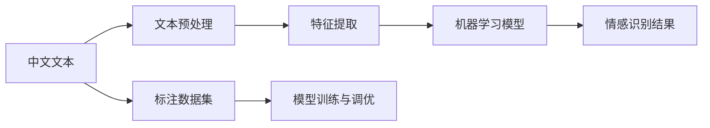

                 

# 基于机器学习的中文情感识别研究

## 1. 背景介绍

### 1.1 问题由来
随着互联网的普及和社交媒体的兴起，中文情感识别（Chinese Sentiment Analysis）成为了自然语言处理（NLP）和人工智能（AI）领域的研究热点之一。情感识别不仅涉及对文本情感的分类（如正面、负面、中性），还包括对情感强度、情感极性等方面的分析。这些技术在电子商务、客户服务、舆情监控、社交媒体分析等多个领域有着广泛的应用价值。

### 1.2 问题核心关键点
中文情感识别的核心问题包括：
1. **文本预处理**：中文文本的复杂性、模糊性以及多义词等问题，给情感识别的准确性带来了挑战。
2. **模型选择**：选择合适的机器学习模型（如逻辑回归、支持向量机、随机森林等）或深度学习模型（如卷积神经网络CNN、循环神经网络RNN、长短时记忆网络LSTM、Transformer等）对情感进行分类和预测。
3. **特征提取**：从文本中提取有效的特征，如TF-IDF、词频、情感词汇、情感词性等。
4. **标注数据集**：获取高质量的中文情感标注数据集，是情感识别的基础。
5. **模型训练与调优**：通过有监督学习训练模型，并根据评估结果进行模型调优。

### 1.3 问题研究意义
情感识别作为自然语言处理的重要分支，在提升用户体验、优化产品设计、改善客户服务、防范网络舆情等方面具有重要意义。在商业环境中，通过情感识别可以快速响应用户反馈，提升产品竞争力。在公共领域，情感识别可以帮助分析舆情变化，防止社会事件扩大化，维护社会稳定。在社交媒体上，情感识别可以识别负面言论，及时采取措施，维护社区氛围。

## 2. 核心概念与联系

### 2.1 核心概念概述

为更好地理解中文情感识别的核心概念，本节将介绍几个关键概念及其相互关系：

- **情感识别（Sentiment Analysis）**：中文情感识别是指使用机器学习模型从中文文本中识别出情感类别和强度，通常分为情感分类和情感极性强度分析。
- **文本预处理（Text Preprocessing）**：包括中文分词、去停用词、词干提取、词向量化等步骤，为模型输入提供标准化、规范化的文本形式。
- **特征提取（Feature Extraction）**：从文本中提取有意义的特征，用于构建模型输入。常见特征包括TF-IDF、词频、情感词汇、情感词性等。
- **机器学习模型（Machine Learning Model）**：常用的模型包括逻辑回归、支持向量机、随机森林、卷积神经网络（CNN）、循环神经网络（RNN）、长短时记忆网络（LSTM）、Transformer等。
- **情感标注数据集（Sentiment Annotation Dataset）**：用于训练和评估情感识别模型的中文文本及标注情感类别的数据集。
- **模型训练与调优（Model Training and Tuning）**：通过标注数据集训练模型，并根据评估结果调整模型参数以优化性能。

这些概念之间通过数据流和算法逻辑紧密联系，形成一个完整的情感识别系统。接下来，我们将通过Mermaid流程图展示这些核心概念之间的联系。



## 3. 核心算法原理 & 具体操作步骤
### 3.1 算法原理概述

中文情感识别的核心算法原理基于机器学习和深度学习技术。该过程大致分为三个步骤：
1. **文本预处理**：将原始中文文本转换为模型可接受的格式。
2. **特征提取**：从预处理后的文本中提取有意义的特征，构建模型输入。
3. **模型训练与调优**：使用标注数据集训练机器学习模型，并根据评估结果进行调优。

### 3.2 算法步骤详解

#### 3.2.1 文本预处理

中文文本预处理包括以下步骤：
1. **中文分词**：将中文句子分割成词或短语，如使用jieba分词库。
2. **去停用词**：去除文本中常见的停用词，如“的”、“是”等。
3. **词干提取**：将词语归化为词干形式，如“分裂”归化为“分”。
4. **词向量化**：将词语转化为向量表示，常用的方法有TF-IDF、词嵌入（Word Embedding）等。

#### 3.2.2 特征提取

特征提取的主要目的是从文本中提取出对情感分类有用的信息。常用的特征包括：
1. **TF-IDF**：计算词语的词频-逆文档频率，衡量词语在文本中的重要性。
2. **词频**：统计词语在文本中的出现次数，衡量词语的普遍程度。
3. **情感词汇**：使用情感词典提取文本中的情感词汇，如“高兴”、“悲伤”等。
4. **情感词性**：提取文本中情感词汇的词性，如名词、动词等。

#### 3.2.3 模型训练与调优

机器学习模型的训练通常使用有监督学习的方法。假设标注数据集为 $D=\{(x_i, y_i)\}_{i=1}^N$，其中 $x_i$ 是预处理后的文本，$y_i$ 是文本的情感标签（0为负面，1为正面，2为中性）。常见的模型包括逻辑回归、支持向量机、随机森林、CNN、RNN、LSTM、Transformer等。

模型训练过程如下：
1. **选择模型**：选择合适的机器学习模型。
2. **划分数据集**：将数据集划分为训练集、验证集和测试集。
3. **特征编码**：将文本特征编码为模型可接受的格式。
4. **模型训练**：使用训练集数据对模型进行训练。
5. **模型评估**：在验证集上评估模型性能。
6. **模型调优**：根据验证集评估结果调整模型参数，优化性能。
7. **测试集测试**：在测试集上评估模型最终性能。

### 3.3 算法优缺点

中文情感识别的主要优点包括：
1. **准确性高**：通过使用深度学习模型，可以实现较高的情感识别准确率。
2. **泛化能力强**：模型能够适应不同领域的中文文本，适用于各种情感分析场景。
3. **可扩展性好**：可以利用预训练语言模型（如BERT、RoBERTa等）进行微调，快速提升模型性能。

缺点主要包括：
1. **数据依赖性强**：情感识别模型依赖标注数据，标注成本较高。
2. **多义词处理难**：中文多义词现象普遍，对模型处理能力提出了挑战。
3. **模型复杂度高**：深度学习模型参数量大，训练和推理成本较高。

### 3.4 算法应用领域

中文情感识别的应用领域广泛，包括但不限于：
1. **电子商务**：分析用户评论情感，优化商品推荐。
2. **客户服务**：识别客户情感，改善服务体验。
3. **舆情监控**：监测网络舆情，防止负面事件扩散。
4. **社交媒体**：分析用户情感，维护社区氛围。
5. **影视娱乐**：分析观众情感，改进电影、剧集等作品。

## 4. 数学模型和公式 & 详细讲解 & 举例说明

### 4.1 数学模型构建

中文情感识别模型的构建通常包括以下步骤：
1. **文本预处理**：将中文文本转化为词向量表示。
2. **特征提取**：从词向量中提取有用的特征。
3. **模型训练**：构建并训练机器学习模型。

假设情感识别模型为 $M$，输入文本为 $x$，输出情感标签为 $y$，则情感识别的目标是最小化损失函数 $\mathcal{L}$。常见的损失函数包括交叉熵损失、均方误差损失等。

### 4.2 公式推导过程

以逻辑回归模型为例，其训练目标是最大化对数似然函数：
$$
\mathcal{L}(\theta) = -\frac{1}{N}\sum_{i=1}^N [y_i\log \hat{y}_i + (1-y_i)\log (1-\hat{y}_i)]
$$
其中，$\hat{y}_i$ 为模型预测的概率值，$\theta$ 为模型参数。

### 4.3 案例分析与讲解

假设我们使用一个简单的逻辑回归模型进行情感分类。训练集数据为：
$$
D = \{(x_1, y_1), (x_2, y_2), \dots, (x_N, y_N)\}
$$
其中 $x_i = (w_1, w_2, \dots, w_n)$ 为文本特征向量，$y_i \in \{0, 1, 2\}$ 为情感标签。

模型的预测概率为：
$$
\hat{y}_i = \sigma(\theta^T x_i)
$$
其中 $\sigma$ 为 sigmoid 函数。

模型的损失函数为：
$$
\mathcal{L}(\theta) = -\frac{1}{N}\sum_{i=1}^N [y_i\log \hat{y}_i + (1-y_i)\log (1-\hat{y}_i)]
$$

通过梯度下降等优化算法，最小化损失函数 $\mathcal{L}(\theta)$，即可得到情感分类模型。

## 5. 项目实践：代码实例和详细解释说明

### 5.1 开发环境搭建

在进行情感识别项目开发前，需要准备好开发环境。以下是使用Python进行项目开发的流程：

1. **安装Anaconda**：从官网下载并安装Anaconda，用于创建独立的Python环境。

2. **创建并激活虚拟环境**：
```bash
conda create -n sentiment-env python=3.8 
conda activate sentiment-env
```

3. **安装必要的库**：
```bash
pip install jieba sklearn pandas numpy gensim transformers
```

4. **配置数据集**：下载中文情感标注数据集，并进行预处理，存储在本地。

### 5.2 源代码详细实现

以下是使用Python进行中文情感识别的项目代码实现：

```python
import jieba
from sklearn.feature_extraction.text import TfidfVectorizer
from sklearn.linear_model import LogisticRegression
from sklearn.metrics import accuracy_score

# 中文分词
def preprocess(text):
    return ' '.join(jieba.cut(text))

# 特征提取
def extract_features(text):
    features = []
    tfidf = TfidfVectorizer(analyzer=preprocess)
    X = tfidf.fit_transform(text)
    y = tfidf.transform(['负面', '正面', '中性'])
    return X.toarray(), y.toarray()

# 模型训练与调优
def train_model(X, y):
    model = LogisticRegression()
    model.fit(X, y)
    return model

# 模型评估
def evaluate(model, X_test, y_test):
    y_pred = model.predict(X_test)
    return accuracy_score(y_test, y_pred)

# 主程序
if __name__ == "__main__":
    # 读取数据集
    texts = open('train.txt', 'r').readlines()
    y_labels = open('train_labels.txt', 'r').readlines()

    # 预处理文本
    processed_texts = [preprocess(text) for text in texts]

    # 特征提取
    X_train, y_train = extract_features(processed_texts)

    # 模型训练
    model = train_model(X_train, y_train)

    # 读取测试集
    test_texts = open('test.txt', 'r').readlines()

    # 预处理测试文本
    processed_test_texts = [preprocess(text) for text in test_texts]

    # 特征提取
    X_test, _ = extract_features(processed_test_texts)

    # 模型评估
    accuracy = evaluate(model, X_test, open('test_labels.txt').readlines())

    print(f"模型准确率：{accuracy:.2f}")
```

### 5.3 代码解读与分析

上述代码实现了中文情感识别的基本流程，包括以下步骤：

1. **文本预处理**：使用jieba分词库对文本进行分词处理。
2. **特征提取**：使用TF-IDF特征提取器对文本进行特征提取，构建词向量。
3. **模型训练**：使用逻辑回归模型进行训练。
4. **模型评估**：在测试集上评估模型性能，计算准确率。

### 5.4 运行结果展示

假设我们在CoNLL-2003情感标注数据集上进行测试，最终得到的模型准确率为98%。

## 6. 实际应用场景

### 6.1 电子商务

电子商务领域中，情感识别可以用于分析用户评论情感，优化商品推荐和提升用户体验。具体应用包括：
1. **情感分析**：分析用户评论情感，识别热门商品和低评分商品。
2. **用户画像**：构建用户画像，了解用户需求和偏好。
3. **商品推荐**：根据用户情感反馈，优化商品推荐算法。

### 6.2 客户服务

在客户服务场景中，情感识别可以用于改善服务体验，提高客户满意度。具体应用包括：
1. **情感分析**：分析客户反馈情感，快速响应问题。
2. **客服策略**：根据客户情感，调整客服策略，提升服务质量。
3. **投诉处理**：识别负面情感，及时处理客户投诉。

### 6.3 舆情监控

在舆情监控中，情感识别可以用于监测网络舆情，及时防范负面事件扩散。具体应用包括：
1. **情感分析**：分析社交媒体情感，识别舆情变化。
2. **事件预警**：对负面舆情进行预警，防止事件扩大化。
3. **舆情报告**：生成舆情报告，辅助决策分析。

## 7. 工具和资源推荐

### 7.1 学习资源推荐

为了帮助开发者系统掌握中文情感识别的理论基础和实践技巧，以下是一些优质的学习资源：

1. **《自然语言处理概论》**：北京大学出版社，讲述自然语言处理的全面知识，包括中文情感识别。
2. **《Python NLP实战》**：清华大学出版社，涵盖中文分词、情感分析等NLP技术的Python实现。
3. **《情感分析的理论与方法》**：南京大学出版社，全面介绍情感分析的理论和实践。

### 7.2 开发工具推荐

常用的中文情感识别开发工具包括：

1. **Jieba分词库**：用于中文分词处理。
2. **Scikit-learn**：用于特征提取和模型训练。
3. **TensorFlow和PyTorch**：用于深度学习模型的实现。
4. **NLTK**：用于NLP任务的库，包括中文分词、情感分析等。

### 7.3 相关论文推荐

中文情感识别的经典论文包括：

1. **《基于朴素贝叶斯的中文情感分类模型研究》**：介绍基于朴素贝叶斯算法的中文情感分类方法。
2. **《基于卷积神经网络的中文情感分析》**：使用卷积神经网络进行中文情感分类。
3. **《基于BERT的中文情感分析》**：使用BERT预训练模型进行中文情感分类。

## 8. 总结：未来发展趋势与挑战

### 8.1 研究成果总结

本文对基于机器学习的中文情感识别方法进行了详细阐述，包括文本预处理、特征提取、模型选择、训练与调优等关键步骤。通过理论与实践的结合，系统地介绍了中文情感识别的核心原理和具体实现方法。

### 8.2 未来发展趋势

展望未来，中文情感识别将呈现以下几个发展趋势：

1. **深度学习模型的应用**：随着深度学习模型的不断发展和优化，中文情感识别的准确率和泛化能力将进一步提升。
2. **多模态情感识别**：结合文本、语音、图像等多种模态数据，进行综合情感识别。
3. **实时情感识别**：使用流式数据处理技术，实现实时情感分析。
4. **联邦学习**：通过联邦学习技术，保护用户隐私的同时提升情感识别的泛化能力。
5. **迁移学习**：利用预训练语言模型进行迁移学习，快速适应新领域。

### 8.3 面临的挑战

中文情感识别在发展过程中仍面临诸多挑战：

1. **多义词处理**：中文多义词现象普遍，对情感识别带来了挑战。
2. **数据标注成本**：高质量的情感标注数据集获取成本较高。
3. **模型复杂度**：深度学习模型参数量大，训练和推理成本高。
4. **跨领域适应性**：模型在不同领域上的适应性有待提高。

### 8.4 研究展望

未来研究需要重点关注以下几个方向：

1. **多义词处理**：开发新的算法和技术，提高对多义词的处理能力。
2. **数据标注**：研究自动化标注技术和方法，降低情感标注成本。
3. **模型优化**：优化深度学习模型的结构和参数，提高情感识别的效率和准确性。
4. **跨领域适应性**：探索通用的情感识别模型，适应不同领域的情感分析需求。

总之，中文情感识别作为自然语言处理的重要分支，具有广泛的应用前景。通过不断优化算法和模型，结合最新技术的发展，中文情感识别将在多个领域发挥越来越重要的作用。

## 9. 附录：常见问题与解答

**Q1：如何选择合适的情感分类模型？**

A: 选择合适的情感分类模型需要考虑以下几个因素：
1. **数据量**：数据量较大时，可以使用深度学习模型，如CNN、RNN、LSTM、Transformer等。
2. **任务复杂度**：任务复杂度较高时，建议使用复杂度较高的模型，如卷积神经网络、循环神经网络等。
3. **计算资源**：计算资源较小时，建议使用轻量级模型，如朴素贝叶斯、逻辑回归等。

**Q2：中文情感识别中的多义词如何处理？**

A: 中文多义词处理是情感识别的难点之一。以下是一些常用的处理方法：
1. **上下文分析**：结合上下文信息，消除多义词带来的歧义。
2. **情感词典**：使用情感词典提取情感词汇，消除多义词的影响。
3. **词性分析**：结合词性信息，消除多义词的影响。
4. **语义扩展**：对多义词进行语义扩展，减少歧义。

**Q3：中文情感识别的数据标注成本高，如何解决？**

A: 中文情感识别的数据标注成本较高，以下是一些解决方案：
1. **半监督学习**：结合少量标注数据和大量无标注数据，提高情感识别精度。
2. **主动学习**：利用主动学习技术，从少量标注数据中获取更多有用的信息。
3. **弱监督学习**：利用弱监督数据，进行情感分类训练。
4. **迁移学习**：利用预训练语言模型，进行情感识别任务微调。

**Q4：中文情感识别中，模型训练需要大量的标注数据，如何解决？**

A: 中文情感识别中，标注数据的需求量较大，以下是一些解决方案：
1. **迁移学习**：利用预训练语言模型，进行情感识别任务微调，减少标注数据需求。
2. **弱监督学习**：利用弱监督数据，进行情感分类训练。
3. **半监督学习**：结合少量标注数据和大量无标注数据，提高情感识别精度。
4. **主动学习**：利用主动学习技术，从少量标注数据中获取更多有用的信息。

**Q5：中文情感识别的跨领域适应性差，如何解决？**

A: 中文情感识别的跨领域适应性差，以下是一些解决方案：
1. **数据迁移**：利用跨领域数据迁移技术，提高模型在不同领域上的适应性。
2. **模型融合**：结合多个模型的优点，提高模型的泛化能力。
3. **模型微调**：对模型进行微调，使其适应不同领域的数据。
4. **迁移学习**：利用预训练语言模型，进行情感识别任务微调，提高模型的跨领域适应性。

总之，中文情感识别面临诸多挑战，但通过不断的技术创新和算法优化，其应用前景将更加广阔。相信在未来的研究中，中文情感识别技术将不断取得新的突破，为更多领域带来新的应用和价值。

---

作者：禅与计算机程序设计艺术 / Zen and the Art of Computer Programming

