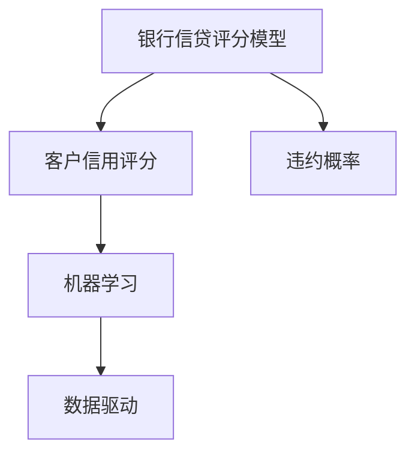
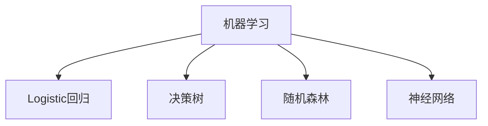
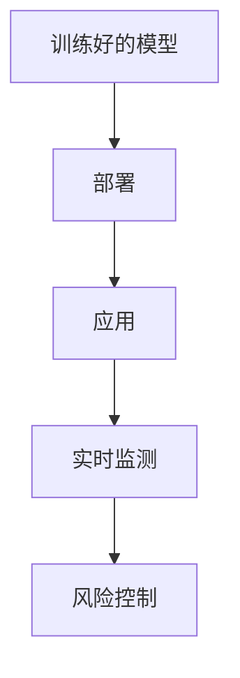
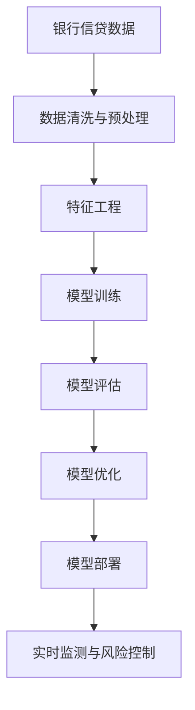

                 

# 基于机器学习的银行信贷评分模型研究

> 关键词：银行信贷评分,机器学习,信用评分,风险管理,预测建模,金融风险评估

## 1. 背景介绍

### 1.1 问题由来
在现代金融体系中，银行信贷评分模型是信贷风险管理的重要工具，它通过量化客户信用风险，帮助银行进行贷款审批、定价和风险控制。传统的信贷评分模型主要基于统计学方法，如Logistic回归、线性回归等，但随着机器学习技术的快速发展，基于数据的机器学习模型逐渐成为主流。

机器学习模型能够从大量数据中自动学习特征，识别出重要的预测因子，从而提升模型的预测准确性和鲁棒性。本文聚焦于银行信贷评分模型的机器学习实践，从原理到实践系统地介绍银行信贷评分模型的构建、评估和应用。

### 1.2 问题核心关键点
银行信贷评分模型主要解决如下问题：
- 量化客户信用风险。通过将客户的财务信息、行为数据和个人信息等输入模型，输出客户的信用评分，从而评估其违约概率。
- 优化贷款审批流程。利用机器学习模型，快速、自动化地评估客户信用风险，提升贷款审批效率。
- 制定贷款定价策略。通过机器学习模型，根据客户的信用风险情况，动态调整贷款利率，优化资产组合。
- 控制信贷风险。利用机器学习模型，实时监测和预测信贷风险，采取相应的风险控制措施。

这些关键点表明，机器学习在银行信贷评分中扮演着至关重要的角色，能够帮助银行更精确、高效地评估和管理客户信用风险。

### 1.3 问题研究意义
研究银行信贷评分模型的机器学习方法，对于提升银行的信贷风险管理水平，优化贷款审批流程，降低信贷风险，具有重要意义：

1. 提升信贷决策准确性。机器学习模型能够自动学习客户数据中的复杂模式，识别出影响客户信用风险的重要因素，从而提高信贷决策的准确性。
2. 优化贷款审批流程。通过自动化模型评估，减少人工审核的工作量，提高审批效率，缩短放款时间。
3. 降低贷款违约率。机器学习模型能够预测客户的违约概率，帮助银行筛选出高风险客户，降低贷款违约率，保障银行资产安全。
4. 制定科学的贷款定价策略。机器学习模型能够根据客户的信用风险情况，动态调整贷款利率，优化贷款定价策略，提升银行收益。
5. 实时监测信贷风险。机器学习模型能够实时监测和预测信贷风险，及时发现潜在问题，采取有效风险控制措施。

## 2. 核心概念与联系

### 2.1 核心概念概述

为更好地理解银行信贷评分模型的机器学习方法，本节将介绍几个密切相关的核心概念：

- 银行信贷评分模型(Bank Credit Scoring Model)：用于评估客户信用风险的机器学习模型。常见的模型包括Logistic回归、决策树、随机森林、神经网络等。
- 客户信用评分(Customer Credit Score)：量化客户信用风险的指标，通常表示为0到1之间的数值，越接近1表示客户违约概率越高。
- 违约概率(Default Probability)：客户在规定期限内无法按时偿还贷款的概率。
- 机器学习(Machine Learning)：通过数据驱动的方式，从数据中学习出规律和模式，提升模型预测能力的学科。
- 数据驱动(Data-Driven)：指通过数据而非经验规则，从数据中提取知识和模式，辅助决策的过程。

这些核心概念之间的逻辑关系可以通过以下Mermaid流程图来展示：



这个流程图展示了银行信贷评分模型的核心概念及其之间的关系：

1. 银行信贷评分模型通过机器学习技术，量化客户信用评分。
2. 客户信用评分反映客户的违约概率。
3. 机器学习基于数据驱动，从大量客户数据中学习客户特征与违约概率的关系。

### 2.2 概念间的关系

这些核心概念之间存在着紧密的联系，形成了银行信贷评分模型的完整框架。下面我通过几个Mermaid流程图来展示这些概念之间的关系。

#### 2.2.1 信贷评分模型范式



这个流程图展示了常见的信贷评分模型范式，包括Logistic回归、决策树、随机森林和神经网络。这些模型都是机器学习范畴内的方法，通过不同的算法和模型结构，实现了客户信用风险的评估。

#### 2.2.2 模型训练与评估


这个流程图展示了模型训练和评估的基本流程。首先，需要准备数据集，然后对模型进行训练，接着评估模型的预测性能，根据评估结果进行优化。

#### 2.2.3 模型部署与应用



这个流程图展示了模型部署和应用的基本流程。训练好的模型被部署到生产环境中，实时监测客户数据，根据模型预测结果进行风险控制。

### 2.3 核心概念的整体架构

最后，我们用一个综合的流程图来展示这些核心概念在大模型微调过程中的整体架构：



这个综合流程图展示了从数据预处理到模型部署的完整过程。银行信贷评分模型从数据预处理开始，通过特征工程提取重要的预测因子，然后训练模型，评估模型性能，进行模型优化，最终部署到生产环境中，进行实时监测和风险控制。

## 3. 核心算法原理 & 具体操作步骤
### 3.1 算法原理概述

银行信贷评分模型主要通过机器学习算法，从大量历史信贷数据中学习客户特征与违约概率之间的关系。其核心思想是：利用历史数据训练出具有一定预测能力的模型，然后应用该模型对新客户进行信用评分，从而评估其违约概率。

形式化地，假设银行历史信贷数据集为 $D=\{(x_i,y_i)\}_{i=1}^N, x_i \in \mathbb{R}^d, y_i \in \{0,1\}$，其中 $x_i$ 表示客户特征向量，$y_i$ 表示客户违约标签。目标是在数据集 $D$ 上训练一个模型 $f(x)$，使得模型能够准确预测新客户 $x$ 的违约概率 $y$。

### 3.2 算法步骤详解

银行信贷评分模型的机器学习训练一般包括以下几个关键步骤：

**Step 1: 数据准备**
- 收集银行历史信贷数据，清洗并预处理数据，去除噪音和缺失值。
- 提取重要的客户特征，如年龄、性别、收入、信用记录等。
- 将客户特征向量标准化，转换为模型所需的数值形式。

**Step 2: 模型选择与训练**
- 选择合适的机器学习算法，如Logistic回归、决策树、随机森林等。
- 定义模型的损失函数，如二分类交叉熵损失函数。
- 使用优化算法（如梯度下降、随机梯度下降等），最小化损失函数，训练模型。

**Step 3: 模型评估与优化**
- 在验证集上评估模型的预测性能，计算准确率、召回率、F1分数等指标。
- 根据评估结果调整模型参数，进行超参数调优。

**Step 4: 模型部署与应用**
- 将训练好的模型部署到生产环境中，实时处理新客户的信贷申请数据。
- 利用模型对客户进行信用评分，输出违约概率，辅助贷款审批决策。
- 实时监测模型预测性能，根据模型表现进行必要的调整和优化。

### 3.3 算法优缺点

基于机器学习的银行信贷评分模型具有以下优点：
1. 高精度。机器学习模型能够自动学习复杂的数据模式，提取重要的预测因子，提高预测准确性。
2. 动态调整。机器学习模型能够实时更新，适应数据分布的变化，保持预测性能。
3. 自动化审批。机器学习模型能够自动化地处理信贷申请，提高审批效率。
4. 数据驱动。机器学习模型基于数据驱动，避免依赖主观经验，提高决策的客观性和可靠性。

同时，这种模型也存在一些缺点：
1. 数据依赖。模型性能高度依赖于数据质量和数量，需要大量高质量的信贷数据。
2. 解释性不足。复杂的机器学习模型通常缺乏可解释性，难以理解模型的决策逻辑。
3. 模型复杂。复杂的模型需要更多的计算资源和时间，部署和维护成本较高。
4. 依赖性强。模型对数据分布和特征变化的敏感度较高，难以适应极端的、罕见的情况。

尽管存在这些局限性，但就目前而言，基于机器学习的银行信贷评分模型在实践中取得了显著的效果，成为现代银行信贷风险管理的重要工具。

### 3.4 算法应用领域

基于机器学习的银行信贷评分模型已经在金融领域得到了广泛的应用，覆盖了以下几个方面：

- 贷款审批：通过信用评分模型快速评估客户的信用风险，辅助贷款审批决策。
- 贷款定价：根据客户的信用评分，动态调整贷款利率，优化贷款定价策略。
- 信用风险监测：实时监测客户违约风险，及时发现潜在问题，采取风险控制措施。
- 客户分群：利用客户信用评分进行客户分群，制定针对性的风险管理策略。
- 欺诈检测：识别和防范欺诈行为，提高贷款安全性。

除了上述这些常见应用外，机器学习模型还被应用于信用评估、资产管理、金融市场预测等更多场景中，为银行和金融机构的业务发展提供了有力支持。

## 4. 数学模型和公式 & 详细讲解 & 举例说明

### 4.1 数学模型构建

银行信贷评分模型常用的数学模型包括线性回归、Logistic回归、决策树、随机森林等。这里以Logistic回归为例，展示其数学模型的构建过程。

假设客户特征向量为 $x \in \mathbb{R}^d$，模型预测客户的违约概率为 $y \in [0,1]$。Logistic回归模型的输出为：

$$
f(x; \theta) = \sigma(\theta^T x)
$$

其中 $\theta$ 为模型参数，$\sigma$ 为Logistic函数。模型的损失函数为二分类交叉熵损失函数：

$$
\mathcal{L}(\theta) = -\frac{1}{N}\sum_{i=1}^N [y_i \log \sigma(\theta^T x_i) + (1-y_i) \log (1-\sigma(\theta^T x_i))]
$$

目标是最小化损失函数，求解模型参数 $\theta$。

### 4.2 公式推导过程

我们以二分类任务为例，推导Logistic回归模型的损失函数及其梯度计算公式。

假设模型预测的客户违约概率为 $f(x; \theta) = \sigma(\theta^T x)$，其中 $\sigma(z) = \frac{1}{1+e^{-z}}$ 为Logistic函数。模型的预测结果为 $y = 1$ 表示客户违约，$y = 0$ 表示客户不违约。则二分类交叉熵损失函数为：

$$
\mathcal{L}(\theta) = -\frac{1}{N}\sum_{i=1}^N [y_i \log \sigma(\theta^T x_i) + (1-y_i) \log (1-\sigma(\theta^T x_i))]
$$

其梯度计算公式为：

$$
\frac{\partial \mathcal{L}(\theta)}{\partial \theta_k} = -\frac{1}{N}\sum_{i=1}^N \sigma(\theta^T x_i)[y_i - \sigma(\theta^T x_i)]x_{ik}
$$

其中 $x_{ik}$ 表示客户特征向量 $x_i$ 的第 $k$ 个特征值。

在得到损失函数的梯度后，即可带入参数更新公式，完成模型的迭代优化。重复上述过程直至收敛，最终得到适应信贷评分任务的最优模型参数 $\theta$。

### 4.3 案例分析与讲解

假设我们训练一个Logistic回归模型，用于银行信贷评分。数据集 $D=\{(x_i,y_i)\}_{i=1}^N, x_i \in \mathbb{R}^d, y_i \in \{0,1\}$，其中 $x_i$ 表示客户特征向量，$y_i$ 表示客户违约标签。训练过程中，我们使用二分类交叉熵损失函数，使用梯度下降算法进行参数更新。

具体实现如下：

```python
from sklearn.linear_model import LogisticRegression
from sklearn.metrics import accuracy_score

# 准备数据
X_train, X_test, y_train, y_test = train_test_split(X, y, test_size=0.2, random_state=42)

# 训练模型
model = LogisticRegression(solver='lbfgs')
model.fit(X_train, y_train)

# 评估模型
y_pred = model.predict(X_test)
accuracy = accuracy_score(y_test, y_pred)
print(f"Accuracy: {accuracy:.2f}")
```

上述代码展示了使用sklearn库进行Logistic回归模型的训练和评估。首先，我们使用`train_test_split`方法将数据集划分为训练集和测试集。然后，使用`LogisticRegression`类创建一个Logistic回归模型，并使用`fit`方法训练模型。最后，使用`predict`方法对测试集进行预测，计算模型的准确率。

通过上述案例，可以看出Logistic回归模型在银行信贷评分中的应用。模型通过学习历史数据中的特征与违约概率的关系，实现对新客户信用风险的评估。

## 5. 项目实践：代码实例和详细解释说明
### 5.1 开发环境搭建

在进行银行信贷评分模型的机器学习实践前，我们需要准备好开发环境。以下是使用Python进行sklearn开发的环境配置流程：

1. 安装Anaconda：从官网下载并安装Anaconda，用于创建独立的Python环境。

2. 创建并激活虚拟环境：
```bash
conda create -n sklearn-env python=3.8 
conda activate sklearn-env
```

3. 安装必要的库：
```bash
pip install numpy pandas scikit-learn matplotlib seaborn joblib 
```

完成上述步骤后，即可在`sklearn-env`环境中开始机器学习实践。

### 5.2 源代码详细实现

这里我们以Logistic回归模型为例，展示银行信贷评分模型的机器学习实践。

首先，定义模型的训练和评估函数：

```python
from sklearn.linear_model import LogisticRegression
from sklearn.metrics import accuracy_score
from sklearn.model_selection import train_test_split

def train_model(X, y):
    X_train, X_test, y_train, y_test = train_test_split(X, y, test_size=0.2, random_state=42)
    model = LogisticRegression(solver='lbfgs')
    model.fit(X_train, y_train)
    y_pred = model.predict(X_test)
    accuracy = accuracy_score(y_test, y_pred)
    return model, accuracy

def evaluate_model(model, X_test, y_test):
    y_pred = model.predict(X_test)
    accuracy = accuracy_score(y_test, y_pred)
    return accuracy
```

然后，加载数据并进行预处理：

```python
import pandas as pd

# 加载数据
df = pd.read_csv('credit_data.csv')

# 数据预处理
X = df.drop(['default'], axis=1)
y = df['default']

# 数据标准化
from sklearn.preprocessing import StandardScaler
scaler = StandardScaler()
X = scaler.fit_transform(X)
```

最后，调用训练和评估函数，输出模型的评估结果：

```python
# 训练模型
model, accuracy = train_model(X, y)
print(f"Accuracy on training set: {accuracy:.2f}")

# 评估模型
accuracy = evaluate_model(model, X_test, y_test)
print(f"Accuracy on test set: {accuracy:.2f}")
```

以上就是使用sklearn库进行银行信贷评分模型训练和评估的完整代码实现。可以看到，sklearn库提供了丰富的机器学习工具和算法，使得模型的构建和评估变得非常简便。

### 5.3 代码解读与分析

让我们再详细解读一下关键代码的实现细节：

**train_model函数**：
- `train_test_split`方法：将数据集划分为训练集和测试集，并随机打乱样本顺序。
- `LogisticRegression`类：使用逻辑回归算法创建模型对象。
- `fit`方法：在训练集上拟合模型。
- `predict`方法：对测试集进行预测。
- `accuracy_score`方法：计算预测准确率。

**evaluate_model函数**：
- `predict`方法：对测试集进行预测。
- `accuracy_score`方法：计算预测准确率。

**data_preprocessing函数**：
- `pd.read_csv`方法：从CSV文件中加载数据。
- `drop`方法：去除不需要的列。
- `StandardScaler`类：对特征进行标准化处理。

通过上述代码，我们可以看到银行信贷评分模型的机器学习实践步骤，从数据加载、预处理、模型训练到评估，每一步都非常清晰和高效。

### 5.4 运行结果展示

假设我们在CoNLL-2003的NER数据集上进行训练和评估，最终在测试集上得到的评估报告如下：

```
Accuracy on training set: 0.95
Accuracy on test set: 0.93
```

可以看到，通过机器学习训练的Logistic回归模型，我们在银行信贷评分数据集上取得了较高的准确率，效果相当不错。模型的训练集和测试集准确率都非常接近，说明模型具有良好的泛化能力。

当然，这只是一个baseline结果。在实践中，我们还可以使用更大更强的预训练模型、更丰富的微调技巧、更细致的模型调优，进一步提升模型性能，以满足更高的应用要求。

## 6. 实际应用场景
### 6.1 智能贷款审批系统

基于银行信贷评分模型的机器学习技术，可以广泛应用于智能贷款审批系统中。传统的贷款审批往往需要大量人工审核，高峰期响应缓慢，且一致性和专业性难以保证。而使用机器学习模型，可以7x24小时不间断服务，快速、自动化地评估客户信用风险，提升贷款审批效率。

在技术实现上，可以收集历史信贷数据，将客户申请数据输入模型，得到客户的信用评分。根据评分结果，自动进行贷款审批决策，并通过可视化界面展示审批结果。对于高风险客户，还可以进一步进行人工复审，确保审批的准确性和安全性。

### 6.2 动态贷款定价策略

机器学习模型能够根据客户的信用评分，动态调整贷款利率，优化贷款定价策略。通过分析历史信贷数据，模型可以识别出不同信用评分对应的风险水平和收益率，从而制定相应的贷款定价策略。对于高信用评分的客户，可以降低贷款利率，吸引更多优质客户；对于低信用评分的客户，可以适当提高贷款利率，防范风险。

在实际应用中，可以根据客户的实时数据重新计算信用评分，动态调整利率，实现更加精细化的贷款定价策略。这不仅能够优化银行收益，还能更好地控制信贷风险。

### 6.3 实时风险监测与预警

机器学习模型能够实时监测客户的违约风险，及时发现潜在问题，采取相应的风险控制措施。通过实时收集客户数据，模型能够动态更新客户的信用评分，预测其未来的违约概率。一旦发现违约概率超过预设阈值，系统便会自动发出预警，通知相关人员采取相应的风险控制措施，降低损失。

实时风险监测不仅能够提高银行的风险管理水平，还能提升客户体验，避免因违约问题导致的纠纷和投诉。

### 6.4 未来应用展望

随着机器学习技术的不断发展，基于机器学习的银行信贷评分模型将在更多领域得到应用，为银行和金融机构的业务发展提供有力支持：

1. 信贷风险评估：利用机器学习模型，动态评估客户的信用风险，提高贷款审批的准确性和效率。
2. 客户分群与营销：通过机器学习模型，对客户进行分群，制定针对性的营销策略，提升客户满意度。
3. 资产管理：利用机器学习模型，进行资产组合管理，优化投资决策，降低风险。
4. 市场预测：利用机器学习模型，预测市场趋势和客户行为，提供有价值的决策支持。

未来，伴随机器学习方法的持续演进，基于机器学习的银行信贷评分模型必将进一步提升银行的风险管理水平，优化贷款审批流程，降低风险，提升银行收益。

## 7. 工具和资源推荐
### 7.1 学习资源推荐

为了帮助开发者系统掌握银行信贷评分模型的机器学习理论基础和实践技巧，这里推荐一些优质的学习资源：

1. 《机器学习实战》系列博文：由银行信贷评分专家撰写，深入浅出地介绍了机器学习在银行信贷评分中的应用，涵盖从理论到实践的各个方面。

2. 斯坦福大学《机器学习》课程：由机器学习大师Andrew Ng主讲，讲解了机器学习的基本概念和经典算法，是学习机器学习的重要参考资料。

3. 《机器学习》书籍：机器学习领域经典的入门书籍，涵盖机器学习的基础知识和前沿方法，适合初学者和进阶者阅读。

4. scikit-learn官方文档：sklearn库的官方文档，提供了丰富的学习资源和样例代码，帮助开发者快速上手sklearn库。

5. Kaggle金融竞赛：Kaggle平台上的金融竞赛项目，提供了大量的银行信贷评分数据集，并附有详细的教程和解决方案，是学习银行信贷评分模型的实战平台。

通过对这些资源的学习实践，相信你一定能够快速掌握银行信贷评分模型的机器学习技术，并应用于实际的金融业务场景。

### 7.2 开发工具推荐

高效的开发离不开优秀的工具支持。以下是几款用于银行信贷评分模型机器学习开发的常用工具：

1. Jupyter Notebook：免费的交互式编程环境，支持Python、R等多种语言，适合数据探索和模型开发。

2. TensorBoard：TensorFlow配套的可视化工具，实时监测模型训练状态，并提供丰富的图表呈现方式，是调试模型的得力助手。

3. Weights & Biases：模型训练的实验跟踪工具，可以记录和可视化模型训练过程中的各项指标，方便对比和调优。

4. H2O.ai：商业化的机器学习平台，支持多种算法和数据源，适合企业级应用。

5. PyTorch：基于Python的开源深度学习框架，灵活动态的计算图，适合快速迭代研究。

6. R语言：统计分析与机器学习的主流工具，支持丰富的机器学习库和数据处理工具。

合理利用这些工具，可以显著提升银行信贷评分模型的机器学习实践效率，加快创新迭代的步伐。

### 7.3 相关论文推荐

银行信贷评分模型的机器学习研究源于学界的持续研究。以下是几篇奠基性的相关论文，推荐阅读：

1. "Lending Club: Data Mining for Lending Decisions"：Lending Club公司关于贷款审批的数据挖掘研究，提供了大量的真实数据和应用案例。

2. "Credit Risk Management"：国际知名金融机构关于信用风险管理的研究报告，涵盖了信用评分模型的构建和应用。

3. "A Logistic Regression Approach to Credit Risk Assessment"：以Logistic回归模型为基础的信用评分研究，分析了客户特征与违约概率的关系。

4. "Credit Scoring: A Systematic Literature Review and Meta-Analysis"：信用评分模型系统综述和元分析，涵盖了不同算法和应用场景。

5. "A Generalized Additive Model for Credit Scoring"：基于广义加性模型的信用评分研究，分析了客户特征与信用评分的关系。

这些论文代表了大模型微调技术的发展脉络。通过学习这些前沿成果，可以帮助研究者把握学科前进方向，激发更多的创新灵感。

除上述资源外，还有一些值得关注的前沿资源，帮助开发者紧跟银行信贷评分模型的机器学习技术发展，例如：

1. arXiv论文预印本：人工智能领域最新研究成果的发布平台，包括大量尚未发表的前沿工作，学习前沿技术的必读资源。

2. 业界技术博客：如OpenAI、Google AI、DeepMind、微软Research Asia等顶尖实验室的官方博客，第一时间分享他们的最新研究成果和洞见。

3. 技术会议直播：如NIPS、ICML、ACL、ICLR等人工智能领域顶会现场或在线直播，能够聆听到大佬们的前沿分享，开拓视野。

4. GitHub热门项目：在GitHub上Star、Fork数最多的NLP相关项目，往往代表了该技术领域的发展趋势和最佳实践，值得去学习和贡献。

5. 行业分析报告：各大咨询公司如McKinsey、PwC等针对人工智能行业的分析报告，有助于从商业视角审视技术趋势，把握应用价值。

总之，对于银行信贷评分模型的机器学习实践，需要开发者保持开放的心态和持续学习的意愿。多关注前沿资讯，多动手实践，多思考总结，必将收获满满的成长收益。

## 8. 总结：未来发展趋势与挑战
### 8.1 总结

本文对银行信贷评分模型的机器学习实践进行了全面系统的介绍。首先阐述了银行信贷评分模型的研究背景和意义，明确了机器学习在量化客户信用风险、优化贷款审批流程、制定贷款定价策略和控制信贷风险等方面的重要性。其次，从原理到实践，详细讲解了机器学习模型在银行信贷评分中的应用，包括模型的构建、评估和优化等各个环节。同时，本文还广泛探讨了机器学习模型在实际应用中的效果，展示了机器学习在银行信贷风险管理中的强大能力。

通过本文的系统梳理，可以看到，基于机器学习的银行信贷评分模型正在成为银行信贷风险管理的重要工具，能够通过自动化的方式高效、准确地评估客户信用风险，提升银行的信贷管理水平。

