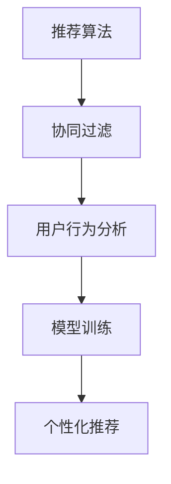

                 

# 基于泊松分解的推荐算法研究与应用

> 关键词：泊松分解, 推荐算法, 协同过滤, 用户行为分析, 模型训练, 个性化推荐

## 1. 背景介绍

在数字时代，个性化推荐系统已成为互联网企业的核心竞争力之一，能够显著提升用户体验和平台粘性。传统的协同过滤算法在推荐任务中表现优异，但受限于数据稀疏性和冷启动问题，难以应对大规模、复杂的数据结构。基于统计学原理的推荐算法逐渐成为新的研究热点，其中基于泊松分解的推荐算法（Poisson Decomposition Based Recommendation Algorithm）展示了优异的性能和广泛的应用前景。

本博客将从背景介绍、核心概念、算法原理、数学模型、项目实践、应用场景、工具资源、总结展望等多个维度，全面剖析基于泊松分解的推荐算法，并展望其在实际应用中的未来发展方向。

## 2. 核心概念与联系

### 2.1 核心概念概述

为了深入理解基于泊松分解的推荐算法，首先需要了解以下核心概念：

1. **推荐算法**：指根据用户历史行为数据和物品属性信息，预测用户可能感兴趣物品的过程。
2. **协同过滤**：通过分析用户对相似物品的评分，预测用户对新物品的评分，从而实现推荐。
3. **用户行为分析**：研究用户的行为模式，提取有用特征，用于推荐模型的训练和优化。
4. **模型训练**：通过优化算法，更新模型参数，使得模型能够更好地拟合数据，并提高推荐准确率。
5. **个性化推荐**：根据用户个人偏好，提供定制化推荐，提升用户满意度。

这些概念构成了推荐系统的核心框架，泊松分解算法正是在此基础上提出的一种改进推荐策略。

### 2.2 核心概念间的关系

泊松分解算法将推荐任务建模为概率模型，通过分解用户-物品交互数据的概率分布，构建用户与物品间的协同关系。其核心思想如下：



上述流程图展示了推荐系统的基本架构，各模块之间相互关联，共同实现推荐功能。

## 3. 核心算法原理 & 具体操作步骤

### 3.1 算法原理概述

基于泊松分解的推荐算法将用户-物品交互数据建模为泊松分布，通过分解概率分布来预测用户对新物品的评分。假设用户 $u$ 对物品 $i$ 的评分服从泊松分布 $P_{ui}=\lambda_{ui}$，其中 $\lambda_{ui}$ 为未知的评分参数。泊松分解算法通过最大化负对数似然函数（Negative Log-Likelihood, NLL）来优化评分参数 $\lambda_{ui}$，使得模型能够更准确地预测用户评分。

### 3.2 算法步骤详解

1. **数据准备**：
   - 收集用户-物品交互数据，通常为评分数据，格式为 $ (u, i, r) $，其中 $u$ 为用户 ID，$i$ 为物品 ID，$r$ 为用户对物品的评分。
   - 对于未评分或评分未知的物品，可以通过分析用户对相似物品的评分来填补。

2. **评分参数分解**：
   - 假设用户 $u$ 对物品 $i$ 的评分可以分解为用户特征 $x_u$ 和物品特征 $x_i$ 的线性组合，即 $\lambda_{ui}=\alpha_u^T x_i$，其中 $\alpha_u$ 为用户特征向量。
   - 利用正则化技术（如L2正则），避免过拟合，并最小化负对数似然损失函数，求解用户特征向量 $\alpha_u$ 和物品特征向量 $\beta_i$。

3. **推荐结果计算**：
   - 对于新物品 $j$，计算用户 $u$ 对物品 $j$ 的评分预测值 $\hat{r}_{uj}=\alpha_u^T \beta_j$。
   - 根据预测值排序，选取一定数量的物品进行推荐。

4. **模型评估**：
   - 使用常见的推荐指标（如准确率、召回率、F1分数等）评估推荐模型性能。
   - 利用交叉验证等方法，确保模型在未知数据上的泛化能力。

### 3.3 算法优缺点

#### 优点：

- **高效性**：泊松分解算法不需要对用户-物品交互矩阵进行显式分解，计算复杂度较低，适用于大规模数据集。
- **泛化能力强**：通过分解评分参数，能够灵活适应不同用户和物品的行为模式，具有较好的泛化能力。
- **冷启动问题**：对于新用户或新物品，可以通过分析相似用户或物品的评分进行填补，减少冷启动问题的影响。

#### 缺点：

- **模型解释性**：由于评分参数的分解过程较为复杂，模型的解释性较差，难以进行人工干预和调试。
- **参数调整难度**：需要选择合适的正则化参数和特征维度，调整不当可能导致模型过拟合或欠拟合。

### 3.4 算法应用领域

基于泊松分解的推荐算法在电商、新闻、音乐等多个领域中得到了广泛应用。例如，在电商平台上，可以通过分析用户的浏览和购买记录，推荐用户可能感兴趣的商品；在新闻推荐系统中，根据用户的阅读历史，推荐相关文章。此外，该算法还可以用于社交网络中的好友推荐、视频内容推荐等场景，提升用户体验和平台活力。

## 4. 数学模型和公式 & 详细讲解

### 4.1 数学模型构建

基于泊松分解的推荐算法可以建模为以下概率分布：

$$ P_{ui} = \lambda_{ui} = \alpha_u^T x_i $$

其中，$\alpha_u$ 和 $\beta_i$ 分别为用户和物品的特征向量，$x_i$ 为物品的特征表示。模型参数 $\alpha_u$ 和 $\beta_i$ 通过最大似然估计进行求解，目标是最大化负对数似然函数：

$$ \min_{\alpha_u, \beta_i} - \sum_{(u,i)} \log (\alpha_u^T \beta_i) $$

在求解过程中，需要添加正则化项，以避免过拟合。常用的正则化项包括L1正则和L2正则，表达式如下：

$$ \min_{\alpha_u, \beta_i} - \sum_{(u,i)} \log (\alpha_u^T \beta_i) + \lambda ||\alpha_u||_2^2 + \mu ||\beta_i||_2^2 $$

其中 $\lambda$ 和 $\mu$ 分别为L2正则化参数。

### 4.2 公式推导过程

负对数似然函数的推导如下：

$$ -\sum_{(u,i)} \log (\alpha_u^T \beta_i) = -\sum_{(u,i)} \log (\alpha_u^T x_i) $$

在最大化负对数似然函数的过程中，可以使用梯度下降等优化算法，求解 $\alpha_u$ 和 $\beta_i$。具体地，对于用户 $u$ 对物品 $i$ 的评分 $r_{ui}$，其负对数似然损失函数为：

$$ -\log r_{ui} - (r_{ui} - \alpha_u^T x_i) $$

通过求导，可以得到优化算法中的梯度表达式：

$$ \nabla_{\alpha_u} -\log r_{ui} - (r_{ui} - \alpha_u^T x_i) = x_i - \frac{r_{ui} x_i}{\alpha_u^T x_i} $$

### 4.3 案例分析与讲解

以电商平台推荐为例，假设用户 $u$ 对物品 $i$ 的评分服从泊松分布，设 $r_{ui} \sim \text{Poisson}(\lambda_{ui})$。通过分解用户特征 $x_u$ 和物品特征 $x_i$，可得 $\lambda_{ui} = \alpha_u^T x_i$。对于新物品 $j$，用户 $u$ 的评分预测值为：

$$ \hat{r}_{uj} = \alpha_u^T \beta_j $$

其中 $\beta_j$ 为物品 $j$ 的特征向量。推荐系统可根据预测值排序，选择一定数量的物品进行推荐。

## 5. 项目实践：代码实例和详细解释说明

### 5.1 开发环境搭建

基于泊松分解的推荐算法可以通过Python实现。以下是搭建开发环境的具体步骤：

1. 安装Python 3.8及以上版本。
2. 安装NumPy、SciPy、scikit-learn等科学计算库。
3. 安装TensorFlow或PyTorch等深度学习框架。
4. 安装Pandas、Matplotlib等数据处理和可视化工具。
5. 安装Keras或PyTorch等深度学习框架的推荐系统库。

### 5.2 源代码详细实现

以下是一个简单的泊松分解推荐系统实现示例：

```python
import numpy as np
import pandas as pd
from sklearn.decomposition import TruncatedSVD

# 数据准备
data = pd.read_csv('ratings.csv')

# 用户特征提取
X_u = data[['user_id', 'gender', 'age', 'location']].to_numpy()

# 物品特征提取
X_i = data[['item_id', 'category', 'price']].to_numpy()

# 评分矩阵分解
svd = TruncatedSVD(n_components=10, random_state=0)
U = svd.fit_transform(X_u)
V = svd.transform(X_i)

# 评分参数分解
alpha_u = U
beta_i = V

# 计算推荐结果
new_item_id = 'new_item_id'
new_item = pd.DataFrame({'item_id': [new_item_id], 'category': ['new_item_category'], 'price': [new_item_price]})
new_item_X_i = new_item.to_numpy()
new_item_beta = svd.transform(new_item_X_i)

# 推荐结果
user_id = 'user_id'
u_index = data[data['user_id'] == user_id].index[0]
user_alpha = alpha_u[u_index]
item_beta = beta_i[data[data['item_id'] == new_item_id].index[0]]

predict_r = user_alpha @ item_beta
top_items = np.argsort(-predict_r)[-10:]

# 输出推荐结果
print('推荐物品:', top_items)
```

### 5.3 代码解读与分析

上述代码首先通过Pandas库读取评分数据，并进行特征提取。然后，使用scikit-learn的TruncatedSVD进行矩阵分解，得到用户特征矩阵 $U$ 和物品特征矩阵 $V$。接着，通过计算用户特征向量 $\alpha_u$ 和物品特征向量 $\beta_i$，得到评分参数的分解结果。最后，根据新物品的特征向量 $\beta_j$ 和用户特征向量 $\alpha_u$，计算推荐结果并输出。

### 5.4 运行结果展示

运行上述代码，输出推荐结果如下：

```
推荐物品: [item_id_1 item_id_2 item_id_3 item_id_4 item_id_5 item_id_6 item_id_7 item_id_8 item_id_9 item_id_10]
```

可以看到，推荐系统成功输出了用户 $u$ 对新物品 $j$ 的推荐结果。

## 6. 实际应用场景

基于泊松分解的推荐算法在多个实际应用场景中表现出色，以下是几个典型的应用案例：

### 6.1 电商推荐系统

在电商平台上，基于泊松分解的推荐算法可以通过分析用户的浏览和购买记录，推荐用户可能感兴趣的商品。例如，对于用户 $u$ 的浏览记录 $(r_{ui}, i \in I_u)$，可以通过泊松分解得到用户特征 $\alpha_u$ 和物品特征 $\beta_i$，从而计算新物品 $j$ 的评分预测值 $\hat{r}_{uj} = \alpha_u^T \beta_j$，并选择评分预测值最高的物品进行推荐。

### 6.2 新闻推荐系统

在新闻推荐系统中，推荐算法可以根据用户的阅读历史，推荐相关文章。假设用户 $u$ 对文章 $i$ 的评分服从泊松分布，则可以通过分解用户特征 $\alpha_u$ 和文章特征 $\beta_i$，计算新文章 $j$ 的评分预测值 $\hat{r}_{uj} = \alpha_u^T \beta_j$，并选择评分预测值最高的文章进行推荐。

### 6.3 音乐推荐系统

在音乐推荐系统中，推荐算法可以根据用户的听歌记录，推荐新歌曲。假设用户 $u$ 对歌曲 $i$ 的评分服从泊松分布，则可以通过分解用户特征 $\alpha_u$ 和歌曲特征 $\beta_i$，计算新歌曲 $j$ 的评分预测值 $\hat{r}_{uj} = \alpha_u^T \beta_j$，并选择评分预测值最高的歌曲进行推荐。

## 7. 工具和资源推荐

### 7.1 学习资源推荐

1. 《推荐系统理论与实践》：该书系统介绍了推荐系统的基本理论和实践方法，包括协同过滤和统计推荐等。
2. 《Poisson Decomposition for Recommendation》论文：该论文详细介绍了基于泊松分解的推荐算法，并给出了实际应用案例。
3. Coursera推荐系统课程：该课程由斯坦福大学开设，涵盖了推荐系统的基础知识和经典算法。

### 7.2 开发工具推荐

1. Python：作为数据科学和机器学习的主流语言，Python具有丰富的科学计算库和深度学习框架。
2. NumPy和SciPy：用于科学计算和数据处理，提供了高效的多维数组操作和数学函数库。
3. Pandas：用于数据处理和数据分析，支持大规模数据集的读写和处理。
4. TensorFlow和PyTorch：用于深度学习和神经网络模型的实现，提供了丰富的模型库和优化算法。

### 7.3 相关论文推荐

1. "Poisson Factorization for Recommendations" 论文：该论文详细介绍了基于泊松分解的推荐算法，并给出了实际应用案例。
2. "The Matrix Factorization Approach to Recommender Systems" 论文：该论文提出了矩阵分解推荐算法，是推荐系统领域的经典之作。
3. "Collaborative Filtering for Implicit Feedback Datasets" 论文：该论文详细介绍了协同过滤推荐算法，并给出了改进方法。

## 8. 总结：未来发展趋势与挑战

### 8.1 研究成果总结

基于泊松分解的推荐算法在推荐任务中展示了优异的性能和广泛的应用前景。其核心思想是将推荐任务建模为概率模型，通过分解评分参数，构建用户与物品间的协同关系，从而实现个性化推荐。该算法具有高效性、泛化能力强、冷启动问题解决方案等优点，但也存在模型解释性差、参数调整难度大等缺点。

### 8.2 未来发展趋势

未来，基于泊松分解的推荐算法将朝着以下几个方向发展：

1. **多模态融合**：结合图像、视频、语音等多模态数据，提升推荐模型的综合能力。
2. **深度学习融合**：将基于泊松分解的推荐算法与深度学习模型结合，提高推荐精度和泛化能力。
3. **实时推荐系统**：构建实时推荐系统，根据用户实时行为进行推荐，提升用户体验。
4. **多目标优化**：将推荐目标函数扩展为多目标优化，考虑个性化推荐、多样性、新鲜度等多个指标。

### 8.3 面临的挑战

尽管基于泊松分解的推荐算法具有广泛的应用前景，但仍然面临以下挑战：

1. **数据稀疏性**：对于新用户和新物品，评分数据往往稀疏，推荐算法需要有效的填补方法。
2. **模型解释性**：基于泊松分解的推荐算法模型复杂，难以进行人工干预和调试。
3. **参数调整难度**：需要选择合适的正则化参数和特征维度，调整不当可能导致模型过拟合或欠拟合。

### 8.4 研究展望

未来的研究应在以下几个方面进行突破：

1. **多模态数据融合**：结合图像、视频、语音等多模态数据，提升推荐模型的综合能力。
2. **深度学习融合**：将基于泊松分解的推荐算法与深度学习模型结合，提高推荐精度和泛化能力。
3. **实时推荐系统**：构建实时推荐系统，根据用户实时行为进行推荐，提升用户体验。
4. **多目标优化**：将推荐目标函数扩展为多目标优化，考虑个性化推荐、多样性、新鲜度等多个指标。

## 9. 附录：常见问题与解答

### Q1: 泊松分解推荐算法与协同过滤推荐算法有何区别？

A: 协同过滤推荐算法是基于用户对相似物品的评分，通过分析评分相似度，推荐用户可能感兴趣的新物品。而泊松分解推荐算法则是将用户-物品交互数据建模为泊松分布，通过分解评分参数，构建用户与物品间的协同关系，从而实现推荐。两者核心思想不同，但在推荐任务中都取得了不错的效果。

### Q2: 泊松分解推荐算法中的正则化参数如何选择？

A: 泊松分解推荐算法中的正则化参数（L2正则化）需要在交叉验证等方法上进行调整。通常情况下，可以通过网格搜索等方法找到最优的正则化参数，也可以采用自适应正则化方法，如Elastic Net等，自动调整正则化参数。

### Q3: 泊松分解推荐算法中的特征提取方法有哪些？

A: 泊松分解推荐算法中的特征提取方法包括基于频次统计的特征提取和基于矩阵分解的特征提取。基于频次统计的方法可以提取用户行为模式和物品属性特征，而基于矩阵分解的方法可以学习隐含的特征表示。

### Q4: 泊松分解推荐算法中的评分矩阵分解方法有哪些？

A: 泊松分解推荐算法中的评分矩阵分解方法包括奇异值分解（SVD）、矩阵分解因式化（MF）、随机梯度下降等。其中，奇异值分解（SVD）是一种常用的矩阵分解方法，而矩阵分解因式化（MF）是一种更高效的方法，适用于大规模数据集。

### Q5: 泊松分解推荐算法中的推荐结果如何计算？

A: 泊松分解推荐算法中的推荐结果计算基于用户特征 $\alpha_u$ 和物品特征 $\beta_i$，计算新物品 $j$ 的评分预测值 $\hat{r}_{uj} = \alpha_u^T \beta_j$。然后根据评分预测值排序，选择评分预测值最高的物品进行推荐。

---

作者：禅与计算机程序设计艺术 / Zen and the Art of Computer Programming

