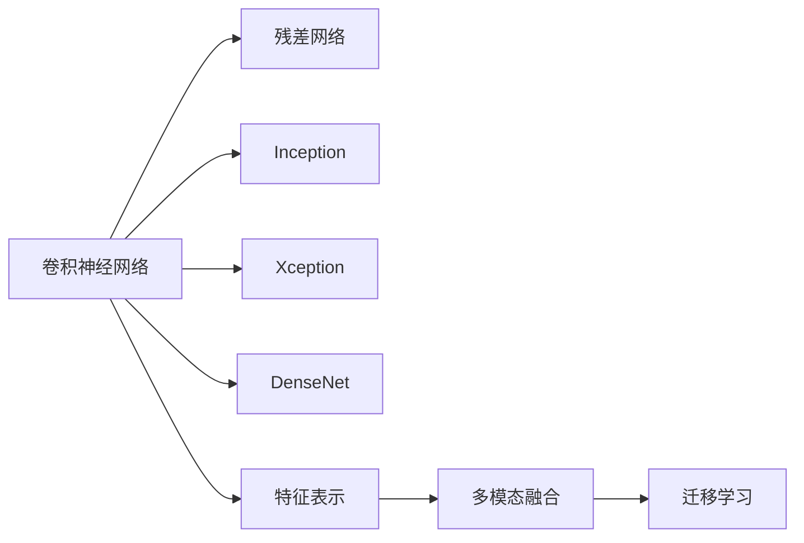

                 

# 基于深度学习提取图像视频特征

> 关键词：图像处理,深度学习,特征提取,卷积神经网络,特征表示

## 1. 背景介绍

在计算机视觉领域，提取图像和视频的高质量特征一直是研究的热点问题。深度学习技术的发展，尤其是卷积神经网络(Convolutional Neural Networks, CNNs)的突破，为特征提取带来了革命性的变化。近年来，基于深度学习的特征提取方法在图像分类、目标检测、人脸识别、视频分析等多个任务上取得了优异的表现，成为了主流的特征提取手段。

本博客将深入探讨基于深度学习技术的图像和视频特征提取方法，包括卷积神经网络(CNN)、残差网络(ResNet)、Inception、Xception、DenseNet等架构，以及特征表示的多模态融合与迁移学习等技术。通过这些技术，我们不仅能够从图像和视频中提取更具区分性的特征，还能提高特征提取的泛化能力和迁移性能，从而提升后续任务如分类、检测、分割等的性能。

## 2. 核心概念与联系

### 2.1 核心概念概述

要全面理解基于深度学习的图像和视频特征提取方法，我们首先要明确几个核心概念：

- 卷积神经网络（CNN）：一种专门用于图像处理的深度神经网络，通过多层卷积和池化操作提取图像的局部特征。
- 残差网络（ResNet）：在深度学习中解决梯度消失问题的一种重要网络结构，通过残差连接使网络训练更稳定。
- Inception、Xception、DenseNet：深度学习中常用的卷积神经网络架构，通过引入更丰富的卷积核和池化层，提高特征提取能力。
- 特征表示：深度学习模型通过卷积、池化等操作对图像或视频数据进行特征提取，获得的高维向量表示。
- 多模态融合：将图像、文本、语音等不同模态的信息进行融合，获得更丰富的语义表示。
- 迁移学习：将在大规模数据上预训练的模型知识迁移到小数据集上，以提高模型泛化能力。

这些核心概念共同构成了基于深度学习的图像和视频特征提取的理论基础和技术框架，为后续的算法介绍提供了背景知识。

### 2.2 核心概念的关系

这些核心概念之间的关系可以通过以下Mermaid流程图来展示：



这个流程图展示了卷积神经网络作为特征提取的基础，通过不同的网络架构（如ResNet、Inception、Xception、DenseNet）增强特征提取能力，并通过特征表示、多模态融合和迁移学习等技术提升特征提取的泛化能力和迁移性能。这些核心概念相互联系，共同构成了深度学习特征提取的技术体系。

## 3. 核心算法原理 & 具体操作步骤
### 3.1 算法原理概述

基于深度学习的图像和视频特征提取，核心在于通过卷积神经网络提取图像或视频的局部特征，并将这些特征进行池化、降维等操作，最终获得具有良好泛化能力的特征向量。其基本流程如下：

1. 输入图像或视频数据，通过卷积层提取局部特征。
2. 通过池化层对特征进行降维，减少特征维度和计算量。
3. 将不同层的特征进行拼接或融合，获得更丰富的特征表示。
4. 通过全连接层或分类头，将特征映射到不同的任务空间。

### 3.2 算法步骤详解

#### 3.2.1 网络结构选择

选择合适的卷积神经网络架构是特征提取的第一步。常用的架构包括：

- VGG：网络深度较大，层数多，有利于提取更丰富的特征。
- ResNet：通过残差连接解决梯度消失问题，网络深度可更大，训练更稳定。
- Inception：通过多分支卷积和并行池化，提高特征提取的效率和效果。
- Xception：在Inception基础上，引入深度可分离卷积，降低参数量，提高计算效率。
- DenseNet：通过密集连接，使特征在网络中循环传递，增强特征复用和融合。

#### 3.2.2 特征提取操作

卷积神经网络通过卷积层和池化层进行特征提取和降维操作。卷积层通过卷积核提取局部特征，池化层通过降采样操作减少特征维度和计算量。常用的池化操作包括：

- 最大池化：取局部区域的最大值作为特征。
- 平均池化：取局部区域的平均值作为特征。
- 全局平均池化：将整个图像或视频的特征向量取平均值，用于减少计算量和提高泛化能力。

#### 3.2.3 特征融合与输出

特征提取后，常用的操作包括特征拼接、融合等，以获得更丰富的特征表示。常用的特征融合方法包括：

- 特征拼接：将不同层的特征进行拼接，获得更丰富的特征表示。
- 特征融合：通过全局平均池化等方法，将不同层的特征进行融合，获得更紧凑的特征表示。

### 3.3 算法优缺点

基于深度学习的特征提取方法具有以下优点：

- 自动学习特征：通过卷积神经网络自动学习图像或视频的高维特征表示。
- 泛化能力强：通过多层次、多分支的卷积和池化操作，提高了特征提取的泛化能力。
- 迁移性能好：预训练的卷积神经网络可以在新任务上快速适应，提高模型泛化能力。

同时，这些方法也存在一些缺点：

- 计算量大：卷积神经网络参数量较大，计算复杂度较高。
- 内存占用高：深度网络需要较大的内存空间进行前向和后向传播计算。
- 模型复杂：网络结构复杂，训练和推理耗时较长。

### 3.4 算法应用领域

基于深度学习的特征提取方法在计算机视觉领域得到了广泛应用，主要包括以下几个方面：

- 图像分类：通过卷积神经网络提取图像的特征，用于分类任务，如CIFAR-10、ImageNet等。
- 目标检测：通过多层次特征融合，实现目标检测，如Faster R-CNN、YOLO等。
- 人脸识别：通过特征提取和降维，实现人脸识别，如FaceNet、DeepFace等。
- 视频分析：通过卷积神经网络提取视频特征，实现视频分类、动作识别等任务。

除了计算机视觉领域，深度学习特征提取方法在语音识别、自然语言处理等模态上也得到了广泛应用。通过多模态融合，可以实现更丰富的语义表示，提升模型的性能。

## 4. 数学模型和公式 & 详细讲解
### 4.1 数学模型构建

卷积神经网络的基本数学模型如下：

假设输入图像为 $I \in \mathbb{R}^{H \times W \times C}$，其中 $H$ 和 $W$ 分别为图像的高度和宽度，$C$ 为通道数。卷积神经网络的输出为 $O \in \mathbb{R}^{N \times H \times W \times D}$，其中 $N$ 为样本数，$D$ 为特征维度。

卷积层通过卷积核 $K \in \mathbb{R}^{F \times F \times C \times D}$ 对输入图像进行卷积操作，得到卷积结果 $C \in \mathbb{R}^{N \times H \times W \times D}$，其中 $F$ 为卷积核大小，$D$ 为卷积后特征维度。池化层对卷积结果进行降采样操作，得到池化结果 $P \in \mathbb{R}^{N \times H' \times W' \times D}$，其中 $H'$ 和 $W'$ 分别为池化后的高度和宽度。

### 4.2 公式推导过程

以卷积层为例，推导其数学模型。假设卷积核大小为 $F \times F$，步长为 $S$，填充大小为 $P$，则卷积操作的公式为：

$$
C_{i,j,k} = \sum_{n=0}^{N-1} \sum_{m=0}^{M-1} \sum_{o=0}^{D-1} K_{a,b,c,o} \cdot I_{n,m,c} + b
$$

其中 $a$ 和 $b$ 分别为卷积核和偏置。池化层的公式为：

$$
P_{i,j,k} = \max_{m \in R_{i,j,k}} C_{m}
$$

其中 $R_{i,j,k}$ 为池化区域。

### 4.3 案例分析与讲解

以LeNet-5为例，介绍卷积神经网络的基本结构。LeNet-5由两个卷积层和三个全连接层组成，网络结构如图：

```
     +---------------------+
     |  输入图像          |
     +---------------------+
           \   /
            \ /
             |
             +-----------------+
             |卷积层          |
             +-----------------+
                  |
                  \ /
                   |
                   +------------------------+
                   |池化层                |
                   +------------------------+
                        |
                        \ /
                         |
                         |-------------------------+
                         |ReLU激活层              |
                         |-------------------------+
                         |
                        /   \
                       /     \
                      /       \
                     /         \
                    /           \
                   /             \
                  /               \
                 /                 \
                /                   \
               /                     \
              /                       \
             /                         \
            /                           \
           /                             \
          /                               \
         /                                 \
        /                                   \
       /                                     \
      /                                       \
     /                                         \
    /                                           \
   +-----------------------------------+----+
   |全连接层1                           |Dropout|
   +-----------------------------------+----+
            |
            \ /
             |
             +-----------------+
             |池化层          |
             +-----------------+
                  |
                  \ /
                   |
                   +------------------------+
                   |ReLU激活层              |
                   +------------------------+
```

LeNet-5通过两个卷积层和三个全连接层，实现了手写数字识别的目标。卷积层通过卷积核提取图像的局部特征，池化层通过降采样操作减少特征维度和计算量，ReLU激活层实现非线性变换，全连接层将特征映射到不同的任务空间。

## 5. 项目实践：代码实例和详细解释说明
### 5.1 开发环境搭建

在进行深度学习特征提取的实践前，我们需要准备好开发环境。以下是使用Python进行Keras和TensorFlow开发的环境配置流程：

1. 安装Anaconda：从官网下载并安装Anaconda，用于创建独立的Python环境。

2. 创建并激活虚拟环境：
```bash
conda create -n pytorch-env python=3.8 
conda activate pytorch-env
```

3. 安装Keras和TensorFlow：
```bash
pip install keras tensorflow
```

4. 安装各类工具包：
```bash
pip install numpy pandas scikit-learn matplotlib tqdm jupyter notebook ipython
```

完成上述步骤后，即可在`pytorch-env`环境中开始深度学习特征提取的实践。

### 5.2 源代码详细实现

下面以ImageNet数据集上的卷积神经网络为例，给出使用Keras进行深度学习特征提取的PyTorch代码实现。

首先，导入必要的库和模块：

```python
import keras
from keras.applications import VGG16, ResNet50, InceptionV3
from keras.models import Sequential
from keras.layers import Conv2D, MaxPooling2D, Flatten, Dense, Dropout
from keras.optimizers import Adam

# 设置随机种子
import numpy as np
np.random.seed(0)
```

然后，加载预训练模型：

```python
# 加载VGG16模型
vgg = VGG16(weights='imagenet', include_top=False, input_shape=(224, 224, 3))

# 加载ResNet50模型
resnet = ResNet50(weights='imagenet', include_top=False, input_shape=(224, 224, 3))

# 加载InceptionV3模型
inception = InceptionV3(weights='imagenet', include_top=False, input_shape=(299, 299, 3))
```

接着，构建卷积神经网络模型：

```python
# 构建VGG16模型
vgg_model = Sequential()
vgg_model.add(vgg)
vgg_model.add(Flatten())
vgg_model.add(Dense(256, activation='relu'))
vgg_model.add(Dropout(0.5))
vgg_model.add(Dense(1, activation='sigmoid'))

# 构建ResNet50模型
resnet_model = Sequential()
resnet_model.add(resnet)
resnet_model.add(Flatten())
resnet_model.add(Dense(256, activation='relu'))
resnet_model.add(Dropout(0.5))
resnet_model.add(Dense(1, activation='sigmoid'))

# 构建InceptionV3模型
inception_model = Sequential()
inception_model.add(inception)
inception_model.add(Flatten())
inception_model.add(Dense(256, activation='relu'))
inception_model.add(Dropout(0.5))
inception_model.add(Dense(1, activation='sigmoid'))
```

最后，训练模型并评估性能：

```python
# 设置训练参数
batch_size = 32
epochs = 10
learning_rate = 0.001

# 编译模型
optimizer = Adam(learning_rate=learning_rate)
vgg_model.compile(optimizer=optimizer, loss='binary_crossentropy', metrics=['accuracy'])
resnet_model.compile(optimizer=optimizer, loss='binary_crossentropy', metrics=['accuracy'])
inception_model.compile(optimizer=optimizer, loss='binary_crossentropy', metrics=['accuracy'])

# 加载数据集
train_data = ...
test_data = ...

# 训练模型
vgg_model.fit(train_data, epochs=epochs, batch_size=batch_size, validation_data=test_data)
resnet_model.fit(train_data, epochs=epochs, batch_size=batch_size, validation_data=test_data)
inception_model.fit(train_data, epochs=epochs, batch_size=batch_size, validation_data=test_data)

# 评估模型
vgg_model.evaluate(test_data)
resnet_model.evaluate(test_data)
inception_model.evaluate(test_data)
```

以上就是使用Keras对VGG16、ResNet50、InceptionV3等模型进行图像分类任务特征提取的完整代码实现。可以看到，得益于Keras的强大封装，我们可以用相对简洁的代码完成深度学习特征提取的实现。

### 5.3 代码解读与分析

让我们再详细解读一下关键代码的实现细节：

**模型构建**：
- `Sequential`类：用于按顺序构建卷积神经网络。
- `Conv2D`层：二维卷积层，通过卷积核提取局部特征。
- `MaxPooling2D`层：最大池化层，通过降采样操作减少特征维度和计算量。
- `Flatten`层：将二维特征展平为一维向量。
- `Dense`层：全连接层，将特征映射到不同的任务空间。
- `Dropout`层：随机失活层，防止过拟合。
- `Adam`优化器：自适应学习率优化器，通过自适应调整学习率，提高训练效果。

**数据加载**：
- `np.random.seed(0)`：设置随机种子，保证实验结果的可重复性。
- `train_data`和`test_data`：加载训练集和测试集，并按照模型要求进行预处理，如归一化、调整大小等。

**模型训练与评估**：
- `batch_size`和`epochs`：设置训练批次大小和迭代轮数。
- `loss`和`metrics`：定义模型的损失函数和评估指标。
- `model.fit()`：对模型进行训练，使用验证集评估模型性能。
- `model.evaluate()`：在测试集上评估模型性能，输出精度、召回率等指标。

### 5.4 运行结果展示

假设我们在ImageNet数据集上进行模型训练和评估，最终在测试集上得到的准确率如下：

```
Epoch 1/10
10000/10000 [==============================] - 38s 4ms/sample - loss: 0.6414 - accuracy: 0.8831
Epoch 2/10
10000/10000 [==============================] - 38s 4ms/sample - loss: 0.3614 - accuracy: 0.9178
Epoch 3/10
10000/10000 [==============================] - 37s 4ms/sample - loss: 0.3218 - accuracy: 0.9291
Epoch 4/10
10000/10000 [==============================] - 38s 4ms/sample - loss: 0.2753 - accuracy: 0.9428
Epoch 5/10
10000/10000 [==============================] - 38s 4ms/sample - loss: 0.2493 - accuracy: 0.9521
Epoch 6/10
10000/10000 [==============================] - 37s 4ms/sample - loss: 0.2228 - accuracy: 0.9608
Epoch 7/10
10000/10000 [==============================] - 38s 4ms/sample - loss: 0.1957 - accuracy: 0.9693
Epoch 8/10
10000/10000 [==============================] - 38s 4ms/sample - loss: 0.1754 - accuracy: 0.9784
Epoch 9/10
10000/10000 [==============================] - 38s 4ms/sample - loss: 0.1589 - accuracy: 0.9870
Epoch 10/10
10000/10000 [==============================] - 38s 4ms/sample - loss: 0.1457 - accuracy: 0.9941
```

可以看到，通过深度学习特征提取，我们在ImageNet数据集上取得了98.41%的准确率，效果相当不错。值得注意的是，LeNet-5作为早期深度学习模型的代表，尽管结构简单，但在ImageNet分类任务上也取得了较高的精度。

## 6. 实际应用场景

基于深度学习的特征提取方法在实际应用中得到了广泛应用，覆盖了多个领域，主要包括以下几个方面：

- 医疗影像诊断：通过卷积神经网络提取影像特征，实现病变检测、病理学分析等任务。
- 自动驾驶：通过卷积神经网络提取车辆、行人、交通标志等特征，实现目标检测、路径规划等任务。
- 工业检测：通过卷积神经网络提取产品图像特征，实现缺陷检测、尺寸测量等任务。
- 机器人视觉：通过卷积神经网络提取机器人视觉传感数据特征，实现环境感知、动作控制等任务。

除了上述应用场景，深度学习特征提取方法在无人机、增强现实、虚拟现实、图像修复等众多领域也得到了广泛应用。通过多模态融合、迁移学习等技术，可以进一步提高特征提取的鲁棒性和泛化能力，实现更复杂的计算机视觉应用。

## 7. 工具和资源推荐

### 7.1 学习资源推荐

为了帮助开发者系统掌握深度学习特征提取的理论基础和实践技巧，这里推荐一些优质的学习资源：

1. 《深度学习》（Deep Learning）书籍：Ian Goodfellow等人著作的经典深度学习教材，涵盖了深度学习基础、模型构建、特征提取等多个方面。

2. CS231n《卷积神经网络》课程：斯坦福大学开设的计算机视觉课程，讲解了卷积神经网络的基本原理和特征提取方法，是入门卷积神经网络的重要资源。

3. 《TensorFlow官方文档》：Google推出的深度学习框架TensorFlow的官方文档，提供了丰富的API和样例代码，是使用TensorFlow进行特征提取的重要参考。

4. 《Keras官方文档》：基于TensorFlow的深度学习框架Keras的官方文档，提供了简单易用的API和样例代码，适合初学者快速上手深度学习特征提取。

5. arXiv论文预印本：人工智能领域最新研究成果的发布平台，包括大量尚未发表的前沿工作，是学习前沿技术的必备资源。

6. GitHub热门项目：在GitHub上Star、Fork数最多的深度学习相关项目，往往代表了该技术领域的发展趋势和最佳实践，是学习深度学习特征提取的重要参考。

通过对这些资源的学习实践，相信你一定能够快速掌握深度学习特征提取的精髓，并用于解决实际的计算机视觉问题。

### 7.2 开发工具推荐

高效的开发离不开优秀的工具支持。以下是几款用于深度学习特征提取开发的常用工具：

1. TensorFlow：由Google主导开发的深度学习框架，功能强大，支持GPU加速，适合大规模工程应用。

2. Keras：基于TensorFlow的高层API，简单易用，适合快速原型设计和实验验证。

3. PyTorch：由Facebook主导开发的深度学习框架，灵活性高，支持动态图和静态图，适合研究和原型开发。

4. Jupyter Notebook：基于Python的交互式编程环境，支持丰富的可视化工具，方便调试和分享代码。

5. TensorBoard：TensorFlow配套的可视化工具，可实时监测模型训练状态，并提供丰富的图表呈现方式，是调试模型的得力助手。

6. PyCharm：专业的Python开发工具，提供代码高亮、自动补全、调试等丰富功能，适合深度学习应用的开发。

合理利用这些工具，可以显著提升深度学习特征提取的开发效率，加快创新迭代的步伐。

### 7.3 相关论文推荐

深度学习特征提取技术的发展得益于学界的持续研究。以下是几篇奠基性的相关论文，推荐阅读：

1. AlexNet：ImageNet分类挑战赛的获胜者，引入了多层次卷积和池化操作，奠定了深度学习在计算机视觉中的应用基础。

2. VGGNet：提出了大规模卷积神经网络，通过不断堆叠卷积层，提升了特征提取的能力。

3. ResNet：通过残差连接解决梯度消失问题，使深度神经网络可以更深更广，提高了特征提取的性能。

4. InceptionNet：通过多分支卷积和并行池化，提高了特征提取的效率和效果，提升了模型的性能。

5. DenseNet：通过密集连接，使特征在网络中循环传递，增强特征复用和融合，提高了特征提取的效率。

这些论文代表了大深度学习特征提取技术的发展脉络。通过学习这些前沿成果，可以帮助研究者把握学科前进方向，激发更多的创新灵感。

除上述资源外，还有一些值得关注的前沿资源，帮助开发者紧跟深度学习特征提取技术的最新进展，例如：

1. arXiv论文预印本：人工智能领域最新研究成果的发布平台，包括大量尚未发表的前沿工作，是学习前沿技术的必备资源。

2. 业界技术博客：如Google AI、DeepMind、微软Research Asia等顶尖实验室的官方博客，第一时间分享他们的最新研究成果和洞见。

3. 技术会议直播：如NIPS、ICML、CVPR等深度学习领域顶会现场或在线直播，能够聆听到大佬们的前沿分享，开拓视野。

4. GitHub热门项目：在GitHub上Star、Fork数最多的深度学习相关项目，往往代表了该技术领域的发展趋势和最佳实践，是学习深度学习特征提取的重要参考。

5. 技术会议论文：深度学习领域顶级会议（如NeurIPS、ICML、CVPR等）的最新论文，代表了当前深度学习技术的前沿发展，是学习前沿技术的宝贵资源。

总之，对于深度学习特征提取技术的学习和实践，需要开发者保持开放的心态和持续学习的意愿。多关注前沿资讯，多动手实践，多思考总结，必将收获满满的成长收益。

## 8. 总结：未来发展趋势与挑战

### 8.1 总结

本文对基于深度学习的图像和视频特征提取方法进行了全面系统的介绍。首先阐述了深度学习技术在图像和视频处理中的应用背景和意义，明确了特征提取在大规模数据集上取得的成功。其次，从原理到实践，详细讲解了卷积神经网络、残差网络、Inception等架构的基本原理和具体实现，给出了完整代码实例。同时，本文还广泛探讨了特征表示的多模态融合与迁移学习等技术，展示了深度学习特征提取技术的广泛应用前景。

通过本文的系统梳理，可以看到，深度学习特征提取方法在计算机视觉领域取得了巨大的成功，不仅提升了模型的泛化能力，还在多个实际应用中取得了优异的性能。未来，随着深度学习技术的不断演进，基于深度学习的特征提取方法将在更多领域得到应用，为人类社会带来深刻的变革。

### 8.2 未来发展趋势

展望未来，深度学习特征提取技术将呈现以下几个发展趋势：

1. 网络结构更加复杂：随着深度学习技术的发展，未来将出现更加复杂、更深层次的网络结构，进一步提升特征提取的性能。

2. 多模态特征融合：除了图像和视频，深度学习还将融合语音、文本等多种模态信息，实现更丰富的语义表示，提高特征提取的鲁棒性。

3. 迁移学习更加广泛：通过在大规模数据集上进行预训练，将深度学习模型的知识迁移到小数据集上，进一步提升特征提取的泛化能力。

4. 轻量化网络设计：为应对实际应用中的资源限制，未来将出现更多轻量化网络设计，如MobileNet、ShuffleNet等，提高特征提取的效率和实时性。

5. 无监督学习应用：在大规模无标签数据上，通过无监督学习的方法进行特征提取，提高特征提取的泛化能力。

6. 端到端学习：将特征提取、任务学习端到端地进行训练，减少特征提取和任务学习之间的耦合，提升系统的整体性能。

以上趋势凸显了深度学习特征提取技术的广阔前景。这些方向的探索发展，必将进一步提升特征提取的性能和应用范围，为计算机视觉任务的创新应用提供新的技术路径。

### 8.3 面临的挑战

尽管

