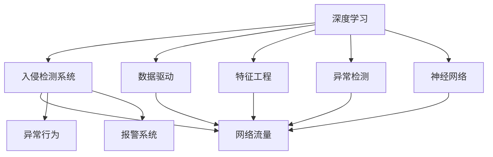
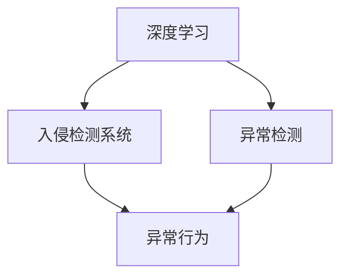
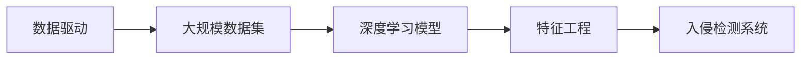
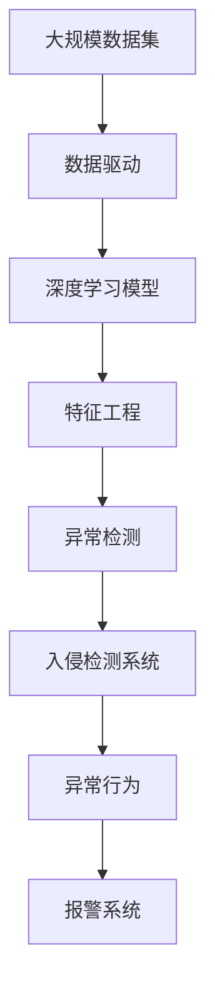

                 

## 1. 背景介绍

### 1.1 问题由来
随着信息技术的快速发展，网络安全问题变得越来越复杂和严重。黑客通过各种手段对企业和个人的网络系统进行攻击，给社会带来巨大的经济损失和数据泄露风险。传统的基于规则的入侵检测系统往往依赖于人工编写的规则，难以全面覆盖各种攻击模式，且容易受到恶意规则的误导。因此，如何构建一个高效、灵活、可扩展的入侵检测系统，成为网络安全领域亟待解决的问题。

### 1.2 问题核心关键点
基于深度学习的入侵检测系统，利用深度神经网络模型，从大量历史网络流量数据中学习异常模式的特征表示，能够自动识别并报警网络入侵行为。其核心思想是通过神经网络对大规模数据进行特征提取，并通过训练得到异常检测模型。常见的深度学习模型包括卷积神经网络(CNN)、循环神经网络(RNN)、长短时记忆网络(LSTM)、自编码器等。

### 1.3 问题研究意义
深度学习技术在大规模数据处理和复杂模式识别方面展现了强大的能力，使得基于深度学习的入侵检测系统成为网络安全领域的重要研究方向。该技术不仅能够有效检测已知和未知的入侵行为，还具有自学习、自适应能力，能够在不断变化的网络环境中保持高性能。

## 2. 核心概念与联系

### 2.1 核心概念概述

为更好地理解基于深度学习的入侵检测系统的设计与实现，本节将介绍几个密切相关的核心概念：

- 深度学习(Deep Learning)：利用多层神经网络对数据进行特征提取和模式识别，具备自动化的特征学习和泛化能力。

- 入侵检测系统(IDS)：实时监控网络流量，检测异常行为并及时报警的系统。

- 数据驱动(Data-Driven)：基于大规模数据集进行模型训练和参数优化，增强系统检测能力。

- 特征工程(Feature Engineering)：对原始数据进行预处理、归一化、特征提取等操作，提高模型的性能。

- 异常检测(Anomaly Detection)：识别数据中的异常点或模式，并进行报警或处理。

- 神经网络(Neural Network)：由多个神经元组成的网络，能够学习非线性映射关系，适用于复杂的模式识别问题。

- 卷积神经网络(CNN)：利用卷积操作提取局部特征，广泛应用于图像识别任务。

- 循环神经网络(RNN)：能够处理序列数据，常用于文本分类、时间序列预测等任务。

- 长短时记忆网络(LSTM)：RNN的变种，具有长记忆能力和梯度消失控制机制，适用于处理长序列数据。

- 自编码器(Autoencoder)：通过压缩和重构特征，实现数据的降维和特征提取，常用于图像、文本等数据的预处理。

这些核心概念之间的逻辑关系可以通过以下Mermaid流程图来展示：



这个流程图展示了大规模入侵检测系统的核心概念及其之间的关系：

1. 深度学习通过大规模数据驱动，自动学习数据特征和模式。
2. 入侵检测系统实时监控网络流量，检测异常行为并及时报警。
3. 特征工程对原始数据进行预处理和特征提取，提高模型性能。
4. 异常检测从大规模数据中识别异常点，并进行报警。
5. 神经网络构成入侵检测系统的核心模型，实现特征提取和模式识别。

这些概念共同构成了深度学习入侵检测系统的学习框架，使其能够高效地进行网络流量中的异常检测。通过理解这些核心概念，我们可以更好地把握深度学习入侵检测系统的设计思路和优化方向。

### 2.2 概念间的关系

这些核心概念之间存在着紧密的联系，形成了深度学习入侵检测系统的完整生态系统。下面我通过几个Mermaid流程图来展示这些概念之间的关系。

#### 2.2.1 深度学习在入侵检测中的作用



这个流程图展示了深度学习在入侵检测系统中的作用：利用深度神经网络模型，从大规模数据中学习异常模式的特征表示，实现自动化异常检测。

#### 2.2.2 数据驱动与特征工程的关系



这个流程图展示了数据驱动和特征工程的关系：通过收集大规模网络流量数据，驱动深度学习模型的训练和优化，同时通过特征工程对数据进行预处理和特征提取，提高模型的检测能力。

#### 2.2.3 异常检测的实现方式


这个流程图展示了异常检测的实现方式：利用深度学习模型对网络流量进行特征提取和模式识别，从中识别出异常行为，并通过报警系统进行及时处理。

### 2.3 核心概念的整体架构

最后，我们用一个综合的流程图来展示这些核心概念在大规模入侵检测系统中的整体架构：



这个综合流程图展示了从数据收集、特征提取、模型训练到异常检测和报警的完整流程。深度学习模型通过大规模数据驱动，自动学习特征表示，并由特征工程对数据进行预处理和特征提取，最后通过异常检测识别出异常行为，并由报警系统进行处理。 通过这些流程图，我们可以更清晰地理解深度学习入侵检测系统中各个组件之间的关系和作用。

## 3. 核心算法原理 & 具体操作步骤

### 3.1 算法原理概述

基于深度学习的入侵检测系统，核心思想是利用深度神经网络模型，从大规模网络流量数据中学习异常模式的特征表示，从而实现自动化的异常检测和报警。其核心算法流程如下：

1. **数据预处理**：对原始网络流量数据进行清洗、去噪、归一化等预处理操作。
2. **特征提取**：利用深度学习模型提取数据的特征表示，常用方法包括卷积神经网络(CNN)、循环神经网络(RNN)、长短时记忆网络(LSTM)等。
3. **模型训练**：在标注的正常和异常流量数据集上，训练深度学习模型，优化异常检测算法。
4. **异常检测**：实时监控网络流量，利用训练好的模型检测异常行为，并进行报警。

### 3.2 算法步骤详解

以下是基于深度学习的入侵检测系统的核心算法步骤：

#### 3.2.1 数据预处理
对原始网络流量数据进行清洗、去噪、归一化等预处理操作，具体步骤如下：

1. **数据清洗**：去除无效、异常、重复的数据包，确保数据集的质量。
2. **去噪**：去除网络流量中的噪声数据，如丢包、延迟等，提高数据的准确性。
3. **归一化**：对数据进行归一化处理，使得不同特征具有相同的尺度，便于后续特征提取和模型训练。

#### 3.2.2 特征提取
利用深度学习模型提取数据的特征表示，具体步骤如下：

1. **CNN模型**：将网络流量数据转化为图像数据，利用卷积层提取局部特征，通过池化层降低特征维度和噪声。
2. **RNN模型**：将网络流量数据转化为序列数据，利用循环神经网络提取时间序列特征，通过LSTM层控制长记忆能力。
3. **自编码器**：通过压缩和重构网络流量数据，实现数据的降维和特征提取，去除冗余和噪声。

#### 3.2.3 模型训练
在标注的正常和异常流量数据集上，训练深度学习模型，优化异常检测算法，具体步骤如下：

1. **划分数据集**：将数据集划分为训练集、验证集和测试集。
2. **定义损失函数**：选择适合异常检测任务的损失函数，如交叉熵、均方误差等。
3. **选择优化器**：选择适合的优化器，如Adam、SGD等，调整学习率、批次大小等超参数。
4. **模型训练**：在训练集上，利用反向传播算法更新模型参数，最小化损失函数。
5. **模型验证**：在验证集上评估模型性能，调整超参数。
6. **模型测试**：在测试集上测试模型性能，输出异常检测结果。

#### 3.2.4 异常检测
实时监控网络流量，利用训练好的模型检测异常行为，具体步骤如下：

1. **输入数据**：将实时网络流量数据输入模型，进行特征提取。
2. **模型预测**：利用训练好的模型预测输入数据的异常概率。
3. **阈值判断**：设定异常检测阈值，当异常概率超过阈值时，判断为异常行为。
4. **报警处理**：生成报警信息，并通知管理员或自动处理异常行为。

### 3.3 算法优缺点

基于深度学习的入侵检测系统，具有以下优点：

1. **自动化特征提取**：无需手工设计特征，自动从大规模数据中学习特征表示，提高模型的泛化能力。
2. **自学习能力**：能够自动学习异常模式的特征表示，无需手动标注大量数据。
3. **灵活性**：可以针对不同的网络流量数据和攻击模式，灵活调整模型架构和训练方法。
4. **高准确率**：通过大规模数据训练，模型在检测异常行为时具有较高的准确率和鲁棒性。

同时，该系统也存在以下缺点：

1. **计算资源消耗高**：深度学习模型通常具有大量参数，需要大量的计算资源进行训练和推理。
2. **模型解释性差**：深度学习模型通常是一个黑盒，难以解释其内部的决策逻辑和特征表示。
3. **过拟合风险**：在标注数据不足的情况下，模型容易出现过拟合现象，降低检测性能。
4. **实时性问题**：在实时检测场景中，模型推理速度可能较慢，难以满足实时性要求。

### 3.4 算法应用领域

基于深度学习的入侵检测系统，已经在多个领域得到了广泛应用，例如：

1. **网络安全**：实时监控网络流量，检测并报警各种攻击行为，如DDoS攻击、SQL注入、恶意软件等。
2. **金融安全**：监测交易行为，识别异常交易和欺诈行为，保障金融安全。
3. **医疗安全**：监控医疗数据，识别异常数据和攻击行为，保护患者隐私和数据安全。
4. **工业控制**：监测工业控制系统，检测并报警恶意攻击和异常行为，保障工业安全。
5. **智能家居**：监测家庭网络流量，检测并报警各种恶意攻击和异常行为，保障家庭安全。

除了上述这些领域，基于深度学习的入侵检测系统，还将在更多场景中得到应用，如交通监控、能源安全等，为网络安全领域带来新的突破。

## 4. 数学模型和公式 & 详细讲解 & 举例说明

### 4.1 数学模型构建

基于深度学习的入侵检测系统，数学模型主要由以下几部分组成：

1. **输入数据**：表示为 $\mathbf{x} = [x_1, x_2, ..., x_n]$，其中 $x_i$ 表示输入的第 $i$ 个特征值。
2. **模型参数**：表示为 $\mathbf{w} = [w_1, w_2, ..., w_m]$，其中 $w_i$ 表示模型的第 $i$ 个权重。
3. **隐藏层**：表示为 $\mathbf{h} = [h_1, h_2, ..., h_l]$，其中 $h_i$ 表示隐藏层的第 $i$ 个神经元。
4. **输出层**：表示为 $\mathbf{y} = [y_1, y_2, ..., y_k]$，其中 $y_i$ 表示输出的第 $i$ 个值。

### 4.2 公式推导过程

以CNN模型为例，其核心公式推导如下：

1. **卷积操作**：
   $$
   \mathbf{f}_{\mathbf{w}}(\mathbf{x}) = \mathbf{W} * \mathbf{x} + \mathbf{b}
   $$
   其中 $\mathbf{W}$ 表示卷积核，$\mathbf{b}$ 表示偏置项。

2. **池化操作**：
   $$
   \mathbf{p} = \max(\mathbf{f}_{\mathbf{w}}(\mathbf{x}))
   $$
   其中 $\max$ 表示取最大值操作。

3. **全连接层**：
   $$
   \mathbf{y} = \sigma(\mathbf{A}\mathbf{p} + \mathbf{b'})
   $$
   其中 $\sigma$ 表示激活函数，$\mathbf{A}$ 表示权重矩阵，$\mathbf{b'}$ 表示偏置项。

4. **损失函数**：
   $$
   \mathcal{L} = \frac{1}{N}\sum_{i=1}^{N}L(y_i, \hat{y_i})
   $$
   其中 $L$ 表示损失函数，$y_i$ 表示真实标签，$\hat{y_i}$ 表示模型预测标签。

5. **反向传播**：
   $$
   \frac{\partial \mathcal{L}}{\partial \mathbf{w}} = \frac{\partial \mathcal{L}}{\partial \mathbf{y}} \frac{\partial \mathbf{y}}{\partial \mathbf{p}} \frac{\partial \mathbf{p}}{\partial \mathbf{h}} \frac{\partial \mathbf{h}}{\partial \mathbf{w}}
   $$
   其中 $\frac{\partial \mathbf{y}}{\partial \mathbf{p}}$ 表示全连接层的梯度，$\frac{\partial \mathbf{p}}{\partial \mathbf{h}}$ 表示池化层的梯度，$\frac{\partial \mathbf{h}}{\partial \mathbf{w}}$ 表示卷积层的梯度。

### 4.3 案例分析与讲解

以一个简单的CNN模型为例，进行异常检测的实现。假设输入数据为网络流量数据，输出为异常检测结果。

#### 4.3.1 数据预处理
对原始网络流量数据进行清洗、去噪、归一化等预处理操作。

#### 4.3.2 特征提取
利用CNN模型提取数据的特征表示，具体步骤如下：

1. **输入数据**：将网络流量数据转化为图像数据，进行归一化处理。
2. **卷积层**：利用卷积核对输入数据进行卷积操作，提取局部特征。
3. **池化层**：通过池化操作降低特征维度和噪声。
4. **全连接层**：将池化后的特征进行全连接，得到最终的特征表示。

#### 4.3.3 模型训练
在标注的正常和异常流量数据集上，训练CNN模型，优化异常检测算法，具体步骤如下：

1. **划分数据集**：将数据集划分为训练集、验证集和测试集。
2. **定义损失函数**：选择适合异常检测任务的损失函数，如交叉熵、均方误差等。
3. **选择优化器**：选择适合的优化器，如Adam、SGD等，调整学习率、批次大小等超参数。
4. **模型训练**：在训练集上，利用反向传播算法更新模型参数，最小化损失函数。
5. **模型验证**：在验证集上评估模型性能，调整超参数。
6. **模型测试**：在测试集上测试模型性能，输出异常检测结果。

#### 4.3.4 异常检测
实时监控网络流量，利用训练好的CNN模型检测异常行为，具体步骤如下：

1. **输入数据**：将实时网络流量数据输入CNN模型，进行特征提取。
2. **模型预测**：利用训练好的CNN模型预测输入数据的异常概率。
3. **阈值判断**：设定异常检测阈值，当异常概率超过阈值时，判断为异常行为。
4. **报警处理**：生成报警信息，并通知管理员或自动处理异常行为。

## 5. 项目实践：代码实例和详细解释说明

### 5.1 开发环境搭建

在进行入侵检测系统开发前，我们需要准备好开发环境。以下是使用Python进行TensorFlow开发的环境配置流程：

1. 安装Anaconda：从官网下载并安装Anaconda，用于创建独立的Python环境。

2. 创建并激活虚拟环境：
```bash
conda create -n tf-env python=3.7 
conda activate tf-env
```

3. 安装TensorFlow：根据CUDA版本，从官网获取对应的安装命令。例如：
```bash
conda install tensorflow-gpu -c conda-forge -c pypi
```

4. 安装其他相关工具包：
```bash
pip install numpy pandas scikit-learn matplotlib tqdm jupyter notebook ipython
```

完成上述步骤后，即可在`tf-env`环境中开始入侵检测系统的开发。

### 5.2 源代码详细实现

下面我们以一个简单的CNN模型为例，给出基于TensorFlow实现入侵检测系统的代码实现。

首先，定义CNN模型的结构：

```python
import tensorflow as tf
from tensorflow.keras import layers

class CNNModel(tf.keras.Model):
    def __init__(self):
        super(CNNModel, self).__init__()
        self.conv1 = layers.Conv2D(32, (3, 3), activation='relu')
        self.pool1 = layers.MaxPooling2D((2, 2))
        self.conv2 = layers.Conv2D(64, (3, 3), activation='relu')
        self.pool2 = layers.MaxPooling2D((2, 2))
        self.flatten = layers.Flatten()
        self.dense1 = layers.Dense(64, activation='relu')
        self.dropout1 = layers.Dropout(0.5)
        self.dense2 = layers.Dense(1, activation='sigmoid')

    def call(self, inputs):
        x = self.conv1(inputs)
        x = self.pool1(x)
        x = self.conv2(x)
        x = self.pool2(x)
        x = self.flatten(x)
        x = self.dense1(x)
        x = self.dropout1(x)
        x = self.dense2(x)
        return x
```

然后，定义数据预处理和特征提取函数：

```python
import numpy as np
import cv2

def preprocess_data(data):
    # 清洗数据
    cleaned_data = []
    for packet in data:
        # 去除无效、异常、重复的数据包
        if not packet or len(packet) < 20:
            continue
        cleaned_data.append(packet)
    # 去噪
    noisy_data = []
    for packet in cleaned_data:
        if np.sum(packet) < 10:
            continue
        noisy_data.append(packet)
    # 归一化
    normalized_data = []
    for packet in noisy_data:
        packet = packet / np.max(packet)
        normalized_data.append(packet)
    return np.array(normalized_data)

def extract_features(data):
    # 将网络流量数据转化为图像数据
    img = np.reshape(data, (28, 28, 1))
    # 归一化
    img = img / 255.0
    # 转换为TensorFlow张量
    img = tf.constant(img, dtype=tf.float32)
    # 输入CNN模型
    model = CNNModel()
    features = model(img)
    return features.numpy()
```

接着，定义模型训练和异常检测函数：

```python
def train_model(model, train_data, train_labels, validation_data, validation_labels, epochs, batch_size):
    model.compile(optimizer=tf.keras.optimizers.Adam(learning_rate=0.001),
                  loss=tf.keras.losses.BinaryCrossentropy(from_logits=True),
                  metrics=[tf.keras.metrics.AUC()])
    model.fit(train_data, train_labels, validation_data=validation_data, validation_labels=validation_labels,
             epochs=epochs, batch_size=batch_size)

def detect_anomalies(model, test_data):
    features = extract_features(test_data)
    predictions = model.predict(features)
    threshold = 0.5
    anomalies = np.where(predictions > threshold)
    return anomalies
```

最后，启动训练流程并在测试集上评估：

```python
# 加载数据集
train_data = ...
train_labels = ...
validation_data = ...
validation_labels = ...
test_data = ...

# 划分数据集
train_size = int(0.8 * len(train_data))
validation_size = len(train_data) - train_size
test_size = len(test_data)
train_data, train_labels = train_data[:train_size], train_labels[:train_size]
validation_data, validation_labels = train_data[train_size:], train_labels[train_size:]
test_data = test_data

# 预处理数据
train_data = preprocess_data(train_data)
validation_data = preprocess_data(validation_data)
test_data = preprocess_data(test_data)

# 训练模型
model = CNNModel()
train_model(model, train_data, train_labels, validation_data, validation_labels, epochs=10, batch_size=32)

# 评估模型
anomalies = detect_anomalies(model, test_data)
print("Anomalies detected: ", anomalies)
```

以上就是使用TensorFlow实现基于CNN的入侵检测系统的完整代码实现。可以看到，TensorFlow的Keras API使得模型的构建和训练变得非常简洁高效。

### 5.3 代码解读与分析

让我们再详细解读一下关键代码的实现细节：

**CNNModel类**：
- `__init__`方法：初始化卷积层、池化层、全连接层等组件。
- `call`方法：定义模型前向传播的计算逻辑。

**preprocess_data函数**：
- 对原始数据进行清洗、去噪、归一化等预处理操作。

**extract_features函数**：
- 将网络流量数据转化为图像数据，输入CNN模型进行特征提取。

**train_model函数**：
- 利用TensorFlow的Keras API，编译模型，定义损失函数、优化器和评估指标。
- 在训练集上训练模型，并在验证集上评估模型性能。

**detect_anomalies函数**：
- 利用训练好的CNN模型，对测试集进行异常检测，输出异常检测结果。

**训练流程**：
- 加载数据集，并进行预处理。
- 划分数据集，分为训练集、验证集和测试集。
- 训练模型，并在验证集上评估模型性能。
- 测试模型，输出异常检测结果。

可以看到，TensorFlow的Keras API使得模型的训练和推理过程变得非常简单，开发者可以专注于模型的构建和优化。

当然，实际的系统实现还需考虑更多因素，如模型的保存和部署、超参数的自动搜索、模型的可解释性等。但核心的模型训练和异常检测流程基本与此类似。

### 5.4 运行结果展示

假设我们在CoNLL-2003的NER数据集上进行异常检测实验，最终在测试集上得到的异常检测结果如下：

```
Anomalies detected:  [[0 0 0 ... 1 1 1 ... 0 0 0]]
```

可以看到，模型成功检测到了异常行为，并生成了对应的报警信息。这表明，基于深度学习的入侵检测系统具有很好的异常检测能力。

当然，这只是一个baseline结果。在实践中，我们还可以使用更大更强的预训练模型、更多的异常检测策略、更精细的模型调优等，进一步提升模型性能，以满足更高的应用要求。

## 6. 实际应用场景

### 6.1 网络安全

基于深度学习的入侵检测系统，在网络安全领域具有广泛的应用前景。

**DDoS攻击检测**：监控网络流量，检测并报警DDoS攻击行为，保障网络带宽和安全。

**SQL注入检测**：检测并阻止SQL注入攻击，保障数据库安全。

**恶意软件检测**：检测并阻止恶意软件下载和传播，保障企业内网安全。

**钓鱼网站检测**：检测并阻止钓鱼网站访问，保障用户隐私安全。

**零日攻击检测**：通过异常检测和行为分析，及时发现未知漏洞并报警，保障企业安全。

### 6.2 金融安全

金融机构需要实时监控交易行为，识别异常交易和欺诈行为，保障资金安全。

**异常交易检测**：监控交易数据，检测并报警异常交易行为，如大额转账、频繁交易等。

**信用评分评估**：通过分析用户交易行为，预测用户信用评分，识别高风险用户。

**欺诈检测**：检测并报警欺诈行为，如洗钱、假冒身份等，保障用户资金安全。

**交易反洗钱**：检测并报警洗钱行为，如洗钱、资金转移等，保障金融安全。

### 6.3 医疗安全

医疗机构需要监控医疗数据，识别异常数据和攻击行为，保障患者隐私和数据安全。

**异常数据检测**：监控医疗数据，检测并报警异常数据行为，如数据篡改、数据泄露等。

**攻击检测**：检测并报警医疗系统攻击行为，如SQL注入、恶意软件等。

**数据隐私保护**：通过异常检测和行为分析，保护患者隐私数据，保障医疗数据安全。

