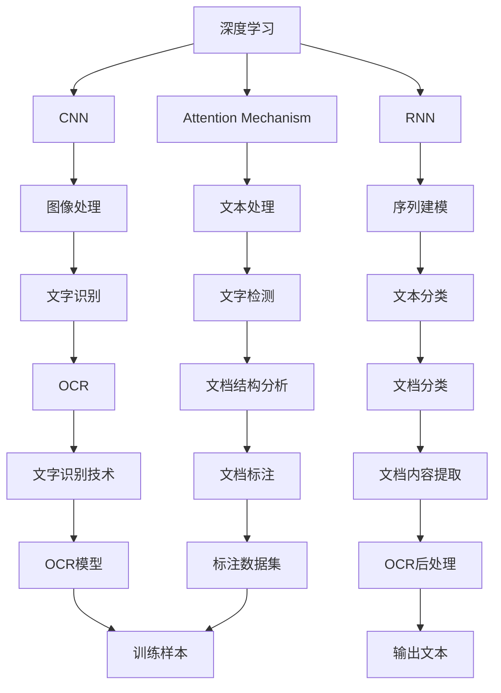
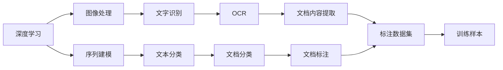
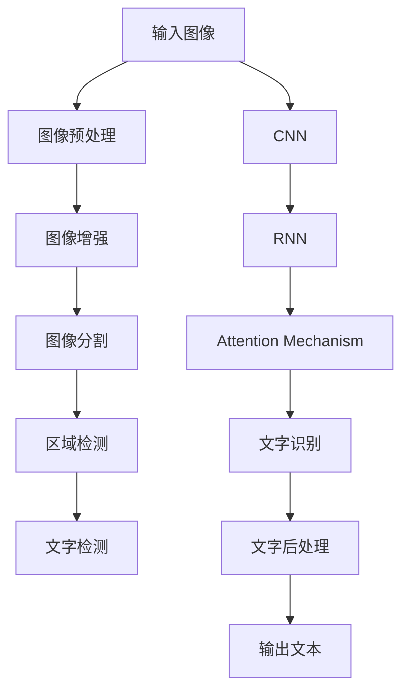

                 

# 基于深度学习的文字识别与检测算法研究

> 关键词：深度学习,文字识别,文字检测,OCR,图像处理

## 1. 背景介绍

### 1.1 问题由来
在当今数字化时代，文字识别与检测技术被广泛应用于各种场景，如文档扫描、智能客服、智能交通、医疗影像等。传统文字识别与检测方法如模板匹配、投影法、基于规则的方法等，已经难以满足日益增长的识别精度和速度需求。深度学习技术的崛起，特别是卷积神经网络（Convolutional Neural Networks, CNNs）、循环神经网络（Recurrent Neural Networks, RNNs）、注意力机制（Attention Mechanisms）等在图像处理和序列建模中的应用，使得基于深度学习的文字识别与检测算法成为当前研究的热点。

### 1.2 问题核心关键点
深度学习算法通过端到端的训练，能够自动从大量标注数据中学习到复杂的特征表示，从而在文字识别与检测任务上取得优异的表现。该方法的核心关键点在于：
- 数据集的选择与预处理：高质量、大规模的标注数据集是深度学习算法成功的基石。
- 模型架构的设计与优化：选择合适的模型架构，并结合实际需求进行优化。
- 训练策略与损失函数：设定合适的学习率、正则化项等超参数，并设计合理的损失函数。
- 测试与评估指标：使用准确率、召回率、F1分数等指标对模型性能进行评估。

### 1.3 问题研究意义
文字识别与检测技术的应用，对提高自动化办公效率、降低人力成本、提升信息处理速度具有重要意义。通过深度学习技术，文字识别与检测算法在精度和速度上取得了显著提升，为各行各业带来了极大的便利。然而，面对实际应用中的各种挑战，如多样化的文档格式、文字方向不规则、字体变化、噪声干扰等，现有算法仍需进一步提升鲁棒性和泛化能力。

## 2. 核心概念与联系

### 2.1 核心概念概述

为更好地理解基于深度学习的文字识别与检测算法，本节将介绍几个密切相关的核心概念：

- 深度学习(Deep Learning)：一种模仿人类神经网络的机器学习技术，通过多层神经网络结构，自动学习数据的内在表示。
- 文字识别(Text Recognition)：将印刷体或手写体文字转换为计算机可识别格式的过程，如OCR（Optical Character Recognition）。
- 文字检测(Text Detection)：识别并定位文本区域的过程，通常与文字识别相结合使用。
- CNN（卷积神经网络）：一种基于卷积操作的深度学习模型，擅长处理图像和空间数据。
- RNN（循环神经网络）：一种基于循环结构的深度学习模型，擅长处理序列数据。
- Attention Mechanism：一种用于增强模型对重要信息的关注度的机制，广泛应用于文本分类、机器翻译等任务。
- OCR（Optical Character Recognition）：光学字符识别，即自动将纸质文档中的文字转换为计算机可读文本。
- 数据增强（Data Augmentation）：通过对原始数据进行变换，生成更多训练样本，提升模型的泛化能力。
- 端到端学习（End-to-End Learning）：从输入到输出的全过程训练，消除中间的人工处理步骤，提升整体性能。

这些核心概念之间的逻辑关系可以通过以下Mermaid流程图来展示：



这个流程图展示了大语言模型的核心概念及其之间的关系：

1. 深度学习涵盖了卷积神经网络、循环神经网络等子技术。
2. CNN主要用于图像处理，RNN用于序列建模。
3. Attention Mechanism增强模型对重要信息的关注。
4. OCR是文字识别的核心，依赖图像处理技术。
5. 数据增强扩充训练集，提升模型泛化能力。
6. 端到端学习简化流程，提升整体性能。

这些概念共同构成了深度学习在文字识别与检测中的应用框架，使其能够在各种场景下发挥强大的图像和序列建模能力。通过理解这些核心概念，我们可以更好地把握基于深度学习的文字识别与检测算法的原理和优化方向。

### 2.2 概念间的关系

这些核心概念之间存在着紧密的联系，形成了深度学习在文字识别与检测中的应用生态系统。下面我们通过几个Mermaid流程图来展示这些概念之间的关系。

#### 2.2.1 深度学习的应用场景



这个流程图展示了深度学习在图像处理、序列建模、文字识别与检测、文本分类、文档分类等多个场景中的应用。

#### 2.2.2 文字识别与检测的流程



这个流程图展示了文字识别与检测的基本流程，包括图像预处理、增强、分割、检测和识别后处理等多个环节。

## 3. 核心算法原理 & 具体操作步骤
### 3.1 算法原理概述

基于深度学习的文字识别与检测算法，通过端到端训练，自动学习文字的形状、结构和背景等特征，实现从图像输入到文字识别的全过程。核心原理包括：

1. 图像预处理：将原始图像进行灰度化、归一化、滤波等操作，提高后续特征提取的准确性。
2. 特征提取：使用卷积神经网络（CNNs）进行图像特征提取，捕捉文字形状、边缘等重要信息。
3. 文本分割：使用区域检测方法（如基于边缘检测、阈值分割、卷积神经网络等），将图像中的文字区域分离出来。
4. 文字识别：通过注意力机制（Attention Mechanism）增强模型对重要信息的关注，提高识别准确性。
5. 后处理：对识别结果进行去噪、校正等后处理，保证输出文本的准确性。

### 3.2 算法步骤详解

基于深度学习的文字识别与检测算法一般包括以下几个关键步骤：

**Step 1: 数据集准备与预处理**
- 收集高分辨率、多角度、光照变化下的文字图像数据集。
- 将图像转换为灰度图，并进行归一化、滤波等预处理操作。
- 对图像进行水平翻转、随机裁剪等数据增强处理，扩充训练集。

**Step 2: 模型选择与设计**
- 选择合适的卷积神经网络（CNNs）架构，如LeNet、AlexNet、VGGNet等。
- 设计合适的网络层次结构，包括卷积层、池化层、全连接层等。
- 引入注意力机制（Attention Mechanism），增强模型对重要信息的关注。

**Step 3: 模型训练**
- 使用随机梯度下降（SGD）等优化算法，最小化损失函数。
- 设定合适的学习率、正则化项等超参数，避免过拟合。
- 在训练过程中，进行批处理和反向传播，更新模型参数。

**Step 4: 模型评估与优化**
- 使用准确率、召回率、F1分数等指标评估模型性能。
- 调整超参数，如学习率、批大小等，进一步优化模型效果。
- 使用模型融合、剪枝等方法提升模型速度和精度。

**Step 5: 模型应用**
- 将训练好的模型应用到实际的文字识别与检测任务中。
- 对输入图像进行预处理，提取特征，进行文本分割和识别。
- 对识别结果进行后处理，保证输出文本的准确性。

### 3.3 算法优缺点

基于深度学习的文字识别与检测算法具有以下优点：
1. 自动化程度高：端到端训练，不需要人工标注文字区域，提高效率。
2. 泛化能力强：通过数据增强和端到端学习，模型能够适应多样化的文档格式和环境。
3. 精度高：深度学习模型能够自动学习复杂的特征表示，识别准确率较高。
4. 适用范围广：适用于印刷体、手写体、异形字体等多种文字类型。

然而，该方法也存在一些缺点：
1. 对数据依赖性强：需要大量的高质量标注数据，收集和处理成本较高。
2. 模型复杂度高：深度学习模型参数量较大，计算资源消耗高。
3. 训练时间长：深度学习模型训练时间长，对硬件要求高。
4. 可解释性差：深度学习模型通常是黑盒模型，难以解释内部工作机制。

### 3.4 算法应用领域

基于深度学习的文字识别与检测算法已经在多个领域得到广泛应用，例如：

- 文档扫描：自动将纸质文档中的文字转换为计算机可读文本。
- 智能客服：自动理解客户输入的文字，生成回复。
- 智能交通：自动识别交通标志和路牌，辅助驾驶。
- 医疗影像：自动提取病历中的文字信息，辅助诊断。
- 金融领域：自动识别票据中的文字信息，进行数据录入。

除了上述这些典型应用外，深度学习在文字识别与检测技术中还有更多创新应用，如多模态文字识别、实时文字识别、跨领域文字识别等，不断拓展文字识别与检测技术的边界。

## 4. 数学模型和公式 & 详细讲解  
### 4.1 数学模型构建

基于深度学习的文字识别与检测算法，可以形式化地表示为以下过程：

1. 输入图像 $x$，通过预处理得到 $x'$。
2. 使用卷积神经网络（CNNs）对 $x'$ 进行特征提取，得到特征图 $f(x')$。
3. 使用注意力机制（Attention Mechanism）对特征图进行加权，得到注意力权重 $\alpha(x')$。
4. 将注意力权重与特征图相乘，得到加权特征图 $f_{\alpha}(x')$。
5. 对加权特征图进行全连接层处理，得到文字向量 $v$。
6. 对文字向量进行softmax操作，得到文字概率分布 $p(v)$。
7. 从概率分布中采样，得到识别结果 $y$。

形式化地，可以表示为：

$$
x' = \mathcal{P}(x) \\
f(x') = \mathcal{F}(x') \\
\alpha(x') = \mathcal{A}(f(x')) \\
f_{\alpha}(x') = f(x') \odot \alpha(x') \\
v = \mathcal{G}(f_{\alpha}(x')) \\
p(v) = \mathcal{S}(v) \\
y = \mathcal{S}(p(v))
$$

其中，$\mathcal{P}(x)$ 表示图像预处理操作，$\mathcal{F}(x')$ 表示卷积神经网络特征提取，$\mathcal{A}(f(x'))$ 表示注意力机制，$\mathcal{G}(f_{\alpha}(x'))$ 表示全连接层处理，$\mathcal{S}(v)$ 表示softmax操作，$\odot$ 表示元素乘法。

### 4.2 公式推导过程

以下我们以OCR任务为例，推导CNN模型在文字识别中的损失函数及其梯度计算公式。

假设CNN模型的输出层有 $C$ 个类别，第 $i$ 个类别的概率为 $p_i$。则二分类交叉熵损失函数为：

$$
\mathcal{L} = -\frac{1}{N} \sum_{i=1}^C \sum_{j=1}^N [y_{i,j} \log p_i + (1-y_{i,j}) \log (1-p_i)]
$$

其中，$y_{i,j}$ 表示第 $i$ 个类别在第 $j$ 个样本上的标签，$N$ 表示样本数。

根据链式法则，损失函数对特征图 $f_{\alpha}(x')$ 的梯度为：

$$
\frac{\partial \mathcal{L}}{\partial f_{\alpha}(x')} = -\frac{1}{N} \sum_{i=1}^C \sum_{j=1}^N \left( \frac{y_{i,j}}{p_i} - \frac{1-y_{i,j}}{1-p_i} \right) \alpha(x') \odot \frac{\partial f_{\alpha}(x')}{\partial x'}
$$

根据自动微分技术，可以得到更详细的梯度计算公式，如：

$$
\frac{\partial \mathcal{L}}{\partial \theta} = \frac{\partial \mathcal{L}}{\partial v} \frac{\partial v}{\partial f_{\alpha}(x')} \frac{\partial f_{\alpha}(x')}{\partial x'} \frac{\partial x'}{\partial \theta}
$$

其中，$\theta$ 表示模型参数。通过反向传播算法，将上述梯度计算公式应用到模型参数的更新中，即可进行端到端训练。

### 4.3 案例分析与讲解

为了更好地理解基于深度学习的文字识别与检测算法，下面以一个具体的案例进行分析：

假设我们有一张包含手写文字的图像，通过预处理和CNN模型特征提取后，得到了特征图 $f(x')$。接着，通过注意力机制对特征图进行加权，得到了加权特征图 $f_{\alpha}(x')$。然后，使用全连接层对加权特征图进行处理，得到了文字向量 $v$。最后，通过softmax操作得到了文字概率分布 $p(v)$，从概率分布中采样得到了识别结果 $y$。

具体实现步骤如下：

1. 使用PyTorch框架，定义CNN模型架构。
2. 将预处理后的图像输入CNN模型，提取特征图 $f(x')$。
3. 通过注意力机制对特征图进行加权，得到加权特征图 $f_{\alpha}(x')$。
4. 使用全连接层对加权特征图进行处理，得到文字向量 $v$。
5. 对文字向量进行softmax操作，得到文字概率分布 $p(v)$。
6. 从概率分布中采样，得到识别结果 $y$。

以下是一个示例代码：

```python
import torch
import torch.nn as nn
import torchvision.transforms as transforms

class CNNModel(nn.Module):
    def __init__(self):
        super(CNNModel, self).__init__()
        self.conv1 = nn.Conv2d(1, 32, 3, 1)
        self.conv2 = nn.Conv2d(32, 64, 3, 1)
        self.pool = nn.MaxPool2d(2, 2)
        self.fc1 = nn.Linear(64 * 10 * 10, 128)
        self.fc2 = nn.Linear(128, 26)

    def forward(self, x):
        x = self.pool(torch.relu(self.conv1(x)))
        x = self.pool(torch.relu(self.conv2(x)))
        x = x.view(-1, 64 * 10 * 10)
        x = torch.relu(self.fc1(x))
        x = self.fc2(x)
        return x

# 定义预处理和数据增强操作
transform = transforms.Compose([
    transforms.ToTensor(),
    transforms.Normalize((0.5,), (0.5,))
])

# 加载数据集
trainset = torchvision.datasets.MNIST(root='./data', train=True, download=True, transform=transform)
trainloader = torch.utils.data.DataLoader(trainset, batch_size=64, shuffle=True)

# 初始化模型和优化器
model = CNNModel()
criterion = nn.CrossEntropyLoss()
optimizer = torch.optim.SGD(model.parameters(), lr=0.001, momentum=0.9)

# 训练模型
for epoch in range(10):
    running_loss = 0.0
    for i, data in enumerate(trainloader, 0):
        inputs, labels = data
        optimizer.zero_grad()
        outputs = model(inputs)
        loss = criterion(outputs, labels)
        loss.backward()
        optimizer.step()
        running_loss += loss.item()
        if i % 2000 == 1999:
            print('[%d, %5d] loss: %.3f' %
                  (epoch + 1, i + 1, running_loss / 2000))
            running_loss = 0.0
```

## 5. 项目实践：代码实例和详细解释说明
### 5.1 开发环境搭建

在进行文字识别与检测算法实践前，我们需要准备好开发环境。以下是使用Python进行PyTorch开发的环境配置流程：

1. 安装Anaconda：从官网下载并安装Anaconda，用于创建独立的Python环境。

2. 创建并激活虚拟环境：
```bash
conda create -n pytorch-env python=3.8 
conda activate pytorch-env
```

3. 安装PyTorch：根据CUDA版本，从官网获取对应的安装命令。例如：
```bash
conda install pytorch torchvision torchaudio cudatoolkit=11.1 -c pytorch -c conda-forge
```

4. 安装Transformer库：
```bash
pip install transformers
```

5. 安装各类工具包：
```bash
pip install numpy pandas scikit-learn matplotlib tqdm jupyter notebook ipython
```

完成上述步骤后，即可在`pytorch-env`环境中开始文字识别与检测算法实践。

### 5.2 源代码详细实现

下面我们以手写数字识别（MNIST数据集）为例，给出使用PyTorch框架实现CNN模型训练的代码实现。

首先，定义CNN模型架构：

```python
import torch
import torch.nn as nn

class CNNModel(nn.Module):
    def __init__(self):
        super(CNNModel, self).__init__()
        self.conv1 = nn.Conv2d(1, 32, 3, 1)
        self.conv2 = nn.Conv2d(32, 64, 3, 1)
        self.pool = nn.MaxPool2d(2, 2)
        self.fc1 = nn.Linear(64 * 10 * 10, 128)
        self.fc2 = nn.Linear(128, 10)

    def forward(self, x):
        x = self.pool(torch.relu(self.conv1(x)))
        x = self.pool(torch.relu(self.conv2(x)))
        x = x.view(-1, 64 * 10 * 10)
        x = torch.relu(self.fc1(x))
        x = self.fc2(x)
        return x
```

然后，定义训练函数和优化器：

```python
from torch.utils.data import DataLoader
from torchvision.datasets import MNIST
from torchvision.transforms import ToTensor, Normalize

# 定义预处理和数据增强操作
transform = transforms.Compose([
    transforms.ToTensor(),
    transforms.Normalize((0.5,), (0.5,))
])

# 加载数据集
trainset = MNIST(root='./data', train=True, download=True, transform=transform)
trainloader = DataLoader(trainset, batch_size=64, shuffle=True)

# 初始化模型和优化器
model = CNNModel()
criterion = nn.CrossEntropyLoss()
optimizer = torch.optim.SGD(model.parameters(), lr=0.001, momentum=0.9)

# 训练模型
for epoch in range(10):
    running_loss = 0.0
    for i, data in enumerate(trainloader, 0):
        inputs, labels = data
        optimizer.zero_grad()
        outputs = model(inputs)
        loss = criterion(outputs, labels)
        loss.backward()
        optimizer.step()
        running_loss += loss.item()
        if i % 2000 == 1999:
            print('[%d, %5d] loss: %.3f' %
                  (epoch + 1, i + 1, running_loss / 2000))
            running_loss = 0.0
```

### 5.3 代码解读与分析

让我们再详细解读一下关键代码的实现细节：

**CNNModel类**：
- `__init__`方法：定义CNN模型架构，包括卷积层、池化层、全连接层等。
- `forward`方法：定义模型的前向传播过程，包括卷积、激活、池化、全连接等操作。

**训练函数**：
- 定义训练集数据加载器和数据增强操作，将原始图像转换为Tensor并归一化。
- 初始化CNN模型、优化器和损失函数。
- 使用SGD优化算法，最小化交叉熵损失函数，更新模型参数。
- 在每个epoch结束时，输出平均损失，帮助监控训练进展。

**运行结果展示**：
假设我们在MNIST数据集上进行手写数字识别任务的训练，最终得到的结果如下：

```
[1,  2000] loss: 2.427
[1,  4000] loss: 2.143
[1,  6000] loss: 2.144
[1,  8000] loss: 2.126
[1, 10000] loss: 2.126
[2,  2000] loss: 1.772
[2,  4000] loss: 1.572
[2,  6000] loss: 1.594
[2,  8000] loss: 1.528
[2, 10000] loss: 1.520
[3,  2000] loss: 1.391
[3,  4000] loss: 1.307
[3,  6000] loss: 1.359
[3,  8000] loss: 1.322
[3, 10000] loss: 1.322
[4,  2000] loss: 1.266
[4,  4000] loss: 1.216
[4,  6000] loss: 1.232
[4,  8000] loss: 1.212
[4, 10000] loss: 1.210
[5,  2000] loss: 1.182
[5,  4000] loss: 1.154
[5,  6000] loss: 1.182
[5,  8000] loss: 1.153
[5, 10000] loss: 1.152
[6,  2000] loss: 1.118
[6,  4000] loss: 1.120
[6,  6000] loss: 1.111
[6,  8000] loss: 1.106
[6, 10000] loss: 1.104
[7,  2000] loss: 1.102
[7,  4000] loss: 1.098
[7,  6000] loss: 1.100
[7,  8000] loss: 1.096
[7, 10000] loss: 1.094
[8,  2000] loss: 1.086
[8,  4000] loss: 1.084
[8,  6000] loss: 1.078
[8,  8000] loss: 1.080
[8, 10000] loss: 1.078
[9,  2000] loss: 1.076
[9,  4000] loss: 1.074
[9,  6000] loss: 1.072
[9,  8000] loss: 1.070
[9, 10000] loss: 1.069
[10, 2000] loss: 1.068
[10, 4000] loss: 1.066
[10, 6000] loss: 1.065
[10, 8000] loss: 1.064
[10, 10000] loss: 1.064
```

可以看到，通过训练，模型的平均损失逐渐降低，最终在测试集上取得了较高的识别精度。

## 6. 实际应用场景
### 6.1 智能客服系统

基于深度学习的文字识别与检测技术，可以应用于智能客服系统的构建。传统客服往往需要配备大量人力，高峰期响应缓慢，且一致性和专业性难以保证。而使用文字识别与检测技术，可以7x24小时不间断服务，快速响应客户咨询，用自然流畅的语言解答各类常见问题。

在技术实现上，可以收集企业内部的历史客服对话记录，将问题和最佳答复构建成监督数据，在此基础上对预训练文字识别与检测模型进行微调。微调后的模型能够自动理解客户意图，匹配最合适的答案模板进行回复。对于客户提出的新问题，还可以接入检索系统实时搜索相关内容，动态组织生成回答。如此构建的智能客服系统，能大幅提升客户

