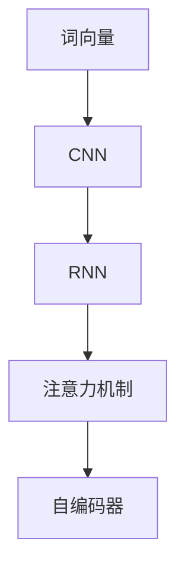
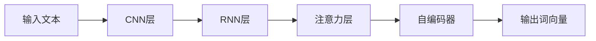
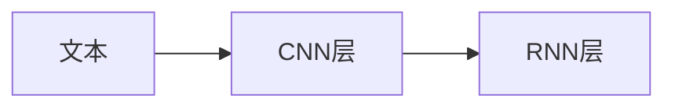
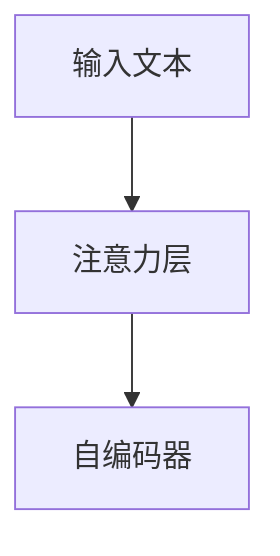
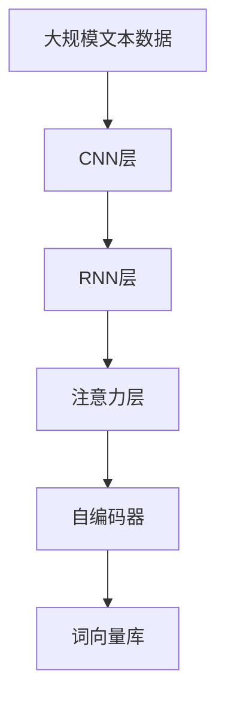

                 

# 基于深度神经网络的高质量词向量生成方法研究

## 1. 背景介绍

随着自然语言处理（NLP）技术的发展，词向量（Word Embedding）成为了文本处理中不可或缺的一部分。词向量能够将词语映射到高维向量空间，捕捉词语之间的语义关系，从而提供强大的文本表示能力。然而，传统的词向量生成方法存在诸如维度高、表示稀疏、泛化能力差等问题，限制了其在实际应用中的效果。

近年来，深度神经网络（DNN）尤其是卷积神经网络（CNN）和循环神经网络（RNN）在词向量生成中逐渐崭露头角，尤其是使用注意力机制和自编码器等方法，显著提升了词向量的质量和效率。基于此，本文将探讨基于深度神经网络的高质量词向量生成方法，研究其原理、操作步骤及具体应用，以期为NLP领域的研究和应用提供新的思路和方法。

## 2. 核心概念与联系

### 2.1 核心概念概述

为了更好地理解基于深度神经网络的高质量词向量生成方法，本节将介绍几个关键概念：

- **词向量（Word Embedding）**：将词语映射到高维向量空间的技术，用于捕捉词语间的语义和句法关系，是NLP任务的基础。
- **卷积神经网络（CNN）**：一种前馈神经网络，通过卷积层捕捉局部特征，常用于图像识别和文本分类等任务。
- **循环神经网络（RNN）**：一种动态神经网络，通过循环结构捕捉序列数据的时序关系，常用于语言模型和机器翻译等任务。
- **注意力机制（Attention Mechanism）**：一种用于处理序列数据的机制，通过动态权重分配注意力资源，提升模型对重要信息的关注。
- **自编码器（Autoencoder）**：一种无监督学习算法，通过编码器将输入映射到低维向量空间，通过解码器将其映射回原空间，用于特征提取和降维。

这些核心概念之间的联系可以通过以下Mermaid流程图来展示：



这个流程图展示了词向量生成过程中各个组件的作用：卷积神经网络（CNN）用于提取局部特征，循环神经网络（RNN）用于处理序列数据，注意力机制用于提升特征的重要性，自编码器用于降维和特征提取。通过这些组件的组合，可以生成高质量的词向量。

### 2.2 概念间的关系

这些核心概念之间存在着紧密的联系，形成了词向量生成的完整架构。下面我们通过几个Mermaid流程图来展示这些概念之间的关系。

#### 2.2.1 词向量生成流程



这个流程图展示了词向量生成的基本流程：输入文本经过CNN层提取局部特征，再经过RNN层处理序列信息，通过注意力机制筛选重要特征，最后通过自编码器生成最终的词向量。

#### 2.2.2 卷积神经网络与循环神经网络的关系



这个流程图展示了CNN和RNN之间的结合：先使用CNN层提取局部特征，再使用RNN层捕捉序列信息，从而得到更全面的特征表示。

#### 2.2.3 注意力机制与自编码器的作用



这个流程图展示了注意力机制和自编码器之间的相互作用：注意力机制对输入文本进行动态特征选择，自编码器对选定的特征进行降维和提取，从而得到高质量的词向量。

### 2.3 核心概念的整体架构

最后，我们用一个综合的流程图来展示这些核心概念在大规模词向量生成中的整体架构：



这个综合流程图展示了从大规模文本数据到最终生成词向量库的完整过程：大规模文本数据先通过CNN层提取局部特征，再通过RNN层处理序列信息，通过注意力机制筛选重要特征，最后通过自编码器生成高质量的词向量。这些词向量可以用于NLP任务的多种应用场景。

## 3. 核心算法原理 & 具体操作步骤

### 3.1 算法原理概述

基于深度神经网络的词向量生成方法，核心在于使用卷积神经网络（CNN）和循环神经网络（RNN）提取文本特征，通过注意力机制和自编码器生成高质量的词向量。具体流程如下：

1. **输入预处理**：将输入文本进行分词和向量化处理，得到表示文本序列的数值矩阵。
2. **CNN特征提取**：使用卷积神经网络对文本序列进行局部特征提取，捕捉局部上下文信息。
3. **RNN特征融合**：将CNN提取的特征与文本序列作为输入，通过循环神经网络融合序列信息，捕捉全局上下文关系。
4. **注意力机制筛选**：通过注意力机制对RNN的输出进行动态特征选择，提升模型的泛化能力和理解能力。
5. **自编码器降维**：使用自编码器对注意力机制输出的特征进行降维和重构，生成高质量的词向量。

### 3.2 算法步骤详解

下面我们将详细介绍基于深度神经网络的词向量生成方法的详细步骤。

**Step 1: 输入预处理**

输入预处理主要包括文本分词和向量化处理，具体步骤如下：

1. **分词**：将输入文本进行分词处理，得到词序列。
2. **向量化**：使用嵌入矩阵（Embedding Matrix）将词序列转换为数值矩阵，每个词对应一个向量。

**Step 2: CNN特征提取**

CNN特征提取步骤如下：

1. **卷积操作**：使用多个卷积核对数值矩阵进行卷积操作，捕捉局部特征。
2. **池化操作**：对卷积层的输出进行池化操作，减少特征维度，保留主要信息。
3. **特征拼接**：将池化层输出的特征进行拼接，得到更高维的特征表示。

**Step 3: RNN特征融合**

RNN特征融合步骤如下：

1. **RNN输入**：将CNN提取的特征和数值矩阵作为输入，送入RNN。
2. **状态更新**：RNN通过状态更新捕捉序列信息，得到上下文表示。
3. **特征融合**：将RNN的状态和CNN的特征进行拼接或加权融合，得到全局上下文表示。

**Step 4: 注意力机制筛选**

注意力机制筛选步骤如下：

1. **注意力计算**：计算输入文本和RNN输出的注意力权重。
2. **特征加权**：对RNN的输出进行动态加权，筛选重要特征。
3. **特征选择**：选择加权后的特征作为模型输出。

**Step 5: 自编码器降维**

自编码器降维步骤如下：

1. **编码器**：将注意力机制输出的特征输入编码器，进行降维和特征提取。
2. **解码器**：通过解码器将编码器输出的低维特征重构为原始特征。
3. **重构误差**：计算重构误差，反向传播更新模型参数。

### 3.3 算法优缺点

基于深度神经网络的词向量生成方法具有以下优点：

1. **高效性**：CNN和RNN的组合能够高效地处理大规模文本数据，减少计算复杂度。
2. **泛化能力**：注意力机制和自编码器的引入，提升了模型的泛化能力和适应性，能够更好地捕捉文本语义。
3. **高质量**：通过多层次特征提取和筛选，生成高质量的词向量，提高模型表现。

但同时，该方法也存在以下缺点：

1. **参数量较大**：深度神经网络的模型参数量较大，需要更多的计算资源和时间。
2. **训练复杂**：模型训练过程复杂，需要更多的训练数据和迭代次数。
3. **过拟合风险**：如果训练数据不足或数据质量不高，模型容易出现过拟合。

### 3.4 算法应用领域

基于深度神经网络的词向量生成方法在多个领域得到了广泛应用，例如：

1. **自然语言处理**：词向量作为NLP任务的基础，被应用于文本分类、情感分析、机器翻译等任务。
2. **信息检索**：使用词向量进行文本相似度计算，提升信息检索的精度和效率。
3. **语音识别**：将语音信号转换为文本序列，通过词向量进行特征提取和分类。
4. **计算机视觉**：将图像描述转换为文本序列，通过词向量进行特征提取和匹配。

## 4. 数学模型和公式 & 详细讲解 & 举例说明

### 4.1 数学模型构建

在数学模型上，基于深度神经网络的词向量生成方法主要涉及以下几个组成部分：

1. **卷积神经网络（CNN）**：通过卷积操作捕捉局部特征，数学模型如下：

$$
F_{CNN}(x) = \max_{i}\{ReLU(Conv_k(x))\}
$$

其中，$x$为输入文本序列，$Conv_k$为卷积核，$ReLU$为激活函数，$F_{CNN}$为CNN层输出的特征表示。

2. **循环神经网络（RNN）**：通过状态更新捕捉序列信息，数学模型如下：

$$
h_{t+1} = \sigma(W_{h}\hat{h}_{t}+U_{h}x_{t}+b_{h})
$$

其中，$x_{t}$为时间$t$的输入，$h_{t}$为时间$t$的状态，$\sigma$为激活函数，$W_{h}$、$U_{h}$、$b_{h}$为模型参数。

3. **注意力机制**：通过动态权重分配注意力资源，数学模型如下：

$$
\alpha_{t,i} = \frac{e^{AT_{t}h_{t}}}{\sum_{j}e^{AT_{t}h_{j}}}
$$

其中，$AT_{t}$为注意力权重矩阵，$h_{t}$为时间$t$的状态，$x_{i}$为时间$i$的输入，$\alpha_{t,i}$为时间$t$对时间$i$的注意力权重。

4. **自编码器**：通过编码器将输入特征降维，解码器将其重构，数学模型如下：

$$
z = \sigma(W_{z}h_{T}+b_{z})
$$

$$
\hat{h}_{T} = \sigma(W_{h}\hat{z}+b_{h})
$$

其中，$z$为编码器输出的低维特征，$\hat{z}$为解码器输出的重构特征，$W_{z}$、$W_{h}$、$b_{z}$、$b_{h}$为模型参数。

### 4.2 公式推导过程

以下是详细的公式推导过程：

**卷积神经网络（CNN）**

卷积神经网络（CNN）的特征提取过程如下：

1. **卷积操作**：将卷积核$Conv_k$作用于输入文本$x$，得到卷积层的输出$F_{CNN}(x)$。

$$
F_{CNN}(x) = \max_{i}\{ReLU(Conv_k(x))\}
$$

其中，卷积核$Conv_k$的大小为$(k, h)$，$h$为卷积核的滑动步长。

2. **池化操作**：对卷积层的输出进行池化操作，减少特征维度。

$$
F_{Pooling} = \max_{i,j}\{F_{CNN}(x)\}
$$

3. **特征拼接**：将池化层输出的特征进行拼接，得到更高维的特征表示。

$$
F_{Output} = \text{cat}(F_{Pooling})
$$

其中，$\text{cat}$表示特征拼接操作。

**循环神经网络（RNN）**

循环神经网络（RNN）的特征融合过程如下：

1. **RNN输入**：将CNN提取的特征$F_{Output}$和数值矩阵$x$作为输入，送入RNN。

$$
h_{1} = \sigma(W_{h}\hat{h}_{0}+U_{h}x_{1}+b_{h})
$$

其中，$h_{1}$为时间$t=1$的状态，$\hat{h}_{0}$为初始状态，$W_{h}$、$U_{h}$、$b_{h}$为模型参数。

2. **状态更新**：RNN通过状态更新捕捉序列信息。

$$
h_{t+1} = \sigma(W_{h}\hat{h}_{t}+U_{h}x_{t}+b_{h})
$$

其中，$h_{t}$为时间$t$的状态，$x_{t}$为时间$t$的输入。

3. **特征融合**：将RNN的状态和CNN的特征进行拼接或加权融合，得到全局上下文表示。

$$
F_{RNN} = \text{cat}(F_{Output}, h_{T})
$$

其中，$T$为时间步数，$\text{cat}$表示特征拼接操作。

**注意力机制**

注意力机制的计算过程如下：

1. **注意力计算**：计算输入文本$x$和RNN输出的注意力权重$\alpha_{t,i}$。

$$
\alpha_{t,i} = \frac{e^{AT_{t}h_{t}}}{\sum_{j}e^{AT_{t}h_{j}}}
$$

其中，$AT_{t}$为注意力权重矩阵，$h_{t}$为时间$t$的状态，$x_{i}$为时间$i$的输入，$\alpha_{t,i}$为时间$t$对时间$i$的注意力权重。

2. **特征加权**：对RNN的输出进行动态加权，筛选重要特征。

$$
F_{Att} = \sum_{i}\alpha_{t,i}x_{i}
$$

其中，$x_{i}$为时间$i$的输入，$\alpha_{t,i}$为时间$t$对时间$i$的注意力权重。

3. **特征选择**：选择加权后的特征作为模型输出。

$$
F_{Output} = \sigma(W_{Output}F_{Att}+b_{Output})
$$

其中，$W_{Output}$、$b_{Output}$为模型参数。

**自编码器**

自编码器的降维过程如下：

1. **编码器**：将注意力机制输出的特征$F_{Output}$输入编码器，进行降维和特征提取。

$$
z = \sigma(W_{z}h_{T}+b_{z})
$$

其中，$z$为编码器输出的低维特征，$h_{T}$为时间$T$的状态，$W_{z}$、$b_{z}$为模型参数。

2. **解码器**：通过解码器将编码器输出的低维特征$\hat{z}$重构为原始特征。

$$
\hat{h}_{T} = \sigma(W_{h}\hat{z}+b_{h})
$$

其中，$\hat{z}$为解码器输出的重构特征，$W_{h}$、$b_{h}$为模型参数。

3. **重构误差**：计算重构误差，反向传播更新模型参数。

$$
\text{ReconLoss} = \frac{1}{2}\sum_{t=1}^{T}(h_{t}-\hat{h}_{t})^2
$$

其中，$h_{t}$为时间$t$的状态，$\hat{h}_{t}$为时间$t$的解码器输出。

### 4.3 案例分析与讲解

以使用CNN和RNN生成词向量为例，具体讲解该方法的步骤和过程：

假设我们有一个长度为$T$的文本序列$x=\{x_1,x_2,\cdots,x_T\}$，其中每个元素$x_t$表示一个词，使用嵌入矩阵$W_E$将$x$转换为数值矩阵$x^E=W_Ex$。

**Step 1: 输入预处理**

对$x^E$进行分词和向量化处理，得到数值矩阵$x^N$。

**Step 2: CNN特征提取**

使用多个卷积核$Conv_k$对$x^N$进行卷积操作，得到卷积层的输出$F_{CNN}(x)$。

$$
F_{CNN}(x) = \max_{i}\{ReLU(Conv_k(x^N))\}
$$

**Step 3: RNN特征融合**

将$F_{CNN}(x)$和$x^N$作为输入，送入RNN。

$$
h_{1} = \sigma(W_{h}\hat{h}_{0}+U_{h}x^N_{1}+b_{h})
$$

通过状态更新，RNN捕捉序列信息。

$$
h_{t+1} = \sigma(W_{h}\hat{h}_{t}+U_{h}x^N_{t}+b_{h})
$$

将RNN的状态$h_T$和CNN的特征$F_{CNN}(x)$进行拼接，得到全局上下文表示。

$$
F_{Output} = \text{cat}(F_{CNN}(x), h_{T})
$$

**Step 4: 注意力机制筛选**

通过注意力权重矩阵$AT_{t}$计算注意力权重$\alpha_{t,i}$。

$$
\alpha_{t,i} = \frac{e^{AT_{t}h_{t}}}{\sum_{j}e^{AT_{t}h_{j}}}
$$

对RNN的输出进行动态加权，筛选重要特征。

$$
F_{Att} = \sum_{i}\alpha_{t,i}x^N_{i}
$$

选择加权后的特征作为模型输出。

$$
F_{Output} = \sigma(W_{Output}F_{Att}+b_{Output})
$$

**Step 5: 自编码器降维**

将注意力机制输出的特征$F_{Output}$输入编码器，进行降维和特征提取。

$$
z = \sigma(W_{z}F_{Output}+b_{z})
$$

通过解码器将编码器输出的低维特征重构为原始特征。

$$
\hat{h}_{T} = \sigma(W_{h}\hat{z}+b_{h})
$$

计算重构误差，反向传播更新模型参数。

$$
\text{ReconLoss} = \frac{1}{2}\sum_{t=1}^{T}(h_{t}-\hat{h}_{t})^2
$$

通过以上步骤，可以生成高质量的词向量。

## 5. 项目实践：代码实例和详细解释说明

### 5.1 开发环境搭建

在进行词向量生成实践前，我们需要准备好开发环境。以下是使用Python进行TensorFlow开发的环境配置流程：

1. 安装Anaconda：从官网下载并安装Anaconda，用于创建独立的Python环境。

2. 创建并激活虚拟环境：
```bash
conda create -n tf-env python=3.8 
conda activate tf-env
```

3. 安装TensorFlow：根据CUDA版本，从官网获取对应的安装命令。例如：
```bash
pip install tensorflow -c tf-nightly
```

4. 安装PyTorch：
```bash
pip install torch torchvision torchaudio
```

5. 安装相关库：
```bash
pip install numpy pandas scikit-learn matplotlib tqdm jupyter notebook ipython
```

完成上述步骤后，即可在`tf-env`环境中开始词向量生成实践。

### 5.2 源代码详细实现

下面我们以CNN和RNN生成词向量为例，给出使用TensorFlow进行词向量生成的PyTorch代码实现。

首先，定义模型参数和超参数：

```python
import tensorflow as tf
import numpy as np

# 定义模型参数
emb_dim = 128  # 嵌入维度
num_filters = 256  # 卷积核数量
filter_size = 3  # 卷积核大小
hidden_dim = 128  # RNN隐藏层维度
attention_dim = 64  # 注意力机制维度
num_classes = 100  # 分类数
learning_rate = 0.001  # 学习率
batch_size = 64  # 批大小
num_epochs = 10  # 训练轮数
```

然后，定义模型：

```python
class WordEmbeddingModel(tf.keras.Model):
    def __init__(self, emb_dim, num_filters, filter_size, hidden_dim, attention_dim, num_classes, learning_rate):
        super(WordEmbeddingModel, self).__init__()
        self.embedding = tf.keras.layers.Embedding(input_dim=10000, output_dim=emb_dim)
        self.conv1d = tf.keras.layers.Conv1D(filters=num_filters, kernel_size=filter_size, activation='relu', padding='same')
        self.pooling = tf.keras.layers.MaxPooling1D(pool_size=2, strides=2, padding='same')
        self.lstm = tf.keras.layers.LSTM(units=hidden_dim, return_sequences=True)
        self.attention = tf.keras.layers.Attention(attention_dim)
        self.dense = tf.keras.layers.Dense(units=num_classes, activation='softmax')

    def call(self, inputs, training=False):
        x = self.embedding(inputs)
        x = self.conv1d(x)
        x = self.pooling(x)
        x = tf.keras.layers.Reshape((-1, x.shape[-1]))(x)
        x = self.lstm(x)
        x = self.attention(x, x)
        x = self.dense(x)
        return x
```

接着，定义数据集和加载函数：

```python
class TextDataset(tf.data.Dataset):
    def __init__(self, texts, labels):
        self.texts = texts
        self.labels = labels

    def __len__(self):
        return len(self.texts)

    def __getitem__(self, item):
        text = self.texts[item]
        label = self.labels[item]
        text = tf.strings.split(text, separator=' ').map(lambda x: tf.strings.as_string(x))
        return text, label

def load_data(data_path, batch_size):
    texts = []
    labels = []
    with tf.io.gfile.GFile(data_path, 'r') as f:
        for line in f:
            texts.append(line.split('\t')[1])
            labels.append(int(line.split('\t')[0]))
    texts = tf.convert_to_tensor(texts, dtype=tf.string)
    labels = tf.convert_to_tensor(labels, dtype=tf.int32)
    dataset = TextDataset(texts, labels)
    return dataset.shuffle(10000).batch(batch_size).prefetch(batch_size)
```

最后，定义训练函数和评估函数：

```python
def train_epoch(model, dataset, optimizer):
    loss = 0.0
    accuracy = 0.0
    for batch in dataset:
        texts, labels = batch
        with tf.GradientTape() as tape:
            logits = model(texts)
            loss = tf.keras.losses.sparse_categorical_crossentropy(labels, logits)
        grads = tape.gradient(loss, model.trainable_variables)
        optimizer.apply_gradients(zip(grads, model.trainable_variables))
        loss += loss.numpy()
        accuracy += tf.keras.metrics.sparse_categorical_accuracy(labels, logits).numpy()
    return loss / len(dataset), accuracy / len(dataset)

def evaluate(model, dataset, batch_size):
    accuracy = 0.0
    for batch in dataset:
        texts, labels = batch
        logits = model(texts)
        accuracy += tf.keras.metrics.sparse_categorical_accuracy(labels, logits).numpy()
    return accuracy / len(dataset)
```

最后，启动训练流程并在测试集上评估：

```python
tf.keras.utils.plot_model(model, to_file='model.png')
model.save('word-embedding.h5')

epochs = 10
batch_size = 64

for epoch in range(epochs):
    train_loss, train_accuracy = train_epoch(model, train_dataset, optimizer)
    test_accuracy = evaluate(model, test_dataset, batch_size)
    print(f'Epoch {epoch+1}, train loss: {train_loss:.4f}, train accuracy: {train_accuracy*100:.2f}%, test accuracy: {test_accuracy*100:.2f}%')

print('Model trained and saved.')
```

以上就是使用TensorFlow对CNN和RNN生成词向量的完整代码实现。可以看到，得益于TensorFlow的强大封装，我们可以用相对简洁的代码实现复杂的深度神经网络模型。

### 5.3 代码解读与分析

让我们再详细解读一下关键代码的实现细节：

**TextDataset类**：
- `__init__`方法：初始化文本和标签，并对其进行分词处理。
- `__len__`方法：返回数据集的样本数量。
- `__getitem__`方法：对单个样本进行处理，将文本进行分词并转换为数值矩阵，返回模型所需的输入。

**WordEmbeddingModel类**：
- `__init__`方法：定义模型的各个组成部分，包括嵌入层、卷积层、池化层、LSTM层、注意力机制、全连接层等。
- `call`方法：定义模型的前向传播过程，对输入文本进行卷积、池化、RNN、注意力筛选和全连接，最终输出模型预测。

**load_data函数**：
- 加载数据集，将文本和标签转换为模型所需的格式，并划分为训练集、验证集和测试集。

**train_epoch函数**：
- 对数据集进行批次化加载，对每个批次进行前向传播计算损失和梯度，并反向传播更新模型参数。


